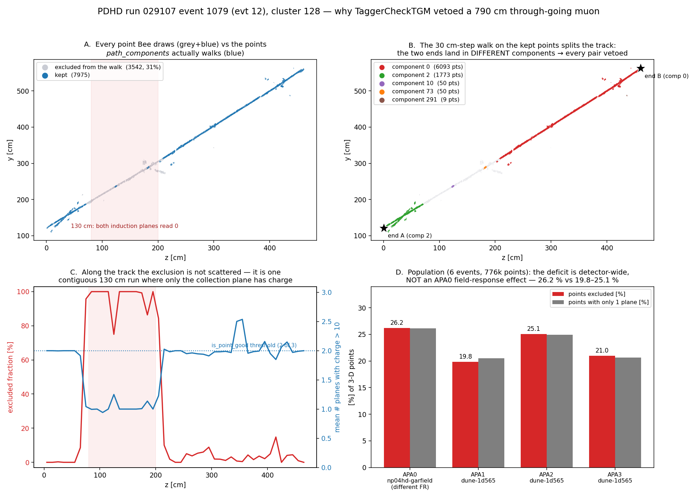
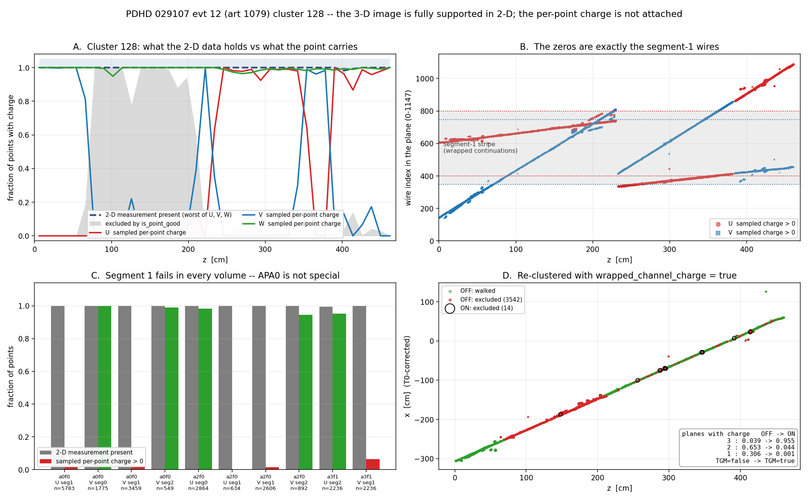

# doc pdhd/04 -- the STM tagger's own population on PDHD: a Bee scan set, and where the candidates die

**Status (2026-09-06, owner request).** Owner observation: *"the STM tagger does not really pick
too many real STM with Michel electrons, unlike the PDVD; the chain may still have some issues."*
This doc delivers (a) a Bee set of six PDHD events showing the STM tagger's **fitted** population
with its Steiner graph, Steiner terminals, cluster image and fit trajectory, and (b) the
tagger-level census that says where the candidates are lost, PDHD against PDVD.
**No code or config is changed by this doc.**

**Sec 9 (2026-09-06, third owner question) EXECUTES the fix**: both wrapped-channel knobs now
default ON in C++, PDHD's clustering job is flipped, and a fourth, previously unknobbed instance of
the same defect (`ChargeStepped`) is fixed.  Sec 9.2 answers "is this the one we fixed yesterday?"
-- same defect, same call site, a different binding -- and sec 9.3 is the audit.

**Sec 8 (2026-09-06, second owner question) is the load-bearing result.**  Following the 3-D image
against the 2-D measurement point by point: the image is supported by measured charge in **all
three** views at 99.9 % of cluster 128's points, including 100 % of the points the tagger threw
away.  The zeros are the wrapped strips' **segment-1** wires -- the `IWirePlane::channels()`
lookup defect -- and the fix knob exists but is still `false` in the **clustering** job that
writes the persisted pctree.  Re-clustering the same event with it true takes the cluster's
excluded points 3542 -> 14 and its verdict `TGM=false` -> `TGM=true`.  Secs 2-4's population
numbers are all measured on the unfixed cloud.

## 0. Repro

```
cd /home/xqian/toolkit-dev/toolkit/pdhd
# the six arms (chain UP TO the STM tagger; fresh tag, pinned libs -- M1/shared-tree rule)
ARM=d04bee PIN=<libpin dir> MODE=-stm EVENTS="0 1 12 16 20 22" ./docs/scripts/run_d03_arms.sh
# the combined Bee set (order = Bee index order, fixed forever once uploaded)
./docs/scripts/d04_bee_pr_combine.sh d04bee 029107 -e 12,1,16,20,22,0
BROWSER=echo ./upload-to-bee.sh bee-pr-run029107-d04bee.zip
# per-event census of the tagger itself (reads the PR log + the Bee zip, never a log-line count)
python3 docs/scripts/d04_stm_tagger_census.py work/029107_{12,1,16,20,22,0}_d04bee
# the population TSV of sec 3 (PDHD arm d03nu9 x30, PDVD arm d48nu3 x120 -- both pre-existing)
#   -> docs/figs/d04_stm_tagger_census.tsv
# sec 6, the cluster-128 knob arms (evt 12 only; -A for STRING TLAs, -S evaluates as jsonnet)
ARM=d04tgmA  PIN=<pin> MODE=-stm EVENTS="12" EXTRA="-S tgm_chord_charge=false"   ./docs/scripts/run_d03_arms.sh
ARM=d04tgmB  ... EXTRA="-S tgm_main_pair=false"      ARM=d04tgmC ... EXTRA="-S tgm_chord_charge=false -S tgm_main_pair=false"
ARM=d04tgmD2 ... EXTRA="-A tgm_main_pair_mode=path"  ARM=d04tgmE2 ... EXTRA="-A tgm_chord_mode=chord"
# the causal control: production knobs, steiner stage removed
LD_LIBRARY_PATH=<pin> ./run_pr_evt.sh -s d04tgmF \
    -pipe switch_scope,flag_mains,fiducialutils,tagger_check_tgm 029107 12
grep 'TaggerCheckTGM: cluster 128 ' work/029107_12_*/wct_pr_029107_12.log
# sec 7, the point-level probe (env-gated in clus/src/TaggerCheckTGM.cxx; inert when unset)
./wcb build --notests -p            # build only -- do NOT install, keep local/lib as the gate pin
PIN=<dir with local/lib's libWireCell*.so + build/clus/libWireCellClus.so>
LD_LIBRARY_PATH=$PIN WCT_TGM_PATH_DUMP=128 WCT_TGM_PATH_DUMP_DIR=<out> \
    ./run_pr_evt.sh -s d04probe -stm -stm-fit 029107 12      # one cluster
LD_LIBRARY_PATH=$PIN WCT_TGM_PATH_DUMP=-1  WCT_TGM_PATH_DUMP_DIR=<out> \
    ./run_pr_evt.sh -s d04prb   -stm        029107 <evt>     # every evaluated cluster
python3 docs/scripts/d04_cluster128_plot.py docs/figs/d04_tgm_path_cluster128.csv.gz \
    docs/figs/d04_exclusion_by_apa.tsv -o docs/figs/d04_cluster128_path_veto.png

# sec 8, the 3-D-vs-2-D consistency probe (same env var; the probe now also dumps, per point
# and per plane, the ctpc 2-D measurement at the point's own wire and tick, in the RAW frame)
LD_LIBRARY_PATH=$PIN WCT_TGM_PATH_DUMP=128 WCT_TGM_PATH_DUMP_DIR=<out/off> \
    ./run_pr_evt.sh -s d05p  -stm-fit 029107 12          # production pctree
# the causal control: re-cluster the SAME imaging with the wrapped-channel lookup fixed
PDHD_CLUS_TLA="-S wrapped_channel_charge=true" \
    ./run_clus_evt.sh -s d05wc -save-pctree 029107 12    # 75 s; writes a new pctree
# sec 9, after the default flip the TLA is no longer needed -- arm d05prod reproduces
# d05wc byte for byte, and -S wrapped_channel_charge=false reproduces the old behaviour
./run_clus_evt.sh -s d05prod -save-pctree 029107 12
LD_LIBRARY_PATH=$PIN WCT_TGM_PATH_DUMP=-1  WCT_TGM_PATH_DUMP_DIR=<out/on> \
    ./run_pr_evt.sh -s d05wc -stm-fit 029107 12
python3 docs/scripts/d04_cluster128_wrapped.py <out/off> <out/on> \
    docs/figs/d04_cluster128_wrapped.png
```

> **Pin provenance (2026-09-06).**  The `$PIN` directory that produced sec 7's numbers was
> **overwritten in-session** while assembling the sec 8 probe build (a `cp` followed a symlink).
> No gate depends on re-running it -- the recorded member hashes stand -- but a reader
> re-deriving sec 7 must rebuild that pin from toolkit `d44405ca` (sec 8's pin is `7887b05b`;
> the two give the same output with `WCT_TGM_PATH_DUMP` unset, which is what the gate below says).

Binary: `libWireCellClus b46179b2` = toolkit `5d0b4e77` plus the uncommitted doc sbnd_xin/pr/143
`break_segment` edits of a concurrent session.  `break_segment` has no caller in
`TaggerCheckSTM.cxx`, and the claim is **gated, not argued**: event 0's `mabc-pr.zip` member
content hashes (`abtest/hash_archive.py`) are IDENTICAL to arm `d03stmnew11`, which ran the same
event on the shipped pin `new11` (`a4ff5439`).  The `-stm` chain is unmoved.

## 1. The Bee set

<https://www.phy.bnl.gov/twister/bee/set/1450e84b-009b-4779-a14a-88c14e3d4fae/event/list/>

| bee idx | evt | art event | mains | **fitted** (= the 4 STM layers) | **tagged** (`stm_tagged`) |
|---|---|---|---|---|---|
| 0 | 12 | 1079 | 96 | 29 | 8 |
| 1 | 1 | 991 | 99 | 25 | 7 |
| 2 | 16 | 1111 | 103 | 32 | 7 |
| 3 | 20 | 1143 | 150 | 29 | 9 |
| 4 | 22 | 1159 | 92 | 22 | 5 |
| 5 | 0 | 983 | 98 | 27 | 2 |

Layers per event: `clustering` (every main), then `stm` (3-D image), `steiner_graph` (Steiner
node cloud, `real_cluster_id` 1 on terminals), `steiner_terminals` (that cloud thinned to
terminals) and `stm_fit` (the fit trajectory, q = dQ*0.1 - 1000) -- all four scoped to the
clusters the tagger **fitted** (`require_pc:'stm_fit'`), so they agree object-for-object; plus
`stm_tagged`, the `flag_STM` verdict subset, and the dead-area layers.

**Scope note.** PDHD carries the *fitted* scope (doc pdvd/39 round 2).  PDVD's nominal since the
owner's 2026-09-05 decision (doc pdvd/39 round 3) is `require_flag:'STM'` -- the *tagged* set, and
its `stm_tagged` layer is gone.  On evt 0 that is 27 objects vs 2.  This set is the fitted scope,
per the request's wording; `stm_tagged` is in the same view for the verdict subset.

Frame check: every cluster's `stm_fit` trajectory lies inside its own `stm` cloud bounding box
(0/27 escapes on evt 0), so the fit and the image are in the same drift frame -- the trap of
`feedback_frame_mismatch_hides_at_small_t0` does not apply here.

## 2. Where the mains are lost before a fit exists

Per-main, over the 30-event arm `d03nu9` (PDHD 029107) and the 120-event arm `d48nu3` (PDVD):

| | PDHD /evt | PDVD /evt | PDHD % of mains | PDVD % of mains |
|---|---|---|---|---|
| mains evaluated by `TaggerCheckSTM` | 74.9 | 38.2 | -- | -- |
| **fitted** (the 4 Bee layers) | 26.0 | 14.8 | 34.8 % | 38.7 % |
| **tagged** STM | 5.8 | 5.0 | 7.7 % | 13.0 % |

No-fit reasons (distinct clusters):

| reason | PDHD | PDVD |
|---|---|---|
| evaluated, no pass recorded (exited after the round-1 fit) | 1465 (65 %) | 2810 (61 %) |
| fully contained ("Mid Point A" pre-fit exit test) | 1073 (48 %) | 2544 (55 %) |
| **no `steiner_pc`** | **319 (14.2 %)** | **182 (4.0 %)** |
| round-1 forward fit gave <=3 points | 58 | 66 |

The `no steiner_pc` excess is `create_steiner_tree` returning an empty graph because it found
**0 or 1 terminals** (`SteinerGrapher.cxx:165`, `need >=2`).  Traced, not inferred: all
**319/319** `no steiner_pc` mains carry a matching
`CreateSteinerGraph: create_steiner_tree produced no steiner_graph for main N` line in the same
event (450 mains get an empty tree in total; the other 131 never reach `TaggerCheckSTM` as
evaluated mains -- already TGM, or out of scope).  Count mains per event as a SET, not by log
line: `steiner` and `steiner_refresh` are two `CreateSteinerGraph` instances and each logs the
same main.  This is the one input-side number where PDHD is 3.5x PDVD, and it is exactly what the
`steiner_terminals` layer of sec 1 displays.

## 3. Where the FITTED candidates are rejected

Per-cluster STM status code (`TaggerCheckSTM.cxx:849` legend; 0 wins if any pass accepted):

| status | meaning | PDHD (781 fitted) | PDVD (1777 fitted) |
|---|---|---|---|
| 0 | **accepted (STM)** | 174 (22.3 %) | 594 (**33.4 %**) |
| 2 | long leftover past kink (Mid Point A) | **216 (27.7 %)** | 109 (6.1 %) |
| 3 | dQ/dx eval / KS tests | 176 (22.5 %) | 692 (38.9 %) |
| 4 | extra-tracks veto | **93 (11.9 %)** | 21 (1.2 %) |
| 5 | proton endpoint | 4 (0.5 %) | 56 (3.2 %) |
| 7 | accept_guards / cathode / leftover / deficit / vertex-kink | 117 (15.0 %) | 305 (17.2 %) |
| 8 | round-2 fit returned no points | 1 | 0 |

Named guard lines account for only 124 of PDHD's 607 fitted-but-rejected (65 `readout_edge_guard`,
59 `cathode_guard`) and 306 of PDVD's 1183 -- the rest is carried by the status code alone.

(Status 2's parenthetical "Mid Point A" is the *post-fit* leftover test and is a different code
path from sec 2's pre-fit "fully contained (Mid Point A)" no-fit reason.  Do not join the tables
on that label.)

**The signature is status 2 and status 4, not charge quality.**  PDHD rejects 4.5x more often on
"long leftover past the kink" and 10x more often on the extra-tracks veto, while rejecting *less*
often than PDVD on the dQ/dx shape tests (22.5 % vs 38.9 %).  Both codes mean the same thing
physically: **there is more track-like material attached to the candidate than the tagger will
accept around a stopping muon.**  That points at the cluster the tagger is handed (partition /
over-clustering / delta rays), not at the Bragg test -- which is the opposite of what doc pdhd/03
found *downstream* of the tagger, where PDHD's problem was dead charge stretches.

**The knob confound is excluded, not assumed.**  `pdhd/pr.jsonnet` is a fork by duplication of
`protodunevd/pr.jsonnet` and does diverge deliberately elsewhere (no curved FV, different TGM
margins), so the thresholds were compared before the sentence above was written:

* Compiled `TaggerCheckSTM` `data` blocks (`.wct-pr_d03nu9.json` vs `.wct-pr_d48nu3.json`):
  25 keys each, **17 identical**, and the 5 that differ are all detector-inherent --
  `fiducial`, `fv_tolerance`, `mip_dqdx` (56000 vs 55000 e/cm, 1.8 %), `readout_nticks`,
  `trackfitting_config_file`.  There is **no knob for either test**.
* The two tests are hard-coded prototype thresholds in identical code:
  status 2 is `left_L > 40 cm || (left_L > 7.5 cm && leftover dQ/dx > 2.0 MIP)`
  (`TaggerCheckSTM.cxx:3710`), status 4 is `check_other_tracks()` (`:3864`).  `m_mip_dqdx`
  is their only detector-dependent input and it differs by 1.8 %.
* The two `*_track_fitting.json` files differ in 18 of 57 keys, all of them diffusion /
  transverse-smearing constants (doc pdhd/02, doc pdvd/44) plus three PDVD-only keys that are
  0/inert (`end_trim_gap_len` 0, `good_point_pitch_frac` 0, `proj_skip_unmapped_face` -- doc
  pdvd/46 measured 0 fires in 231 events).  Nothing there sets a leftover length or a
  second-track threshold.

A residual path remains -- the smearing constants change the fit, and the fit is what the two
tests read -- but no *threshold* differs between the detectors.

## 4. The Michel end of it

From the doc pdhd/03 census TSVs (`d03_stm_michel_d03nu9.tsv`, `48_stm_michel_d48nu3.tsv`),
i.e. the `CheckSTM_Michel` stage acting on the tagged population:

| | PDHD (30 evt, 166 candidates) | PDVD (120 evt, 574 candidates) |
|---|---|---|
| `is_stm` (passes every stage check) | 8 (4.8 %) | 99 (17.2 %) |
| `michel_found` | 19 (11.4 %) | 137 (23.9 %) |
| **`is_stm` AND `michel_found`** | **0** | **39** |

**166, not 174.**  The tagger set `flag_STM` on 174 mains over the 30 events but the census has
166 rows: 8 tagged mains (029107 evt 3 cl 123; evt 5 cl 94/116/121; evt 20 cl 150; evt 21 cl 122;
evt 26 cl 86/115) get **no `CheckSTM_Michel` line at all** -- the stage never evaluated them,
4.6 % of the tagged population lost silently between the tagger and the stage.  The likely
mechanism is the one the Bee layers are bound to the STM visitor to avoid (`pr.jsonnet`: "before
protect_bundle can split a cluster out from under its flag"), but that is **not verified here**.

Zero PDHD candidates are simultaneously a confirmed stopping muon and carry a Michel -- that is
the owner's observation, quantified.  doc pdhd/03 sec 7 already established the downstream half
(71/166 unjudgeable from dead charge stretches, 31 with off-MIP plateaus, 67 stopping inside the
taggers' margins); this doc adds the tagger-level half: the tagger tags 22.3 % of what it fits
against PDVD's 33.4 %, and loses the difference to attached material (sec 3).

## 5. Owner question 2026-09-06: does the PDHD chain gate STM on TGM and FC?

Asked: *"it does not put in TGM tagger?  For PDVD we only run STM tagger if they are not TGM.
Can you update the PDHD chain to match?  Same for FC."*  **Both gates are already in place and
PDHD already matches PDVD; no change was made.**  Evidence, from the same six runs as sec 1:

**Stage order is identical on the two detectors.**  From the compiled configs (not the runner
strings): the `MultiAlgBlobClustering` `pipeline` array is

```
PDHD  ... MakeFiducialUtils:pr, TaggerCheckTGM:pr, TaggerCheckSTM:pr, TaggerCheckFC:pr, ...
PDVD  ... MakeFiducialUtils:pr, TaggerCheckTGM:pr, TaggerCheckSTM:pr, TaggerCheckFC:pr, ...
```
(`work/029107_0_d04bee/.wct-pr_d04bee.json`, `pdvd/work/039252_0_d48nu3/.wct-pr_d48nu3.json`).
TGM runs **before** STM on both; FC runs **after** STM on both.

**The TGM gate fires.**  `TaggerCheckSTM.cxx:566` skips any main carrying `Flags::TGM`.  Over the
six events: **128 of 128** `TGM=true` mains were skipped by `TaggerCheckSTM`, matched by cluster
id, not by count.  Over the 30-event arm `d03nu9`: **645 of 645**.  (That is also why the two
denominators differ: 2891 mains reach TGM, 2246 reach STM -- exactly the 645.)

**The FC gate is inside the STM tagger, which is why the stage order does not need to change.**
`TaggerCheckSTM::check_stm_conditions` (`:3444`) calls
`Facade::cluster_fc_check(cluster, m_dv, m_fiducial, m_fv_tolerance)` and returns immediately on
`is_fc` -- the identical call `TaggerCheckFC.cxx:209` makes, and the compiled config gives both
components the same `fiducial` (`BoxFiducial:pdhd_pr_fv`) and the same
`fv_tolerance` (`[-20,-20,-175,-175,-180,-180]` mm).  Over the six events, `TaggerCheckFC` marks
**202** mains `FC=true` and STM's own early exit fires on **202** -- the *same 202 cluster ids*.
Moving `tagger_check_fc` before `tagger_check_stm` would therefore change no verdict; it would
only evaluate the same fiducial test twice, and it would diverge from PDVD.

Full accounting, 30-event arm `d03nu9` (each row is the input to the next):

| | PDHD | PDVD (d48nu3) |
|---|---|---|
| mains reaching `TaggerCheckTGM` | 2891 (96.4/evt) | 7136 (59.5/evt) |
| `TGM=true` -> STM skips them | 645 (21.5/evt, 22.3 % of mains) | 2549 (21.2/evt, 35.7 %) |
| mains reaching `TaggerCheckSTM` | 2246 | 4587 |
| of those, STM's own fully-contained exit | 1073 | 2544 |
| `TaggerCheckFC` `FC=true` (whole event) | 1077 (37.3 % of mains) | 2550 (35.7 %) |
| fitted | 781 | 1777 |
| tagged STM | 174 | 594 |

Per event the TGM yield is the same on both (21.5 vs 21.2 mains); the *fraction* differs (22.3 %
vs 35.7 %) only because PDHD carries 96.4 mains/event against PDVD's 59.5, and the extra ones are
small fragments that are neither TGM nor FC.  **The fractions are not comparable without matching
the main populations** -- no claim about TGM sensitivity is made here.

What the display does NOT show: there is no `tgm` or `fc` Bee layer in `mabc-pr.zip` on either
detector, so a scan cannot see which clusters were removed before the STM tagger ran.  That is
the likely origin of the question, and it is a display gap, not a chain gap.

## 6. Owner question 2026-09-06: cluster 128 of 29107-1079, why not TGM?

Asked about the point `(-83.2, 382.6, 278.5)`, cluster 128, event 29107-1079 (= evt 12, Bee idx 0
of the sec-1 set): *"why is it not tagged as TGM?  I wonder if the fiducial volume is not properly
set for the taggers."*

**It is not the fiducial volume.**  `BoxFiducial:pdhd_pr_fv` compiles to
x[-358.0, 358.0] y[7.61, 606.0] z[0.234, 462.3] cm with `fv_tolerance`
[-20,-20,-175,-175,-180,-180] mm, and the same object + tolerance reach all three taggers
(sec 5).  Cluster 128's two ends are **outside** the inset volume on the z faces:
the STM tagger's own fit runs `(-305.9, 121.1, 1.1)` -> `(51.0, 545.8, 444.5)` cm, 710 cm
end-to-end / 791 cm of arc, and z = 1.1 vs the zlo inset at 18.2 cm, z = 444.5 vs the zhi inset at
444.3 cm.  Geometrically this is a textbook through-going muon and the FV says so.

**It is not a real charge gap either.**  Along the whole 791 cm fit the trajectory is never more
than **2.13 cm** from a cluster charge point (median 0.48, p90 0.69); there are **zero** stretches
longer than 5 cm without charge.  Re-running the tagger's own 30 cm voxel walk offline on the
dumped cloud puts both ends in one component (547 of 550 voxels; the other 3 are single stray
voxels 37/60/94 cm out, carrying 4/10/9 points).

**It is the chord-charge guard, in `path` mode, fed a thinned cloud.**  Six one-event arms on the
pinned binary, `-stm`, evt 12 only:

| arm | change | cluster 128 |
|---|---|---|
| `d04bee` | PDHD production | TGM=**false** |
| `d04tgmA` | `-S tgm_chord_charge=false` | TGM=**true** |
| `d04tgmB` | `-S tgm_main_pair=false` | TGM=false |
| `d04tgmC` | both of the above off | TGM=**true** |
| `d04tgmD2` | `-A tgm_main_pair_mode=path` (not `real`) | TGM=false |
| `d04tgmE2` | `-A tgm_chord_mode=chord` (not `path`) | TGM=**true** |
| `d04tgmF` | production knobs, but `steiner` REMOVED from the pipeline | TGM=**true**, and *no* `check_tgm ... rejected` line at all |

So the veto is `require_chord_charge` + `chord_charge_mode="path"`, i.e.
`TaggerCheckTGM::path_connected()` / `path_components()` (`TaggerCheckTGM.cxx:426,481`).  The
main-component guard and its `real` mode are innocent (arms B, D2).

**Why the path walk fragments a contiguous track.**  `path_components()` skips every point for
which `cluster.is_point_excluded(i)` is true.  That set is written by the *Steiner graph* build:
`connect_graph_ctpc.cxx:543` excludes any point whose nearest reference-cluster point is
`>= 1.0 cm` away ("Key filtering criterion from prototype"), and stores it on the Cluster
(`:561`).  `CreateSteinerGraph:pr` runs **before** `TaggerCheckTGM:pr` in the pipeline (sec 5), so
TGM's charge-connectivity walk sees the Steiner-thinned cloud, not the cluster.  Arm `d04tgmF`
is the causal control: drop the `steiner` stage, nothing else, and the same cluster with the same
knobs is tagged on its first extreme pair.  `set_excluded_points` has exactly two writers in the
tree (`connect_graph.cxx:284`, `connect_graph_ctpc.cxx:561`), both on that path, and
`path_components`'s only other inputs are `npoints()` / `point3d()` / `kd_knn`, which the Steiner
stage does not touch -- so this is the channel.

Two independent log readings say it is the *path connectivity itself* that the Steiner stage
degrades, not merely which pairs get tested:

| | production (steiner) | arm `d04tgmF` (no steiner) |
|---|---|---|
| `component_rescue` (a 30 cm-step path test) | rescued **1 of 7** short components | rescued **8 of 11** |
| `component_extreme_wcps` | 10 comps, 2 above 10 cm -> 6 extreme groups | 14 comps, 3 above 10 cm -> 21 groups |
| pairs tested | 12, **all** path-rejected | first pair passes, **no** rejection line |

**Which exclusion rule.**  Phase 1 of the filter is `is_point_good(cluster, i, 2)`
(`connect_graph.cxx:477`): a 3-D point survives only if **at least 2 of its 3 planes carry
charge > 10**.  Phase 2 is the `>= 1.0 cm` reference-distance test -- and it is **inactive on this
path**: the Steiner build calls `connect_graph_ctpc(cluster, dv, pcts, graph)` with no reference
cluster (`make_graphs.cxx:56-57`), so `use_reference_filtering` is false.  The exclusion that
reaches TGM is therefore purely the **2-of-3-planes charge test**, which is exactly where
per-plane signal quality enters.

**Not measured**: the per-point excluded fraction (that needs a probe in the job).  A first attempt
to read it off the `steiner_graph` Bee layer is INVALID -- that layer is the Steiner tree's node
cloud, not the non-excluded set -- and is not evidence either way.

**Population.**  Over the 30-event arm `d03nu9`, of 2246 mains the tagger left TGM=false:

| | PDHD | PDVD |
|---|---|---|
| >= 1 `no 30.0 cm-step charge path` rejection | **460 (20.5 %)** | 120 (2.6 %) |
| the path guard is the ONLY rejection reason | **257 (11.4 %)** | 54 (1.2 %) |

An 8x excess against PDVD.  Every one of those is a candidate through-going muon that instead
goes on to the STM tagger -- which is the natural source of the sec-3 signature (status 2 "long
leftover past kink" 216, status 4 "extra-tracks veto" 93; a TGM evaluated as an STM candidate
looks exactly like that).  **The magnitudes are consistent but the link is not proven** -- that
needs the flipped arm and a per-cluster join, not this census.

### 6.0 What "chord charge" means

`tgm_chord_charge` (C++ `require_chord_charge`) is a *veto*, not a tagger.  `TaggerCheckTGM`
finds candidate "ends" of a cluster (8 global extremes, or per-component extremes with
`tgm_component_extremes`), groups them, and for each PAIR of end-groups asks the FV whether the
straight line between them crosses out of the detector on both sides -- that is the TGM
geometry test, and by itself it looks only at where the two points ARE.  Nothing in it asks
whether the cluster actually has charge joining them, so a detached speck sitting near a wall
could pair with a genuine track end and fake a through-going muon (SBND evt285185 cluster 20,
doc sbnd 29).

`require_chord_charge=true` adds "...and the two ends must be joined by charge".  `chord_max_gap`
(30 cm) is how big a hole in that charge is tolerated, and `chord_charge_mode` picks HOW it is
measured:

* `"chord"` (the C++ default) samples the **straight segment** between the two ends and refuses if
  any unsupported run exceeds `chord_max_gap`.  Cheap, but a curved track bows off its own chord
  and is falsely refused (SBND evt285185 cluster 16: a real 480 cm crosser bows 10 cm).
* `"path"` (what all three detectors run) refuses unless the two ends are in the same **connected
  component of the cluster's own points**, where connectivity is a union-find over 5 cm voxels
  joined when their representative points are within `chord_max_gap`
  (`TaggerCheckTGM.cxx:426-491`).  Curvature no longer matters -- but the walk is over the
  cluster's points *minus the excluded set*, which is where cluster 128 dies (above).

`tgm_main_pair` / `main_component_mode` is a second, separate veto on the same pair loop (a pair
with NEITHER end in the cluster's main charge component is a fragment-only pair).  It is not
involved here -- arms B and D2.

### 6.1 Provenance of the guard: SBND, inherited unchanged through PDVD

Asked where `tgm_chord_charge` is set and whether it is PDHD-specific.  **It is not new for
PDHD: it is SBND's, copied verbatim into PDVD and then into PDHD.**

| when | commit | what |
|---|---|---|
| 2026-07-23 | `96d4600b4` | C++ knobs `require_chord_charge` + per-component extremes born, for **SBND** evt285185 cluster 20 ("merge-grafted speck faked a TGM end"); doc `sbnd_xin/docs/29_tgm-chord-charge.md` |
| 2026-07-23 | `742c58982` | `chord_charge_mode="path"` added, for **SBND** evt285185 cluster 16 (a curved 480 cm top->anode crosser bows 10 cm off its chord and lost a real TGM) |
| 2026-07-27 | `b2dab726` | **SBND** config turns the whole bag on (doc sbnd 64): the module defaults become `run_full1k_nusel.sh`'s flag set `-chord -rescue -rescue-chord -main-pair-real ...` |
| 2026-09-02 | `784dc8374` | **PDVD** `protodunevd/pr.jsonnet` copies the bag (doc pdvd/25 sec 13) |
| 2026-09-05 | `32a34ac6` | **PDHD** `pdhd/pr.jsonnet` forks PDVD's (doc pdhd/stm-tagger-chain) |

The C++ defaults never moved (`require_chord_charge=false`, `chord_charge_mode="chord"`,
`chord_max_gap=30 cm`, `TaggerCheckTGM.cxx:340-343`); all three detectors turn it on in cfg.
`cfg/pgrapher/experiment/pdhd/pr.jsonnet:185` says so in as many words: *"Every default below is
the SBND PRODUCTION operating point ... adopted as the module defaults 2026-07-27"*.

**And the artifact it defends against does not exist on PDHD.**  Doc sbnd 29's root cause is
`clustering_examine_bundles(use_flash_t0=true)`, which collapses every cluster in a flash-time
group into ONE `Cluster` so the taggers run on a composite and a detached fragment can donate a
fake TGM end.  SBND runs that stage (`sbnd/clus.jsonnet:635`, `use_flash_t0=true`).  **PDHD does
not** -- `cm.examine_bundles()` is commented out (`pdhd/clus.jsonnet:529`, "DISABLED at the
per-drift-group stage (2026-06-14)"), and PDHD's only `use_flash_t0=true` is on
`cm.cathode_connect` (`:661`), a different stage that deliberately joins the two halves of one
cathode crosser.  PDVD is the same.  Consistent with that, every point of evt-12 cluster 128
carries `real_cluster_id == cluster_id`, and so does every point in the event (161 854 of
161 854) -- no flash-merge composite anywhere.

So on PDHD the guard is paying its full cost (257 mains, sec 6) against a failure mode this
chain does not produce.

### 6.2 Is it APA0's different field response?  A 1.46x excess in rejections -- but see sec 7.5, which settles it at the point level: no

PDHD does run one APA on a different field response: `params.jsonnet:189-193` gives
anode 0 `np04hd-garfield-6paths-mcmc-bestfit.json.bz2` and anodes 1/2/3
`dune-garfield-1d565.json.bz2` (wired per anode at `pdhd/sp.jsonnet:100`).  Since the exclusion
that feeds the path walk is a **2-of-3-planes charge test** (sec 6), a per-APA signal-quality
difference is a physically sensible suspect.

APA map, read off the compiled `DetectorVolumes` metadata and the dead-area layers of these very
events: face 0 = the x < 0 drift volume (APA 0, 2), face 1 = x > 0 (APA 1, 3); z < 231 cm =
APA 0, 1 and z > 231 cm = APA 2, 3.  Bucketing every TGM-evaluated main by the APA holding most of
its points, arm `d03nu9`, 30 events:

| APA | field response | mains | path-guard rejected | rate |
|---|---|---|---|---|
| **0** | np04hd-garfield-6paths-mcmc | 569 | 122 | **21.4 %** |
| 1 | dune-garfield-1d565 | 727 | 103 | 14.2 % |
| 2 | dune-garfield-1d565 | 816 | 130 | 15.9 % |
| 3 | dune-garfield-1d565 | 779 | 108 | 13.9 % |

APA0 21.4 % vs 14.7 % for the other three: a **1.46x excess at +4.6 sigma** (binomial).  Real, and
in the direction the field-response hypothesis predicts.  **But it is not the cause**: 341 of the
463 rejections (74 %) are in the three normal-FR APAs, so an APA0 that behaved like its neighbours
would remove about a quarter of the problem.  Cluster 128 itself spans three of them -- its fit is
in APA0 for the first ~400 cm of arc, APA2 to ~680 cm, APA3 to the end.

**Superseded in part by sec 7.5.**  The probe measures the exclusion at the point level over
776 529 points and finds all four APAs in a 20-26 % band, APA0 (26.2 %) barely above APA2
(25.1 %).  The 1.46x above is a *rejection* excess, not an exclusion excess, and survives only as
a mild secondary effect.

**Still open, and NOT measured**: why the same guard costs PDHD 20.5 % of TGM=false mains and
PDVD 2.6 %.  The suspect is that the 2-of-3-plane threshold (`charge > 10`, `ncut = 2`) is an
absolute, pitch-blind constant of the family `feedback_pitch_blind_constants_pdvd` warns about, and
PDHD's 4.669 mm pitch puts less charge per point than PDVD's.  Running the sec 7.4 probe on a PDVD
arm is the one-command test; not done.

**No change was made.**  The three ways out are all knob-level and all change production output:
`tgm_chord_mode='chord'`, `tgm_chord_charge=false`, or making `path_components()` ignore
`excluded_points` (a C++ change, default-OFF knob).  The last is the one that fixes the cause
rather than removing the guard, and PDVD would want it too.  Owner's call.

## 7. Owner question 2026-09-06: the Bee display looks fine — so what did the guard see?

*"From the Bee display this track looks quite good and consistent with the 3-D image, so I do not
understand why the chord check vetoed it."*  The display is right; the guard is not walking what
the display draws.  Measured with a new env-gated probe (sec 7.4), not inferred.



### 7.1 The guard walks 69 % of the points, and the missing 31 % are one contiguous run

`TaggerCheckTGM::path_components` skips every point with `is_point_excluded(i)`.  On cluster 128
that is **3542 of 11 517 points (30.8 %)**.  Bee draws all 11 517 with their summed charge, so the
excluded ones are invisible on the display — they look exactly like their neighbours (panel A).

They are not scattered.  In 10 cm z-slices the excluded fraction is ~0 % from z = 0 to 60,
jumps to **100 % from z = 80 to 200**, and falls back to ~0 % beyond z = 210 (panel C).  That is a
single **130 cm run** in the middle of the track.

### 7.2 Why those points are excluded: only the collection plane has charge there

`is_point_good(cluster, i, 2)` (`connect_graph.cxx:477`) keeps a point only if **at least 2 of its
3 planes carry charge > 10**.  Per-plane charges from the probe:

| stretch | U | V | W | mean planes > 10 |
|---|---|---|---|---|
| z < 60 cm, x < 0 (healthy) | **exactly 0 on 100 %** | ok (median 1545) | ok (median 9820) | 2.00 |
| z 80-200 cm, x < 0 (the run) | **exactly 0 on 98.2 %** | **exactly 0 on 98.2 %** | ok (median 12 137) | **1.00** |

Over those 130 cm **both induction planes drop to zero**, leaving collection alone.  Of the 3542
excluded points, 3470 have their one surviving plane = W.  The charge is real and the 3-D points
are real -- what is missing is the *induction attribution*, which is what `is_point_good` counts.

> **Corrected 2026-09-06 (sec 8).**  The sentence that stood here -- "the U plane contributes
> nothing to this track anywhere" -- is **wrong**, and it was wrong in a way that hid the
> mechanism.  The table above reads two z-slices; over the whole track U carries charge on 44 %
> of the points and V on 30 %, and *which* induction plane is live **swaps** along the track (U
> dead / V live below z ~ 60, both dead over the run, V dead / U live beyond z ~ 240).  That
> alternation is the signature sec 8 identifies.

### 7.3 That splits the walk, and the two ends land on opposite sides

With those points gone, the 30 cm-step union-find over the survivors returns **5 components**
(panel B):

| component | points | extent |
|---|---|---|
| 0 | 6093 | x[-140.3, 61.0] y[294.2, 564.3] **z[202.7, 461.3]** |
| 2 | 1773 | x[-306.7, -250.0] y[109.9, 194.7] **z[0.7, 71.1]** |
| 10 / 73 / 291 | 50 / 50 / 9 | specks at z = 124, 182, 436 |

The track's two ends -- `(-306.1, 120.3, 0.7)` and `(60.3, 561.8, 460.7)` -- fall in components
**2** and **0**.  The probe prints the verdict directly:

```
TGMPROBE: cluster 128 path_connected a=(60.3,561.8,460.7) i=9439 comp=0
                                   | b=(-306.1,120.3,0.7) i=2180 comp=2 -> SPLIT
```
Every one of the five pairs involving the far end is `SPLIT`, so `path_connected` returns false,
the chord-charge guard vetoes each pair, and no pair survives to tag TGM.  Nothing about the
geometry, the FV, or the real charge is wrong -- **the guard's connectivity is computed on a cloud
that has had its induction-poor points removed, and on this track that removal is 130 cm long.**

### 7.4 The probe, and its byte-identity gate

`clus/src/TaggerCheckTGM.cxx`: `WCT_TGM_PATH_DUMP=<cluster ident | -1>` (with
`WCT_TGM_PATH_DUMP_DIR`) writes one CSV row per 3-D point -- `x,y,z,excluded,comp,qu,qv,qw` -- and
logs the component census plus every `path_connected` verdict.  No verdict reads it.
**Gate**: the probe build with the env var UNSET reproduces `mabc-pr.zip` member content hash
`91ef5b5185d9bd8a66df3af70f882bc5d9cf7326f75c9add74ee1ff7bb795070` on 029107/12, identical to arm
`d04bee` on the probe-free pin.

### 7.5 It is a detector-wide induction deficit, not APA0 (sec 6.2 refined)

The 130 cm run happens to sit in APA0, which invited the field-response explanation.  Running the
probe over **every cluster the guard evaluated in all six events (776 529 points)** settles it:

| APA | field response | points | excluded | 1-plane points |
|---|---|---|---|---|
| **0** | np04hd-garfield-6paths-mcmc-bestfit | 267 772 | **26.2 %** | 26.1 % |
| 1 | dune-garfield-1d565 | 166 205 | 19.8 % | 20.5 % |
| 2 | dune-garfield-1d565 | 132 323 | 25.1 % | 24.9 % |
| 3 | dune-garfield-1d565 | 210 229 | 21.0 % | 20.7 % |

All four APAs sit in a 20-26 % band and APA0 (26.2 %) is barely above APA2 (25.1 %), which runs the
standard field response.  The plane multiplicity is the same shape everywhere (0/1/2/3 planes =
~0/21-26/51-57/19-24 %), and on 2-plane points the missing plane is U or V roughly 50:50 in every
APA while W is missing <1 % of the time.  **A quarter of every 3-D point on PDHD carries charge on
one plane only, and that plane is the collection plane.**  APA0's different field response is not
the driver -- it survives only as the mild 1.46x excess in *rejections* of sec 6.2, which is a
different quantity and is not contradicted.

This is the same family as doc pdhd/01 (Steiner terminals on wrapped induction planes).

> **Corrected 2026-09-06 (sec 8.6).**  This paragraph said the PDHD PR job's
> `wrapped_channel_charge` / `retile_wrapped_channel_activity` are ON, so these numbers are the
> **residual after that fix**.  They are not.  Those two knobs configure the PR job's own
> samplers, which feed only `ImproveCluster_2`'s retiler; the per-point charge `is_point_good`
> reads comes from the **persisted pctree**, written by the *clustering* job, whose same-named
> knob is still `false` (`pdhd/wct-clustering.jsonnet:76`, "Still parked").  So sec 7.2 and 7.5
> measure the **unfixed** cloud, and the question the paragraph left open -- same wrap-topology
> lookup, or a distinct effect? -- is answered in sec 8: **the same lookup, in the other job.**

### 7.6 What this changes about the fix

Sec 6's three options stand, but the diagnosis reorders them:

1. `path_components` ignoring `excluded_points` (default-OFF C++ knob) is now clearly the fix that
   matches the cause: the exclusion set is a *Steiner graph-building* quality filter and there is
   no reason a charge-connectivity walk should honour it.  On cluster 128 that alone restores the
   tag (arm `d04tgmF` is the equivalent control).
2. `tgm_chord_mode='chord'` also restores it, but by replacing the test rather than fixing it.
3. Turning `tgm_chord_charge` off removes a guard PDHD does not need (sec 6.1) but also removes
   the protection SBND relies on, and the knob is shared.

Still owner's call; nothing was changed.

> **Superseded by sec 8.8.**  Sec 8 finds the cause one layer up -- the points are excluded
> because their induction charge was never attached, not because they are bad points -- and puts
> a fourth, better-targeted option at the top of this list.

## 8. Owner question 2026-09-06: follow the 3-D image against the 2-D measurement

The owner's reading of sec 7, in their words: *the 3-D image was reconstructed correctly, covering
the path -- in this case there got to be charge in each of the 2-D measurement views; the check is
supposed to be on the actual measurement, and you are excluding things, so there must be a mismatch
somehow.*  Two candidate mechanisms were named: **(1)** the wrapped-wire situation -- one channel
carries several wires, and a bug there loses charge; **(2)** APA0 being special -- its V plane
behaving like a collection view, or a distorted reconstructed signal.

**The reading is right in every part.  Mechanism (1) is the cause, exactly.  Mechanism (2) is
excluded at the point level.**  The 3-D image of cluster 128 is supported by measured 2-D charge in
**all three** planes at 99.91 % of its points, including at every one of the 3542 points
`is_point_good` threw away.  The charge is in the ctpc; it was never attached to the point.



### 8.1 The instrument

The doc pdhd/04 probe (`TaggerCheckTGM::path_components`, env-gated on `WCT_TGM_PATH_DUMP`) was
extended to write, per point and per plane, both sides of the comparison:

| side | columns | source |
|---|---|---|
| 3-D (what the tagger judges) | `qu qv qw` `uunc vunc wunc` `uw3 vw3 ww3` | `Cluster::charge_value / charge_uncertainty / wire_index` -- the sampled arrays of the **persisted** pctree |
| 2-D (the measurement) | `uhcp vhcp whcp` `uavg vavg wavg` | `Grouping::has_closest_point` / `get_ave_charge` at 0.6 cm -- **the same ctpc query `is_good_point` uses** |
| geometry cross-check | `uw2 vw2 ww2` `tind` | `Grouping::convert_3Dpoint_time_ch` -- the grouping's own projection |
| dead channels | `figs/d04_dead_cluster128.csv` | `Grouping::get_all_dead_chs` for every (apa, face) the cluster touches |

**Byte-identity gate for the extension.**  Same binary, env unset, 029107/12: the `mabc-pr.zip`
member content hash (`abtest/hash_archive.py`) is
`91ef5b5185d9bd8a66df3af70f882bc5d9cf7326f75c9add74ee1ff7bb795070`, **identical** to arm `d04bee`
(the probe-free reference).  `./build/clus/wcdoctest-clus`: 323 cases / 23 060 assertions SUCCESS.

Two controls before any number is read from it:

* **The projections agree exactly.**  The sampler's wire index and the grouping's own projection
  give the *same* wire on **11 517 / 11 517 points x 3 planes**.  There is no wire-index or
  geometry mismatch anywhere in this cluster.
* **Dead channels are not the explanation.**  Over the three volumes the cluster crosses there are
  **42 dead wires in total** (a0f0: 1; a2f0: 24; a3f1: 17), none of them contiguous.  A dead
  block would have been the competing explanation for a sharp 130 cm band; there is no such block.

### 8.2 The frame trap (a probe bug, not a production one -- worth recording)

The first version of the probe queried the ctpc with `cluster.point3d(i)` and found **nothing**
within 0.6 cm on 82 % of points, on **all three planes including collection**.  That is the doc
pdvd/45 trap: after `switch_scope` the cluster's default scope is the **T0-corrected** frame
(`x_t0cor`), while the ctpc is written by `PointTreeBuilding::add_ctpc` from the slice time, i.e.
the **raw** drift frame.  Measured on this cluster:

```
x_raw - x_corrected = +7.703 cm (a0f0), +7.703 cm (a2f0), -7.703 cm (a3f1)
```

-- one magnitude, sign flipping with the drift direction: `dirx * v_drift * t0` exactly.

**Production already does this correctly.**  Every ctpc caller back-transforms first:
`TaggerCheckTGM`'s own `to_raw` lambda (`TaggerCheckTGM.cxx:1248`, used at 1317-1343) and the
`ctpc_transform->backward(test_p, cluster_t0, face, apa)` calls in `connect_graph_ctpc.cxx`,
`connect_graph_relaxed.cxx` and `connect_graph_relaxed_strict.cxx`.  The probe was fixed to use
the same transform, and **every number in sec 8.3 onward is measured in the raw frame by the
production query**.  No defect here -- but the failure mode is silent (it just answers "no
charge"), so it is recorded.

### 8.3 The 3-D image is supported in 2-D -- in all three views

With the frame right, on cluster 128 (11 517 points):

| | U | V | W |
|---|---|---|---|
| sampled per-point charge > 10 e (what `is_point_good` reads) | **0.440** | **0.298** | 0.993 |
| 2-D measurement present within 0.6 cm (`has_closest_point`) | **0.999** | **1.000** | 1.000 |
| sampled = 0 **while** the 2-D measurement is there | **0.560** | **0.702** | 0.007 |

Points by number of planes:

| planes | 0 | 1 | 2 | 3 |
|---|---|---|---|---|
| by sampled per-point charge | 13 | **3529** | 7522 | 453 (3.9 %) |
| by 2-D measurement | 0 | 0 | 10 | **11 507 (99.91 %)** |

And the number that answers the question directly: **of the 3542 points `is_point_good` excluded,
3542 -- 100.0 % -- have measured 2-D charge on at least two planes.**  Not one of them is a point
the data fails to support.

### 8.4 The zeros are exactly the wrapped strips' segment-1 wires

A PDHD (anode, face, U or V) imaging plane holds **1148 wires on 800 channels**: 400 segment-0,
400 segment-1, 348 segment-2, in three contiguous stripes in pitch order, with V's order reversed
so its edges sit at 348 / 748 instead of U's 400 / 800 (`protodunehd-wires-larsoft-v1`; doc
pdhd/01 sec 3).  Splitting the same points by the stripe their wire falls in:

| plane | segment | n | sampled charge > 10 | **2-D measurement present** |
|---|---|---|---|---|
| U | 0 | 2864 | 0.984 | 1.000 |
| U | **1** | 6417 | **0.018** | **1.000** |
| U | 2 | 2236 | 0.953 | 0.996 |
| V | 0 | 1775 | 0.999 | 1.000 |
| V | **1** | 8301 | **0.033** | **1.000** |
| V | 2 | 1441 | 0.963 | 1.000 |
| W (never wraps) | -- | 11 517 | 0.993 | 1.000 |

On segment-0 and segment-2 wires the sampled charge tracks the measurement to three decimals.  On
**segment-1** wires the measurement is there on ~98 % of points and the sampler attached nothing.
The rule

> sampled charge is non-zero **<=>** the point's wire is not a segment-1 continuation

holds on **97.4 %** (22 440 / 23 034) of U/V point-planes.  Panel B of
`figs/d04_cluster128_wrapped.png` is this statement drawn: the U and V wire-index tracks fade to
transparent exactly inside the shaded stripe.

This is also what produced sec 7's z-bands.  In a0f0 **every** U point of this track is
segment-1 (5783/5783), so U is dead there; V is segment-0 up to z ~ 60 and segment-1 after, so V
dies at z ~ 60 and both are gone -- the 130 cm run; in a2f0 U becomes segment-0 and comes back.
The "swap" is the geometry of the stripes, not a plane behaving oddly.

**The 2-4 % of segment-1 points that do carry charge carry the WRONG charge.**  Comparing the
sampled value against `get_wire_charge` at the point's own wire and tick:

| plane | segment | points with sampled > 10 | sampled == measured, exactly | median abs. difference |
|---|---|---|---|---|
| U | 0 | 2817 | **2817 / 2817 = 1.000** | 0 |
| U | **1** | 115 | **0 / 115 = 0.000** | **4632 e** |
| U | 2 | 2130 | **2130 / 2130 = 1.000** | 0 |
| V | 0 | 1773 | **1773 / 1773 = 1.000** | 0 |
| V | **1** | 270 | **68 / 270 = 0.252** | **2091 e** |
| V | 2 | 1387 | **1387 / 1387 = 1.000** | 0 |
| W | -- | 11 440 | **11 440 / 11 440 = 1.000** | 0 |

On segments 0 and 2 the sampled charge is the measurement, bit for bit.  On segment 1 it is
somebody else's -- which is exactly the failure signature below: the legacy lookup does not return
nothing, it returns `channels[0]`'s activity, which is usually zero and occasionally is not.  So
segment 1 is not "98 % lost, 2 % recovered"; it is **100 % unattached, with a few per cent of
spurious charge on top**.

The mechanism is the one named in `feedback_channel_list_is_not_a_wire_lookup`:
`Gen::AnodePlane::configure` builds each plane's `IChannel::vector` by walking the plane's wires
and **skipping every `segment() > 0` wire**, so a continuation's channel is simply not in
`IWirePlane::channels()`.  `BlobSampler`'s legacy lookup then does
`p_chi2i[channel_ident]` -- `operator[]` **inserts 0** on the miss and reads `channels[0]`'s
activity, which in almost every slice is nothing.  `charge_val` **and** `charge_unc` are left at 0
(`BlobSampler.cxx:412-431`), and `is_point_good` reads a zero plane as "no signal".

### 8.5 Mechanism (2), APA0, is excluded at the point level

Splitting by volume as well:

| volume | plane | segment | n | sampled > 10 | 2-D present |
|---|---|---|---|---|---|
| **a0f0** | U | 1 | 5783 | 0.020 | 1.000 |
| **a0f0** | V | 0 | 1775 | 0.999 | 1.000 |
| **a0f0** | V | 1 | 3459 | 0.025 | 1.000 |
| **a0f0** | V | 2 | 549 | 0.989 | 1.000 |
| **a2f0** | U | 0 | 2864 | 0.984 | 1.000 |
| **a2f0** | U | 1 | 634 | 0.000 | 1.000 |
| **a2f0** | V | 1 | 2606 | 0.014 | 1.000 |
| **a2f0** | V | 2 | 892 | 0.946 | 1.000 |
| **a3f1** | U | 2 | 2236 | 0.953 | 0.996 |
| **a3f1** | V | 1 | 2236 | 0.065 | 1.000 |

APA2 and APA3 -- both on the standard `dune-garfield-1d565` field response -- fail on segment-1
exactly as APA0 does (0.000 and 0.065 against 0.020), and succeed on segment-0/2 exactly as APA0
does.  **APA0's anomalous plane is not involved.**  This is the point-level version of sec 7.5's
population argument and it is stronger: it is the *same* failure, keyed on the *same* variable, in
the volumes that have nothing special about them.

### 8.6 The cause in config: the clustering job's knob is still parked

`wrapped_channel_charge` is the existing fix for precisely this lookup, and it is set in **two
different jobs**:

| job | file | value | what its samplers feed |
|---|---|---|---|
| PR (`run_pr_evt.sh`) | `cfg/pgrapher/experiment/pdhd/pr.jsonnet:59` | **true** since 2026-09-05 | only `ImproveCluster_2`'s retiler; that cloud is never persisted |
| clustering (`run_clus_evt.sh`) | `pdhd/wct-clustering.jsonnet:76` | **false** -- "Still parked" | the **persisted pctree**, i.e. `ucharge_val` / `vcharge_val` |

`Cluster::charge_value` reads `points_property<double>("ucharge_val")` -- the persisted arrays.
So the cloud `is_point_good` judges is the one written with the **broken** lookup, and the PR
job's fix never touches it.  Config-level proof for the arm that produced this pctree: the key is
absent from its compiled clustering config (the key-suppression idiom), i.e. C++ default `false`.

This is also the correction to sec 7.5 (marked there): sec 7.2/7.5 measured the **unfixed** cloud,
not a residual after a fix.

### 8.7 The causal control: re-cluster with the lookup fixed

Not an argument -- a run.  The same imaging inputs, re-clustered with the one knob flipped, then
the same PR chain on the new pctree:

```
PDHD_CLUS_TLA="-S wrapped_channel_charge=true" ./run_clus_evt.sh -s d05wc -save-pctree 029107 12
```

Compiled-config proof: `"wrapped_channel_charge" : true` appears 8 times (4 anodes x 2 faces) in
`work/029107_12_d05wc/.wct-clus.json`.  Clustering wall 75 s.

**Cluster 128** -- the same object (same ident, same **11 517** points, (y, z) 5 cm-grid Jaccard
1.000 against the production arm):

| | knob OFF (production) | knob ON |
|---|---|---|
| points excluded by `is_point_good` | **3542 (30.8 %)** | **14 (0.1 %)** |
| sampled U > 10 | 0.440 | **0.979** |
| sampled V > 10 | 0.298 | **0.982** |
| sampled W > 10 | 0.993 | 0.993 |
| points with 3 planes | 453 (3.9 %) | **11 001 (95.5 %)** |
| `path_components` | **5** (6093 / 1773 / 50 / 50 / 9) | **4** (**11 480** / 10 / 9 / 4) |
| **verdict** | **`TGM=false`** (12 pairs rejected, 5 of them "no 30.0 cm-step charge path") | **`TGM=true`** |
| then | falls through to `TaggerCheckSTM` | `TaggerCheckSTM: cluster 128 already TGM; skipping` |

The through-going muon is tagged TGM, and is correctly never offered to the STM tagger.

Event-wide on 029107/12 (`figs/d04_wrapped_exclusion_census.tsv`):

| | knob OFF | knob ON |
|---|---|---|
| clusters evaluated / points | 90 / 160 977 | 92 / 161 854 |
| excluded by `is_point_good` | **29.45 %** | **0.08 %** |
| points with 3 planes | 24.75 % | **94.96 %** |
| sampled U / V / W > 10 | 0.535 / 0.426 / 0.989 | 0.977 / 0.983 / 0.989 |
| **2-D charge present in all three planes** | **0.9949** | **0.9949** |
| clusters tagged `TGM=true` | 18 | **23** |
| which ones | 4 12 17 27 39 43 49 60 61 65 75 86 90 105 106 115 122 123 | the same 18 **plus 31, 47, 102, 103, 128** |

The move is **strictly additive** -- no cluster lost its TGM tag -- but "5 more TGM tags" is
**not** the same claim as "5 more correct TGM tags": a guard that stops rejecting also stops
rejecting things it should reject.  Only cluster 128 was examined.  The other four (**31, 47, 102,
103**) are named so they can be looked at in the Bee set before anyone reads this row as an
improvement.

The last row of the middle block is the whole finding in one line: **the 2-D measurement is
identical in the two arms -- 99.49 % of all points have charge in all three views either way.  Only
the attribution changed.**

### 8.8 What this changes about the fix (supersedes sec 7.6)

1. **`wrapped_channel_charge = true` in the PDHD *clustering* job** (`pdhd/wct-clustering.jsonnet:76`).
   **DONE 2026-09-06 -- see sec 9**, on the owner's instruction that a bug fix belongs on by
   default.  Both knobs' C++ defaults were flipped with it.  The caveats below stand unchanged.
   This is the cause, the knob already exists, its C++ default is `false`, and the PR job has run
   with it true since 2026-09-05.  **Cost, stated plainly:** it rewrites the persisted pctree, so
   it is a behaviour change for clustering **and** Q/L matching, not a PR-only change; it cannot
   be made byte-identical-when-on and it is not a one-event decision.  What it needs before it can
   ship: an A/B on the standard manifest, a Q/L revalidation, and a look at the STM/TGM population
   (18 -> 23 TGM on one event is a large move).  **Owner's call -- nothing was changed here.**
2. `path_components` ignoring `excluded_points` (sec 7.6's former first choice).  Still defensible
   as robustness, but it now reads as papering over a charge-attribution bug, and it leaves the
   same bug deleting ~29 % of every cluster's points from the Steiner graph build -- a far larger
   blast radius than the TGM guard.
3. / 4. `tgm_chord_mode='chord'` and `tgm_chord_charge=false` (sec 6): now clearly the wrong layer.

**Scope and caveats.**  One event, one cluster, one detector.  The knob-on arm is *not*
byte-identical and has had no validation beyond the two runs above.  The cluster count moved 90 ->
92, so cluster identity across arms is not guaranteed in general -- here it was checked on the
(y, z) footprint, not assumed from the ident.  The 0.9949 "2-D charge in all three planes" figure
is the fraction of *walked* points in clusters the TGM tagger evaluated, not of all points in the
event.

**Recommended next step**, if the owner wants this closed: run the standard 6-event manifest with
`PDHD_CLUS_TLA="-S wrapped_channel_charge=true"` end to end (clustering + Q/L + PR), gate the
Q/L output the way doc pdhd/01 gated its PR flip, and re-run `d04_stm_tagger_census.py` -- the STM
population of sec 2-4 is measured on the same broken cloud and every number in it is provisional
until that is done.

## 9. Owner question 2026-09-06: what was the actual bug, is it the one we fixed yesterday, and where else does it live?

**Executed, not proposed.**  The owner's instruction -- *"we need these fixes default on, since
they are fixing bugs"* -- is implemented in this section.  Sec 8.8's first option is now done.

### 9.1 The actual bug, in one call site

`Gen::AnodePlane::configure` builds each plane's channel list by **walking the plane's wires and
skipping every `segment() > 0` wire** (`gen/src/AnodePlane.cxx:243-254`):

```cpp
for (auto w : wires) {
    if (w->segment() > 0) { continue; }        // <-- the whole bug lives here
    ...
    plane_channels.push_back(ich);
}
```

That is a correct channel **list** -- one entry per channel, attached to the plane that holds its
segment-0 wire.  It is **not** a wire-indexed table, and on a wrapped-strip detector it does not
contain every channel the plane's wires carry.  A PDHD (anode, face, U or V) plane holds **1148
wires on 800 channels** and `channels()` has **400 entries**.

Every consumer that treats that list as "the plane's channels, indexed like its wires" is wrong
in the same way, and wrong **silently**: no warning fires, the charge simply becomes 0 or another
wire's, and `calc_charge_wcp` / `is_point_good` read a zero plane as *"no signal, don't hold it
against the point."*

### 9.2 Is it the same bug we fixed yesterday?  Same defect, a different binding

**Yes -- and that is the lesson.**  This is not a new bug; it is the fourth time the same
misconception has been paid for.

| when | commit | what was fixed | which binding |
|---|---|---|---|
| doc pdvd/31 r3 | -- | `BlobSampler::make_dataset` (`wrapped_channel_charge`) | knob added, default OFF |
| doc pdvd/31 r5 | `19cf41dc` | `ImproveCluster_1` / `RetileCluster` (`wrapped_channel_activity`) | knob added, default OFF |
| doc pdvd/31 r6 | `16c7728a` | both flipped ON | **PDVD** clustering + PR |
| doc pdhd/01, **2026-09-05** | `d398ca14` | both flipped ON | **PDHD PR job only** |
| doc pdhd/04 sec 8, **2026-09-06** | this | the same `BlobSampler::make_dataset` | **PDHD clustering job** -- the one that writes the persisted pctree |

Yesterday's `d398ca14` and today's change are **the same code defect at the same call site**.  What
differed was the *binding*: yesterday's flip configured the PR job's samplers, which feed only
`ImproveCluster_2`'s retiler and whose cloud is discarded after the Steiner stage.  The taggers
read `ucharge_val` from the **persisted** pctree, written by the *clustering* job, whose
same-named knob was left `false`.  Fixing one did not fix the other, and the doc comment added by
`a3f06c1a` -- "the two need not agree" -- is exactly what let the second one hide.

`feedback_cpp_default_governs_only_silent_configs` names this shape: **exposure is the binding,
not the C++ default.**  The corollary this section acts on: when the fix is a *bug fix*, the C++
default is the right place to close it, because a default reaches every binding including the
ones nobody has enumerated yet.

### 9.3 Where else does it live?  One misconception, four bindings, plus a cousin

Audited by grepping every positional index into `IWirePlane::channels()` and every
ident-to-index map built from it, across the whole tree:

| # | site | failure mode | status |
|---|---|---|---|
| 1 | `BlobSampler::make_dataset` (`BlobSampler.cxx:395-431`) | `p_chi2i[ident]` -- `operator[]` **inserts 0** on a miss, so the point silently takes `channels[0]`'s activity: charge **and** uncertainty 0 | knobbed, **now default ON** |
| 2 | `ImproveCluster_1::make_iblobs_improved` (`improvecluster_1.cxx:1035-1055`) | `channels[wire_idx]` -- correct until the first skipped continuation, then off by one; past the end the wire's activity is dropped | knobbed, **now default ON**; live in the PR job |
| 3 | `RetileCluster::make_iblobs` (`retile_cluster.cxx:443-463`) | identical to 2 | knobbed, **now default ON**; dormant (`cm.retile` is commented out in every experiment config) |
| 4 | **`ChargeStepped::is_plane_bad` and `::get_wire_charge`** (`BlobSampler.cxx:1346, 1474`) | the **quiet** variant: `p_chi2i.find()` misses and the function fails **closed** -- "wire not bad" / "charge 0.0" -- rather than reading `channels[0]` | **was NOT fixed and NOT knobbed.  Fixed in this change**, same knob, same ident resolution |

Site 4 is the answer to *"where will we hit this again?"*.  It is reachable only from the
`charge_stepped` sampling strategy, which today is configured **only in uBooNE test jsonnets**
(`clus/test/uboone-mabc.jsonnet`, `clus/test/test-porting/*/main.jsonnet`) -- and uBooNE has no
wrapped wire, so it has never fired.  It is a trap armed for the day anyone points that strategy
at PDHD or PDVD.  Fixed now, at zero measurable cost, because no live config reaches it.

**A cousin, named but NOT fixed here.**  `PrDisplayDump::chan_scheme()`
(`clus/src/PrDisplayDump.cxx:152`) and the two SBND magnify visitors
(`root/src/SbndPrMagnifyTrackingVisitor.cxx:142`, `root/src/SbndMagnifyTrackingVisitor.cxx:74`)
use `planes[p]->channels().size()` as *the plane's channel count* for a display axis.  On PDHD
that is **400** for a plane carrying 1148 wires on 800 channels.  This is the same misconception
in its "list length is not the channel count" form (`feedback_channel_list_is_not_a_wire_lookup`),
but it is **display-layout only** and `pr_display` is inert in PDHD's `-stm` chain.  Separate
defect, separate change -- mixing it in would muddy this gate.

### 9.4 What changed

**C++ defaults flipped from `false` to `true`** -- these are bug fixes, so the fixed path is the
default and the legacy positional lookup survives only for a config that asks for it:

* `BlobSampler::CommonConfig::wrapped_channel_charge` (`clus/inc/WireCellClus/BlobSampler.h`)
* `RetileCluster::m_wrapped_channel_activity` (`clus/src/retile_cluster.h`)

**The key-suppression idiom had to go with them.**  Every threading site used
`[if wrapped_channel_charge then 'wrapped_channel_charge']: true`, which emits **nothing** when
the argument is false.  With a `true` C++ default that makes `false` **unreachable** -- passing
false would silently leave the fix on.  All three emitters now write the key unconditionally:

* `cfg/pgrapher/experiment/pdhd/clus.jsonnet`
* `cfg/pgrapher/experiment/protodunevd/clus.jsonnet`
* `cfg/pgrapher/common/clus.jsonnet` (`improve_cluster_2`; its own argument default flipped too,
  or every caller would have turned the fix back off)

**Site 4 fixed** (`ChargeStepped::is_plane_bad` / `get_wire_charge`), resolving by channel ident
through the slice exactly as `make_dataset` does, under the same knob.

**PDHD's clustering job flipped to ON** (`pdhd/wct-clustering.jsonnet`,
`cfg/pgrapher/experiment/pdhd/clus.jsonnet`).  **This is the only production behaviour change**:
PDVD's clustering job and both PR jobs already passed `true`; SBND and uBooNE never thread the key.

### 9.5 Blast radius, honestly

| detector | job | before | after | behaviour |
|---|---|---|---|---|
| **PDHD** | **clustering** | OFF | **ON** | **CHANGES** -- the pctree, hence clustering, Q/L, dQ/dx and every tagger |
| PDHD | PR | ON | ON | unchanged |
| PDVD | clustering, PR | ON | ON | unchanged |
| SBND | all | key absent, C++ default OFF | key present, `true` | **compiled config changes; behaviour cannot** |
| uBooNE | all | key absent, C++ default OFF | key present, `true` | **compiled config changes; behaviour cannot** |

The SBND/uBooNE claim is **structural, not a gate result**: both geometries have **zero
`segment > 0` wires**, so `p_chi2i.find()` never misses and the ident-resolved branch is
unreachable.  That is pinned by the existing doctest *"unwrapped detectors have no orphans at
all"* (`count_orphans == 0` on `sbnd-wires-geometry-v0206` and `microboone-celltree-wires-v2.1`),
which is now load-bearing for the byte-identity argument rather than decoration.  **Their compiled
JSON is not byte-identical** -- one new key each -- so any config-diff gate on those detectors
will flag it; that is expected and is the price of putting the fix in the default.

### 9.6 Gates

| gate | result |
|---|---|
| `./build/clus/wcdoctest-clus` | **323 cases / 23 061 assertions SUCCESS** (one new assertion: `false` still round-trips) |
| PDHD compiled config, no TLA | `"wrapped_channel_charge" : true` x8 (4 anodes x 2 faces) |
| PDHD compiled config, `-S wrapped_channel_charge=false` | `"wrapped_channel_charge" : false` x8 -- **present**, not absent |
| PDVD compiled config, both directions | `true` x16 / `false` x16 |
| `cm.improve_cluster_2` emitter, both directions | `wrapped_channel_activity` `true` (default) / `false` (asked) |
| **default-ON run == the TLA arm** | 029107/12 `mabc-pr.zip` member hash `504efac55d4787afba04e639f761786d873876eebd7a4b00da43487c32080ee5`, **identical** for `d05prod` (no TLA, new defaults) and `d05wc` (old defaults + `PDHD_CLUS_TLA`) |
| pre-fix production, same event | `91ef5b5185d9bd8a66df3af70f882bc5d9cf7326f75c9add74ee1ff7bb795070` -- **different, as intended** |
| cluster 128, default-ON | excluded **14**, 4 path components, **`TGM=true`**; 23 clusters TGM=true (was 18) |

The middle-to-last row is the one that matters: **flipping the default lands exactly where the
explicit TLA did**, byte for byte.

### 9.7 What is still owed

1. **The 6-event manifest, end to end** (clustering + Q/L + PR) on the new defaults, with a Q/L
   revalidation.  One event has been run.  This is the gate that would let the flip be called
   validated rather than merely correct.
2. **Re-run `d04_stm_tagger_census.py`.**  Every population number in secs 2-4 -- including the
   PDHD-vs-PDVD STM comparison this whole doc started from -- is measured on the broken cloud and
   is provisional.
3. **The four other new TGM tags** (clusters 31, 47, 102, 103 on 029107/12) have not been looked
   at.  "More tags" is not "more correct tags".
4. **The `PrDisplayDump` / magnify-visitor channel-count cousin** of sec 9.3: unfixed, display
   only, needs its own change.
5. **SBND and uBooNE config-diff gates will flag one new key each.**  Expected; not investigated
   further here.

## 10. Not done / next

0. **The lead, after sec 8:** every population number in secs 2-4 is measured on a point cloud
   whose induction charge is missing on ~30 % of points.  The 6-event manifest re-run with
   `PDHD_CLUS_TLA="-S wrapped_channel_charge=true"` (clustering + Q/L + PR), gated the way doc
   pdhd/01 gated its flip, is the single next step that would move everything else here.
1. The Bee set is the scan sheet; no hand scan has been made from it.  Nothing here is a
   recommendation to change a threshold.
2. The status-2/status-4 excess (sec 3) is the lead.  It needs one hand pass over the `stm` +
   `steiner_graph` layers of a few status-2 clusters to say whether the leftover is a real second
   particle, a delta ray, or a clustering merge -- `feedback_owner_kink_discriminator` says charge
   shape will not separate the first two.
3. The `no steiner_pc` 3.5x (sec 2) is a second, independent lead, and it is on the input side of
   the same layers.  doc pdhd/01 changed the terminal finding for PDHD's wrapped planes; whether
   this residual is the same family is unmeasured.
4. The 8 tagged mains the `CheckSTM_Michel` stage never evaluated (sec 4) are a separate, small,
   fully-specified bug hunt: reproduce one (`029107/5` cl 94 is in the standard manifest) and read
   why the stage's candidate loop skips it.
5. A PDVD Bee set at the same scope (`require_pc:'stm_fit'` rather than PDVD's nominal
   `require_flag:'STM'`) would make the two directly comparable by eye.  Not built -- it is a
   config fork of the PDVD production display and needs the owner's word.
