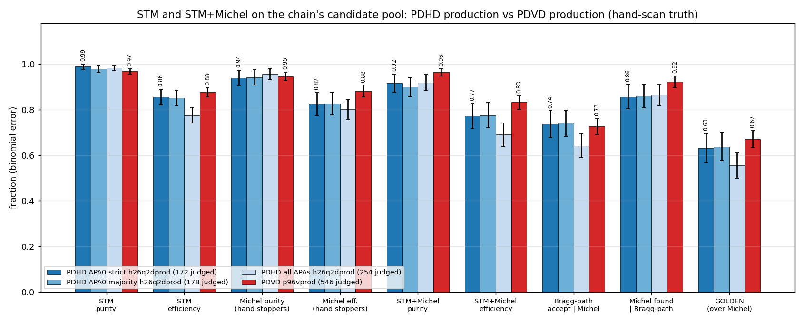
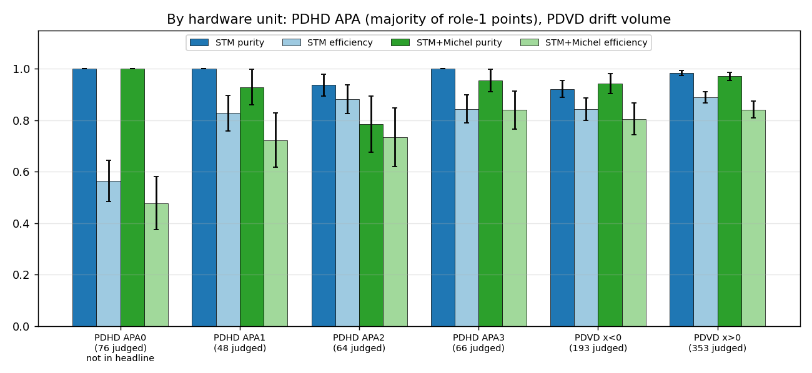
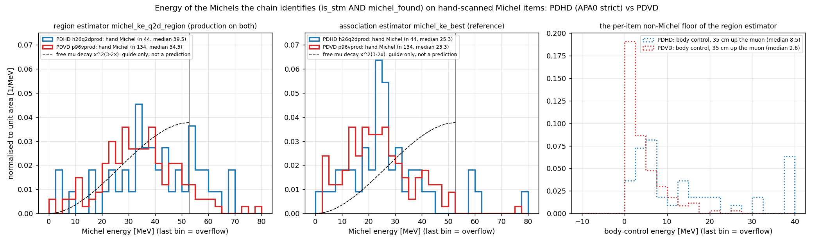
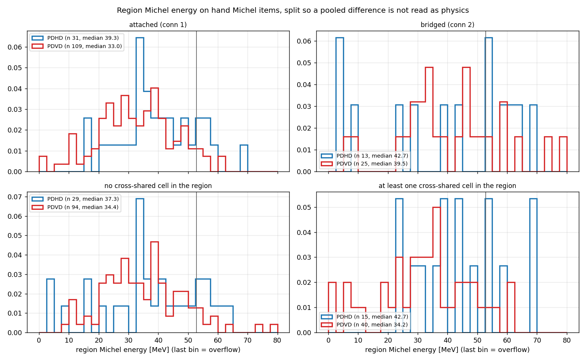
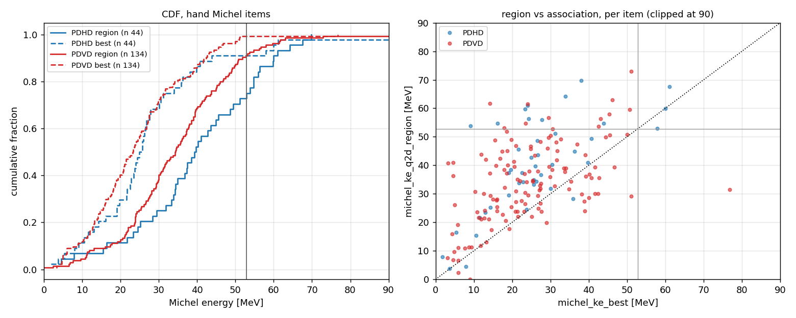
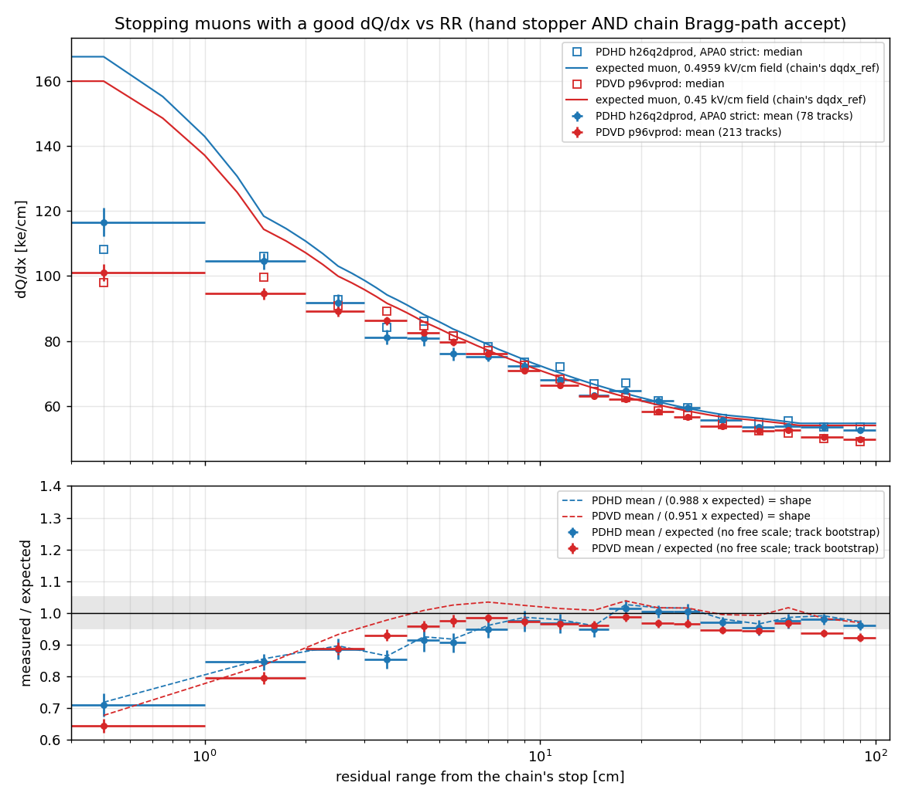
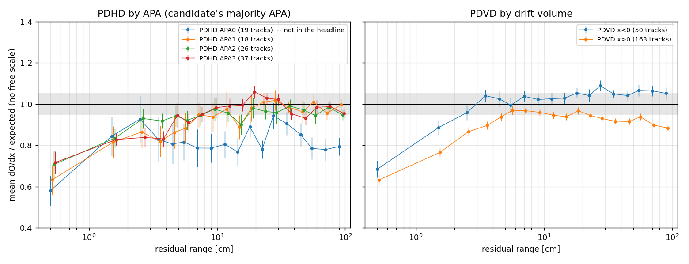
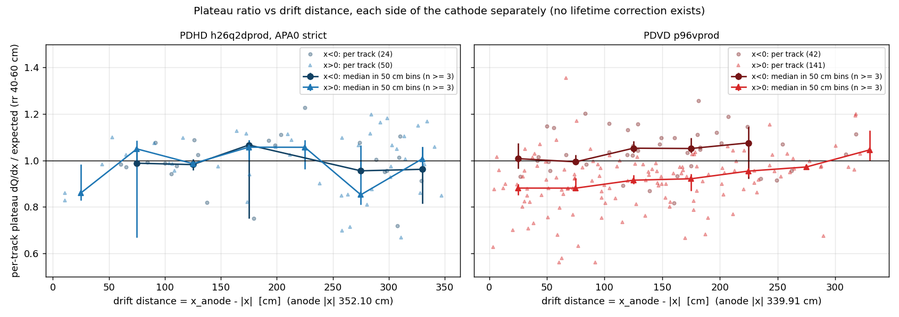

# doc pdhd/26 — PDHD vs PDVD, refreshed: STM and STM+Michel efficiency and purity, the Michel energy spectra on the region estimator (now PDHD production too), and dQ/dx vs residual range against the expectation

**The owner's request (2026-09-12):** a comprehensive PDHD vs PDVD comparison of the STM and STM+Michel
results; Michel energy spectra for the Michels the chain identifies, PDHD vs PDVD; for the stoppers with a
good dQ/dx vs RR, the mean dQ/dx against the expectation. Mid-way: *"PDHD should update to region based
energy estimation for this"* and *"Please flip it as default for PDHD"*.

**Answers, PDHD APA0 excluded (strict) as in docs pdhd/23–25, both detectors on their production chains:**

1. **The flip (§1).** PDHD production now publishes PDVD's region-based Michel energy with PDVD's own five
   keys, no PDHD tuning. It is purely additive: on the measured arm every pre-existing branch, point row, tree, zip,
   calib file and verdict is bit-identical to production on all 341 candidates / 61 events, and the confirmation
   arm on the flipped file is bit-identical to the measured arm, including the new per-cell tree.
2. **STM (§2).** PDHD purity **0.989 ± 0.011** / efficiency **0.856 ± 0.034** against PDVD
   **0.968 ± 0.011 / 0.877 ± 0.020**. The efficiency gap doc pdhd/23 §7 measured at 0.144 is now **0.021**
   (0.5 σ); PDHD stays the purer chain.
3. **STM+Michel (§2).** The chain's `is_stm ∧ michel_found` selection against hand Michel items: PDHD
   purity **0.917 ± 0.040** / efficiency **0.772 ± 0.056**, PDVD **0.964 ± 0.016 / 0.832 ± 0.029**. On
   the Bragg-peak half PDHD has **caught up** (Bragg-path accept on Michel items 0.737 vs 0.727); what is
   left of the GOLDEN gap (0.632 vs 0.671) is Michel finding once the peak is read (0.857 vs 0.923).
4. **Michel energy (§3).** On hand Michel items the region estimator reads a median **39.5 MeV [37.4, 42.3]
   on PDHD against 34.3 [32.0, 35.7] on PDVD**, with 27 % vs 9 % above the 52.8 MeV endpoint. The PDHD excess
   is **not** a Michel difference we can claim: the same sum taken on the muon body 35 cm upstream reads
   **8.5 MeV on PDHD against 2.6 on PDVD** — a floor difference about as large as the region difference. PDHD's
   region energy carries a larger non-Michel floor. The pre-registered expectation that PDHD would read
   *lower* (E1/E2 in `scan/d26/preregistered.txt`) **missed**.
5. **dQ/dx vs RR (§4).** **Both detectors match their own expectation on the plateau, with no free scale, and
   both fall short of it at the stop.** On hand stoppers the chain accepted on its own Bragg reading (PDHD 78,
   PDVD 213), the mean dQ/dx over the expectation is **0.95–1.01 on PDHD** and **0.92–0.99 on PDVD** from 8 to
   100 cm; the per-track plateau (rr 40–60 cm) median is **0.988 [0.983, 1.012] PDHD** against **0.951 [0.939,
   0.956] PDVD**. Below 5 cm both read low (pooled 0.82 / 0.81; the last centimetre 0.71 / 0.64), where the
   expectation rises steeply inside a bin sampled every 0.6 cm from a stop the chain placed — this doc does not
   read that shortfall as a charge deficit. PDVD's lower plateau is a split between its drift volumes (x < 0 1.039, x > 0 0.927), with a drift-distance
   trend of the wrong sign for electron attachment. PDHD APA1–3 read 1.057 / 0.988 / 0.983 (doc pdvd/50 §13.1:
   1.013 / 1.012 / 1.033); APA0 reads 0.791.

**Production.** §1 flips five keys into `pdhd/wct-pr-perevt.jsonnet` on the owner's go. No C++ change
(toolkit `81ff37d7`, pin `libpin_p96`, `libWireCellClus` md5 `4e1db810`), no other detector's file, no record
or label written, new tags only. Everything after §1 is read-only.

## 0. Repro

```sh
I=/nfs/data/1/xqian/toolkit-dev/wcp-porting-img ; D=$I/pdhd/docs/scan ; X=$D/d26
export STM_SCAN_RECORD=$D/pdhd_stm_michel_smx27_verdicts.json     # PDHD truth (doc pdhd/25 sec 8); PDVD = smx1a..smx9

# 1. part A, the flip.  Pre-registration and TLA written first: $X/preregistered.txt, $X/tla_q2d.txt
md5sum /home/xqian/tmp/p96/libpin_p96/*.so* > /home/xqian/tmp/h27/libpin_md5_before.txt
(cd $D && bash h25/run_arm.sh h26q2d d26/tla_q2d.txt)                  # measurement: production file + 5 keys, 61 events
MODE=additive bash $X/d26_gates.sh > $X/gate_h26q2d.txt                # vs h26conf (production): PASS
#    (compile-only h27cfg0 / h27cfgT from the unedited file, then) edit pdhd/wct-pr-perevt.jsonnet, then
bash $X/d26_proofs.sh > $X/cfg_proofs.txt                              # A 0/0/0 + whole config, B inert, C 5 keys, D PDVD unchanged
(cd $D && bash h25/run_arm.sh h26q2dprod)                              # confirmation: the flipped FILE, no TLA
MODE=confirm bash $X/d26_gates.sh > $X/gate_h26q2dprod.txt             # vs h26q2d: bit-identical
python3 $I/pdvd/docs/nf_sp_img_clus/scripts/d81_readout.py --det pdhd --arm h26q2dprod --json <scratch>/readout.json  # cross-shared cells
python3 $I/pdvd/docs/nf_sp_img_clus/scripts/d81_tail.py <scratch>/readout.json pdhd      # (same two for --det pdvd --arm p96vprod)

# 2. part B, the comparison (figures into pdhd/docs/figs/)
export D25_GATES="p82bhoff=61/0/86/107;h23conf:strict=77/0/27/68,47/3/10/38;h23conf:majority=79/1/29/69,48/3/10/40;h23conf:all=96/1/51/106,65/3/16/54"
python3 $D/h25/d25_bragg_michel.py --pdhd h26conf,h26q2dprod --pdvd p96vprod > $X/census.txt   # self-gates on smx27 need both exports
python3 $X/d26_compare.py       > $X/compare.txt        # sec 2: 26_eff_purity.png, 26_eff_purity_units.png
python3 $X/d26_michel_energy.py > $X/michel_energy.txt  # sec 3: 26_michel_energy{,_split,_cdf}.png
python3 $X/d26_dqdx_rr.py       > $X/dqdx_rr.txt        # sec 4: 26_dqdx_rr{,_split}.png, 26_plateau_vs_drift.png
```

**Conventions (doc pdhd/25 §0, unchanged).** PDHD truth = record `smx27`, owner precedence
(`owner_review` > `owner_smx1` > agent), population = the committed 303-item key; **strict** drops any candidate
with a role-1 point in APA0 (x < 0, z < 231 cm), **majority** drops the APA0-majority ones. PDVD truth = the
merged smx1a…smx9 record's flat verdict, population = items with a candidate (546); the all-judged figure
(576, the 10 stoppers the tagger never hands on counted as misses) is printed beside it. MESSY/UNCLEAR are
unscored on both. **Both efficiencies are on the chain's own candidate pool** — neither is an absolute
efficiency. Every number below is printed by a committed script from the arms named.

## 1. Part A — the region-based Michel energy flipped into PDHD production

### 1.1 What was flipped, and why these values

| key | C++ default | PDVD production | **PDHD production now** |
|---|---|---|---|
| `michel_q2d` | false | true | **true** |
| `michel_q2d_cells` | false | true | **true** |
| `michel_q2d_region_cm` | 0.0 (off) | 10.0 | **10.0** |
| `michel_q2d_region_ctl_cm` | −1.0 (off) | 35.0 | **35.0** |
| `michel_q2d_region_scope` | 0 | 1 | **1** |

The estimator (docs pdvd/95, 96): all 2-D charge in a 10 cm region around the stop on the candidate's own
cells (main cluster + admitted companions), minus the charge the muon's trajectory fit predicts there,
through the bound recombination model — so the energy does not depend on how PR segmented the Michel. The
same sum on a region 35 cm back up the muon is the **body control**. **The key set is PDVD's, inherited with
no PDHD tuning**: R = 10 was post-hoc on PDVD (doc 95) and scope 1 was flipped there on fidelity (doc 96). A
PDHD-selected radius would make the two spectra different estimators. Two further knobs of the same
component, `michel_q2d_dis_cm` (C++ 0.6) and `michel_q2d_stm_window_cm` (C++ 30.0), are set by **neither**
detector: both production files are silent on them, and the compiled q2d key sets are the same five keys on
both (`029107_17_h27cfg` for PDHD, `039252_0_h25vcfg` for PDVD, compiled after PDVD's last production edit), so
both run the C++ defaults and the estimator is the same. Doc pdvd/81 §8a held PDHD OFF because
its Michels lean more on cross-shared cells; the owner took the flip with that known, and §3.3 re-measures it.

### 1.2 Gates

| gate | label / file | result |
|---|---|---|
| pre-registration | `scan/d26/preregistered.txt` (written before `h26q2d` launched) | predictions 1a–f, 2 |
| measurement arm | `h26q2d` = unedited production file + `tla_q2d.txt`, 61/61, rc 0, pin md5 before = after | — |
| **additive gate** | `scan/d26/gate_h26q2d.txt` (`MODE=additive`) vs `h26conf` | **PASS**: 341/341 candidates bit-identical on all 149 pre-existing branches and every `T_stm_michel_pts` column; 0 `is_stm` / `michel_found` / `reject_bits` changes; exactly the 49 registered new branches and one new tree `T_stm_michel_2d`; every other tree of `tracking-pr.root` and `tracking-stm.root`, `mabc-pr.zip` members and `calib-pr-evt*.json` identical on 61/61 events; census on `smx27` unmoved (strict 89/1/15/67, all 114/2/33/105, Michel 47/3/10/38); `michel_q2d_valid` 341/341 |
| compiled config | `scan/d26/cfg_proofs.txt` | A `h27cfgT → h27cfg` **0/0/0**, whole compiled config identical after the tag rename; B keys forced back = exactly the 5 keys at the C++ initializers; C `h27cfg0 → h27cfg` **exactly 5 added**; D PDVD file unchanged |
| **confirmation arm** | `h26q2dprod` = the flipped file, no TLA; `scan/d26/gate_h26q2dprod.txt` (`MODE=confirm`) vs `h26q2d` | **PASS, bit-identical**: 61/61, rc 0, pin md5 unchanged against the manifest taken before `h26q2d`; 341/341 candidates on all 198 branches and every point column; every tree including all rows of `T_stm_michel_2d`, zip members and calib json identical on 61/61 events; census unmoved |

Two of my own defects, caught before they could matter:
* the gate's first run (`gate_h26q2d_run1.txt`, kept) took its census on `smx23`, because
  `d25_bragg_michel` reads `STM_SCAN_RECORD` at import and the script set a variable but not the environment.
  Both arms were on the same record, so "same" still held. The script now exports it, and the re-run reads
  `smx27`'s tuples.
* the pre-registered expectation E2 ("PDHD region medians lower than PDVD's") missed; see §3.

**Stale comment, not edited:** `pdvd/wct-pr-perevt.jsonnet` still says "PDHD stays OFF and carries no
michel_q2d key at all". It is PDVD's production file, and this doc does not touch it.

## 2. STM and STM+Michel, efficiency and purity

`d26_compare.py` → `scan/d26/compare.txt`; `d25_bragg_michel.py` → `scan/d26/census.txt` (self-gated).
PDHD production = `h26q2dprod` (identical to `h26conf` on every verdict, §1.2); PDVD production = `p96vprod`.


*Efficiency and purity on the chain's candidate pool, binomial errors. Dark blue = PDHD APA0 strict (the
headline), lighter = APA0 majority and all four APAs, red = PDVD with a candidate.*

### 2.1 STM (`is_stm`)

| | PDHD APA0 strict | PDHD APA0 majority | PDHD all APAs | **PDVD** with a candidate | PDVD all judged |
|---|---|---|---|---|---|
| TP / FP / FN / TN | 89 / 1 / 15 / 67 | 92 / 2 / 16 / 68 | 114 / 2 / 33 / 105 | 242 / 8 / 34 / 262 | 242 / 8 / 44 |
| purity | **0.989 ± 0.011** | 0.979 ± 0.015 | 0.983 ± 0.012 | **0.968 ± 0.011** | 0.968 |
| efficiency | **0.856 ± 0.034** | 0.852 ± 0.034 | 0.776 ± 0.034 | **0.877 ± 0.020** | 0.846 |
| judged items | 172 | 178 | 254 | 546 | 576 |

### 2.2 Michel (`michel_found`), two definitions in use

| | PDHD APA0 strict | PDHD all APAs | **PDVD** |
|---|---|---|---|
| on hand stoppers vs `michel_kind` attached/both (PDHD graders) | 47/3/10 — purity **0.940**, eff **0.825** | 65/3/16 — 0.956 / 0.802 | 142/8/19 — purity **0.947**, eff **0.882** |
| on all judged vs verdict `STM_MICHEL` (PDVD `census_score` §14.2) | 48/30/10 — 0.615 / 0.828 | 66/42/16 — 0.611 / 0.805 | 144/12/20 — 0.923 / 0.878 |

**The second row is not a PDHD Michel-purity problem.** `michel_found` is written on every candidate, accepted
or not. Of PDHD's 30 "false" Michels, **24 sit on through-going muons the chain already rejected**
(`is_stm` 0), 5 on accepted `STM_ONLY` stoppers and 1 on the accepted THRU. On PDVD the 12 are 6 on rejected through-going muons, 4 on accepted and 2 on rejected `STM_ONLY` stoppers.
The definition that matters for a physics selection is the next one, which requires both.

### 2.3 STM+Michel — the chain's `is_stm ∧ michel_found` against hand Michel items

| | PDHD APA0 strict | PDHD APA0 majority | PDHD all APAs | **PDVD** |
|---|---|---|---|---|
| **STM+Michel purity** | **44/48 = 0.917 ± 0.040** | 45/50 = 0.900 ± 0.042 | 56/61 = 0.918 ± 0.035 | **134/139 = 0.964 ± 0.016** |
| **STM+Michel efficiency** | **44/57 = 0.772 ± 0.056** | 45/58 = 0.776 ± 0.055 | 56/81 = 0.691 ± 0.051 | **134/161 = 0.832 ± 0.029** |
| what else is selected | 3 STM_ONLY whose Michel the record calls detached dots (`028084_23/114`, `029107_4/58`, `029107_7/85`), 1 THRU (`029107_21/65`, the accepted STM false positive) | 3 STM_ONLY, 2 THRU | 3 STM_ONLY, 2 THRU | 4 STM_ONLY, 1 STM_MICHEL of another kind |
| Bragg-path accept, hand Michel items | 42/57 = **0.737 ± 0.058** | 43/58 = 0.741 | 52/81 = 0.642 | 117/161 = **0.727 ± 0.035** |
| Michel found, given a Bragg-path accept | 36/42 = **0.857 ± 0.054** | 37/43 = 0.860 | 45/52 = 0.865 | 108/117 = **0.923 ± 0.025** |
| **GOLDEN** (Bragg-path accept ∧ Michel) | **36/57 = 0.632 ± 0.064** | 37/58 = 0.638 | 45/81 = 0.556 | **108/161 = 0.671 ± 0.037** |
| GOLDEN selection purity | 36/39 = 0.923 | 37/41 = 0.902 | 45/49 = 0.918 | 108/110 = 0.982 |

"Hand Michel item" = hand stopper with `michel_kind` attached or both; owner stoppers with no kind are left
out of this truth (the `d21_michel_census` rule). "Bragg-path accept" = `is_stm` with
`topology_cleared_bits` 0 (doc 25 §2): the dQ/dx shape tests passed on their own.

**Read together:**
* **The Bragg-peak half of the gap is closed.** Doc 25 §2.2 put 65 % of PDHD's golden deficit in the Bragg
  reading (0.619 vs 0.727); lever 1 took PDHD to 0.737. The golden gap is now 0.039 (0.5 σ), and all of it is
  the Michel factor, 0.857 vs 0.923.
* **PDHD's STM+Michel purity is lower than PDVD's** (0.917 vs 0.964, 1.1 σ) — the reverse of STM purity. The
  4 non-Michel items it admits are 3 hand `STM_ONLY` stoppers whose nearby activity the record calls detached
  dots (the muon is right, the attached Michel is not) and the one accepted THRU.

### 2.4 By hardware unit


*PDHD by the APA holding most of the candidate's role-1 points (all four shown; APA0 is not in any headline);
PDVD by the drift volume of the median role-1 x.*

| unit | judged | STM purity | STM efficiency | STM+Michel purity | STM+Michel efficiency |
|---|---|---|---|---|---|
| PDHD APA0 | 76 | 22/22 = 1.000 | 22/39 = **0.564 ± 0.079** | 11/11 = 1.000 | 11/23 = **0.478 ± 0.104** |
| PDHD APA1 | 48 | 24/24 = 1.000 | 24/29 = 0.828 ± 0.070 | 13/14 = 0.929 | 13/18 = 0.722 ± 0.106 |
| PDHD APA2 | 64 | 30/32 = 0.938 | 30/34 = 0.882 ± 0.055 | 11/14 = 0.786 | 11/15 = 0.733 ± 0.114 |
| PDHD APA3 | 66 | 38/38 = 1.000 | 38/45 = 0.844 ± 0.054 | 21/22 = 0.955 | 21/25 = 0.840 ± 0.073 |
| PDVD x < 0 | 193 | 59/64 = 0.922 | 59/70 = 0.843 ± 0.043 | 33/35 = 0.943 | 33/41 = 0.805 ± 0.062 |
| PDVD x > 0 | 353 | 183/186 = 0.984 | 183/206 = 0.888 ± 0.022 | 101/104 = 0.971 | 101/120 = 0.842 ± 0.033 |

**APA0 is still the weak unit**, 0.564 against 0.83–0.88; lever 1 lifted it from 0.436 (doc 23 §7) but not
level. PDHD's healthy APAs now sit inside PDVD's two volumes on STM efficiency. PDVD's x < 0 volume carries 5
of its 8 false positives in a third of its candidates.

### 2.5 How the comparison moved

| | PDHD APA0 strict, STM purity / efficiency | PDVD | gap in efficiency |
|---|---|---|---|
| doc pdhd/23 §7 (`h23conf` on `smx23`; PDVD `p93vprod`) | 1.000 / 0.733 | 0.968 / 0.877 | 0.144 |
| doc pdhd/25 §9 before the flip (`h25base` on `smx27`) | 1.000 / 0.740 | 0.968 / 0.877 | 0.137 |
| **now** (`h26q2dprod` on `smx27`; PDVD `p96vprod`) | **0.989 / 0.856** | 0.968 / 0.877 | **0.021** |

PDVD's census is the same from `p93vprod` to `p96vprod`: docs pdvd/95–96 only added energy branches.

### 2.6 Why this comparison is still not clean (doc pdhd/23 §4 and §7, carried forward)

1. **PDVD's base scan was not blind** (doc pdvd/55 §16.3: scanners saw `is_stm` before the frame); PDHD's
   `smx18`/`smx22` base was verdict-blind. The bias inflates PDVD. Both records have since taken un-blinded
   owner rulings (PDHD `own23`/`own25`/`own26`), which pull toward the chain on both.
2. **Different truth machinery**: PDVD folds owner rulings into a flat verdict; PDHD resolves precedence at
   read time. Both are read here with the functions their own graders use.
3. **PDVD's record carries ~147 owner re-judges drawn from the hard cases and the decision boundary**; PDHD's
   owner rulings are fewer and were drawn from the levers' movers.
4. **Neither efficiency is absolute** — both populations are the chain's candidate pool.
5. **Sample sizes differ about 3×** (172 PDHD strict vs 546 PDVD judged), and PDHD's headline is its three
   healthy APAs against all of PDVD. No bad region was excluded on PDVD.

## 3. The Michel energy of what the chain identifies

`d26_michel_energy.py` → `scan/d26/michel_energy.txt`. Selection: `is_stm ∧ michel_found` on the judged
populations; spectra on **hand Michel items** (PDHD strict 44, PDVD 134). The offline re-derivation of the
region sum from `T_stm_michel_2d` with the C++ rule reproduces `michel_q2d_region_{u,v,w}` and the cell
counts on **every** `michel_found` candidate of both arms (PDHD 133/133, PDVD 171/171, worst relative
deviation 3e-15), so the split variables below are the estimator's own cells.


*Left: the region estimator, production on both detectors. Middle: the association energy `michel_ke_best`
for reference. Right: the region sum taken 35 cm up the muon body — the per-item non-Michel floor.
The dashed curve is the free-muon-decay shape, a guide only: it ignores radiative loss, the bound μ⁻
spectrum in argon, sub-threshold deposits and the detector response. No energy truth exists on either
detector; 52.8 MeV is the only absolute anchor.*

### 3.1 The numbers

| hand Michel items | PDHD APA0 strict (n 44) | PDVD (n 134) |
|---|---|---|
| **region**, median [68 % bootstrap] | **39.5 [37.4, 42.3] MeV** | **34.3 [32.0, 35.7] MeV** |
| region p10 / p90 / max | 18.0 / 59.8 / 69.8 | 17.4 / 51.5 / 90.9 |
| region above 52.8 MeV | **12 (0.273)** | 12 (0.090) |
| **body control**, median | **8.5 MeV** | **2.6 MeV** |
| region − body control, median (diagnostic only, see §3.2) | 26.3 [21.9, 29.5]; p10 −6.8, ≤ 0 on 6 of 44 | 29.3 [27.1, 30.8]; p10 +11.6, ≤ 0 on 3 of 134 |
| `michel_ke_best`, median | 25.3 [23.8, 26.2] | 23.3 [21.4, 24.3] |
| `michel_ke_best` above 52.8 MeV | 4 (0.091) | 1 (0.007) |
| region / `michel_ke_best`, median | 1.551 | 1.391 |
| PDHD vs PDVD, region | KS D 0.205, p 0.104; Mann-Whitney p 0.028 | |
| PDHD vs PDVD, `michel_ke_best` | KS D 0.175, p 0.232; Mann-Whitney p 0.371 | |

The 7 non-Michel items in PDHD's selection read 21.3 MeV median (region), PDVD's 5 read 29.7.

### 3.2 What the PDHD excess is — and is not

* **The region reads higher on PDHD, and so does its floor.** The body control is the same sum on the muon,
  where there is no Michel and the fit's prediction should net the charge to about zero. It reads 8.5 MeV on
  PDHD against 2.6 on PDVD — a 5.9 MeV difference, about the size of the region difference (5.2 MeV). **The
  spectra therefore do not show a PDHD Michel that is more energetic**; they show a PDHD estimator that keeps
  more non-Michel charge. The per-item difference region − control is a weak diagnostic and is not used for
  this: the control is noisy item by item, so the difference goes negative or to zero on 6 of 44 PDHD items
  (3 of 134 on PDVD). Its medians (26.3 vs 29.3) point the same way, but the conclusion rests on the control
  medians.
* **Half of PDHD's endpoint tail has a hot control.** Of the 12 PDHD items above 52.8 MeV, 6 have a body
  control above 10 MeV (`029107_23/128` 67.2, `029107_1/85` 50.7, `029107_2/108` 30.8, `028084_3/72` 17.4,
  `029107_19/106` 14.7, `028084_18/108` 12.6). On those the whole track reads high, not the Michel. PDVD's 12
  have controls 0.0–16.7, and 11 of them below 10.
* **The association estimator agrees across detectors far better** (25.3 vs 23.3, KS p 0.23). The region
  estimator's larger reading than `michel_ke_best` on both (×1.55 / ×1.39) is doc pdvd/95's intended effect —
  charge the segment association missed — but on PDHD part of it is the floor above.
* **Statistics.** 44 against 134: a KS p of 0.10 is not evidence of the same shape. The Mann-Whitney p 0.028
  on the region is consistent with the floor offset.

### 3.3 Cross-shared cells — the reason PDHD was held OFF, re-measured


*Region energy on hand Michel items split by connection type (top) and by whether any cross-shared cell
enters the region sum (bottom).*

| | PDHD | PDVD |
|---|---|---|
| Michel candidates with any cross-shared **association** cell (doc 81's measure, `d81_readout`) | **69/133 (52 %)** | 40/171 (23 %) |
| judged STM+Michel items with any cross-shared cell **in the region sum** | 19/51 (0.37) | 40/139 (0.29) |
| share of the region sum carried by cross-shared cells, p50 / p90 | 0.00 / **0.10** | 0.00 / 0.02 |
| hand Michel median, **no** cross-shared cell in region | 37.3 (n 29) | 34.4 (n 94) |
| hand Michel median, **some** cross-shared cell | 42.7 (n 15) | 34.2 (n 40) |
| attached (conn 1) / bridged (conn 2) median | 39.3 (31) / 42.7 (13) | 33.0 (109) / 39.5 (25) |

Doc 81's 45 % is 52 % on today's chain, still twice PDVD's. **Inside the 10 cm region the substitution is
small** — it carries 10 % of the sum at p90 — and the PDHD–PDVD offset is present without any cross-shared
cell (37.3 vs 34.4), so cross-shared cells are not the whole of PDHD's higher reading (with some present, 42.7 vs 34.2). Bridged Michels read higher on
both detectors.


*Left: cumulative distributions, region (solid) and `michel_ke_best` (dashed). Right: region vs association per
item.*

## 4. dQ/dx vs residual range on the stoppers with a good dQ/dx-vs-RR

`d26_dqdx_rr.py` → `scan/d26/dqdx_rr.txt`.

**Selection — "good dQ/dx vs RR".** A hand stopper (`STM_MICHEL` / `STM_ONLY`) that the chain accepted on its
own Bragg reading: `is_stm` 1 **and** `topology_cleared_bits` 0 (doc 25 §2's Bragg-path accept — the dQ/dx
shape tests passed without P1's Michel rescue). PDHD APA0 strict: **78 of 104** hand stoppers (0.750); PDVD:
**213 of 276** (0.772). Points are the role-1 rows of `T_stm_michel_pts` — the profile the verdict read — with
`q` in e/cm and `rr` from the chain's stop; dead/no-profile rows (q ≤ 0, rr < 0) dropped, and a vertex row written
once per segment kept once (128 / 275 duplicates). 27 319 points on PDHD, 60 333 on PDVD.

**Expectation.** Each detector's **own** muon table, read from the `dqdx_ref` block the chain writes into every
`calib-pr-evt*.json` (ParticleDataSet: Modified Box at the detector's field × 0.85, 0–100 cm in 0.25 cm, e/cm;
identical on every event checked). It agrees with `pdhd/stm/pdhd_ref_dqdx.json` (0.4959 kV/cm) to 3.8e-6 and with
`pdvd/stm/pdvd_ref_dqdx_045.json` (0.45 kV/cm) to 1.6e-6. At rr 59.5 cm it is 54 609 e/cm on PDHD and 53 966 on
PDVD. **No free scale enters the headline ratio.** Errors are a bootstrap over tracks (points on one track are
correlated).


*Top: mean (filled, standard error) and median (open) dQ/dx per residual-range bin, over each detector's own
expected muon curve. Bottom: mean / expected with no free scale (points, track-bootstrap errors) and the shape
after dividing by the population's plateau ratio (dashed). Grey band ±5 %.*

### 4.1 Mean dQ/dx over the expectation, per RR bin

| RR [cm] | PDHD mean / expected | PDVD mean / expected | | RR [cm] | PDHD | PDVD |
|---|---|---|---|---|---|---|
| 0–1 | 0.710 ± 0.036 | 0.644 ± 0.022 | | 13–16 | 0.948 ± 0.025 | 0.960 ± 0.015 |
| 1–2 | 0.845 ± 0.025 | 0.795 ± 0.019 | | 16–20 | 1.014 ± 0.027 | 0.988 ± 0.014 |
| 2–3 | 0.886 ± 0.033 | 0.887 ± 0.020 | | 20–25 | 1.004 ± 0.020 | 0.967 ± 0.013 |
| 3–4 | 0.854 ± 0.029 | 0.930 ± 0.017 | | 25–30 | 1.004 ± 0.025 | 0.966 ± 0.014 |
| 4–5 | 0.914 ± 0.037 | 0.959 ± 0.017 | | 30–40 | 0.969 ± 0.017 | 0.947 ± 0.012 |
| 5–6 | 0.907 ± 0.031 | 0.975 ± 0.019 | | 40–50 | 0.954 ± 0.024 | 0.944 ± 0.013 |
| 6–8 | 0.949 ± 0.027 | 0.984 ± 0.014 | | 50–60 | 0.974 ± 0.023 | 0.967 ± 0.014 |
| 8–10 | 0.975 ± 0.033 | 0.974 ± 0.015 | | 60–80 | 0.979 ± 0.017 | 0.936 ± 0.012 |
| 10–13 | 0.967 ± 0.030 | 0.965 ± 0.015 | | 80–100 | 0.961 ± 0.016 | 0.922 ± 0.013 |

| | PDHD APA0 strict | PDVD |
|---|---|---|
| tracks / points | 78 / 27 319 | 213 / 60 333 |
| pooled mean / expected, rr < 5 cm | 0.820 | 0.808 |
| pooled mean / expected, rr 5–30 cm | 0.982 | 0.972 |
| pooled mean / expected, rr 30–100 cm | 0.968 | 0.940 |
| **per-track plateau ratio** (median q/ref over rr 40–60 cm, ≥ 10 points), median [68 % CI] | **0.988 [0.983, 1.012]** (n 74) | **0.951 [0.939, 0.956]** (n 183) |
| per-track plateau ratio p16 / p84 | 0.820 / 1.104 | 0.816 / 1.049 |
| mean dQ/dx in the last cm vs expected (e/cm) | 116 613 vs 164 205 | 101 098 vs 156 891 |

The table's trimmed means (10–90 %) and medians are in `dqdx_rr.txt`; they tell the same story within 0.03.

**Reading it.**
* **The plateau matches the expectation on both detectors to within about 5 %,** with no scale fitted: the
  measured charge scale and each detector's expected table agree without a constant being tuned here. PDHD sits
  at 0.99, PDVD at 0.95.
* **The shape, once the plateau is divided out, stays within −3 / +4 % from 5 to 100 cm on PDVD and −8 / +3 % on
  PDHD** (dashed lines). PDVD reads 1–4 % above its own plateau between 5 and 30 cm; PDHD reads 7–13 % below it
  between 3 and 6 cm (0.865, 0.925, 0.917), then recovers.
* **Both fall short at the stop, by a similar amount.** Across the last centimetre the expectation climbs from
  about 143 to 168 ke/cm (bin mean 164 ke/cm on PDHD, 157 on PDVD), sampled by points about 0.6 cm apart whose rr
  is set by where the chain put the stop. A stop placed a few millimetres past the true end, or a peak shared between two samples, would lower this bin
  without any charge being lost. Nothing here separates that from a real recombination or charge deficit at high
  dE/dx, so the bin is reported, not interpreted.

### 4.2 By hardware unit, and against drift distance


*Mean / expected per RR bin, no free scale. Left: PDHD by the candidate's majority APA over all four APAs (APA0
is not in the headline). Right: PDVD by drift volume.*

| unit | tracks | per-track plateau ratio, median [68 % CI] | doc pdvd/50 §13.1 (earlier chain, `T_rec_charge`) |
|---|---|---|---|
| PDHD APA0 | 19 | **0.791 [0.718, 0.848]** | 0.654 |
| PDHD APA1 | 18 | 1.057 [1.016, 1.065] | 1.013 |
| PDHD APA2 | 26 | 0.988 [0.976, 1.003] | 1.012 |
| PDHD APA3 | 37 | 0.983 [0.965, 1.007] | 1.033 |
| PDVD x < 0 | 50 | **1.039 [1.026, 1.063]** | |
| PDVD x > 0 | 163 | **0.927 [0.913, 0.938]** | volume asymmetry 1.18 |

* **PDHD APA0 is still low** — 0.79 of the expectation on its Bragg-accepted stoppers — which is why it stays
  out of the headline. APA2 and APA3 agree (0.99, 0.98); APA1 reads 6 % higher (1.06). Against doc 50's
  earlier chain and selection the three move by +4 / −2 / −5 %. This sample is only the
  stoppers whose profile passed the shape tests, so APA0's number is the *best* of APA0.
* **PDVD's plateau is two numbers, not one:** the x < 0 volume reads 4 % high, the x > 0 volume (three quarters
  of the sample) 7 % low; the ratio 1.12 is smaller than doc 50's 1.18 on its different selection. PDVD's
  pooled 0.95 is this mix.


*Per-track plateau ratio against drift distance (x_anode − |x|), each side of the cathode separately; squares
and triangles are medians in 50 cm bins with at least 3 tracks.*

| | tracks | slope of plateau ratio vs drift distance, × 300 cm | medians in 50 cm bins (n ≥ 3) |
|---|---|---|---|
| PDHD x < 0 | 24 | −0.125 | 0.99, 0.98, 1.07, –, 0.96, 0.96 (50–360 cm) |
| PDHD x > 0 | 50 | +0.012 | 0.86, 1.05, 0.99, 1.06, 1.06, 0.85, 1.01 (0–360 cm) |
| PDVD x < 0 | 42 | +0.104 | 1.01, 0.99, 1.05, 1.05, 1.08 (0–250 cm) |
| PDVD x > 0 | 141 | **+0.161** | 0.88, 0.88, 0.92, 0.92, 0.95, 0.97, 1.05 (0–360 cm) |

* **PDHD shows no drift-distance trend** that its per-bin scatter can resolve.
* **PDVD's x > 0 volume rises with drift distance** — 0.88 near the anode to about 1.0 near the cathode. Electron
  attachment would do the opposite (more drift, less charge). So the low x > 0 plateau is not a lifetime loss; the
  deficit sits close to the anode. No correction exists in the chain, and this doc does not propose one.

## 5. What is NOT concluded

* **Not an absolute efficiency** on either detector, and not a like-for-like record (§2.6).
* **Not that PDHD's Michels are more energetic.** The region estimator's floor differs by about the size of
  the difference (§3.2). No energy truth exists; the free-decay curve is a guide.
* **Not a validation of the region estimator on PDHD.** The flip was taken on the owner's go and is
  additive: it moves no verdict. Its PDHD floor (body control 8.5 MeV) is a measured property, not a
  tuned one, and nothing was re-selected on PDHD.
* **Not a calibration.** No lifetime, gain or recombination constant is fitted; the expectation is each
  detector's own compiled table. The selection is the chain's own Bragg verdict, so profiles that read flat never
  enter, and the ratios describe the stoppers the chain already reads well.
* **Not a high-dE/dx charge deficit.** The last-centimetre shortfall (§4.1) cannot be separated from sampling
  and stop placement on a steeply rising curve; it is similar on both detectors.
* **Not an explanation of PDVD's near-anode deficit** in its x > 0 volume (§4.2). It is reported with its sign;
  its mechanism is open.

## Files

| file | what |
|---|---|
| `pdhd/wct-pr-perevt.jsonnet` | §1: the five keys at the end of `stm_michel_knobs` |
| `scan/d26/preregistered.txt`, `tla_q2d.txt` | §1: predictions and the measured TLA, written before the arm |
| `scan/d26/d26_gates.sh` | §1: additive and confirmation gates (fork of `pdvd/.../d95_gates.sh`) |
| `scan/d26/gate_h26q2d.txt`, `gate_h26q2d_run1.txt`, `gate_h26q2dprod.txt` | §1: gate outputs (run1 = census on the wrong record, kept) |
| `scan/d26/d26_proofs.sh`, `cfg_proofs.txt` | §1: compiled-config proofs A–D |
| `scan/d26/q2d_readout_pdhd.txt`, `q2d_readout_pdvd.txt` | §3.3: `d81_readout` + `d81_tail` on both production arms |
| `scan/d26/census.txt` | §2: `d25_bragg_michel.py` on `h26conf`, `h26q2dprod`, `p96vprod` (self-gated) |
| `scan/d26/d26_compare.py`, `compare.txt` | §2 tables, `figs/26_eff_purity.png`, `figs/26_eff_purity_units.png` |
| `scan/d26/d26_michel_energy.py`, `michel_energy.txt` | §3, `figs/26_michel_energy{,_split,_cdf}.png` |
| `scan/d26/d26_dqdx_rr.py`, `dqdx_rr.txt` | §4, `figs/26_dqdx_rr.png`, `figs/26_dqdx_rr_split.png`, `figs/26_plateau_vs_drift.png` |
