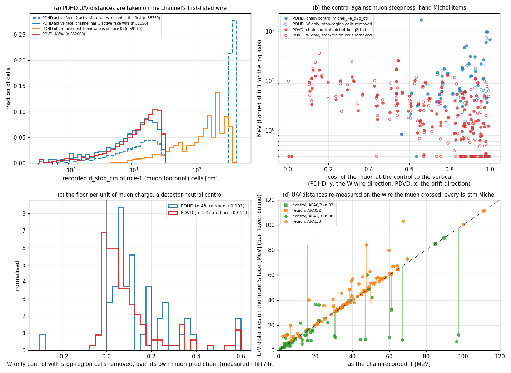
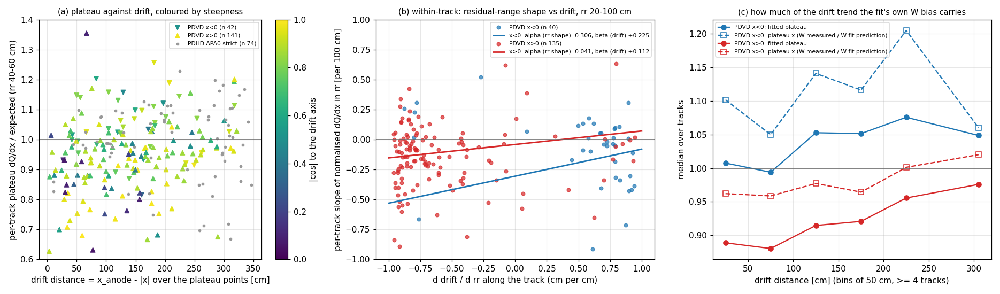

# doc pdhd/27 — What PDHD's Michel-energy floor is made of, a wire-lookup defect in the region distances, and PDVD's near-anode dQ/dx

Follow-up to doc pdhd/26, which ended on two open items (its §5): why PDHD's region Michel energy carries an 8.5 MeV
body control against PDVD's 2.6, and why PDVD's x > 0 volume reads a lower dQ/dx near its anode. **No code or
configuration is changed here**; the fix for the defect in §2 is proposed, not made.

> **Update 2026-09-12 (doc pdhd/28).** The fix is made and in PDHD production.
> * **The setting:** `michel_q2d_region_wire_lookup`, off by default.
> * **Setting off:** bit-identical to production on both detectors.
> * **Setting on:** no verdict moved.
> * **The corrected hand-Michel region energy reads higher than this doc's offline bound:** 45.3 MeV against
>   38.9–44.0, with a 11.1 MeV control. The fix restores unclaimed cells the offline correction could not see.

## Headline

1. **PDHD's higher floor is real and mostly not a bug.** A detector-neutral control, using only the collection
   plane and removing every cell that is also within 10 cm of the stop, reads **6.5 MeV on PDHD against 2.5 on PDVD**
   (Mann-Whitney p < 0.001). It has two parts:
   * **More charge than the fit predicts, per unit of muon charge:** +10.1 % on PDHD against +5.1 % on PDVD.
   * **More muon charge inside the 10 cm disk:** 72 against 52 MeV-equivalent.
     The collection wires of PDHD run vertically, so a steep cosmic muon is foreshortened in that view and a 2-D
     disk holds more of it.
2. **On steep PDHD muons the control is not a body control at all.** The point 35 cm back up the muon falls within
   10 cm of the stop in the collection view on 27 of 44 items, and on all 15 with |cos| to vertical above 0.9. There
   the control collects Michel charge and reads 21.8 MeV, against 7.2 for the neutral control.
3. **A defect: PDHD's induction-plane distances are measured on the wrong wire.** The region code places each
   induction-plane cell on the first wire its channel maps to. On PDHD every U/V channel is wrapped:
   * **Other face, APA1/APA3:** every muon-footprint cell is measured on the far face; 64 % land beyond 100 cm.
   * **Second segment, all APAs:** 348 of 800 channels have two segments on the muon's face; 49 % of their cells
     land beyond 100 cm.

   The control has no U or V cell on 91 of 336 PDHD candidates. **PDVD is not affected** (0 cells beyond 100 cm).
   **Only energy branches are affected; no verdict reads them.**
4. **Correcting the defect offline does not close the gap.** Re-measuring every induction cell on the wire the muon
   crossed gives, for PDHD hand Michel items:
   * **control:** 8.5 → 7.8–10.2 MeV;
   * **region:** 39.5 → 38.9–44.0 MeV.

   The range is set by one unknowable flag, `own_blob`, on cells the code never tested (§3). Items move individually,
   up to +15 MeV at p90.
   * **Proof the recorded distances come from the wrong wire:** a lattice twin reproduces every recorded distance
     to an rms of at most 0.0051 cm per item, including the 150 cm ones on the wrong wire.
   * **Negative control:** 67 536 correctly placed cells are unchanged.
   * **Wrong-pick check:** no cell already within 30 cm switches segment.
5. **PDVD's near-anode deficit (doc 26 §4.2) stands, and is narrowed:**
   * **All four top anodes read low.** The x > 0 plateau is 0.89–0.92 on anodes 4–7, against 1.01–1.08 below.
   * **The drift trend is not muon steepness.** With steepness in the model it stays at +5.2 %/100 cm [+3.5, +6.6].
   * **It is seen within single tracks,** once the residual-range shape is separated out: +11 %/100 cm
     [+4, +19].
   * **About half of it follows the fit's own collection-plane under-prediction**, which also changes with drift.
   * **PDHD shows no trend.** The mechanism is not identified.

## 0. Repro

```bash
cd /nfs/data/1/xqian/toolkit-dev/wcp-porting-img/pdhd/docs/scan/d27
export STM_SCAN_RECORD=/nfs/data/1/xqian/toolkit-dev/wcp-porting-img/pdhd/docs/scan/pdhd_stm_michel_smx27_verdicts.json
python3 d27_ctl_planes.py      > ctl_planes.txt        # sec 1.1  per-plane control, twin, MeV per electron
python3 d27_ctl_census.py      > ctl_census.txt        # sec 1.2  control cell census, steepness
python3 d27_plane_rule.py      > plane_rule.txt        # sec 1.3  plane rule counterfactuals (twin of combine_planes)
python3 d27_neutral_ctl.py     > neutral_ctl.txt       # sec 1.4  the detector-neutral control      -> neutral_ctl.json
python3 d27_wrap_face.py       > wrap_face.txt         # sec 2    geometry, index convention, scale  -> wrap_face.json
python3 d27_ghost_twin.py      > ghost_twin.txt        # sec 3    lattice twin, correction, controls  -> ghost_twin.json
python3 d27_dqdx_drift.py      > dqdx_drift.txt        # sec 5    plateau vs drift, steepness, anode  -> dqdx_drift.json
python3 d27_dqdx_rr_vs_drift.py > dqdx_rr_vs_drift.txt # sec 5    rr shape vs drift, per-plane bias    -> dqdx_rr_vs_drift.json
python3 d27_figs.py                                    # figs/27_ctl_floor.png, figs/27_pdvd_near_anode.png
```

**Inputs.** All inputs are production outputs already on disk; no arm was run.
* **Arms:** `pdhd/work/*_h26q2dprod` (PDHD production, doc 26 §1) and `pdvd/work/*_p96vprod` (PDVD production,
  doc pdvd/96). Both are protected in `scripts/retire/PROTECTED.txt`.
* **Geometry:** `wire-cell-data/protodunehd-wires-larsoft-v1.json.bz2` (PDHD `params.jsonnet:187`).
* **Populations:** as doc 26, via `d25_bragg_michel.items`.
  * Hand Michel items: PDHD APA0 strict 44, PDVD 134.
  * Good stoppers for dQ/dx: PDHD 74, PDVD 183 with a plateau.
* **Toolkit** at `81ff37d7`, read-only.

## 1. The body control, taken apart

The control (`michel_ke_q2d_ctl`, CheckSTM_Michel.cxx:1947-1962, 2140-2151) is the region sum on a centre 35 cm back
up the muon fit. It takes own cells within 10 cm in each plane's 2-D view:
* **the per-cell charge:** measured − max(fit muon prediction, 0), or the fit's non-muon prediction where the cell is
  cross-shared;
* **the plane combine:** planes are weighted U 0.25 / V 0.25 / W 1.0; a plane with no cell gets weight 0; if the two
  largest planes differ by more than 4 %, the largest is dropped (`stm_michel_combine_planes`);
* **the conversion:** 41.30 MeV per 10⁶ e on PDHD, 42.71 on PDVD, read back from the tree. That 3 % cannot make a
  factor of 3.

Every offline number below re-derives the chain's own per-plane sums (twin 44/44 PDHD, 134/134 PDVD) and the combined
value (88/88, 268/268).

### 1.1 By plane (`ctl_planes.txt`)

| hand Michel items, median | PDHD (44) | PDVD (134) |
|---|---|---|
| control cells U / V / W | **0 / 0** / 213 | 152 / 152 / 195 |
| items whose control has no U cell / no V cell (tree counts) | **23 / 24** | 0 / 0 |
| W: muon prediction inside the control, MeV-eq | 93.3 | 51.6 |
| W: (measured − prediction) / prediction | **+0.179** | +0.063 |
| U / V: (measured − prediction) / prediction | — (no cells) | +0.166 / +0.184 |
| plane the rule dropped: none / U / V / W | 15 / 12 / 9 / 8 | 6 / 65 / 48 / 15 |

On PDHD the control is effectively the collection plane alone. On PDVD the rule usually drops an induction plane and
reads mostly W. Section 2 explains why the U/V cells are missing.

### 1.2 Steepness and overlap with the stop (`ctl_census.txt`, `neutral_ctl.txt`)

|cos| of the muon at the control (role-1 points rr 25–45 cm) to the vertical:
* **PDHD:** vertical is y, the direction of the collection wires. p10/p50/p90 are 0.64 / 0.86 / 0.98.
* **PDVD:** vertical is x, the drift direction, which every plane resolves. p10/p50/p90 are 0.25 / 0.79 / 0.96.

| |cos_vert| | PDHD n | PDHD chain control | PDHD W control overlaps the stop region | PDVD n | PDVD chain control | PDVD overlap |
|---|---|---|---|---|---|---|
| < 0.7 | 8 | 4.3 | 1 of 8 | 53 | 5.0 | 5 of 53 |
| 0.7–0.9 | 21 | 7.0 | 11 of 21 | 35 | 2.1 | 0 |
| ≥ 0.9 | 15 | **21.8** | **15 of 15** | 38 | 1.1 | 0 |

The two detectors run in opposite directions.
* **PDHD:** a steeper muon is foreshortened in the collection view, so the 35 cm-back centre lands next to the stop
  and the 10 cm disk takes in the end of the muon and the Michel.
* **PDVD:** a steeper muon lies along the drift, which every plane resolves.


*(a) Recorded stop distance of PDHD U/V muon-footprint cells, by where the wire lookup put them (§2), against PDVD.
(b) The chain's control (filled) and the neutral W-only control with stop-region cells removed (open) against muon
steepness. (c) The neutral control over its own muon prediction. (d) Region and control with the U/V distances
re-measured on the wire the muon crossed, against the chain; bars run to the lower bound (§3).*

### 1.3 The plane rule (`plane_rule.txt`)

This split is by the APA side of the muon, which §2 shows decides whether the U/V lookup was right. Items with the
muon on APA2 (face 0, where the first-listed wire is on the muon's face) against APA1/APA3:

| PDHD hand Michel, median MeV | APA2 (13) | APA1/APA3 (31) | PDVD (134) |
|---|---|---|---|
| control, chain | 6.3 | 14.2 | 2.6 |
| control, W plane alone through the rule | 6.3 | 15.9 | 2.5 |
| control, U+V alone through the rule | 8.7 | (U/V cells absent) | 5.7 |
| region, chain | 37.4 | 40.2 | 34.3 |

APA2 still reads 2.4× PDVD's control with all three planes present. The gap is not only the lost planes.

### 1.4 The detector-neutral control (`neutral_ctl.txt`)

This control uses W alone, which neither the wire lookup nor the plane rule touches, and removes every cell that is
also within 10 cm of the stop:

| hand Michel items | PDHD (44) | PDVD (134) |
|---|---|---|
| neutral control, median MeV | **6.5** | **2.5** (Mann-Whitney p < 0.001) |
| muon prediction inside it, MeV-eq | 72.4 | 51.6 |
| (measured − prediction) / prediction | **+0.101** (n 43) | **+0.051** (p 0.001) |
| by |cos_vert| < 0.7 / 0.7–0.9 / ≥ 0.9 | 4.3 / 6.1 / 7.2 | 4.5 / 0.7 / 0.6 |

The medians are consistent with the product of the two: 0.10 × 72 ≈ 7 against 6.5, and 0.05 × 52 ≈ 2.6 against 2.5.
That is a consistency check, not a factorisation: foreshortening changes which cells enter, and the bias varies cell
by cell, so the two are not independent. The fit's under-prediction of measured charge is
doc pdvd/96 §5's "prediction bias", diagnosed there on PDVD and left unfixed because `TrackFitting` is shared. On
the whole muon footprint it is larger on PDHD's collection plane:

| W measured / fit prediction, role-1 cells | x < 0 | x > 0 |
|---|---|---|
| PDHD | 1.095 | 1.142 |
| PDVD | 1.066 | 1.051 |

The same bias sits inside the region. Of the W region sum:
* **Muon-footprint (role-1) cells:** 5.5 MeV-eq on PDHD against 1.9 on PDVD.
* **Michel-claimed cells:** 33.8 against 29.1.

## 2. The defect: region distances of PDHD induction cells are taken on the channel's first-listed wire

**Symptom.** The control has no U and no V cell on 91 of 336 PDHD candidates (20 of 70 `is_stm ∧ michel_found`),
and on 5 of 595 PDVD candidates. On APA1/APA3 the recorded `d_stop_cm` of role-1 U/V cells, the muon's own
footprint, has a per-cell median of 148 cm. Across all PDHD candidates the W role-1 cells sit at a per-candidate
median of 8.3 cm (`wrap_face.txt` §4–5).

**Root cause.** `CheckSTM_Michel.cxx:2001` sets `face, wire = fw.front()`. `fw` is every (face, wire) the readout
channel maps to, in `AnodePlane` order: faces, then planes, then wires (`gen/src/AnodePlane.cxx:215-223`). Only
`any_within` (a Michel or gamma cloud match, 2015-2016) moves a cell off it. `dstop` / `dctl` (2034-2044) are then
computed on that (face, wire). On PDHD, from the geometry (`wrap_face.txt` §1, §5):
* every U/V channel has wires on **both** faces, and the first listed is **always face 0**;
* the active face, from the W cells (collection channels are single-face), is 0 for APA0/APA2 and **1 for APA1/APA3**;
* **348 of 800** U/V channels per APA have **two** segments on the active face.

| role-1 U/V cells, PDHD production | n | recorded d_stop p50 | p90 | beyond 100 cm |
|---|---|---|---|---|
| active face, channel has one active-face wire | 51 056 | 10.5 | 22.9 | **0.000** |
| active face, two active-face wires, first recorded | 38 359 | 28.5 | 378.0 | **0.492** |
| other face (APA1/APA3, every cell) | 69 110 | 148.2 | 304.0 | **0.644** |
| PDVD U / V / W, for comparison | 104 145 / 110 024 / 137 834 | 12.9 / 13.5 / 13.1 | 25.5 / 25.6 / 25.1 | 0.0000 |

All 158 525 role-1 U/V cells carry exactly the channel's first geometry entry, never a later one. A distance on the
wrong wire is not a distance, with two consequences:
1. **Cells inside the disk go uncounted.** The muon's own induction cells inside the 10 cm disk are not counted, in
   the region or the control. Role-0 cells (unclaimed charge) are only written when inside a radius, so theirs never
   reach the table.
2. **The plane rule loses its induction planes.** With no U or V cell it gives W weight 1, so the "drop the largest
   plane" switch can no longer remove a contaminated collection plane.

A side finding needed to reproduce this: against the **raw JSON** `planes[].wires[]` order, the chain's wire index is
the same on face 0 and mirrored on face 1 (n − 1 − index), W included (`wrap_face.txt` §2+3). The loader,
`WireSchema::load`, evidently orders face 1 the other way. Every mapping here is checked against all recorded cells
rather than assumed from the JSON, the trap `channels()` already set once. The "first-listed wire is face 0" statement
is itself checked the same way: every role-1 U/V cell carries that entry.

**Why it hid.**
* **The work was done on PDVD.** The region estimator was built and tuned there (docs pdvd/95, 96), and PDVD's
  channels do not wrap like this: it has no cell beyond 100 cm.
* **Doc 96 fixed the neighbouring loop only.** It saw the `fw.front()` hazard and repaired it for `own_blob`, which
  now walks every (face, wire) under scope > 0 (2083-2104), but not for the distance a few lines above.
* **The doc 26 flip gates could not catch a wrong new branch.** They were additive: every pre-existing branch
  bit-identical, 49 new ones registered.
* **Doc 26's twin re-derived the sum from the recorded `d_stop_cm`.** It proved the arithmetic, not the geometry the
  distances came from.

**Scope.**
* **PDHD only, energy only.** Nothing reads `michel_ke_q2d_region`, `michel_q2d_region`, `michel_ke_q2d_ctl` or
  `michel_q2d_ctl` back. The repo-wide grep covered toolkit `clus/` and `cfg/` (C++ and jsonnet) and the PDHD/PDVD
  jsonnet, sh and py outside `docs/` and `work/`:
  * the only hits are `CheckSTM_Michel.cxx`'s own writer and log lines;
  * and one comment, at `pdhd/wct-pr-perevt.jsonnet:405`.
* **Other branches.** The association branches of doc pdvd/81 (`michel_q2d_*`) and cross-shared substitution choose
  cells by role, not by distance, so the lookup does not touch them.

**Fix (proposed, not made).** At 2034-2044, measure each cell's distance on the (face, wire) that the own-blob walk
(2083-2104) matched. Where nothing matched, use the nearest of the channel's wires.
* **It is C++ in a production component PDVD also runs**, so it needs a default-OFF knob (for example
  `michel_q2d_region_wire_lookup`).
* **Knob-off gate:** PDVD and PDHD bit-identical.
* **Knob-on arm:** on PDHD.
* **Owner's go** is required (CLAUDE.md §5 item 3).
* **The role-0 emission** at 2113 uses the same test and would change with it.

## 3. How much the defect moves the numbers (`ghost_twin.txt`)

**Twin.** The 2-D point of a cell is (`time2drift(time × tick)`, `pitch × (wire + 0.5) + center`), and a centre goes
through the same conversion at an integer (tick, wire) (Facade_Grouping.cxx:820-848). So within one (apa, face,
plane) every recorded distance is `hypot(s·(t − tc), p·(w − wc))`.
* **Constants:** pitch p comes from the geometry (U/V 0.4669, W 0.4791 cm); s = 0.0788 cm per tick, fitted on W.
* **Centres:** (tc, wc) are trilaterated per item.
* **Result:** the recorded distances are reproduced with an rms of at most 0.0051 cm on every plane, face and item,
  and on APA1/APA3 **the 150 cm distances are exactly the face-0 lattice distances**. The offline region and control sums
  equal the chain's to 5 × 10⁻⁵ MeV.

**Correction.** Every U/V cell is re-measured on the nearest of its channel's wires on the muon's face, against the
muon-face centre:
* **tc** from W;
* **wc** from the U/V cells already on the muon's face. On APA1/APA3 these are the Michel cells `any_within` placed
  there.

Region and control are then rebuilt with the chain's sum and plane rules. The two controls:
* **Negative control:** 67 536 cells on the muon's face whose channel has one muon-face wire, **none moved by more
  than 0.01 cm**.
* **Wrong-pick check:** of cells already within 30 cm on the muon's face, **0** were moved to another segment.

**The bound.** A role-1 cell that was never inside a radius has `own_blob` 0, meaning "not computed" (doc pdvd/96 §1).
* **Upper bound (`fix`):** counts such a cell as own.
* **Lower bound (`fixlo`):** does not.
* **Where the truth sits:** between them. On APA0/APA2, where the flag was computed, 85–88 % of role-1 cells in radius
  are own (PDVD 94–96 %).

| median MeV | n | region, chain → fix / fixlo | control, chain → fix / fixlo |
|---|---|---|---|
| PDHD hand Michel, muon on APA2 | 13 | 37.4 → 37.4 / 37.4 | 6.3 → 5.8 / 6.3 |
| PDHD hand Michel, muon on APA1/APA3 | 31 | 40.2 → **50.7** / 39.3 | 14.2 → **8.2** / 14.2 |
| **PDHD hand Michel, pooled** | 44 | **39.5 → 44.0 / 38.9** (above 52.8 MeV: 12 → 18 / 13) | **8.5 → 7.8 / 10.2** |
| every PDHD `is_stm ∧ michel_found`, APA0/APA2 | 32 | 38.8 → 39.9 / 38.8 | 10.2 → 9.6 / 10.2 |
| every PDHD `is_stm ∧ michel_found`, APA1/APA3 | 38 | 39.2 → 47.1 / 38.1 | 13.4 → 8.3 / 15.8 |
| PDVD hand Michel (unaffected) | 134 | 34.3 | 2.6 |

Per item, the hand-Michel region shift is p10/p50/p90 0.0 / +2.1 / +15.1 MeV under `fix` (14 of 44 move more than
5 MeV) and 0 at the median under `fixlo` (3 move more than 5).

**Reading it.**
* **The control gap is not the lookup.** Correcting the wire puts the pooled control at 7.8–10.2 MeV, still three to
  four times PDVD's.
* **The region rises when the induction planes come back.** Restoring the U/V muon footprint adds its fit residual:
  PDHD U/V measured over predicted is 1.19–1.24 on the footprint. So the corrected APA1/APA3 region reads higher,
  not lower.
* **The lookup is a precision defect, not the source of PDHD's excess.** Only its PDHD energies are wrong, and they
  are wrong item by item.

## 4. So what is the 8.5 MeV

In order of size, for PDHD hand Michel items:
1. **The fit under-predicts the muon's charge about twice as much** as on PDVD (+10 % against +5 % on W), over a
   disk that holds more muon in PDHD's foreshortened collection view (72 against 52 MeV-eq). Together, 6.5 against
   2.5 MeV.
2. **On steep muons the control overlaps the stop** (27 of 44; all 15 above |cos_vert| 0.9) and collects Michel
   charge: 21.8 against 7.2 MeV in that band.
3. **The wire lookup drops the induction planes** on APA1/APA3 (§2), which leaves the plane rule unable to discard a
   contaminated W plane. Correcting it moves individual items by up to 15 MeV but the pooled control by −0.7 / +1.7.

Doc 26 §3.2's conclusion stands on this evidence: the PDHD spectrum does not show a more energetic Michel. Its
mechanism, "a PDHD estimator that keeps more non-Michel charge", is now these three measured parts. Part 1 lives in
the shared fit and part 2 in the definition of the control, so neither is a PDHD configuration choice.

## 5. PDVD's near-anode dQ/dx (`dqdx_drift.txt`, `dqdx_rr_vs_drift.txt`)

Same population and plateau as doc 26 §4: hand stoppers the chain accepted on its own Bragg reading, and per-track
median dQ/dx over expected at rr 40–60 cm, with no free scale.


*(a) Per-track plateau against drift distance, coloured by steepness to the drift axis; PDHD in grey. (b) Per-track
slope of dQ/dx in residual range against how fast drift changes along the track, with the fit per volume (§5.2).
(c) Binned plateau (filled) and plateau × W measured-over-predicted (open), a proxy for what the collection plane
alone would read.*

### 5.1 It is a volume offset plus a drift trend, and steepness explains neither

| PDVD | x < 0 (bottom) | x > 0 (top) |
|---|---|---|
| tracks | 42 | 141 |
| plateau median | 1.039 | **0.927** |
| by anode (n) | 0: 1.066 (10), 1: 1.084 (10), 2: 1.044 (12), 3: 1.008 (10) | 4: 0.899 (35), 5: 0.923 (27), 6: 0.918 (43), 7: 0.887 (24) |
| plateau = a + b·drift/100 cm + c·|cos_x|, b [68 %] | +0.017 [−0.013, +0.048] | **+0.052 [+0.035, +0.066]** |
| same fit, c [68 %] | +0.166 [+0.055, +0.272] | +0.039 [−0.042, +0.105] |
| t0 = 0 (no time anchor) | 0 of 42 | 0 of 141 |

All four top anodes read low, so this is not one bad CRP. The top-volume trend survives the steepness term and does
not come from untimed tracks. PDHD, same fit: b −0.041 [−0.074, +0.001] (x < 0) and +0.021 [−0.010, +0.050] (x > 0).

### 5.2 Within one track, the drift trend is still there

Along a downward stopper, residual range and drift distance change together: d drift / d rr has a median of −0.77 in
PDVD's top volume. A falling dQ/dx-vs-rr shape would therefore look like a drift trend. Each track's slope of
normalised dQ/dx in rr (rr 20–100 cm) is s_rr = α + β·(d drift / d rr):
* **α** is the residual-range shape;
* **β** is the drift effect, both per 100 cm.

A synthetic check fixes that convention:

| input (rr shape, drift) | recovered α, β |
|---|---|
| (−0.10, 0) | −0.111, +0.001 |
| (0, +0.10) | −0.005, +0.088 |
| (−0.05, +0.10) | −0.049, +0.090 |

| | n | α (rr shape) [68 %] | β (drift) [68 %] |
|---|---|---|---|
| **PDVD x > 0** | 135 | −0.041 [−0.102, +0.019] | **+0.112 [+0.043, +0.187]** |
| PDVD x < 0 | 40 | −0.306 [−0.638, +0.013] | +0.225 [−0.170, +0.650] |
| PDHD x > 0 | 47 | −0.045 [−0.099, +0.007] | −0.068 [−0.141, +0.009] |
| PDHD x < 0 | 23 | −0.254 [−0.468, −0.054] | +0.068 [−0.166, +0.296] |

* **PDVD top volume:** the within-track trend is drift, not residual-range shape (α is consistent with 0). It has
  the same sign as, and is larger than, the cross-track +5 %/100 cm. The two use different rr ranges, 20–100 against
  40–60.
* **PDVD bottom volume:** the tracks give almost no leverage (d drift / d rr sits at ±0.7–0.9), so nothing is
  measured there.
* **PDHD:** no drift effect in either volume.

### 5.3 About half of it follows the fit's collection-plane bias

The fit's under-prediction of W charge on the muon footprint changes with drift in the top volume. Multiplying the
fitted plateau by W measured/predicted, a proxy for a collection-only reading, removes about half the trend:

| PDVD x > 0, drift | 0–100 cm (n 59) | 100–200 (47) | 200+ (35) |
|---|---|---|---|
| fitted plateau | 0.881 | 0.915 | 0.967 |
| W measured / fit prediction | 1.064 | 1.048 | 1.038 |
| plateau × W measured/predicted | 0.959 | 0.965 | 1.002 (Spearman +0.17, p 0.049) |

* **Top volume:** the fitted dQ/dx falls by 0.086 from 200+ cm to the anode; the collection-only proxy falls by 0.043.
* **Bottom volume:** the proxy is flat (1.089 / 1.125 / 1.096).
* **Level:** the proxy moves both volumes up by 5–9 %, but leaves the top–bottom offset at about 13 %.

**What this settles and what it does not.**
* **Settled:**
  * the near-anode deficit is a real position effect in the top volume;
  * it is not muon steepness, missing t0 or the residual-range shape;
  * roughly half of it tracks the shared fit's prediction bias.
* **Not settled:**
  * the other half;
  * the 12 % top-volume offset (doc pdvd/50 §13.5 already called it "a real property of the PDVD chain that nobody
    has chased").
* **Candidates not tested here:**
  * a gain or response difference of the top-CRP electronics that depends on pulse width (drift diffusion);
  * space charge near the top CRP.

## 6. What changes in doc 26

* **§3.2, the energy floor.**
  * **Stands:** "the spectra do not show a PDHD Michel that is more energetic".
  * **Replaced by §4 here:** the attribution to a single "floor". The 8.5 MeV is three measured parts.
  * **A correction:** PDHD's region energy carries a wire-lookup defect (§2) that moves individual items; pooled, the
    median is 38.9–44.0 MeV once corrected, against 39.5 recorded.
* **§3.3, cross-shared cells.** Unaffected; it selects by role.
* **§4.2, PDVD's near-anode deficit.**
  * **Stands:** the reading "the deficit sits close to the anode; not a lifetime loss".
  * **§5 here adds:** it is a within-track position effect, not steepness, and about half follows the fit's W bias.
* **§1, the flip.** Unchanged: the flip was additive and moved no verdict. The region energy it switched on is now
  known to be mis-measured on PDHD item by item (§3).

Short dated update notes are added to doc 26 §3.2, §4.2 and §5 pointing here.

## 7. What is NOT concluded

* **Not a fix.** Nothing in `clus/` or any jsonnet is changed. The corrected numbers are an offline re-measurement
  with an unknowable own-blob flag, so they are given as bounds.
* **Not the region energy PDHD would have after a fix.** The offline correction cannot add role-0 cells the chain
  never wrote. Where the chain did write them, they carry a median 0.0 MeV-eq of the W region on APA2 hand Michels
  and 0.1 pooled over PDHD. On the cells the lookup hid, their contribution is not measured.
* **Not a calibration of the prediction bias.** Measured/predicted over the muon footprint is a diagnostic ratio, and
  the plateau × W measured/predicted proxy mixes rr ranges.
* **Not a mechanism for PDVD's top volume**, neither its offset nor the remaining half of its drift trend.
* **Not a statement about PDVD's region energy.** Its wire lookup is clean and its control is 2.6 MeV. It carries
  the same prediction bias at half PDHD's size.

## 8. Next, ranked

1. **The wire-lookup fix** (§2), behind a default-OFF knob.
   * **Gates:** knob off, PDVD and PDHD bit-identical; knob on, a PDHD arm graded against §3's bounds, which it must
     fall between.
   * **Cost:** C++ in a component PDVD production runs, so it needs the owner's go.
2. **A control that cannot overlap the stop.** Place the centre so its 2-D disk is at least 2R from the stop's in
   every plane, or drop the planes where it is not. This is a definition change, measurable offline on the
   existing tables first.
3. **The prediction bias itself** (doc pdvd/96 §5 item 2, carried).
   * It is now measured on both detectors and against drift.
   * The fix lives in the shared `TrackFitting` (M10 / §5 item 3), so first emit the per-point fitted dQ that doc 96's
     P3 needed.
4. **PDVD top volume.** Split the top-volume plateau by CRP electronics channel group and by pulse width (drift)
   before any calibration is considered.

## Files

| file | what |
|---|---|
| `scan/d27/d27_ctl_planes.py` → `ctl_planes.txt` | §1.1 |
| `scan/d27/d27_ctl_census.py` → `ctl_census.txt` | §1.2 cell census, steepness |
| `scan/d27/d27_plane_rule.py` → `plane_rule.txt` | §1.3 |
| `scan/d27/d27_neutral_ctl.py` → `neutral_ctl.txt`, `.json` | §1.4 |
| `scan/d27/d27_wrap_face.py` → `wrap_face.txt`, `.json` | §2 geometry, index convention, per-cell scale |
| `scan/d27/d27_ghost_twin.py` → `ghost_twin.txt`, `.json` | §3 twin, correction, controls, bounds |
| `scan/d27/d27_dqdx_drift.py` → `dqdx_drift.txt`, `.json` | §5.1 |
| `scan/d27/d27_dqdx_rr_vs_drift.py` → `dqdx_rr_vs_drift.txt`, `.json` | §5.2–5.3, with the synthetic convention check |
| `scan/d27/d27_figs.py` → `figs/27_ctl_floor.png`, `figs/27_pdvd_near_anode.png` | figures |
