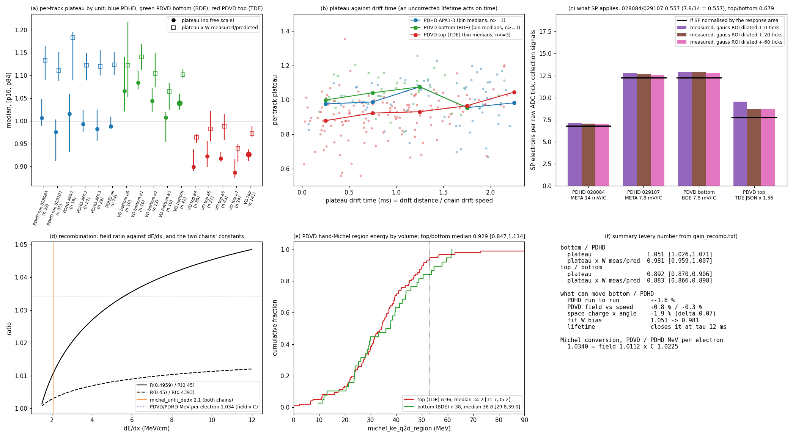

# doc pdhd/29 — Space charge against the stopping-muon dQ/dx position effects: what it explains in PDVD's top volume, why PDHD cannot see it, and why PDVD's top/bottom offset is not a position effect

**The owner's questions (2026-09-13):**
* *"Regarding dQ/dx bias, we know there are so-called space charge effect … its impact is like anti-electron lifetime
  effect … I believe this is the case for both PDHD and PDVD, and the effect is w.r.t. to the distance to the cathode
  plane. I wonder if this can help to explain part of the observations. I want to understand what cannot be explained."*
* *"For the PDVD top vs. bottom, since the two drift volume have different positions and will see different amount of
  STM, I wonder if the observed asymmetry can also be explained by the space charge effect, for example, the position
  dependence effect within the half volume instead of a top vs. bottom asymmetry?"*

The observations are doc pdhd/26 §4.2 and doc pdhd/27 §5: the per-track plateau (median dQ/dx over the expected muon
curve, rr 40–60 cm, no free scale) on hand stoppers the chain accepted on its own Bragg reading.

**Answers:**

1. **The drift trend in PDVD's top volume has the sign, the shape and the size of a ProtoDUNE-SP-like space charge
   (§3).**
   * A 1-D space-charge toy fitted to the 141 top-volume tracks wants **δ = +0.110 [+0.060, +0.130]**. That is a field
     11 % low at the anode and 22 % high at the cathode, against ProtoDUNE-SP's reported ~−10 % / +20 %.
   * The median plateau is flat over the first 120 cm (0.881, 0.880) and then rises (0.935, 0.913, 0.976, 1.045), as a
     field that is flat at the anode and steep at the cathode predicts.
   * **Almost all of it comes through the drift velocity, not recombination.** The chain turns time into position with
     one fixed speed, so where electrons really drift slower the reconstructed pitch along drift is longer and dQ/dx
     reads low. Recombination alone would need δ = +0.30, three times the measured value.
2. **PDHD is not counter-evidence; it cannot test this (§3.3).**
   * PDHD's stoppers cross its horizontal drift almost at right angles (median |cos_x| 0.25, cos² 0.06). PDVD's top
     stoppers mostly follow its vertical drift (0.85, cos² 0.72).
   * At cos² 0.06 the same space charge moves dQ/dx by about 4 % end to end, below PDHD's per-track scatter.
   * PDHD's fitted δ is +0.01 [−0.13, +0.14]: uninformative, not zero.
3. **PDVD's top/bottom offset is not a position effect inside each half-volume (§4).**
   * The two volumes sample the same positions: plateau medians at 128 vs 144 cm from their own anode.
   * At matched drift distance top/bottom reads **0.88 / 0.86 / 0.90 / 0.82** from 0 to 240 cm, and at matched angle
     0.957 vs 1.036 and 0.899 vs 1.066. A pure position effect gives 1.00 in every row.
   * Letting each volume carry its own space charge, with no volume offset, needs **δ_bottom = −0.12 [−0.15, −0.04]**.
     That is a field stronger at the bottom anode than at its cathode, the wrong sign for positive ions, which drift to
     the shared cathode in both volumes. It still fits worse than one common δ plus a volume scale:
     ΔL1 = +1.11 [+0.60, +1.64].
   * The data want both a common space-charge trend (δ +0.07) **and** a top/bottom scale of **0.889
     [0.875, 0.903]**.
4. **What space charge cannot explain (§5):**
   * that ~11 % offset, with all four top anodes low and all four bottom anodes high;
   * the part of the top trend that follows the fit's collection-plane bias;
   * PDHD APA0 at 0.79 and APA1 against APA3;
   * the last-centimetre Bragg shortfall on both detectors.

   The offset follows the readout boundary: top-drift electronics (TDE) above, bottom-drift electronics (BDE, PDHD's
   cold electronics) below.

**The owner's follow-up (2026-09-13), answered in §8–9:**
* *"For PDVD, the top volume and bottom volume are using different electronics. So the gain of the electronics may be
  able to explain the observed asymmetry … the PDVD bottom share the same electronics as the PDHD (both sides). Only
  PDVD top uses a different electronics. Are we sure that the PDVD bottom is consistent with PDHD side? This needs to
  double check the expectation calculation of dQ/dx vs. rr in both cases, if this is confirmed, we can then say the
  observed asymmetry is coming from the gain."*
* *"The PDVD is running about 450 V/cm, and PDHD is running at higher electric field … When we calculate the charge
  --> energy for the Michel electron, I wonder whether this effect is properly taken into account between the PDHD and
  PDVD chains in terms of the average recombination factor."*

5. **The expected dQ/dx-vs-rr curve is the same calculation on both detectors; only the field differs (§8.1).**
   * Rebuilt here from the CSDA table with `convert_field.C`'s own formula, it matches both committed tables to 2e-16,
     and each production chain's own `dqdx_ref` to the 6 significant figures the jsonnet carries.
   * From the field alone, PDHD's expected plateau is 1.25 % above PDVD's (rr 50 cm).
6. **PDVD bottom agrees with PDHD to about ±5 %, and the top is low against both (§8.2–8.3).**
   * Bottom/PDHD is **1.051 [1.026, 1.071]** on the fitted plateau (95 % [0.998, 1.094]).
   * It is **0.981 [0.959, 1.007]** on the collection-plane estimator, which removes the fit's W bias.
   * In matched drift-time bins it is 1.023 / 1.054 / 0.999 / 1.000.
   * **Top/bottom is 0.892 and 0.883** on the two estimators; top/PDHD is 0.938 and 0.866.
   * **SP treats BDE identically on both detectors.** On real collection signals, SP's electrons per ADC tick agree to
     1–2 % between PDVD bottom and PDHD.
   * **SP applies PDHD's two gain settings exactly.** Run 028084 at 14 mV/fC over run 029107 at 7.8 gives
     **0.557–0.560**, against the expected 7.8/14 = 0.557.
7. **So the asymmetry belongs to the top volume, and the TDE readout is the leading candidate. "Gain" is not yet shown
   (§8.4–8.5).**
   * **Shared by top and bottom:** field, expected curve, drift speed, recombination model and field-response file.
   * **Different in the top readout:**
     * a different electronics response shape (area/peak 5.0 µs against 2.8);
     * postgain 1.36;
     * a 2.0 V ADC full scale.
   * **SP's electrons per ADC tick on the top are 0.68 of the bottom's.** This is a conversion factor, not a charge
     deficit.
     * Neither the response peak (0.88) nor its area (0.63) predicts it.
     * Together with the dQ/dx 0.89, it says the top's real ADC per electron is about 1.3× the bottom's, where SP
       expects 1.47×.
     * Separating a gain error from a response-shape error needs a direct test (§7 item 1).
8. **Each chain's Michel charge→energy conversion uses its own field (§9).**
   * The conversion constant k = B·2.1/(ρE) equals the configured value at 0.4959 and at 0.45 kV/cm to 1e-16.
   * PDVD turns each electron into 3.4 % more MeV than PDHD. That is 1.1 % from the field times 2.3 % from the per-detector
     calibration constant C.
   * Evaluating recombination at a fixed 2.1 MeV/cm misses at most 0.9–2.0 % of the field difference for denser
     deposits.
   * None of this can produce doc 26 §3.4's 45.3 against 34.3 MeV: it acts in the other direction.

**Production / scope.**
* **Read-only analysis** of the committed doc 27 table. No C++, config, arm, record or label is touched.
* **No correction proposed:** the chain applies no space-charge or lifetime correction to this dQ/dx, and this doc
  does not add one.
* **Not a measured space charge:** the model is a stated 1-D toy.
* **§8–9 are also read-only.** They read SP archives, arm outputs and compiled configs already on disk. No wire-cell job
  was run.

## 0. Repro

```sh
I=/nfs/data/1/xqian/toolkit-dev/wcp-porting-img ; X=$I/pdhd/docs/scan/d29
# input: $I/pdhd/docs/scan/d27/dqdx_drift.json (doc pdhd/27 sec 5, committed; PDVD p96vprod, PDHD h26q2dprod whose
#        T_stm_michel_pts rows equal production h28prod's -- doc pdhd/28 writes no point row)
python3 $X/d29_space_charge.py > $X/space_charge.txt      # sec 1-7 + figs/29_space_charge.png
python3 $X/d29_gain_recomb.py  > $X/gain_recomb.txt       # sec 8-9 + figs/29_gain_recomb.png (~3 min, 8 processes)
#   also reads: toolkit-dev/energy_loss/pion_travel/stopping.root; d27/dqdx_rr_vs_drift.json (mpW);
#   calib-pr-evt*.json of h28prod / p96vprod; SP archives pdhd/work/028084_{0,1}_d09, 029107_{0,1}_d09ctl (anode 1),
#   pdvd/work/039252_0_d27fresh, 039253_0_d27fresh (anodes 0, 4) -- the imaging inputs of both production arms;
#   p96vprod T_stm_michel(_2d); pdhd/work/029107_17_h28cfgoff/.wct-pr_h28cfgoff.json; toolkit pr.jsonnet (pdhd, protodunevd)
#   --skip-frames / --skip-michel drop sec 8.3-8.4's frame check / sec 9.3 if those inputs are ever retired
```

The durable input is the committed `scan/d27/dqdx_drift.json`. Regenerating this doc needs neither `p96vprod` nor
`h26q2dprod`, so retiring either arm does not affect it. If the PDHD per-track table itself ever has to be rebuilt,
use `h28off`: it is kept, and it is bit-identical to `h26q2dprod` (`scan/d28/gate_h28off.txt`).

Constants are in the script header:
* Modified Box (ArgoNeuT α 0.93, β 0.212 kV/cm·g/cm²/MeV, ρ 1.3954 g/cm³) at plateau dE/dx 2.4 MeV/cm.
* Walkowiak drift velocity at 87.5 K.
* PDVD E₀ 0.45 kV/cm, L 340 cm per volume; PDHD E₀ 0.4959 kV/cm, L 350 cm (the fields each detector's `dqdx_ref`
  uses).
* PDVD's geometry (`protodunevd/params.jsonnet`) puts each volume between the cathode face at |x| = 3.0 cm and the anode
  at |x| = 339.91 cm, an active drift of about 337 cm. The 1 % difference from 340 moves no δ at the quoted precision.
* Bootstraps are over tracks with fixed seeds.

## 1. The space-charge effect

**Mechanism** (Mote, PoS NuFact2021 175; MicroBooNE, JINST 15 P12037):
* A surface LArTPC sees a large cosmic flux.
* The ionization electrons reach the anode in milliseconds, but Ar⁺ ions drift about 2×10⁵ times slower toward the
  cathode and accumulate.
* The ion space charge distorts the drift field, which moves where charge is reconstructed and changes how much
  survives recombination.

ProtoDUNE-SP corrected both with a data-driven 3-D map built from cathode-crossing and CRT-tagged cosmics. It feeds the
map's field into the Modified Box model before the stopping-muon energy calibration.

**Size.**
* ProtoDUNE-SP (500 V/cm, 3.6 m drift, surface): about **−10 % near the anode and +20 % near the cathode**, with spatial
  distortions of tens of cm at the detector faces.
* MicroBooNE simulation (273 V/cm): about −5 % / +12 %.
* *Both percentages are from search summaries of the ProtoDUNE-SP talk (ICHEP 2020) and the MicroBooNE record, not from
  a figure read here. The ProtoDUNE-SP proceedings read for this doc confirm the mechanism and the correction method,
  not the percentages.*

**Scaling to PDHD and PDVD.**
* Both run at the surface in EHN1 with similar drift lengths and fields.
* A naive scaling (ion density ∝ 1/E, field distortion ∝ ρL²/E) puts PDVD's top volume within ~10 % of ProtoDUNE-SP.
* Argon flow reshapes the ion distribution on every one of these detectors, so the maps are 3-D and detector-specific.

**In this chain.**
* No space-charge or lifetime correction enters the dQ/dx the plateau reads: `protodunevd/params.jsonnet` records that
  lifetime has no production consumer.
* PDHD uses space charge only as a fiducial allowance (`pdhd/pr.jsonnet`).
* So both effects are in these ratios uncorrected: space charge raises charge toward the cathode, attachment lowers it
  with drift time.

## 2. The toy, and the two couplings

**Field.** Ions produced uniformly and drifting to the cathode give a density growing linearly with the distance x from
the anode. With the anode–cathode voltage fixed:

  E(x) = E₀ · (1 − δ + 3δ (x/L)²)

The field is −δ at the anode, +2δ at the cathode, and E₀ at x = L/√3. ProtoDUNE-SP's −10 % / +20 % is δ ≈ 0.10. The
shape is the "anti-lifetime" of the question, but not an exponential: flat at the anode, steepest at the cathode.

**Couplings to the measured dQ/dx** (`space_charge.txt` §1):

| coupling | fractional dQ/dx change per fractional field change | depends on |
|---|---|---|
| recombination, Modified Box | +0.160 at 0.45 kV/cm, +0.134 at 0.4959 kV/cm (plateau, 2.4 MeV/cm); +0.46 at 10 MeV/cm | dE/dx |
| drift velocity (reconstructed pitch along drift scales by v₀/v) | +0.50 × cos²θ_x at 0.45 kV/cm, +0.47 × cos²θ_x at 0.4959 | track angle to the drift axis |

**The toy at δ = 0.10, PDVD** (A = 1, dQ/dx ratio vs drift distance from the anode):

| cos²θ_x | 0 cm | 60 | 120 | 180 | 240 | 300 | 340 | end to end |
|---|---|---|---|---|---|---|---|---|
| 0 (recombination only) | 0.982 | 0.984 | 0.989 | 0.997 | 1.007 | 1.018 | 1.025 | +0.043 |
| 0.06 (PDHD stopper median) | 0.979 | 0.981 | 0.987 | 0.997 | 1.009 | 1.022 | 1.030 | +0.051 |
| 0.72 (PDVD top stopper median) | 0.944 | 0.950 | 0.966 | 0.992 | 1.025 | 1.063 | 1.089 | +0.145 |
| 1 | 0.931 | 0.937 | 0.957 | 0.989 | 1.032 | 1.082 | 1.118 | +0.187 |

At δ = 0.05 every deviation is about half.


*(a) The toy at PDVD's field, δ 0.10 solid, 0.05 dashed. (b) PDVD per-track plateaus and 60 cm medians by volume, with
M2 (common δ, a scale per volume, solid) and M3 (no offset, δ per volume, dashed). (c) The slope of the plateau against
drift distance by track angle, observed (68 %) against the toy at δ 0.10. (d) PDHD, with the toy at its own median
angle.*

## 3. What space charge explains

### 3.1 The PDVD top-volume trend: size

Per-track plateau = A × toy(drift, cos²θ_x; δ), fitted with an L1 loss:

| volume | n | δ [68 %] | A | recombination-only fit needs δ |
|---|---|---|---|---|
| **PDVD top** | 141 | **+0.110 [+0.060, +0.130]** | 0.939 | +0.300 |
| PDVD bottom | 42 | +0.040 [−0.030, +0.070] | 1.049 | +0.220 |
| PDHD x > 0 | 50 | unconstrained: +0.010, interval −0.130 to +0.140 | 0.989 | +0.070 |
| PDHD x < 0 | 24 | unconstrained: +0.040, interval −0.160 to +0.050 | 0.995 | −0.130, fitting a falling plateau: the sign of attachment (§3.3) |

**The top-volume size agrees with ProtoDUNE-SP's measurement without being tuned to it.** The drift-velocity coupling
carries it: without it the field would have to be 30 % low at the anode and 60 % high at the cathode.

### 3.2 The PDVD top-volume trend: shape and angle

**Shape.** Median plateau by drift distance is 0.881, 0.880, 0.935, 0.913, 0.976, 1.045 in 60 cm bins (n 32, 36, 34,
20, 13, 6). It is flat near the anode and rises toward the cathode, as the toy is. On 141 noisy tracks a linear and a
pure-x² trend fit about equally well: rms residual 0.146 for both, and a median absolute deviation (MAD) of 0.065
against 0.068 that slightly favours the line. So the shape is consistent, not proven.

**Angle.** The drift-velocity coupling grows with cos²θ_x; recombination does not:

| PDVD top, \|cos_x\| | n | observed slope per 100 cm [68 %] | toy δ 0.10 predicts |
|---|---|---|---|
| 0–0.5 | 28 | +0.049 [−0.020, +0.115] | +0.013 |
| 0.5–0.85 | 44 | +0.041 [+0.023, +0.057] | +0.033 |
| 0.85–1 | 69 | +0.052 [+0.032, +0.072] | +0.047 |

* **Steeper classes:** the two agree with the toy.
* **Shallowest class:** it sits high, with wide errors.
* **Verdict:** no contradiction and no clean confirmation. Some of the trend on shallow tracks is not this coupling (§5
  item 3).

**Within single tracks.** Doc 27 §5.2 measured +0.112 [+0.043, +0.187] per 100 cm in the top volume. The toy's local
slope at δ 0.10 and cos² 0.72 is +0.009 / +0.027 / +0.043 / +0.055 / +0.063 per 100 cm going from the anode to the
cathode. That is consistent at the low edge, and below the central value.

### 3.3 Why PDHD shows nothing

**Track angles.**

| | PDHD x > 0 | PDHD x < 0 | PDVD top | PDVD bottom |
|---|---|---|---|---|
| median \|cos_x\| | 0.25 | 0.33 | 0.85 | 0.80 |
| median cos²θ_x | 0.06 | 0.11 | 0.72 | 0.65 |

PDHD drifts horizontally and cosmic stoppers are steep, so they cross its drift nearly at right angles. At cos² 0.06
only recombination and a sliver of the pitch term remain: +0.042 end to end at δ 0.10, +0.022 at δ 0.05 (PDHD's field
and drift length).

**Why that is invisible in PDHD.**
* **The effect is below the scatter.** It is smaller than PDHD's track-to-track scatter, and its plateau-point drift
  distances are skewed to large values (x > 0 median 259 cm).
* **Attachment competes.** Uncorrected electron attachment pulls the other way. PDHD's shallow-track slopes are
  +0.017 [−0.023, +0.052] (x > 0) and −0.059 [−0.105, −0.012] (x < 0); the second has the sign of attachment.
* **The fit has no leverage.** The fitted δ interval spans −0.13 to +0.14.

**PDHD neither confirms nor refutes space charge**; its geometry cannot measure it on stoppers. Tracks that follow the
drift, such as cathode–anode crossers, would.

## 4. PDVD top vs bottom — a position effect, or an offset?

### 4.1 The two volumes sample the same positions

| | n | plateau drift distance from own anode, p10 / p25 / p50 / p75 / p90 | median \|cos_x\| |
|---|---|---|---|
| top | 141 | 31 / 63 / 128 / 190 / 253 cm | 0.85 |
| bottom | 42 | 52 / 89 / 144 / 183 / 248 cm | 0.80 |

Different stopper counts (141 against 42) do not mean different positions. The ions come from all cosmic ionization,
mostly through-going muons, not from the stoppers.

### 4.2 The offset survives matching

| drift distance from own anode | top median (n) | bottom median (n) | top / bottom |
|---|---|---|---|
| 0–60 cm | 0.881 (32) | 1.000 (7) | **0.881** |
| 60–120 cm | 0.880 (36) | 1.025 (8) | **0.859** |
| 120–180 cm | 0.935 (34) | 1.042 (13) | **0.897** |
| 180–240 cm | 0.913 (20) | 1.111 (9) | **0.822** |
| 240–300 cm | 0.976 (13) | 0.956 (3) | 1.021 (bottom n 3) |

**Matched in angle too**, drift 0–240 cm:

| \|cos_x\| | top median (n) | bottom median (n) |
|---|---|---|
| 0.5–0.85 | 0.957 (36) | 1.036 (25) |
| 0.85–1 | 0.899 (60) | 1.066 (8) |

**By anode:**

| volume | anode: median (n) |
|---|---|
| top | 4: 0.899 (35), 5: 0.923 (27), 6: 0.918 (43), 7: 0.887 (24) |
| bottom | 0: 1.066 (10), 1: 1.084 (10), 2: 1.044 (12), 3: 1.008 (10) |

A position effect referenced to the cathode gives the same value at the same distance in both volumes, so the ratio
would be 1.00 in every matched row. It is 0.82–0.90. The split also falls exactly on the readout boundary, not smoothly
across the detector.

### 4.3 Model comparison

Four models over both PDVD volumes (n 183), each plateau = A × toy:

| model | what it allows | L1 loss | parameters |
|---|---|---|---|
| M1 | one A, one δ: symmetric space charge, no offset | 19.87 | A 0.950, δ +0.070 |
| **M3** | **one A, δ per volume: the position-effect hypothesis, space-charge size free per volume, no offset** | 19.19 | A 0.960, δ_top +0.120, **δ_bottom −0.120** |
| **M2** | **A per volume, one δ: common space charge plus a volume offset** | **18.02** | A_top 0.935, A_bottom 1.050 (**ratio 0.890**), δ +0.070 |
| M4 | A and δ per volume | 17.94 | top A 0.940 δ +0.110; bottom A 1.050 δ +0.040 |

**Bootstrap (150):**
* A_top/A_bottom = **0.889 [0.875, 0.903]**.
* M3's δ_top = +0.12 [+0.09, +0.16], δ_bottom = **−0.12 [−0.15, −0.04]**.
* loss(M3) − loss(M2) = **+1.11 [+0.60, +1.64]**.

**Reading it.**
* **M3 can only remove the offset by giving the bottom volume negative space charge.** Its field would be 1.12 E₀ at
  the bottom anode and 0.76 E₀ at the cathode.
  * Positive ions drift to the shared cathode in both volumes, so they cannot do that.
  * More or less ionization in one volume changes δ's magnitude, not its sign.
* **M3 still misses the bottom volume where it has data:** predicted 0.982 / 0.952 against 1.042 / 1.111 at
  120–240 cm.
* **Offset versus separate sizes.** With the same number of parameters, the volume offset (M2) fits better, and
  excludes zero at 68 %. Freeing δ per volume on top of the offset (M4) gains little: 17.94 against 18.02.
* **The bottom volume's own trend is weak and mixed:** +0.061 [+0.018, +0.104] per 100 cm for \|cos_x\| 0.5–0.85, but
  −0.044 [−0.083, −0.016] for the 11 steepest tracks, against a predicted +0.058. A common δ is allowed, not
  demonstrated.

## 5. What space charge cannot explain

1. **The ~11 % top/bottom offset in PDVD** (§4). It survives matching in drift distance and angle, and removing it
   needs wrong-sign space charge in the bottom volume.
   * **The boundary it follows** is the readout one. The top volume is read by TDE: cold amplifiers reached through
     chimneys and digitization on the roof. The bottom volume is read by BDE, the in-liquid cold electronics also used
     by PDHD.
   * **Candidates:** a gain or response difference in the processing, or one that depends on pulse width. Not tested
     here.
   * **§8 re-tests this.** PDVD bottom agrees with PDHD to ±5 %, and the top is low against both. On real signals SP's
     top normalisation follows neither the electronics response's peak nor its area.
2. **Whether the collection-plane fit bias and space charge overlap.** Doc 27 §5.3 halved the top-volume fall toward
   the anode (0.086 → 0.043) by multiplying the plateau by W measured/predicted.
   * **Space charge cannot be that part.** It displaces charge and changes its size the same way on all three wire
     planes, so it cannot make the collection plane alone disagree with the fit.
   * **So δ is bounded.** If that bias is a separate half, space charge is nearer δ ≈ 0.05 (MicroBooNE-like). The
     +0.110 fitted here is then an upper bound.
   * **The within-track slope** (+0.112 per 100 cm, above the toy's +0.03–0.06 over most of the drift) points the same
     way.
   * **Unresolved:** the §5.3 proxy mixes rr ranges, so whether it removes only fit bias is not known.
3. **The shallow-track part of PDVD's top trend.** Tracks with \|cos_x\| < 0.5 show +0.049 per 100 cm, where the toy
   gives +0.013 (§3.2). The errors are wide, but what is there is not the drift-velocity coupling.
4. **PDHD APA0 at 0.79 against APA2 at 0.99** (doc 26 §4.2). They share a drift volume, so space charge is common to
   both. This is the hardware or reconstruction deficit doc pdvd/50 isolated.
5. **PDHD APA1 at 1.057 against APA3 at 0.983**, in the same drift volume. At PDHD's track angles space charge moves
   dQ/dx by a few %. A 7 % difference along z would need a strongly z-asymmetric map, which is not measured here.
6. **The last-centimetre Bragg shortfall** (0.71 PDHD, 0.64 PDVD; doc 26 §4.1).
   * **Size:** recombination is 3× more field-sensitive at 10 MeV/cm than on the plateau, so space charge would deepen
     a near-anode Bragg deficit by a few %, not 30 %.
   * **Geometry:** the shortfall is similar on both detectors despite opposite track geometry. It is dominated by
     sampling and stop placement.
7. **The absolute plateau levels** (PDHD 0.99, PDVD pooled 0.95). The toy's volume average is about 1; PDVD's pooled
   value is the mix of the two volumes' scales.

## 6. What is NOT concluded

* **Not a measurement of PDVD's or PDHD's space charge.** The model is 1-D. Real space charge is 3-D, largest near the
  field-cage walls, and shaped by argon flow. δ is an effective size for the plateau points these stoppers sample.
* **Not a separation of space charge from electron attachment.** Both are uncorrected. On PDVD's top trend the fitted δ
  is net of any attachment, and on PDHD the two are degenerate.
* **Not the cause of PDVD's top/bottom offset.** §4 excludes a cathode-referenced position effect. The electronics
  boundary is a candidate, not a finding.
* **Not a correction.** Nothing is proposed for the chain.
* **The literature percentages** (ProtoDUNE-SP −10 % / +20 %, MicroBooNE −5 % / +12 %) are quoted from search summaries,
  not read from their figures (§1).
* **Small samples.** PDVD bottom has 42 tracks, 11 of them steep; PDHD has 74. PDHD's null is uninformative, not zero.
* **Not a measured TDE gain (§8).**
  * §8 places the offset in the top volume and shows what SP applies there. It does not measure the real TDE response.
  * No "effective top gain" is quoted. SP's charge scale on real signals follows neither the electronics response's
    peak nor its area.
* **PDVD bottom against PDHD is resolved only to about ±5 % (§8.2).**
  * Electron lifetime is unmeasured on both detectors; a common τ of about 12 ms would close the plateau gap.
  * The space-charge toy moves the ratio by 2–3 %.
  * The two estimators bracket 1.
* **The Michel split by drift volume cannot test the gain reading (§9.3).** The bottom has 38 Michels, and the interval
  covers both 0.89 and 1.
* **SP settings that may differ per anode beyond the electronics response** (filters, ROI thresholds, the 500 ns tick
  relabel on the top) are not audited here.

## 7. Next, ranked

1. **Split PDVD's top-volume plateau by TDE channel group and by pulse width** (doc 27 §8 item 4). This decides the
   offset's mechanism independently of space charge.
   * **Sharpened by §8.4:** measure the top's charge scale directly, because a config audit cannot separate a gain
     error from a response-shape error. Two ways:
     * put a known charge through SP on TDE channels (pulser or calibration injection);
     * compare the top collection pulse shape (width, area/peak) with `dunevd-coldbox-elecresp-top-psnorm_400` × 1.36.
   * **What each outcome means.** A gain error scales peak and area alike. A shape error changes SP's in-band scale,
     the 0.68 of §8.4.
2. **A space-charge test through dE/dx.** The two couplings respond differently to dE/dx:
   * **recombination** makes the deficit about 3× larger at the Bragg peak (10 MeV/cm) than on the plateau;
   * **drift velocity** does not depend on dE/dx;
   * **an electronics gain** gives the same fraction at both.

   So the near-anode deficit should grow toward the Bragg peak by an amount set by how much of it is recombination.
   Doc 26's per-bin dQ/dx vs rr split by drift distance, on PDVD top, can read it. On shallow tracks (\|cos_x\| < 0.5) the
   recombination part is a larger share, since the pitch part scales with cos²θ_x.
3. **Measure the distortion directly.** On PDVD, use cathode-crossing cosmics, as ProtoDUNE-SP did: the cathode gives
   t₀ and the known position. Endpoint offsets at the faces give the spatial map. On PDHD, only tracks that follow the
   drift can see the dQ/dx coupling.
4. **Only then** consider a space-charge or lifetime term in the expected curve. Today neither is corrected, and they
   pull in opposite directions.

## 8. PDVD bottom against PDHD, and what signal processing assumes per volume

The owner's inference has two steps:
1. PDVD bottom uses PDHD's cold electronics, so if it reads like PDHD,
2. the top/bottom offset must come from the top electronics.

This section tests step 1, and what SP applies on each side. Every number is in `scan/d29/gain_recomb.txt`.



*(a) per-track plateau by unit, on the fitted plateau (filled) and × W measured/predicted (open). (b) plateau against
drift time. (c) SP's electrons per raw ADC tick on real collection signals, against the area-normalisation prediction.
(d) the recombination field ratio against dE/dx. (e) PDVD's hand-Michel region energy by drift volume. (f) summary.*

### 8.1 The expected curve: one calculation, two fields

**The chain:**
1. `energy_loss/pion_travel/stopping.root` (CSDA, 1000 points; 2.206 MeV/cm at rr 50);
2. `convert_field.C`: Modified Box dQ/dx = ln(A + β′·dE/dx)/(β′·W) × 0.85, with β′ = B/(ρE), A 0.93, B 0.212,
   ρ 1.38 g/cm³, W 23.6 eV;
3. 1 cm bins, each the average of 10 points;
4. `particle_dataset.jsonnet`, from which `ParticleDataSet` builds the chain's `dqdx_ref`.

**Rebuilt here with that formula:**

| check | max \|ratio − 1\| |
|---|---|
| rebuilt vs `pdhd/stm/pdhd_ref_dqdx.json` (0.4959 kV/cm) | 2.2e-16 |
| rebuilt vs `pdvd/stm/pdvd_ref_dqdx_045.json` (0.45) | 2.2e-16 |
| rebuilt vs `pdvd/stm/pdvd_ref_dqdx.json` (0.44, the doc-25 record) | 4.4e-16 |
| chain `dqdx_ref`, `h28prod` | 3.75e-6 (the jsonnet's 6 significant figures) |
| chain `dqdx_ref`, `p96vprod` | 1.55e-6 |

| rr (cm) | 1 | 5 | 10 | 30 | 50 |
|---|---|---|---|---|---|
| PDHD, 0.4959 kV/cm (e/cm) | 142 970 | 85 905 | 72 357 | 58 516 | 55 612 |
| PDVD, 0.45 | 137 181 | 83 770 | 70 916 | 57 709 | 54 927 |
| PDVD at 0.4393 | 135 749 | 83 222 | 70 539 | 57 489 | 54 738 |
| PDHD / PDVD | 1.0422 | 1.0255 | 1.0203 | 1.0140 | 1.0125 |

**Both detectors share every input except E:** dE/dx table, A, B, ρ, W, the ×0.85 and the binning.

**The fields were obtained differently.**
* **PDHD's 0.4959** is the field its calibrated drift speed (1.576 mm/µs) implies at 87.68 K.
* **PDVD's 0.45** was set directly (doc pdvd/29). Its chain drift speed, 1.48073 mm/µs for both volumes, implies 0.4393
  at 87.68 K (`pdvd/stm/pdvd_transport.tsv`).
* **Either reading moves PDVD by under 1 %:**
  * if 0.4393 is the true field, the expectation is 0.35 % too high and PDVD reads 0.35 % low;
  * if 0.45 is true, the chain's drift speed is 1.2 % slow, and bottom's along-drift dQ/dx reads 0.8 % high.

### 8.2 Bottom against PDHD

Two estimators:
* **the fitted plateau** of §3–4, with no free scale;
* **plateau × W measured/predicted** on the muon footprint (doc 27 §5.3). It reads the collection plane and removes
  the fit's W bias.

| unit | n | plateau | plateau × W meas/pred (n) | median drift time | median \|cos_x\| |
|---|---|---|---|---|---|
| PDVD bottom (BDE) | 42 | 1.039 [1.025, 1.060] | 1.102 [1.094, 1.114] (42) | 0.97 ms | 0.80 |
| PDVD top (TDE) | 141 | 0.927 [0.913, 0.938] | 0.973 [0.964, 0.988] (139) | 0.86 ms | 0.85 |
| PDHD APA1–3 | 74 | 0.988 [0.983, 1.009] | 1.124 [1.101, 1.151] (70) | 1.57 ms | 0.27 |

| ratio | plateau | plateau × W meas/pred |
|---|---|---|
| **bottom / PDHD** | **1.051** [1.026, 1.071], 95 % [0.998, 1.094] | **0.981** [0.959, 1.007], 95 % [0.934, 1.039] |
| top / PDHD | 0.938 [0.911, 0.949], 95 % [0.887, 0.965] | 0.866 [0.847, 0.887], 95 % [0.825, 0.906] |
| **top / bottom** | **0.892** [0.870, 0.906], 95 % [0.851, 0.920] | **0.883** [0.866, 0.898], 95 % [0.837, 0.914] |

**Splits (plateau):**
* PDHD by run: 028084 1.007, 029107 0.976.
* PDHD by APA: 1.016 / 0.993 / 0.983.
* PDVD bottom by anode: 1.066 / 1.084 / 1.044 / 1.008. By run: 039252 1.056, 039253 1.036, 039349 1.028.
* PDVD top by anode: 0.899 / 0.923 / 0.918 / 0.887. By run: 0.888, 0.956, 0.923.
* **Every bottom anode reads above every top anode on both estimators.**

**Matched in drift time**, which is what an uncorrected lifetime acts on:

| drift time | bottom (n) | top (n) | PDHD (n) | bottom / PDHD |
|---|---|---|---|---|
| 0–0.5 ms | 1.000 (9) | 0.880 (45) | 0.977 (8) | 1.023 |
| 0.5–1.0 ms | 1.042 (13) | 0.924 (37) | 0.988 (14) | 1.054 |
| 1.0–1.5 ms | 1.076 (13) | 0.931 (36) | 1.076 (14) | 0.999 |
| 1.5–2.0 ms | 0.956 (5) | 0.966 (17) | 0.955 (31) | 1.000 |

**What else can move bottom/PDHD:**

| term | size | from |
|---|---|---|
| PDHD run to run | ±1.6 % (1.007 against 0.976) | the split above |
| PDVD field against its drift speed | +0.8 % or −0.3 % | §8.1 |
| space charge × angle | −1.9 % at δ 0.07, −3.0 % at δ 0.11. Bottom tracks follow the drift, PDHD's cross it | the doc 29 toy at each track's own drift and angle |
| the fit's W bias | 1.051 → 0.981 | the second estimator |
| uncorrected electron lifetime | a common τ of 12.1 ms closes the gap; at τ 30 ms it moves 2.0 % | median drift times 0.97 against 1.57 ms |
| charge the reconstruction does not recover | 2 % (0.941 PDHD, 0.921 PDVD, pooled over both volumes) | doc pdhd/17 §4 |

**Reading it.**
* **Bottom and PDHD agree to about ±5 %.**
  * The two estimators bracket 1: 1.051 and 0.981.
  * Three of the four matched drift-time bins agree within 2.3 %.
  * Every listed term is 1–7 %.
  * The data cannot do better than ±5 %, and do not need to for step 2.
* **The top does not agree.**
  * It reads 0.94 / 0.87 of PDHD and 0.89 / 0.88 of bottom, the same on both estimators.
  * None of the listed terms can remove it. Field, expected curve, drift speed, recombination model and field-response
    file are shared by top and bottom, and §4 matched drift distance and angle.

### 8.3 The gain SP applies is right where the gain is known

PDHD's two runs were read out at different gains:
* 028084 at 14 mV/fC, 029107 at 7.8. This is the `META.json` inference from orig-frame ADC RMS.
* The input directory name `input_data_7p8_new_coh_grouping` records the coherent-noise epoch, not the gain (doc
  pdhd/10, Repro block).

**Frame check.** SP's archives carry the deconvolved charge (`frame_gauss`, electrons) and the post-NF waveform
(`frame_raw`, ADC).
* **Selection:** channels with more than 3×10⁴ e in the gauss ROI dilated by ±N ticks, and a unipolar raw signal there
  (Σraw > 0.8 Σ|raw|, i.e. collection channels).
* **Quantity:** Σgauss / Σraw, SP's electrons per ADC tick on real signals.
* **Sources:** the imaging inputs of the production arms, two events per unit.

| unit | ±0 ticks | ±20 | ±60 | if SP normalised by the response area |
|---|---|---|---|---|
| PDHD 028084, APA1 | 7.16 | 7.07 | 7.02 | 6.82 (14 mV/fC) |
| PDHD 029107, APA1 | 12.80 | 12.65 | 12.61 | 12.25 (7.8 mV/fC) |
| PDVD bottom, anode 0 | 12.89 | 12.89 | 12.82 | 12.25 (7.8 mV/fC) |
| PDVD top, anode 4 | 9.54 | 8.68 | 8.70 | 7.76 (JSON × 1.36, 2.0 V) |

* **028084 / 029107 = 0.560 / 0.559 / 0.557, against 7.8/14 = 0.557.** SP applied 14 mV/fC to 028084 and 7.8 to 029107.
  * The two runs' dQ/dx plateaus agree: 1.007 and 0.976.
  * A gain mis-set by that factor would read 1.79× or 0.56×.
  * **This is the positive control:** the chain's charge scale follows the hardware gain when SP's gain is set right.
* **PDVD bottom / PDHD 029107 = 1.008 / 1.019 / 1.016.** The same ColdElec response at 7.8 mV/fC gets the same SP
  normalisation within 2 %, despite different field-response files. **On the SP side, bottom and PDHD are the same
  electronics.**
* **Same-response units sit 3–5 % above the area prediction.** That is the common field-response and filter factor.

### 8.4 What SP assumes on the top

| | PDVD bottom (BDE) | PDVD top (TDE) |
|---|---|---|
| electronics response | ColdElec 7.8 mV/fC, 2.2 µs shaping | `JsonElecResponse` `dunevd-coldbox-elecresp-top-psnorm_400.json.bz2` |
| response peak / area / area÷peak | 7.80 mV/fC / 21.8 mV·µs/fC / 2.79 µs | 7.21 mV/fC / 36.1 mV·µs/fC / 5.00 µs |
| postgain | 1.0 | 1.36 (`protodunevd/params.jsonnet:192-196`) |
| ADC full scale, 14 bit | 1.4 V (0.2–1.6) → 11.70 ADC/mV | 2.0 V (`protodunevd/sp.jsonnet:96-98`) → 8.19 ADC/mV |
| field response | `protodunevd_FR_imbalance3p_260501` | the same file |
| tick | 512 → 500 ns resampled | relabelled 500 ns (`pdvd/wct-nf-sp.jsonnet:157-170`) |

**Three versions of the assumed top/bottom scale:**

| basis | top / bottom |
|---|---|
| response peak (ADC per fC) | 0.881 |
| response area | 1.577 in ADC·tick per fC, so 0.634 in electrons per ADC tick |
| **measured on real signals** (ROI dilated ±20 / ±60) | **0.674 / 0.679** |

**Reading it.**
* **0.68 is SP's conversion factor, not a charge ratio, so it does not contradict §8.2's 0.89.**
  * SP credits a top ADC tick with 0.68 of a bottom tick's electrons, because it expects the top electronics to produce
    about 1.47× more ADC per electron.
  * Suppose imaging, clustering and the fit treat the volumes alike. Then the dQ/dx top/bottom of 0.89 says the top
    really produces about 1.3× the bottom's ADC per electron, not 1.47× (`gain_recomb.txt` §C).
  * That number is in band, on the collection plane, and carries gain and response shape together. It does not
    separate them.
* **The top pulse runs past the deconvolved ROI.**
  * Undilated, the top reads 9.54 e/ADC tick, 10 % above its value at ±20 ticks. That change is on the same 1138
    channels, so it is not a selection effect. The bottom does not move (12.89 at both).
  * This is a measured property of the real top pulse: a tail of about 10 % of its area outside the charge ROI.
  * The configured top response is itself long (area/peak 5.0 µs), so a long tail is expected. By itself this does not
    show that the real pulse shape differs from the JSON.
* **Against the area prediction, the top gets 12 % more electrons per ADC tick and the bottom 5 %.** The field response
  is one file, so the 7 % difference comes from how SP's filters meet the two response shapes.
* **So neither the response peak nor its area is SP's charge scale on the top.** A config audit cannot give an
  "effective top gain", and this doc quotes none.

### 8.5 What this does and does not license

* **0.889 is an internal comparison.**
  * **Shared:** one field, one expected curve, one drift speed, one recombination model and one field-response file.
  * **Matched:** drift distance and angle (§4.2).
  * **§8.2:** the bottom agrees with PDHD to ±5 %, so the deficit belongs to the top.
* **The top differs from the bottom only in its readout.**
  * TDE hardware;
  * a different electronics response (shape, postgain 1.36);
  * a 2.0 V full scale and a relabelled tick;
  * any per-anode SP settings not audited here.
* **So the owner's reading holds as a candidate.** The top's electronics scale in SP is off by about 11 %, but gain has
  not been shown to be the cause over response shape (§7 item 1 separates them).
* **The May postgain change neither caused nor hid it.** Toolkit `546b2dac` (2026-05-03) was a pair of changes:
  * it fixed the W normalisation of the one field-response file both volumes use (×1.117);
  * it divided both postgains by the same factor: top 1.52 → 1.36, bottom 1.1365 → 1.0.

  Each volume's charge scale was meant to stay where it was. Relative to the bottom, SP's assumed top response moved by
  1.0169, so top charge relative to bottom moved by 0.983. That is 1.7 %, against an 11 % offset.

## 9. The field in the Michel charge→energy conversion

### 9.1 Each chain converts at its own field

**Where the field enters.**
* The region, control and unfitted-charge energies go through `stm_michel_charge_to_energy_model`
  (`clus/src/StmMichelFunctions.cxx:227-240`).
* That function asks the bound `PowerBoxRecombination` for the charge 2.1 MeV/cm makes (`michel_unfit_dedx`). So MeV
  per electron = Wi / (C · R(2.1)).
* Fitted segments are inverted point by point through the same model (`michel_ke_dqdx`, the association estimator's
  fitted half).
* `PowerBoxRecombination` has no field key. **The field enters only through k = B · pivot / (ρE).**

| | E (kV/cm) | k configured | k = B·2.1/(ρE) | C | R(2.1) | MeV per electron |
|---|---|---|---|---|---|---|
| PDHD (`pdhd/pr.jsonnet` `pdhd_stm_recomb`) | 0.4959 | 0.6505519170 | 0.6505519170 (diff 1e-16) | 0.8120 | 0.7037 | 4.13035e-05 |
| PDVD (`protodunevd/pr.jsonnet` `pdvd_stm_recomb`) | 0.45 | 0.7169082126 | 0.7169082126 (diff 0) | 0.7941 | 0.6959 | 4.27058e-05 |

**Confirmations.**
* **PDHD's compiled config** (`h28cfgoff`) carries Efield 0.4959, k 0.6505519170239442 and C 0.812.
* **PDVD's constant equals the K doc pdvd/96 measured on `p96vprod` candidates:** 4.27058e-05.

**Answer: yes. Each chain's Michel energy uses the recombination at its own field.** Nothing ties k to the field,
though, so any future field change must recompute k by hand.

### 9.2 How big the field term is, and what else differs

| dE/dx (MeV/cm) | R at 0.45 | R at 0.4393 | R at 0.4959 | R(0.4959)/R(0.45) |
|---|---|---|---|---|
| 2.1 | 0.6959 | 0.6937 | 0.7037 | 1.0112 |
| 3 | 0.6542 | 0.6507 | 0.6674 | 1.0202 |
| 5 | 0.5680 | 0.5635 | 0.5861 | 1.0318 |
| 10 | 0.4302 | 0.4254 | 0.4497 | 1.0453 |

* **PDVD / PDHD MeV per electron = 1.0340.** That is the field (1.0112) times C (1.0225).
  * **C is a calibration, not recombination.** It is 0.85 × the charge the reconstruction does not recover (docs
    pdhd/16 §4, pdhd/17 §4).
  * It was fitted per detector on stoppers: PDVD on 43 bottom plus 108 top tracks pooled, PDHD on 54 with APA0
    excluded.
* **The fixed 2.1 MeV/cm evaluation is the same on both chains.**
  * If the Michel charge is really deposited at 3 or 5 MeV/cm, the conversion misses 0.9 % or 2.0 % of the field
    difference. PDHD then reads that much high relative to PDVD.
  * The absolute MIP bias is doc pdhd/17 §9's.
* **Direction.** PDVD's constant is the more generous one. The conversion cannot explain doc 26 §3.4's PDHD 45.3
  against PDVD 34.3 MeV; removing the field difference would widen that gap by 1.1 %.

### 9.3 The gain reading, through the Michel energy

If the top's charge scale is low, PDVD's pooled C (mostly top tracks) makes top-volume Michels read low and
bottom-volume Michels high. Their ratio would be near the dQ/dx 0.89.

**Test:** `p96vprod` `T_stm_michel`, doc 26 §3's hand-Michel population, split on `stop_x`.

| estimator | top median (n 96) | bottom median (n 38) | top / bottom |
|---|---|---|---|
| `michel_ke_q2d_region` | 34.2 [31.7, 35.2] MeV | 36.9 [29.8, 39.0] MeV | 0.929 [0.847, 1.114], 95 % [0.784, 1.217] |
| `michel_ke_q2d_ctl` | 3.0 [2.5, 3.8] | 2.0 [1.3, 2.5] | 1.51 [1.10, 2.42] |
| `michel_ke_best` | 23.4 [21.7, 25.1] | 21.1 [19.4, 24.1] | 1.11 [0.95, 1.25] |

**Reading it.**
* **The region ratio falls between 0.89 and 1**, and its interval covers both, so this is a weak test.
* **The other two estimators do not move like a charge scale.**
  * The control is a geometry-driven floor (doc 27).
  * The association estimator carries its own fit systematics.
* **Result: neither a confirmation nor a contradiction.** All the chain's STM+Michel items (106 top / 41 bottom) give the
  same picture: region 0.951 [0.853, 1.141].

## Files

| file | what |
|---|---|
| `scan/d29/d29_space_charge.py` | every number in §1–7, and the figure; input `scan/d27/dqdx_drift.json` |
| `scan/d29/space_charge.txt` | its output |
| `figs/29_space_charge.png` | §2–4 figure |
| `scan/d29/d29_gain_recomb.py` | every number in §8–9, and the figure. Reads the committed d27 tables, `stopping.root`, both production arms' `dqdx_ref` and PDVD's `T_stm_michel`, the SP archives of their imaging inputs, the compiled `h28cfgoff` config and both `pr.jsonnet` |
| `scan/d29/gain_recomb.txt` | its output |
| `figs/29_gain_recomb.png` | §8–9 figure |

## Sources

* [Mote (DUNE), *Measurement of space charge effects and energy calibration in ProtoDUNE-SP*, PoS NuFact2021 175](https://www.osti.gov/biblio/1870660)
* [Mooney, *Measurement of space charge effects in ProtoDUNE-SP*, ICHEP 2020](https://indico.cern.ch/event/868940/contributions/3813672/)
* [MicroBooNE, *Measurement of space charge effects in the MicroBooNE LArTPC using cosmic muons*, JINST 15 P12037 (arXiv:2008.09765)](https://arxiv.org/abs/2008.09765)
* [DUNE, *First results on ProtoDUNE-SP liquid argon TPC performance from a beam test at the CERN Neutrino Platform*, JINST 15 P12004 (arXiv:2007.06722)](https://arxiv.org/pdf/2007.06722)
* [DUNE, *The DUNE Far Detector Vertical Drift Technology, Technical Design Report* (arXiv:2312.03130)](https://arxiv.org/pdf/2312.03130), for TDE and BDE
* Walkowiak, *Drift velocity of free electrons in liquid argon*, NIM A 449 (2000) 288, for the drift-velocity form (as coded in LArSoft)
