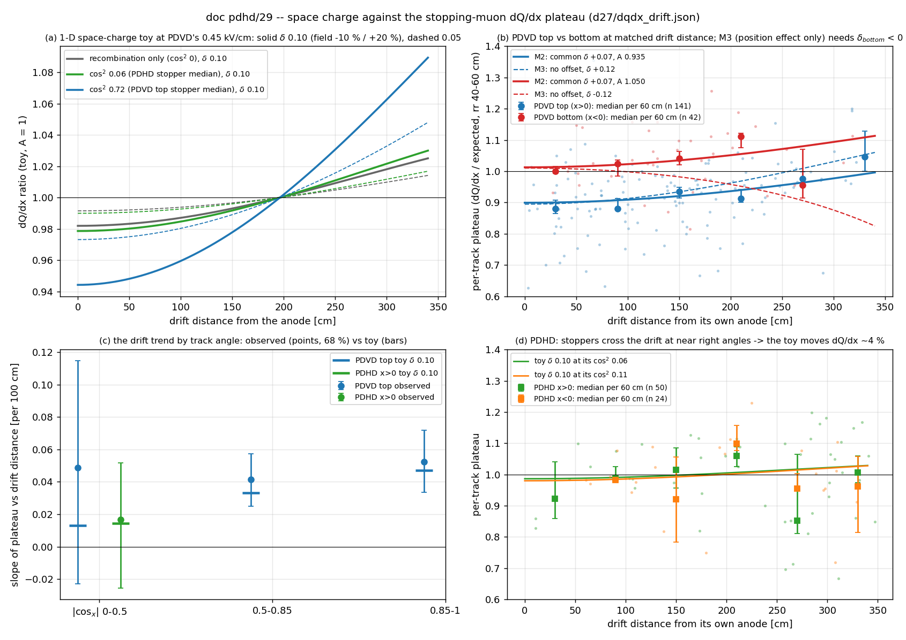

# doc pdhd/29 — Space charge against the stopping-muon dQ/dx position effects: what it explains in PDVD's top volume, why PDHD cannot see it, and why PDVD's top/bottom offset is not a position effect

**The owner's questions (2026-09-13):**
* *"Regarding dQ/dx bias, we know there are so-called space charge effect … its impact is like anti-electron lifetime
  effect … I believe this is the case for both PDHD and PDVD, and the effect is w.r.t. to the distance to the cathode
  plane. I wonder if this can help to explain part of the observations. I want to understand what cannot be explained."*
* *"For the PDVD top vs. bottom, since the two drift volume have different positions and will see different amount of
  STM, I wonder if the observed asymmetry can also be explained by the space charge effect, for example, the position
  dependence effect within the half volume instead of a top vs. bottom asymmetry?"*

The observations are doc pdhd/26 §4.2 and doc pdhd/27 §5: the per-track plateau (median dQ/dx over the expected muon
curve, rr 40–60 cm, no free scale) on hand stoppers the chain accepted on its own Bragg reading.

**Answers:**

1. **The drift trend in PDVD's top volume has the sign, the shape and the size of a ProtoDUNE-SP-like space charge
   (§3).**
   * A 1-D space-charge toy fitted to the 141 top-volume tracks wants **δ = +0.110 [+0.060, +0.130]**. That is a field
     11 % low at the anode and 22 % high at the cathode, against ProtoDUNE-SP's reported ~−10 % / +20 %.
   * The median plateau is flat over the first 120 cm (0.881, 0.880) and then rises (0.935, 0.913, 0.976, 1.045), as a
     field that is flat at the anode and steep at the cathode predicts.
   * **Almost all of it comes through the drift velocity, not recombination.** The chain turns time into position with
     one fixed speed, so where electrons really drift slower the reconstructed pitch along drift is longer and dQ/dx
     reads low. Recombination alone would need δ = +0.30, three times the measured value.
2. **PDHD is not counter-evidence; it cannot test this (§3.3).**
   * PDHD's stoppers cross its horizontal drift almost at right angles (median |cos_x| 0.25, cos² 0.06). PDVD's top
     stoppers mostly follow its vertical drift (0.85, cos² 0.72).
   * At cos² 0.06 the same space charge moves dQ/dx by about 4 % end to end, below PDHD's per-track scatter.
   * PDHD's fitted δ is +0.01 [−0.13, +0.14]: uninformative, not zero.
3. **PDVD's top/bottom offset is not a position effect inside each half-volume (§4).**
   * The two volumes sample the same positions: plateau medians at 128 vs 144 cm from their own anode.
   * At matched drift distance top/bottom reads **0.88 / 0.86 / 0.90 / 0.82** from 0 to 240 cm, and at matched angle
     0.957 vs 1.036 and 0.899 vs 1.066. A pure position effect gives 1.00 in every row.
   * Letting each volume carry its own space charge, with no volume offset, needs **δ_bottom = −0.12 [−0.15, −0.04]**.
     That is a field stronger at the bottom anode than at its cathode, the wrong sign for positive ions, which drift to
     the shared cathode in both volumes. It still fits worse than one common δ plus a volume scale:
     ΔL1 = +1.11 [+0.60, +1.64].
   * The data want both a common space-charge trend (δ +0.07) **and** a top/bottom scale of **0.889
     [0.875, 0.903]**.
4. **What space charge cannot explain (§5):**
   * that ~11 % offset, with all four top anodes low and all four bottom anodes high;
   * the part of the top trend that follows the fit's collection-plane bias;
   * PDHD APA0 at 0.79 and APA1 against APA3;
   * the last-centimetre Bragg shortfall on both detectors.

   The offset follows the readout boundary: top-drift electronics (TDE) above, bottom-drift electronics (BDE, PDHD's
   cold electronics) below.

**Production / scope.**
* **Read-only analysis** of the committed doc 27 table. No C++, config, arm, record or label is touched.
* **No correction proposed:** the chain applies no space-charge or lifetime correction to this dQ/dx, and this doc
  does not add one.
* **Not a measured space charge:** the model is a stated 1-D toy.

## 0. Repro

```sh
I=/nfs/data/1/xqian/toolkit-dev/wcp-porting-img ; X=$I/pdhd/docs/scan/d29
# input: $I/pdhd/docs/scan/d27/dqdx_drift.json (doc pdhd/27 sec 5, committed; PDVD p96vprod, PDHD h26q2dprod whose
#        T_stm_michel_pts rows equal production h28prod's -- doc pdhd/28 writes no point row)
python3 $X/d29_space_charge.py > $X/space_charge.txt      # every number below + figs/29_space_charge.png
```

The durable input is the committed `scan/d27/dqdx_drift.json`. Regenerating this doc needs neither `p96vprod` nor
`h26q2dprod`, so retiring either arm does not affect it. If the PDHD per-track table itself ever has to be rebuilt,
use `h28off`: it is kept, and it is bit-identical to `h26q2dprod` (`scan/d28/gate_h28off.txt`).

Constants are in the script header:
* Modified Box (ArgoNeuT α 0.93, β 0.212 kV/cm·g/cm²/MeV, ρ 1.3954 g/cm³) at plateau dE/dx 2.4 MeV/cm.
* Walkowiak drift velocity at 87.5 K.
* PDVD E₀ 0.45 kV/cm, L 340 cm per volume; PDHD E₀ 0.4959 kV/cm, L 350 cm (the fields each detector's `dqdx_ref`
  uses).
* PDVD's geometry (`protodunevd/params.jsonnet`) puts each volume between the cathode face at |x| = 3.0 cm and the anode
  at |x| = 339.91 cm, an active drift of about 337 cm. The 1 % difference from 340 moves no δ at the quoted precision.
* Bootstraps are over tracks with fixed seeds.

## 1. The space-charge effect

**Mechanism** (Mote, PoS NuFact2021 175; MicroBooNE, JINST 15 P12037):
* A surface LArTPC sees a large cosmic flux.
* The ionization electrons reach the anode in milliseconds, but Ar⁺ ions drift about 2×10⁵ times slower toward the
  cathode and accumulate.
* The ion space charge distorts the drift field, which moves where charge is reconstructed and changes how much
  survives recombination.

ProtoDUNE-SP corrected both with a data-driven 3-D map built from cathode-crossing and CRT-tagged cosmics. It feeds the
map's field into the Modified Box model before the stopping-muon energy calibration.

**Size.**
* ProtoDUNE-SP (500 V/cm, 3.6 m drift, surface): about **−10 % near the anode and +20 % near the cathode**, with spatial
  distortions of tens of cm at the detector faces.
* MicroBooNE simulation (273 V/cm): about −5 % / +12 %.
* *Both percentages are from search summaries of the ProtoDUNE-SP talk (ICHEP 2020) and the MicroBooNE record, not from
  a figure read here. The ProtoDUNE-SP proceedings read for this doc confirm the mechanism and the correction method,
  not the percentages.*

**Scaling to PDHD and PDVD.**
* Both run at the surface in EHN1 with similar drift lengths and fields.
* A naive scaling (ion density ∝ 1/E, field distortion ∝ ρL²/E) puts PDVD's top volume within ~10 % of ProtoDUNE-SP.
* Argon flow reshapes the ion distribution on every one of these detectors, so the maps are 3-D and detector-specific.

**In this chain.**
* No space-charge or lifetime correction enters the dQ/dx the plateau reads: `protodunevd/params.jsonnet` records that
  lifetime has no production consumer.
* PDHD uses space charge only as a fiducial allowance (`pdhd/pr.jsonnet`).
* So both effects are in these ratios uncorrected: space charge raises charge toward the cathode, attachment lowers it
  with drift time.

## 2. The toy, and the two couplings

**Field.** Ions produced uniformly and drifting to the cathode give a density growing linearly with the distance x from
the anode. With the anode–cathode voltage fixed:

  E(x) = E₀ · (1 − δ + 3δ (x/L)²)

The field is −δ at the anode, +2δ at the cathode, and E₀ at x = L/√3. ProtoDUNE-SP's −10 % / +20 % is δ ≈ 0.10. The
shape is the "anti-lifetime" of the question, but not an exponential: flat at the anode, steepest at the cathode.

**Couplings to the measured dQ/dx** (`space_charge.txt` §1):

| coupling | fractional dQ/dx change per fractional field change | depends on |
|---|---|---|
| recombination, Modified Box | +0.160 at 0.45 kV/cm, +0.134 at 0.4959 kV/cm (plateau, 2.4 MeV/cm); +0.46 at 10 MeV/cm | dE/dx |
| drift velocity (reconstructed pitch along drift scales by v₀/v) | +0.50 × cos²θ_x at 0.45 kV/cm, +0.47 × cos²θ_x at 0.4959 | track angle to the drift axis |

**The toy at δ = 0.10, PDVD** (A = 1, dQ/dx ratio vs drift distance from the anode):

| cos²θ_x | 0 cm | 60 | 120 | 180 | 240 | 300 | 340 | end to end |
|---|---|---|---|---|---|---|---|---|
| 0 (recombination only) | 0.982 | 0.984 | 0.989 | 0.997 | 1.007 | 1.018 | 1.025 | +0.043 |
| 0.06 (PDHD stopper median) | 0.979 | 0.981 | 0.987 | 0.997 | 1.009 | 1.022 | 1.030 | +0.051 |
| 0.72 (PDVD top stopper median) | 0.944 | 0.950 | 0.966 | 0.992 | 1.025 | 1.063 | 1.089 | +0.145 |
| 1 | 0.931 | 0.937 | 0.957 | 0.989 | 1.032 | 1.082 | 1.118 | +0.187 |

At δ = 0.05 every deviation is about half.


*(a) The toy at PDVD's field, δ 0.10 solid, 0.05 dashed. (b) PDVD per-track plateaus and 60 cm medians by volume, with
M2 (common δ, a scale per volume, solid) and M3 (no offset, δ per volume, dashed). (c) The slope of the plateau against
drift distance by track angle, observed (68 %) against the toy at δ 0.10. (d) PDHD, with the toy at its own median
angle.*

## 3. What space charge explains

### 3.1 The PDVD top-volume trend: size

Per-track plateau = A × toy(drift, cos²θ_x; δ), fitted with an L1 loss:

| volume | n | δ [68 %] | A | recombination-only fit needs δ |
|---|---|---|---|---|
| **PDVD top** | 141 | **+0.110 [+0.060, +0.130]** | 0.939 | +0.300 |
| PDVD bottom | 42 | +0.040 [−0.030, +0.070] | 1.049 | +0.220 |
| PDHD x > 0 | 50 | unconstrained: +0.010, interval −0.130 to +0.140 | 0.989 | +0.070 |
| PDHD x < 0 | 24 | unconstrained: +0.040, interval −0.160 to +0.050 | 0.995 | −0.130, fitting a falling plateau: the sign of attachment (§3.3) |

**The top-volume size agrees with ProtoDUNE-SP's measurement without being tuned to it.** The drift-velocity coupling
carries it: without it the field would have to be 30 % low at the anode and 60 % high at the cathode.

### 3.2 The PDVD top-volume trend: shape and angle

**Shape.** Median plateau by drift distance is 0.881, 0.880, 0.935, 0.913, 0.976, 1.045 in 60 cm bins (n 32, 36, 34,
20, 13, 6). It is flat near the anode and rises toward the cathode, as the toy is. On 141 noisy tracks a linear and a
pure-x² trend fit about equally well: rms residual 0.146 for both, and a median absolute deviation (MAD) of 0.065
against 0.068 that slightly favours the line. So the shape is consistent, not proven.

**Angle.** The drift-velocity coupling grows with cos²θ_x; recombination does not:

| PDVD top, \|cos_x\| | n | observed slope per 100 cm [68 %] | toy δ 0.10 predicts |
|---|---|---|---|
| 0–0.5 | 28 | +0.049 [−0.020, +0.115] | +0.013 |
| 0.5–0.85 | 44 | +0.041 [+0.023, +0.057] | +0.033 |
| 0.85–1 | 69 | +0.052 [+0.032, +0.072] | +0.047 |

* **Steeper classes:** the two agree with the toy.
* **Shallowest class:** it sits high, with wide errors.
* **Verdict:** no contradiction and no clean confirmation. Some of the trend on shallow tracks is not this coupling (§5
  item 3).

**Within single tracks.** Doc 27 §5.2 measured +0.112 [+0.043, +0.187] per 100 cm in the top volume. The toy's local
slope at δ 0.10 and cos² 0.72 is +0.009 / +0.027 / +0.043 / +0.055 / +0.063 per 100 cm going from the anode to the
cathode. That is consistent at the low edge, and below the central value.

### 3.3 Why PDHD shows nothing

**Track angles.**

| | PDHD x > 0 | PDHD x < 0 | PDVD top | PDVD bottom |
|---|---|---|---|---|
| median \|cos_x\| | 0.25 | 0.33 | 0.85 | 0.80 |
| median cos²θ_x | 0.06 | 0.11 | 0.72 | 0.65 |

PDHD drifts horizontally and cosmic stoppers are steep, so they cross its drift nearly at right angles. At cos² 0.06
only recombination and a sliver of the pitch term remain: +0.042 end to end at δ 0.10, +0.022 at δ 0.05 (PDHD's field
and drift length).

**Why that is invisible in PDHD.**
* **The effect is below the scatter.** It is smaller than PDHD's track-to-track scatter, and its plateau-point drift
  distances are skewed to large values (x > 0 median 259 cm).
* **Attachment competes.** Uncorrected electron attachment pulls the other way. PDHD's shallow-track slopes are
  +0.017 [−0.023, +0.052] (x > 0) and −0.059 [−0.105, −0.012] (x < 0); the second has the sign of attachment.
* **The fit has no leverage.** The fitted δ interval spans −0.13 to +0.14.

**PDHD neither confirms nor refutes space charge**; its geometry cannot measure it on stoppers. Tracks that follow the
drift, such as cathode–anode crossers, would.

## 4. PDVD top vs bottom — a position effect, or an offset?

### 4.1 The two volumes sample the same positions

| | n | plateau drift distance from own anode, p10 / p25 / p50 / p75 / p90 | median \|cos_x\| |
|---|---|---|---|
| top | 141 | 31 / 63 / 128 / 190 / 253 cm | 0.85 |
| bottom | 42 | 52 / 89 / 144 / 183 / 248 cm | 0.80 |

Different stopper counts (141 against 42) do not mean different positions. The ions come from all cosmic ionization,
mostly through-going muons, not from the stoppers.

### 4.2 The offset survives matching

| drift distance from own anode | top median (n) | bottom median (n) | top / bottom |
|---|---|---|---|
| 0–60 cm | 0.881 (32) | 1.000 (7) | **0.881** |
| 60–120 cm | 0.880 (36) | 1.025 (8) | **0.859** |
| 120–180 cm | 0.935 (34) | 1.042 (13) | **0.897** |
| 180–240 cm | 0.913 (20) | 1.111 (9) | **0.822** |
| 240–300 cm | 0.976 (13) | 0.956 (3) | 1.021 (bottom n 3) |

**Matched in angle too**, drift 0–240 cm:

| \|cos_x\| | top median (n) | bottom median (n) |
|---|---|---|
| 0.5–0.85 | 0.957 (36) | 1.036 (25) |
| 0.85–1 | 0.899 (60) | 1.066 (8) |

**By anode:**

| volume | anode: median (n) |
|---|---|
| top | 4: 0.899 (35), 5: 0.923 (27), 6: 0.918 (43), 7: 0.887 (24) |
| bottom | 0: 1.066 (10), 1: 1.084 (10), 2: 1.044 (12), 3: 1.008 (10) |

A position effect referenced to the cathode gives the same value at the same distance in both volumes, so the ratio
would be 1.00 in every matched row. It is 0.82–0.90. The split also falls exactly on the readout boundary, not smoothly
across the detector.

### 4.3 Model comparison

Four models over both PDVD volumes (n 183), each plateau = A × toy:

| model | what it allows | L1 loss | parameters |
|---|---|---|---|
| M1 | one A, one δ: symmetric space charge, no offset | 19.87 | A 0.950, δ +0.070 |
| **M3** | **one A, δ per volume: the position-effect hypothesis, space-charge size free per volume, no offset** | 19.19 | A 0.960, δ_top +0.120, **δ_bottom −0.120** |
| **M2** | **A per volume, one δ: common space charge plus a volume offset** | **18.02** | A_top 0.935, A_bottom 1.050 (**ratio 0.890**), δ +0.070 |
| M4 | A and δ per volume | 17.94 | top A 0.940 δ +0.110; bottom A 1.050 δ +0.040 |

**Bootstrap (150):**
* A_top/A_bottom = **0.889 [0.875, 0.903]**.
* M3's δ_top = +0.12 [+0.09, +0.16], δ_bottom = **−0.12 [−0.15, −0.04]**.
* loss(M3) − loss(M2) = **+1.11 [+0.60, +1.64]**.

**Reading it.**
* **M3 can only remove the offset by giving the bottom volume negative space charge.** Its field would be 1.12 E₀ at
  the bottom anode and 0.76 E₀ at the cathode.
  * Positive ions drift to the shared cathode in both volumes, so they cannot do that.
  * More or less ionization in one volume changes δ's magnitude, not its sign.
* **M3 still misses the bottom volume where it has data:** predicted 0.982 / 0.952 against 1.042 / 1.111 at
  120–240 cm.
* **Offset versus separate sizes.** With the same number of parameters, the volume offset (M2) fits better, and
  excludes zero at 68 %. Freeing δ per volume on top of the offset (M4) gains little: 17.94 against 18.02.
* **The bottom volume's own trend is weak and mixed:** +0.061 [+0.018, +0.104] per 100 cm for \|cos_x\| 0.5–0.85, but
  −0.044 [−0.083, −0.016] for the 11 steepest tracks, against a predicted +0.058. A common δ is allowed, not
  demonstrated.

## 5. What space charge cannot explain

1. **The ~11 % top/bottom offset in PDVD** (§4). It survives matching in drift distance and angle, and removing it
   needs wrong-sign space charge in the bottom volume.
   * **The boundary it follows** is the readout one. The top volume is read by TDE: cold amplifiers reached through
     chimneys and digitization on the roof. The bottom volume is read by BDE, the in-liquid cold electronics also used
     by PDHD.
   * **Candidates:** a gain or response difference in the processing, or one that depends on pulse width. Not tested
     here.
2. **Whether the collection-plane fit bias and space charge overlap.** Doc 27 §5.3 halved the top-volume fall toward
   the anode (0.086 → 0.043) by multiplying the plateau by W measured/predicted.
   * **Space charge cannot be that part.** It displaces charge and changes its size the same way on all three wire
     planes, so it cannot make the collection plane alone disagree with the fit.
   * **So δ is bounded.** If that bias is a separate half, space charge is nearer δ ≈ 0.05 (MicroBooNE-like). The
     +0.110 fitted here is then an upper bound.
   * **The within-track slope** (+0.112 per 100 cm, above the toy's +0.03–0.06 over most of the drift) points the same
     way.
   * **Unresolved:** the §5.3 proxy mixes rr ranges, so whether it removes only fit bias is not known.
3. **The shallow-track part of PDVD's top trend.** Tracks with \|cos_x\| < 0.5 show +0.049 per 100 cm, where the toy
   gives +0.013 (§3.2). The errors are wide, but what is there is not the drift-velocity coupling.
4. **PDHD APA0 at 0.79 against APA2 at 0.99** (doc 26 §4.2). They share a drift volume, so space charge is common to
   both. This is the hardware or reconstruction deficit doc pdvd/50 isolated.
5. **PDHD APA1 at 1.057 against APA3 at 0.983**, in the same drift volume. At PDHD's track angles space charge moves
   dQ/dx by a few %. A 7 % difference along z would need a strongly z-asymmetric map, which is not measured here.
6. **The last-centimetre Bragg shortfall** (0.71 PDHD, 0.64 PDVD; doc 26 §4.1).
   * **Size:** recombination is 3× more field-sensitive at 10 MeV/cm than on the plateau, so space charge would deepen
     a near-anode Bragg deficit by a few %, not 30 %.
   * **Geometry:** the shortfall is similar on both detectors despite opposite track geometry. It is dominated by
     sampling and stop placement.
7. **The absolute plateau levels** (PDHD 0.99, PDVD pooled 0.95). The toy's volume average is about 1; PDVD's pooled
   value is the mix of the two volumes' scales.

## 6. What is NOT concluded

* **Not a measurement of PDVD's or PDHD's space charge.** The model is 1-D. Real space charge is 3-D, largest near the
  field-cage walls, and shaped by argon flow. δ is an effective size for the plateau points these stoppers sample.
* **Not a separation of space charge from electron attachment.** Both are uncorrected. On PDVD's top trend the fitted δ
  is net of any attachment, and on PDHD the two are degenerate.
* **Not the cause of PDVD's top/bottom offset.** §4 excludes a cathode-referenced position effect. The electronics
  boundary is a candidate, not a finding.
* **Not a correction.** Nothing is proposed for the chain.
* **The literature percentages** (ProtoDUNE-SP −10 % / +20 %, MicroBooNE −5 % / +12 %) are quoted from search summaries,
  not read from their figures (§1).
* **Small samples.** PDVD bottom has 42 tracks, 11 of them steep; PDHD has 74. PDHD's null is uninformative, not zero.

## 7. Next, ranked

1. **Split PDVD's top-volume plateau by TDE channel group and by pulse width** (doc 27 §8 item 4). This decides the
   offset's mechanism independently of space charge.
2. **A space-charge test through dE/dx.** The two couplings respond differently to dE/dx:
   * **recombination** makes the deficit about 3× larger at the Bragg peak (10 MeV/cm) than on the plateau;
   * **drift velocity** does not depend on dE/dx;
   * **an electronics gain** gives the same fraction at both.

   So the near-anode deficit should grow toward the Bragg peak by an amount set by how much of it is recombination.
   Doc 26's per-bin dQ/dx vs rr split by drift distance, on PDVD top, can read it. On shallow tracks (\|cos_x\| < 0.5) the
   recombination part is a larger share, since the pitch part scales with cos²θ_x.
3. **Measure the distortion directly.** On PDVD, use cathode-crossing cosmics, as ProtoDUNE-SP did: the cathode gives
   t₀ and the known position. Endpoint offsets at the faces give the spatial map. On PDHD, only tracks that follow the
   drift can see the dQ/dx coupling.
4. **Only then** consider a space-charge or lifetime term in the expected curve. Today neither is corrected, and they
   pull in opposite directions.

## Files

| file | what |
|---|---|
| `scan/d29/d29_space_charge.py` | every number in this doc, and the figure; input `scan/d27/dqdx_drift.json` |
| `scan/d29/space_charge.txt` | its output |
| `figs/29_space_charge.png` | §2–4 figure |

## Sources

* [Mote (DUNE), *Measurement of space charge effects and energy calibration in ProtoDUNE-SP*, PoS NuFact2021 175](https://www.osti.gov/biblio/1870660)
* [Mooney, *Measurement of space charge effects in ProtoDUNE-SP*, ICHEP 2020](https://indico.cern.ch/event/868940/contributions/3813672/)
* [MicroBooNE, *Measurement of space charge effects in the MicroBooNE LArTPC using cosmic muons*, JINST 15 P12037 (arXiv:2008.09765)](https://arxiv.org/abs/2008.09765)
* [DUNE, *First results on ProtoDUNE-SP liquid argon TPC performance from a beam test at the CERN Neutrino Platform*, JINST 15 P12004 (arXiv:2007.06722)](https://arxiv.org/pdf/2007.06722)
* [DUNE, *The DUNE Far Detector Vertical Drift Technology, Technical Design Report* (arXiv:2312.03130)](https://arxiv.org/pdf/2312.03130), for TDE and BDE
* Walkowiak, *Drift velocity of free electrons in liquid argon*, NIM A 449 (2000) 288, for the drift-velocity form (as coded in LArSoft)
