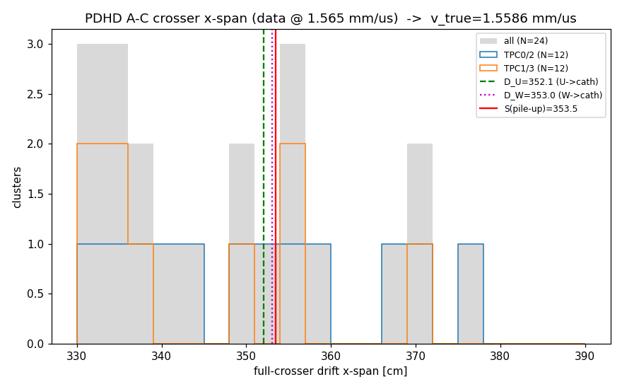

# PDHD clustering algorithm (baseline reference)

This documents the PDHD clustering chain as configured in
`cfg/pgrapher/experiment/pdhd/clus.jsonnet` (moved there from the local
`pdhd/clus.jsonnet`), driven by `pdhd/wct-clustering.jsonnet` /
`run_clus_evt.sh`.  It is the baseline to diff against when the algorithm is
updated.

## Data flow

```
imaging output (per APA):
  clusters-apa-apa{N}-ms-active.tar.gz   (3-view live blobs, post-deghosting)
  clusters-apa-apa{N}-ms-masked.tar.gz   (2-view blobs over dead regions)
        |  ClusterFileSource x2 per APA
        v
  per-APA stage (per_apa) -- internally runs the per-face stage on face 0/1
        |  x2 APAs per drift side
        v
  per-drift-group stage (per_group) -- {APA0,APA2} (drift -x) / {APA1,APA3} (drift +x)
        |  x2 groups
        v
  all-TPC stage (all_tpc) -> mabc-all-apa.zip (Bee) + trash-all-apa.tar.gz
```

Every stage is one `MultiAlgBlobClustering` (MABC) node executing a configured
`pipeline` of `Clustering*` components (from
`cfg/pgrapher/common/clus.jsonnet` `clustering_methods`).

## Geometry / point-cloud building

`DetectorVolumes` metadata (`dvm` in clus.jsonnet):

| key | meaning |
|---|---|
| overall FV | x ±357.985 cm, y [7.61, 606.0] cm, z [0.234, 462.297] cm (margins 2/2.5/3 cm) |
| a0f0pA / a2f0pA | active face, drift −x: FV_x [−357.985, −2.54] cm |
| a1f1pA / a3f1pA | active face, drift +x: FV_x [+2.54, +357.985] cm |
| a0f1pA, a1f0pA, ... | wall-facing (degenerate) faces: FV_x pinned at ±357.985 cm |
| per-face params | `drift_speed` 1.565 mm/µs (calibrated, see below; was 1.6), `tick` 0.5 µs, `nticks_live_slice` 4, `time_offset` (see T0 below) |

`detector_volumes(anodes, face)` builds the per-stage `DetectorVolumes`; the
`face` argument scopes the instance NAME (the per-face and per-drift-group
stages name their dv for the one drift volume they operate on, e.g.
`dv-apa0-2-0`).  The metadata always carries both faces of every anode:
`Grouping::fill_dv_cache` reads drift parameters for every geometry face, so
removing the off-scope face's entry would silently zero those cache values.

Per face, two `ClusterScopeFilter`s (live/dead) feed one `PointTreeBuilding`
with two `BlobSampler`s:

* **live** sampler: `strategy: ["stepped"]`, with `drift_speed` and
  `time_offset`; extras: wire_index, charge_val, charge_unc, wpid.
* **dead** sampler: `strategy: ["center"]`, all extras, no time offset.

The drift coordinate of every sampled point is

```
x = xorig + dirx * (t_slice + time_offset) * drift_speed
```

with `xorig` = collection-plane wire x of the (anode,face) and `dirx` =
`anodeface->dirx()` (BlobSampler::time2drift, `clus/src/BlobSampler.cxx`).

## Stage 1 — per-face pipeline (`clus_per_face`)

Coordinates: raw `["x","y","z"]`.  Methods in order
(jsonnet method → WCT component, key parameters):

| # | method | component | parameters / role |
|---|---|---|---|
| 1 | `pointed()` | ClusteringPointed | initial cluster formation from the point tree (live grouping) |
| 2 | `live_dead(dead_live_overlap_offset=2)` | ClusteringLiveDead | merge live clusters bridged by dead regions |
| 3 | `extend(flag=4, length_cut=60cm, num_try=0, length_2_cut=15cm, num_dead_try=1)` | ClusteringExtend | track-extension merge toward boundaries/dead regions |
| 4 | `regular("-one", length_cut=60cm, no extend)` | ClusteringRegular | general proximity/direction merge, long range |
| 5 | `regular("_two", length_cut=30cm, extend)` | ClusteringRegular | second pass, shorter range with extension enabled |
| 6 | `parallel_prolong(length_cut=35cm)` | ClusteringParallelProlong | merge parallel/prolonged track fragments |
| 7 | `close(length_cut=1.2cm)` | ClusteringClose | merge clusters in close contact |
| 8 | `extend_loop(num_try=3)` | ClusteringExtendLoop | iterate the extend family 3× |
| 9 | `connect1()` | ClusteringConnect1 | final connection pass |

(`separate(use_ctpc)` used to run between extend_loop and connect1; it moved
to the per-drift-group stage.  `isolated()` and `retile(...)` exist in the
toolbox but are commented out at this stage.)

Per-face MABC dumps `mabc-apa{N}-face{F}.zip` (Bee set "clustering",
`individual: true`) when run with `dump=true` — in the standard chain the
per-face nodes run with `dump=false` inside the per-APA stage.

## Stage 2 — per-APA (`clus_per_apa`)

The two per-face outputs are merged by `PointTreeMerging` (multiplicity 2),
then a per-APA MABC runs:

| # | method | component | role |
|---|---|---|---|
| 1 | `deghost()` | ClusteringDeghost | cross-face ghost removal (PDHD-specific; PDVD does not run it here) |
| 2 | `protect_overclustering()` | ClusteringProtectOverClustering | undo pathological merges |

Dump (when standalone): `mabc-apa{N}.zip`.

## Stage 3 — per-drift-group (`clus_per_group`)

`PointTreeMerging` over the 2 APAs of one drift side (`tolerate_missing:
true` — an absent APA input does not abort).  A group is x-aligned APAs
viewed through a **common face**, i.e. exactly one drift volume: group02 =
{APA0, APA2} face 0 (drift −x) and group13 = {APA1, APA3} face 1 (drift +x).
The group's `DetectorVolumes` is named for that drift volume
(`detector_volumes(anodes, face)`, e.g. `dv-apa0-2-0`); its metadata still
carries both faces of each anode because `Grouping::fill_dv_cache` reads
drift parameters for every geometry face — the off-scope entries are inert
(no data wpid carries them) and `examine_x_boundary` enforces the scope on
the wpids actually present.  The opposite-face groups (APA0+APA2 face 1,
APA1+APA3 face 0) are PDHD wall faces that do not image, so each drift side
has exactly one populated group and they are not wired.  Coordinates: raw
`["x","y","z"]`.  Then:

| # | method | component | role |
|---|---|---|---|
| 1 | `extend(flag=4, 60cm/15cm, num_dead_try=1)` | ClusteringExtend | as stage 1, across the drift side |
| 2 | `regular("1", 60cm, no extend)` | ClusteringRegular | |
| 3 | `regular("2", 30cm, extend)` | ClusteringRegular | |
| 4 | `parallel_prolong(35cm)` | ClusteringParallelProlong | |
| 5 | `close(1.2cm)` | ClusteringClose | |
| 6 | `extend_loop(3)` | ClusteringExtendLoop | |
| 7 | `separate(use_ctpc=true)` | ClusteringSeparate | split over-merged clusters (moved here from the per-face stage) |
| 8 | `connect1()` | ClusteringConnect1 | **added 2026-06-10** — MicroBooNE order after separate: reconnect dashed-line fragments (e.g. drift-direction tracks) at group scope; generalized via per-point wpid routing + per-volume angles (clus/docs/clustering-group-connect1-deghost.md) |
| 9 | `deghost(empty_view_unique=true)` | ClusteringDeghost | **added 2026-06-10** — group-scope ghost removal; empty_view_unique is REQUIRED at this scope (an empty per-volume 2D index otherwise reads as overlap and the longest cluster of each unseeded volume is wrongly destroyed) |
| 10 | `examine_x_boundary()` | ClusteringExamineXBoundary | split clusters at the drift-x fiducial boundary (newly enabled; the C++ accepts multi-wpid groupings only when the wpids form one drift volume: same face AND identical FV_x metadata — mixed faces or differing x ranges raise) |
| 11 | `neutrino()` | ClusteringNeutrino | neutrino-candidate tagging/merge |
| 12 | `isolated()` | ClusteringIsolated | small→big isolated-cluster absorption |
| 13 | `examine_bundles()` | ClusteringExamineBundles | bundle examination/final merge |

Dump (when standalone): `mabc-group02.zip` / `mabc-group13.zip`.

## Stage 4 — all-TPC (`clus_all_tpc`)

`PointTreeMerging` over the 2 drift groups (`tolerate_missing: true`), then:

| # | method | component | coords | role |
|---|---|---|---|---|
| 1 | `switch_scope()` | ClusteringSwitchScope (T0Correction) | x→x_t0cor | computes the T0-corrected coordinate set (`["x_t0cor","y","z"]`) and applies a containment scope filter per (apa,face) volume |
| 2 | `cathode_connect(...)` | ClusteringCathodeConnect | x_t0cor | **enabled 2026-06-09**: cathode-crossing connector with the SBND-tuned parameter set (cathode_x_cut=5cm, drift_cut=8cm, min_length_short=2cm, short_dir_len=25cm, conn_short_cut=30) as placeholder, plus `use_flash_t0=false` because PDHD has no flash matching (the default flash-coincidence gate would veto every pair).  PDHD's cathode is central at x=0 (the C++ default `cathode_x` — a config knob, not hardcoded).  Without a per-event T0 only near-trigger-time crossers qualify (a crosser's apparent cathode tips sit at \|x\| ≈ t0·v_drift on opposite sides of x=0); on run 027409 evt 0 the pass fires zero times and the output is content-identical to the pre-enable chain. |

A `retile` block (ClusteringRetile with per-face stepped samplers) is present
but commented out — the designated hook for re-tiling-based refinement.

Without a flash/T0 association, `x_t0cor` equals the (time_offset-shifted)
apparent x.

## Bee output (`mabc-all-apa.zip`)

Two point sets + dead areas, all with `use_config_rse: true` (runNo/subRunNo/
eventNo come from the `run_clus_evt.sh` TLAs):

| Bee instance | source |
|---|---|
| `clustering-group02` / `clustering-group13` | `name:"img"` hook: the live grouping **before** the all-APA pipeline (i.e. the per-APA clustering result), grouped by drift side via `apa_drift_groups` (APAs 0+2 / 1+3) |
| `clustering-global` | `name:"clustering"`: the **end** dump after the full all-APA pipeline |
| `channel-deadarea-group02/13` | `save_deadarea` with `dead_area_version: 2` (tpc=apa wrapper), grouped by `dead_apa_groups` |

Coordinates dumped are the uncorrected `["x","y","z"]` (x_t0cor would need a
flash-associated T0).  `run_bee_combined_evt.sh` merges these with the
imaging-stage `imaging-group02/13` instances (wirecell-img `bee-blobs` on the
`-ms-active` tarballs) into one upload.

## Where T0 enters (all zeroed as of 2026-06)

There is **no per-event T0 determination for PDHD**; the chain now uses
`time_offset = 0` everywhere, so a blob's x is its apparent drift position in
the readout frame (250 µs ≡ 39 cm at 1.565 mm/µs):

1. `cfg/pgrapher/experiment/pdhd/clus.jsonnet` — `time_offset` function
   parameter (default **0**; was −250 µs = readout-tick0-relative-to-trigger
   compensation).  Feeds both the live `BlobSampler` and the
   `DetectorVolumes` per-face metadata consumed by T0Correction.
2. `pdhd/wct-clustering.jsonnet` — `time_offset` TLA (default 0) passed
   through to the cfg file.
3. Imaging-Bee conversion `--t0` (wirecell-img bee-blobs):
   `run_bee_combined_evt.sh`, `run_bee_img_evt.sh`, `build_apa0_bee.sh`,
   `build_perapa_bee.sh`, `wct-img-2-bee.py` — all now `--t0 "0*us"` (were
   250 µs, the sign-flipped equivalent of the clustering offset) so imaging
   and clustering instances overlay in the combined display.
4. `pdhd/img_plot/preprocess_event.py` — `TIME_OFFSET_NS = 0.0` (viewer-side
   reproduction of time2drift; `img_viewer.py` reads the per-event meta, so
   caches preprocessed before the change stay self-consistent).

Restore a real value (clus jsonnet param + the bee `--t0`s, opposite signs)
once a T0 measurement exists.

## Drift-velocity calibration (anode→cathode crossers)

The reconstruction maps slice time to drift-x with a fixed `drift_speed`.  DUNE
software does **not** hard-code this: LArSoft computes it at run time from the
Walkowiak parametrization at the configured field (500 V/cm) + LAr temperature,
≈ **0.1565 cm/µs = 1.565 mm/µs**.  The PDHD Garfield field response is itself
computed at that value (`dune-garfield-1d565.json.bz2`, see params `files.fields`).
The clustering/imaging chain, however, was using the rounded **1.6 mm/µs**.  We
calibrated it directly from data.

**Method.**  A clean anode→cathode crosser drifts a *known* physical distance, so
its reconstructed drift x-span obeys `S = drift_speed · Δt_drift = D · (v_reco /
v_true)`, hence `v_true = v_reco · D / S`.  The x-span is offset-independent
(`xorig` cancels in max−min), so only the two physical endpoints matter:

* **anode end** — the U / first-induction plane (the cathode-facing wire plane a
  crosser physically enters; the `apa_plane` cutoff in `params.jsonnet` is *defined*
  to sit at the first induction wires).  Its |x| from the CPA = `apa_cpa − apa_plane
  = 352.094 cm`.
* **cathode end** — the cathode drift-facing **surface**, |x| = `½·cpa_thick = 0.159
  cm` (thickness-corrected).

So the reference distance is **D_U = 351.94 cm** (U-plane → cathode surface; the
`apa_plane` cutoff coincides with the store's U plane at |x| = 352.22 cm).  The
`protodunehd-wires-larsoft-v1` store puts the three wire planes at |x| =
352.22 / 352.71 / 353.20 cm (U / V / W) — **one pitch (~4.9 mm) apart, U-W ≈
0.98 cm**.  So the W collection plane is at 353.20 cm (NOT the APA centerline,
357.34), and the W-plane→cathode distance is **D_W = 353.04 cm**.  The U-vs-W
choice therefore moves D by only ~0.98 cm (~0.3 %), not the ~5 cm I first stated;
either way the calibrated velocity is essentially unchanged.

**Data.**  `pdhd/work/<run>_<evt>/mabc-all-apa.zip` → `0-clustering-group02.json`
(APAs 0+2, TPC0/2, drift −x) and `…-group13.json` (APAs 1+3, TPC1/3, drift +x);
115 events over runs 027305 / 027980 / 028084 / 029107.  `x` there is already the
drift coordinate (cm); cathode ≈ 0, anodes at ∓352.  Both drift volumes are used.

**Selection** (`pdhd/drift_calib/calib_drift_velocity.py`).  Per cluster compute the
drift extent and the side-relative anode/cathode extremes.  A genuine full crosser
must (a) reach the anode edge (`anode_reach ≥ 340 cm`) **and** (b) land its cathode
end in a small window around the cathode (reached it, small overshoot — *not* a CPA /
cross-volume over-merge shooting far past it).  This rejects both the over-cluster
tail (span > D) and short/broken tracks (span < D), per the known failure modes.

**Result** (N = 9 clean full crossers on the original 1.6 dumps):

| quantity | TPC0/2 | TPC1/3 | all |
|---|---|---|---|
| full-crosser span S (**median**, cm) | 363.2 | 363.4 | 363.2 |
| v_true = 1.6·D_U/S (median) (mm/µs) | 1.550 | 1.550 | 1.550 |
| v_true with D_W=353.04 (W systematic) | 1.555 | 1.554 | 1.555 |

(Figure: re-clustered-at-1.565 closure distribution below.)

**The span estimate is bracketed by two opposing biases.**  *Over-merging* (a crosser
merging with a delta-ray / crossing track) lengthens the span and pulls the **median**
LOW (~1.55, the table above).  *Crosser truncation / fragmentation* (a clipped end)
shortens the span and pulls the robust **pile-up** estimator HIGH (~1.57, see the
closure check).  The true value is therefore bracketed in ≈ **[1.55, 1.57]** (the
U-vs-W reference, ~0.98 cm, is a sub-dominant ~0.3 %).

**Config change.**  `drift_speed` is set to **1.565 mm/µs** — the **midpoint of the
[1.55, 1.57] two-bias bracket**, equal to the Garfield field response
(`dune-garfield-1d565`) and LArSoft/Walkowiak at 500 V/cm, and consistent with the
PDVD data (~1.57):

* `cfg/pgrapher/experiment/pdhd/params.jsonnet` — PDHD-only `lar.drift_speed` override
  (feeds `img.jsonnet`, `qlmatching.jsonnet`, sim drift via `params.lar.drift_speed`).
* `cfg/pgrapher/experiment/pdhd/clus.jsonnet` — `local drift_speed` (BlobSampler /
  `DetectorVolumes`).
* `pgrapher/common/params.jsonnet` is **not** touched (shared with SBND/PDVD).

The 115 events were re-clustered at 1.565 (`run_clus_evt.sh <run> all`); imaging
`clusters-apa-*.tar.gz` is drift-independent so only clustering re-ran.
`pdhd/img_plot/preprocess_event.py`'s viewer `DRIFT_MM_PER_NS` should be set to
`1.565/1000` to match the re-clustered dumps.

Reproduce (the `work/` dumps are now re-clustered at 1.565, so pass the matching
`--v-reco`): `python pdhd/drift_calib/calib_drift_velocity.py --v-reco 1.565`
(prints per-volume velocities + writes `pdhd/drift_calib/drift_velocity_calib.png`).

## Closure check on the re-clustered (1.565) data

Re-running the calibration on the 115 events after re-clustering them at the adopted
1.565 (`calib_drift_velocity.py --v-reco 1.565`):



* **N = 24** intact full crossers (12 TPC0/2 + 12 TPC1/3).  The combined span pile-up
  (353.5 cm) **recovers v_true ≈ 1.559 mm/µs — only ~0.4 % below the input 1.565**.
  (The per-TPC pile-ups still disagree, TPC0/2 → 1.599 / TPC1/3 → 1.559, a residual of
  the crosser fragmentation discussed below — many A-C crossers are split / end-clipped
  by the group-stage clustering, so the span estimate is noisy.)

* **Self-consistency / fixed point.**  Repeating the closure at two inputs gives
  recovered(1.55) = 1.570 and recovered(1.565) = 1.559 — i.e. the recovered velocity
  *crosses* the input between them.  The self-consistent value (recovered = input) is
  **≈ 1.561 mm/µs**, and the adopted 1.565 sits only ~0.2 % above it.  This brackets
  the two estimator biases directly: 1.55 (median, over-merge-low) recovers high, 1.565
  recovers ~itself, so the true value is ~1.56, not the median 1.55.

**Bottom line.**  1.565 is confirmed by the closure to ~0.4 % and sits ~0.2 % from the
self-consistent fixed point (~1.561); it equals the `dune-garfield-1d565` field
response / LArSoft-Walkowiak value and is consistent with the PDVD data (~1.57).
Adopted.  (PDVD, with ~50 un-fragmented crossers, closes more tightly, ~0.4 % from a
single run — see pdvd/docs/clus-workflow.md.)  Reducing the PDHD A-C-crosser
fragmentation under the current clustering would tighten the per-TPC agreement further.
