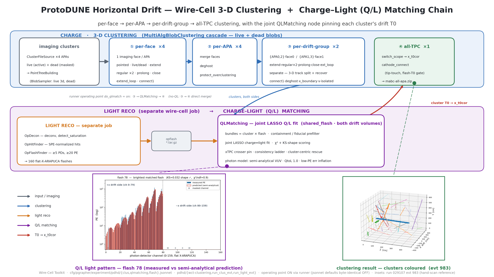

# PD-HD clustering + Q/L-matching presentation diagram

A wide (16:9) diagram of the ProtoDUNE-HD Wire-Cell **3-D clustering**
(4-stage `MultiAlgBlobClustering` cascade) and **charge–light (Q/L) matching**
chain, with two data insets, for presentation use.  Counterpart of the PD-VD
original
([pdvd/docs/17_pdvd-clustering-qlmatching-chain.md](../../pdvd/docs/17_pdvd-clustering-qlmatching-chain.md))
— same layout, ProtoDUNE-HD configuration facts.  Companion reference docs:
[clustering-algorithm.md](clustering-algorithm.md),
[qlmatching-chain.md](qlmatching-chain.md); see
[imaging-chain-diagram.md](imaging-chain-diagram.md) for the upstream stage.



Deliverable: `pdhd/pics/pdhd_clus_ql_chain.png` (3840×2160) and `.pdf`.

## Repro block

All commands run in the toolkit-dev direnv python env from `pdhd/pics/`:

```bash
python3 make_clus_srcdata.py       # work/029107_0 dumps -> clus_chain_src/*.npz (committed)
python3 make_clus_insets.py        # npz -> clus_event_3d.png + qlmatch_pattern.png
python3 make_clus_chain_diagram.py # -> pdhd_clus_ql_chain.png / .pdf
```

`clus_chain_src/` holds the two slim npz plus the rendered inset PNGs
(committed), so the master build is self-contained; `make_clus_srcdata.py`
records how the npz were extracted from the run-029107 evt-983 pipeline
products (read-only — nothing under `work/` is touched).

## The chain (what the boxes are)

Traced from `cfg/pgrapher/experiment/pdhd/{clus,qlmatching,flash}.jsonnet`
and the runners `pdhd/wct-clustering.jsonnet` / `run_clus_evt.sh` /
`run_light_evt.sh`.

**Charge band — the 4-stage clustering cascade** (each stage a
`MultiAlgBlobClustering` visitor pipeline over the live+dead point trees):

| stage | multiplicity | what runs |
|---|---|---|
| input | ×4 APAs | `ClusterFileSource` reads our live (`-ms-active`) + dead (`-ms-masked`) imaging tarballs → `PointTreeBuilding` (BlobSampler: live "3d" stepped points + dead centers) |
| ① per-face | ×4 (one imaging face per APA) | `pointed · live_dead · extend · regular ×2 · parallel_prolong · close · extend_loop · connect1` |
| ② per-APA | ×4 | merge faces (`PointTreeMerging`) · `deghost` · `protect_overclustering` |
| ③ per-drift-group | ×2 | groups {APA0,APA2}·face0 (drift −x) and {APA1,APA3}·face1 (drift +x): `extend · regular ×2 · parallel_prolong · close · extend_loop · separate · connect1 · deghost · examine_x_boundary · neutrino · isolated` |
| ④ all-TPC | ×1 | `switch_scope` → `x_t0cor` (T0-corrected coordinates) · `cathode_connect` (tip-touch + flash-T0 gate, stitches cathode crossers) → `mabc-all-apa.zip` (`clustering-global`, `img-global`, `op`) |

PD-HD geometry note baked into the diagram: each APA images through exactly
one face (even idents → face 0, odd → face 1; the opposite faces are
non-imaging wall faces), so the per-face stage is ×4 and each drift side has
one populated group.

**Light band** — the separate light-reco wire-cell job (`OpDecon` with
saturation detection → `OpHitFinder` → `OpFlashFinder`, ≥5 fired PDs and
≥20 PE per flash) writes an `opflash_*.tar.gz` archive; `wct-clustering`
reads it back and one joint `QLMatching` node (`nin=2`, shared flash list,
both drift volumes) forms cluster×flash bundles, prefilters on containment /
fiducial volume, runs the joint LASSO charge↔light fit with χ² + KS-shape
scoring, applies the xTPC crosser pin / consistency ladder / cluster-centric
rescue, and emits one pre-merged tree whose per-cluster flash T0 drives
`x_t0cor` in stage ④.  Photon model: **semi-analytical** VUV-only
(`semi-analytical-pdhd.json`, `QtoL 1.0`, `vuv_eff 0.01281`) over the 160
flat X-ARAPUCAs (ch 0–79 view drift +x, 80–159 view drift −x; static dead
mask [3, 86, 87, 97, 107, 116, 117]) — unlike PD-VD's 128 nm visibility
library over 40 mixed-family PDs.  With `do_qlmatch=false` (the jsonnet
default) stage ③ merges directly into ④ — the runner operating point turns
matching on.

## Data insets (run 029107 evt 983 — the hand-scan reference event)

| inset | source | shows |
|---|---|---|
| clustering result 3-D | `clustering-global` cloud of `work/029107_0/mabc-all-apa.zip` → `event3d_clusters_983.npz` | the all-TPC, deghosted, track-separated, T0-corrected point cloud coloured by cluster id (98 clusters, 109k points) — the object the Q/L matcher pairs with flashes |
| Q/L light pattern | flash gid 78 + its auto-selected bundle from `work/029107_0/calib-evt983.json` → `qlmatch_flash78.npz` | measured vs semi-analytical-predicted PE over the 160 PDs for the brightest cleanly-matched flash: KS=0.032 (shape ✓), χ²/ndf=0.9, 11.4k PE, all light on the +x side (one-sided illumination is the PD-HD PD geometry) |

## Verification

- `make_clus_srcdata.py` → `make_clus_insets.py` → `make_clus_chain_diagram.py`
  run clean → 3840×2160 PNG + PDF; both bands, the opflash archive bridge, the
  clusters-down / T0-up arrows, legend and footer all legible, no text
  overlaps (the T0 label was moved clear of its arrow), 16:9.
- Chain facts cross-checked against `pdhd/wct-clustering.jsonnet` (group
  definitions, premerged all-TPC when matching is on) and
  `cfg/pgrapher/experiment/pdhd/qlmatching.jsonnet` (joint matcher, semi-
  analytical model, 160 channels, dead mask) — and the flash thresholds
  against `flash.jsonnet` (`min_fired_pds: 5`, `min_total_pe: 20`).
- Inset data are our own pipeline products (`work/029107_0`), read-only; the
  npz extraction is committed (`make_clus_srcdata.py`) so the provenance is
  reproducible.
- No toolkit C++/cfg touched — docs/figure deliverable only; no build or A/B
  gate required.
