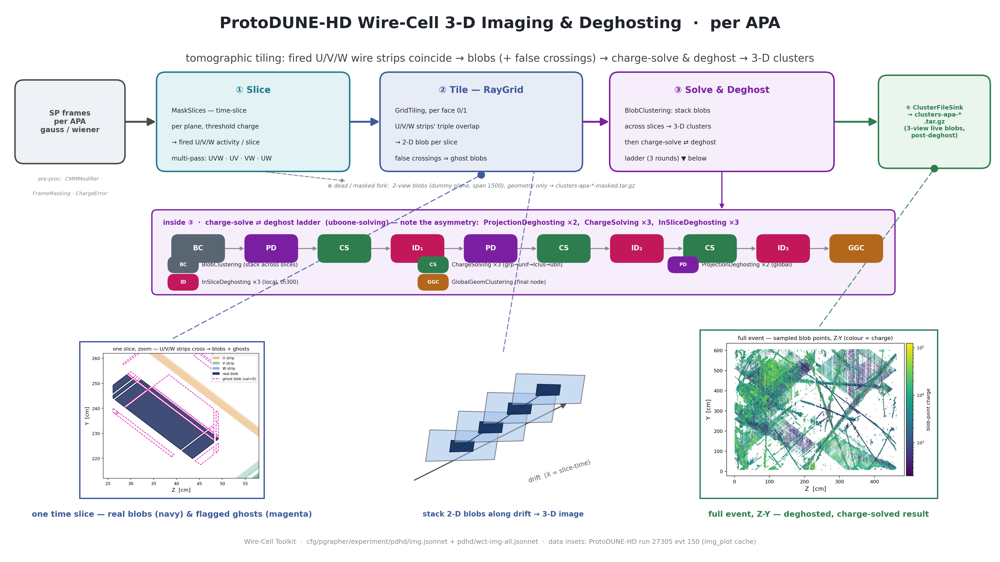

# PD-HD 3-D imaging & deghosting algorithm diagram

A wide (16:9) presentation diagram of the ProtoDUNE-HD Wire-Cell **3-D imaging**
stage — how per-APA signal-processing frames become deghosted, charge-solved
3-D blob clusters — with the **deghosting ladder** as the centerpiece and three
physics insets.  Companion to the reference docs
[imaging-point-sampling.md](imaging-point-sampling.md) (what a blob is, how it is
later sampled) and [clustering-algorithm.md](clustering-algorithm.md) (the
clustering that consumes imaging output).  See also
[sp-chain-diagram.md](sp-chain-diagram.md) / [nf-chain-diagram.md](nf-chain-diagram.md)
for the upstream signal-processing and noise-filtering diagrams.



Deliverable: `pdhd/pics/pdhd_imaging_chain.png` (3840×2160) and `.pdf`.

## Repro block

Run in the toolkit-dev direnv python env (matplotlib, numpy, PIL; `WIRECELL_PATH`
set) from `pdhd/pics/`:

```bash
python3 make_imaging_insets.py        # -> imaging_src/{img_slice_blobs,img_event_zy}.png
python3 make_imaging_chain_diagram.py # -> pdhd_imaging_chain.png / .pdf
```

`make_imaging_insets.py` reads the preprocessed imaging cache the `img_plot`
viewer uses, `pdhd/img_plot/cache/evt0.npz` (real ProtoDUNE-HD data — the sidecar
identifies it as **run 27305 evt 150**).  `imaging_src/` holds the committed inset
PNGs so the master build is self-contained.

## The cascade (what the boxes are)

Traced from `cfg/pgrapher/experiment/pdhd/img.jsonnet` (`per_anode(anode,
"multi")`), driven by `pdhd/wct-img-all.jsonnet`.  One instance runs **per APA**;
the four APAs image independently.

| stage | node(s) | what it does |
|---|---|---|
| pre-proc | `CMMModifier` · `FrameMasking` · `ChargeErrorFrameEstimator` | organize the dead-channel mask, apply it to the `gauss`/`wiener` traces, and estimate a per-channel charge uncertainty (folded into the input arrow). |
| ① Slice | `MaskSlices` | time-slice the frame; per plane, keep wires whose charge clears the threshold (`nthreshold`; the standalone chain uses `1e-6` = any positive charge). Run as a **multi-pass** over plane combinations `UVW · UV · VW · UW`. |
| ② Tile — RayGrid | `GridTiling` (per face 0/1) + `BlobSetSync` | RayGrid tomography: a blob is formed wherever the fired U/V/W wire **strips all three overlap** in the transverse plane → one 2-D blob per slice. With three projections, unrelated tracks also produce **false triple-coincidences → ghost blobs**. This ambiguity is *why* the next stage exists. |
| ③ Solve & Deghost | `BlobClustering` → the deghost ⇄ charge-solve ladder → `GlobalGeomClustering` | `BlobClustering` connects blobs across adjacent time slices (drift = slice time) into 3-D proto-clusters; the ladder prunes ghosts and solves blob charge; `GlobalGeomClustering` (the ladder's final node) rebuilds the geometry clustering. This whole stage is `solving("full")` (below). |
| ④ write | `ClusterFileSink` | write the `ICluster` (blobs + slices + wires + channels) to `clusters-apa-*.tar.gz` (3-view live blobs, post-deghosting). |

**The "3-D":** a blob is a 2-D transverse (Z-Y) shape at one drift slice; the drift
(X) coordinate is the slice time (`x = xorig + xsign·(t_slice+time_offset)·v_drift`).
`BlobClustering` stacks and connects successive slices along drift → the 3-D image
(the schematic in the diagram).

### The deghost ⇄ charge-solve ladder (the centerpiece)

`img.jsonnet` `solving("full")` is the pipeline

```
BlobClustering → PD → [CS] → ID₁ → PD → [CS] → ID₂ → [CS] → ID₃ → GlobalGeomClustering
```

— i.e. `[bc, gd1, cs1, ld1, gd2, cs2, ld2, cs3, ld3, gc]`.  Note the **asymmetry**
(the diagram draws it literally, not as a clean triplet):

- **`PD` = `ProjectionDeghosting` ×2** (`gd1`, `gd2`) — *global*, cross-view.
  Projects each blob onto the three views and drops blobs whose projections are
  redundant/inconsistent with stronger blobs. There is **no third `PD`**.
- **`CS` = `ChargeSolving` ×3** — each `CS` is itself the 4-node sub-pipeline
  `BlobGrouping → ChargeSolving("uniform") → LocalGeomClustering →
  ChargeSolving("uboone")`: it merges channels into measures and solves each
  blob's charge by least squares. Ghost blobs get driven to ≈0 charge — which is
  what makes the *next* local deghost cut work (the ⇄ coupling).
- **`ID` = `InSliceDeghosting` ×3** (`ld1`/`ld2`/`ld3`, each a different
  `config_round`) — *local*, charge-based. Tags good/bad blobs by solved charge
  (`good_blob_charge_th = 300`), removes in-slice ghosts that share wires with a
  higher-charge blob, deletes them, and re-clusters within groups.

`ProjectionDeghosting` and `InSliceDeghosting` are **different algorithms doing
different jobs** (global projection consistency vs. local charge competition), so
the diagram keeps them in distinct colours.

### The dead / masked fork

Parallel to the active (3-view) path, `img.jsonnet` runs a subordinate
**dead/masked** fork (`multi_masked_2view_slicing_tiling`, coarse `span=1500`): it
tiles **2-view** blobs over dead regions (one plane declared a dummy), carrying
**geometry only — no charge solving** — into `clusters-apa-*-masked.tar.gz`. The
downstream clustering ([clustering-algorithm.md](clustering-algorithm.md)) reads
both the live and dead cluster files.

## Physics insets

All three insets come from `pdhd/img_plot/cache/evt0.npz` (ProtoDUNE-HD **data**,
run 27305 evt 150) — the same event, no imaging was re-run.

| inset | source | shows |
|---|---|---|
| one slice, zoom (Z-Y) | `make_imaging_insets.py:make_slice_blobs` | a busy blob cluster in one time slice: the fired U/V/W wire strips, the **real** blobs (navy, `blob_val>0`) tiled at true triple-overlaps, and the **flagged ghost** blobs (dashed magenta, `blob_val==0`) at false crossings. This is the *final* deghosted image with the surviving flagged-zero (`POTENTIAL_GOOD`) ghosts — **not** a before/after (there is no intermediate dump). |
| stack 2-D blobs → 3-D | drawn schematic | how per-slice 2-D transverse blobs, offset along drift by slice time and connected by `BlobClustering`, build the 3-D image — the "3-D" of imaging. |
| full event (Z-Y) | `make_imaging_insets.py:make_event_zy` | the whole event's downstream **sampled blob points**, coloured by charge — the deghosted, charge-solved result (cosmic-ray tracks). Z-Y is x-conversion independent. |

An X-Z (drift) projection is deliberately **not** shown: two of the four APAs have
a broken slice-time→x calibration on this cached event (sidecar residuals 382 /
252 cm vs 0.3 / 0.9 cm for the other two), which would smear the drift axis. The
drift build-up is conveyed by the clean synthetic schematic instead.

Note the Z-Y "full event" inset shows the *sampled points* (produced downstream in
`PointTreeBuilding`, see [imaging-point-sampling.md](imaging-point-sampling.md)) —
imaging itself emits **blobs**, and sampling is a later step; the points are the
most legible way to show the imaged topology.

## Verification

- The deghost ladder in the figure (`BC → PD → CS → ID₁ → PD → CS → ID₂ → CS →
  ID₃ → GGC`) matches `img.jsonnet` `solving("full")`
  (`[bc, gd1, cs1, ld1, gd2, cs2, ld2, cs3, ld3, gc]`) node-for-node:
  ProjectionDeghosting ×2, ChargeSolving ×3, InSliceDeghosting ×3.
- The slice inset really contains flagged zero-charge ghost blobs
  (`blob_val==0`) interleaved with real blobs, illustrating the tomographic
  ambiguity the ladder resolves.
- `make_imaging_chain_diagram.py` runs clean → 3840×2160 PNG + PDF; four spine
  stages, the ladder band, and three insets legible at slide scale, 16:9, no text
  overflow.
- No toolkit C++/cfg touched — docs/figure deliverable only; nothing in the
  reconstruction path changes, so no build or A/B gate is required.
