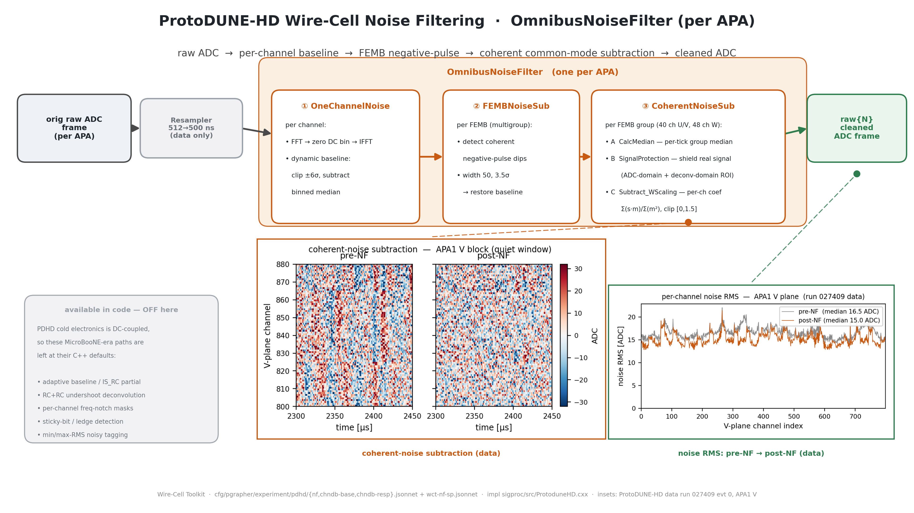

# PD-HD Noise-Filtering algorithm diagram

A wide (16:9) presentation diagram of the ProtoDUNE-HD Wire-Cell **noise
filtering** stage — the live `OmnibusNoiseFilter` sub-algorithm cascade — with
two real-data physics insets.  Companion to the reference doc
[nf.md](nf.md) (this is the picture; `nf.md` is the full knob-level text).
See also [sp-chain-diagram.md](sp-chain-diagram.md) for the signal-processing
counterpart and [nf_sp_workflow.md](nf_sp_workflow.md) for the end-to-end run.



Deliverable: `pdhd/pics/pdhd_nf_chain.png` (3840×2160) and `.pdf`.

## Repro block

Run in the toolkit-dev direnv python env (matplotlib, numpy, PIL; `WIRECELL_PATH`
set) from `pdhd/pics/`:

```bash
python3 make_nfsp_insets.py        # generates all NF+SP data insets into nfsp_src/
python3 make_nf_chain_diagram.py   # -> pdhd_nf_chain.png / .pdf
```

`make_nfsp_insets.py` reads the run-027409 evt-0 APA1 frames under
`pdhd/input_data_14_old_coh_grouping/run027409/evt_0/` and the pre/post-NF
noise-RMS npz under `pdhd/nf_plot/noise_rms/`.  `nfsp_src/` holds the committed
inset PNGs so the master build is self-contained.

## The cascade (what the boxes are)

Traced from `cfg/pgrapher/experiment/pdhd/nf.jsonnet` and
`wct-nf-sp.jsonnet`.  The `OmnibusNoiseFilter` applies one `channel_filters`
entry then two `multigroup_chanfilters` entries, **in this order**:

| stage | node type | scope | what it does (live path) |
|---|---|---|---|
| pre | `Resampler` | per anode, **data only** | 512 → 500 ns; a driver stage before NF (`reality='data'`), outside `OmnibusNoiseFilter`. |
| ① | `PDHDOneChannelNoise` | per channel | FFT → zero the DC bin → IFFT; dynamic baseline (clip ±6σ, subtract binned median). |
| ② | `PDHDFEMBNoiseSub` | per FEMB (multigroup) | detect coherent negative-pulse dips (width 50, 3.5σ) and restore the baseline. |
| ③ | `PDHDCoherentNoiseSub` | per FEMB group (40 ch U/V, 48 ch W) | **A** CalcMedian (per-tick group median) → **B** SignalProtection (shield real signal via ADC-domain + deconvolution-domain ROIs) → **C** Subtract_WScaling (per-channel coef `Σ(s·m)/Σ(m²)`, clipped to `[0,1.5]`, subtract scaled median). |
| out | `raw{N}` frame | per anode | NF-cleaned ADC (float traces + channel masks) → SP. |

### OFF in this build (drawn greyed)

PDHD cold electronics is **DC-coupled**, so the MicroBooNE-era paths that front
`PDHDOneChannelNoise` are left at their C++ defaults and never run: adaptive
baseline / IS_RC partial detection, RC+RC undershoot deconvolution, per-channel
frequency-notch masks, sticky-bit / ledge detection, and min/max-RMS noisy
tagging.  These are configured in `chndb-base.jsonnet` but their call sites are
commented out in `ProtoduneHD.cxx` — see [nf.md](nf.md) § "What is *not* applied
here".  They are shown only as a greyed "available in code — OFF here" panel so
the diagram does not overstate the live algorithm.

## Physics insets (real data)

Both insets are ProtoDUNE-HD **data**, run 027409 evt 0, APA1 (a reference APA;
APA0 V-plane is anomalous), V plane.

| inset | source | shows |
|---|---|---|
| coherent-noise 2D before/after | `make_nfsp_insets.py:make_nf_coherent_2d` (orig vs NF-raw frames) | a V-plane FEMB block in a signal-free window: common-mode vertical stripes (pre-NF) flatten after `CoherentNoiseSub` (post-NF). |
| per-channel noise RMS pre → post | `make_nfsp_insets.py:make_noise_rms` (`noise_rms_data{,_prenf}.npz`) | the net NF effect: V-plane RMS median 16.5 → 15.0 ADC (the coherent component removed). |

## Verification

- The chosen quiet window (auto-selected as the lowest block-summed |ADC| in the
  NF output) shows clear coherent stripes pre-NF that visibly flatten post-NF.
- `make_nf_chain_diagram.py` runs clean → 3840×2160 PNG + PDF; cascade boxes,
  arrows, leader lines and the greyed OFF panel all legible at slide scale, 16:9,
  no overflow.
- No toolkit C++/cfg touched — docs/figure deliverable only; nothing in the
  reconstruction path changes, so no build or A/B gate is required.
