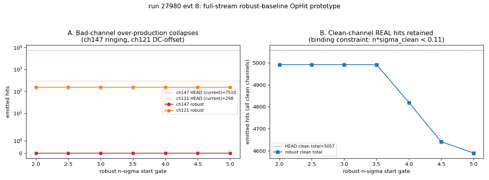
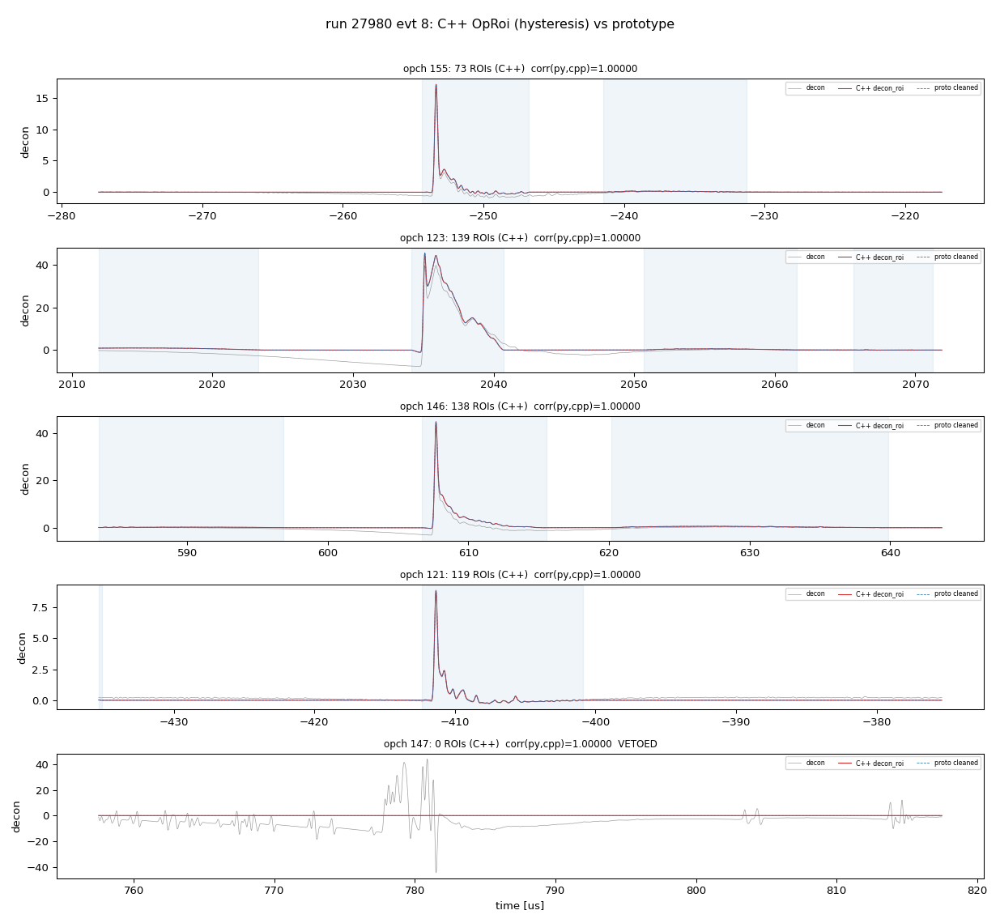
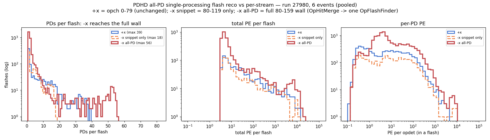

# PDHD −x full-stream light reconstruction (opch 120–159)

A deconvolution → OpHit → OpFlash chain for the PDHD −x **full-stream** photon
detectors (opch **120–159**), the one −x APA read out continuously instead of in
self-trigger snippets. These channels were previously **not** reconstructed by the
toolkit. We reuse the existing self-trigger light chain unchanged except for a
**fixed Wiener filter**, process run 27980, and confirm the flash forming is
reasonable by **time-coincidence** with the self-trigger APAs.

> Companion docs: `pdhd-pd-activity-per-event.md` (per-event +x/−x PD activity, the
> readout-mode geometry), `run27980-processing-status.md` (toolkit light status),
> `pdhd-light-raw-data.md` §7 (−x readout modes). Plots in `pdhd/pics/` (git-ignored;
> regenerate with `pdhd/pd_plot/fullstream_compare.py`).

---

## 1. Which channels, and why a new chain

Verified from the raw data (`rawdump/raw_waveform` `nsamples`, `flashopdet/opdet_geo`):

| opch | wall | z (mm) | readout | samples |
|---|---|---|---|---|
| 0–39    | +x | 267–427 | self-trigger snippet | 1024 |
| 40–79   | +x | 35–195  | self-trigger snippet | 1024 |
| 80–119  | −x | 267–427 | self-trigger snippet | 1024 |
| **120–159** | **−x** | **35–195** | **full-stream (continuous)** | **343 808 (~5.5 ms)** |

So the **full-stream APA is 120–159** (−x, lower z). The existing chain reads the
self-trigger `decoana` snippets and the components are hard-wired around the
1024-tick window; the full stream is one continuous 343 808-sample waveform per
channel in `rawdump/raw_waveform`. The data is clean — flat baseline (8224 ADC, no
drift over 5.5 ms), clear negative pulses, and the SPE template / geometry already
cover 120–159 (FBK 2024 template).

## 2. The processing chain (reuse the real WCT filters)

```
rawdump/raw_waveform (120-159, 343808-sample stream)
  └─ fullstream_to_decoana.py  →  decoana-format ROOT (one long TH1D/channel)
       └─ PDHDOpWaveformSource  →  OpDecon (samples=343808, FIXED filter)
            →  OpRoi (high-pass ROIs → zero outside + per-ROI linear baseline; §7)
            →  OpHitFinder (SlidingWindow, raised threshold)  →  OpFlashFinder
                 →  opflash_pdhd-fullstream-wct.tar.gz
```

The only new code is the **converter** `pd_plot/fullstream_to_decoana.py`: it writes
the raw stream into the exact ROOT layout `PDHDOpWaveformSource` already reads
(`decoana/run_<R>_evt_<E>/ch<N>/raw/waveform_<i>`), so the existing C++ components
run unmodified. Two facts make this work without new C++:

- **Timing.** Each waveform's `tbin` (x-axis low edge) is set to its `rawdump`
  `timestamp − rd_timestamp`. The full stream does **not** start at `rd_timestamp`
  (it starts ~−2500 µs before it), so this offset is essential — with `tbin=0` every
  full-stream OpHit is mis-timed by ~2.5 ms. The full-stream channels have no LArSoft
  OpHits, so `PDHDOpWaveformSource` falls back to `t_first = rd_timestamp`
  (`PDHDOpWaveformSource.cxx:182`) and stamps `frame_time = (rd − tc)·16 ns` — the
  **same trigger-relative clock** as the snippet path, so the two readout modes are
  directly time-comparable.
- **Length.** `OpDecon`/`OpHitFinder` generalize to any length via `samples`; a single
  343 808-point FFT deconvolution is clean (verified: correct polarity, SPE-width
  pulse, no ringing, flat baseline across all 10 deciles of the stream).

## 3. The fixed Wiener filter

The stock `OpDecon` sets the Wiener signal level from **each waveform's own peak**
(`S2 = (max/spe.amplitude)²`, `OpDecon.cxx:160`) — the filter is therefore
signal-dependent and record-length-dependent. We add a toggleable **fixed**
signal-to-noise ratio `fixed_snr = R = S2/N²` (`OpDecon.cxx`, default `−1` = adaptive,
bit-identical for other configs). With `S2 = R·N²` the filter becomes
`G = conj(H)·R / (|H|²R + 1)` — independent of both pulse amplitude and record length,
so the 1024-tick snippets and the 343 808-tick stream are deconvolved with the **same
filter** (a prerequisite for comparing their OpHits). PDHD now uses `R = 0.005`
(≈ a 20:1-amplitude reference pulse on the FBK PDs at the 1024-tick reference) for
**both** readout modes — this is the new PDHD production default (`flash.jsonnet`).

**OpHit threshold.** The fixed filter leaves a decon noise floor of ~0.02 (scaled
~2.2). The self-trigger path keeps the default 3.0 (each 1024-tick window sits on a
real trigger pulse). The full stream, scanning all 5.5 ms continuously, would
integrate that noise into thousands of spurious flashes at 3.0 (~1.3σ), so it raises
`hit_threshold` to **11 (~5σ ≈ a 1-PE peak)** — set absolutely from the measured
noise, since the 3-sample `ped_sigma` estimate is meaningless on a continuous stream.

## 4. One-event result — run 27980, evt 8 (pre-cleaning, motivates §6–§7)

> This section is the **raw chain** (OpDecon → OpHitFinder, no ROI cleaning) that
> first exposed the over-production. The diagnosis is §6 and the fix is §7; the
> **after-cleaning** comparison — the actual "is the full stream good enough?" answer —
> is **§8**.

The raw full-stream chain reconstructs flashes on 120–159 across the full 5.5 ms
window, and the **bright** ones are real cosmic light. The test: take the bright
self-trigger −x cosmics (−x-upper-dominated, real through-going muons; N=22) as the
reference and ask, **per full-stream PE bin** (non-cumulative), whether a full-stream
−x-lower flash sits within ±1 µs, versus a time-shuffled random baseline:

| full-stream PE bin | N | coincidence | random | excess |
|---|---|---|---|---|
| 0–50    | 453 | 14% | 14% | ×1.0 |
| 50–200  | 693 | 14% | 21% | ×0.7 |
| 200–800 | 317 |  9% |  9% | ×1.0 |
| **>800** | **187** | **50%** | **8%** | **×6.7** |

Pre-cleaning, only the **bright (>800 PE) flashes show a coincidence excess** — ×6.7
over random, i.e. they reconstruct the same physical cosmic light. The ~50% (not 100%)
is geometric: the two −x APAs are adjacent in z (35–195 vs 267–427), so only cosmics
spanning the wall light both. The **dim/mid flashes sit at the random/noise floor**
(excess ≈1, even <1 for 50–200 PE) and are **not** validated as real light — at
`hit_threshold=11` (~5σ) the OpFlash stage still assembles residual noise-floor
coincidences into many dim flashes. So the raw chain is **reasonable for the bright
flashes** but buries them under an artefact population — **§6 diagnoses where that
population comes from, §7 removes it, and §8 shows the cleaned result**.

The self-trigger baseline here is reconstructed for **all 0–119 directly from the raw
stream** (same chain, same fixed filter), not from `decoana`: the LArSoft `decoana`
container carries only +x-upper snippets for evt 8 (the −x snippet coverage gap noted
in `run27980-processing-status.md` §3), so reconstructing from `rawdump` gives the
uniform, geometry-complete comparison.

## 5. Downstream follow-on (not done here)

Flipping the PDHD self-trigger default to the fixed filter changes the snippet
deconvolution versus the old adaptive filter. An A/B on the evt 8 raw 0–119 snippets
shows the change is benign: adaptive vs fixed gives **291 vs 335 flashes**, but the
**bright flashes and total PE are preserved** (PE > 100: 65 vs 68; total PE 1.043e5 vs
1.053e5, +1%) — the fixed filter only adds a modest dim-flash tail, and the snippet path
stays well-behaved because each snippet is a triggered window on a real pulse. Still, a
full re-production of all events and regeneration of the downstream products built on
the old adaptive snippets — **Q/L matching, Bee links, ql_scan dumps**
(`run27980-processing-status.md`) — is a separate task, not done blind here.

## 6. Why far more flashes than the self-trigger? (diagnostic)

The full stream reconstructs **~5× more flashes** than the self-trigger APAs over the
same window (evt 8: 1650 vs 335). In principle they should be similar, so we asked why.
The answer, from the diagnostic below, is concrete: the over-production is **artefact-
dominated**, and it traces to **two pathological channels**, not the chain as a whole.


**(1) It is not a high-PE problem.** Panel A is the per-PE-bin flash-count ratio
(full/self). The excess **peaks at mid-PE** (100–200 PE, 21.9×) and **collapses at high
PE** (1600–3200 PE: 3.1×; >3200 PE: 1.1×) — the brightest cosmics are reconstructed about
equally in both modes (correcting the premise that the problem is at high PE). The full
stream does see far more time — the self-trigger reads out only ~**4 % live-time**
(~13 snippets/ch × 1024 ticks), a **~25× exposure** upper bound (red line) — but that is
only an *upper bound* on how much real light could be added: the self-trigger windows are
triggered (they oversample real activity), and §4 already showed the dim/mid full-stream
flashes are **not** coincidence-validated. **1650 flashes in 5.5 ms** is also far more
than the plausible number of distinct cosmics in that window (order tens), a hint that
the mid-PE bulge is artefacts — which (2) below proves directly.

**(2) The excess comes from two bad channels.** Panel B attributes each non-coincident
mid-PE flash to the channel that built it (largest reconstructed PE among 120–159). Of
**609** such flashes, **558 are dominated by one ringing channel (opch 147, robust RMS
3.04 vs ~0.02 typical; median PE fraction 0.98 — i.e. essentially pure opch 147)** and
**35 by one DC-offset channel (opch 121)**; only **16 land on clean channels**. **38 of
40 channels are clean** (flat ~0, RMS ≈ 0.02). So this is a per-channel data-quality
problem, not a global deconvolution failure. (A `best_pulse_channel` cross-check by local
peak gives the same picture, 575/19, so the attribution is not a metric artefact.)

opch 147 is a **standing defect**: its RMS is 2.7–3.1 in *every* one of the six events
processed (§8 of `pdhd-pd-activity-per-event.md`), and it is the only channel with
RMS > 0.1 in any of them — and it is **not** in any existing optical bad-channel list.
opch 121's offset is **sporadic** (+0.19 here, ≈0 in the other events), an occasional
per-event baseline wander rather than a fixed defect.

**(3) On good channels the chain is sound — bright flashes are real.**


For a bright cosmic lighting both −x APAs, the full-stream channels (120–159) and the
self-trigger channels (80–119) show the **same shaped pulse** at the same
trigger-relative time (Δt = 0.16 µs), same fast-rise/slow-tail SPE shape and comparable
peak. The deconvolution → OpHit → OpFlash chain reconstructs real light correctly.

**(4) The two bad channels, by class.**


One representative non-coincident mid-PE flash per channel class (evt 8):
- **Ringing (opch 147)** — continuous bipolar oscillation (±8, undershoot well below the
  baseline; real light cannot go negative), RMS 3.04. This unstable channel alone spawns
  **558/609** of the over-producing flashes: every oscillation lobe crosses the OpHit
  threshold.
- **DC-offset (opch 121)** — a flat **+0.19 baseline that sits entirely above the 0.11
  hit threshold**, so the channel "fires" continuously. This *is* a genuine baseline
  shift (the originally-suspected mechanism), but it is confined to this one channel and
  this event, not a global drift — on the 38 clean channels the slow baseline is flat
  (decile medians within ±0.03).
- **Clean (opch 153)** — a genuine SPE-shaped **untriggered** pulse (peak 7.24) matching
  the template on a flat baseline: the small, legitimate part of the excess (continuous
  readout does catch real cosmics the self-trigger missed).

These artefacts survive because the **OpHitFinder pedestal is estimated from 3 samples**
(`m_ped_nsamples=3`) — meaningless on a 343 808-sample continuous stream, so it cannot
track a per-channel DC offset or a high-RMS channel — and the **effective threshold is
low and absolute** (`hit_threshold` 11 / `scale` 100 = 0.11 decon units ≈ 4.8σ of a
*clean* channel, but ≪ the swing of a ringing one). **This is now fixed for the full
stream — see §6.1.**

### 6.1 Fix — a robust per-channel baseline for the full stream (`robust_baseline`)

> **Superseded for the shipped chain.** `robust_baseline` is retained as a standalone, documented
> option (and the `false` default keeps the snippet path + every existing config bit-identical),
> but the shipped full-stream chain no longer takes this path: §7's `OpRoi` now owns the DC removal
> and the ringing veto, and `OpHitFinder` reads the cleaned `decon_roi` with `fixed_ped_sigma`.
> This section documents the method and the §6 diagnosis it came from.

The fix is a **stream-wide robust per-channel pedestal/noise** estimate in `OpHitFinder`,
replacing the 3-sample head method **only for the continuous full stream** (the self-trigger
snippet path keeps the head method — its window genuinely starts quiet). It is the
charge-SP idea (mode/median + MAD, à la `Waveform::most_frequent` / `median_binned` /
`Microboone::RawAdapativeBaselineAlg`) applied to light: because real pulses are *sparse* on
the stream, the **per-channel median is the baseline** and the **MAD is the noise σ**. When
`robust_baseline` is on, `OpHitFinder`:

- sets `ped_mean = ` per-channel **median** over the whole waveform → removes a per-channel
  **DC offset** (opch 121: a flat +0.19 at 98.5 % duty → median +0.19 subtracted, so it no
  longer fires continuously; its residual hits then match a clean channel's, i.e. real light);
- sets `ped_sigma = 1.4826·`**MAD** and raises the sliding-window start gate to
  `robust_nsigma · σ` (high for noisy channels, ≈ unchanged for clean ones — clean σ ≈ 0.02
  decon, so `n·σ` stays below the 0.11 emission threshold and **real ~1-PE hits are kept**);
- **vetoes** a channel whose MAD ≥ `robust_veto_sigma` (default 0.1 decon, the same cut that
  defines the *ringing* class) → opch 147 (σ ≈ 3.0 decon, 150× a clean channel) emits **no
  hits**. A `n·σ` threshold alone cannot kill it without also cutting clean small pulses (its
  extreme lobes survive any clean-safe `n`), so σ itself is used as the veto signal — the
  data-quality "mask" the diagnosis called for, derived from the robust noise estimate.

The default for the start gate is `robust_nsigma = 3` (the prototype's `n`-sweep shows
`n ∈ [2, 3.5]` all retain the clean-channel hits identically; `n ≥ 4` starts to clip the
smallest real pulses). All three are jsonnet knobs; `robust_baseline` defaults **off**, so
every existing config and the self-trigger path are **bit-identical**.



**Validated (evt 8, the actual C++ chain).** Prototyped first in NumPy
(`pd_plot/fullstream_baseline_proto.py`: per-channel OpHit count vs `n`), then implemented
and run end-to-end:

| metric | head (before) | robust (after) |
|---|---|---|
| full-stream flashes | 1650 | **463** (−72 %) |
| non-coincident **mid-PE** flashes (the artefact band) | 609 | **39** (−94 %) |
| …of those, on the 2 bad channels | 593 (147: 558, 121: 35) | **1** (147: 0, 121: 1) |
| …on clean channels (real untriggered cosmics) | 16 | **38** |
| full-stream OpHits (NumPy proto) | 12 865 | **5 143** (bad-channel 7808→152, clean 5057→4991) |
| self-trigger reco (snippet path) | — | **byte-identical** (opflash + 12 084 ophits, `array_equal`) |

The remaining 463 flashes are dominated by **real** light (clean-channel mid-PE flashes rise
16→38 as the artefacts clear), consistent with the full stream's ~25× live-time exposure.
Not done (lower priority, not needed here): a pulse shape / area-consistency cut (c) and a
windowed (per-sample) baseline — a global median sufficed because opch 121's offset is
high-duty within the event; escalate to windowed only if a future event shows intra-stream
*wander*. A global Wiener/post-filter rework is *not* indicated — 38/40 channels deconvolve
cleanly.

## 7. ROI identification + ROI-based decon cleaning (`OpRoi`)

The robust baseline (§6.1) removes the per-channel DC offset and vetoes the ringing
channel, but it does not *clean the waveform*: between the sparse scintillation pulses
the continuous stream still carries its full noise and any slow baseline wander, and the
pulses sit on whatever local pedestal the decon left. The next step builds **ROIs** and
uses them to clean the deconvolved waveform fed to `OpHitFinder`, mirroring the WCT
**charge** signal-processing **induction** ROI chain (`sigproc/src/ROI_formation.cxx`:
high-pass `LfFilter` → threshold ROI → padding → per-ROI linear endpoint-zeroing).

New component **`OpRoi`** (`flash/src/OpRoi.cxx`, an `IFrameFilter`) consumes the `decon`
traces and emits cleaned `decon_roi` traces. Per channel:

1. **High-pass** the decon with `H(f) = 1 − exp(−(f/τ)²)` — the same functional form as the
   sigproc induction `LfFilter` (`util/src/Response.cxx`). Scintillation is < 20 µs, so a
   corner `τ = 0.05 MHz` (≈ 1/20 µs) passes the pulses and removes slower baseline wander.
   This is the **ROI-finding** waveform `h`.
2. **Baseline**: subtract `median(h)`.
3. **Noise + veto**: `rms = 1.4826·MAD(h)`; if `rms > veto_sigma` (0.1 decon) the channel is
   ringing and is **zeroed entirely** (carries over the §6.1 opch-147 veto). A second,
   data-quality veto runs first: any channel listed in **`veto_channels`** is zeroed
   unconditionally (independent of its MAD). This is for known-bad PDs a hand scan flags
   but whose MAD does not always clear `veto_sigma`. The full-stream chain sets
   `veto_channels = [135, 147]` — opch 147 is the standing ringing defect (already above the
   MAD cut) and opch 135 is a bad channel identified in the per-channel waveform hand scan
   (`pdhd/pics/pd/wf_ch*.png` via `pdhd/wf_scan/`); both are now hard-vetoed so they raise no
   OpHits. Default `[]` → bit-identical (MAD veto only). (The other bad channel studied in
   §6, opch 121, is **not** in the list: its sporadic DC offset is already removed by the
   per-ROI linear baseline — the §6.1 table shows it drops 35 → 1 flashes — so it needs no hard
   veto. opch 135, by contrast, is a defect found in the hand scan that is not in the 6-event
   §6 study, so the MAD veto alone is not relied on for it.)
4. **ROIs (hysteresis)**: contiguous runs of `h > roi_ext_nsigma·rms` (**low/extend**,
   `roi_ext_nsigma = 3` → ~0.06 decon) that reach `roi_seed_nsigma·rms` (**high/seed**,
   `roi_seed_nsigma = 5` → ~0.10 decon ≈ the 0.11 OpHit threshold) somewhere inside; runs that
   never reach the seed are dropped (pure noise/ringing wings). Each surviving run is padded by
   `roi_pad_pre = 50` ticks (≈ 0.8 µs) before the run start (**no early-side extension**) and
   **extended to at least `roi_post_peak = 300` ticks past the decon pulse peak** — the
   late-light window, ≈ 4.8 µs ≈ 3× the 1.6 µs LAr late-light τ, so the slow scintillation
   tail is inside the ROI. A *brighter* pulse whose tail stays above the extend threshold runs
   further than `roi_post_peak` on its own; overlapping windows merge adjacent pulses.
5. **Apply to the ORIGINAL decon**: zero everything outside ROIs; per ROI `[s,e]` subtract the
   line through `(s, d[s])`, `(e, d[e])` so the ROI starts and ends exactly at zero (linear
   baseline correction).

These are jsonnet knobs; only the full-stream chain instantiates `OpRoi` (between `OpDecon`
and `OpHitFinder`), so every other config is untouched.

**Why hysteresis + peak-anchored extension (not a single threshold + fixed blanket pad).** A
first version used one threshold (`5·rms`) and a long *fixed* asymmetric pad `(50, 700)` after
each run. That ballooned the *bright* channels: a tall pulse's HPF tail and ringing wings stay
above the low threshold for 10–15 µs, and the +700-tick (≈ 11 µs) blanket pad then merged the
pulse, its wings, and nearby pulses into one 60–75 µs block (evt 8 opch 123: 74.5 µs; opch 146:
64 µs) — whereas dim channels sat at the ≈ 12 µs pad floor. Worse, the per-ROI linear baseline
(step 5) then ramped across the whole 74 µs and **destroyed the bright pulse's charge** (opch 123
full-pulse PE 11.7 → 75.1 once fixed). The hysteresis seed/extend, with the post-side anchored to
the **pulse peak** (cover the late-light decay) rather than a flat pad after the run, gives every
ROI the same physical late-light window (≥ 4.8 µs past the peak) while letting genuinely bright
tails run longer — without the blanket-pad ballooning, and PE-conserving.

**Supersede, not stack.** `OpRoi` owns DC removal (per-ROI baseline) and the ringing veto, so
this chain *supersedes* `robust_baseline`'s DC/ringing role. But the tight hysteresis ROIs hug
each pulse, so the **in-ROI samples are signal-dominated** — estimating the pedestal from them
(whether over the whole record, which is mostly 0, or over the non-zero in-ROI samples, which
are mostly signal) biases `ped_sigma` high and closes the OpHit start gate (clean-channel hits
crater to ~45 %). The fix is a new `OpHitFinder` knob **`fixed_ped_sigma`** (default 0 = off,
bit-identical): when > 0 it sets `ped_mean = 0` (the ROIs are endpoint-zeroed) and `ped_sigma`
to this **known clean noise floor** (the HPF rms ≈ 0.02 decon → ~2 scaled), with the start gate
at `robust_nsigma · ped_sigma`. Ringing channels are already zeroed by `OpRoi`, so no
`robust_baseline` veto is needed alongside it. The full-stream chain runs
`ophit(intag='decon_roi', fixed_ped_sigma=2.0)`.



**Validated (the actual C++ chain).** Prototyped first in NumPy
(`pd_plot/fullstream_roi_proto.py`), then implemented and run end-to-end:

- **C++ ↔ NumPy closure** (evt 8, decon_roi vs the prototype on the same decon): worst
  per-channel correlation **1.000000**, max difference 0.10 decon (vs ~42 peak), confined to
  ROIs whose threshold boundary shifted by ~1 sample under FFTW-vs-NumPy rounding (which
  recomputes that one ROI's linear baseline ramp) — a faithful port, not a logic difference.
- **ROI shape** (evt 8): every ROI covers the late-light window (≥ 4.8 µs past the pulse peak)
  and bright tails extend further on their own — opch 123 main ROI 74.5 → 6.6 µs (peak→end
  4.8 µs), opch 146 64 → 8.9 µs (real tail), opch 121 → 11.5 µs; ROI length across clean
  channels median 5.7 µs / p90 ≤ 9.4 µs / max ≤ 25 µs (was a single 74 µs blanket block). ~87 %
  of each clean channel's record (the inter-pulse baseline) is zeroed.
- **Cleaning** (evt 8): opch 147 (ringing) **fully zeroed**; opch 121 DC offset removed; opch
  123's slow scintillation tail **shape and PE preserved** (the old blanket-pad version
  destroyed it: full-pulse PE 11.7 → 75.1). Clean-channel OpHits **retained 109/110/112 %**
  (evts 8/16/152) using the known noise floor — the wider late-light window splits a few more
  tail sub-pulses into their own hits. The endpoint-zeroing still has an inherent, small cost:
  forcing each ROI's ends to zero trims a little of the tail where it has not fully returned to
  baseline by the window end (NumPy ACCEPT-1: tail ±0.01–0.35 PE) — the price of start/end
  exactly at zero, not a shape distortion of the pulse.
- **Flashes** (4 events, fair 3-way on the same converted inputs):

  | evt | head (no cleaning) | `robust_baseline` | `OpRoi` (hysteresis) + `fixed_ped_sigma` + veto 135/147 |
  |---|---|---|---|
  | 8   |  463 / 96 k PE | 463 / 96 k | **488 / 84 k** |
  | 16  | 1810 / 2.4 M PE | 516 / 76 k | **533 / 75 k** |
  | 152 | 1640 / 243 k PE | 494 / 77 k | **508 / 83 k** |
  | 24  | 1826 / 469 k PE | 420 / 87 k | **440 / 77 k** |

  Both robust and OpRoi tame the head-method runaway (evt 16: 2.4 M → ~75 k PE). Against
  `robust_baseline` the flash count is **comparable (±10 %)**; the added value is the cleaning
  itself — outside-ROI zeroing and a per-ROI linear baseline give baseline-corrected,
  PE-conserving pulses (start/end exactly at zero) intended for the downstream PE and Q-L
  matching, which `robust_baseline` does not provide. The production chain also hard-vetoes the
  two known-bad data-quality channels opch 135 + 147 (`oproi(veto_channels=[135,147])`); §8
  uses this full production chain for the self-trigger comparison.

## 8. Full-stream vs self-trigger after the §7 cleaning — is it good enough?

Repeating the §4 coincidence study with the **full production chain** (OpDecon → §7 OpRoi
cleaning + veto 135/147 → OpHitFinder `fixed_ped_sigma` → OpFlash) answers the practical
question: is the full-stream −x-lower readout (120–159) now comparable to the self-trigger
APAs? **Yes.** Same test, same `fullstream_compare.py`, same N=22 bright self-trigger −x
reference (run 27980 evt 8):


| full-stream PE bin | N (pre-clean → after) | coincidence | random floor | excess |
|---|---|---|---|---|
| 0–50    | 453 → **426** |  5% | 15% | ×0.3 |
| 50–200  | 693 → **21**  |  9% |  1% | **×13** |
| 200–800 | 317 → **25**  | 36% |  1% | **×53** |
| >800    | 187 → **16**  | 59% |  1% | **×65** |

Three things changed, and together they say the chain is sound:

1. **The artefact/noise-floor population collapsed.** The mid-PE bulge that §6 traced to the
   bad channels is gone: 50–200 PE went **693 → 21** flashes, 200–800 went **317 → 25**. Total
   full-stream flashes **1650 → 488** (vs 335 self-trigger), i.e. from ~5× down to ~1.5×.
2. **The surviving flashes are coincidence-validated across the PE spectrum, not just the
   bright tail.** Pre-cleaning only the >800 PE bin showed an excess (×6.7); now every bin
   above ~50 PE does (×13 / ×53 / ×65). The bright count itself dropped **187 → 16** — the 187
   were inflated by the opch-147 ringing "flashes"; 16 is the physical number of bright cosmics
   in 5.5 ms. **The higher excess is not more signal but less background:** the *observed*
   coincidence rate is essentially unchanged (~50 → 59 %), while the *random floor* collapsed
   (8 % → 1 %) because there are far fewer flashes to accidentally coincide with — so removing
   the fake flashes makes the real signal stand out ~10× more sharply.
3. **The PE spectra now overlay** (panel D): the full-stream and self-trigger flash-PE
   distributions track each other, where before the full stream had a large excess dim/mid
   population.

**Every event shows the same** (run 27980, the full production chain):

| evt | full-stream flashes | >800 PE | self-trig flashes | ref −x cosmics | bright coinc / random |
|---|---|---|---|---|---|
| 8   | 488 | 16 | 335 | 22 | 59% / 1% |
| 16  | 533 | 14 | 337 | 12 | 67% / 0% |
| 24  | 440 | 15 | 329 | 12 | 83% / 0% |
| 104 | 527 | 16 | 128 | 16 | 50% / 1% |
| 120 | 506 | 18 | 161 | 21 | 62% / 1% |
| 152 | 508 | 17 | 357 | 18 | 67% / 1% |


**Verdict.** The full-stream readout is **good enough**: its bad-channel artefact population is
removed, its surviving flashes (≳50 PE) reconstruct the same physical cosmic light as the
self-trigger APAs (50–67 % geometric coincidence — the two −x APAs are adjacent in z, so only
wall-spanning cosmics light both), and its flash-PE spectrum matches the self-trigger.
**Honest residual:** the full stream still finds somewhat more flashes than the self-trigger
(440–533 vs 128–357 — expected, it reads ~25× the live-time and legitimately catches cosmics
the snippets missed), and a low-PE population remains: the 0–50 PE bin (426 of evt 8's 488
flashes) sits **below** the random floor (×0.3) — scattered sub-pulses / late-light fragments,
not coincident with the bright reference. A brightness cut (≳50 PE) isolates the validated set;
the diagnostic §6 figures are kept as the *pre-fix* picture and are deliberately not regenerated.

## 9. All-PD single-processing reconstruction (snippet + full stream → one flash collection)

§8 keeps the two readout streams in **separate** flash files (self-trigger 0–119, full
stream 120–159).  That is fine for the validation above but wrong for anything that needs a
**flash over the whole −x wall**: opch 80–119 (snippet) and 120–159 (full stream) are *distinct*
PDs tiling *disjoint z-halves* of the same −x wall (80–119 at z≈267–427, 120–159 at z≈35–195;
see `pdhd-light-flash-run-comparison.md` §4.3).  With the two streams reconstructed separately a
−x flash can only ever light one half-wall (≤40 PDs, ~20 in practice), whereas a +x flash sees
its full 80-PD wall.  Q/L matching wants the full −x wall in one flash.

**Single processing, merge at the OpHit level.**  Rather than post-hoc merging two opflash
files (fragile, and it imposes an arbitrary Δt window), the all-PD chain runs **one** wire-cell
graph that reconstructs both streams and fuses their **OpHits** before a single flash step:

```
snippet branch:     PDHDOpWaveformSource(snip decoana 0-119)
                    → OpDecon(samples=1024)  → OpHitFinder(head pedestal)        ┐
                                                                                 ├ OpHitMerge → OpFlashFinder → opflash_pdhd-allpd-wct.tar.gz
full-stream branch: PDHDOpWaveformSource(fs decoana 120-159)                     │
                    → OpDecon(samples=343808) → OpRoi(veto 135/147) → OpHitFinder(decon_roi, fixed_ped_sigma=2) ┘
```

`OpHitMerge` (`flash/src/OpHitMerge.cxx`, an `ITensorSetFanin`) row-concatenates the two
branches' `ophits` tensors `[nhit,9]` into one.  Both branches use the **same fixed Wiener
filter** and emit OpHit `peak_time_ns` on the **same trigger-relative clock** (same `tc_time`),
so `OpFlashFinder`'s own **1 µs accumulator** does the cross-stream grouping — there is no Δt
window to choose.  `group_by_side` then keeps +x (0–79) and −x (80–159) as independent flash
populations.  The output is the standard opflash tensor-set schema (the metadata `offset_us`
comes from the snippet branch via `meta_port=0`), i.e. directly Q/L-consumable.

**Validation (run 27980, 6 events).**  +x is **byte-identical** to the per-stream reco (sides
are independent in `find_flashes`, and the full stream contributes nothing to side A) — proof
the plumbing is correct.  The −x nPD ceiling moves from one half-wall to the full wall:

| evt | −x max PDs (snippet only) | −x max PDs (full stream only) | **−x max PDs (all-PD)** | +x max PDs (unchanged) | all-PD flashes |
|----:|----:|----:|----:|----:|----:|
| 8   | 17 | 38 | **55** | 36 | 767 |
| 16  | 16 | 38 | **54** | 37 | 822 |
| 24  | 16 | 38 | **54** | 39 | 725 |
| 104 | 17 | 38 | **55** |  – | 596 |
| 120 | 16 | 38 | **54** |  4 | 609 |
| 152 | 18 | 38 | **56** | 36 | 808 |

A −x flash now reaches ~55 of the 78 usable −x PDs (80 − 2 vetoed), comparable to (here above)
the +x wall — exactly the half-wall→full-wall gain expected.  The all-PD −x flash count is
**below** the sum of the two streams' −x flashes (evt 8: 568 vs 136+488=624), i.e. ~56
cross-half coincident pulses correctly fused into single flashes by the 1 µs accumulator.



The −x **all-PD** distribution (red) extends past the snippet-only cutoff at ~18 PDs to ~55,
with a high-PD bump near 50 (wall-spanning cosmics lighting most of the −x wall); +x (blue) is
unchanged.  This is the product to feed Q/L matching.  *(The flash construction may still be
lightly tuned — the per-stream `OpHitFinder`/`OpFlashFinder` settings carry over unchanged here.)*

## Reproduce

```
cd pdhd
./run_light_fullstream_evt.sh 27980 8        # full-stream (120-159) + self-trigger
                                             # (0-119, from raw) reco for one event
python pd_plot/fullstream_compare.py 27980 8 16 24 104 120 152  # §8 self-trigger
                                             #   comparison: coincidence + event-dependence
                                             #   figures -> pics/, prints the per-PE-bin + event tables
python pd_plot/fullstream_diagnose.py 27980 8 # §6 diagnosis + waveform figures -> pics/
python pd_plot/fullstream_baseline_proto.py 27980 8  # §6.1 robust-baseline OpHit prototype
                                             #   (NumPy n-sweep; -> pics/..._baseline_proto.png)
python pd_plot/fullstream_roi_proto.py 27980 8  # §7 ROI cleaning prototype + acceptance
                                             #   checks (-> pics/..._roi_proto.png)

./run_light_allpd_evt.sh 27980 8             # §9 all-PD single processing (snippet+full
                                             #   stream -> OpHitMerge -> one OpFlashFinder)
                                             #   -> work/027980_allpd8/opflash_pdhd-allpd-wct.tar.gz
python pd_plot/allpd_compare.py 27980 8 16 24 104 120 152  # §9 +x-unchanged / -x-full-wall
                                             #   figure -> pics/light_allpd_pds_per_flash.png
```

`run_light_fullstream_evt.sh` runs the converter, the full-stream chain
(`wct-light-fullstream-reco.jsonnet`, `OpDecon samples=343808`, fixed filter, `OpRoi` ROI
cleaning — §7, `OpHitFinder hit_threshold=11`, `fixed_ped_sigma=2.0`,
reading the `decon_roi` traces), and the self-trigger-from-raw baseline
(`wct-light-reco.jsonnet`, `robust_baseline` default off → head pedestal).

---

## Appendix — provenance

| item | source |
|---|---|
| full-stream raw waveforms | `rawdump/raw_waveform` (opch 120–159, 343 808 samples, `timestamp` = DTS start) |
| trigger (rd_timestamp, tc) | `trigoff/trigger_offset` |
| SPE template / geometry | `pgrapher/experiment/pdhd/pdhd-spe-templates.json` (FBK idx 0), `pdhd-opdet-geom.json` |
| fixed Wiener filter | `flash/src/OpDecon.cxx` `fixed_snr` (R = S2/N²), `flash.jsonnet` `opdecon`/`ophit` |
| ROI cleaning (§7) | `flash/src/OpRoi.cxx` (HPF `1−exp(−(f/τ)²)` + hysteresis ROI + per-ROI linear baseline), `flash.jsonnet` `oproi`; `OpHitFinder` `fixed_ped_sigma`; proto `pd_plot/fullstream_roi_proto.py` |
| full-stream chain | `pdhd/wct-light-fullstream-reco.jsonnet`, `pdhd/run_light_fullstream_evt.sh` |
| all-PD chain (§9) | `flash/src/OpHitMerge.cxx` + `flash.jsonnet` `ophit_merge`; `pdhd/wct-light-allpd-reco.jsonnet`, `pdhd/run_light_allpd_evt.sh`; plot `pdhd/pd_plot/allpd_compare.py` |
| converter | `pdhd/pd_plot/fullstream_to_decoana.py` (raw → decoana layout, tbin from timestamp) |
| comparison + plots | `pdhd/pd_plot/fullstream_compare.py` |
| run 27980 raw ROOT | `…/data/hd/run027980/np04hd_raw_run027980_0000_…_final.root` |
