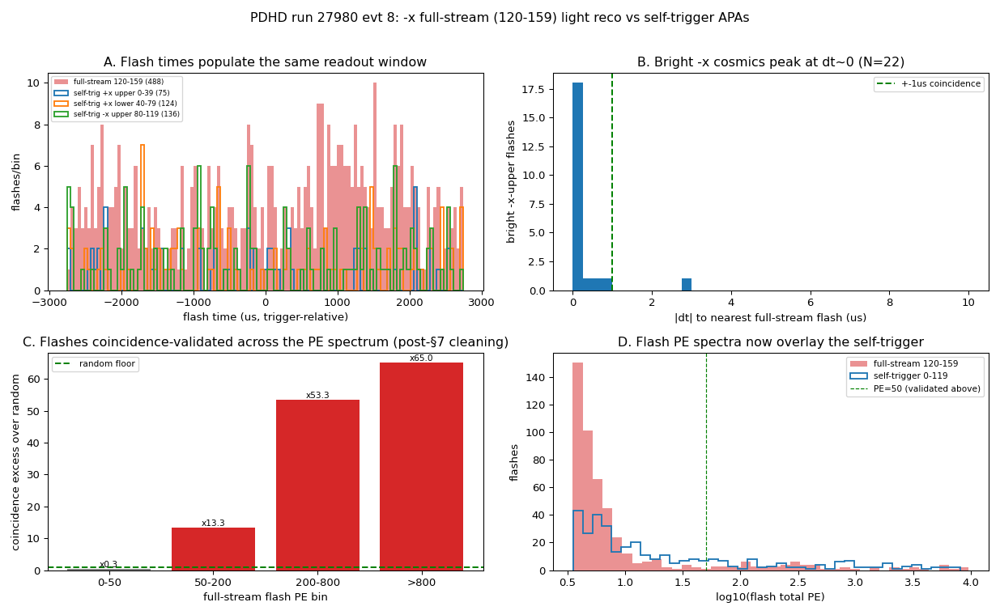
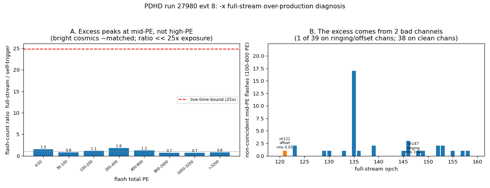
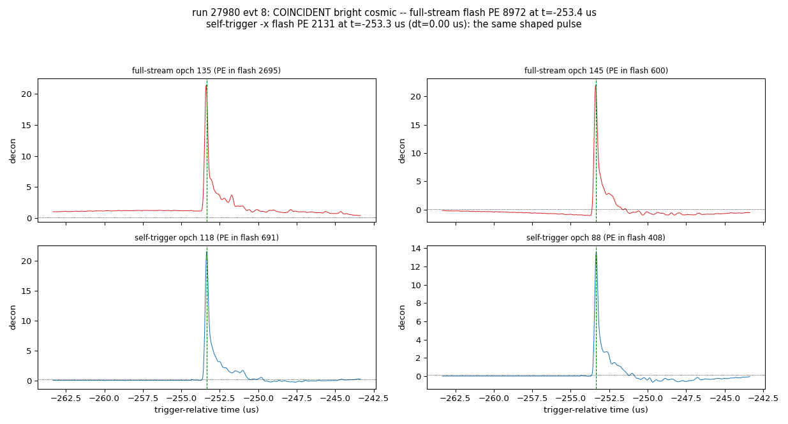
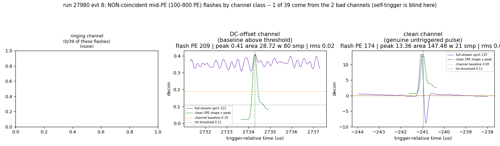

# PDHD −x full-stream light reconstruction (opch 120–159)

A deconvolution → OpHit → OpFlash chain for the PDHD −x **full-stream** photon
detectors (opch **120–159**), the one −x APA read out continuously instead of in
self-trigger snippets. These channels were previously **not** reconstructed by the
toolkit. We reuse the existing self-trigger light chain unchanged except for a
**fixed Wiener filter**, process run 27980, and confirm the flash forming is
reasonable by **time-coincidence** with the self-trigger APAs.

> Companion docs: `pdhd-pd-activity-per-event.md` (per-event +x/−x PD activity, the
> readout-mode geometry), `run27980-processing-status.md` (toolkit light status),
> `pdhd-light-raw-data.md` §7 (−x readout modes). Plots in `pdhd/pics/` (git-ignored;
> regenerate with `pdhd/pd_plot/fullstream_compare.py`).

---

## 1. Which channels, and why a new chain

Verified from the raw data (`rawdump/raw_waveform` `nsamples`, `flashopdet/opdet_geo`):

| opch | wall | z (mm) | readout | samples |
|---|---|---|---|---|
| 0–39    | +x | 267–427 | self-trigger snippet | 1024 |
| 40–79   | +x | 35–195  | self-trigger snippet | 1024 |
| 80–119  | −x | 267–427 | self-trigger snippet | 1024 |
| **120–159** | **−x** | **35–195** | **full-stream (continuous)** | **343 808 (~5.5 ms)** |

So the **full-stream APA is 120–159** (−x, lower z). The existing chain reads the
self-trigger `decoana` snippets and the components are hard-wired around the
1024-tick window; the full stream is one continuous 343 808-sample waveform per
channel in `rawdump/raw_waveform`. The data is clean — flat baseline (8224 ADC, no
drift over 5.5 ms), clear negative pulses, and the SPE template / geometry already
cover 120–159 (FBK 2024 template).

## 2. The processing chain (reuse the real WCT filters)

```
rawdump/raw_waveform (120-159, 343808-sample stream)
  └─ fullstream_to_decoana.py  →  decoana-format ROOT (one long TH1D/channel)
       └─ PDHDOpWaveformSource  →  OpDecon (samples=343808, FIXED filter)
            →  OpHitFinder (SlidingWindow, raised threshold)  →  OpFlashFinder
                 →  opflash_pdhd-fullstream-wct.tar.gz
```

The only new code is the **converter** `pd_plot/fullstream_to_decoana.py`: it writes
the raw stream into the exact ROOT layout `PDHDOpWaveformSource` already reads
(`decoana/run_<R>_evt_<E>/ch<N>/raw/waveform_<i>`), so the existing C++ components
run unmodified. Two facts make this work without new C++:

- **Timing.** Each waveform's `tbin` (x-axis low edge) is set to its `rawdump`
  `timestamp − rd_timestamp`. The full stream does **not** start at `rd_timestamp`
  (it starts ~−2500 µs before it), so this offset is essential — with `tbin=0` every
  full-stream OpHit is mis-timed by ~2.5 ms. The full-stream channels have no LArSoft
  OpHits, so `PDHDOpWaveformSource` falls back to `t_first = rd_timestamp`
  (`PDHDOpWaveformSource.cxx:182`) and stamps `frame_time = (rd − tc)·16 ns` — the
  **same trigger-relative clock** as the snippet path, so the two readout modes are
  directly time-comparable.
- **Length.** `OpDecon`/`OpHitFinder` generalize to any length via `samples`; a single
  343 808-point FFT deconvolution is clean (verified: correct polarity, SPE-width
  pulse, no ringing, flat baseline across all 10 deciles of the stream).

## 3. The fixed Wiener filter

The stock `OpDecon` sets the Wiener signal level from **each waveform's own peak**
(`S2 = (max/spe.amplitude)²`, `OpDecon.cxx:160`) — the filter is therefore
signal-dependent and record-length-dependent. We add a toggleable **fixed**
signal-to-noise ratio `fixed_snr = R = S2/N²` (`OpDecon.cxx`, default `−1` = adaptive,
bit-identical for other configs). With `S2 = R·N²` the filter becomes
`G = conj(H)·R / (|H|²R + 1)` — independent of both pulse amplitude and record length,
so the 1024-tick snippets and the 343 808-tick stream are deconvolved with the **same
filter** (a prerequisite for comparing their OpHits). PDHD now uses `R = 0.005`
(≈ a 20:1-amplitude reference pulse on the FBK PDs at the 1024-tick reference) for
**both** readout modes — this is the new PDHD production default (`flash.jsonnet`).

**OpHit threshold.** The fixed filter leaves a decon noise floor of ~0.02 (scaled
~2.2). The self-trigger path keeps the default 3.0 (each 1024-tick window sits on a
real trigger pulse). The full stream, scanning all 5.5 ms continuously, would
integrate that noise into thousands of spurious flashes at 3.0 (~1.3σ), so it raises
`hit_threshold` to **11 (~5σ ≈ a 1-PE peak)** — set absolutely from the measured
noise, since the 3-sample `ped_sigma` estimate is meaningless on a continuous stream.

## 4. One-event result — run 27980, evt 8



The full-stream chain reconstructs flashes on 120–159 across the full 5.5 ms window,
and the **bright** ones are real cosmic light. The test (panel C, the key result):
take the bright self-trigger −x cosmics (−x-upper-dominated, real through-going muons;
N=22) as the reference and ask, **per full-stream PE bin** (non-cumulative), whether a
full-stream −x-lower flash sits within ±1 µs, versus a time-shuffled random baseline:

| full-stream PE bin | N | coincidence | random | excess |
|---|---|---|---|---|
| 0–50    | 453 | 14% | 14% | ×1.0 |
| 50–200  | 693 | 14% | 21% | ×0.7 |
| 200–800 | 317 |  9% |  9% | ×1.0 |
| **>800** | **187** | **50%** | **8%** | **×6.7** |

Only the **bright (>800 PE) flashes show a coincidence excess** — ×6.7 over random,
i.e. they reconstruct the same physical cosmic light. The ~50% (not 100%) is geometric:
the two −x APAs are adjacent in z (35–195 vs 267–427), so only cosmics spanning the
wall light both. The **dim flashes sit at the random/noise floor** (excess ≈1, even
<1 for 50–200 PE) and are **not** validated as real light here — at `hit_threshold=11`
(~5σ) the OpFlash stage still assembles residual noise-floor coincidences into many dim
flashes, which a brightness cut (≳800 PE) removes. So full-stream flash forming is
**reasonable for the real (bright) flashes**; isolating them from the dim noise-floor
population (e.g. a higher `flash_threshold`) is a natural follow-up — **§6 diagnoses
where that population comes from**. Panel A shows both modes populate the same time
window (timing aligned); panel B shows the bright −x cosmics peak at Δt≈0.

The self-trigger baseline here is reconstructed for **all 0–119 directly from the raw
stream** (same chain, same fixed filter), not from `decoana`: the LArSoft `decoana`
container carries only +x-upper snippets for evt 8 (the −x snippet coverage gap noted
in `run27980-processing-status.md` §3), so reconstructing from `rawdump` gives the
uniform, geometry-complete comparison.

## 5. Downstream follow-on (not done here)

Flipping the PDHD self-trigger default to the fixed filter changes the snippet
deconvolution versus the old adaptive filter. An A/B on the evt 8 raw 0–119 snippets
shows the change is benign: adaptive vs fixed gives **291 vs 335 flashes**, but the
**bright flashes and total PE are preserved** (PE > 100: 65 vs 68; total PE 1.043e5 vs
1.053e5, +1%) — the fixed filter only adds a modest dim-flash tail, and the snippet path
stays well-behaved because each snippet is a triggered window on a real pulse. Still, a
full re-production of all events and regeneration of the downstream products built on
the old adaptive snippets — **Q/L matching, Bee links, ql_scan dumps**
(`run27980-processing-status.md`) — is a separate task, not done blind here.

## 6. Why far more flashes than the self-trigger? (diagnostic)

The full stream reconstructs **~5× more flashes** than the self-trigger APAs over the
same window (evt 8: 1650 vs 335). In principle they should be similar, so we asked why.
The answer, from the diagnostic below, is concrete: the over-production is **artefact-
dominated**, and it traces to **two pathological channels**, not the chain as a whole.



**(1) It is not a high-PE problem.** Panel A is the per-PE-bin flash-count ratio
(full/self). The excess **peaks at mid-PE** (100–200 PE, 21.9×) and **collapses at high
PE** (1600–3200 PE: 3.1×; >3200 PE: 1.1×) — the brightest cosmics are reconstructed about
equally in both modes (correcting the premise that the problem is at high PE). The full
stream does see far more time — the self-trigger reads out only ~**4 % live-time**
(~13 snippets/ch × 1024 ticks), a **~25× exposure** upper bound (red line) — but that is
only an *upper bound* on how much real light could be added: the self-trigger windows are
triggered (they oversample real activity), and §4 already showed the dim/mid full-stream
flashes are **not** coincidence-validated. **1650 flashes in 5.5 ms** is also far more
than the plausible number of distinct cosmics in that window (order tens), a hint that
the mid-PE bulge is artefacts — which (2) below proves directly.

**(2) The excess comes from two bad channels.** Panel B attributes each non-coincident
mid-PE flash to the channel that built it (largest reconstructed PE among 120–159). Of
**609** such flashes, **558 are dominated by one ringing channel (opch 147, robust RMS
3.04 vs ~0.02 typical; median PE fraction 0.98 — i.e. essentially pure opch 147)** and
**35 by one DC-offset channel (opch 121)**; only **16 land on clean channels**. **38 of
40 channels are clean** (flat ~0, RMS ≈ 0.02). So this is a per-channel data-quality
problem, not a global deconvolution failure. (A `best_pulse_channel` cross-check by local
peak gives the same picture, 575/19, so the attribution is not a metric artefact.)

opch 147 is a **standing defect**: its RMS is 2.7–3.1 in *every* one of the six events
processed (§8 of `pdhd-pd-activity-per-event.md`), and it is the only channel with
RMS > 0.1 in any of them — and it is **not** in any existing optical bad-channel list.
opch 121's offset is **sporadic** (+0.19 here, ≈0 in the other events), an occasional
per-event baseline wander rather than a fixed defect.

**(3) On good channels the chain is sound — bright flashes are real.**



For a bright cosmic lighting both −x APAs, the full-stream channels (120–159) and the
self-trigger channels (80–119) show the **same shaped pulse** at the same
trigger-relative time (Δt = 0.16 µs), same fast-rise/slow-tail SPE shape and comparable
peak. The deconvolution → OpHit → OpFlash chain reconstructs real light correctly.

**(4) The two bad channels, by class.**



One representative non-coincident mid-PE flash per channel class (evt 8):
- **Ringing (opch 147)** — continuous bipolar oscillation (±8, undershoot well below the
  baseline; real light cannot go negative), RMS 3.04. This unstable channel alone spawns
  **558/609** of the over-producing flashes: every oscillation lobe crosses the OpHit
  threshold.
- **DC-offset (opch 121)** — a flat **+0.19 baseline that sits entirely above the 0.11
  hit threshold**, so the channel "fires" continuously. This *is* a genuine baseline
  shift (the originally-suspected mechanism), but it is confined to this one channel and
  this event, not a global drift — on the 38 clean channels the slow baseline is flat
  (decile medians within ±0.03).
- **Clean (opch 153)** — a genuine SPE-shaped **untriggered** pulse (peak 7.24) matching
  the template on a flat baseline: the small, legitimate part of the excess (continuous
  readout does catch real cosmics the self-trigger missed).

These artefacts survive because the **OpHitFinder pedestal is estimated from 3 samples**
(`m_ped_nsamples=3`) — meaningless on a 343 808-sample continuous stream, so it cannot
track a per-channel DC offset or a high-RMS channel — and the **effective threshold is
low and absolute** (`hit_threshold` 11 / `scale` 100 = 0.11 decon units ≈ 4.8σ of a
*clean* channel, but ≪ the swing of a ringing one).

**Improving the full-stream chain (next task, not done here).** The diagnosis points at
concrete fixes, in priority order: (a) **per-channel data-quality masking/repair** — flag
ringing (high-RMS) and DC-offset channels like opch 147 / 121 and exclude or correct them
before OpHit finding (this alone removes ~97 % of the over-production here); (b) a
**stream-wide robust per-channel pedestal/noise** estimate instead of the 3-sample head
method, feeding a **per-channel (n·σ) threshold**; (c) a **pulse shape / area-consistency
cut** in `OpHitFinder` to reject ringing lobes; (d) a higher **`flash_threshold`** to drop
the residual noise floor. (A global Wiener/post-filter rework is *not* indicated — 38/40
channels deconvolve cleanly.) These are SP-chain changes deferred to a follow-on.

## Reproduce

```
cd pdhd
./run_light_fullstream_evt.sh 27980 8        # full-stream (120-159) + self-trigger
                                             # (0-119, from raw) reco for one event
python pd_plot/fullstream_compare.py 27980 8 # coincidence figure -> pics/, prints stats
python pd_plot/fullstream_diagnose.py 27980 8 # §6 diagnosis + waveform figures -> pics/
```

`run_light_fullstream_evt.sh` runs the converter, the full-stream chain
(`wct-light-fullstream-reco.jsonnet`, `OpDecon samples=343808`, fixed filter,
`hit_threshold=11`), and the self-trigger-from-raw baseline (`wct-light-reco.jsonnet`).

---

## Appendix — provenance

| item | source |
|---|---|
| full-stream raw waveforms | `rawdump/raw_waveform` (opch 120–159, 343 808 samples, `timestamp` = DTS start) |
| trigger (rd_timestamp, tc) | `trigoff/trigger_offset` |
| SPE template / geometry | `pgrapher/experiment/pdhd/pdhd-spe-templates.json` (FBK idx 0), `pdhd-opdet-geom.json` |
| fixed Wiener filter | `flash/src/OpDecon.cxx` `fixed_snr` (R = S2/N²), `flash.jsonnet` `opdecon`/`ophit` |
| full-stream chain | `pdhd/wct-light-fullstream-reco.jsonnet`, `pdhd/run_light_fullstream_evt.sh` |
| converter | `pdhd/pd_plot/fullstream_to_decoana.py` (raw → decoana layout, tbin from timestamp) |
| comparison + plots | `pdhd/pd_plot/fullstream_compare.py` |
| run 27980 raw ROOT | `…/data/hd/run027980/np04hd_raw_run027980_0000_…_final.root` |
