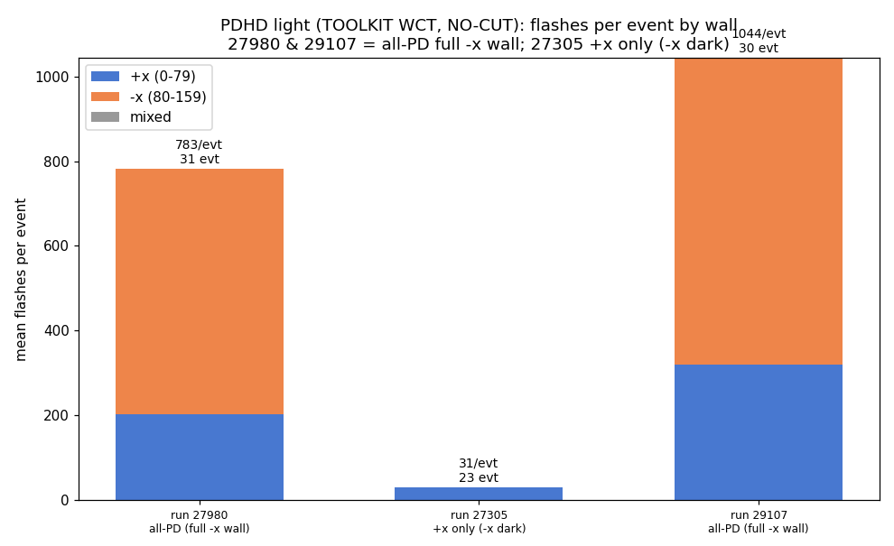
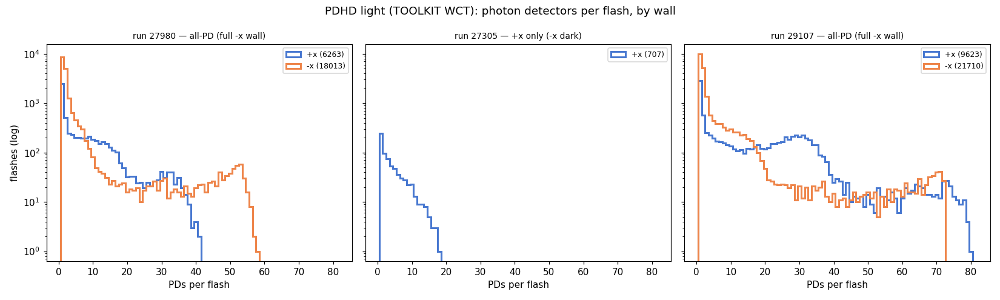
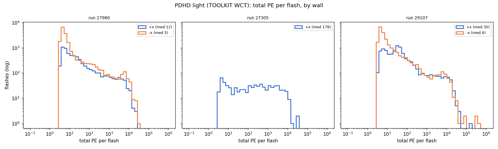
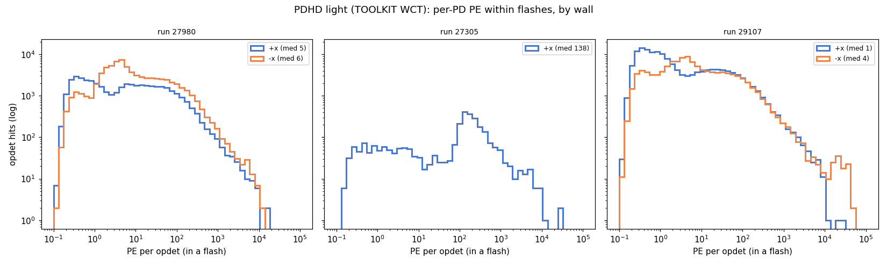

# PDHD light data: flash-statistics comparison across runs (+x vs −x)

A cross-run comparison of the **optical-flash content** of the PDHD light-data
files we currently have, separating the **+x** wall from the **−x** wall. It
answers the practical questions: how many events per run, how many flashes per
event per side, how many photon detectors (PDs) light up per flash, and what the
total-PE and per-PD PE distributions look like.

> Companion docs: `pdhd-light-raw-data.md` (raw waveforms, SPE kernels, OpHit
> formation — see its **§7** for the −x PD coverage and the full-stream readout),
> `pdhd-fullstream-light-reco.md` (the all-PD WCT chain), `which-pd-side-lights.md`,
> `photon-detector-chain.md`. Plots live in `pdhd/pics/` (git-ignored); regenerate
> the toolkit plots (§4) with `pdhd/pd_plot/make_flash_stats_wct.py` and the LArSoft
> reference plots (§5) with `/home/xqian/tmp/flashstats/make_flash_stats.py`.

---

## 1. Data sources

This doc now leads with the **toolkit (WCT-native) flashes** — our own reco — in
**§4**, and keeps the **LArSoft flash trees** as the uniform cross-run reference in
**§5**.

**Toolkit (§4, primary).** Our reconstructed opflash products, by run-appropriate
chain:
- **27980** — the **all-PD** chain (`pdhd-fullstream-light-reco.md` §9: self-trigger
  snippets 0–119 + full-stream 120–159 merged into one `OpFlashFinder`), all 31
  events → −x flashes over the **full 80–159 wall**.
- **27305** — +x self-trigger (the −x wall is dark this run; its raw file has the
  full-stream channels but no −x light).
- **29107** — sparse self-trigger only. 29107 **does** have −x light, but only as
  LArSoft *reconstructed flashes*, not as waveforms our chain can re-reconstruct.
  Proof: for event 1007 LArSoft fired **113 OpChannels spanning 0–119** (incl. −x
  80–119), but the only 29107 file we have (`np04hd_raw_run029107_…_final.root`,
  89 MB) carries a `decoana` of just **12 sparse channels {4,9,…,39}** and **no
  `rawdump`** — i.e. the −x (and most +x) **waveforms were never written to the
  file**. So WCT-native reco (decon→ophit→flash, like 27980) yields only ch 0–39;
  the 27980 all-PD chain literally aborts on 29107 with `not found: 'rawdump'`.
  The −x **can** be put into a toolkit opflash via the **convert path**
  (`PDHDOpFlashSource` reads LArSoft's `flash_opdet` → 0–119 incl. −x), but that is
  **LArSoft's flash reco**, not WCT-native, so it is left in the §5 LArSoft
  reference rather than mixed into the WCT §4. Recovering 29107's −x *waveforms*
  for WCT reco would need its full raw file (not on disk).

**LArSoft (§5, reference).** `flashopdet/flash_opdet` (one row per
`(event, flash_id, opdet)`). We keep it because it is the **uniform** cross-run
source — in particular it carries 29107's full +x/−x snippet flashes, which the
toolkit cannot reconstruct from the file we have. In the LArSoft trees "−x" means
the snippet PDs 80–119 only (the full-stream 120–159 are absent), so a −x flash
there caps at one half-wall; the full −x wall appears only in the toolkit §4.

**Side mapping** (verified against `flashopdet/opdet_geo`, x in mm):

| opdet range | wall | x position | in flash trees? |
|---|---|---|---|
| 0–79 | **+x** | ≈ +356 mm | yes (all runs) |
| 80–119 | **−x** (snippet PDs) | ≈ −356 mm | yes (27980, 29107 only) |
| 120–159 | **−x** (full-stream PDs) | ≈ −356 mm | **not in the LArSoft trees** (reconstructed WCT-natively — see `pdhd-fullstream-light-reco.md` §8) |

So throughout this doc the **"−x" side means channels 80–119**. The full-stream
−x PDs 120–159 are absent **from these LArSoft trees** by construction; they are
now reconstructed WCT-natively (`pdhd-fullstream-light-reco.md`), but that is a
different source and is not mixed into the LArSoft cross-run tables below.

---

## 2. Runs available

| run | light ROOT file | events | −x present |
|---|---|---|---|
| **27305** | `run027305/np04hd_raw_run027305_0001_…_final.root` | 24 | **no** (+x only; −x dark this run) |
| **27980** | `run027980/np04hd_raw_run027980_0000_…_final.root` | 31 | yes (ch 80–119) |
| **29107** | `run029107/np04hd_raw_run029107_0004_…_final.root` | 30 | yes (ch 80–119) |
| ~~28084~~ | `run028084/np04hd_raw_run028084_0300_…_final.root` | — | **excluded** |

**Run 28084 is excluded:** its light ROOT is truncated/corrupt (723 MB, uproot
read error mid-file). The 31 `evt_*` subdirectories under `run028084/` hold
**charge** data (orig/SP wire frames per anode), not optical data, so the run
contributes no flash statistics. If the file is re-extracted intact it slots
straight into the comparison.

The −x wall is **run-dependent**: it is dark in 27305 and lit (snippet PDs) in
27980 and 29107. This matches `which-pd-side-lights.md`.

---

## 3. Method

For each run we read `flashopdet/flash_opdet`, group rows into flashes by
`(event, flash_id)`, and for every flash compute its PD count, total PE, and the
PE on each wall. **Side assignment:** a flash is `+x` if all its PE sits on
ch 0–79, `−x` if all on ch 80–119, and `mixed` if both walls have PE.

Flashes are mostly **wall-pure**: mixed flashes are only **11.1 %** in 27980
(1067 / 9593) and **12.6 %** in 29107 (1641 / 13027). We keep `mixed` as its own
category rather than forcing a side, and report it alongside +x and −x.

---

## 4. Comparisons — toolkit (WCT-native) flashes

These are **our own** reconstructed flashes, by run-appropriate chain (see §1):
**27980** all-PD (full −x wall, all 31 events), **27305** +x self-trigger (−x
dark this run), **29107** sparse self-trigger (ch 0–39 only — this run's file
has no full-stream and a sparse `decoana`, so it is **not comparable**; shown
with a caveat). Regenerate with `pd_plot/make_flash_stats_wct.py`. The LArSoft
cross-run tables (the uniform source, including 29107's full +x/−x) are kept
below in §5 as a cross-check.

### 4.1 Summary table (toolkit)

| run | events | flashes | flashes/evt | +x | −x | mixed | tot-PE med | tot-PE p90 | tot-PE max | nPD med | nPD p90 | nPD max | source |
|---|---|---|---|---|---|---|---|---|---|---|---|---|---|
| 27305 | 23 | 707 | **30.7** | 707 | 0 | 0 | 178 | 4071 | 30357 | 3 | 10 | 18 | +x only (−x dark) |
| 27980 | 31 | 24276 | **783.1** | 6263 | 18013 | 0 | 6 | 130 | 27605 | 2 | 12 | **58** | all-PD (full −x wall) |
| 29107 | 30 | 3403 | **113.4** | 3403 | 0 | 0 | 10 | 336 | 14654 | 2 | 9 | 14 | sparse (ch 0–39) |

*(tot-PE = total PE per flash; nPD = photon detectors per flash; p90 = 90th
percentile. 27305 shows 23 events here vs 24 in the LArSoft §5 — the toolkit script
counts one opflash per clean numeric work dir and drops a duplicate `…jjo` variant
dir; not a missing event.)* 27980's flashes/event is high because the all-PD count is dominated
by the **full-stream** −x PDs, which scan the continuous 5.5 ms stream and
legitimately catch ~25× the live-time of the self-trigger snippets (see
`pdhd-fullstream-light-reco.md` §8). 27980 here is the only run with the full −x
wall; 27305 has no −x light and 29107's file cannot reconstruct beyond ch 0–39.

### 4.2 Flashes per event by wall (toolkit)

In 27980 the −x wall (now the **full** 80–159) carries the bulk of the flashes —
expected, since the full-stream half reads continuously. 27305 is +x-only; 29107
is the sparse 0–39 self-trigger (no −x at all in this file).

### 4.3 Photon detectors per flash (toolkit) — the full −x wall

This panel is the toolkit answer to "why did −x top out at half of +x". With the
all-PD chain, run 27980's −x flashes now span the **whole 80-PD wall** and reach
**~58 PDs** — with a high-PD bump near 50 (wall-spanning cosmics) that the
half-wall snippet view could never show — comparable to (here above) the +x
ceiling of ~40. 27305 +x reaches ~18 (dim +x light this run); 29107 only ~14
(sparse 0–39).

**Background — why −x looked like ~half of +x.** Both walls physically have **80
PDs** (8 z-rows × 10); on −x they are split by **readout** into two half-walls
tiling **disjoint z-halves**: snippet 80–119 (z ≈ 267–427) and full-stream
120–159 (z ≈ 35–195). The LArSoft `flash_opdet` trees and the per-stream WCT reco
both see only one half per −x flash (~20 PDs), while +x is one 80-PD wall. The
all-PD single processing (`pdhd-fullstream-light-reco.md` §9: snippet +
full-stream OpHits merged into one `OpFlashFinder`) restores the full −x wall;
+x is byte-identical to the per-stream reco.

### 4.4 Total PE per flash (toolkit)

27305 keeps its bright, bimodal +x population (median ~178 PE). 27980 is
dominated by many low-PE flashes (median ~6) — the full-stream −x adds a large
population of small flashes; the bright tail extends to ~28k PE. 29107's sparse
+x sits in between (median ~10).

### 4.5 Per-PD PE (toolkit)

Per-PD PE (median / p90 / max):

| run | +x | −x |
|---|---|---|
| 27305 | 138 / 488 / 30357 | — (dark) |
| 27980 | 5 / 87 / 14314 | 6 / 97 / 12166 |
| 29107 | 13 / 115 / 8878 | — (no −x in file) |

In 27980 the +x and full −x walls track each other closely (medians within ~1 PE,
p90 87 vs 97) — the full −x wall behaves like +x, no anomaly. 27305's +x spectrum
sits much higher (median ~138), consistent with its bright bimodal flash
population.

## 5. LArSoft cross-run reference (uniform source)

Kept for the **uniform** cross-run picture — in particular 29107's full +x/−x,
which the toolkit cannot reconstruct from the file we have (§1). Source:
`flashopdet/flash_opdet`; "−x" here = snippet PDs 80–119 only. Regenerate with
`/home/xqian/tmp/flashstats/make_flash_stats.py`.

### 5.1 LArSoft summary table

| run | events | flashes | flashes/evt | +x | −x | mixed | tot-PE med | tot-PE p90 | tot-PE max | nPD med | nPD p90 | nPD max |
|---|---|---|---|---|---|---|---|---|---|---|---|---|
| 27305 | 24 | 683 | **28.5** | 683 | 0 | 0 | 399 | 4177 | 72299 | 3 | 9 | 15 |
| 27980 | 31 | 9593 | **309.5** | 5446 | 3080 | 1067 | 17 | 573 | 21755 | 1 | 14 | 52 |
| 29107 | 30 | 13027 | **434.2** | 7211 | 4175 | 1641 | 34 | 855 | 415688 | 1 | 26 | 113 |

In the LArSoft view a −x flash tops out at ~20 PDs (half the +x ceiling) because
only the snippet half (80–119) is in these trees — see §4.3 for the full-wall
toolkit result. 29107's much larger mixed/PE tail (max 113 PDs, 415k PE) is a
run-condition difference (bigger events / trigger config), not a reco effect.

The per-PD PE spectrum is **bimodal** — a low ~1-PE (SPE-scale) bump plus a
broader high-PE population — and the **+x and −x walls track each other closely**
(medians within ~1 PE). The +x wall sits marginally higher in normalization. The
27305 per-PD spectrum is shifted up (median ~150 PE) consistent with its
higher-PE flash population.

---

## 6. Caveats

- **Methodology is not uniform across runs in the toolkit §4** (it can't be — the
  data differ): 27980 is all-PD (full −x wall, from `rawdump`), 27305 is +x
  self-trigger (−x dark), 29107 is sparse self-trigger (ch 0–39; its file has no
  `rawdump` and a sparse `decoana`). Cross-run *absolute* rates are therefore not
  directly comparable; the robust statements are within-run (e.g. 27980 +x vs full
  −x in §4.3/§4.5). The LArSoft §5 is the uniform cross-run cross-check.
- The **~10× spread in flashes/event** and **~20× spread in PE scale** between
  27305 and 27980/29107 most likely reflect different **trigger / readout
  configuration** (and the presence of −x instrumentation), not a physics
  difference between the runs.
- 27980's high toolkit flashes/event (~783) is dominated by the **full-stream** −x
  PDs scanning the continuous 5.5 ms stream (~25× the snippet live-time); it is not
  comparable to the snippet-only LArSoft 309/evt.
- In the **LArSoft §5** tables "−x" is the snippet PDs 80–119 only, so the −x wall
  is under-counted there relative to its full instrumentation; the full −x wall
  appears only in the toolkit all-PD §4.

---

## Appendix — provenance

| item | source |
|---|---|
| flash records | `flashopdet/flash_opdet` (event, flash_id, opdet, pe, flash_total_pe) |
| side / geometry | `flashopdet/opdet_geo` (x sign: 0–79 = +x, 80–159 = −x) |
| analysis + plots | `/home/xqian/tmp/flashstats/make_flash_stats.py` |
| run 28084 status | light ROOT truncated (723 MB, uproot read error); `evt_*` dirs are charge frames |
