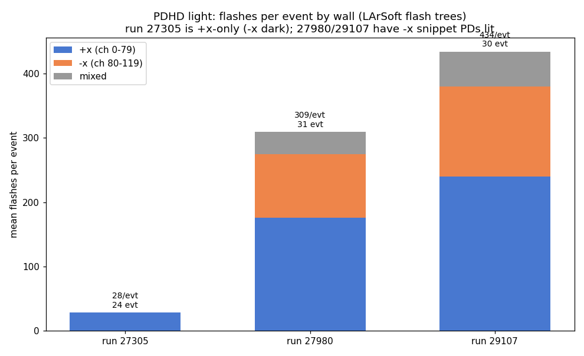
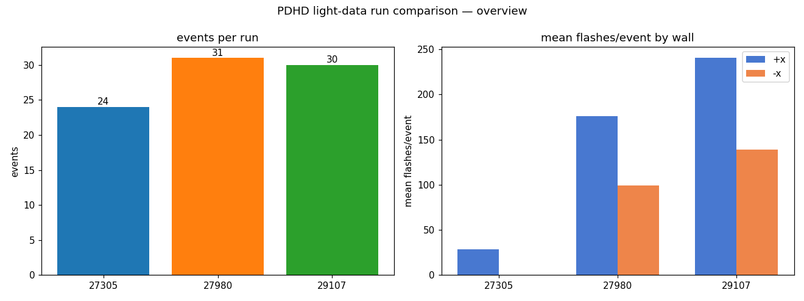
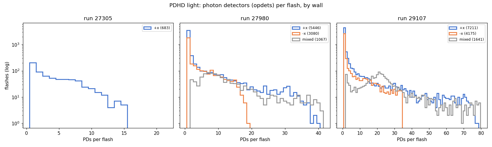
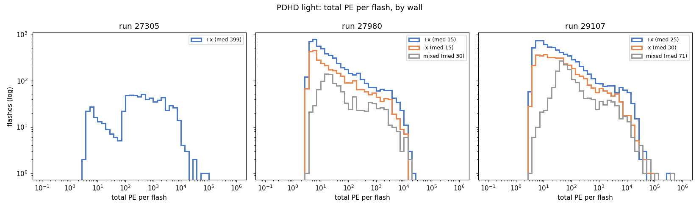
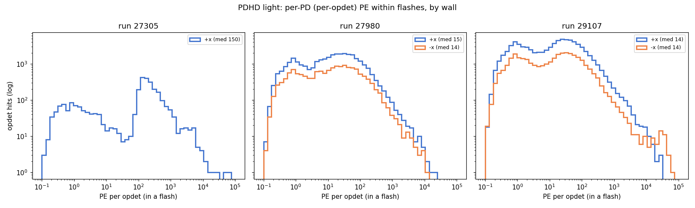

# PDHD light data: flash-statistics comparison across runs (+x vs −x)

A cross-run comparison of the **optical-flash content** of the PDHD light-data
files we currently have, separating the **+x** wall from the **−x** wall. It
answers the practical questions: how many events per run, how many flashes per
event per side, how many photon detectors (PDs) light up per flash, and what the
total-PE and per-PD PE distributions look like.

> Companion docs: `pdhd-light-raw-data.md` (raw waveforms, SPE kernels, OpHit
> formation — see its **§7** for the −x PD coverage and the full-stream readout),
> `which-pd-side-lights.md`, `photon-detector-chain.md`. Plots live in
> `pdhd/pics/` (git-ignored); regenerate them with
> `/home/xqian/tmp/flashstats/make_flash_stats.py`.

---

## 1. Data source and why

The numbers below come from the **LArSoft flash trees** stored in the raw light
files — specifically `flashopdet/flash_opdet`, which holds one row per
`(event, flash_id, opdet)` with branches `event, flash_id, flash_time,
flash_total_pe, opdet, x/y/z, pe`. A flash's total PE is rebuilt as the sum of
its per-opdet `pe`.

We use the LArSoft trees, **not** the toolkit's WCT-native reco, because they
are the **uniform** cross-run source. The toolkit reco is **not** +x-only: it
reconstructs whatever self-triggered snippets `decoana` carries, on **both**
walls (ch 0–79 and the −x snippet PDs 80–119 — verified in run 27980, where −x
events reconstruct with full −x PE, e.g. art 104 → 34646 PE on ch 80–119; see
`run27980-processing-status.md`). But that −x coverage is **event-sparse and
run-dependent** (the −x snippet PDs are dark in run 27305 and present in only
11/31 events of 27980). The −x **full-stream** PDs 120–159 are now reconstructed
WCT-natively (the new OpDecon → OpRoi → OpHit → OpFlash chain — see
`pdhd-fullstream-light-reco.md`, validated comparable to the self-trigger in its
§8), but they are **absent from the LArSoft `flash_opdet` trees** used here. Those
trees carry −x snippet flashes uniformly in every −x-instrumented run, so they give
a consistent basis for the cross-run +x-vs-−x comparison here.

**Side mapping** (verified against `flashopdet/opdet_geo`, x in mm):

| opdet range | wall | x position | in flash trees? |
|---|---|---|---|
| 0–79 | **+x** | ≈ +356 mm | yes (all runs) |
| 80–119 | **−x** (snippet PDs) | ≈ −356 mm | yes (27980, 29107 only) |
| 120–159 | **−x** (full-stream PDs) | ≈ −356 mm | **not in the LArSoft trees** (reconstructed WCT-natively — see `pdhd-fullstream-light-reco.md` §8) |

So throughout this doc the **"−x" side means channels 80–119**. The full-stream
−x PDs 120–159 are absent **from these LArSoft trees** by construction; they are
now reconstructed WCT-natively (`pdhd-fullstream-light-reco.md`), but that is a
different source and is not mixed into the LArSoft cross-run tables below.

---

## 2. Runs available

| run | light ROOT file | events | −x present |
|---|---|---|---|
| **27305** | `run027305/np04hd_raw_run027305_0001_…_final.root` | 24 | **no** (+x only; −x dark this run) |
| **27980** | `run027980/np04hd_raw_run027980_0000_…_final.root` | 31 | yes (ch 80–119) |
| **29107** | `run029107/np04hd_raw_run029107_0004_…_final.root` | 30 | yes (ch 80–119) |
| ~~28084~~ | `run028084/np04hd_raw_run028084_0300_…_final.root` | — | **excluded** |

**Run 28084 is excluded:** its light ROOT is truncated/corrupt (723 MB, uproot
read error mid-file). The 31 `evt_*` subdirectories under `run028084/` hold
**charge** data (orig/SP wire frames per anode), not optical data, so the run
contributes no flash statistics. If the file is re-extracted intact it slots
straight into the comparison.

The −x wall is **run-dependent**: it is dark in 27305 and lit (snippet PDs) in
27980 and 29107. This matches `which-pd-side-lights.md`.

---

## 3. Method

For each run we read `flashopdet/flash_opdet`, group rows into flashes by
`(event, flash_id)`, and for every flash compute its PD count, total PE, and the
PE on each wall. **Side assignment:** a flash is `+x` if all its PE sits on
ch 0–79, `−x` if all on ch 80–119, and `mixed` if both walls have PE.

Flashes are mostly **wall-pure**: mixed flashes are only **11.1 %** in 27980
(1067 / 9593) and **12.6 %** in 29107 (1641 / 13027). We keep `mixed` as its own
category rather than forcing a side, and report it alongside +x and −x.

---

## 4. Comparisons

### 4.1 Summary table

| run | events | flashes | flashes/evt | +x | −x | mixed | tot-PE med | tot-PE p90 | tot-PE max | nPD med | nPD p90 | nPD max |
|---|---|---|---|---|---|---|---|---|---|---|---|---|
| 27305 | 24 | 683 | **28.5** | 683 | 0 | 0 | 399 | 4177 | 72299 | 3 | 9 | 15 |
| 27980 | 31 | 9593 | **309.5** | 5446 | 3080 | 1067 | 17 | 573 | 21755 | 1 | 14 | 52 |
| 29107 | 30 | 13027 | **434.2** | 7211 | 4175 | 1641 | 34 | 855 | 415688 | 1 | 26 | 113 |

*(tot-PE = total PE per flash; nPD = photon detectors per flash; p90 = 90th
percentile.)*

### 4.2 Events per run, and flashes per event by wall

Mean flashes/event by side:

| run | +x | −x | mixed | all |
|---|---|---|---|---|
| 27305 | 28.5 | 0.0 | 0.0 | 28.5 |
| 27980 | 175.7 | 99.4 | 34.4 | 309.5 |
| 29107 | 240.4 | 139.2 | 54.7 | 434.2 |

The +x baseline (run 27305) sits at ~28 flashes/event — a number that
independently matches the hand-checked **event 150 → 30 flashes** in
`pdhd-light-raw-data.md`. The two −x-instrumented runs have **~10× more flashes
per event**, with the −x wall contributing roughly a third of them.

### 4.3 Photon detectors per flash

Most flashes are small: median PD count is **3** for 27305 and **1** for
27980/29107, with a tail reaching 15 / 52 / 113 PDs. In 29107 the **mixed**
flashes pile up around ~20 PDs — these are the genuinely large, cross-wall
events. The +x and −x snippet walls have very similar single-wall PD shapes.

**Why a −x flash tops out at ~half the +x ceiling here, and how the all-PD reco
fixes it.** A +x flash can reach ~40 PDs but a −x flash only ~20 — *not* a bug.
Both walls physically have **80 PDs** (8 z-rows × 10), but on −x they are split by
**readout** into two distinct half-walls tiling **disjoint z-halves**: the
**snippet** PDs 80–119 (z ≈ 267–427) and the **full-stream** PDs 120–159
(z ≈ 35–195). These LArSoft `flash_opdet` trees carry only the snippet half, and
even the WCT per-stream reco keeps the two halves in **separate** flash files, so a
−x flash can light only one 40-PD half (~20 in practice) while +x sees its whole
80-PD wall. Roughly half a wall lights per flash, so the maxima track the channel
count almost exactly 2:1. Reconstructing **all 160 PDs in one processing**
(`pdhd-fullstream-light-reco.md` §9: snippet + full-stream OpHits merged into one
`OpFlashFinder`) restores the full −x wall — a −x flash then reaches ~55 PDs (of 78
usable), comparable to +x, while +x stays byte-identical. The cross-run tables here
are LArSoft trees and unchanged; the all-PD product is the separate WCT source.

### 4.4 Total PE per flash

Run 27305 is distinctly **bimodal** (a small ~5-PE bump plus a main population
spanning ~10²–10⁴ PE, median 399), whereas 27980/29107 are dominated by **many
low-PE flashes** (median 17 and 34). The +x and −x distributions overlay closely
within a run; `mixed` flashes carry more PE by construction (they sum both
walls).

### 4.5 Per-PD PE

Per-PD PE (median / p90 / max):

| run | +x | −x |
|---|---|---|
| 27305 | 150 / 543 / 71052 | — |
| 27980 | 15 / 120 / 18743 | 14 / 134 / 12441 |
| 29107 | 14 / 123 / 29257 | 14 / 119 / 58070 |

The per-PD PE spectrum is **bimodal** — a low ~1-PE (SPE-scale) bump plus a
broader high-PE population — and the **+x and −x walls track each other closely**
(medians within ~1 PE). The +x wall sits marginally higher in normalization. The
27305 per-PD spectrum is shifted up (median ~150 PE) consistent with its
higher-PE flash population.

---

## 5. Caveats

- The **~10× spread in flashes/event** and **~20× spread in PE scale** between
  27305 and 27980/29107 most likely reflect different **trigger / readout
  configuration** (and the presence of −x instrumentation), not a physics
  difference between the runs. Treat cross-run absolute rates with care; the
  +x-vs-−x *within-run* comparison is the robust part.
- "−x" here is the **snippet PDs 80–119 only**, so the −x wall is under-counted in
  these LArSoft-tree tables relative to its full instrumentation. The full-stream
  PDs 120–159 are now reconstructed WCT-natively (and validated comparable to the
  self-trigger — `pdhd-fullstream-light-reco.md` §8), but that is a separate source
  not present in the LArSoft `flash_opdet` trees, so it is not folded in here.
- These are **LArSoft** flashes, the upstream reco. The toolkit's WCT-native
  flashes (which cover +x **and** the −x snippet PDs 80–119 where `decoana`
  provides them, but not uniformly across runs — see
  `run27980-processing-status.md`) are not used here.

---

## Appendix — provenance

| item | source |
|---|---|
| flash records | `flashopdet/flash_opdet` (event, flash_id, opdet, pe, flash_total_pe) |
| side / geometry | `flashopdet/opdet_geo` (x sign: 0–79 = +x, 80–159 = −x) |
| analysis + plots | `/home/xqian/tmp/flashstats/make_flash_stats.py` |
| run 28084 status | light ROOT truncated (723 MB, uproot read error); `evt_*` dirs are charge frames |
