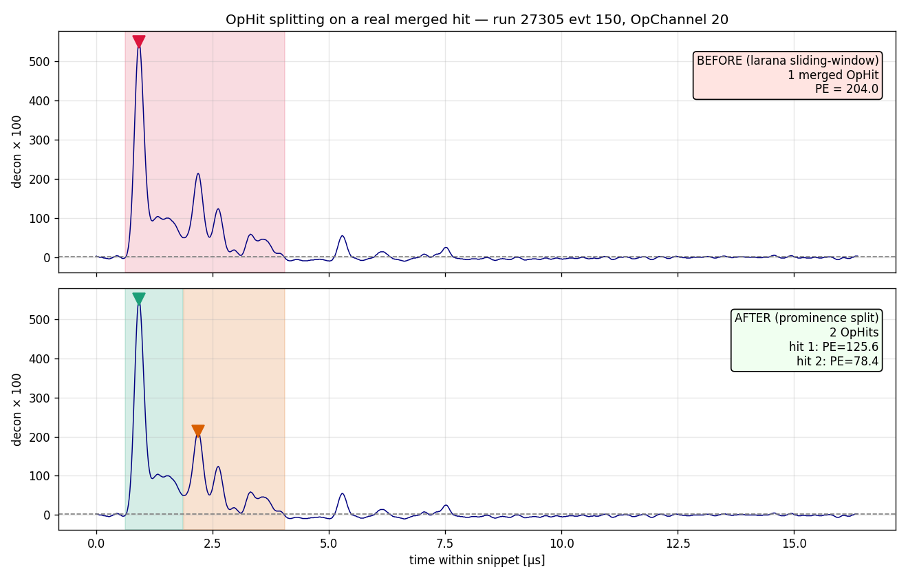

# PDHD light: raw data, deconvolution kernels, and OpHit formation

A walk-through of the **raw PDHD photon-detector data** and the WCT-native light
reconstruction in `flash/`, answering the practical questions: how long is a raw
waveform, what is the tick, how is it triggered, what kernels deconvolve it, and
how an OpHit's time and PE are built. It is grounded in the actual data
(`pdhd/input_data_7p8_new_coh_grouping/run<RUN6>/np04hd_raw_run<RUN6>_*.root`,
converted into `pdhd/work/<run>_<evt>/light-frames*.tar.bz2`) and the three
`flash/` components.

> Companion docs: `photon-detector-chain.md` (upstream DUNE survey, geometry,
> timing offset), `flash/docs/stage1-root-conversion.md` (ROOT → WCT),
> `flash/docs/stage2-reconstruction.md` (fcl ↔ config). This doc is the
> data-and-algorithm view, with plots in `pdhd/pics/`.

All numbers/plots below are from **run 27305, event 150** unless noted.

---

## 1. The raw waveform — length, tick, triggering

### 1.1 One snippet = 1024 samples at 16 ns

The PDHD optical detectors are **160 X-ARAPUCA channels** (4 APAs × 10 bars × 4
windows; OpChannel == OpDet, see `photon-detector-chain.md` §2). They are read out
by **DAPHNE** digitizers on the optical clock:

| quantity | value |
|---|---|
| optical clock | **62.5 MHz** (`ClockSpeedOptical`) |
| **tick Δt** | **16 ns** |
| **samples per snippet** | **1024** |
| snippet duration | 1024 × 16 ns = **16.38 µs** |
| ADC depth | 14-bit (baseline ≈ 7000–8200 counts) |
| pulse polarity | **negative-going** (`input_polarity = −1`) |


The top panel is one raw snippet on OpChannel 0: a flat pedestal (≈ 8173 ADC), a
sharp **downward** dip (DAPHNE pulses are negative; the deconvolution flips them),
then the AC-coupled overshoot and slow return. The full record is exactly 1024
ticks = 16.38 µs wide.

### 1.2 Self-triggered, not common-triggered

Each channel saves its **own** 1024-tick snippet around its own threshold
crossing — this is **DAPHNE self-triggered** readout, *not* a single common
window shared by all channels:

- the bottom panel of the figure scatters every saved snippet's start time
  against its channel; the start times spread over **milliseconds** and differ
  channel-to-channel — there is no shared window edge;
- a channel may save **several** snippets in one event (e.g. OpChannel 4 has
  three); the converter places each one at its own `tbin` in a sparse dense frame
  (`frame_raw_150.npy` is `[59 chan × 173568 ticks]`, ~99% zeros);
- channels **120–159** are instead read out in **full-stream** mode (continuous,
  not snippet) and are skipped in this reconstruction (see §2.3).

(Snippet start times are recovered relative to a per-event `t_first` anchor; see
`stage1-root-conversion.md` "Time anchoring". The LArSoft dump also caps the
saved set at **400 snippets/event**, so the converted frame is a representative
subset, not every channel.)

---

## 2. Deconvolution — `Flash::OpDecon` (`flash/src/OpDecon.cxx`)

Raw ADC → an SPE-normalized waveform whose amplitude is ≈ **photoelectrons per
tick**. This is a dependency-free port of the duneopdet `Deconvolution` module
(Wiener filter built from a single-p.e. template), tag `"raw"` → `"decon"`.

### 2.1 What kernels are involved

There are **three** spectral ingredients, combined per channel:

1. **SPE response `H`** — the single-photoelectron template (the *only* detector
   response kernel; §2.2).
2. **Noise power `N²`** — per-channel noise spectrum entering the Wiener
   denominator (§2.4).
3. **Gauss post-filter** — a fixed 1.5 MHz low-pass applied after the Wiener step
   (§2.3).

The Wiener filter itself is

```
G(f) = conj(H) · S² / ( |H|² · S² + N² )          # OpDecon::deconvolve
```

with `S² = (max(xv)/SPE_amplitude)²` the module's δ-function input-strength guess
(`xv` = baseline-subtracted, polarity-corrected ADC). Pedestal is the mean of the
first `PreTrigger − PedestalBuffer = 50 − 30 = 20` samples. After `G`, the Gauss
post-filter multiplies the spectrum, an AutoScale factor normalizes the filtered
SPE response to unit area, and a post baseline correction (first 20 samples of the
deconvolved waveform) is subtracted.

### 2.2 The SPE kernel — and the AC response question


The SPE template is the channel's measured response to **one** photoelectron, in
ADC, 1024 ticks long. It has a fast rise to a peak at **tick 11 (176 ns)**, then
an **undershoot below zero**, then a slow return to baseline (right panel, full
1024 ticks).

**On "additional AC response beyond the SPE":** there is no *separate* AC-coupling
kernel that gets deconvolved. The SPE template **already embeds** the full
SiPM + DAPHNE-electronics chain, including the AC coupling — the visible
undershoot/overshoot *is* the AC-coupled tail of the single-p.e. response.
Deconvolving by `H` therefore removes the AC shaping along with everything else.
The only kernels applied *in addition to* `H` are the noise model `N²` (§2.4) and
the Gauss post-filter (§2.3) — both are filters, not detector responses.

The default templates are the **2024 NP04 FBK/HPK average** set
(`pdhd-spe-templates.json` = 2 templates, FBK/HPK channel split). The LArSoft
production uses the **per-channel run28368 v1** templates instead
(`protodunehd_template_list_v1`, kept here as `pdhd-spe-templates-v1.json`, 113
templates for channels 0–119; dead 86/87/97/107/116/117 and noisy 3 dropped as
LArSoft `IgnoreChannels`) — but those over-subtract the slow scintillation tail
below zero on nearly every channel (their net area is not DC-balanced), so
`flash/` deliberately defaults to the DC-balanced 2024 averages, which
deconvolve to a flat tail. A per-channel comparison, the over-subtraction
ablation, and a data-driven SPE-calibration attempt (which does **not** beat
the 2024 average — the single-PE pulses sit at the noise floor) are documented
in `pdhd/pics/pd/`.

### 2.3 The Gauss post-filter


Left: the three kernels in frequency. The Wiener filter `|G|` (red) *amplifies*
high frequencies (that is where `|H|` rolls off and signal/noise is worst), so
left alone it would inject high-frequency noise. The **Gauss post-filter** (green,
1.5 MHz cutoff at 62.5 MHz sampling) band-limits the result to ≲ 5 MHz, taming
exactly that amplified noise. It is built in `OpDecon::configure` as a normalized
time-domain Gaussian (σ ≈ 5.5 samples) transformed and phase-shifted to the window
centre; the right panel shows its compact time-domain shape.

### 2.4 The noise power `N²`

`N²` in the Wiener denominator is read per channel from
`pdhd-noise-templates.json` (run27950 noise power spectra, half-spectrum 513 bins,
same `LineNoiseRMS²·Samples` normalization). When no noise file is configured the
code falls back to the **flat** `N² = LineNoiseRMS²·Samples = 4.5²·1024`. The
production `flash.jsonnet` wires the per-channel file in (`noise_file:
pdhd-noise-templates.json`).

### 2.5 Result


Top: the baseline-subtracted, polarity-corrected raw input (the negative dip of
§1.1 is now a positive peak, with the AC undershoot below). Bottom: the WCT
deconvolution (red) and the LArSoft reference (green dashed) for the same snippet
— a clean ~25-PE/tick peak where the raw had its AC-distorted pulse, with the slow
scintillation tail preserved. (The small late-tail divergence vs the reference is
the residual baseline/template difference discussed in `stage2-reconstruction.md`.)

---

## 3. OpHit formation — `Flash::OpHitFinder` (`flash/src/OpHitFinder.cxx`)

Deconvolved snippet → discrete **OpHits** (one per pulse) carrying a time and a PE.
Port of `OpHitFinderDeco` / larana `AlgoSlidingWindow` with the
`dune_ophit_finder_deco` values.

### 3.1 Pre-processing

- the decon waveform is multiplied by `ScalingFactor = 100` and **cast to
  `short`** — so all thresholds and areas below are in those scaled integer units;
- pedestal is the **head method** (`PedAlgoEdges`): mean and σ of the first
  `ped_nsamples = 3` samples.

### 3.2 Sliding-window pulse finding


`AlgoSlidingWindow::RecoPulse` (positive polarity) walks the waveform with three
thresholds above pedestal:

| threshold | value | role |
|---|---|---|
| start | `max(ADCThreshold 3, 1·σ)` | a pulse **opens** when the sample exceeds this |
| tail | `max(1, 1·σ)` | drop below → pulse enters its falling tail |
| end | `max(1, 1·σ)` | drop below → start the post-sample countdown |

A pulse **integrates continuously** from `t_start` (backed up by up to
`NumPresample = 2` ticks) until it has stayed below the end threshold for
`NumPostsample = 2` ticks; that span is the **integration window** (shaded
orange in the plot). Within it the algorithm accumulates `area = Σ(sample −
pedestal)` and tracks the peak height and its position `t_max`. Pulses narrower
than `MinPulseWidth = 1` or with peak below `HitThreshold = 3` are discarded.

Because the window stays open while the signal is above the (low) end threshold,
a **bright pulse with a long scintillation tail is captured as one wide hit** —
the example OpChannel 0 hit spans 912 ticks and integrates the whole fast peak +
late-light tail into a single OpHit.

### 3.3 The OpHit quantities

For each surviving pulse the finder emits a 9-column row
(`OpHitFinder.h`, schema in `design.md` §3.4):

| column | meaning | how it is computed |
|---|---|---|
| `channel` | OpChannel (== OpDet) | from the trace |
| `peak_time` | hit time [ns] | `t0 + tick·(tbin + t_max)` (trigger-relative WCT ns) |
| `width` | [ns] | `(t_end − t_start)·tick` |
| `area` | scaled integral | Σ over the integration window |
| `amplitude` | scaled peak | max sample − pedestal |
| **`pe`** | **photoelectrons** | **`area / SPEArea`, `SPEArea = 100`** |
| `start_time` | [ns] | `t0 + tick·(tbin + t_start)` |
| `flash_id` | −1 | filled later by OpFlashFinder |
| `fast_to_total` | 0 | not computed |

So the **time** is the PE-peak position mapped through the frame anchor, and the
**NPE** is the integrated pulse area divided by the single-p.e. area (100 scaled
units). In the example, area 108628 / 100 = **~1086 PE** — a very bright flash.

### 3.4 Separating overlapping pulses (PDHD on by default)

The §3.2 sliding window keeps a pulse open while the waveform stays above the
**very low** tail/end threshold (`max(1, 1·σ)` scaled). When a second light pulse
arrives before the first's slow LAr scintillation tail has fallen back, the valley
between the two sub-peaks never reaches that threshold, so **the two pulses merge
into one OpHit and the second pulse's PE is absorbed into the first** — exactly the
"second flash lost" failure mode.

The WCP prototype (`prototype_base/2dtoy`, `ToyLightReco.cxx`) handles this at the
*flash* level, on the summed light across all PMTs, with a Kolmogorov–Smirnov test
on the per-PMT **spatial** PE profile plus a rising-PE re-trigger (it has no
per-channel OpHit step). In this toolkit the OpHits are found per channel *first*,
so a merged per-channel hit can never be recovered downstream — the split must
happen here. `OpHitFinder::split_pulse` therefore post-processes each pulse and
splits it at prominent valleys between its sub-peaks (the per-channel analogue of
the prototype's re-trigger), leaving the larana state machine untouched:

- find the pulse's internal local maxima (`> split_min_peak`);
- accept a split at the valley between two adjacent peaks only when the valley is
  deep **both relatively** (≥ `split_min_prominence` = 0.4 of the smaller flanking
  peak) **and absolutely** (≥ `split_min_prominence_abs` = 100 scaled = **1
  PE/tick**, mirroring the prototype's absolute PE margin); shallow shoulders are
  merged back, so a smooth scintillation tail is **not** fragmented;
- recompute `area`/`peak`/`t_max`/`t_start`/`t_end` for each sub-pulse so all nine
  ophit columns stay consistent.



The figure shows a real merged hit (OpChannel 20): **before**, one 204-PE OpHit
spans both pulses; **after**, two OpHits (125.6 + 78.4 PE) are recovered at the two
prompt peaks ~1.3 µs apart, split at the intervening valley. Across run 27305
evt 150 the splitter turns **827 → 852 OpHits (+25)** and, after flash assembly,
**55 → 60 OpFlashes (+5)** — five overlapping flashes recovered — with total PE
conserved to 0.01 % (the absolute floor suppresses the ~400 spurious tail-ripple
splits a relative-only criterion would produce).

It is **gated by `split_enable`** (component default **off → bit-identical** to the
larana output, verified by the OFF run reproducing the 827-hit baseline and by the
`split disabled` doctest) and **enabled in PDHD's `flash.jsonnet`**. The four knobs
live in the `algo` block; tune `split_min_prominence_abs` for more/less aggressive
splitting.

---

## 4. Building OpFlashes from OpHits — `Flash::OpFlashFinder`

OpHits across channels are grouped in time into `recob::OpFlash`-equivalents
(larana `OpFlashAlg::RunFlashFinder`, `protodune_opflash` values):

- **double-offset 1 µs accumulators** (`bin_width = 1000 ns`) over hit peak time:
  two binnings offset by half a bin, so a flash boundary falling on a bin edge in
  one binning lands mid-bin in the other. A bin becomes a flash candidate once its
  summed PE ≥ `FlashThreshold = 3.5 PE`;
- hits are claimed **largest-flash-first** (`assign_hits_to_flash`), so the brightest
  coincidence wins contested hits, then `RefineHitsInFlash` (`width_tolerance = 0.5`)
  re-groups the claimed hits by peak-time proximity — this is what actually
  resolves two flashes that share a 1 µs accumulator bin;
- `ConstructFlash` builds the PE-weighted flash time, the **per-OpDet PE vector**
  (length `nchan = 160`, OpChannel order — directly QLMatching-ready), and the
  y/z centroid/width from `pdhd-opdet-geom.json`;
- `RemoveLateLight` (Argon τ = 1.6 µs) drops a later flash whose PE is consistent
  with the exponential late-light tail of an earlier one.

The output is the opflash tensor set (`opflash`, `flash_summary`, `ophits`)
consumed by `FlashTensorToOpticalPCs{nchan:160}` / `QLMatching{nchan:160}`.

### 4.1 Comparison with the WCP prototype (`2dtoy/ToyLightReco`)

The prototype builds flashes very differently, and the comparison motivated the
choices below:

| aspect | prototype `ToyLightReco` | toolkit `OpFlashFinder` |
|---|---|---|
| time binning | 93.75 ns (6×15.625 ns rebin) | 1 µs double-offset accumulators |
| separating close flashes | **KS test on the per-PMT *spatial* PE profile** (rising-PE retrigger; "London's Patch" recovers flashes hidden in a prior tail) | largest-first claiming + `RefineHitsInFlash` peak-time regroup |
| flash time | PE-weighted (cosmic) / peak-bin (beam) | PE-weighted hit time |
| detector grouping | one flat 32-PMT namespace, split only by trigger type (beam/cosmic) | all 160 OpDets, or per cathode side (§4.3) |
| late light | cosmic↔beam veto windows | `RemoveLateLight`, Ar τ = 1.6 µs |

The prototype's KS retrigger is a *flash-level* tool: it has **no per-channel OpHit
step**, so it separates pile-up by watching the spatial PE pattern change. The
toolkit finds per-channel OpHits first, so the analogous "second pulse on a tail"
problem is solved one layer earlier, in `OpHitFinder::split_pulse` (§3.4). At the
flash level the larana double-offset + width-tolerance machinery is sufficient (next).

### 4.2 The coincidence window is robust at 1 µs (data-checked)

Measured over the first event of each run (`027305_0`, `027980_0`, `028084_0`,
`029107_0` — DAQ 150, 8, 74408, 983):

- the **time spread of the OpHits within a single reconstructed flash is always
  < 1 µs** (max 0.96 µs) — a 1 µs accumulator bin never splits a genuine flash;
- inter-flash gaps as small as **~0.1 µs are already resolved** into separate
  flashes (the half-bin offset plus the `width_tolerance = 0.5` peak-time regroup),
  so the 1 µs bin does not over-merge either.

So `bin_width = 1 µs` and `width_tolerance = 0.5` (the larana/`protodune_opflash`
defaults) are kept — the data shows no benefit to a finer window, and the prompt
scintillation light that defines a flash time is contained well inside 1 µs.

### 4.3 One flash per drift volume — `group_by_side` (PDHD on)

**Physics.** PDHD has two drift volumes separated by a **solid HV cathode** at
x ≈ 0; the photon detectors sit in the two APA walls at x ≈ ±3562 mm. The cathode
is **opaque to the 128 nm VUV scintillation light**, so the two volumes are
**optically independent** — a scintillation flash in one volume is seen only by that
volume's OpDets. Light from the two sides is coincident **only** when a single track
*crosses* the cathode and deposits in both volumes at the same t₀; two unrelated but
time-coincident events (one per volume) are physically distinct flashes.

**Consequence.** Assembling all 160 OpDets in one namespace would merge such a
coincidence into a single flash whose PE pattern spans both sides — a contaminated
spatial profile that QLMatching cannot associate to a single charge cluster (each
flash belongs to one drift volume, and the drift/T₀ is per-volume). So
`OpFlashFinder` gained a `group_by_side` knob: it partitions OpDets by the sign of
their geometry x and runs the full flash-finding pipeline (including
`RemoveLateLight`) **independently per drift volume**. The tensor schema is
unchanged — the side is already implicit in the per-OpDet PE vector.

`group_by_side` is **off by default** (all-OpDet, exactly the larana behaviour) and
**on for PDHD** (`flash.jsonnet`). It is the physically correct grouping and mirrors
SBND's per-APA flashes.

**Current data caveat.** The 2024 readout instruments only the **+x** drift volume:
in every example event 100 % of the PE is on OpDets 0–79 and the −x side is empty.
So on today's data `group_by_side` ON is **byte-identical** to all-TPC (verified on
all four events). Its effect only appears once both volumes are read out — confirmed
with a synthetic two-side coincidence, where all-TPC produces one mixed flash and
`group_by_side` produces two, one per side.

### 4.4 Flash refinement — merging over-split flashes (`flash_refine`, PDHD on)

**The problem.** The per-channel OpHit splitter (§3.4) plus the 1 µs accumulators
sometimes **fragment one real flash into several**: a bright prompt flash is
accompanied by small, few-PD satellites sitting on its slow scintillation tail
(and its afterpulsing), each just crossing the `FlashThreshold = 3.5 PE` to
register as its own flash. `RemoveLateLight` only drops the satellites whose PE
*magnitude* is consistent with a simple exponential tail; a 3.5–6 PE fragment
several µs out is not, so it survives as a spurious extra flash.

**The fix.** After `ConstructFlash`/`RemoveLateLight`, `refine_flashes` walks the
flashes of one drift side in time order and merges a **later** flash `j` into an
**earlier** flash `i` when ALL of:

1. **time window** — `t_j − t_i ≤ refine_window_us` (**8 µs**), sliding;
2. **dim** — `total_pe(j) ≤ refine_pe_ratio × total_pe(i)` (**0.5**);
3. **few PDs** — `j` lights `1 … refine_max_fired` (**2**) OpDets, an OpDet
   counting as lit when `pe ≥ refine_fired_pe` (**0.5 PE**);
4. **spatially adjacent** — every lit OpDet of `j` is the same as, or an
   **8-neighbour (Chebyshev ≤ 1)** of, a lit OpDet of `i`, on the **same side**.
   Each side is a regular 10-row(y) × 8-col(z) OpDet grid (built once in
   `configure()` by ranking the distinct y/z per side); adjacency is the grid
   `max(|Δrow|, |Δcol|) ≤ 1` test. The spatial gate is the real discriminator —
   a genuinely independent flash elsewhere in the volume is never adjacent.

The merge **cascades**: `j`'s hits are added to `i`, `i` is recomputed
(`construct_flash`, so its time/PE/per-OpDet vector grow), then the next flash is
tested against the **grown** `i` — so three close fragments collapse 1←2, then
1←3 against the merged pair. It runs **per cathode side** (inside `find_flashes`,
which is already called once per side), so a merge never crosses the opaque
cathode.

**Knob tuning (data-driven, run 27305).** Over the 23 events, among same-side,
within-8 µs, adjacency-passing ordered pairs the later flash is overwhelmingly a
single lit OpDet at a few PE against a 7 000–18 000 PE parent — clear
over-splits. The PE-ratio population sits well below the "comparable flash"
regime (which only appears at ratio ≳ 0.7), so `refine_pe_ratio = 0.5` stays
clear of it; `refine_max_fired = 2` also catches the ~6 % of satellites whose
light spreads onto a second adjacent window. The cascade then merges **1440 →
718 flashes (−49 %)** with **total PE conserved to 0.0000 %** (a merge only moves
hits between flashes). The merge Δt is *not* concentrated at ~1 µs — it is spread
continuously across the window (median **3.1 µs**, 90th pct 6.3 µs), i.e. the
8 µs window deliberately recaptures slow-scintillation/afterpulse fragments out
to several µs, not just the nearest splits.

**Q/L impact.** Matching is stable: the bright prompt flashes (which carry the
real matches) are always merge *targets* and persist with sub-0.1 µs time shifts;
`auto_selected` match counts barely move (event 0: group02 26→27, group13 40→38),
and the only matches that fold are dim satellites absorbed into their parent — the
intended behaviour.

`flash_refine` is **off by default** (component reproduces the larana output
byte-for-byte — verified: default-off opflash tensors are `array_equal` to the
pre-change output) and **on for PDHD** in `flash.jsonnet`. The four knobs live in
the `opflash_finder` builder. (Effect is per drift side, so it also mirrors
SBND's per-APA flashes if ever enabled there.)

---

## 5. Data layout and running

The light + charge inputs live under
`pdhd/input_data_7p8_new_coh_grouping/run<RUN6>/`:

- `np04hd_raw_run<RUN6>_*.root` — the multi-event light file (`opflashana`,
  `decoana` waveform snippets, `flashopdet`, `trigoff`);
- `evt_<N>/` — per-event **charge** folders (`protodunehd-orig-frames-anode*.tar.bz2`,
  and `protodunehd-sp-frames-*` where signal-processed).

**Event numbering.** The `evt_<N>` folders and the `pdhd/work/<RUN6>_<N>` dirs use a
**0-based index** `N`, but the light ROOT file selects by the **DAQ `EventID`**. The
two are mapped by the charge frame ident inside `evt_<N>/...-orig-frames-anode0.tar.bz2`
(member `frame_*_<DAQ>.npy`) — *not* a formula (e.g. run 27980's DAQ stride is
non-uniform). So light reco passes the DAQ number while keeping the 0-based work-dir
label:

```
./run_light_evt.sh -m reco -e <DAQ_EVENT> <run> <N>   # work/<RUN6>_<N>, selects DAQ
./run_light_evt.sh -m reco <run> <evt>                # back-compat: label == DAQ
```

Caveats when batch-processing: (a) a run's light file may cover only a **subset** of
the charge events (run 27305 has light for 24 of 34 events; the rest raise
`no decoana/run_..._evt_N`); (b) electronics gain is **per run** (`META.json`: 27305 /
28084 = 14, 27980 / 29107 = 7.8 mV/fC) — pass `-g 14` to `run_nf_sp_dnnroi_evt.sh`
for the 14-runs, since its auto-gain wrongly reads "7p8" from the parent dir name.

The curated `pdhd/work/` keeps only events with **both** charge
(`mabc-all-apa.zip`) and light (`opflash_pdhd-wct.tar.gz`); events missing either are
removed.

---

## Appendix — files and reproduction

| topic | location |
|---|---|
| raw + decon frames (this event) | `pdhd/work/027305_0/light-frames-wct.tar.bz2` |
| LArSoft reference deconv | `pdhd/work/027305_0/light-frames.tar.bz2` |
| SPE templates (per-channel v1) | `cfg/pgrapher/experiment/pdhd/pdhd-spe-templates.json` |
| noise power spectra | `cfg/pgrapher/experiment/pdhd/pdhd-noise-templates.json` |
| OpDet geometry (y/z, mm) | `cfg/pgrapher/experiment/pdhd/pdhd-opdet-geom.json` |
| deconvolution | `flash/src/OpDecon.cxx`, `inc/WireCellFlash/OpDecon.h` |
| hit finding | `flash/src/OpHitFinder.cxx`, `inc/WireCellFlash/OpHitFinder.h` |
| flash finding | `flash/src/OpFlashFinder.cxx` |
| chain wiring | `cfg/pgrapher/experiment/pdhd/flash.jsonnet` |
| plot script (§1–3) | `/home/xqian/tmp/pdhd_light_plots/make_plots.py` |
| split plot script (§3.4) | `/home/xqian/tmp/split_demo/make_split_plot.py` |
| per-side flash test (§4.3) | `/home/xqian/tmp/flash_side_test/` (`build_arch.py`, `job.jsonnet`) |

Plots are regenerated with those scripts from the extracted `light-frames*` npy and
the config JSONs; figures land in `pdhd/pics/light_*.png`.
