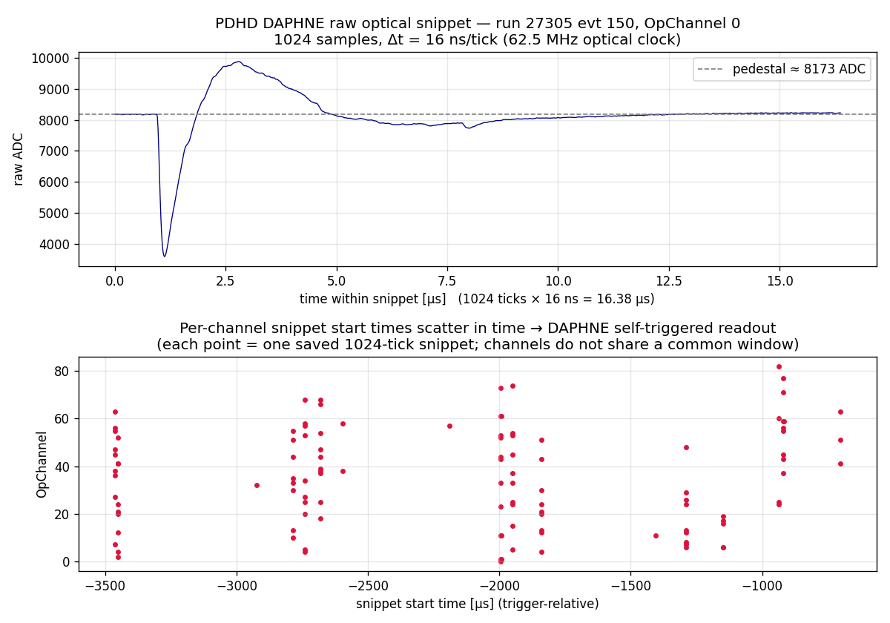
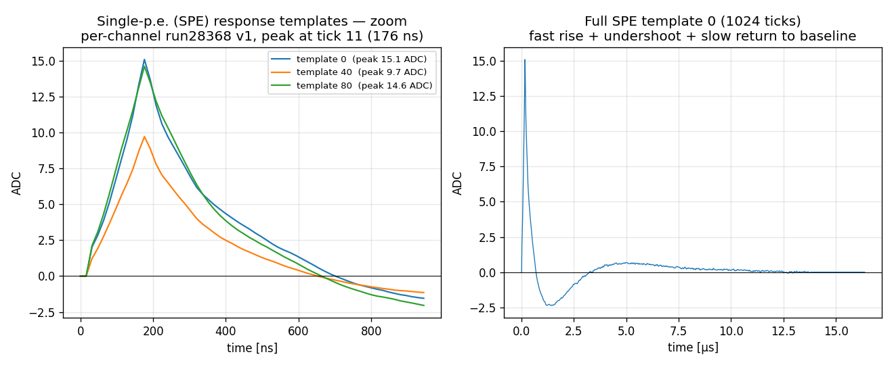
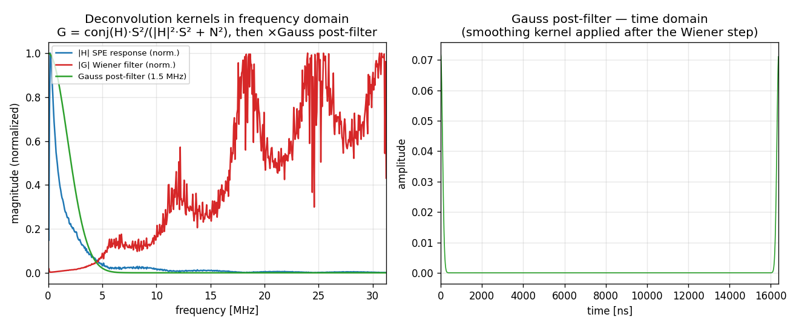
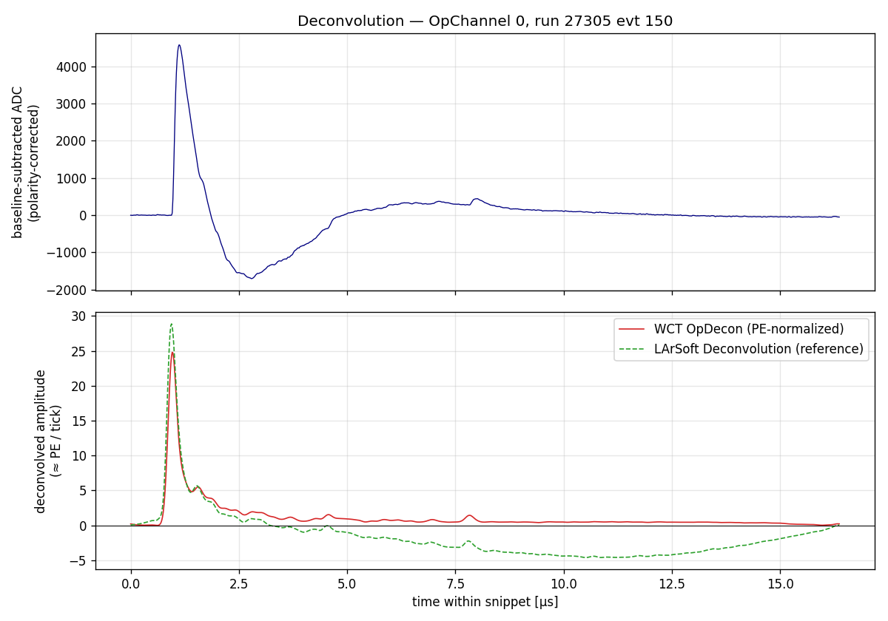
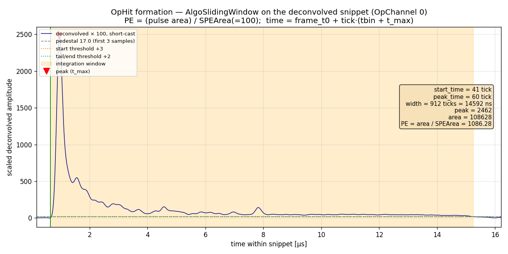

# PDHD light: raw data, deconvolution kernels, and OpHit formation

A walk-through of the **raw PDHD photon-detector data** and the WCT-native light
reconstruction in `flash/`, answering the practical questions: how long is a raw
waveform, what is the tick, how is it triggered, what kernels deconvolve it, and
how an OpHit's time and PE are built. It is grounded in the actual example data
(`pdhd/example_light_data/`, converted into
`pdhd/work/<run>_<evt>/light-frames*.tar.bz2`) and the three `flash/` components.

> Companion docs: `photon-detector-chain.md` (upstream DUNE survey, geometry,
> timing offset), `flash/docs/stage1-root-conversion.md` (ROOT → WCT),
> `flash/docs/stage2-reconstruction.md` (fcl ↔ config). This doc is the
> data-and-algorithm view, with plots in `pdhd/pics/`.

All numbers/plots below are from **run 27305, event 150** unless noted.

---

## 1. The raw waveform — length, tick, triggering

### 1.1 One snippet = 1024 samples at 16 ns

The PDHD optical detectors are **160 X-ARAPUCA channels** (4 APAs × 10 bars × 4
windows; OpChannel == OpDet, see `photon-detector-chain.md` §2). They are read out
by **DAPHNE** digitizers on the optical clock:

| quantity | value |
|---|---|
| optical clock | **62.5 MHz** (`ClockSpeedOptical`) |
| **tick Δt** | **16 ns** |
| **samples per snippet** | **1024** |
| snippet duration | 1024 × 16 ns = **16.38 µs** |
| ADC depth | 14-bit (baseline ≈ 7000–8200 counts) |
| pulse polarity | **negative-going** (`input_polarity = −1`) |



The top panel is one raw snippet on OpChannel 0: a flat pedestal (≈ 8173 ADC), a
sharp **downward** dip (DAPHNE pulses are negative; the deconvolution flips them),
then the AC-coupled overshoot and slow return. The full record is exactly 1024
ticks = 16.38 µs wide.

### 1.2 Self-triggered, not common-triggered

Each channel saves its **own** 1024-tick snippet around its own threshold
crossing — this is **DAPHNE self-triggered** readout, *not* a single common
window shared by all channels:

- the bottom panel of the figure scatters every saved snippet's start time
  against its channel; the start times spread over **milliseconds** and differ
  channel-to-channel — there is no shared window edge;
- a channel may save **several** snippets in one event (e.g. OpChannel 4 has
  three); the converter places each one at its own `tbin` in a sparse dense frame
  (`frame_raw_150.npy` is `[59 chan × 173568 ticks]`, ~99% zeros);
- channels **120–159** are instead read out in **full-stream** mode (continuous,
  not snippet) and are skipped in this reconstruction (see §2.3).

(Snippet start times are recovered relative to a per-event `t_first` anchor; see
`stage1-root-conversion.md` "Time anchoring". The LArSoft dump also caps the
saved set at **400 snippets/event**, so the converted frame is a representative
subset, not every channel.)

---

## 2. Deconvolution — `Flash::OpDecon` (`flash/src/OpDecon.cxx`)

Raw ADC → an SPE-normalized waveform whose amplitude is ≈ **photoelectrons per
tick**. This is a dependency-free port of the duneopdet `Deconvolution` module
(Wiener filter built from a single-p.e. template), tag `"raw"` → `"decon"`.

### 2.1 What kernels are involved

There are **three** spectral ingredients, combined per channel:

1. **SPE response `H`** — the single-photoelectron template (the *only* detector
   response kernel; §2.2).
2. **Noise power `N²`** — per-channel noise spectrum entering the Wiener
   denominator (§2.4).
3. **Gauss post-filter** — a fixed 1.5 MHz low-pass applied after the Wiener step
   (§2.3).

The Wiener filter itself is

```
G(f) = conj(H) · S² / ( |H|² · S² + N² )          # OpDecon::deconvolve
```

with `S² = (max(xv)/SPE_amplitude)²` the module's δ-function input-strength guess
(`xv` = baseline-subtracted, polarity-corrected ADC). Pedestal is the mean of the
first `PreTrigger − PedestalBuffer = 50 − 30 = 20` samples. After `G`, the Gauss
post-filter multiplies the spectrum, an AutoScale factor normalizes the filtered
SPE response to unit area, and a post baseline correction (first 20 samples of the
deconvolved waveform) is subtracted.

### 2.2 The SPE kernel — and the AC response question



The SPE template is the channel's measured response to **one** photoelectron, in
ADC, 1024 ticks long. It has a fast rise to a peak at **tick 11 (176 ns)**, then
an **undershoot below zero**, then a slow return to baseline (right panel, full
1024 ticks).

**On "additional AC response beyond the SPE":** there is no *separate* AC-coupling
kernel that gets deconvolved. The SPE template **already embeds** the full
SiPM + DAPHNE-electronics chain, including the AC coupling — the visible
undershoot/overshoot *is* the AC-coupled tail of the single-p.e. response.
Deconvolving by `H` therefore removes the AC shaping along with everything else.
The only kernels applied *in addition to* `H` are the noise model `N²` (§2.4) and
the Gauss post-filter (§2.3) — both are filters, not detector responses.

The default templates are the **2024 NP04 FBK/HPK average** set
(`pdhd-spe-templates.json` = 2 templates, FBK/HPK channel split). The LArSoft
production uses the **per-channel run28368 v1** templates instead
(`protodunehd_template_list_v1`, kept here as `pdhd-spe-templates-v1.json`, 113
templates for channels 0–119; dead 86/87/97/107/116/117 and noisy 3 dropped as
LArSoft `IgnoreChannels`) — but those over-subtract the slow scintillation tail
below zero on nearly every channel (their net area is not DC-balanced), so
`flash/` deliberately defaults to the DC-balanced 2024 averages, which
deconvolve to a flat tail. A per-channel comparison, the over-subtraction
ablation, and a data-driven SPE-calibration attempt (which does **not** beat
the 2024 average — the single-PE pulses sit at the noise floor) are documented
in `pdhd/pics/pd/`.

### 2.3 The Gauss post-filter



Left: the three kernels in frequency. The Wiener filter `|G|` (red) *amplifies*
high frequencies (that is where `|H|` rolls off and signal/noise is worst), so
left alone it would inject high-frequency noise. The **Gauss post-filter** (green,
1.5 MHz cutoff at 62.5 MHz sampling) band-limits the result to ≲ 5 MHz, taming
exactly that amplified noise. It is built in `OpDecon::configure` as a normalized
time-domain Gaussian (σ ≈ 5.5 samples) transformed and phase-shifted to the window
centre; the right panel shows its compact time-domain shape.

### 2.4 The noise power `N²`

`N²` in the Wiener denominator is read per channel from
`pdhd-noise-templates.json` (run27950 noise power spectra, half-spectrum 513 bins,
same `LineNoiseRMS²·Samples` normalization). When no noise file is configured the
code falls back to the **flat** `N² = LineNoiseRMS²·Samples = 4.5²·1024`. The
production `flash.jsonnet` wires the per-channel file in (`noise_file:
pdhd-noise-templates.json`).

### 2.5 Result



Top: the baseline-subtracted, polarity-corrected raw input (the negative dip of
§1.1 is now a positive peak, with the AC undershoot below). Bottom: the WCT
deconvolution (red) and the LArSoft reference (green dashed) for the same snippet
— a clean ~25-PE/tick peak where the raw had its AC-distorted pulse, with the slow
scintillation tail preserved. (The small late-tail divergence vs the reference is
the residual baseline/template difference discussed in `stage2-reconstruction.md`.)

---

## 3. OpHit formation — `Flash::OpHitFinder` (`flash/src/OpHitFinder.cxx`)

Deconvolved snippet → discrete **OpHits** (one per pulse) carrying a time and a PE.
Port of `OpHitFinderDeco` / larana `AlgoSlidingWindow` with the
`dune_ophit_finder_deco` values.

### 3.1 Pre-processing

- the decon waveform is multiplied by `ScalingFactor = 100` and **cast to
  `short`** — so all thresholds and areas below are in those scaled integer units;
- pedestal is the **head method** (`PedAlgoEdges`): mean and σ of the first
  `ped_nsamples = 3` samples.

### 3.2 Sliding-window pulse finding



`AlgoSlidingWindow::RecoPulse` (positive polarity) walks the waveform with three
thresholds above pedestal:

| threshold | value | role |
|---|---|---|
| start | `max(ADCThreshold 3, 1·σ)` | a pulse **opens** when the sample exceeds this |
| tail | `max(1, 1·σ)` | drop below → pulse enters its falling tail |
| end | `max(1, 1·σ)` | drop below → start the post-sample countdown |

A pulse **integrates continuously** from `t_start` (backed up by up to
`NumPresample = 2` ticks) until it has stayed below the end threshold for
`NumPostsample = 2` ticks; that span is the **integration window** (shaded
orange in the plot). Within it the algorithm accumulates `area = Σ(sample −
pedestal)` and tracks the peak height and its position `t_max`. Pulses narrower
than `MinPulseWidth = 1` or with peak below `HitThreshold = 3` are discarded.

Because the window stays open while the signal is above the (low) end threshold,
a **bright pulse with a long scintillation tail is captured as one wide hit** —
the example OpChannel 0 hit spans 912 ticks and integrates the whole fast peak +
late-light tail into a single OpHit.

### 3.3 The OpHit quantities

For each surviving pulse the finder emits a 9-column row
(`OpHitFinder.h`, schema in `design.md` §3.4):

| column | meaning | how it is computed |
|---|---|---|
| `channel` | OpChannel (== OpDet) | from the trace |
| `peak_time` | hit time [ns] | `t0 + tick·(tbin + t_max)` (trigger-relative WCT ns) |
| `width` | [ns] | `(t_end − t_start)·tick` |
| `area` | scaled integral | Σ over the integration window |
| `amplitude` | scaled peak | max sample − pedestal |
| **`pe`** | **photoelectrons** | **`area / SPEArea`, `SPEArea = 100`** |
| `start_time` | [ns] | `t0 + tick·(tbin + t_start)` |
| `flash_id` | −1 | filled later by OpFlashFinder |
| `fast_to_total` | 0 | not computed |

So the **time** is the PE-peak position mapped through the frame anchor, and the
**NPE** is the integrated pulse area divided by the single-p.e. area (100 scaled
units). In the example, area 108628 / 100 = **~1086 PE** — a very bright flash.

---

## 4. OpFlash assembly (brief) — `Flash::OpFlashFinder`

OpHits across channels are then grouped in time into `recob::OpFlash`-equivalents
(larana `OpFlashAlg`, `protodune_opflash` values):

- **double-offset 1 µs accumulators** (`bin_width = 1000 ns`) over hit peak time;
  a bin becomes a flash candidate once its summed PE ≥ `FlashThreshold = 3.5 PE`;
- hits are claimed largest-flash-first, then `RefineHitsInFlash`
  (`width_tolerance = 0.5`) splits time-overlapping structure;
- `ConstructFlash` builds the PE-weighted flash time, the **per-OpDet PE vector**
  (length `nchan = 160`, OpChannel order — directly QLMatching-ready), and the
  y/z centroid/width from `pdhd-opdet-geom.json`;
- `RemoveLateLight` (Argon τ = 1.6 µs) drops flashes consistent with the late
  light of an earlier one.

The output is the opflash tensor set (`opflash`, `flash_summary`, `ophits`)
consumed by `FlashTensorToOpticalPCs{nchan:160}` / `QLMatching{nchan:160}`.

---

## Appendix — files and reproduction

| topic | location |
|---|---|
| raw + decon frames (this event) | `pdhd/work/027305_150/light-frames-wct.tar.bz2` |
| LArSoft reference deconv | `pdhd/work/027305_150/light-frames.tar.bz2` |
| SPE templates (per-channel v1) | `cfg/pgrapher/experiment/pdhd/pdhd-spe-templates.json` |
| noise power spectra | `cfg/pgrapher/experiment/pdhd/pdhd-noise-templates.json` |
| OpDet geometry (y/z, mm) | `cfg/pgrapher/experiment/pdhd/pdhd-opdet-geom.json` |
| deconvolution | `flash/src/OpDecon.cxx`, `inc/WireCellFlash/OpDecon.h` |
| hit finding | `flash/src/OpHitFinder.cxx`, `inc/WireCellFlash/OpHitFinder.h` |
| flash finding | `flash/src/OpFlashFinder.cxx` |
| chain wiring | `cfg/pgrapher/experiment/pdhd/flash.jsonnet` |
| plot script | `/home/xqian/tmp/pdhd_light_plots/make_plots.py` |

Plots are regenerated with that script from the extracted `light-frames*` npy and
the config JSONs; figures land in `pdhd/pics/light_*.png`.
