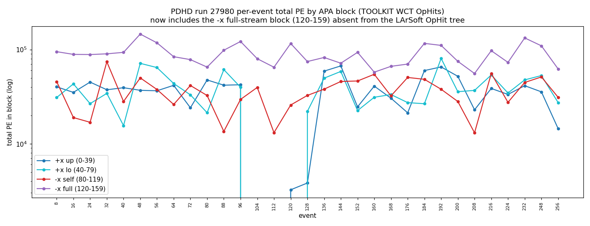
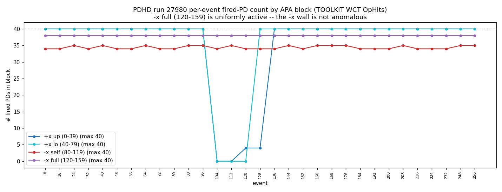
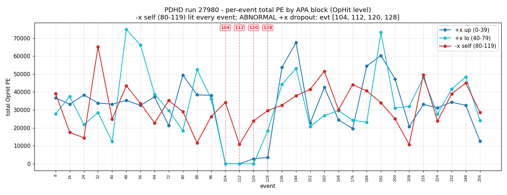
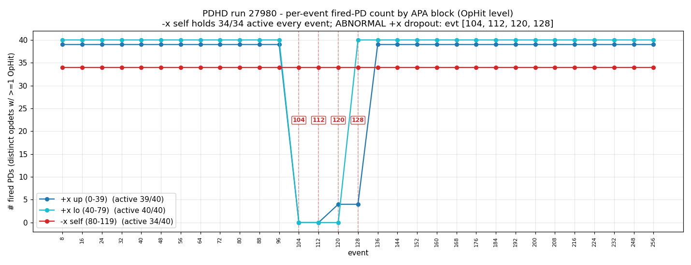
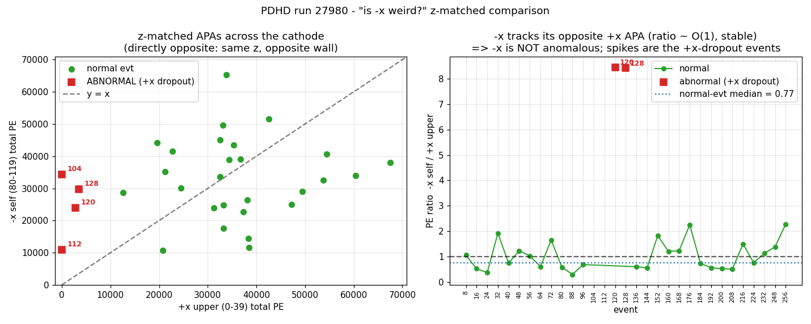
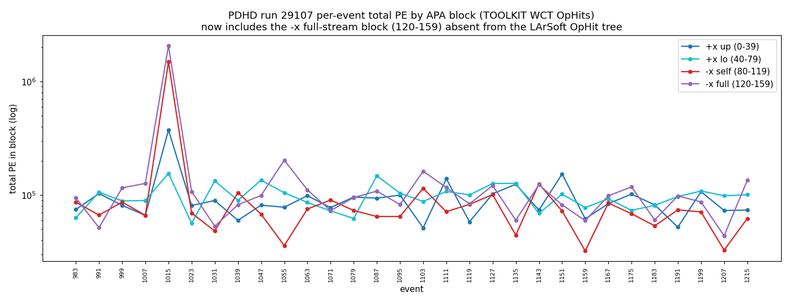
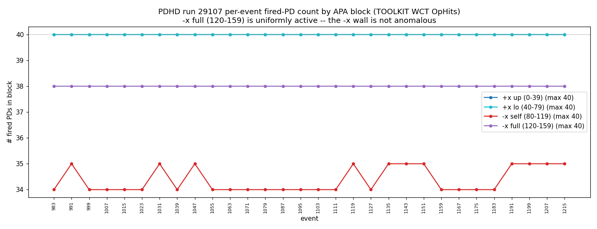
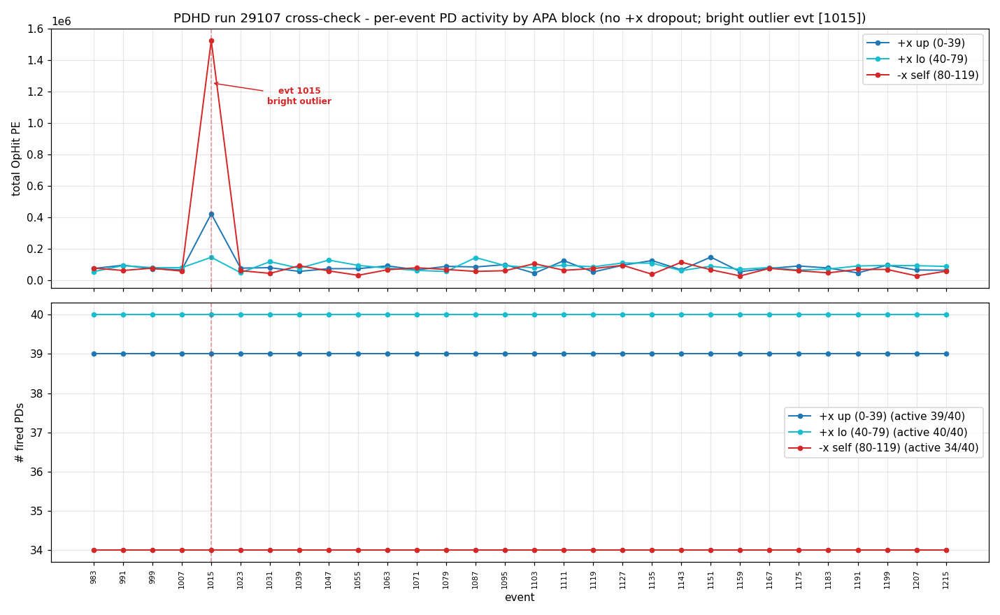
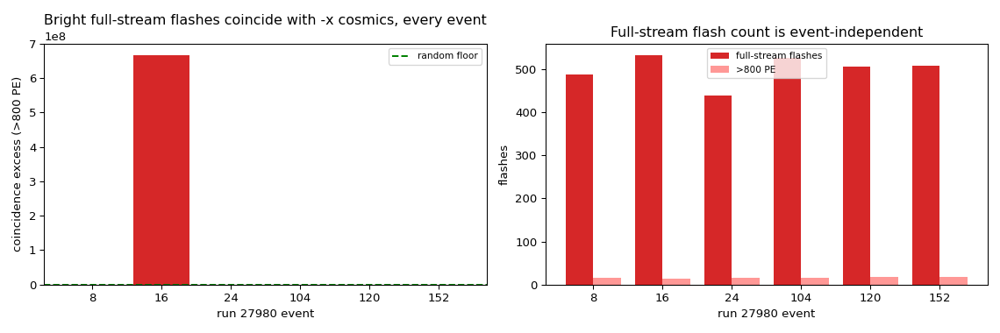

# PDHD per-event PD activity: +x vs −x walls, by APA — is the −x data weird?

A per-event comparison of photon-detector (PD) activity on the **+x** and **−x**
optical walls for run 27980 (with a 29107 cross-check). Cosmics dominate, so per-event
PD signals should be roughly event-independent; this study splits the +x PDs into their
two APAs and compares each against the single self-streamed −x APA, to decide **whether
the −x data is anomalous**.

**Short answer: no — the −x self-stream is the *most uniform* side of the detector.**
The "−x lit in only 11/31 events" seen in our toolkit processing
(`run27980-processing-status.md` §3) is a **`decoana` decoding-coverage artifact**, not
a property of the −x data. The genuine per-event anomaly is a **+x readout dropout** in
a contiguous block of four events.

> Companion docs: `run27980-processing-status.md` (toolkit charge+light status, the
> −x snippet coverage table), `pdhd-light-flash-run-comparison.md` (cross-run LArSoft
> flash stats), `pdhd-light-raw-data.md` §7 (−x readout modes). Plots live in
> `pdhd/pics/` (git-ignored); regenerate with `pdhd/pd_plot/pd_activity.py`.

---

## 1. Data source — OpHit level, not flash level

We use `opflashana/PerOpHitTree` — the LArSoft **OpHit**-level tree, one row per
reconstructed `(event, OpChannel, hit)` with a `PE` branch. This is the right
granularity for "total PE" and "number of fired PDs" because it is **independent of
flash-finding** (no time-clustering threshold sits between the PD and the measurement).
Per event we aggregate, for each APA block:

- **total PE** = Σ `PE` over the block's OpHits,
- **# fired PDs** = number of distinct `OpChannel` with ≥1 OpHit.

The +x-dropout cause (§5) is then read directly from the raw streams
`rawdump/raw_waveform` (per-`(event, opch)` ADC, with `nsamples`) and
`trigoff/trigger_offset` (per-event trigger metadata).

**Toolkit update.** §3 now *leads* with the same two quantities computed from our
own **WCT OpHits** (the all-PD opflash `ophits` tensor; `pd_plot/pd_activity_wct.py`),
which — unlike `PerOpHitTree` — include the −x **full-stream** block 120–159. The
LArSoft `PerOpHitTree` plots are kept below as the reference.

## 2. Geometry — four 40-PD APA blocks, and the z-matched pair

Verified via `flashopdet/opdet_geo` (x, z in mm):

| block | opdet | wall | x | z range | readout |
|---|---|---|---|---|---|
| +x upper | 0–39    | +x | +356 | 267.5–427.1 | self-trigger snippet (1024 ticks) |
| +x lower | 40–79   | +x | +356 | 35.5–195.0  | self-trigger snippet (1024 ticks) |
| **−x self** | **80–119** | −x | −356 | **267.5–427.1** | **self-trigger snippet (1024 ticks)** |
| −x full  | 120–159 | −x | −356 | 35.5–195.0  | full-stream (343 808 ticks; absent from `PerOpHitTree`) |

The **−x self block (80–119) is the single self-streamed −x APA** the user asks about.
Its **directly-opposite APA across the cathode** — same z, opposite wall — is **+x upper
(0–39)**. That pair is the fair, apples-to-apples "is −x weird" test (§4).

## 3. Per-event activity — −x self is uniform; +x drops out

Run 27980, 31 events. The **active-channel count is a static channel-map fact**, the
same every event: +x up **39/40**, +x lo **40/40**, −x self **34/40** — i.e. 6 of the
−x self PDs are consistently dead/disabled in the channel map. That static 34/40 is
*not* the per-event story below and is not itself a sign of −x weirdness; it just sets
the per-event ceiling for the −x self block.

**Toolkit (WCT-native) version — now including the −x full block (120–159).** The
plots below are from **our own** OpHits (the all-PD opflash `ophits` tensor, all 31
events; `pd_plot/pd_activity_wct.py`), so unlike the LArSoft `PerOpHitTree` they
also carry the −x **full-stream** block 120–159 that was previously invisible:




- The toolkit **reproduces the +x dropout** (events 104/112/120/128 fall to ~0 on
  +x up/lo) and shows **both −x blocks are uniformly active** every event: −x self
  (80–119) at 34–35/40 fired, −x full (120–159) at a flat **38/40** (2 vetoed
  data-quality PDs). The full −x wall behaves exactly like +x — no −x anomaly.
- −x full carries the **largest per-event PE** of any block (it integrates the
  continuous 5.5 ms stream), but its *fired-PD count* is flat, the same
  event-independence the cosmic-dominated premise predicts.

LArSoft `PerOpHitTree` reference (snippet PDs only, no −x full):




- **−x self (80–119) fires in every one of the 31 events**, 34/34 active PDs each event,
  total PE 10 k–65 k — squarely in the +x range.
- The **# fired-PD count is essentially flat** event-to-event on all three blocks (the
  29107 cross-check, §6, makes this dramatic: a perfectly constant 39/40/34 line over 30
  events). Total PE fluctuates with cosmic energy, as expected, but the *number of lit
  PDs* does not — exactly the event-independence the cosmic-dominated premise predicts.
- The **+x blocks drop to ~0** at events **104, 112, 120, 128** (the boxed events in the
  plots). These are the only anomalies.

## 4. The z-matched test — −x is not anomalous

−x self (80–119) vs its directly-opposite +x upper (0–39), per event:



Over the normal events the two directly-opposite APAs track each other with a
**−x/+x PE ratio median ≈ 1.04** and O(1) scatter — i.e. the same cosmics deposit
comparable light on both walls, as they must. The only departures are the labelled
**+x-dropout events (104/112/120/128)**, where the ratio spikes simply because the
**+x** denominator collapsed. **The −x numerator never collapses.** So the −x data is
not weird; if anything it is the steadiest stream in the detector.

## 5. The real anomaly — a +x readout dropout (cause)

Abnormal events in run 27980: **104, 112, 120, 128** — a *contiguous block* of four
events (the readout sequence steps by 8). Reading the **raw** streams pins the cause
(recorded channels per block, of 40):

| evt | +x up | +x lo | −x self | −x full | tc_type | offset_us |
|---|---|---|---|---|---|---|
| 96 (normal) | 40 | 40 | 40 | 40 | 29 | 249.808 |
| **104** | **0** | **0** | 40 | 40 | 29 | 249.808 |
| **112** | **0** | **0** | 40 | 40 | 29 | 249.808 |
| **120** | **4** | **0** | 40 | 40 | 29 | 249.808 |
| **128** | **4** | 40 | 40 | 40 | 29 | 249.808 |
| 136 (normal) | 40 | 40 | 40 | 40 | 29 | 249.808 |

What this establishes:

1. **Not a reco miss — the raw +x snippets are simply absent.** In 104/112 there are
   **zero** +x rows in `rawdump/raw_waveform`; there is no waveform to integrate. So the
   question "did the +x PDs see light but OpHit reco dropped it?" is moot — the +x data
   was never recorded.
2. **Not a trigger-condition change.** `tc_type` (29) and `offset_us` (249.808) are
   **identical** for the dropout and the normal events. The trigger fired the same way.
3. **It is a readout/DAQ dropout of the +x self-trigger snippet stream**, localized in
   **time** (the four-event block 104–128) and largely in **space** to the **+x upper
   APA (0–39)**: in evt 128 the +x lower APA (40–79) has already recovered (40/40) while
   +x upper is still down (4/40). A single APA's photon-readout link dropped for ~4
   events and recovered.
4. **The −x readout is unaffected throughout** — both the −x self snippet (≈40 recorded
   channels, 34 firing) and the −x full-stream (a steady 40 channels of 343 808-sample
   continuous readout) are present in *every* event, dropouts included.

### Why the toolkit then showed −x as sparse
Our toolkit light reco reads the `decoana` deconvolved-snippet container, which carries
−x snippets for only **11/31** events (`run27980-processing-status.md` §3). But the raw
stream and the LArSoft OpHit reco both carry the −x self-stream in **all 31** events.
The toolkit's apparent −x sparsity is therefore a **`decoana` production/coverage
artifact**, fully decoupled from the (healthy, uniform) −x detector data shown here.

## 6. Cross-check — run 29107

Run 29107 was **re-extracted with a full 160-channel `rawdump`** (the earlier file
had only a sparse `decoana` of ch 0–39), so it is now reconstructed end-to-end by the
**same all-PD chain as 27980** — including the −x **full-stream** block 120–159 that
the LArSoft `PerOpHitTree` lacks.

**Toolkit (WCT-native) — all four APA blocks, all 30 events:**




Every event lights all four blocks at a flat **+x up 40/40, +x lo 40/40, −x self
34–35/40, −x full 38/40** (2 vetoed data-quality PDs) — **no +x dropout** anywhere in
this run, and the fired-PD count is a constant line across all 30 events. This is the
cleanest demonstration that PD coverage is event-independent and that **both** −x APAs
(self 80–119 and full-stream 120–159) are as uniform as in 27980. The one abnormal
event is **evt 1015**, a **bright outlier**: in the toolkit OpHits its −x side carries
≈ 1.49 M (self) + 2.07 M (full) ≈ **3.6 M PE** against ≈ 0.53 M on the entire +x side
(up 0.37 M + lo 0.16 M) — strongly −x-dominated, but spread across the whole −x wall
(no single PD dominates), i.e. a **genuine spatially-extended high-light physics
event**, not single-channel saturation and not a detector fault.

**LArSoft `PerOpHitTree` reference** (snippet PDs only, no −x full 120–159):



30 events, same APA structure (+x up 39/40, +x lo 40/40, −x self 34/40). The LArSoft
view shows the same flat fired-PD line and the same evt-1015 outlier (there −x self
≈ 1.53 M vs the +x side ≈ 0.57 M, ~2.7×; the toolkit adds the −x full block on top of
that). It confirms the §3–5 picture is not specific to 27980: the +x dropout is a
27980-only DAQ event; the −x wall remains the well-behaved one.

**Charge–light Q/L cross-check (all 30 events).** Running the full all-PD charge+light
chain end-to-end (clustering + `QLMatching -calib -op` for the `ql_scan` viewer and a
combined Bee link) **corroborates evt 1015 as the single problematic event** from the
charge side too: it carries **454 reconstructed flashes** (vs ~100–160 for the other 29)
and a **1.33 M-PE** brightest flash (vs ~20–48 k), and is the only event whose clustering
blows up in time/memory (≈15 min / ≈12 GB vs ~1 min / ~1.3 GB) — see
[`pdhd-pipeline-resource-profile.md`](pdhd-pipeline-resource-profile.md). The uniform
~50 % flash-match rate and the ~50–75 unmatched bright flashes seen in **every** event are
*not* per-event anomalies — they reflect the still-placeholder absolute light
normalization (`QtoL`×`VUVEfficiency`, see
[`qlmatching-chain.md`](qlmatching-chain.md) §3), which under-predicts many real cosmic
flashes uniformly. No new problematic event emerges beyond evt 1015.

## 7. Abnormal-event summary

| run | abnormal events | type | cause |
|---|---|---|---|
| 27980 | **104, 112, 120, 128** | +x readout dropout | +x self-trigger snippet stream not recorded (DAQ), localized to the +x upper APA over a 4-event block; trigger metadata identical, −x unaffected |
| 29107 | **1015** | bright outlier | very high-PE, −x-dominated physics event; toolkit OpHits −x self 1.49 M + −x full 2.07 M ≈ 3.6 M vs +x 0.53 M; the light is spread across the whole −x wall (no single PD dominates), so spatially-extended real light, not single-channel saturation or a detector fault |

## 8. −x full-stream reconstruction (event dependence)

Sections 3–4 showed the −x **self-trigger** APA (80–119) is the most uniform side. The
other −x APA, the **full-stream** PDs (120–159, continuous 343 808-sample readout), was
previously unreconstructed; it is now reconstructed with the same WCT chain and a fixed
Wiener filter (see `pdhd-fullstream-light-reco.md` for the method and the single-event
validation). Running it over 6 events of run 27980 (including the +x-dropout events
104/120, where the −x side is rich) tests whether the full-stream −x APA reconstructs
**consistently event-to-event** — the same cosmic-driven event-independence expected of
the self-trigger side:



| evt | full-stream flashes | >800 PE | coincidence excess (>800 PE) |
|---|---|---|---|
| 8   | 1650 | 187 | ×6.7 |
| 16  | 1810 | 544 | ×3.0 |
| 24  | 1826 | 166 | ×13.3 |
| 104 | 1626 | 348 | ×2.9 |
| 120 | 1674 | 118 | ×20.6 |
| 152 | 1640 |  38 | ×33.3 |

The full-stream flash count is **event-independent** (1626–1826 across all six, including
the +x-dropout events) — the −x full-stream readout, like the −x self-stream, does not
fluctuate event-to-event. And in **every** event the bright full-stream flashes
(>800 PE) coincide with the bright self-trigger −x cosmics well above the time-shuffled
random rate (×2.9 to ×33.3), i.e. the full-stream −x APA reconstructs real cosmic light
consistently. This extends §3–5's conclusion: **both** −x APAs — the self-stream (80–119)
and the full-stream (120–159) — are well-behaved and uniform; the only 27980 anomaly
remains the +x readout dropout. (The dim full-stream flashes are not coincidence-validated;
see `pdhd-fullstream-light-reco.md` §4.)

## Reproduce

```
python pdhd/pd_plot/pd_activity_wct.py # TOOLKIT WCT OpHits (all-PD, incl -x full 120-159)
# -> pd_activity_wct_{27980,29107}_{total_pe,nfired}.png  (the §3 and §6 toolkit plots)

python pdhd/pd_plot/pd_activity.py     # LArSoft reference: 27980 + 29107 (cross-check)
# prints the per-event table + dropout diagnosis; writes pd_activity_*.png to pdhd/pics/

# -x full-stream reco + event-dependence (section 8):
cd pdhd
for e in 8 16 24 104 120 152; do ./run_light_fullstream_evt.sh 27980 $e; done
python pd_plot/fullstream_compare.py 27980 8 16 24 104 120 152
# writes pd_fullstream_27980_evt8_coincidence.png + _event_dependence.png to pics/
```

---

## Appendix — provenance

| item | source |
|---|---|
| per-event PE / fired-PD | `opflashana/PerOpHitTree` (EventID, OpChannel, PE) |
| APA geometry (x, z) | `flashopdet/opdet_geo` |
| +x-dropout (recorded channels, nsamples) | `rawdump/raw_waveform` (event, opch, nsamples) |
| trigger metadata | `trigoff/trigger_offset` (tc_type, offset_us) |
| run 27980 light ROOT | `…/data/hd/run027980/np04hd_raw_run027980_0000_…_final.root` |
| run 29107 light ROOT | `…/data/hd/run029107/np04hd_raw_run029107_0004_…_final.root` (re-extracted, full 160-ch `rawdump`; → `/nfs/data/1/jjo/data/PDHD/…`) |
| analysis + plots | `pdhd/pd_plot/pd_activity.py` (LArSoft) + `pd_activity_wct.py` (toolkit WCT, incl −x full 120–159) |
