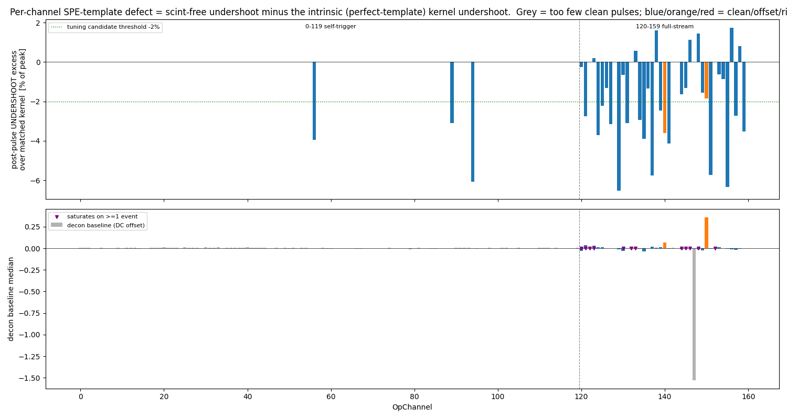
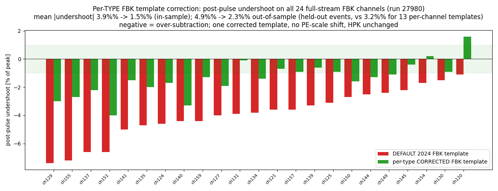

# PDHD per-channel SPE-template tuning (full-stream light deconvolution)

A per-channel study of the `Flash::OpDecon` single-photo-electron (SPE) templates on
the PDHD photon detectors, motivated by a question on the −x full-stream channels: some
deconvolved waveforms (e.g. **opch 145**) show a **non-zero tail / baseline distortion**.
Is that a genuine SPE-template/data **shape mismatch** (fixable by a better template), or
one of the physical effects a template cannot — and must not — remove? We answer it
channel by channel for all 160 OpChannels, and **tune the templates only where the defect
is real and template-fixable**.

> Companion: `pdhd-fullstream-light-reco.md` (the full-stream chain, §6 over-production
> diagnosis). Per-channel figures live in `pdhd/pics/pd/spe/` (git-ignored); regenerate
> with `pdhd/pd_plot/spe_template_tune.py`.

---

## TL;DR

- The deconvolved "tails" decompose into **four** sources; only one is template-fixable:
  1. **Real LAr scintillation** (~1.5 µs, **positive**) — on every bright cosmic, *not* on
     scint-free single-PE pulses. Removing it = the v1 over-subtraction mistake. **Keep.**
  2. **ADC saturation** on the brightest pulses (clips *both* rails) — information lost,
     not recoverable by any linear template. Detector-wide, brightness-driven. **Not template.**
  3. **Per-channel data quality** — DC-offset (opch 150 always; opch 121 sporadically) and
     ringing (opch 147). A hardware issue. **Not template** (these are excluded; the FBK
     template correction in §4 is a separate, additive effect on opch 121's tail).
  4. **A genuine template over-subtraction undershoot** — a **negative** post-pulse dip
     that *cannot* be scintillation. **Systematic on the FBK template** (median −3 % of peak,
     across all FBK channels); HPK is matched. **This is the tuning target.**
- **opch 145 specifically** is *not* a template defect: its small (scint-free) pulses match
  the template; its bright-cosmic tail is real scintillation; its largest real pulses do not
  clip (raw min ≈ 5360, far from the rail). The user-flagged opch 88 undershoot **is** real
  template mismatch, but it is a self-trigger HPK channel with too few dark counts to tune.
- The fix is a **single per-TYPE corrected FBK template**, *not* per-channel templates: an
  out-of-sample test (build on half the events, test on the held-out half) shows the
  per-type correction **generalizes better** than 13 per-channel templates (held-out
  undershoot **2.3 %** vs **3.2 %** per-channel vs **4.9 %** default) and **does not shift the
  PE scale** (per-channel templates moved it up to +14 %). Delivered as a **togglable**
  SPE-templates file (default OFF; HPK channels and every existing config bit-identical).

## 1. Method

**Deconvolution model (validated).** A faithful NumPy port of `flash/src/OpDecon.cxx`
(fixed Wiener filter `fixed_snr=0.005`, flat noise, 1.5 MHz Gauss post-filter, autoscale)
reproduces the on-disk **C++ full-stream decon to ~2×10⁻⁶** on all 40 channels — once two
things are right: (a) the per-channel **FBK/HPK** assignment (the full-stream PDs are a
**mix**: 24 FBK + 16 HPK — *not* all-HPK), read correctly from the JSON `channels`/
`template_index` lists; and (b) the pedestal taken from the first real samples (16 channels
— 124–127, 134–137, 144–147, 154–157 — carry a 32-sample leading-zero DAQ offset).

**Scint-free probe + a physical reference.** A deconvolved *cosmic* tail contains real slow
scintillation, so "flatten the tail to zero" would delete real light. Two safeguards:
- probe with **small, isolated, unsaturated pulses** (≈1 PE dark counts → no scintillation);
- compare not to zero but to the **matched-kernel tail** — the decon of a template *with
  itself*, i.e. the intrinsic tail (post-filter + Wiener ringing) a **perfect** template
  produces. The mismatch is `data − matched-kernel`, not `data − 0`.

The diagnostic metric is the **post-pulse undershoot** (most-negative excursion 0.25–1.5 µs
after the peak, baseline-subtracted) minus the matched-kernel undershoot. A negative value
is over-subtraction; it cannot be scintillation.

## 2. What the tails actually are (all 160 channels)



- **The matched-kernel undershoot is −0.8 % (FBK) / −0.7 % (HPK)** — the irreducible floor.
- **FBK** channels show a **systematic undershoot defect of −3.1 % (std 1.8)** beyond that
  floor: the 2024 FBK *average* template slightly over-subtracts every FBK channel's tail.
- **HPK** channels show **+0.6 % (std 1.5)** — essentially matched; no systematic defect.
- Self-trigger channels (0–119) mostly lack enough scint-free dark counts to measure
  (triggered snippets are scintillation-rich); the metric is reliable on the continuous
  full-stream PDs.

The per-channel figures `spe_ch<NNN>.png` (one per OpChannel) show, for each channel,
panel A = the scint-free small-pulse decon vs the matched kernel (the template match), and
panel B = the bright-cosmic decon (the real positive scintillation), plus the
class/baseline/RMS/saturation flags. Examples:

| channel | what it shows |
|---|---|
| `spe_ch145.png` | template **matches** (flat small-pulse tail); the §6-figure tail was scint |
| `spe_ch129.png` | clean **−6.5 % over-subtraction** (small pulse dips to −0.1 and stays negative) |
| `spe_ch147.png` | ringing data-quality channel (RMS ≈ 2.9) — not template-fixable |

### 2a. Raw-vs-decon example waveforms (all 160 channels)

A companion per-channel figure `pics/pd/wf_ch<NNN>.png` (one per OpChannel,
`pd_plot/spe_waveform_examples.py`) is a direct visual cross-check of the
deconvolution across the dynamic range: it picks **three representative pulses —
small, medium, large** (by decon peak height) and shows, for each, the **raw ADC**
next to the **decon** in a 3×2 grid (rows small/medium/large, columns raw / decon).
Each pulse is selected for a **flat pre-peak baseline** (no preceding-pulse tail or
ramp), **unsaturated** when an unsaturated example exists, and **maximal in-window
coverage**; saturating/ramp-shoulder "peaks" near giant cosmics are rejected.

The two readout modes are treated differently, matching how the data is taken:

- **self-trigger channels (0–119)** — pulses live in 1024-sample (**16 µs**)
  snippets, the *actual readout window*. Both axes are limited to that snippet and
  the decon is taken **from the toolkit directly** (`f["decon"]`, the software
  OpDecon over the snippet) — no python re-deconvolution.
- **full-stream channels (120–159)** — continuous readout. The decon is computed
  **locally**: only the isolated raw window around the pulse is deconvolved
  (flat-padded with the local pedestal, the validated `OpDecon` NumPy port), so it
  carries **no bias from other pulses** elsewhere in the frame and spans the full
  **−5 … +20 µs**. It reproduces the software full-frame decon to **<0.005 PE/tick**
  (baseline-subtracted).

These show the AC-coupled SiPM raw pulse (fast dip + slow recovery) collapsing to a
decon spike, and make the per-channel tail behaviour directly visible: the **FBK
over-subtraction undershoot** (e.g. `wf_ch137.png`, `wf_ch130.png` — decon dips
below zero ~3–5 µs after the large/medium spikes), the **real scintillation tail**
on bright cosmics (e.g. `wf_ch088.png`, `wf_ch118.png`), and **ADC saturation** on
the very brightest pulses (e.g. `wf_ch145.png` — no unsaturated >5 PE pulse exists,
so the raw clips the rail). The 6 dead channels (3, 86, 87, 97, 107, 116) have no
figure.

A hand scan of all 154 figures (`pdhd/wf_scan/`, results in `pics/pd/scan_results.json`)
flags **opch 40** as the one self-trigger channel whose decon shape could still benefit
from SPE-template tuning — noted here for the record; it is **low priority** (the decon
is usable as-is, no action taken). The scan also flagged the two bad full-stream channels
**opch 135 and 147**, now hard-vetoed in the full-stream chain (see
`pdhd-fullstream-light-reco.md` §7).

Regenerate with:

```
python pd_plot/spe_waveform_examples.py 27980 8 16 24 104 120 152
#  -> pics/pd/wf_ch<NNN>.png  (154 live channels)
```

## 3. opch 145 and the nonlinearity question

The tail seen on opch 145 in `pd_fullstream_27980_evt8_waveform_coinc.png` is **real
scintillation, not template mismatch or nonlinearity**:
- its **scint-free small pulses** match the template (flat tail);
- at matched amplitude its **bright cosmics** track the clean channels — same ~1.5 µs scint;
- its largest real pulses are **rounded, raw min ≈ 5360**, far from the ADC rail (no clip).

**ADC saturation does exist**, but only on the brightest cosmics, **detector-wide**: the
negative dip clips the low rail (0) and the AC-coupling overshoot clips the high rail
(16383). That is genuine readout nonlinearity, but it is brightness-driven (not a ch145
template defect) and **not recoverable by template tuning** — those pulses should be
flagged, not deconvolved. The tuning study therefore **excludes saturated pulses**.

The **negative undershoot** the user flagged on opch 88 / 135 / 145 in the same figure is
the real, separable template effect (a sub-zero excursion cannot be scintillation):
opch 88 −3.8 %, opch 118 +0.4 % (both HPK → per-channel, not just per-type), opch 135
−3.9 %, opch 145 −2.0 %. It is **amplitude-independent** (same fraction on small and bright
pulses → not the saturation nonlinearity) and scint-free, so it is the one defect a tuned
template can fix without touching real light.

## 4. Tuning — one corrected FBK template, not per-channel

**The correction.** The true SPE response is recovered from the measured decon shape. The
decon is linear with the channel-independent fixed filter `G`, so for true pulse `p`:
`s = G·p` (data decon with the average template `T0`) and `k = G·T0` (matched kernel), giving
**`DFT(p) = DFT(T0)·DFT(s)/DFT(k)`** (Tikhonov-regularized). Using `p` as the template
deconvolves the channel's pulses to their own matched kernel → flat tail, **no undershoot**;
and because `p` is built from **scint-free** small pulses, the real scintillation on bright
pulses is untouched. "Start from the 2024 template, tweak the tail to match the data," with
the v1 over-subtraction explicitly avoided.

**Per-channel was the wrong granularity — the data says so.** Building 13 per-channel
templates and re-measuring on the *same* pulses is near-circular (the template *is* the mean
response). The honest test is out-of-sample (`pd_plot/oos_validate.py`): build on events
{8, 24, 120}, measure the undershoot on the held-out {16, 104, 152}.

| held-out undershoot | DEFAULT | 13 per-channel | **1 per-type FBK** |
|---|---|---|---|
| mean \|undershoot\| | 4.9 % | 3.2 % | **2.3 %** |

The single **per-type FBK** correction generalizes *better* than the per-channel set (which
partly fit per-channel noise — in-sample 1.3 % but held-out only 3.2 %) and, unlike the
per-channel templates (which shifted the absolute decon peak by up to **+14 %**, i.e. flash
PE), it leaves the **PE scale unchanged (0 %)**. So we ship **one corrected FBK template**,
built from the high-statistics average of the FBK full-stream channels with a clear defect
(N ≈ 100/channel); HPK is already matched and is left untouched.



Applied to all 24 full-stream FBK channels, mean post-pulse undershoot **3.9 % → 1.5 %**
(in-sample) / **4.9 % → 2.3 %** (out-of-sample). Each FBK channel's `spe_ch<NNN>.png` overlays
the default (blue) and corrected (green) small-pulse decon against the matched kernel — the
well-matched FBK channels (e.g. ch120, ch154) move only slightly, the over-subtracting ones
(ch129, ch137, ch151, ch155) are pulled toward the kernel.

**End-to-end C++ validation** (evt 8, the actual chain with the corrected file):
- **HPK channels are byte-identical** (max|Δ| = 0) — only the FBK template changed;
- FBK undershoot drops in the real chain (e.g. ch137 −7.4 % → −3.8 %, ch151 −6.6 % → −2.5 %).

**Scope and honest limits.** The correction is one template (template index 0), so it applies
to **all FBK channels** — including the self-trigger FBK PDs (0–119), which couldn't be tuned
per-channel for lack of dark-count statistics but share the same FBK response defect. **HPK**
shows no systematic defect (held-out +0.6 %) and is unchanged, so the user-flagged opch 88
(HPK self-trigger) is *not* addressed here — its marginal undershoot (N ≈ 17) needs a
dedicated dark-count run to confirm and tune.

## 5. How to use it

The corrected templates live in `cfg/pgrapher/experiment/pdhd/pdhd-spe-templates-tuned.json`
— **same structure as the default** `pdhd-spe-templates.json` (2 templates, 160-channel map),
with only the **FBK template's values** replaced by the tail-corrected version (HPK and the
channel map untouched → all HPK channels bit-identical). Selected via a `spe_file` knob —
**default empty = the 2024 averages, bit-identical** (no code change; `OpDecon` already reads
`spe_file`):

```jsonnet
// flash.jsonnet: opdecon(..., spe_file='')         // '' -> default averages
// wct-light-fullstream-reco.jsonnet: -A spe_file=...
```

```bash
# default (unchanged):
./run_light_fullstream_evt.sh 27980 8
# with the tuned templates:
wcsonnet -A input_file=...fullstream_decoana.root -A output_dir=OUT -S run=27980 -S event=8 \
  -S offset_us=249.808 -A spe_file=pgrapher/experiment/pdhd/pdhd-spe-templates-tuned.json \
  -o cfg.json wct-light-fullstream-reco.jsonnet && wire-cell -c cfg.json
```

## Reproduce

```
cd pdhd
for e in 8 16 24 104 120 152; do ./run_light_fullstream_evt.sh 27980 $e; done
python pd_plot/spe_template_tune.py 27980 8 16 24 104 120 152
#  -> writes pics/pd/spe/spe_ch<NNN>.png (all 160) + spe_summary.png + spe_tuned_summary.png,
#     builds cfg/.../pdhd-spe-templates-tuned.json, prints the before/after table.
python pd_plot/oos_validate.py
#  -> the out-of-sample / per-channel-vs-per-type / PE-scale check (§4 table).
```

---

## Appendix — provenance

| item | source |
|---|---|
| decon model (validated 2e-6 vs C++) | `flash/src/OpDecon.cxx`; NumPy port in `pd_plot/spe_template_tune.py` |
| SPE templates (default / tuned) | `cfg/.../pdhd-spe-templates.json` / `pdhd-spe-templates-tuned.json` |
| togglable `spe_file` knob | `flash.jsonnet` `opdecon(spe_file=...)`, `wct-light-fullstream-reco.jsonnet` |
| per-event reco inputs | `work/<run>_fs<evt>/` + `work/<run>_snip<evt>/` (`run_light_fullstream_evt.sh`) |
| run 27980 events used | 8, 16, 24, 104, 120, 152 |
