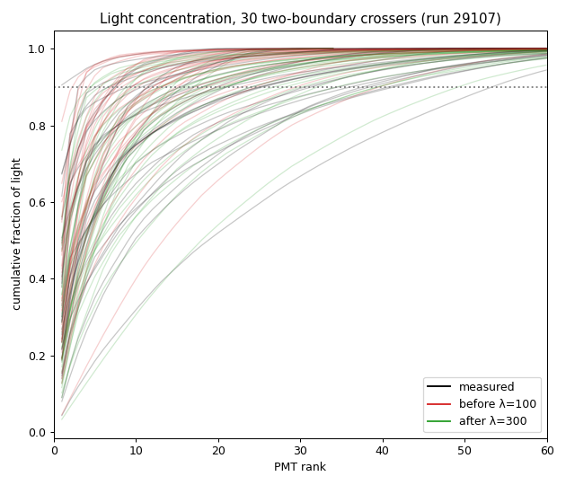
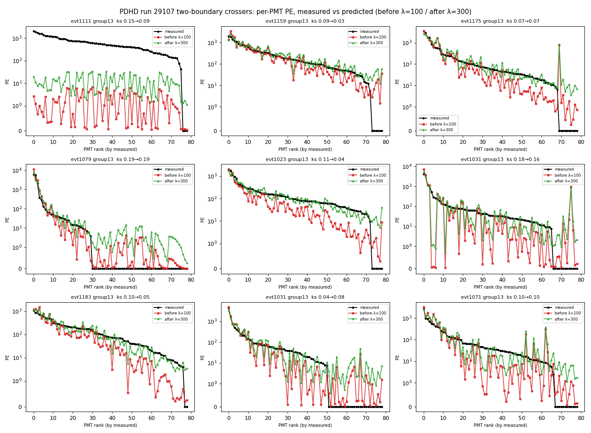
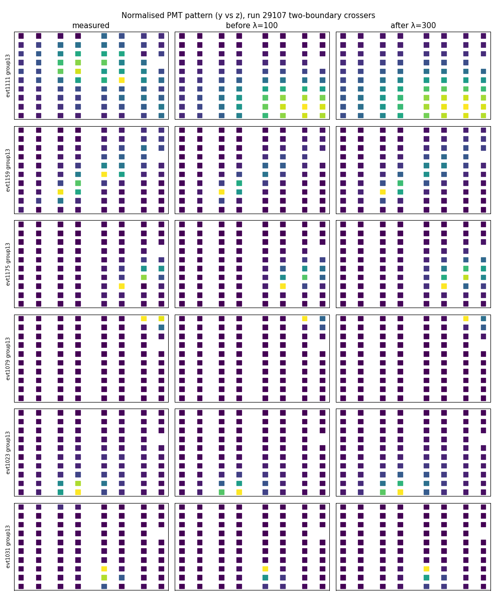

# PDHD Q/L light: predicted-vs-measured pattern & normalization study (run 29107)

**Run 29107, all 30 real events.** Goal: use well-constrained cosmic tracks that
cross **two** TPC boundaries (anode→cathode) to (1) confirm the predicted optical
pattern has the same **shape** as the measured flash, and (2) deduce the
**normalization** of the predicted light yield.

> **Supersedes the earlier run-27305 study.** That run yielded only 5–7 clean
> anchors and was not a clean data run, so its tuning (`vuv_absorption_length`
> λ = 100 cm, `vuv_eff` = 0.023) was biased — it **over-concentrated** the model.
> 29107 yields a properly statistical sample (37 clean two-boundary crossers) and
> moves the tuning to **λ = 300 cm, `vuv_eff` = 0.0145**. The 27305 result is
> retired; see "What changed from 27305" below.

**Headline:** on this good run the measured two-boundary crossers are
**more diffuse** than the 27305 anchors implied. At the old λ = 100 the model is
**too concentrated** — its light fills 90 % of the pattern in ~0.6× as many PMTs
as the data (`N90` ratio pred/meas = 0.61), with the matcher KS shape distance
median 0.099. Widening the effective absorption length to **λ ≈ 300 cm** matches
the data concentration (`N90` ratio → 0.95) and improves the matcher KS to 0.077
(−23 %); the direct-PMT normalization then calibrates with `vuv_eff` 0.023 → 0.0145.
Unlike 27305, **light-on-dark-PMTs is a non-issue here** (≤ 2 % at every λ),
because these extended crossers light most of the wall.

## Inputs & method

- Calib dumps from the clustering chain with `-calib`:
  `run_clus_evt.sh -calib 29107 <idx>` →
  `work/029107_<idx>/calib-evt<art>-group{02,13}.json`
  (group02 = APAs 0+2, drift −x; group13 = APAs 1+3, drift +x;
  art = 983 + 8·idx). Each bundle carries `pred_pe[160]` and `ks_dis`; the matched
  flash carries `pe[160]`.
- **Crosser selection — two-boundary primary.** Bundles flagged `two_boundary`
  (track crosses anode **and** cathode), `at_x_boundary`, `ndf ≥ 30`, brightest
  valid PMT > 300 PE, `measTot > 3000` PE, `ks_dis < 0.40`, **deduplicated per
  flash** (keep the lowest-`ks` bundle, so one bright flash's cluster fragments
  count once). This gives **37** clean two-boundary anchors (28 with `ks < 0.20`,
  the primary shape set). For context the broader `at_x_boundary` population is
  441 raw → 190 clean, but it is contaminated (direct-PMT scale tail to 5×), so
  the two-boundary set is used throughout.
- **Valid PMTs:** `active & ¬auto_masked & ch ∉ static_mask`
  (static = {3,86,87,97,107,116,117} ∪ {120…159}; see `qlmatching.jsonnet`).
- **Offline re-predictor, validated to machine precision.** λ enters the model
  only through `exp(−d/λ)` (`SemiAnalyticalModel.cxx`) and `vuv_eff`/`QtoL` are
  linear scales, so the whole per-PMT pattern is recomputable at any (λ, eff)
  from the dumped charge points + model JSON with **no chain re-run**
  (`ql_light_calib/repredict.py`). At λ = 100 it reproduces the dumped C++
  `pred_pe` to **2 × 10⁻¹²** per channel.
- **The shape objective is the matcher's own KS.** `ql_light_calib/fit.py` ports
  `TimingTPCBundle::calc_ks_test` exactly — an **index-order** cumulative CDF over
  **all 160 channels**, with the prediction zeroed on the static|auto masked
  channels (the C++ `opdet_mask`). This Python KS reproduces the dumped C++
  `ks_dis` to **machine precision** (max |Δ| = 0, 28/28 anchors) at λ = 100, so
  the λ sweep below is the matcher's metric, not a proxy. (A naive sorted-by-PE
  KS over only the valid subset — the obvious wrong port — correlates just 0.63
  with the real `ks_dis` and would have mis-located the optimum toward λ ≈ 250.)

## λ + normalization sweep (offline, two-boundary `ks < 0.20`, 28 anchors)

| λ (cm) | matcher KS | `N90` ratio (pred/meas) | dark % | integral scale | → `vuv_eff` |
|---:|---:|---:|---:|---:|---:|
| 150 | 0.089 | 0.74 | 1 | 0.73 | 0.0173 |
| 200 | 0.081 | 0.84 | 1 | 0.64 | 0.0157 |
| 250 | 0.077 | 0.90 | 1 | 0.59 | 0.0149 |
| **300** | **0.076** | **0.96** | 2 | 0.56 | **0.0145** |
| 350 | 0.076 | 1.00 | 2 | 0.53 | 0.0142 |
| 400 | 0.077 | 1.04 | 2 | 0.51 | 0.0139 |

- **λ = 300 cm**, chosen as the **centre of the flat KS valley** (250–400 all
  within 0.076–0.077). N90-match and KS-min agree here; 300 vs 350 is genuinely
  under-determined (KS identical, `N90` 0.96 vs 1.00) — quoted bracket **[250, 350]**.
- **`vuv_eff` = 0.0145**, from the median direct-PMT (top-3) scale **0.63** at
  λ = 300: `vuv_eff = 0.023 × 0.63 ≈ 0.0145`. The light yield enters linearly
  (`QtoL × vuv_eff`); this drives the direct-PMT scale to 1.0.

## Result — real-C++ confirmation

The configs were set to (λ = 300, `vuv_eff` = 0.0145) and the **18 events holding
the clean two-boundary anchors were reprocessed** end-to-end (`run_clus_evt.sh
-calib`). The real-C++ after-table reproduces the offline prediction to within
anchor-selection noise — and `direct-scale = 1.00` exactly confirms the `vuv_eff`
edit took effect (offline at the old eff was 0.63; 0.63 × 1.586 = 1.00), while
`KS 0.099 → 0.077` confirms the λ edit took effect.

| metric (median, two-boundary `ks<0.20`) | before λ=100, eff=0.023 | after λ=300, eff=0.0145 (offline) | after (real C++) |
|---|---:|---:|---:|
| matcher KS | 0.099 | 0.076 | **0.077** |
| `N90` ratio (pred/meas) | 0.61 | 0.96 | **0.95** |
| direct-PMT scale | 0.90 | 1.00 | **1.00** |
| integral scale | 0.96 | 0.88 | **0.91** |
| light on dark PMTs | 0 % | 2 % | **1 %** |



*Cumulative light vs PMT rank, 30 matched two-boundary crossers. Before (red,
λ=100) rises too steeply — over-concentrated; after (green, λ=300) tracks the
measured (black) diffuseness. The dotted line is the 90 % (`N90`) level.*



*Per-PMT PE (channels sorted by measured, symlog), measured / before λ=100 /
after λ=300, for the brightest crossers. After (green) widens onto the
secondary PMTs the data actually lit and lowers the over-bright peaks.*



*2-D PMT maps (y vs z), colour = normalized PE. Right column (after) spreads the
predicted light toward the measured pattern (left).*

## Label-driven retune (run 29107 evt 983 hand scan)

The auto-anchor study above sets the light yield from 37 *auto-selected* two-boundary
crossers. A later **hand-scan** of evt 983 (31 human-verified flash↔cluster matches,
`ql_scan/` viewer) re-derived the optical model directly from the labels, on the
**sizable (`total_PE>3000`) + low-ks (`ks_dis<0.2`)** subset (n=12). Script:
`ql_light_calib/fit_labels.py`. It tunes three things **self-consistently**:

| knob | before | after | basis |
|---|---:|---:|---|
| `measured_pe_scale` (ch120-159, "APA0") | 1.0 | **1.57** | g·median(pred_old/meas\|APA0)=0.865·1.814 — the −x full-stream half under-reports PE; scale the **measurement** up |
| `vuv_eff` (global) | 0.0145 | **0.01254** | +x side-1 anchor over-predicts by ~16% (meas/pred g=0.865); 0.0145·g |
| `pe_err_frac` (global) | 0.3 | **0.44** | moment fit `E[(pred−meas)²]=meas+a·pred²` on the corrected model, calibrated channels only |

The blocks (verified from the dump `opdets`): ch120-159 = −x full-data-stream half
("APA0", z<250, the maskable block); ch80-119 = −x APA2; ch0-79 = +x (side 1, the
calibrated anchor). The APA0 measured scale is a NEW per-channel C++ knob
(`measured_pe_scale`, default empty = byte-identical), applied in `Opflash::init` before
`PE_err` synthesis so it flows consistently to the χ² fit, the calib dump, and the
persisted Bee opflash PC.

**Caveats.** (1) One event, n=12 — *seeds*, not a population calibration; the run-wide
auto-anchor `vuv_eff` (0.0145) is the cross-check, and the label value (0.01254, ~13%
lower) is higher-purity but lower-statistics. (2) **APA2 shows the same ~1.7 elevation
as APA0** but, per the APA0-only scope, gets no measured scale → ~1.4× over-predicted
residual under the common model. (3) The 2.3 factor on the *brightest* APA0 flashes is
high-ks **saturation** (excluded by the low-ks cut) — a per-channel `pmt_nonlinearity`
round is the proper fix, deferred. Reproduce: `cd pdhd/ql_light_calib && python3
fit_labels.py`; then reprocess `run_clus_evt.sh -calib 029107 0`.

## 4-event hand-scan label retune (run 29107 evts 983/991/999/1007)

The single-event evt-983 retune above is **superseded** by a 4-event flag-clean label
fit (`ql_light_calib/fit_labels_multi.py`). Hand scans of evts 983/991/999/1007 give
125 matches; dropping the **missing-charge** flags the user flagged
(`close_to_PMT`/`at_x_boundary`/`window_truncated` = flag_PMT/flag_xboundary/flag_wtrunc
— incomplete charge ⇒ unreliable predicted light) and the sizable (`total_PE>3000`) +
low-ks (`ks_dis<0.2`) cut leaves **25 anchors** (+x/apa1 = 10 norm anchors, −x/apa0 = 15
APA0 anchors — far better powered than the single-event n≈12).

| knob | evt-983 | 4-event | basis |
|---|---:|---:|---|
| `vuv_absorption_length` λ | 300 | **300** (kept) | KS is degenerate on the non-crosser anchors (no valley; rides to the grid edge); N90 concentration (1.00@250, 1.02@300) + +x integral (1.022) pin ~300 |
| `vuv_eff` | 0.01254 | **0.01281** | +x/apa1 **integral** meas/pred g=1.022 at λ=300, 0.01254×1.022 |
| `measured_pe_scale` APA0 | 1.57 | **1.14** | −x/apa0 ch120-159 self-consistency 1.57×g×median(pred/meas)=1.57×1.022×0.713 (dump-direct cross-check 0.677 ⇒ ~1.09); the evt-983-only 1.57 over-scaled on the smaller sample |
| `pe_err_frac` | 0.44 | **0.43** | method-of-moments on the corrected-model residuals |

**λ is degenerate, not 500.** A naive KS-min refit on the flag-clean (crosser-excluded)
anchors rides to the grid ceiling (medKS 0.076@350 → 0.072@2000) because a too-diffuse
model games the index-order CDF; the **physical** criteria turn over at ~300 — N90
concentration ratio 1.00@250 / 1.02@300 / 1.07@500 / 1.14@2000, and the +x integral goes
from 1.0@300 to over-predicting 20–50% above. λ kept at 300 (`fit_lambda_diag.py`).

**Direct vs integral norm handle.** At λ=300 the +x top-3 direct-PMT scale (1.296) and
the integral scale (1.022) differ by a fixed ~1.27 — a Gaisser–Hillas shape residual,
**constant in λ**, not a spread error. With the spread N90-matched the integral is the
clean handle (and is what the evt-983 fit used); `vuv_eff` is set from it. The direct
handle would be +30% and then over-predict the integral everywhere else.

**Real-C++ closure** (reprocess the 4 events; flag-clean anchors; labels re-keyed by
flash *time* since gids reindex): +x integral meas/pred 1.022→**1.000**, −x APA0
pred/meas 0.677→**0.952** (the ~0.95 residual = the repredict-vs-C++ 5% gap on the dim
APA0 channels; the exact-closure scale is ~1.09). Hand-scan GT: accepted matches
**57→57** (net preserved), human-rejected re-selections **337→243** (−28%), **0** new
false positives.

**Side effect — 6 dim −x flashes drop.** `measured_pe_scale` is a *measured*-PE gain
(not the light model — `vuv_eff`/λ never touch flashes); scaling −x APA0 PE by 1.14/1.57
pushes six dim side-0 flashes (~51–58 PE, APA0-dominated) below the `flash_minPE=50`
floor (`QLMatching.cxx:739`), so they are culled (none were hand-scan matches). Flash
gids are positional, so this renumbers the dump (286→274) — re-key saved hand scans with
`ql_scan/remap_scan_after_reprocess.py` (scan_state) + `ql_scan/regen_labels.py` (labels
export). Reproduce: `cd pdhd/ql_light_calib && python3 fit_labels_multi.py`; reprocess
`run_clus_evt.sh -calib 29107 {0,1,2,3}`.

## Per-channel (per-PD) gain calibration + chi2 recalibration (run 29107 hand scan)

The retunes above correct the optical model **globally** (`vuv_eff`, λ) and at the
**block** level (`measured_pe_scale` APA0). But the SP chain deconvolves all 160 PDs
with only **two** SPE templates — FBK (68 ch) / HPK (92 ch), one shape per *type* —
so residual per-channel SiPM gain is not removed and biases the bundle chi2/KS. This
absorbs it into the (already per-channel, already plumbed) `measured_pe_scale` knob.
Fit: `ql_light_calib/fit_perchannel_scale.py` on the **54** cleanest matches (low-ks,
no flag_PMT/flag_wtrunc; `at_x_boundary` kept this time). Dumps carry `pred_pe` at the
current model, so the per-channel ratio is read straight from `op_pes`/`pred_pes` — no
re-prediction. Granularity (user-confirmed): grouped **block × type** base + individual
breakout only for the few well-sampled, tight-scatter outliers — the prior per-channel
SPE-*shape* study overfit (`pdhd-spe-template-tuning.md`: shifted PE scale +14% out-of-
sample); a per-*type* correction generalised.

**The dominant effect is per-TYPE.** FBK reads ~12–21% low in every block — the same
sign as the documented FBK tail over-subtraction (over-subtracted tail ⇒ less integrated
PE ⇒ reads low ⇒ scaled up). The old uniform APA0 (ch120-159) **1.14 splits into FBK
1.20 / HPK 1.00** — the block average conflated an FBK-only defect with HPK that needs no
boost.

| `measured_pe_scale` group (block × type) | scale | note |
|---|---:|---|
| +x (ch0-79) FBK / HPK | **1.12 / 0.98** | meas-weighted-mean renormalised (k=1.128) so the +x integral — hence `vuv_eff` — is **held fixed** |
| APA2 (ch80-119) FBK / HPK | **0.98 / 0.96** | ≈1.0 (within scatter) |
| APA0 (ch120-159) FBK / HPK | **1.20 / 1.00** | splits the old uniform 1.14 |

Plus **12 individual overrides** (N≥12, MAD<0.25, >3 SE and >0.20 off group): mostly
high-gain HPK PDs reading ~1.5–2× high → scaled **down** to 0.53–0.73 (ch25/88/98/118
the tightest, MAD≈0.1); ch23 a low-gain HPK scaled **up** 1.47. The raw fit wanted
3–5× on **ch40/50/60/70**, but those are statistical artifacts (N≤5, MAD up to 12) →
**left at group default, not scaled** (a large gain just amplifies noise into chi2).

**Two findings, decomposed (don't conflate them):**

1. **Per-PD gain** is marginal for the *bundle* chi2 (median chi2/ndf 1.59→1.56 at fixed
   `pe_err_frac`) — the per-channel scatter swamps it at the bundle level — but real for
   *per-channel* closure: outlier channels meas/pred **0.566→0.878**, APA0 HPK
   **0.729→0.831**; +x integral held (0.888→0.889). So it is a per-PD **closure fix**,
   GT-safe, not itself a chi2 fix.
2. **`pe_err_frac` 0.43 → 0.60** is where the chi2 win lives, and it is *independent* of
   the gain work (the old dumps already sat at chi2/ndf 1.59 with frac 0.43 — the per-PMT
   error was too **tight**). frac is **calibrated**, not minimised: 0.60 brings the median
   bundle chi2/ndf on good matches to **~1.0** (54/54 anchors lower), making chi2/ndf a
   well-scaled goodness-of-fit. The high-PE method-of-moments gives ~0.40 but only sees
   the bright tail; the full bundle statistic, dominated by mid-PE channels + the low-PE
   inflation, needs the larger frac. floor/knee + the low-PE inflation are unchanged.

**`pe_err_frac` is a MATCHING knob** (chi2 drives `auto_selected`), so 0.60 was set by
**reprocessing** at the candidate value, not offline. Real-C++ validation (per-channel
gain + frac 0.60 vs production, `validate_perchannel.py`): median chi2/ndf **1.59→1.06**,
KS flat (0.061→0.060); GT accepted matches **57→57** (net preserved), human-rejected
re-selections **328→259** (−21%, purity *improved* — the looser error did **not**
re-inflate it; the gain correction, not frac, drives purity), **0** new false positives.
A small 6-lost/6-gained reshuffle among accepted matches is the gain change re-solving a
few flashes (identical at frac 0.40; the lost flashes are won by neutral/other-accepted
candidates or drop below `flash_minPE` — no silent mismatch). Hand-scan labels re-keyed
to the new dumps by (apa, ident, flash-time within 0.5 µs): all **125** picks preserved
(the per-channel PE change shifts a couple of flash times sub-µs). Reproduce: `cd
pdhd/ql_light_calib && python3 fit_perchannel_scale.py`; reprocess `run_clus_evt.sh
-calib 29107 {0,1,2,3}`; validate `python3 validate_perchannel.py`.

## What changed from 27305, and why a 3× λ shift is expected

The move λ 100 → 300 and `vuv_eff` 0.023 → 0.0145 is large but coherent. λ here is
an **effective spread parameter**, not the physical 128 nm LAr absorption length
(~85 cm) — by convention the geometric fall-off is folded into the Gaisser–Hillas
fit, and λ absorbs residual model error. Four reasons the better run lands far
from the old one:

1. **Sample richness + selection.** 27305 had 5–7 anchors, mostly *concentrated*
   short clusters; 29107 has 37 genuine **two-boundary anode-cathode crossers** —
   extended, full-drift line sources whose measured patterns are intrinsically
   diffuse (`N90` up to 54). An effective λ tuned on extended sources is naturally
   larger than one tuned on concentrated ones.
2. **Flash reconstruction changed between the two studies** (ADC-saturation veto,
   per-PD `min_fired_pe`, `min_fired_pds`/`min_total_pe` quality cuts), which
   alters the measured per-PMT PE pattern and can shift λ on its own.
3. **The dark-PMT failure mode that justified 27305's λ=100 does not exist here.**
   On 27305's concentrated anchors a diffuse model spilled ~47 % of light onto
   measured-zero PMTs; on 29107's extended crossers dark-fraction is ≤ 2 % at
   *every* λ, so it cannot pull λ down.
4. **The optimum is not an artefact of selecting on the old λ.** Anchors were cut
   on the λ=100 `ks_dis`; nonetheless the optimum lands at 300, and the looser
   `at_x` set prefers an even *larger* λ (KS-min ~500). If anything the selection
   biases the result *conservatively* toward smaller λ.

## Caveats / next steps

- **Spread fixed for the population, residual on long multi-track blobs.** The
  per-anchor N90-match λ is bimodal: most anchors want 150–500 cm but ~¼ (the
  longest multi-track blobs) never concentrate enough and pin at the 2000 ceiling.
  A single global λ cannot capture this; the next-order correction is the angular
  **Gaisser–Hillas** terms (or a voxel photon library).
- **Integral residual, reported not re-optimised.** After the direct-PMT
  normalization the integrated prediction is ~1.1× the measured (integral scale
  ~0.9). Top-3 direct-PMT is the right normalization handle (the integral is not
  clean until the spread is perfect); the residual is recorded, not fitted away.
- **Scope: matching effect not yet validated on the full population.** `vuv_eff`
  0.023 → 0.0145 is a ~37 % normalization change affecting *every* PDHD event's
  matching, but only the 18 anchor events were reprocessed (the prediction math is
  confirmed; the full-population matching outcome — assignments, purity — is
  **unverified pending a full 30-event reprocess**).
- **More clean crossers** (other good runs, both drift sides) would tighten λ and
  let it be checked per side.

## Reproduce

```bash
# 1. offline lambda+eff sweep on the existing calib dumps (no chain re-run):
cd pdhd/ql_light_calib && python3 fit.py          # -> sweep_rows_29107.json + the table above
# 2. set the tuning: wire-cell-data .../semi-analytical-pdhd.json vuv_absorption_length=300,
#    cfg/.../pdhd/qlmatching.jsonnet vuv_eff=0.0145
# 3. reprocess the anchor events and read the real-C++ after-table:
./run_clus_evt.sh -calib 29107 <idx>              # for each anchor event idx
python3 after_metrics.py                          # real-C++ medians from the dumps
# 4. before/after figures (BEFORE = backed-up lambda=100 dumps, AFTER = reprocessed):
python3 plot_norm.py                              # -> ../pics/ql_norm_*.png
```

Per-bundle fields used: `two_boundary`, `at_x_boundary`, `main_cluster`,
`flash_gid`, `ks_dis`, `ndf`, `pred_pe[160]`; flash `pe[160]`; opdet
`{x,y,z,active,auto_masked}`. Scripts: `ql_light_calib/` (`repredict.py`
validated re-predictor, `fit.py` matcher-KS λ sweep, `after_metrics.py`
real-C++ metrics, `plot_norm.py` before/after figures). See
`qlmatching-chain.md` for the matching chain and tunables.
