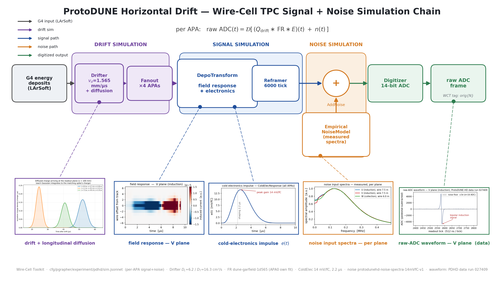

# PD-HD Wire-Cell simulation-chain presentation diagram

A wide (16:9) diagram of the ProtoDUNE-HD Wire-Cell TPC **signal + noise
simulation** chain, with embedded physics inset panels, for presentation use.
Counterpart of the PD-VD original
([pdvd/docs/16_pdvd-sim-chain.md](../../pdvd/docs/16_pdvd-sim-chain.md)) —
same layout, ProtoDUNE-HD configuration facts.  See also
[nf-chain-diagram.md](nf-chain-diagram.md) / [sp-chain-diagram.md](sp-chain-diagram.md)
for the reconstruction counterparts.



Deliverable: `pdhd/pics/pdhd_sim_chain.png` (3840×2160) and `.pdf`.

## Repro block

All commands run in the toolkit-dev direnv python env (matplotlib, numpy, PIL;
`WIRECELL_PATH` set) from `pdhd/pics/`:

```bash
# 1. physics insets that are generated here
python3 make_fr2d_snippet.py   # 2D time-domain field response, V plane (reads dune-garfield-1d565)
python3 make_sim_insets.py     # ColdElec impulse e(t) + noise input spectra (reads the cfg inputs)
python3 make_adc_snippet.py    # V-plane raw-ADC data waveform (reads run027409 APA1 orig frame)

# 2. the drift+diffusion inset is detector-agnostic and copied from the PD-VD
#    original (owner-supplied drifter.pdf p.2):
#      pdvd/pics/sim_chain_src/drifter_arrival.png -> sim_chain_src/drifter_arrival.png

# 3. assemble the master diagram
python3 make_sim_chain_diagram.py   # -> pdhd_sim_chain.png / .pdf
```

`sim_chain_src/` holds the five inset sources (committed) so the master build is
self-contained.

## The simulation chain (what the boxes are)

Traced from `cfg/pgrapher/experiment/pdhd/sim.jsonnet` (`splusn_pipelines`),
`params.jsonnet` / `simparams.jsonnet`, and the runner jobs
`pdhd_sim/wct-sim-check-track.jsonnet` / `wct-sim-noise-only.jsonnet`.  Shared
head, then a per-APA signal+noise pipeline (×4 APAs):

| stage | node type | role / key params |
|---|---|---|
| input | depo source | G4 ionization deposits (LArSoft stage-A) — the only **external** input |
| **drift sim** | `Drifter` | drift + diffusion: v_d = 1.565 mm/µs (track-job operating point; base pdhd default 1.576), lifetime 50 ms, D_L = 6.2 / D_T = 16.3 cm²/s |
| **drift sim** | `DepoBagger` → `DepoSetFanout` | bag + fan drifted depos to the 4 APAs |
| **signal sim** | `DepoTransform` | depo ∗ **field response** (`dune-garfield-1d565.json.bz2` for APA1–3; APA0 uses its own `np04hd-garfield-6paths-mcmc-bestfit` fit; response plane 10 cm) ∗ **electronics** (single `ColdElecResponse` for all APAs: 14 mV/fC, 2.2 µs shaping, postgain 1.0), applied via `PlaneImpactResponse` |
| reframe | `Reframer` | trim to the 6000-tick readout window (sim tick = 500 ns) |
| **noise sim** | `EmpiricalNoiseModel` + `AddNoise` | electronics noise drawn from the measured spectra (`protodunehd-noise-spectra-14mVfC-v1.json.bz2`, gain-selected); 2% replacement |
| digitize | `Digitizer` | 14-bit ADC, baselines [1003.4, 1003.4, 507.7] mV (U,V,W), fullscale [0.2, 1.6] V → raw ADC frame (WCT tag `orig<n>`) |

Signal and noise merge at `AddNoise` just before the digitizer:

> raw ADC(t) = 𝒟[ (Q_drift ∗ FR ∗ E)(t) + n(t) ]

The diagram groups the stages into three colored bands — **drift simulation**
(purple: `Drifter` + `Fanout`), **signal simulation** (blue: `DepoTransform` +
`Reframer`) and **noise simulation** (orange: `EmpiricalNoiseModel` +
`AddNoise`) — to make explicit that drift, like signal and noise, is a
Wire-Cell simulation stage.  Only the G4 energy deposits (grey) are external
LArSoft input; everything downstream is Wire-Cell.

Differences from the PD-VD counterpart worth remembering when presenting the
pair: PD-HD fans to **4 APAs** (PD-VD: 8 CRPs), uses a **single**
cold-electronics model for every anode (PD-VD splits bottom analytic / top
JSON ×1.36), one gain-selected noise file for all APAs (PD-VD:
per-side bottom/top spectra files), and runs the simulation natively at 500 ns
per tick so no resampling enters the sim path (the 512→500 ns `Resampler` is a
data-only NF front end).  There is no coherent-noise (`GroupNoiseModel`) stage
in either detector's production sim chain — noise is incoherent
`EmpiricalNoiseModel` only.

## Physics insets (V plane illustrates throughout)

| inset | source | notes |
|---|---|---|
| drift + longitudinal diffusion | `drifter.pdf` p.2 → `sim_chain_src/drifter_arrival.png` (copied from the PD-VD original — detector-agnostic schematic) | point deposits drift to the readout plane and arrive as Gaussians whose width σ grows with drift time (D_L) — the physics the `Drifter` node applies |
| field response — V plane, 2D time domain | `make_fr2d_snippet.py` (reads `dune-garfield-1d565.json.bz2`) | induced current vs (wire offset, time): the classic bipolar induction signature |
| cold-electronics impulse e(t) | `make_sim_insets.py:make_elec_response` | the `ColdElecResponse` impulse (14 mV/fC peak gain, 2.2 µs shaping) shared by all 4 APAs |
| noise input spectra — per plane | `make_sim_insets.py:make_noise_spectra` (reads `protodunehd-noise-spectra-14mVfC-v1.json.bz2`) | the measured amplitude spectra that seed `AddNoise`, one normalized curve per plane (U/V/W, longest wire bin) |
| raw-ADC waveform — V plane (data) | `make_adc_snippet.py` (run 027409 evt 0 APA1 orig frame) | a real ProtoDUNE-HD data induction channel (ch 3390), clean bipolar pulse (+4870/−4759 ADC) over the σ≈16 ADC noise floor |

The raw-ADC waveform is real **data** (run 027409, the same run as every other
PD-HD diagram inset), used illustratively for the digitizer output; it is a
V-plane induction channel to match the field-response panel.  Note the data
readout tick is 512 ns while the simulation runs at 500 ns.

## Verification

- Chosen data channel (V plane, ch 3390, APA1) shows a clean bipolar induction
  pulse (+4870/−4759 ADC @ tick 2575) well above the σ≈16 ADC noise floor.
- `make_sim_chain_diagram.py` runs clean → 3840×2160 PNG + PDF; all five insets
  legible, leader lines correct, drift (purple) / signal (blue) / noise (orange)
  / output (green) color coding consistent, the DRIFT/SIGNAL/NOISE grouping
  boxes wrap the right nodes, legend clear of the input box, footer inside the
  canvas, 16:9, no overflow.
- Config facts cross-checked against `cfg/pgrapher/experiment/pdhd/params.jsonnet`
  (FR files, ColdElec, noise file, ADC), `simparams.jsonnet` (tick 500 ns,
  nticks 6000, both faces active), and `pdhd_sim/wct-sim-check-track.jsonnet`
  (drift velocity 1.565 mm/µs, lifetime 50 ms, D_L/D_T operating point).
- No toolkit C++/cfg touched — this is a docs/figure deliverable only; nothing
  in the simulation or reconstruction path changes, so no build or A/B gate is
  required.
