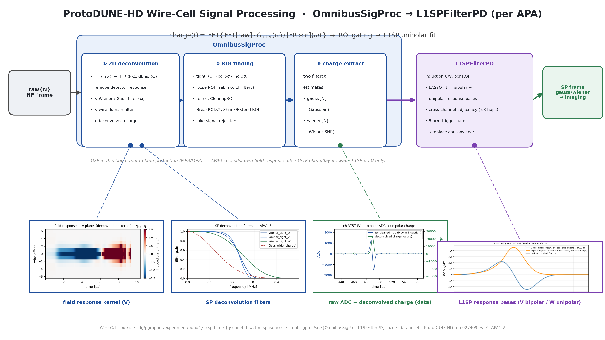

# PD-HD Signal-Processing algorithm diagram

A wide (16:9) presentation diagram of the ProtoDUNE-HD Wire-Cell **signal
processing** stage — the live `OmnibusSigProc` → `L1SPFilterPD` cascade — with
four physics insets.  Companion to the reference doc [sp.md](sp.md) (this is the
picture; `sp.md` is the full knob-level text).  See also
[nf-chain-diagram.md](nf-chain-diagram.md) for the noise-filtering counterpart
and [nf_sp_workflow.md](nf_sp_workflow.md) for the end-to-end run.



Deliverable: `pdhd/pics/pdhd_sp_chain.png` (3840×2160) and `.pdf`.

## Repro block

Run in the toolkit-dev direnv python env (matplotlib, numpy, PIL; `WIRECELL_PATH`
set) from `pdhd/pics/`:

```bash
python3 make_nfsp_insets.py        # generates all NF+SP data insets into nfsp_src/
python3 make_sp_chain_diagram.py   # -> pdhd_sp_chain.png / .pdf
```

The L1SP inset is a crop of `pdhd/nf_plot/track_response_l1sp_pdhd_V.png` saved
into `nfsp_src/l1sp_kernel.png`.  `nfsp_src/` holds every committed inset PNG so
the master build is self-contained.

## The cascade (what the boxes are)

Traced from `cfg/pgrapher/experiment/pdhd/sp.jsonnet`, `sp-filters.jsonnet` and
`wct-nf-sp.jsonnet`.  `OmnibusSigProc` is one C++ node that internally runs the
deconvolution → ROI-finding → charge-extraction sequence; `L1SPFilterPD` is a
separate downstream node.

| stage | node / sub-step | what it does |
|---|---|---|
| ① 2D deconvolution | `OmnibusSigProc` | `FFT(raw) ÷ [FR ⊛ ColdElec](ω)` to remove the detector response, × the SP frequency filter (Wiener per plane, or Gaussian for the charge tag), × a wire-domain filter, then IFFT → deconvolved charge. |
| ② ROI finding | `OmnibusSigProc` | tight ROI (collection 5σ / induction 3σ), loose ROI (rebin 6 with LF filters), then a refinement cascade — CleanupROI, BreakROI ×2, ShrinkROI, ExtendROI — plus fake-signal rejection. |
| ③ charge extraction | `OmnibusSigProc` | two filtered charge estimates: `gauss{N}` (Gaussian filter, primary for imaging) and `wiener{N}` (Wiener SNR-weighted). |
| L1SP | `L1SPFilterPD` | induction U/V, per ROI: LASSO fit against pre-built bipolar + unipolar response bases, cross-channel adjacency expansion (≤3 hops), a 5-arm trigger gate; the fit replaces both `gauss{N}` and `wiener{N}` on processed planes. |
| out | `gauss{N}`, `wiener{N}` | deconvolved-charge frame (float + masks) → imaging. |

### OFF / per-APA specials (noted, not drawn as active)

- **Multi-plane protection (MP3/MP2)** is available in `OmnibusSigProc` but
  `use_multi_plane_protection=false` in this build.
- **APA0** uses its own field-response file (`np04hd-garfield` fit vs the
  `dune-garfield-1d565` template for APA1–3), swaps U↔V via `plane2layer=[0,2,1]`,
  and restricts L1SP to the U plane only (V is anomalous).  See [sp.md](sp.md).

## Physics insets

| inset | source | shows |
|---|---|---|
| field-response kernel (V) | `make_nfsp_insets.py:make_decon_kernel_2d` (`dune-garfield-1d565.json.bz2`) | the 2D time-domain field response SP deconvolves against — the induction kernel inverted in ①. |
| SP deconvolution filters | `make_nfsp_insets.py:make_sp_filters` (analytic, `sp-filters.jsonnet` values) | the frequency filters actually applied: `Wiener_tight_{U,V,W}` and `Gaus_wide`. `HfFilter = exp(-½(f/σ)^power)`. |
| raw ADC → deconvolved charge (data) | `make_nfsp_insets.py:make_sp_waveform` (NF-raw vs SP-gauss frames) | one V-plane channel (ch 3757): the bipolar induction ADC and the unipolar deconvolved charge SP recovers — real data, run 027409 evt 0. |
| L1SP response bases | crop of `nf_plot/track_response_l1sp_pdhd_V.png` | the bipolar V-plane response and unipolar (collection-on-induction) response the L1SP LASSO fits per ROI. |

The single-channel waveform inset (ch 3757, V) is the **same channel** threaded
through the NF diagram, so the two figures tell one story: raw ADC → NF-cleaned
ADC (bipolar) → deconvolved charge (unipolar).

## Verification

- Chosen V-plane channel (ch 3757) shows a clean bipolar induction pulse in the
  NF-cleaned ADC and a single unipolar peak in the deconvolved-charge (gauss)
  output — the expected SP behaviour on an induction plane.
- `make_sp_chain_diagram.py` runs clean → 3840×2160 PNG + PDF; four algorithm
  boxes, arrows, leader lines and all four insets legible at slide scale, 16:9,
  no overflow.
- No toolkit C++/cfg touched — docs/figure deliverable only; nothing in the
  reconstruction path changes, so no build or A/B gate is required.
