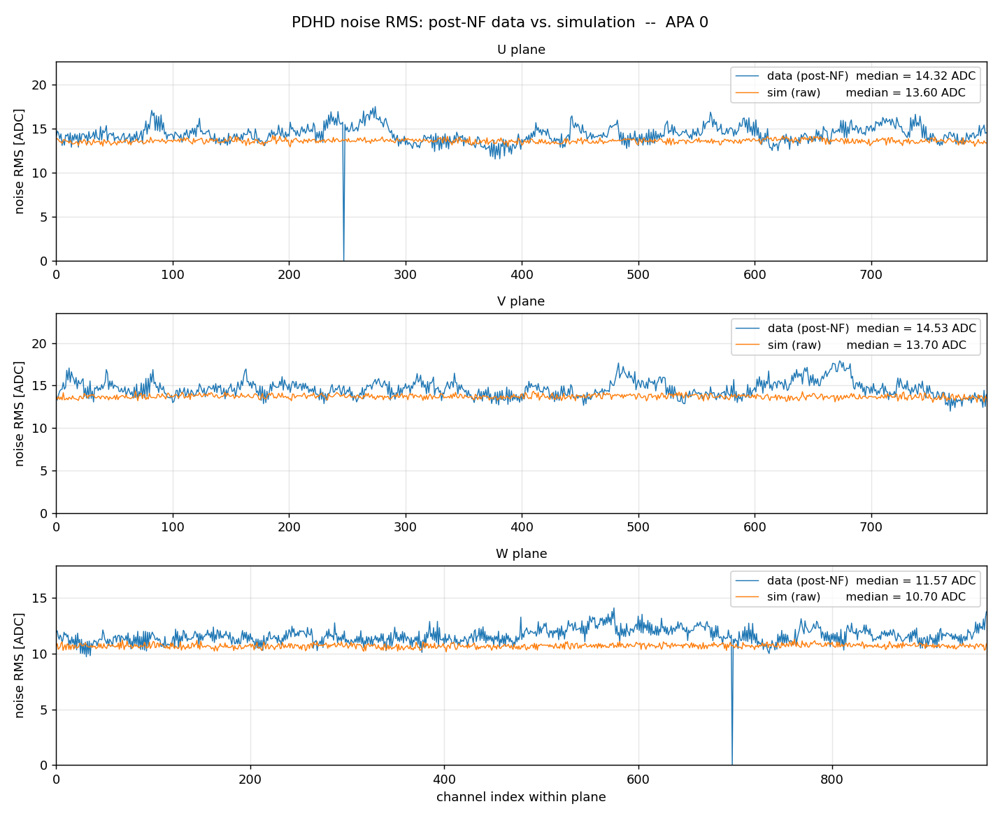
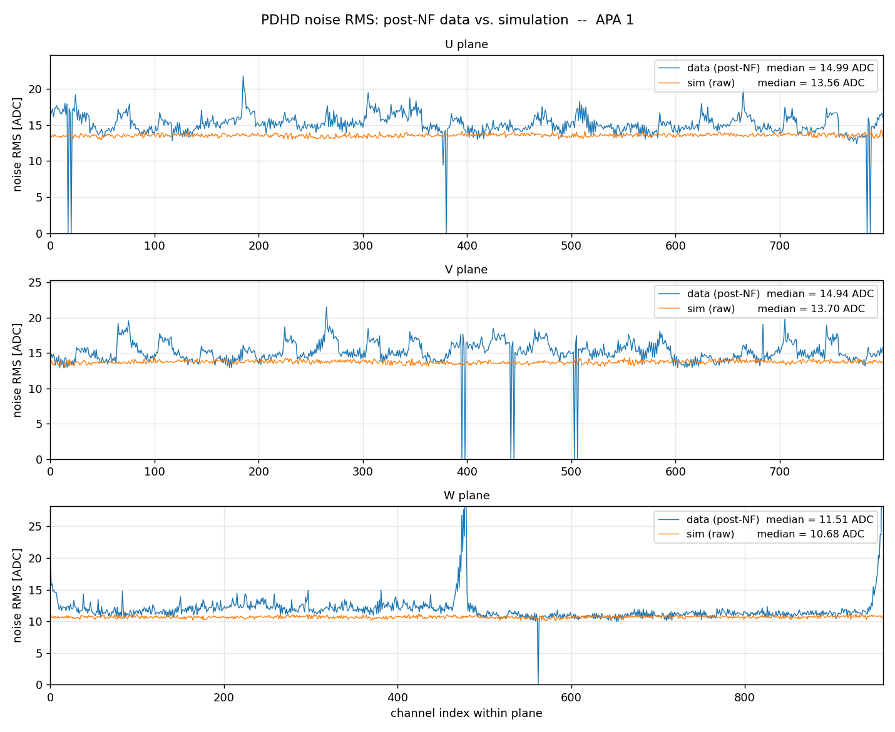
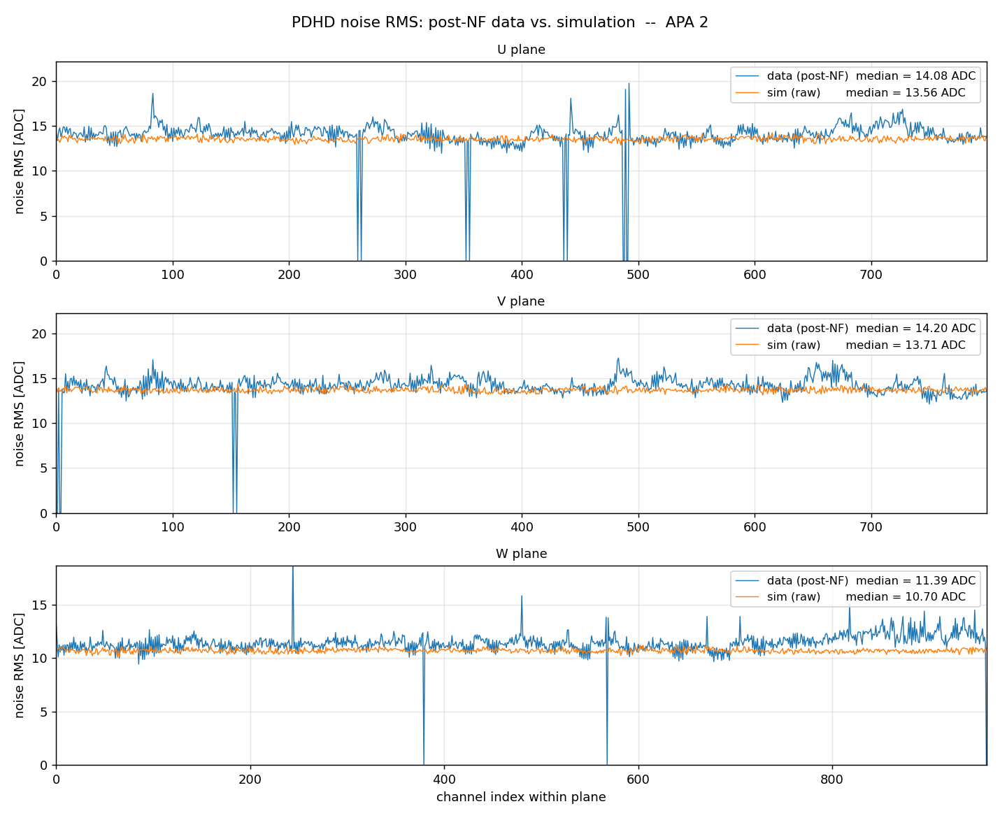
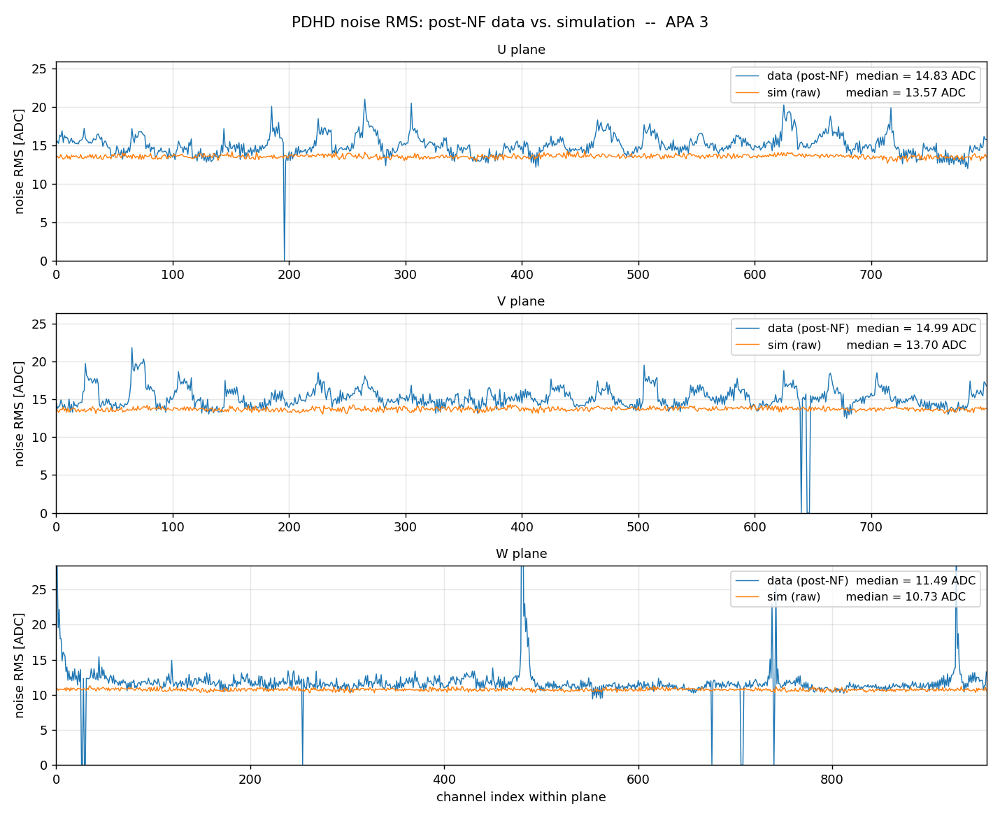
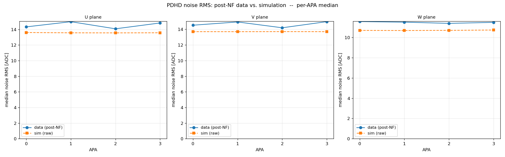
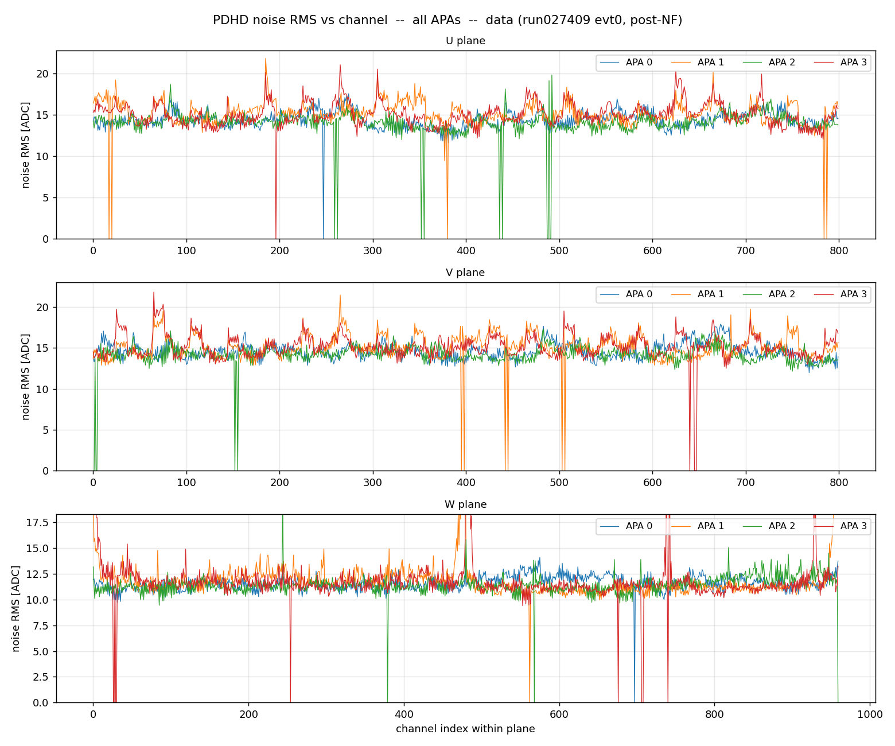
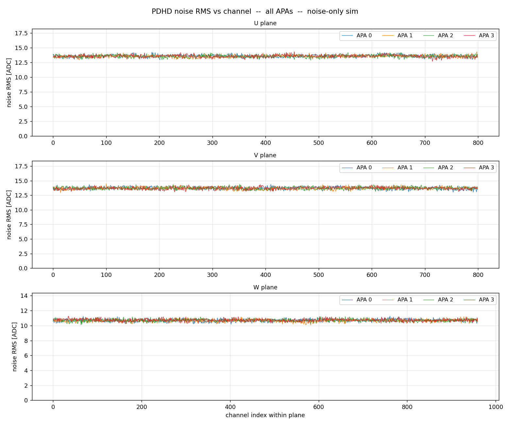

# PDHD electronics noise: data vs. simulation

Per-channel electronics-noise RMS for ProtoDUNE Horizontal Drift, comparing the real **post-noise-filtering** data waveform against the noise-only simulation. Generated by `noise_rms_compare.py`.

## Question

Is the PDHD electronics-noise simulation consistent with data?

## Inputs and method

- **Data**: PDHD `run027409`, event 0 — the **post-NF** waveform (`protodunehd-sp-frames-raw-anode{0-3}.tar.bz2`, frame tag `raw<N>`): the output of the noise-filtering chain (`wct-nf-sp.jsonnet`), tapped immediately after NF and before signal processing. All 4 APAs.
- **Simulation**: noise-only run of the production noise chain (`pdhd_sim/wct-sim-noise-only.jsonnet`): `EmpiricalNoiseModel` + `AddNoise` + `Digitizer`, configuration taken verbatim from `cfg/pgrapher/experiment/pdhd/sim.jsonnet`. FE gain 14 mV/fC — the run027409 gain, per `input_data/META.json`, selecting the `protodunehd-noise-spectra-14mVfC-v1.json.bz2` spectra file. The sim frame is the raw digitized noise — it is **not** noise-filtered.
- **Why post-NF data vs. raw sim**: the simulation generates only *incoherent* electronics noise (see "no coherent noise" below). Real raw data carries incoherent + coherent noise; NF removes the coherent part. The post-NF data waveform is therefore the incoherent-dominated noise that the simulation actually models — the intended like-for-like comparison. Caveat: NF also slightly attenuates the incoherent noise it keeps (group-median subtraction), by an estimated few percent, which the raw sim has not undergone — so the sim/data ratios below are biased a few percent high relative to a strict post-NF-vs-post-NF test.
- **Noise RMS**: per channel, the WireCell sigproc `Derivations::CalcRMS` 4.5σ clip (`sigproc/src/Derivations.cxx`), iterated to convergence so signal samples are excluded, then the population RMS of the rest.

> This supersedes the earlier pre-NF comparison (commit `63bee27`, which measured the raw `protodunehd-orig-frames`). Moving the data side to the post-NF waveform changes the conclusion substantially — see observation 2.

## Result — on the post-NF (incoherent) footing the simulation is broadly consistent with data

Median noise RMS over all channels of each APA / plane (ADC counts, and the voltage equivalent at 85.4 µV/count):

| APA | plane | data [ADC] | sim [ADC] | sim/data | data [mV] | sim [mV] |
|----:|-------|-----------:|----------:|---------:|----------:|---------:|
| 0 | U | 14.32 | 13.60 | 0.95 | 1.224 | 1.162 |
| 0 | V | 14.53 | 13.70 | 0.94 | 1.242 | 1.171 |
| 0 | W | 11.57 | 10.70 | 0.92 | 0.988 | 0.914 |
| 1 | U | 14.99 | 13.56 | 0.90 | 1.281 | 1.159 |
| 1 | V | 14.94 | 13.70 | 0.92 | 1.277 | 1.171 |
| 1 | W | 11.51 | 10.68 | 0.93 | 0.983 | 0.913 |
| 2 | U | 14.08 | 13.56 | 0.96 | 1.203 | 1.158 |
| 2 | V | 14.20 | 13.71 | 0.97 | 1.213 | 1.171 |
| 2 | W | 11.39 | 10.70 | 0.94 | 0.973 | 0.914 |
| 3 | U | 14.83 | 13.57 | 0.92 | 1.267 | 1.159 |
| 3 | V | 14.99 | 13.70 | 0.91 | 1.281 | 1.171 |
| 3 | W | 11.49 | 10.73 | 0.93 | 0.982 | 0.917 |

Three observations:

1. **The simulation tracks the data closely**, with sim/data ≈ 0.90–0.97 — it sits a few percent low. This is a large improvement over the pre-NF comparison (sim/data ≈ 0.66–0.84): most of the apparent pre-NF discrepancy was coherent noise, which the simulation does not generate and NF removes from data.
2. **The pre-NF "drift-side asymmetry" was coherent noise.** Pre-NF (commit `63bee27`) the data split sharply by even/odd APA — APA0 and APA2 (U/V ≈ 20 ADC) much louder than APA1 and APA3 (U/V ≈ 16.5) — and because even/odd APAs sit on opposite drift sides this looked like a drift-side noise asymmetry that the APA-uniform simulation could never reproduce. **Post-NF the asymmetry is gone**: all four APAs cluster at 14.1–15.0 ADC (U/V), a few-percent residual that even slightly reverses. NF removes *coherent* noise, so the pre-NF asymmetry was coherent — and the simulation being APA-uniform is not a defect, because the post-NF data is APA-uniform too. The pre→post change is sharply asymmetric, which is the whole story:

| APA | plane | pre-NF data [ADC] | post-NF data [ADC] | removed by NF |
|----:|-------|------------------:|-------------------:|--------------:|
| 0 | U | 19.82 | 14.32 | 5.50 |
| 0 | V | 20.24 | 14.53 | 5.71 |
| 0 | W | 15.32 | 11.57 | 3.75 |
| 1 | U | 16.37 | 14.99 | 1.38 |
| 1 | V | 16.49 | 14.94 | 1.55 |
| 1 | W | 12.75 | 11.51 | 1.24 |
| 2 | U | 20.10 | 14.08 | 6.02 |
| 2 | V | 20.90 | 14.20 | 6.70 |
| 2 | W | 15.50 | 11.39 | 4.11 |
| 3 | U | 16.42 | 14.83 | 1.59 |
| 3 | V | 16.76 | 14.99 | 1.77 |
| 3 | W | 12.90 | 11.49 | 1.41 |

   APA0 and APA2 lose ~4–7 ADC to NF, APA1 and APA3 only ~1.2–1.8 — the coherent noise was concentrated on the even-numbered APAs (one drift side).
3. **Plane ordering is right; a small W residual remains.** W (collection) is quieter than U/V in both data and simulation. Post-NF data W ≈ 11.4–11.6 ADC vs sim ≈ 10.7 — a ~6–8% under-prediction, the same direction and size as the U/V gap.

### No coherent noise in the simulation — by design, the right thing here

The PDHD sim adds noise with `AddNoise` (`IncoherentAddNoise`) only — there is no `CoherentAddNoise` and no `GroupNoiseModel` in `sim.jsonnet`. Against **post-NF** data that is the correct comparison, and is why the agreement above is good. Against **raw** data it is not: raw data still carries its coherent component, so a raw sim under-predicts raw data by the coherent fraction — which for PDHD is large (the drift-side asymmetry of observation 2). Reproducing raw data would require adding a coherent-noise component to the simulation.

## Per-APA comparison

### APA 0

### APA 1

### APA 2

### APA 3

## Summary across APAs

Per-source overviews (all 4 APAs overlaid):

## Caveats

- **Comparison footing**: post-NF data vs. raw (un-filtered) sim. NF removes coherent noise — which the sim never generates — but also attenuates the surviving incoherent noise by an estimated few percent; the raw sim has not been through NF, so sim/data here is biased a few percent high. A strict test would run the sim through the same NF chain.
- **Bad channels**: NF zeroes channels it flags bad; in this event that is ≤10 channels per APA / plane (≈1%), appearing as RMS = 0. The medians quoted here are unaffected.
- **Residual signal in data**: event 0 is a real triggered event; the 4.5σ clip is iterated to convergence so signal samples are excluded, and the converged result agrees with an independent percentile-based RMS to within a few percent.
- **APA0 V-plane**: a known APA0 V-plane anomaly affects signal/decon behaviour elsewhere; it does not stand out in the post-NF noise RMS here.
- **Tick period**: the post-NF data has been resampled to 500 ns/tick by the NF chain (raw data is 512 ns); the simulation is natively 500 ns/tick — the two now match. Post-NF data frames have 5999 ticks, the sim 6000 — ample statistics for a per-channel RMS.

## Conclusion

On the post-NF / incoherent-noise footing — which is what the simulation actually models — the PDHD electronics-noise simulation is **broadly consistent with data**: it reproduces the per-channel noise RMS to within ~10% (sim/data ≈ 0.90–0.97, a few percent low) and correctly produces an APA-uniform noise field. The large discrepancy reported in the earlier pre-NF study was dominated by **coherent** noise — NF removes it from data and the simulation never generates it. Two follow-ups would close the remaining gap: a few-percent upward retune of the incoherent spectra file `protodunehd-noise-spectra-14mVfC-v1.json.bz2`, and — if agreement with *raw* data is wanted — adding a coherent-noise component. See `pdhd_noise_simulation.md` for how the noise model is built.
