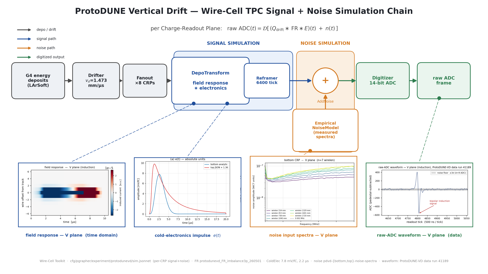

# PD-VD Wire-Cell simulation-chain presentation diagram

A wide (16:9) diagram of the ProtoDUNE-VD Wire-Cell TPC **signal + noise
simulation** chain, with embedded physics inset panels, for presentation use.



Deliverable: `pdvd/pics/pdvd_sim_chain.png` (3840×2160) and `.pdf`.

## Repro block

All commands run in the toolkit-dev direnv python env (matplotlib, numpy, PIL;
`WIRECELL_PATH` set) from `pdvd/pics/`:

```bash
# 1. physics insets that are generated here
python3 make_fr2d_snippet.py     # 2D time-domain field response, V plane (reads FR file)
python3 make_adc_snippet.py      # V-plane raw-ADC data waveform (reads run41189 raw frame)

# 2. the two reused response/noise panels are copied from the DNN_ROI_SP study
#    (regenerable there via elec_response_compare.py / noise_input_spectra.py):
#      DNN_ROI_SP/simulation/pics/sp_response/elec_response.png       -> sim_chain_src/elec_response.png
#      DNN_ROI_SP/simulation/pics/sp_noise/noise_input_spectra_lowfreq.png -> sim_chain_src/noise_input_spectra.png

# 3. assemble the master diagram
python3 make_sim_chain_diagram.py   # -> pdvd_sim_chain.png / .pdf
```

`sim_chain_src/` holds the four inset sources (committed) so the master build is
self-contained.

## The simulation chain (what the boxes are)

Traced from `cfg/pgrapher/experiment/protodunevd/sim.jsonnet`
(`splusn_pipelines`) and `params.jsonnet` / `simparams.jsonnet`. Shared head,
then a per-CRP signal+noise pipeline (×8 anodes):

| stage | node type | role / key params |
|---|---|---|
| input | `DepoFileSource` | G4 ionization deposits (LArSoft stage-A) |
| drift | `Drifter` | v_d = 1.473 mm/µs, τ = 1000 ms, D_L = 4.0 / D_T = 8.8 cm²/s |
| — | `DepoBagger` → `DepoSetFanout` | bag + fan to 8 CRPs |
| **signal sim** | `DepoTransform` | depo ∗ **field response** (`protodunevd_FR_imbalance3p_260501.json.bz2`, response plane 18.1 cm) ∗ **electronics** (bottom ColdElec 7.8 mV/fC, 2.2 µs; top JSON `dunevd-coldbox-elecresp-top-psnorm_400` ×postgain 1.36), applied via `PlaneImpactResponse` |
| reframe | `Reframer` | trim to the 6400-tick readout window |
| **noise sim** | `EmpiricalNoiseModel` + `AddNoise` | electronics noise drawn from measured spectra (`pdvd-bottom-noise-spectra-7d8mVfC-v1`, `pdvd-top-noise-spectra-v3`); 2% replacement |
| digitize | `Digitizer` | 14-bit ADC, per-drift-side baselines/fullscale → raw ADC frame (`orig<n>`) |

Signal and noise merge at `AddNoise` just before the digitizer:

> raw ADC(t) = 𝒟[ (Q_drift ∗ FR ∗ E)(t) + n(t) ]

(ident < 4 = bottom CRP, ident ≥ 4 = top CRP — each side uses its own field
`PlaneImpactResponse`, electronics response, noise spectra and digitizer
baselines.)

## Physics insets (V plane illustrates throughout)

| inset | source | notes |
|---|---|---|
| field response — V plane, 2D time domain | `make_fr2d_snippet.py` (reads the FR file) | induced current vs (wire offset, time): the classic bipolar induction signature |
| cold-electronics impulse e(t) | `sp_response/elec_response.png` panel (a) | bottom analytic ColdElec vs top JSON ×1.36 (per-CRP, not per-plane) |
| noise input spectra — V plane | `sp_noise/noise_input_spectra_lowfreq.png`, bottom-CRP V panel | the measured amplitude spectra that seed `AddNoise` |
| raw-ADC waveform — V plane (data) | `make_adc_snippet.py` (run 41189 raw frame) | a real ProtoDUNE-VD data induction channel (ch 1213), bipolar pulse over the ~9 ADC noise floor |

The raw-ADC waveform is real **data** (run 41189), used illustratively for the
digitizer output; it is a V-plane induction channel to match the field-response
and noise-spectra panels. The frequency-domain raw-waveform check was dropped at
the owner's request (time-domain V-plane snippet only).

Note: the frame-comparison scripts in `DNN_ROI_SP/simulation`
(`raw_waveform_fft.py`, `sp_noise_compare.py`) are currently blocked (their
`g4-rec-*.h5` / data frame inputs are off disk); the two reused inset PNGs
(elec, noise) are copied as-is rather than re-run.

## Verification

- Chosen data channel (V plane, ch 1213) shows a clean bipolar induction pulse
  (+407 / −562 ADC @ tick 4807) well above the σ≈9 ADC noise floor.
- `make_sim_chain_diagram.py` runs clean → 3840×2160 PNG + PDF; all four insets
  legible, leader lines correct, signal (blue) / noise (orange) / output (green)
  color coding consistent, 16:9, no overflow.
- No toolkit C++/cfg touched — this is a docs/figure deliverable only; nothing in
  the reconstruction path changes, so no build or A/B gate is required.
