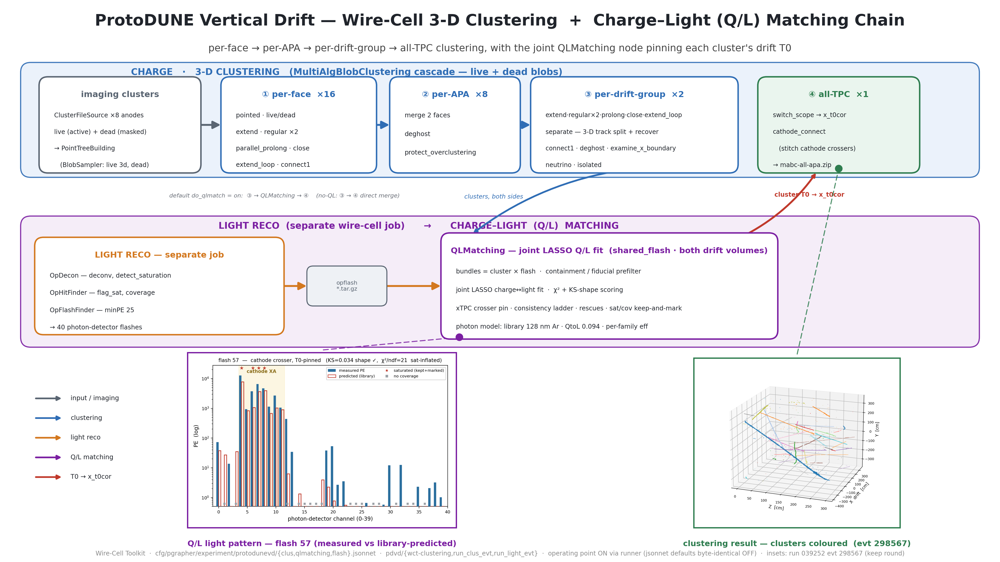

# PD-VD 3-D clustering + charge–light (Q/L) matching chain diagram

A wide (16:9) presentation diagram of the ProtoDUNE-VD Wire-Cell **3-D
clustering** cascade and the **charge–light (Q/L) matching** it drives — how the
per-APA imaging cluster files become a deghosted, track-separated, T0-corrected
3-D event whose clusters are paired with optical flashes.  Companion to the
upstream imaging diagram (PD-HD `imaging-chain-diagram.md`) and the reference
docs [06_pdvd-light-chain.md](06_pdvd-light-chain.md),
[08_pdvd-photon-model.md](08_pdvd-photon-model.md),
[09_pdvd-qlmatching.md](09_pdvd-qlmatching.md).



Deliverable: `pdvd/pics/pdvd_clus_ql_chain.png` (3840×2160) and `.pdf`.

## Repro block

Run in the toolkit-dev direnv python env (matplotlib, numpy, PIL) from
`pdvd/pics/`:

```bash
python3 make_clus_insets.py         # -> clus_chain_src/{clus_event_3d,qlmatch_pattern}.png
python3 make_clus_chain_diagram.py  # -> pdvd_clus_ql_chain.png / .pdf
```

`make_clus_insets.py` builds two data insets from two committed slim npz in
`clus_chain_src/` (extracted from the canonical `keep`-round dump of run 039252
evt 298567, so the master build is self-contained):

- **`event3d_clusters_298567.npz`** — the `clustering-global` Bee cloud
  (`x,y,z,q,cluster_id`) from `work/039252_0_keep/mabc-all-apa.zip`, with the
  unmatched-cluster sentinel points (parked at `x_t0cor = ±1.48e8`) dropped
  (`|x| < 400 cm`).
- **`qlmatch_flash57.npz`** — the per-PD `measured`/`predicted` PE, `pe_err`,
  saturation and coverage flags for flash gid 57 (a bright cathode crosser) and
  its matched bundle, from `work/039252_0_keep/calib-evt298567.json`.

## The clustering cascade (top band)

Traced from `cfg/pgrapher/experiment/protodunevd/clus.jsonnet`, driven by
`pdvd/wct-clustering.jsonnet` / `pdvd/run_clus_evt.sh`.  Each stage is one
`MultiAlgBlobClustering` node whose `pipeline` is the ordered list of
`ClusteringXxx` sub-algorithms below.  The scope widens stage by stage; a
`PointTreeMerging` fans the narrower scopes into the next.

| stage | scope | ordered pipeline |
|---|---|---|
| input | 8 anodes | `ClusterFileSource` reads the live (`-ms-active`) **and** dead (`-ms-masked`) imaging tarballs per anode → `PointTreeBuilding` (`BlobSampler`: live "3d" stepped + dead center). |
| ① per-face | 8 anodes × 2 faces = **16** | `pointed` · `live_dead` · `extend` · `regular` ×2 · `parallel_prolong` · `close` · `extend_loop` · `connect1`.  (`separate` moved to stage ③.) |
| ② per-APA | **8** (merge 2 faces) | `deghost` · `protect_overclustering`. |
| ③ per-drift-group | **2** (anodes 0–3 / 4–7) | `extend` · `regular` ×2 · `parallel_prolong` · `close` · `extend_loop` · **`separate`** (3-D track split + collinear/band recover) · `connect1` · `deghost` · `examine_x_boundary` · `neutrino` · `isolated`.  (`examine_bundles` disabled here.) |
| ④ all-TPC | **1** (both drift sides) | `switch_scope` (apply cluster T0 → materialise `x_t0cor`) · `cathode_connect` (stitch cathode crossers across x≈0). → `mabc-all-apa.zip`. |

Each stage also writes its own Bee `mabc-*.zip` (`mabc-<anode>-face<face>.zip`,
`mabc-<anode>.zip`, `mabc-group0123/4567.zip`, `mabc-all-apa.zip`); the all-TPC
zip additionally carries `clustering-global` (post-pipeline, `x_t0cor`),
`img-global` (raw imaged charge), and the optional `op` optical instance.

## The charge–light (Q/L) branch (lower band)

With `do_qlmatch = on` (the PDVD production default) the two stage-③ drift-group
cluster trees do **not** merge directly into stage ④; instead they feed the
joint matcher, whose T0 flows back up into stage ④.

1. **Light reco — a separate `wire-cell` job** (`pdvd/run_light_evt.sh` →
   `cfg/.../flash.jsonnet`), bridged to the charge job by the archive
   `opflash_*.tar.gz`: `PDVDOpWaveformSource` → `OpDecon` (deconvolution,
   `detect_saturation`, `saturation_repair`, `overflow_to_rail`) → `OpRoi`
   (cathode) → `OpHitFinder` (`flag_saturation`, `emit_coverage`) →
   `OpHitMerge` (3 populations → 1) → `OpFlashFinder` (`min_total_pe` 10,
   `min_fired_pds` 2, `flash_minPE` 25 at the matcher) → the 40-PD flashes,
   carrying `flash_sat` / `flash_cov` keep-and-mark tensors.
2. **`QLMatching` — one joint node** (`matching_joint`, `nin = 2`,
   `shared_flash`, `opdet_all_volumes`), matching clusters from **both** drift
   volumes against the shared all-PD flash list.  Conceptual order: build
   bundles (cluster × flash) with a containment/fiducial prefilter
   (`require_containment`, `tpc_extra_faces`) → over-prediction prefilter →
   per-flash channel masking (static `ch_mask`, dynamic `auto_mask`, saturation
   & coverage keep-and-mark) → high-consistency KS ladder → **joint LASSO
   charge↔light fit** → χ² + KS-shape scoring → **xTPC crosser pin** +
   consistency cull → post-fit culls + rescues.  It emits each matched cluster's
   `cluster_t0`.
3. **T0 back to the clusters:** in stage ④, `switch_scope` turns `cluster_t0`
   into `x_t0cor = x_raw − dirx·(t0 + trigger_offset)·v_drift`, and
   `cathode_connect` gates cathode-crosser stitching on the matched flash time.

### Photon model

`light_model: 'library'` — the v5 PDFastSimANN visibility library sampled on a
10 cm grid, **128 nm Argon** (`pdvd-photlib-vis-v5-128nm.json`).  `QtoL = 0.094`
(beam-flash gold-pair calibration), with per-family `VUVEfficiency` scale
factors on the official `eff_Ar`: cathode XA ×10.116, membrane XA ×1.655,
PMT ×0.352 (Ar-blind channels 13/29/32/39 → 0).

### Operating point is ON *via the runner*

`qlmatching.jsonnet` and `clus.jsonnet` keep the study knobs **default-OFF and
byte-identical**; the PDVD production operating point (the `tune_c2_cr` point,
per-family PE errors, `cathode_ext1`/anode pull trigger offsets, xTPC enable,
saturation/coverage keep-and-mark, `mask_wall_xa`, `reject_overpred`, cluster
rescue) is turned on by **`run_clus_evt.sh` / `run_light_evt.sh`** env defaults.
The diagram labels the matcher accordingly.

## Physics insets

| inset | source | shows |
|---|---|---|
| Q/L light pattern | `qlmatch_pattern.png` (flash gid 57) | measured vs library-predicted PE across the 40 photon detectors for a bright cathode-crossing flash.  The cathode XArapucas (ch 4–11, shaded) collect ~89% of the light; **KS = 0.034** says the *shape* matches, while **χ²/ndf ≈ 21** is inflated by DAPHNE saturation on the brightest cathode channels (★ = saturated, kept-and-marked not vetoed; ▪ = no coverage). This is the PDVD Q/L story: KS-led, saturation kept-and-marked. |
| clustering result 3-D | `clus_event_3d.png` (evt 298567) | the all-TPC `clustering-global` cloud coloured by cluster id — the deghosted, track-separated, T0-corrected event.  Each colour is one reconstructed cluster (the object the matcher pairs with a flash); the long blue diagonal is a cathode-crossing cosmic. |

Both insets are from the canonical `keep`-round dump of **ProtoDUNE-VD data run
039252 evt 298567** (the hand-scan reference event).

## Verification

- The clustering cascade in the figure matches `clus.jsonnet` node-for-node:
  stage-① `pointed…connect1`, stage-② `deghost`/`protect_overclustering`,
  stage-③ `…separate…isolated`, stage-④ `switch_scope`/`cathode_connect`
  (`cathode_connect` is live code, not commented, at the tail of the all-TPC
  pipeline).
- The Q/L branch matches `qlmatching.jsonnet` / the runners: one joint
  `QLMatching` node (`shared_flash`, `nin=2`) fed by a separate light job
  through `opflash_*.tar.gz`; the operating-point knobs are ON via the runner,
  not the jsonnet defaults.
- The Q/L inset really contains saturated (`flash_sat > 0`, 4 channels) and
  uncovered (`flash_cov < 1`, 17 channels) photon detectors, kept in the fit and
  flagged — the keep-and-mark behaviour.
- `make_clus_chain_diagram.py` runs clean → 3840×2160 PNG + PDF; two dataflow
  bands, five clustering stages, the light+QL band, and two insets legible at
  slide scale, 16:9, no text overflow.
- No toolkit C++/cfg touched — docs/figure deliverable only; nothing in the
  reconstruction path changes, so no build or A/B gate is required.
