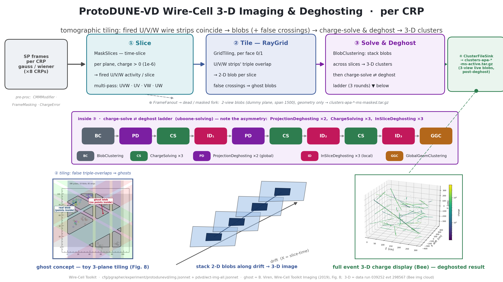

# PD-VD 3-D imaging & deghosting algorithm diagram

A wide (16:9) presentation diagram of the ProtoDUNE-VD Wire-Cell **3-D imaging**
stage — how per-CRP signal-processing frames become deghosted, charge-solved
3-D blob clusters — with the **deghosting ladder** as the centerpiece and three
physics insets.  Counterpart of the ProtoDUNE-HD diagram
[../../pdhd/docs/imaging-chain-diagram.md](../../pdhd/docs/imaging-chain-diagram.md)
(same visual family and shared Fig. 8 ghost inset), and companion of the other
PDVD chain diagrams [16_pdvd-sim-chain.md](16_pdvd-sim-chain.md) (upstream sim)
and [17_pdvd-clustering-qlmatching-chain.md](17_pdvd-clustering-qlmatching-chain.md)
(the clustering + Q/L match that consumes imaging output).



Deliverable: `pdvd/pics/pdvd_imaging_chain.png` (3840×2160) and `.pdf`.

## Repro block

Run in the toolkit-dev direnv python env (matplotlib, numpy, PIL; `WIRECELL_PATH`
set) from `pdvd/pics/`:

```bash
# the ghost inset source: page 11 (Fig. 8) of the WCT imaging note, cropped to
# the plot region (committed as imaging_src/raygrid_fig8_page.png):
curl -sSLk -o raygrid.pdf https://www.phy.bnl.gov/~bviren/wire-cell/docs/raygrid.pdf
pdftoppm -png -r 300 -f 11 -l 11 raygrid.pdf fig8    # -> fig8-11.png
python3 -c "from PIL import Image; Image.open('fig8-11.png').crop((300,640,2130,2480)).save('imaging_src/raygrid_fig8_page.png')"

python3 make_imaging_insets.py        # -> imaging_src/{raygrid_fig8_ghost,img_event_3d}.png
python3 make_imaging_chain_diagram.py # -> pdvd_imaging_chain.png / .pdf
```

`make_imaging_insets.py` builds two insets from committed sources in
`imaging_src/` (so the master build is self-contained):

- **`raygrid_fig8_ghost.png`** — the ghost concept, from Fig. 8 of the WCT
  imaging note (B. Viren, *Wire-Cell Toolkit Imaging*, 2019), the committed
  `imaging_src/raygrid_fig8_page.png` with two leaders (**real** / **ghost**)
  overlaid for slide legibility. A *toy* 3-plane detector, not PDVD data —
  detector-agnostic, so PDHD and PDVD share the exact same ghost inset.
- **`img_event_3d.png`** — from `imaging_src/event3d_039252_298567.npz`, a slim
  `(x,y,z,q)` extract of `data/0/0-img-global.json` inside our own
  `work/039252_0/mabc-all-apa.zip` **run 039252 evt 298567** (the shared
  hand-scan reference event) — exactly the imaging charge cloud that gets
  uploaded to the Bee viewer, coloured by charge only.

## The cascade (what the boxes are)

Traced from `cfg/pgrapher/experiment/protodunevd/img.jsonnet`, driven by
`pdvd/wct-img-all.jsonnet`.  The driver forces `img_maker.per_anode(anode,
"multi")` with `nthreshold=[1e-6, 1e-6, 1e-6]` (slice on any positive charge),
and runs **one instance per CRP** — the eight CRPs image independently.

The `"multi"` pipeline fans the pre-processed frame with a `FrameFanout` into an
**active fork** and a **masked fork**:

| stage | node(s) | what it does |
|---|---|---|
| pre-proc | `CMMModifier` · `FrameMasking` · `ChargeErrorFrameEstimator` | organize the dead-channel mask, apply it to the `gauss`/`wiener` traces, and estimate a per-channel charge uncertainty (folded into the input arrow). |
| ① Slice | `MaskSlices` (inside `multi_active_slicing_tiling`, span 4) | time-slice the frame; per plane, keep wires whose charge clears the threshold (`nthreshold=1e-6` = any positive charge). Run as a **multi-pass** over plane combinations `UVW · UV · VW · UW`. |
| ② Tile — RayGrid | `GridTiling` (per face 0/1) + `BlobSetSync` | RayGrid tomography: a blob is formed wherever the fired U/V/W wire **strips all three overlap** in the transverse plane → one 2-D blob per slice. With three projections, unrelated tracks also produce **false triple-coincidences → ghost blobs**. This ambiguity is *why* the next stage exists. |
| ③ Solve & Deghost | `BlobClustering` → the deghost ⇄ charge-solve ladder → `GlobalGeomClustering` | `BlobClustering` connects blobs across adjacent time slices (drift = slice time) into 3-D proto-clusters; the ladder prunes ghosts and solves blob charge; `GlobalGeomClustering` (the ladder's final node) rebuilds the geometry clustering. This whole stage is `solving("full")` (below). |
| ④ write | `ClusterFileSink` | write the `ICluster` (blobs + slices + wires + channels) to `clusters-apa-*-ms-active.tar.gz` (3-view live blobs, post-deghosting). |

**The "3-D":** a blob is a 2-D transverse (Z-Y) shape at one drift slice; the drift
(X) coordinate is the slice time (`x = xorig + xsign·(t_slice+time_offset)·v_drift`).
`BlobClustering` stacks and connects successive slices along drift → the 3-D image
(the schematic in the diagram).

### The deghost ⇄ charge-solve ladder (the centerpiece)

`img.jsonnet` `solving("full")` is the pipeline

```
BlobClustering → PD → [CS] → ID₁ → PD → [CS] → ID₂ → [CS] → ID₃ → GlobalGeomClustering
```

— i.e. `[bc, gd1, cs1, ld1, gd2, cs2, ld2, cs3, ld3, gc]`, **identical to PDHD**.
Note the **asymmetry** (the diagram draws it literally, not as a clean triplet):

- **`PD` = `ProjectionDeghosting` ×2** (`gd1`, `gd2`) — *global*, cross-view.
  Projects each blob onto the three views and drops blobs whose projections are
  redundant/inconsistent with stronger blobs. There is **no third `PD`**.
- **`CS` = `ChargeSolving` ×3** — each `CS` is itself the sub-pipeline
  `BlobGrouping → ChargeSolving("uniform") → LocalGeomClustering →
  ChargeSolving("uboone")`: it merges channels into measures and solves each
  blob's charge by least squares. Ghost blobs get driven to ≈0 charge — which is
  what makes the *next* local deghost cut work (the ⇄ coupling).
- **`ID` = `InSliceDeghosting` ×3** (`ld1`/`ld2`/`ld3`, each a different
  `config_round`) — *local*, charge-based. Tags good/bad blobs by solved charge
  (`good_blob_charge_th = 300`), removes in-slice ghosts that share wires with a
  higher-charge blob, deletes them, and re-clusters within groups.

`ProjectionDeghosting` and `InSliceDeghosting` are **different algorithms doing
different jobs** (global projection consistency vs. local charge competition), so
the diagram keeps them in distinct colours.

### The dead / masked fork

Parallel to the active (3-view) path, the `FrameFanout` feeds a subordinate
**dead/masked** fork (`multi_masked_2view_slicing_tiling`, coarse `span=1500`):
it tiles **2-view** blobs over dead regions (one plane declared a dummy),
carrying **geometry only — no charge solving** — into
`clusters-apa-*-ms-masked.tar.gz`. The downstream clustering
([17_pdvd-clustering-qlmatching-chain.md](17_pdvd-clustering-qlmatching-chain.md))
reads both the live (`-ms-active`) and dead (`-ms-masked`) cluster files.

## Physics insets

| inset | source | shows |
|---|---|---|
| ghost concept (toy) | `make_imaging_insets.py:make_ghost_concept` — Fig. 8 of the WCT imaging note (B. Viren, 2019) | a **toy** 3-plane detector: the pastel diagonal bands are the fired activity strips of the three views; grey polygons are the blobs tiled at strip triple-overlaps. Some surround the generated points (**real blob**); others surround none (**ghost blob**) — the false triple-coincidences the deghosting ladder removes. Two leaders (real / ghost) are overlaid so the concept reads on a slide. Shared with the PDHD diagram. |
| stack 2-D blobs → 3-D | drawn schematic | how per-slice 2-D transverse blobs, offset along drift by slice time and connected by `BlobClustering`, build the 3-D image — the "3-D" of imaging. |
| full event 3-D charge (Bee) | `make_imaging_insets.py:make_event_3d` (run 039252 evt 298567) | a real **Bee event display** — the whole-event imaging charge cloud in 3-D (X drift, Y, Z), coloured by charge only (no clustering colour): cosmic-ray tracks crossing the full two-drift-volume detector, the deghosted, charge-solved result. |

**The ghost inset is a toy, on purpose** (and shared with PDHD): Fig. 8 of the
imaging note is a toy 3-plane detector ("100 points, 13 blobs, 65 strips"), not
detector data — that is exactly what makes the ghost concept legible, so a grey
blob surrounding *no* point is unmistakably a false triple-coincidence. It is
attributed (caption + footer + this doc) to B. Viren, *Wire-Cell Toolkit
Imaging* (2019), Fig. 8.

The one **data** inset is the 3-D display. PDVD has two drift volumes (bottom
CRPs ident < 4 at `xorig = −341.6`, top CRPs ident ≥ 4 at `+341.6`); the cloud
spans `x ∈ [−398.5, 398.5]`, `y ∈ [−336, 336]`, `z ∈ [0.9, 298.6]` cm with
clean, straight cosmic tracks — the drift conversion is faithful (the img_plot
sidecar for run 039252 reports per-CRP slice-time→x residuals ≤ 1.9 cm). The
`0-img-global.json` cloud is the Bee point cloud uploaded to Bee (`type: img`,
pre-all-CRP-clustering, so "only charge, no clustering colour").

## Verification

- The deghost ladder in the figure (`BC → PD → CS → ID₁ → PD → CS → ID₂ → CS →
  ID₃ → GGC`) matches `protodunevd/img.jsonnet` `solving("full")`
  (`[bc, gd1, cs1, ld1, gd2, cs2, ld2, cs3, ld3, gc]`) node-for-node:
  ProjectionDeghosting ×2, ChargeSolving ×3, InSliceDeghosting ×3 — identical to
  PDHD.
- The pipeline actually run is `per_anode(anode, "multi")` (forced in
  `pdvd/wct-img-all.jsonnet`, overriding the `img.jsonnet` `"single"` default),
  with the `FrameFanout` active/masked split and the real output filenames
  `clusters-apa-*-ms-active.tar.gz` / `-ms-masked.tar.gz` (verified against
  `work/039252_0/`).
- The ghost inset's real/ghost leaders land correctly (real leader on a
  point-filled blob, ghost leader on a grey blob with no points inside); the
  source is Fig. 8 cropped only (plot region), never altered.
- The 3-D inset's charge cloud has both drift volumes well x-converted (no
  drift-axis leakage), so the drift dimension is faithful.
- `make_imaging_chain_diagram.py` runs clean → 3840×2160 PNG + PDF; four spine
  stages, the ladder band, and three insets legible at slide scale, 16:9, no
  text overflow (big fonts / tight whitespace per the reviewer's general
  comment).
- No toolkit C++/cfg touched — docs/figure deliverable only; nothing in the
  reconstruction path changes, so no build or A/B gate is required.  The one
  shared-helper edit (`pdvd/pics/diagram_helpers.py`) is additive (new optional
  args defaulting to the prior values); the sim-chain and clus-chain figures
  regenerate byte-identical (their PNGs are unchanged).
