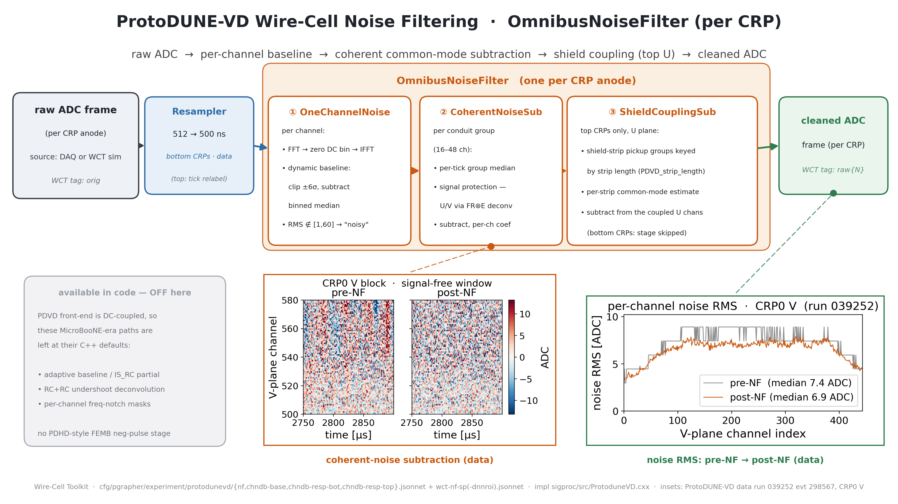

# PD-VD Noise-Filtering algorithm diagram

A wide (16:9) presentation diagram of the ProtoDUNE-VD Wire-Cell **noise
filtering** stage as run in production — `OmnibusNoiseFilter` with the three
PDVD channel/group filters — with two real-data insets.  Counterpart of the
PD-HD original ([pdhd/docs/nf-chain-diagram.md](../../pdhd/docs/nf-chain-diagram.md))
— same layout, ProtoDUNE-VD cascade.  Reference docs:
[nf_sp_img_clus/05_nf.md](nf_sp_img_clus/05_nf.md),
[nf_sp_img_clus/08_nf_comparison_pdhd_pdvd.md](nf_sp_img_clus/08_nf_comparison_pdhd_pdvd.md),
[nf_sp_img_clus/14_shield_coupling_sub.md](nf_sp_img_clus/14_shield_coupling_sub.md).



Deliverable: `pdvd/pics/pdvd_nf_chain.png` (3840×2160) and `.pdf`.

## Repro block

Run in the toolkit-dev direnv python env (`WIRECELL_PATH` set) from
`pdvd/pics/`:

```bash
python3 make_nfsp_insets.py        # generates the NF+SP data insets into nfsp_src/
python3 make_nf_chain_diagram.py   # -> pdvd_nf_chain.png / .pdf
```

`nfsp_src/` holds every committed inset PNG so the master build is
self-contained.  The builders import `diagram_helpers_v2.py` — a
duplication-fork of `pdhd/pics/diagram_helpers.py` (adds `stack_box` and the
enlarged review-round fonts); the original `pdvd/pics/diagram_helpers.py`
used by the existing clus/imaging builders is untouched.

## The cascade (what the boxes are)

Traced from `cfg/pgrapher/experiment/protodunevd/{nf,chndb-base}.jsonnet` and
the drivers `pdvd/wct-nf-sp.jsonnet` / `wct-nf-sp-dnnroi.jsonnet`.

| stage | node | what it does |
|---|---|---|
| Resampler (data only) | `Resampler` | bottom-CRP `orig` frames arrive at 512 ns/tick and are resampled to 500 ns before NF.  Top-CRP frames are already 500 ns but arrive **mislabeled** 512 ns, so the driver overrides `FrameFileSource.tick` instead (a metadata relabel, no resampling). |
| ① `PDVDOneChannelNoise` | per channel | FFT → zero the DC bin → IFFT; dynamic baseline = subtract the ±6σ-clipped binned median; channels with RMS outside [1, 60] ADC are tagged `noisy`.  (`adaptive_baseline` stays at its C++ default false — the PDVD front-end is DC-coupled.) |
| ② `PDVDCoherentNoiseSub` | per conduit group | the coherent common-mode subtraction over the hard-coded per-conduit channel groups (16–48 ch, `chndb-base.jsonnet groups`): per-tick group median with signal protection (U/V protection uses FR⊛E response-kernel deconvolution limits from `chndb-resp-{bot,top}.jsonnet`), then per-channel-scaled subtraction. |
| ③ `PDVDShieldCouplingSub` | top CRPs only, U plane | subtracts the shield-strip pickup on the top-U channels, grouped by strip length (`PDVD_strip_length.json.bz2`).  Bottom CRPs skip this stage. |
| out | `raw{N}` | the NF-cleaned ADC frame (WCT's confusingly-named "raw" tag = "cooked") → SP. |

The greyed panel lists machinery available in the code but OFF here
(MicroBooNE-era adaptive-baseline / RC+RC / freq-notch paths at their C++
defaults), and notes that PDVD has **no analogue of PDHD's FEMB
negative-pulse stage** — its third filter is the shield-coupling subtraction
instead.

## Data insets (run 039252 evt 298567 — the hand-scan reference event, CRP0 V)

| inset | source | shows |
|---|---|---|
| coherent-noise subtraction | `make_nfsp_insets.py:make_nf_coherent_2d` (orig vs raw frames) | an 80-channel V block in a signal-free window, pre-NF vs post-NF — the common-mode structure flattens |
| noise RMS pre→post | `make_nfsp_insets.py:make_noise_rms` (robust MAD RMS from the same frames) | per-channel V-plane noise RMS, median 7.4 → 6.9 ADC |

Unlike the PD-HD version (which read a pre-computed `nf_plot/noise_rms` npz),
the PDVD RMS curves are computed directly from the orig/raw frame pair with a
1.4826·MAD estimator (robust against the sparse real signal in the frames).

## Verification

- `make_nfsp_insets.py` + `make_nf_chain_diagram.py` run clean → 3840×2160
  PNG + PDF; cascade boxes, greyed OFF panel, both insets and leader lines
  legible at slide scale, no text overflow, 16:9.
- Cascade facts cross-checked against `protodunevd/nf.jsonnet` (filter order,
  maskmap, tags), `chndb-base.jsonnet` (conduit groups, U/V response wiring),
  and the driver's resampler gate (`use_resampler && n < 4`, data only).
- No toolkit C++/cfg touched — docs/figure deliverable only; no build or A/B
  gate required.
