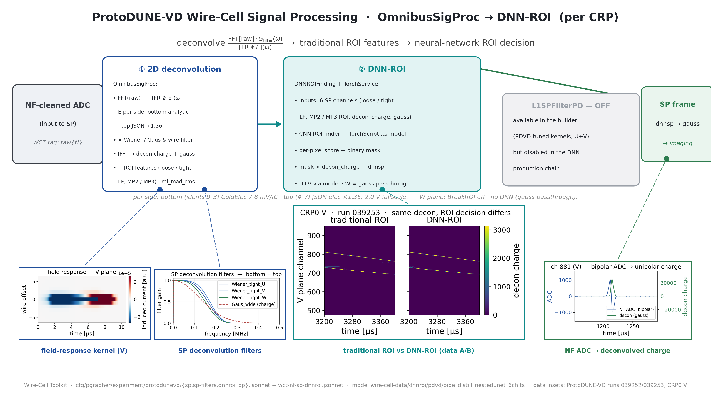

# PD-VD Signal-Processing algorithm diagram (DNN-ROI chain)

A wide (16:9) presentation diagram of the ProtoDUNE-VD Wire-Cell **signal
processing** stage as run in production — `OmnibusSigProc` → **DNN-ROI**
(`DNNROIFinding`) — with four physics insets.  Counterpart of the PD-HD
original ([pdhd/docs/sp-chain-diagram.md](../../pdhd/docs/sp-chain-diagram.md))
— same layout, ProtoDUNE-VD cascade.  Reference docs:
[nf_sp_img_clus/07_sp.md](nf_sp_img_clus/07_sp.md),
[nf_sp_img_clus/12_sp_comparison_pdhd_pdvd.md](nf_sp_img_clus/12_sp_comparison_pdhd_pdvd.md),
[nf_sp_img_clus/15_dnnroi.md](nf_sp_img_clus/15_dnnroi.md),
[nf_sp_img_clus/19_pdvd-v5-dnnroi-processing.md](nf_sp_img_clus/19_pdvd-v5-dnnroi-processing.md).



Deliverable: `pdvd/pics/pdvd_sp_chain.png` (3840×2160) and `.pdf`.

## Repro block

Run in the toolkit-dev direnv python env (`WIRECELL_PATH` set) from
`pdvd/pics/`:

```bash
python3 make_nfsp_insets.py        # generates the NF+SP data insets into nfsp_src/
python3 make_sp_chain_diagram.py   # -> pdvd_sp_chain.png / .pdf
```

## The cascade (what the boxes are)

Traced from `cfg/pgrapher/experiment/protodunevd/{sp,sp-filters,dnnroi_pp}.jsonnet`
and the production driver `pdvd/wct-nf-sp-dnnroi.jsonnet` (the img/clustering
runners default to the DNN chain, `USE_DNNROI=on`).

| stage | node | what it does |
|---|---|---|
| ① 2D deconvolution | `OmnibusSigProc` | `FFT(raw) ÷ [FR ⊛ E](ω)` with **per-side electronics** (bottom idents 0–3: analytic `ColdElecResponse` 7.8 mV/fC, 2.2 µs; top idents 4–7: JSON response `dunevd-coldbox-elecresp-top-psnorm_400` ×1.36 postgain, 2.0 V fullscale), × the SP frequency filters (Wiener/Gaussian) and wire-domain filter, IFFT → deconvolved charge + `gauss`; runs the traditional tight/loose ROI machinery with `use_multi_plane_protection` ON and `roi_mad_rms` ON (BreakROI disabled on the collection plane), and — in the DNN chain — `use_roi_debug_mode` ON so it also emits the ROI feature frames (`loose_lf`, `tight_lf`, `mp2_roi`, `mp3_roi`, `decon_charge`). |
| ② DNN-ROI | `DNNROIFinding` + `TorchService` | a **6-channel CNN ROI finder** (`dnnroi/pdvd/pipe_distill_nestedunet_6ch.ts`) consuming the six SP products; per-pixel score → threshold (0.2) → binary mask × `decon_charge` → `dnnsp`.  U and V run through the model per anode; **W passes through as SP `gauss`**.  The outputs are retagged `dnnsp{N}` → `gauss{N}` so downstream imaging sees the usual tag. |
| (L1SP) | `L1SPFilterPD` | present in the builder (PDVD-tuned kernels, U+V) but **OFF in the DNN production chain** — drawn greyed, with the dataflow arrow passing over it. |
| out | `gauss{N}` (+`wiener{N}` thresholds) | deconvolved-charge frame → imaging. |

The DNN does not delete the traditional ROI finder — it consumes the SP ROI
products as its input feature channels and makes the final ROI decision.  To
recover the pure traditional path, run the `-d off` fallback
(`wct-nf-sp.jsonnet`), which ends at SP `gauss{N}`/`wiener{N}`.

## Physics insets

| inset | source | shows |
|---|---|---|
| field-response kernel (V) | `make_nfsp_insets.py:make_decon_kernel_2d` (`protodunevd_FR_imbalance3p_260501.json.bz2`) | the 2D time-domain induction response SP inverts |
| SP deconvolution filters | `make_nfsp_insets.py:make_sp_filters` (`sp-filters.jsonnet` values) | `Wiener_tight_{U,V,W}` + `Gaus_wide` frequency filters (bottom = top) |
| traditional ROI vs DNN-ROI (data A/B) | `make_nfsp_insets.py:make_dnn_compare` (run 039253 evt_0, `nodnn_nol1sp` vs `dnn_nol1sp` processings) | the same deconvolved V-plane region with only the ROI decision differing — a real A/B of what `DNNROIFinding` changes |
| NF ADC → deconvolved charge | `make_nfsp_insets.py:make_sp_waveform` (run 039252 raw vs gauss frames) | one V channel (auto-selected, ch 881): bipolar induction ADC → unipolar deconvolved charge |

All frame insets are ProtoDUNE-VD **data**, CRP0 (bottom, anode 0);
the run-039252 insets are evt 298567, the same event as the clustering+Q/L
diagram.

## Verification

- `make_nfsp_insets.py` + `make_sp_chain_diagram.py` run clean → 3840×2160
  PNG + PDF; the ②→output arrow passes visibly over the greyed L1SP box (the
  stage is not in the production dataflow), leader dots sit on box edges, no
  text overlaps, 16:9.
- Cascade facts cross-checked against `protodunevd/sp.jsonnet` (per-side
  elecresponse/fullscale/ctoffset, `roi_mad_rms: true`,
  `r_break_roi_loop_planes: [2,2,0]`, MP tags), `dnnroi_pp.jsonnet` (6-channel
  input tag order, per-plane U/V nodes, W `PlaneSelector` passthrough) and
  `wct-nf-sp-dnnroi.jsonnet` (`l1sp_pd_mode=''`, retag `dnnsp→gauss`, forced
  `use_roi_debug_mode`+MP).
- No toolkit C++/cfg touched — docs/figure deliverable only; no build or A/B
  gate required.
