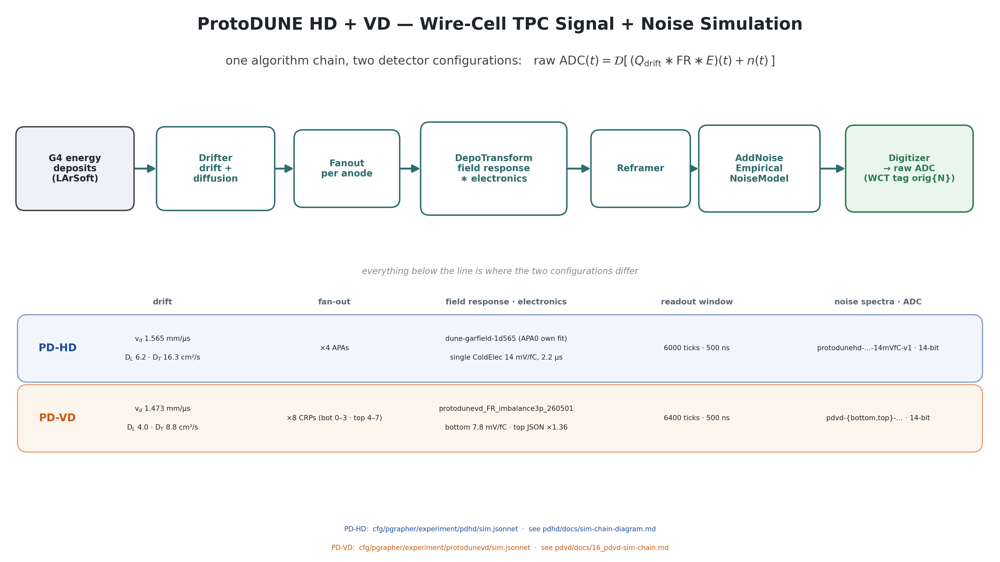
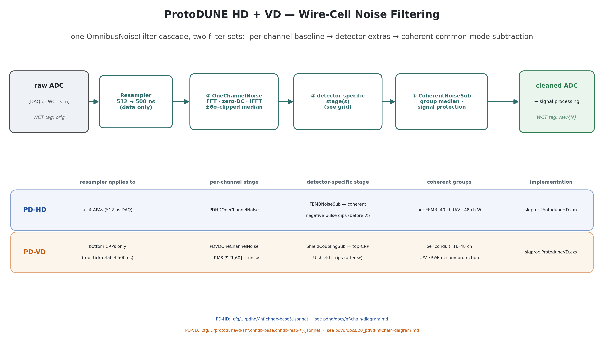
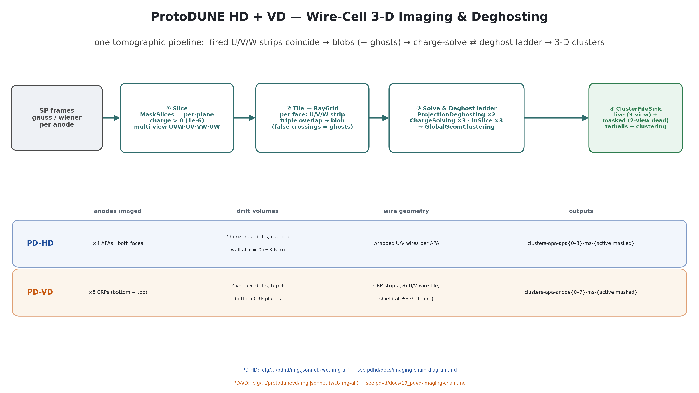
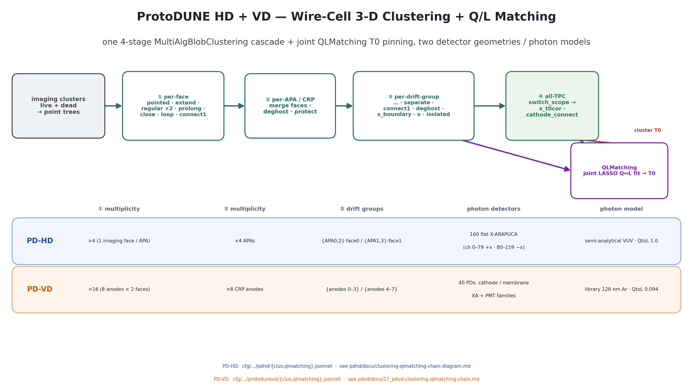

# Combined ProtoDUNE HD + VD chain diagrams (one figure per stage)

Four wide (16:9) presentation diagrams, each illustrating **both** detector
configurations at once — for talks that cover ProtoDUNE-HD and ProtoDUNE-VD
together.  The design premise: the Wire-Cell **algorithm chain is the same**
for the two detectors, so each figure draws the common cascade once (top
band) and puts everything detector-specific in a two-row, column-aligned
**PD-HD / PD-VD parameter grid** (bottom band).  The per-detector diagrams
(with data insets) remain the detailed single-detector references.

| figure | stage | per-detector references |
|---|---|---|
| `pdhd_pdvd_sim_chain.png` | TPC signal+noise simulation | [pdhd sim-chain-diagram.md](../../pdhd/docs/sim-chain-diagram.md) · [16_pdvd-sim-chain.md](16_pdvd-sim-chain.md) |
| `pdhd_pdvd_nf_chain.png` | noise filtering | [pdhd nf-chain-diagram.md](../../pdhd/docs/nf-chain-diagram.md) · [20_pdvd-nf-chain-diagram.md](20_pdvd-nf-chain-diagram.md) |
| `pdhd_pdvd_imaging_chain.png` | 3-D imaging + deghosting | [pdhd imaging-chain-diagram.md](../../pdhd/docs/imaging-chain-diagram.md) · [19_pdvd-imaging-chain.md](19_pdvd-imaging-chain.md) |
| `pdhd_pdvd_clus_ql_chain.png` | clustering + Q/L matching | [pdhd clustering-qlmatching-chain-diagram.md](../../pdhd/docs/clustering-qlmatching-chain-diagram.md) · [17_pdvd-clustering-qlmatching-chain.md](17_pdvd-clustering-qlmatching-chain.md) |






Deliverables: `pdvd/pics/pdhd_pdvd_{sim,nf,imaging,clus_ql}_chain.png`
(3840×2160) and `.pdf`.

## Repro block

Run in the toolkit-dev direnv python env from `pdvd/pics/`:

```bash
python3 make_combined_chain_diagrams.py   # -> all four pdhd_pdvd_*_chain.{png,pdf}
```

No data insets — the figures are pure configuration diagrams (matplotlib
only), so the build has no data dependencies.  The builder imports
`diagram_helpers_v2.py` (the enlarged-font helper fork).

## What each grid encodes (the actual differences)

- **Simulation**: drift point (v_d 1.565 vs 1.473 mm/µs; D_L/D_T operating
  points), fan-out (×4 APAs vs ×8 CRPs), field response + electronics
  (dune-garfield-1d565 + single 14 mV/fC ColdElec vs
  protodunevd_FR_imbalance3p_260501 + bottom-analytic/top-JSON×1.36 split),
  readout window (6000 vs 6400 ticks, both 500 ns sim tick), noise files
  (gain-selected single file vs per-side bottom/top), both 14-bit.
- **Noise filtering**: resampler coverage (all APAs vs bottom CRPs only, with
  the top-CRP tick-relabel), the shared per-channel stage, the
  detector-specific stage (PDHD `FEMBNoiseSub` before the coherent stage vs
  PDVD `PDVDShieldCouplingSub` on top-CRP U after it), coherent grouping
  (FEMB 40/48-ch vs conduit 16–48-ch with U/V FR⊛E signal protection),
  implementation files.
- **Imaging**: anode count/faces, drift-volume topology (horizontal vs
  vertical drift), wire geometry (wrapped APA wires vs CRP strips, v6 wire
  file), output tarball naming.  The Slice/Tile/Solve&Deghost ladder is
  identical.
- **Clustering + Q/L**: per-stage multiplicities (×4/×4/{0,2}{1,3} vs
  ×16/×8/{0–3}{4–7}), photon-detector systems (160 flat X-ARAPUCAs vs 40
  mixed-family PDs), photon models (semi-analytical VUV, QtoL 1.0 vs 128 nm
  visibility library, QtoL 0.094).  The 4-stage visitor cascade and the joint
  QLMatching T0 loop are identical.

## Verification

- `make_combined_chain_diagrams.py` runs clean → four 3840×2160 PNGs + PDFs;
  cascade boxes, detector rows, column headers and footers legible, no
  overlaps (the clus+QL QLMatching corner was reworked to stay inside the
  canvas), 16:9.
- Every grid value is taken from the corresponding per-detector diagram doc
  (which carry the file:line-traced provenance); no new configuration claims
  are introduced here.
- No toolkit C++/cfg touched — docs/figure deliverable only; no build or A/B
  gate required.
