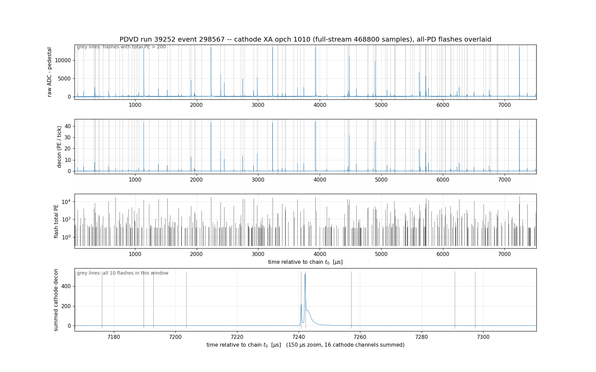
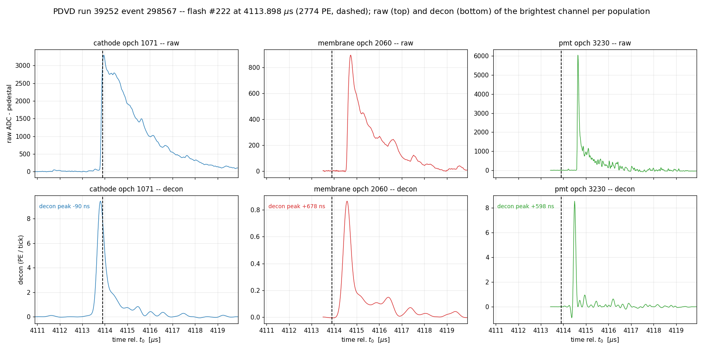
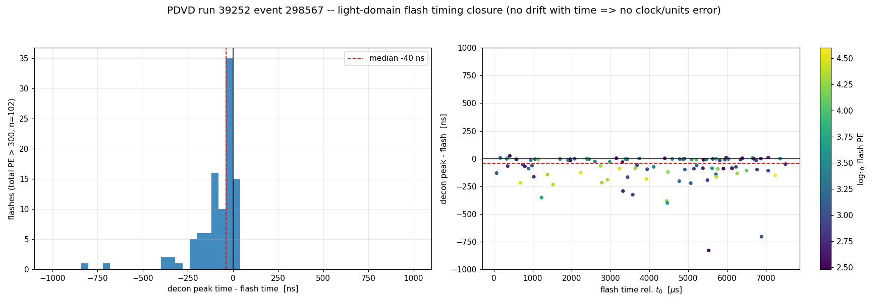
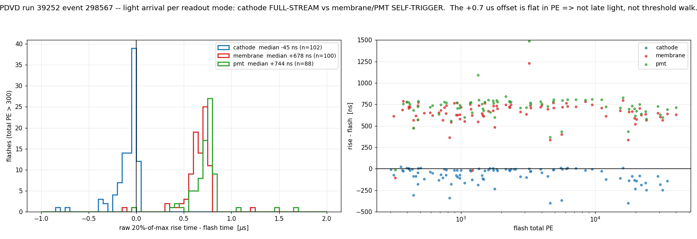
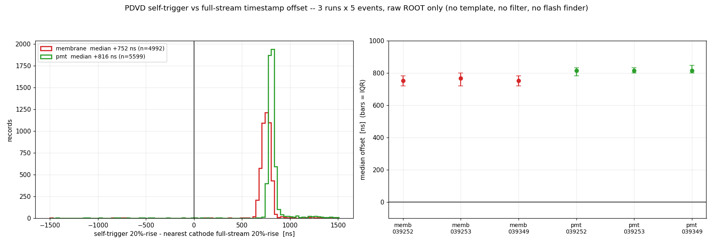
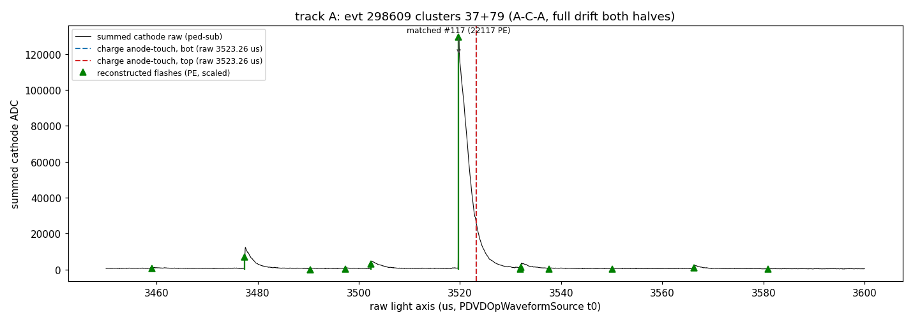
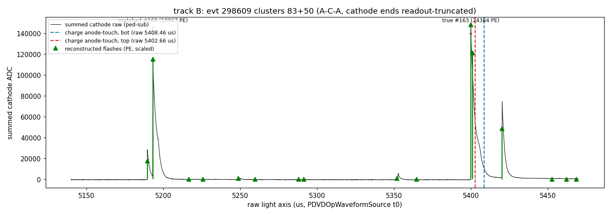
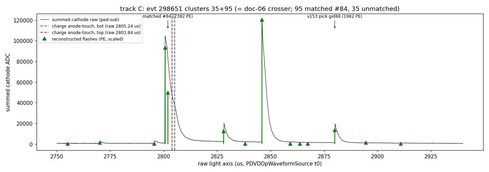
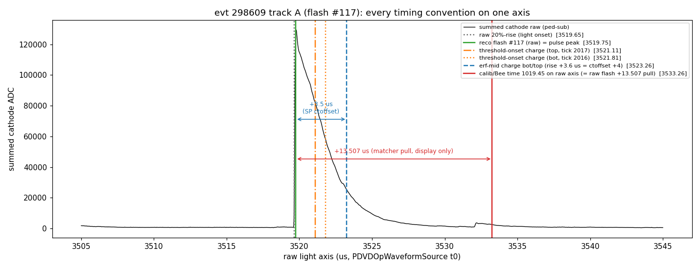

# PDVD light reco: raw / decon / flash-time check — a +0.75 µs self-trigger offset

**Status:** investigation, **no code and no config is changed by this document.**
The figures are diagnostics; the recommended correction at the end is
owner-gated because it would move reconstructed light times unconditionally.

## Repro

```bash
cd /nfs/data/1/xqian/toolkit-dev/toolkit/pdvd
python3 pd_plot/light_timing_check.py          # ~3 min, writes docs/pics/pdvd_light_timing_*.png
# optional: skip the 15-event raw-ROOT scan (figure 5)
PDVD_LT_MULTI=0 python3 pd_plot/light_timing_check.py
```

Inputs, all pre-existing products of our own chain (no borrowed files):

| what | path |
|---|---|
| raw + decon dense frames (3 branches) | `work/039252_light298567_keep/light-frames-{cathode,membrane,pmt}.tar.bz2` |
| flashes / ophits | `work/039252_light298567_keep/opflash_pdvd-wct.tar.gz` |
| raw ROOT (figure 5, runs 039252/039253/039349) | `input_data_light/np02vd_raw_run*_rawwf.root` |

The frames were produced by `wct-light-frames.jsonnet` (see doc
`06_pdvd-light-chain.md`); the flashes by `run_light_evt.sh`.

## The one time axis

Everything below is plotted in **microseconds relative to the chain tick
origin `t0`** of `PDVDOpWaveformSource` (`root/src/PDVDOpWaveformSource.cxx:105`):

```
t0 = min over ALL records of   llround(timestamp_us * 62.5)
                               - (nsamp <= 1024 ? trig_sample : 0)      [16 ns ticks]
```

The `min` deliberately ignores the `opch` selection so the three population
branches (cathode / membrane / PMT) share one origin.

* raw and decon frames: `tickinfo = [time, tick_ns, tbin0]`; frame column `i`
  is absolute tick `tbin0 + i`.
* flash time: **opflash column 0, in NANOSECONDS** relative to the same `t0`
  (`OpFlashFinder` works in WCT ns). A µs/ns slip here inverts every
  conclusion in this document — see `09_pdvd-qlmatching.md`.

## 1. Raw, decon, flash time — the overview



Run 39252 event 298567, cathode XA `opch 1010` (full-stream, 468800 samples
≈ 7.5 ms). Top: raw ADC minus pedestal. Second: the WI-deconvolved waveform
of the same channel. Third: all 414 reconstructed flashes as a total-PE stem
plot. Bottom: a 150 µs zoom of the 16 cathode channels summed, with every
flash in the window marked.

Every visible light pulse has a flash on it, and the flash density (~414 per
7.5 ms, ~55/ms) matches the pulse density — no wholesale duplication and no
wholesale loss.

## 2. Zoom: one flash across the three populations



Flash #222, 4113.898 µs, 2774 PE — deliberately **not** the brightest flash of
the event, because the brightest ones rail the 14-bit ADC and the decon then
shows saturation-recovery undershoot that has nothing to do with timing.
Each column is one population; the raw panel and the decon panel show the
**same** channel. Samples outside the record are exactly 0 in the dense frame
and are masked, so the record boundary is not drawn as a signal edge.

The dashed line is the flash time. The cathode decon peaks **−90 ns** from it;
the membrane XA peaks **+678 ns** and the PMT **+598 ns** *later*. That gap is
the subject of §4.

## 3. The flash time itself is correct (in the light domain)



For each of the 102 flashes with total PE > 300, the peak of the summed
cathode decon within ±2 µs, minus the flash time:

| quantity | value |
|---|---|
| median | **−40 ns** |
| IQR | −117 … −3 ns |
| linear fit vs flash time | slope **−0.0042 ns/µs**, intercept −74.5 ns |

The slope means the offset grows by 31 ns across the whole 7.5 ms window —
i.e. it is **flat**. A units error (ns vs µs) or a clock-rate error would show
as a slope of order the offset itself; a wrong `t0` would show as a large
constant. Neither is present. The −40 ns is the known effect that the flash
time is the accumulator-bin time of the brightest hits while the decon peak
sits a fraction of a tick later; it reproduces the −96 ns quoted from the
python-vs-C++ validation in `06_pdvd-light-chain.md`.

**So: the light-domain flash time is sound to a few tens of ns, and this
figure is what rules out the "obvious" candidates.**

## 4. What is actually off: self-trigger records are +0.75 µs late



Same flashes, but now the **raw** 20 %-of-maximum rise time of the loudest
channel of each population (raw, not decon, so no template or filter can be
blamed), relative to the flash time:

| population | readout | median rise − flash | IQR |
|---|---|---|---|
| cathode XA | full stream, 468800 samples | **−45 ns** | −130 … −5 |
| membrane XA | self-trigger snippet, 1024 samples | **+678 ns** | +613 … +737 |
| PMT | self-trigger snippet, 1024 samples | **+744 ns** | +666 … +786 |

The distribution is cleanly bimodal and, in the right-hand panel, **flat in
flash PE over two decades** (300 PE → 40 000 PE). That is the discriminating
test:

* **not late light / scattering** — the Ar triplet and reflected light would
  give a brightness- and topology-dependent, broad, asymmetric lag, not a
  ±70 ns core independent of PE;
* **not threshold walk** — a self-trigger firing later on dim pulses would
  give a strong PE dependence, which is absent;
* **not the decon** — it is measured on the raw samples.

It splits by **readout mode**, not by device: membrane XA (SiPM, slow) and PMT
(fast, completely different front end) sit together at +0.7 µs, and the only
thing they share is that both are read out as **self-trigger snippets** while
the cathode is a **full stream**.

### It is not event- or run-specific



Figure 5 repeats the measurement with **no WCT product at all** — straight
from the raw ROOT, replicating `t0` in python, taking the 20 %-rise of every
stream pulse in the summed cathode channels and of every self-trigger record
at the tick where `PDVDOpWaveformSource` places it:

| population | run 039252 | run 039253 | run 039349 |
|---|---|---|---|
| membrane | +752 ns (n=2143) | +768 ns (n=1740) | +752 ns (n=1109) |
| PMT | +816 ns (n=2150) | +816 ns (n=1751) | +816 ns (n=1698) |

IQR ≈ ±40 ns everywhere. **The offset is a constant of the data**:
≈ **+0.75 µs (47 ticks) for membrane XA, +0.82 µs (51 ticks) for PMT**, stable
across 3 runs and 15 events.

### Reconciliation with doc 05, which measured the opposite

`05_pdvd-flash-dt.md` reports `pmt − cathode` median **+0.000 µs** with a 68 %
half-width of 32 ns, and concludes "per-population systematic offsets are
≤ 64 ns". That is a direct contradiction of +816 ns and has to be settled
rather than stepped around.

Doc 05 uses the same hit-time convention as the chain (its §"common clock",
line 23: snippets → `timestamp + (decon spike − 64) × 16 ns`, stream →
`timestamp + sample × 16 ns`), so the discrepancy is **not** a convention
difference. It is the **estimator**: doc 05 measures *nearest-neighbour* Δt of
each hit to the closest cathode hit ≥ 3 PE. That statistic is blind to a
common offset whenever the reference population has many hits per physical
pulse — and it does. On the chain's own ophits for event 298567:

| quantity | value |
|---|---|
| cathode ophits ≥ 3 PE in the event | 6261 |
| median gap between consecutive cathode hits | **272 ns** |
| fraction of gaps < 800 ns | **66 %** |
| doc-05 estimator reproduced (nearest-neighbour PMT − cathode) | **−64 ns**, 68 % half-width 266 ns |
| leading-edge estimator, same event (§4) | **+744 ns** |

A PMT hit sitting 816 ns after the *leading edge* of a cathode pulse simply
finds a different cathode hit — from the tail of the same pulse — a few tens
of ns away, and the estimator returns ≈ 0. Reproducing doc 05's method on our
ophits gives −64 ns, i.e. doc 05's number is correct **for what it measures**;
it just cannot see this offset. Measuring the 20 %-of-maximum **rise** of the
pulse instead removes the ambiguity, because a pulse has exactly one leading
edge.

Two consistency checks that survive: doc 05's snippet↔snippet pair
(`membrane_bot − pmt`, +64 ns) agrees with the 64 ns membrane↔PMT difference
here — the common offset cancels between two self-trigger populations, which
is precisely why only the snippet↔**stream** pairs are affected. And doc 05's
own follow-up note ("`TRIG_SAMPLE = 64` … shifts all snippet hits by a common
constant and only matters for the absolute light↔charge alignment") is exactly
the class of effect this document measures.

**Doc 05's conclusions are not withdrawn** — `bin_width = 1000 ns` and the
single all-PD flash stand — but its statement "no per-type time-offset
correction is needed" should be read as scoped to snippet↔snippet pairs.

### `trig_sample = 64`: internal structure is self-consistent, absolute placement is not testable here

The natural suspect is `trig_sample`, which `PDVDOpWaveformSource` subtracts
from a snippet's timestamp and which `06_pdvd-light-chain.md` flagged as
"assumed 64, confirm at chain assembly". Inside the 1024-sample snippets of
event 298567 (pulses above 100 ADC):

| population | in-snippet 20 %-rise sample | peak sample |
|---|---|---|
| membrane | median **64** (p5 56) | 89 |
| PMT | median **74** (p5 70) | 77 |

The pulse begins essentially *at* sample 64, exactly as a 64-sample
pre-trigger predicts. If the true pre-trigger were 64 + 47 ≈ 111 (the value
that would absorb the offset), the rise would sit at sample 111, not 64.

This is a statement about the snippet's **internal** structure only: it shows
where the pulse sits *within the recorded window*, and is self-consistent with
`trig_sample = 64`. It says nothing about where that window sits on the
absolute axis — the **absolute placement is set entirely by the timestamp**,
and cannot be validated from the snippet alone. The decomposition is therefore:
in-snippet structure consistent, absolute placement ≈ 0.75–0.82 µs late
relative to the full-stream sample counter. That residual lives in the
timestamp path of the two DAPHNE readout modes, not in our reconstruction —
and for the same reason (no internal absolute reference) the sign cannot be
resolved here.

**Caveat, stated plainly:** this measurement is *relative*. It shows the two
readout modes disagree by 0.75 µs; it cannot say which one is right in
absolute terms, because the light data contains no third reference. There is
no cathode channel read out in both modes (checked: event 298567 has 16
records of 468800 samples, all `opch 10xx`, and 2121 records of 1024 samples,
all `20xx`/`30xx`), so the readout-mode and the PD-population hypotheses
cannot be separated *within* the light stream. Resolving the sign needs
either the DAPHNE firmware pre-trigger/timestamp definition or an external
reference (the charge trigger).

## 5. What this does and does not explain

**Does not explain a light↔charge offset.** A raw/decon/flash figure lives
entirely inside the light domain. The known-open item there is different: the
legacy scalar `offset_us` stays **0** for PDVD (inert, `flash.jsonnet:203`),
and the real per-crate offsets are stamped as `offset_bot_us`/`offset_top_us`
by `run_light_evt.sh` and consumed as `trigger_offset` /
`trigger_offset_top` in `qlmatching.jsonnet`. For this event they are
−2500.24 µs (BDE/bottom) and −2486.75 µs (TDE/top). If the reported symptom
is "flash times are ~2.5 ms off the charge", that is this bookkeeping, not
§4 — check that the consumer actually reads the per-crate keys and not
`offset_us`.

**Impact of §4 on current output — modest, and mostly not on the flash time.**
The cathode carries ~89 % of the PE (`06_pdvd-light-chain.md`), so the flash
time is cathode-anchored and inherits the cathode clock; §3 measures it as
correct. What the offset costs is the *booking* of wall-XA and PMT hits: with
`bin_width = 1 µs`, a 0.75–0.82 µs shift moves them to the edge of, and
sometimes past, the bin holding the cathode hits of the same physical flash.
In event 298567 the gross symptom is small — only 5 of 414 flashes are
wall/PMT-dominated (cathode < 5 % of PE), carrying 0.3 % of the event's PE —
but this is the plausible mechanism behind the "the light **is** in the
waveform, the flash PE lost it" cases catalogued for wall XAs in the
wall-XA usability study (`qlmatch/`, `pd_plot`-side probe
`docs/qlmatch/scripts/wall_xa_wf_probe.py`).

## 6. Recommended next step (owner decision required)

The correction is a single number per self-trigger population — subtract
≈ 47 ticks (membrane) / 51 ticks (PMT) from the snippet start tick, or
equivalently configure a per-population effective `trig_sample` of ≈ 111 / 115.

This **cannot** be applied silently: it moves every membrane/PMT OpHit time
and would change flash composition and PE, so per §1 of `CLAUDE.md` it must
ship as a knob that defaults OFF and leaves the current path byte-identical.
Proposed shape, not implemented here:

* `PDVDOpWaveformSource`: new `snippet_time_offset_ticks` (default `0`,
  absent key ⇒ no-op), applied to the start tick of records with
  `nsamp <= snippet_nsamp`, alongside the existing `trig_sample`.
* `flash.jsonnet`: threaded per branch with the key-suppression idiom so the
  compiled JSON is byte-identical when off.
* Gate: `abtest` hash comparison of `opflash_pdvd-wct.tar.gz` with the knob
  off; knob-on smoke run showing the §4 medians collapse to ≈ 0.

Before implementing, two things should be settled:

1. **Sign.** Confirm against the DAPHNE self-trigger timestamp definition
   (or the charge trigger) whether the snippets are late or the stream is
   early. Correcting the wrong one leaves the light↔charge offset wrong by
   0.75 µs even though the light↔light offset closes.
2. **Whether it matters.** 0.75 µs of drift is ~1.2 mm of drift distance at
   1.586 mm/µs — negligible for Q/L T0. The case for fixing it is hit
   *booking* (§5), not T0 accuracy.

## 7. Light↔charge absolute closure: anode-crossing cosmics (evts 298609 / 298651)

**Added 2026-07-22.** The caveat of §4/§5 — "the light stream contains no
absolute reference; resolving absolute placement needs the charge" — is
closed here with the method proposed by Xin Ning
(`/nfs/data/1/xning/wirecell-working/wcp-porting-img/pdvd/woodpecker_data_evt3_acacrosser/`):
cosmics that cross **both anodes** (anode–cathode–anode) pin their own T0 from
the charge alone — the W **(collection-plane only; induction SP has gaps)**
streak begins, in each crate, at the instant the muon passes, so the earliest
W-gauss tick is an absolute charge-side clock that can be put on the raw light
axis and compared with the raw cathode waveform and the reconstructed flashes.

Repro:

```bash
cd pdvd/docs/qlmatch
OMP_NUM_THREADS=4 python3 scripts/aca_crossers_298609.py   # W corridors, evt 298609
python3 scripts/fit_endpoints_298609.py                    # erf edges + velocity (doc 06)
python3 scripts/aca_light_check.py                         # raw-light closure figures
```

Inputs: ccprod calib dumps (`work/039252_{3,6}_ccprod/`), evt-3 magnify
(`work/039252_3_magnify/`), raw light ROOT
(`input_data_light/np02vd_raw_run039252_*_rawwf.root`), opflash archives
(`work/039252_light2986{09,51}_keep/`).  Doc-06 erf endpoints reused for
evt 298651.

### Time bases, stated once

* **raw light axis** = §"one time axis" above (PDVDOpWaveformSource `t0`).
  Opflash npy times live here.  *Untouched by any offset knob.*
* **charge frame (per crate)** : `frame_us = raw_us + offset_crate`, with the
  measured metadata offsets `offset_bot_us/offset_top_us` (evt 298609:
  −2513.808/−2512.608; evt 298651: −2515.344/−2507.744).
* **folded (Bee/calib) flash time** = `raw_us + trigger_offset` where
  `trigger_offset = metadata + 13.507 µs`.  The **+13.507 µs (= 2.0 cm at
  v=0.148073) `PDVD_QL_EXTRA_OFFSET_US`** production pull
  (`run_clus_evt.sh`, adopted 2026-07-14, docs/qlport/
  pdvd-cathode-containment-flash-demotion.md §10) is therefore **not applied
  to the light-domain flash time**: raw opflash times never move.  It enters
  (a) QLMatching's `trigger_offsets`, i.e. the *charge-placement* x-shift
  `flash_x_offset = sign·(t_flash + trig)·v` used for containment/matching,
  and (b) — by construction of the dump — the *displayed* Bee `op_t`/calib
  `time` values, which are raw + (metadata + 13.507).

### The three tracks

Bee ids from the ccprod `mabc-all-apa.zip` img-global displays; anode-touch
ticks are erf edge midpoints on the first W channel of each half
(`fit_endpoints_298609.py`; doc-06 values for evt 298651).

| track | evt | Bee clusters (calib) | half | anode-touch W tick | → raw light (µs) | raw 20%-rise (µs) | Δ(charge−rise) |
|---|---|---|---|---|---|---|---|
| A | 298609 | 37=(0,5) bot, 79=(4,3) top | bot | 2018.9 | 3523.26 | 3519.65 | +3.6 µs |
| | | | top | 2021.3 | 3523.26 | 3519.65 | +3.6 µs |
| B | 298609 | 50=(0,102) bot, 83=(4,21) top | bot | 5789.3 | 5408.46 | 5399.89 | +8.6 µs |
| | | | top | 5780.1 | 5402.66 | 5399.89 | +2.8 µs |
| C | 298651 | 35=(0,33) bot, 95=(4,166) top | bot | 579.8 | 2805.24 | 2800.54 | +4.7 µs |
| | | (= doc-06 crosser, renumbered) | top | 592.2 | 2803.84 | 2800.54 | +3.3 µs |





### Findings

1. **The light↔charge absolute bookkeeping closes.**  In all six
   half-measurements a bright raw cathode pulse sits exactly at the
   charge-predicted time: the W-gauss anode-touch edge lags the raw 20%-rise
   by **+2.8 … +8.6 µs (median ≈ +3.6 µs)**, the same on both crates of the
   same track once each crate's own metadata offset is used.  There is no
   unaccounted large (≥ tens of µs) light↔charge offset; the ~2.5 ms
   per-crate window offsets and the chain `t0` replication are correct.
2. **The residual ≈ +4 µs is an SP absolute-timing property** (deconvolved
   charge-edge placement vs true arrival: field-response origin plus filter
   conventions), not a light-side error — the reconstructed flash times
   themselves sit on the raw rises to ≤ 0.1–1.4 µs (#117: 3519.753 vs rise
   3519.65; #163: 5399.991 vs 5399.89; #84 pair 2800.64/2801.95 vs 2800.54),
   re-confirming §3 on two more events.  It is a *difference-of-conventions*
   constant, ~3× smaller than the +13.507 µs matcher pull and in the same
   direction.
3. **Tick↔drift convention settled empirically** (this contradicts the
   convention adopted in the woodpecker `ANALYSIS_aca_crosser.md`): the
   **low-tick** end of a full-drift W streak is the **anode touch** and the
   high-tick end is the cathode.  Two independent proofs: (i) the two anode
   edges of track A differ by 2.4 ticks with the bottom crate earlier —
   *exactly* the 1.2 µs crate trigger-offset skew for simultaneous touches;
   (ii) the raw light pulse sits at the low-tick-derived time for all three
   tracks (a cathode reading would put it a full drift, ~2.29 ms, away —
   nothing is there).  Consequently the woodpecker geometric t0 ≈ 435 µs
   (flash gid106, 424 µs) for track B is not supported: the true flash is
   the bright one its matcher scored numerically closest, **#163
   (folded 2899.69 µs = raw 5399.99, 24384 PE)**.
4. **Matcher outcomes on the three tracks (ccprod):**
   * **A: correct.**  #117 → clusters [37, 79], strength 0.976, ks 0.041,
     `two_boundary` set — the A-C-A topology *is* recognised here.
   * **B: wrong flash.**  Both halves auto-selected to **#160 (folded
     2693.0 µs, 18967 PE), 206.7 µs (30.6 cm) early**; the true #163 bundle
     was scored (ks 0.169, best of the seven candidates) but got strength 0.
     Both halves are `window_truncated` (cathode-side charge runs past the
     10000-tick readout end, arrival ≈ tick 10360), which removes the
     far-end containment evidence — the truncated-crosser topology is what
     the matcher still mishandles.
   * **C: half-matched.**  Top 95 → #84 (folded 300.11 µs) — the correct
     flash (it is the 7382-PE component of the raw 2800.64+2801.95 pair);
     bottom 35 left unmatched although its gid-84 bundle has ks 0.041 and
     `consistent`.  The v153-era match of this same track to gid88
     (364.7 µs folded, raw 2880.0, 1982 PE — doc 06 "The track" section)
     was **wrong by ≈ +78 µs**; the ccprod chain (v=0.148073 + the 13.507
     pull) now picks the right flash.

The §6 sign question stays open (this closure is cathode-stream↔charge; the
self-trigger populations still sit +0.75/+0.82 µs off the cathode stream),
but the *charge* side is now demonstrated to be the valid external reference
proposed there.

### §7b Follow-ups (2026-07-22, same day): the pull vs the lag, and the estimator conventions

Repro: `python3 scripts/aca_A_conventions.py` → the one-axis figure below;
the residual table is printed by the snippet in that script's header /
recomputed in this section.



**(a) Would absorbing the +13.507 µs pull into the flash time improve the
light↔charge consistency?  No — it makes it ~3× worse and flips the sign.**
Charge (anode-touch erf midpoint, frame axis) minus flash time under the two
conventions, all six half-measurements:

| trk/half | flash = raw+metadata | flash = raw+metadata+13.507 (current Bee/calib `time`) |
|---|---|---|
| A bot / A top | +3.51 / +3.50 | −10.00 / −10.00 |
| B bot / B top | +8.47 / +2.67 | −5.04 / −10.84 |
| C bot / C top | +3.29 / +1.89 | −10.21 / −11.61 |
| **mean ± rms** | **+3.89 ± 2.12** | **−9.62 ± 2.12** |

With metadata-only folding the residual is **+3.9 ± 2.1 µs — numerically the
configured collection-plane SP time offset `ctoffset_b/_t = +4 µs`**
(`cfg/.../protodunevd/sp.jsonnet:59-60,127`, "consistent with FR"), i.e. the
closure is complete: light and charge agree at the ≲2 µs level once the known
SP convention is accounted.  Folding the pull in puts the flash ~10 µs *after*
the anode-touch charge — charge preceding its own light, unphysical as a time
statement.  The 13.507 µs pull is a *matcher x-containment margin* (2 cm,
tuned on cathode-crosser hand labels, demotion doc §10); its timing-equivalent
content is ~3× the true lag.  If the *displayed* time should equal the
physical charge-clock flash time, the right constant is ≈ ctoffset (+4 µs),
or display `raw + metadata` and keep the pull internal to the matcher gates —
an owner decision, nothing changed here.

**(b) The reconstructed flash time IS the pulse peak.**  On the raw axis the
reco flash sits at the peak (track A: 3519.75 vs 20%-rise 3519.65), as the
accumulator-bin construction intends.  The woodpecker track-A figure
(`pics/image.png` copy; `plot_light_hist2d_charge_acacrosser2.py`) shows its
"matched golden flash gid129 → −1480.5 µs" line ~12 µs after the light and
annotates it "flash time is PE-wtd mean, sits in-tail" — that line is the
**calib `time` (1019.45), which carries the +13.507 pull**: converting the
*raw* flash instead lands at −1493.99, exactly on the bright band.  The ~12 µs
is (a) of this section, not a property of the flash reconstruction.

**(c) Reconciliation with the woodpecker follow-up analysis — full agreement
on the physics, differences are estimator conventions.**  The Jul-22
woodpecker scripts (`plot_light_hist2d_charge*.py`) independently adopt
low-tick = anode, verify the raw light at the charge-derived times for both
evt-3 crossers, and note the calib-stored flash for track B is wrong —
all matching §7.  Two conventions differ:

* *Charge estimator*: woodpecker uses the first-sample-above-threshold
  (by-eye) tick — for a smeared edge that sits ~2σ ≈ 2–3 ticks *before* the
  erf midpoint (track A: ticks 2016/2017 vs erf 2018.9/2021.3).  The erf
  midpoint is the unbiased arrival of the tip charge; the threshold onset
  partially cancels the ctoffset by construction.
* *Light reference*: woodpecker compares to the pulse *peak* (~0.5–1 µs after
  the 20%-rise).

Hence their track-A "charge ≈ light peak (≲1 µs)" and our "erf-mid = rise
+3.6 µs" are the same configuration.  For track B, their "the two charge
times (383.6 / 390.9 µs rel-trigger) bound the flash (386.1–386.4)" is the
onset-estimator version: the BDE (bottom) anode edge of that track is
genuinely soft (grazing entry, erf σ = 4.0 ticks; low-level charge from tick
~5767 while the erf midpoint is 5789.3), so its threshold onset lands early.
With erf midpoints both charge times sit *after* the flash (+2.7 / +8.5 µs)
— as they physically must — and the two analyses agree within the stated
per-edge read uncertainty.  The Jul-21 `ANALYSIS_aca_crosser.md` numbers
(geometric t0 ≈ 435 µs → gid106) are superseded by the woodpecker Jul-22
scripts themselves.

### §7c Position ladder at the anode and cathode: planes, gates, track ends, Bee boxes (2026-07-22)

Repro: `cd pdvd/docs/qlmatch && python3 scripts/aca_positions.py` — prints every
number in this section (erf-based endpoints under both T0 conventions, the
containment-gate margins, and the Bee-displayed imaged endpoints from the
ccprod `mabc-all-apa.zip` img-global dumps).

**The ladder, per drift side (both crates are mirror-symmetric in |x|; the
drift coordinate `u = s·(x − anode_x)` has u = 0 at the shield):**

| position | \|x\| (cm) | u (cm) | what it is |
|---|---|---|---|
| anode flag-window outer edge | 335.91 | +4.00 | `anode_ext2` (flag_at_x_boundary window) |
| **shield plane** (= FV "anode") | **339.91** | 0 | DetectorVolumes inner bound; QLMatching `anode_x` |
| **W collection plane** | **341.55** | −1.64 | charge-placement reference (tick 0 ⇒ W); **Bee box anode face** |
| **anode containment floor** | **343.91** | −4.00 | `first_u > anode_ext1(−2) − margin(2)` — production gate |
| … | | | |
| cathode flag-window inner edge | 5.00 | 334.91 | `cathode_ext2` (−2 cm from FV cathode) |
| **cathode surface** (= FV "cathode") | **3.00** | 336.91 | drift-facing face of the 6 cm slab; **Bee box cathode face** |
| **cathode containment ceiling** | **1.00** | 338.91 | `last_u < u_cathode + cathode_ext1(2.0)` — production gate |
| cathode plane center | 0.00 | 339.91 | GDML CathodeBlock mid-plane |

So the Bee red box spans exactly [cathode surface, W plane] = [3.00, 341.55];
the containment gates sit **outside** the box on both ends (2.36 cm beyond the
anode face, 2.00 cm beyond the cathode face).

**Track-end positions — 2D W-plane collection signal (erf midpoints of the
`hw_gauss` corridor edges, no 3D reconstruction involved), true flash, T0 =
raw+metadata ("meta") vs +13.507 µs pull (current production placement):**

| trk/half | anode end meta | anode end pull | cathode end meta | cathode end pull |
|---|---|---|---|---|
| A bot (c37) | −341.03 (0.52 short of W) | −343.03 (**1.48 past W**, floor margin 0.88) | −0.71 (2.29 past surface, **0.29 past ceiling → uncontained**) | −2.71 (0.29 past surface, ceiling margin 1.71) |
| A top (c79) | +341.03 (0.52 short) | +343.03 (1.48 past, margin 0.88) | +3.65 (0.65 short of surface) | +5.65 (2.65 short; past the 5.00 flag edge) |
| B bot (c50) | −340.30 (1.25 short; soft grazing edge) | −342.30 (0.75 past, margin 1.61) | window-truncated (arrival ≈ tick 10360) | window-truncated |
| B top (c83) | +341.16 (0.39 short) | +343.16 (1.61 past, margin 0.75) | window-truncated | window-truncated |
| C bot (c35) | −341.06 (0.49 short) | −343.06 (1.51 past, margin 0.85) | −1.96 (1.04 past surface, ceiling margin 0.96) | −3.96 (0.96 short of surface) |
| C top (c95) | +341.27 (0.28 short) | +343.27 (1.72 past, margin 0.64) | +3.27 (0.27 short of surface) | +5.27 (2.27 short) |

**The same endpoints from the 3D imaged point cloud** (img-global points of
the six clusters, restricted to the track line: two-pass PCA fit, perpendicular
residual < 8 cm — endpoints stable for any cut 4–20 cm; this drops the
off-track blobs merged into the clusters, e.g. c37's 43 stray points at
apparent x ±223 and c95's 10-point clump ~70 cm away in (y,z)):

| trk/half | anode tip meta | anode tip pull | cathode end meta | cathode end pull | vs the 2D erf read |
|---|---|---|---|---|---|
| A bot (c37) | −340.95 | −342.95 | +0.51 | −1.49 | anode agrees to 0.1; imaged cathode end 1.2 deeper (falling-edge tail is imaged) |
| A top (c79) | +340.83 | +342.83 | +3.52 | +5.52 | agrees to 0.1–0.2 |
| B bot (c50) | −340.98 | −342.98 | −28.85 (window edge) | −30.85 (window edge) | anode 0.7 deeper than erf (soft grazing edge: rising tail imaged); cathode truncated |
| B top (c83) | +341.46 | +343.46 | +29.02 (window edge) | +31.02 (window edge) | anode 0.3 past erf; cathode truncated |
| C bot (c35) | −334.83 | −336.83 | −1.66 | −3.66 | **anode 6.2 cm short of erf** (corridor misses the earliest charge); cathode agrees to 0.3 |
| C top (c95) | +309.89 | +311.89 | +2.79 (+ tail to −17.7) | +4.79 (+ tail to −15.7) | **anode 31 cm short of erf** (doc-06 sparse half, corridor stops ≈ tick 961); cathode agrees to 0.5, plus the collinear in-cathode tail |

The two measurements are the same drift-time axis (a 3D point's x *is* its
slice tick), so wherever the imaging solved the corridor they agree to
0.1–0.7 cm — the differences are ticks the imaging did not solve (C's
anode-end gaps, B's readout truncation) plus edge-tail points extending
slightly past the erf midpoint. One display caveat found doing this: the
raw min/max of c95 suggests an anode tip at +326.4, but those 10 points sit
~70 cm off the track line in (y,z) — an unrelated blob merged into the
cluster, not the track; the true on-track imaged tip is +311.9 (pull).
Likewise c95's cathode-side points continue past the on-track end as the
**in-cathode late-charge tail** (61 points, apparent x −35 → −63, drifting up
to ~30 cm off-line laterally — distorted late charge, the "C cathode outside"
appearance below).

Readings:

1. **Meta-only placement is the physical one.** Every anode-touch end lands
   0.3–0.5 cm *inside* the W plane (B bot 1.25, its edge is a grazing soft
   ramp) — exactly the +4 µs SP `ctoffset` lag (0.59 cm) of §7b within the
   per-edge read error. Ordering: shield < track end (meta) < W.
2. **The pull pushes every anode tip past the W plane** by 0.75–1.72 cm
   (2.00 cm minus the SP lag), leaving only **0.64–0.88 cm** of margin to the
   343.91 containment floor. Ordering: W < track end (pull) < floor — barely.
3. **At the cathode the pull is what keeps BDE halves contained.** The bottom
   (BDE) cathode ends carry *real in-cathode late charge* (A: +39.6 ticks =
   2.93 cm deeper than the top end after crate-skew correction; C: +17.7
   ticks = 1.31 cm — the evt298567 tail census effect), so meta-only they sink
   2.3 / 1.0 cm past the ±3 surface: **A bot lands 0.29 cm past the 338.91
   containment ceiling → its true-flash bundle would be culled**, C bot
   survives with 0.96 cm. With the pull both sit comfortably inside. Top (TDE)
   ends stop 0.3–0.7 cm short of the surface either way (their late tail is
   what B's truncation removed and C's crosses into the bot volume, below).

**Bee-displayed endpoints (img-global points + flash-shift by the folded
`op_t`, i.e. WITH the pull) — this is what the display comparison sees:**

| trk/half | displayed anode tip | displayed cathode end | notes |
|---|---|---|---|
| A bot c37 | −343.1 | −1.5…−1.8 (18 pts past surface) | +11 stray pts to −374, 5 to +74 (outliers, not track) |
| A top c79 | +342.8 (1.3 past face) | +4.3 | |
| B bot c50 | −343.0 (1.4 past face) | −30.9 = readout-window edge | cathode side truncated |
| B top c83 | +343.5 (1.9 past face) | +31.0 = window edge | |
| C bot c35 | **−336.8 (4.7 INSIDE face)** | −3.7…−4.0 (just inside face) | corridor misses the first ~5 cm of anode-end charge |
| C top c95 | **+311.9 on-track (29.7 INSIDE face)** | −15.9…−17.7 (tail past x=0) | doc-06 "sparser top half": corridor misses ~30 cm at the anode; raw max +326.4 is a 10-pt off-track blob (Δ(y,z) ≈ 70 cm), not the track; imaged in-cathode late tail |

This reconciles the three Bee observations exactly:

* **"A and B anode tips sit outside the Bee anode box"** — yes, by 1.3–1.9 cm
  = the 2.0 cm pull minus the small true drift of the first imaged charge.
  It is the pull, not a velocity error: meta-only the same tips are 0.3–1.3 cm
  *inside* the face.
* **"Track C looks consistent with the box at the anode"** — an imaging
  artifact, not better timing: both C corridors miss the earliest anode-end
  charge (bot starts 4.7 cm in; the sparse top half ~30 cm in — doc 06 noted
  its imaging stops at tick 961 while the W charge continues to 592), so the
  1.5–1.7 cm overhang that *would* show (erf row above) is simply not in the
  point cloud.
* **"Track C cathode end a bit outside the cathode boundary"** — the top
  half's imaged **in-cathode late-charge tail**: 13 points continue past the
  +3 face through x = 0 down to −17.7 (the same real-late-charge effect as the
  evt298567 census), while the bot half stops at −3.7, just inside its face.

**Should the 13.507 µs pull be removed? Not alone — the naive expectation is
right.** The closure (§7b) shows 13.507 µs is ~3× the true timing constant
(+4 µs ctoffset), but the pull is doing *containment* work, not timing work:

* remove it and the BDE cathode-touch ends move 2.0 cm deeper — A bot goes
  0.29 cm past the containment ceiling (and the demotion-doc §10 crossers went
  up to 1.7 cm past even with the 2.0 cushion), so true-flash bundles get
  culled and crossers re-split across scattered flashes — the exact §1 failure
  mode the pull was adopted to fix. **QLMatching would get worse.**
* what it costs today: anode tips ~1.5 cm past the W plane with only 0.6–0.9
  cm left to the anode floor (a slightly softer SP edge would start failing
  the *anode* gate), and displayed Bee/calib times 13.5 µs late (§7b).

The principled operating point suggested by this study — **owner-gated, not
changed here**: replace the pull by its physical part (≈ +4 µs = 0.59 cm,
the SP ctoffset) and move the containment work to the cathode cushion where
it belongs (`cathode_ext1` ≈ 4–5 cm, absorbing the measured in-cathode late
charge of up to ~2.9 cm + SP lag). That keeps cathode crossers contained,
restores ~2 cm of anode-gate margin, and makes displayed times physical. It
re-optimizes the global LASSO like any registration change (demotion doc
§10.3), so it needs the hand-scan census A/B before adoption.

## Summary

| claim | evidence |
|---|---|
| flash times sit on the light pulses | fig 1, 414 flashes |
| flash time vs cathode decon peak: −40 ns, no drift | fig 3, slope −0.004 ns/µs |
| no ns/µs units error, no wrong `t0` | fig 3 (flat residual) |
| `trig_sample = 64` is internally self-consistent (absolute placement untestable from the snippet) | in-snippet rise at sample 64 |
| membrane/PMT records are **+0.75 / +0.82 µs late** vs the cathode stream | fig 4, fig 5; 3 runs, 15 events, IQR ±40 ns |
| the offset is a DAQ readout-mode property, not late light or the decon | flat in PE over 2 decades; measured on raw samples; splits by readout mode not by device |
| doc 05's "offsets ≤ 64 ns" does not contradict this | its nearest-neighbour estimator is blind to a common offset (66 % of cathode hit gaps < 800 ns); reproduced: −64 ns vs +744 ns leading-edge |
| a light↔charge offset cannot be seen in these figures | §5 |
| light↔charge **absolute** bookkeeping closes to ≈ +4 µs (SP edge lag) | §7: 3 anode-crossing cosmics, 6 half-measurements, charge-derived time lands on a raw cathode pulse every time |
| the +13.507 µs (2 cm) production pull is a charge-placement/matcher offset, **not** a light-time shift | §7 time bases; `run_clus_evt.sh` `PDVD_QL_EXTRA_OFFSET_US`; raw opflash times untouched, Bee `op_t` = raw + (metadata + 13.507) |
| W-streak low tick = anode touch (crate-skew coincidence 2.4 ticks; light pulse there) | §7 finding 3 |
| charge−flash = +3.9 ± 2.1 µs = the configured SP `ctoffset` (+4 µs); absorbing the 13.507 pull into the flash time would flip the sign and triple the residual | §7b (a), 6 half-measurements |
| reco flash time = pulse peak; the "~12 µs late flash" in the woodpecker charge-clock figure is the pull in the calib `time`, not a PE-weighted-mean tail | §7b (b), conventions figure |
| position ladder: shield 339.91 < W 341.55 (= Bee anode face) < containment floor 343.91; cathode surface 3.00 (= Bee cathode face) > containment ceiling 1.00 | §7c table |
| meta-only track ends sit 0.3–0.5 cm inside W (the SP lag); the pull pushes them 0.8–1.7 cm past W with 0.6–0.9 cm to the anode gate | §7c, 6 half-measurements |
| the pull is containment work, not timing: without it the BDE in-cathode late charge (1.3–2.9 cm) breaks the cathode gate (A bot 0.29 cm past ceiling) | §7c; demotion doc §10 |
| Bee observations reconciled: A/B anode overhang 1.3–1.9 cm = the pull; C's "clean" anode = imaging misses the first 5–30 cm; C's cathode spill = imaged in-cathode late tail (to −17.7) | §7c displayed-endpoint table |
| 2D W-signal (erf) and 3D on-track imaged endpoints agree to 0.1–0.7 cm wherever the corridor is solved; 3D-only gaps: C anode ends (6 / 31 cm unimaged), B cathode (truncated); c95 raw max is a 70-cm-off-line blob | §7c 3D table (PCA line filter) |

## Files

* `pd_plot/light_timing_check.py` — produces all five figures and prints
  every number quoted above (§1–§4).
* `docs/qlmatch/scripts/aca_crossers_298609.py`,
  `docs/qlmatch/scripts/fit_endpoints_298609.py`,
  `docs/qlmatch/scripts/aca_light_check.py` — §7 (charge-side W corridors +
  erf edges; raw-light closure figures `pics/pdvd_light_timing_aca_{A,B,C}.png`).
* `docs/qlmatch/scripts/aca_A_conventions.py` — §7b one-axis conventions
  figure `pics/pdvd_light_timing_aca_A_conventions.png`.
* `docs/qlmatch/scripts/aca_positions.py` — §7c position ladder, gate margins,
  Bee-displayed endpoints.
* `docs/pics/pdvd_light_timing_overview.png`
* `docs/pics/pdvd_light_timing_zoom.png`
* `docs/pics/pdvd_light_timing_residual.png`
* `docs/pics/pdvd_light_timing_population.png`
* `docs/pics/pdvd_light_timing_multievent.png`

Related: `06_pdvd-light-chain.md` (chain assembly, python-vs-C++ validation),
`05_pdvd-flash-dt.md` (per-type Δt, bin width), `03_pdvd-spe-template.md`
(kernel peak@10 convention), `09_pdvd-qlmatching.md` (offset consumption).
