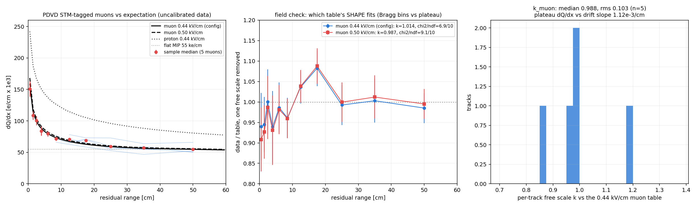
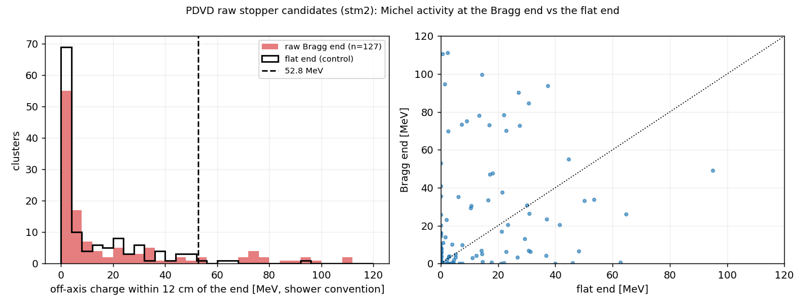

# Applying Wire-Cell pattern recognition to ProtoDUNE-VD: stopping muons + Michel electrons

**Scope: §§1–12 are the design round (2026-09-02, no code changed); §13 is
the execution round of the same day, which built the chain, ran it on the 120
PDVD data events of record and measured what §§7–10 left open.** Where §13
settles a number that §§7–12 called unmeasured, §13 governs and the earlier
section carries a pointer.

**Goal.** PDVD today ends at charge–light (Q/L) matching. We want it to
*select stopping muons that decay to a Michel electron*, and to use those
Michels for calibration: the absolute energy scale / recombination response,
and a second idea — using the **diffusion width** of a low-energy deposit to
localise it in drift. There is no beam neutrino in PDVD, so the taggers must
run on **all** matched cluster↔flash pairs, and much of the neutrino-topology
machinery SBND runs is surplus here.

**Companions.** [17_pdvd-clustering-qlmatching-chain.md](17_pdvd-clustering-qlmatching-chain.md)
(the chain as it stands), [09_pdvd-qlmatching.md](09_pdvd-qlmatching.md) and
[10_pdvd-ql-pending.md](10_pdvd-ql-pending.md) (the Q/L operating point),
[07_pdvd-tpc-geometry-fiducial.md](07_pdvd-tpc-geometry-fiducial.md)
(geometry and fiducial), and the SBND counterpart
`wcp-porting-img/sbnd/docs/sbnd-pattern-recognition.md`, which this document
deliberately mirrors section for section.

---

## Repro block

State this document was written against:

```bash
# toolkit @ 4be3f6df (branch apply-pointcloud), wcp-porting-img @ main
git -C /nfs/data/1/xqian/toolkit-dev/toolkit rev-parse --short HEAD
git -C /nfs/data/1/xqian/toolkit-dev/wcp-porting-img rev-parse --short HEAD
```

Every `file:line` citation below is against that toolkit commit. Note that the
working tree at time of writing carries an **uncommitted** doc-94 round-2/3
STM change; where a value differs between HEAD and the working tree this
document quotes **HEAD** and says so.

The commands that will produce this document's numbers once the design is
implemented (none has been run yet — see §10):

```bash
cd pdvd
./run_img_evt.sh   data <idx>                     # existing: per-event imaging
./run_clus_evt.sh  data -save-pctree <idx>        # M1: Q/L + pctree tarball
./run_pr_evt.sh    data -stm <idx>                # M3: PR job, STM on all pairs
./run_pr_evt.sh    data -nu  <idx>                # M5: + full PR -> Michel
# verdicts: grep "TaggerCheckSTM: cluster"  work/<RUN6>_<EVT>/wct_pr_*.log
#           grep "TaggerCheckTGM: cluster"  work/<RUN6>_<EVT>/wct_pr_*.log
# display:  work/<RUN6>_<EVT>/mabc-pr.zip  (clustering + dead + track_fit layers)
# dump:     work/<RUN6>_<EVT>/calib-pr-evt<ID>.json
```

---

## 1. Where PDVD is today

PDVD's clustering + Q/L graph is assembled in
`pdvd/wct-clustering.jsonnet:518-540`. It ends at

```
outnodes=[clus_all_tpc]
```

and stage 4's *entire* pipeline is two entries
(`cfg/pgrapher/experiment/protodunevd/clus.jsonnet:682-714`):

```
cm_old.switch_scope()      # apply the matched cluster T0 -> x_t0cor
cm.cathode_connect(...)    # stitch cathode crossers across x ~ 0
```

**Confirmed: nothing runs after Q/L matching.** There is no `steiner`, no
`fiducialutils`, no `tagger_check_*`, no `TrackFitting`, no recombination
model, no `ParticleDataSet`, no BDT scorer, no tracking visitor. A tree-wide
grep for `TrackFitting|track_fitting|Tracking` over
`cfg/pgrapher/experiment/protodunevd/` returns nothing.

One nuance worth stating, because the names mislead: PDVD *does* run
`cm.neutrino(protect_iso_band=true)` and `cm.isolated()`, but at **stage-3
drift-group scope** (`protodunevd/clus.jsonnet:527-528`), i.e. *before* the
matcher. Those are clustering-tail grouping passes, not pattern recognition.

PDVD is **not** a trimmed fork of SBND's `clus.jsonnet`. Both are built on the
shared `cfg/pgrapher/common/clus.jsonnet` vocabulary; PDVD adds a
per-drift-group stage SBND has no counterpart for, and lacks SBND's entire
`pr()` builder (`sbnd/clus.jsonnet:847-2647`, ~1800 lines), which is almost
the whole 846-vs-2676-line size gap.

One structural asymmetry to respect when adding the PR job: **PDVD's job entry
points live in the working repo, not in `cfg/`.** `pdvd/wct-clustering.jsonnet`
is resolved because `run_clus_evt.sh:274` does `cd "$PDVD_DIR"` first, while
`WIRECELL_PATH` supplies `toolkit/cfg` for the imports. PDHD is the same shape;
SBND is the odd one out. So the new PR driver belongs at
`pdvd/wct-pr-perevt.jsonnet`, not
`cfg/pgrapher/experiment/protodunevd/wct-pr-perevt.jsonnet`.

---

## 2. The three findings that shape the design

These were established by reading the code, and each one removes work that a
naive plan would have budgeted for.

### 2.1 "Run on all matched pairs" is a config setting, not a C++ change

- **STM already loops over every main cluster.** `TaggerCheckSTM::visit`
  admits any cluster carrying `Flags::main_cluster` and associates the
  companions sharing its `matched_flash_gid`
  (`clus/src/TaggerCheckSTM.cxx:499-527`). It is *not* restricted to a
  neutrino candidate — no such flag exists at that point in the chain.
- SBND narrows it to one bundle purely by configuration:
  `beam_window_only=true` with `[0.2, 2.2) us`
  (`sbnd/clus.jsonnet:2098-2100`). The **C++ defaults are `false / 0 / 0`**.
- The same gate,
  `beam_gate = beam_window_only && beam_window[1] > beam_window[0]`
  (`sbnd/clus.jsonnet:1810`), controls `steiner`, `tagger_check_tgm`,
  `tagger_check_stm`, `tagger_check_fc`, `protect_bundle` and
  `steiner_refresh`.
- **The full neutrino PR already runs per flash bundle.** `nu_per_bundle=true`
  is SBND production (`sbnd/wct-pr-perevt.jsonnet:1306`, with
  `nu_per_bundle_min_length=15`); it runs the PR chain **once per
  in-beam-window flash bundle** instead of once per event
  (`clus/src/TaggerCheckNeutrino.cxx:1874-1975`; rationale at
  `common/clus.jsonnet:546-558`).

**The trap.** It is tempting to write `beam_window_only=false`. That is
*wrong* for `TaggerCheckNeutrino`: with `beam_gate` false it takes the legacy
branch (`TaggerCheckNeutrino.cxx:1678-1691`), which picks **one arbitrary
main** (the loop overwrites `main_cluster` each iteration) and gathers
companions by `Flags::beam_flash` — a flag only `ClusteringTaggerFlagTransfer`
ever sets, and no SBND or PDVD config instantiates it. That is uBooNE's
single-bundle assumption, and on PDVD it would silently reconstruct one
cosmic per event.

**The PDVD recipe is therefore a *wide* window, not no window:**

```
beam_window_only = true
beam_window      = [<-T>, <+T>]   # spanning the whole readout, on cluster_t0
nu_per_bundle    = true
```

Every matched bundle is then "in window" and gets its own evaluation. **Zero
C++ change.** The one thing to verify on real data (M3) is that PDVD
`cluster_t0` values are populated and finite for every matched main and fall
inside the chosen window — `qlmatching.jsonnet:406-407` allows flash times of
±1 s, which is the flash *selection* range, not proof about `cluster_t0`.

The prerequisite is already met: `QLMatching`
(`match/src/QLMatching.cxx:1308-1342`) sets `main_cluster`,
`associated_cluster` and `matched_flash_gid` detector-agnostically, and PDVD
runs the same component.

### 2.2 The Michel finder already exists in the ported code

`clus/src/NeutrinoTaggerCosmic.cxx:788-1018` is, verbatim in its own comment,
a *"stopped-muon-with-Michel-electron test (flags 6-8)"*, ported from
`prototype_base/wire-cell/pid/src/NeutrinoID_cosmic_tagger.h:268-588`. It

- walks the segments at the main vertex (`segs_at_vtx(main_vertex, ...)`),
- picks the highest-energy shower starting there as `michel_ele` and records
  `michel_energy = shower->get_kine_best()`,
- separates the muon (pdg 13) and any long-muon chain,
- and fills `cosmict_7_*` / `cosmict_8_*` in `TaggerInfo`
  (`clus/inc/WireCellClus/NeutrinoTaggerInfo.h:1353-1369`).

**PDVD does not need a new Michel finder. It needs this one promoted from a
neutrino-rejection feature to the primary output.** Three checks scope that
work precisely:

1. **A readout path exists, but it is lossy.** `PrDisplayDump` writes
   `calib-pr-evt<ID>.json`, a read-only dump that is independent of the
   uBooNE-trained BDT scorers we are dropping. It emits `cosmict_flag_7`,
   `cosmict_flag_8`, `cosmict_7_filled` and `cosmict_8_filled`
   (`clus/src/PrDisplayDump.cxx:917-935`) — so the *verdict* survives the
   trim. It stops there: the sub-features (`cosmict_7_total_shower_length`,
   `cosmict_7_dQ_dx_end`, `cosmict_8_muon_length`, …) are not dumped, and
   **`michel_energy` is a local variable in the tagger that is never stored in
   `TaggerInfo` at all**. The accurate statement is: *the Michel finder exists
   and fires; its energy is not persisted.* M5 is a small, well-scoped
   persistence change (add `michel_energy` and the Michel shower's identity to
   `TaggerInfo`, then dump them), not a new algorithm.
2. **A single-track topology does get a main vertex.**
   `determine_main_vertex` handles `main_vertex_candidates.size() == 1`
   directly (`clus/src/NeutrinoVertexFinder.cxx:3964-3972`), and
   `init_first_segment` always seeds the two extremal-point vertices, so
   `segs_at_vtx(main_vertex, ...)` is not structurally empty for a stopping
   muon. Whether the mu->e kink actually yields a vertex candidate on real
   PDVD events is an **M5 acceptance test**, not something asserted here.
3. **Both `unmerge` stages drop out of the PDVD chain.** `unmerge_assoc` keys
   off `assoc_cluster_id` / `assoc_cluster_main`, which `isolated` writes only
   under `save_assoc_id` (C++ default false,
   `clus/src/clustering_isolated.cxx:584-598`) and which survive the pctree
   round trip only with MABC `save_assoc_cluster_id=true`
   (`common/clus.jsonnet:1208-1216`). SBND sets it
   (`sbnd/clus.jsonnet:254,330`); **PDVD does not**. `unmerge_bundle` undoes
   `examine_bundles`, which PDVD has deliberately commented out
   (`protodunevd/clus.jsonnet:529-538`). See §4.

Related machinery already in the tree, all C++-default OFF but **ON in SBND
production** (`clus/docs/knobs/sbnd-operating-point.md`):
`michel_stem_michel_check`, `michel_stem_muon_rescue`,
`shower_traj_michel_stem`; plus the `SegmentFlags` Michel-stem bit
(`clus/inc/WireCellClus/PRSegment.h:42-46`) and `track_owns_via_michel_stem`
in the particle-flow output (`clus/src/MultiAlgBlobClustering.cxx:1619-1651`).

### 2.3 The sign inversion — STM is a veto in SBND and the signal in PDVD

In SBND a false-positive STM throws away a neutrino, so the tuning effort has
gone into **suppressing** STM firing. In PDVD, STM-tagged **is the signal**:
efficiency and purity swap roles, and the operating point must be re-derived
rather than inherited. Three concrete consequences:

| SBND production (HEAD) | PDVD | why |
|---|---|---|
| `stm_accept_guards`, `stm_proton_muon_guard`, `stm_cathode_guard`, `stm_second_track_guard`, `stm_deficit_guard`, `stm_vertex_kink_guard`, `stm_vertex_hadron_guard` all **true** (`sbnd/clus.jsonnet:1073,1078,1083,1096,1103,1104,1137`) | start **OFF**, re-derive individually | each exists to abstain from an STM call so a neutrino survives; here each one rejects a good stopping muon |
| `nu_skip_cosmic=true`, `nu_skip_cosmic_bundle=true` | **false** | these skip STM/TGM-tagged mains from the neutrino PR — precisely the objects PDVD wants pushed *into* PR to reach the Michel |
| `stm_michel_res_cm=6.5` via `stm_d66_cuts` (`sbnd/clus.jsonnet:1169`) | re-derive | see below |

(`stm_descent_guard` is already false at HEAD, `sbnd/clus.jsonnet:1114`;
`stm_entry_rise_guard` is false at HEAD, `:1152`, and is under active revision
in the working tree — do not treat its working-tree parameters as shipped.)

**The STM Michel window is PDVD's signal-efficiency knob.** `eval_stm_core`
(`clus/src/TaggerCheckSTM.cxx:2738-2765`) rejects an STM call when the
*residual* past the muon's Bragg fit is both long and dense. It is a
seven-clause disjunction over `res_length` in {2, 4, `michel_res_cut`, 10, 16,
20 cm} and `ave_res_dQ_dx / mip_dqdx` in {1.2, 1.4, 1.45, 1.7, 1.85, 4.5}.
Read carefully, it does **not** reject Michels: the thresholds are placed so
that a Michel-sized residual survives while a second track or a hadronic mess
does not. Those seven clauses therefore *are* the mu+Michel acceptance window.
They were tuned on uBooNE and retuned on SBND (the `stm_d66_cuts` family), and
they must be re-derived for PDVD against hand-scanned stopping muons.

---

## 3. The intermediate file (Milestone 1)

The PR job needs the post-Q/L point-cloud tree persisted. PDVD already has the
save point, inert: a `TensorFileSink` in `dump_mode` at the tail of the
all-TPC stage (`protodunevd/clus.jsonnet:811-819`, writing
`trash-all-apa.tar.gz`) — exactly the node SBND turned into its real save
(SBND doc §3).

Design, knob default-OFF so today's outputs stay byte-identical:

1. `protodunevd/clus.jsonnet`, `clus_all_tpc(...)`: new argument
   `tensor_outname=''`. Empty (default) keeps `outname: 'trash-all-apa.tar.gz',
   dump_mode: true` — a no-op. Non-empty sets
   `outname: tensor_outname, prefix: 'clustering_', dump_mode: false`.
2. `pdvd/wct-clustering.jsonnet` threads a TLA; `run_clus_evt.sh` gains
   `-save-pctree`, writing `work/<RUN6>_<EVT>/pctree-evt<ID>.tar.gz`.

Container: the Wire-Cell TensorDM tar stream (`TensorFileSink` /
`TensorFileSource`, package `sio`), the same representation already flowing in
memory from QLMatching into the all-TPC MABC — so persisting it adds no new
conversion code.

**Round-trip inventory** (what must survive; all of it is on the tree at the
save point already):

| item | where it lives | consumer |
|---|---|---|
| live cluster/blob tree with `3d` sampled points | `/live` tree, per-blob local PCs | everything |
| dead (2-view) tree | `/dead` tree | `FiducialUtils::inside_dead_region`, STM |
| `x_t0cor` corrected coordinates | per-point arrays from `switch_scope` | PR runs in corrected scope |
| `cluster_t0` (ns), `matched_flash_gid` | `cluster_scalar` PC, written by QLMatching | the wide beam window, `nu_per_bundle` |
| `flag_main_cluster`, `flag_associated_cluster` | `cluster_scalar` | STM / neutrino main-cluster selection |
| `opflash` PC (flash x channel: gid, time, ch, pe) | root-node PC | Bee `op` layer, any light-aware tagger |
| run / subrun / event | tensor-set `ident` + job TLAs | bookkeeping, Bee labels |

Runtime-only state that does **not** persist and must be re-established by the
PR job: the active scope (which coordinate arrays are "default") and attached
utility objects (`FiducialUtils`, Steiner graphs). That is why `switch_scope`
and `fiducialutils` both reappear at the head of the PR pipeline.

Gate: the Q/L outputs (`mabc-*.zip`) must be byte-identical with the knob off,
compared by archive **member content hash** (`abtest/hash_archive.py`), never
by `md5sum` of the tarball.

---

## 4. The PDVD PR job — the trimmed chain (Milestones 2–3)

A new `pdvd/wct-pr-perevt.jsonnet`, forked by duplication from
`cfg/pgrapher/experiment/sbnd/wct-pr-perevt.jsonnet` (3636 lines). The SBND
file stays byte-for-byte untouched: it has live consumers.

SBND's production PR pipeline is 15 stages
(`sbnd_xin/run_pr_chain_batch.sh:154`):

```
switch_scope, unmerge_bundle, unmerge_assoc, steiner, fiducialutils,
tagger_check_tgm, tagger_check_stm, tagger_check_fc, protect_bundle,
steiner_refresh, tagger_check_neutrino, numu_bdt_scorer, nue_bdt_scorer,
tracking_visitor, tagger_output
```

### Keep / drop, with a dependency reason per row

| stage | PDVD | reason |
|---|---|---|
| `switch_scope` | **keep** | re-applies the flash T0; scope is not persisted in the tarball |
| `unmerge_bundle` | **drop** | undoes `examine_bundles`, which PDVD does not run (`protodunevd/clus.jsonnet:529-538`, commented out) |
| `unmerge_assoc` | **drop** | needs `assoc_cluster_id` / `assoc_cluster_main`, which PDVD's stage-3 `isolated` does not write (`save_assoc_id` unset) |
| `steiner` (retiler `improve_cluster_2`) | **keep** | STM's endpoint and path finding need the Steiner skeleton. Needs `require_beam_flash=false` (SBND M3 change 2) and PDVD per-(APA,face) samplers |
| `fiducialutils` | **keep** | every tagger silently returns false without it (`TaggerCheckSTM.cxx:3367-3369`) |
| `tagger_check_tgm` | **keep** | in an all-cosmic detector the through-going muon is the dominant background to STM; STM also skips TGM-tagged mains (`TaggerCheckSTM.cxx:550-553`) |
| `tagger_check_stm` | **keep — this is the signal** | guards off (§2.3), wide window (§2.1) |
| `tagger_check_fc` | **keep** | cheap, and the natural containment test for the Michel shower |
| `protect_bundle` + `steiner_refresh` | **keep** | ordering is load-bearing: refresh must follow with `replace=false`, else the STM-stage `GraphAlgorithms` dangle (`sbnd/clus.jsonnet:1989-1994`) |
| `tagger_check_neutrino` | **keep** | this is where trajectory + dQ/dx fitting, track/shower separation, PID **and the Michel finder** (§2.2) live |
| DL / SCN vertex (`dl_weights`) | **drop** (`dl_weights=''`) | there is no neutrino vertex to find; the only vertex in this topology is a track end the trajectory fit already gives. The weights are uBooNE-trained, and the DL path is excluded from our A/B gates because it is not bit-stable. Note it **is** ON in SBND production (`sbnd/clus.jsonnet:880`) despite the stale claim at `wct-pr-perevt.jsonnet:9-10` that it stays off |
| `numu_bdt_scorer`, `nue_bdt_scorer` | **drop** | uBooNE-trained BDTs over neutrino topologies; nothing in a mu->e decay reads their scores |
| single-photon / pi0 / NC machinery inside `tagger_check_neutrino` | **measure, then drop** | neutrino-topology only, but they are sub-steps of one component — retire on a firing census, not by assertion |
| `tracking_visitor`, `tagger_output` | **keep (fork)** | §9 |
| `pr_display` (`PrDisplayDump`) | **keep** | the Michel readout path (§2.2) |

The trim is expressed as configuration — `pipeline_names`, `dl_weights=''`,
knobs off — so every "drop" row costs one measured firing census on real PDVD
events to confirm, not a code deletion. Zero fires is not by itself proof a
stage is dead; distinguish "never applicable" from "pre-empted by an earlier
stage" before retiring anything.

### Prerequisites the PR job must assemble

Each of these is a component PDVD has never instantiated:

- **`ParticleDataSet`** — the dQ/dx and range reference tables (§7c).
- **A recombination model** — PDVD instantiates none today (§7c).
- **A track-fitting parameter file** — `pdvd_track_fitting.json` (§7b).
- **A fiducial** — `BoxFiducial` spanning both drift volumes plus margins,
  from [07_pdvd-tpc-geometry-fiducial.md](07_pdvd-tpc-geometry-fiducial.md)
  (§6). Do not invent one.
- **Steiner retiler samplers** per (APA, face) — 16 of them for PDVD.
- `WireCellRoot` must be loaded by the job even though PDVD has no SCE map, if
  the fork keeps SBND's `DetectorVolumes.uses` shape.

---

## 5. Michel identification — what the chain must emit

Operational definition of the object this chain produces, one row per matched
bundle that passes:

- the STM-tagged muon: cluster id, matched flash gid, `cluster_t0`, length,
  entry point, **stop point**;
- its fitted trajectory and dQ/dx profile vs residual range;
- the attached EM object: the shower whose start segment sits at the main
  vertex, its energy (`michel_energy`), its direction relative to the muon,
  and its distance from the muon stop point;
- containment verdicts (`Flags::FC`, and the fiducial distance of the stop);
- the muon–electron time separation where the topology resolves it;
- any additional isolated low-energy deposits near the stop (the "dots").

The route is §2.2: reuse `NeutrinoTaggerCosmic`'s flags-6-8 block; the scoped
work is **persisting** `michel_energy` and the Michel shower's identity into
`TaggerInfo` and emitting them from `PrDisplayDump`, plus a PDVD
`tagger_output` fork if a ROOT tree is wanted alongside the calib JSON.

Acceptance test for M5, stated before the run so it cannot be moved
afterwards: on a hand-scanned set of PDVD stopping-muon candidates, the
flags-6-8 block must *fire* (`cosmict_7_filled != 0`) on a stated fraction,
and the recovered `michel_energy` distribution must have support up to the
Michel endpoint. If the block does not fire, the fallback is a dedicated
extractor reading STM's stop point plus the nearest shower — but that fallback
should not be built before the measurement says it is needed.

---

## 6. Geometry — VD breaks SBND's inherited assumptions

Numbers from [07_pdvd-tpc-geometry-fiducial.md](07_pdvd-tpc-geometry-fiducial.md)
and `protodunevd/params.jsonnet`:

| | PDVD | SBND |
|---|---|---|
| anodes | **8**, two-sided -> **16** (anode, face) volumes | 2, one face each |
| drift volumes | **2** opposed: anodes 0–3 bottom (drift +x), 4–7 top (drift −x) | 2, cathode at x = 0 |
| W (collection) plane | \|x\| = **341.55 cm** | \|x\| = 202.05 cm |
| cathode surface | \|x\| = **3.0 cm** (`cpa_thick` 60 mm) | \|x\| = 0.45 cm |
| **drift distance** | **338.55 cm** (`cpa_plane`) | ~201 cm |
| pitch | U/V **7.65 mm**, W **5.10 mm** (`qlmatch/04:88`) | 3 mm all planes |
| response plane | 18.1 cm from collection | 10 cm |
| tick / nticks | 0.5 us / 6000 (data), 6400 (sim), 10000 (production window) | 0.5 us / 3427 |

Three consequences for the taggers:

1. **Cosmics enter from the top**, so the entry/exit asymmetry SBND's fiducial
   logic encodes does not transfer. The STM entry-face reasoning must be
   re-derived on the VD geometry.
2. **The drift is 1.7x longer than SBND's**, which is what makes §8's
   diffusion measurement plausible at all, and also what makes attenuation
   (electron lifetime) a first-order correction rather than a nuisance.
3. **The cathode is a central slab, not an edge**, so a "cathode crosser" is a
   single physical track split across two drift volumes — PDVD already handles
   this with `cathode_connect` before the PR job sees it.

Known 2-TPC risk points inside `TaggerCheckSTM`, recorded during the SBND port
and equally applicable here (audit these if PDVD results look wrong):

- `dist_to_anode` falls back to `|x|` for points outside all volumes
  ("preserves UBooNE behaviour") — wrong side for a −x-drift volume's corners.
- Several kink-detection helpers hard-code `drift_dir_abs(1,0,0)`; fine while
  drift is parallel to x, but sign-blind near the cathode.
- `shorted_y_w_range` is a uBooNE shorted-wire hack — leave unset.

---

## 7. Numbers to calibrate and set

Every row carries a provenance: **inherited** (a default nobody chose for
PDVD), **PDVD-measured**, or **unmeasured**.

### 7a. LAr transport and field

Drift speed is **settled** (below). The transport coefficients under it are
not, and remain the open half of this subsection.

Four different drift speeds are live in PDVD today:

| value | where | provenance |
|---|---|---|
| **1.568 mm/us** | `protodunevd/params.jsonnet:131`, `protodunevd/clus.jsonnet:44` | PDVD-measured (A↔C crossers, rescaled when the cathode moved 2.54 -> 3.0 cm) |
| **1.473 mm/us** | `protodunevd/simparams.jsonnet:13` — **used by imaging** via `img.jsonnet:4` | sim value |
| **1.48073 mm/us** | `run_clus_evt.sh:793-794` (`PDVD_DRIFT_SPEED_BOT/TOP_MMUS` defaults) | PDVD-measured, later round (W-decon A↔C crosser, run 039252 evt 298651) |
| 1.6 mm/us | `cfg/pgrapher/common/params.jsonnet:29` | inherited base default |

**SETTLED (owner, 2026-09-02): use the production Q/L matching value,
v = 1.48073 mm/us.** Everything downstream of the Q/L match — the trajectory
fit, dQ/dx, and the diffusion study in §8 — takes this number.

That choice is also the *self-consistent* one, which is worth showing rather
than asserting. `run_clus_evt.sh:793-794` sets
`PDVD_DRIFT_SPEED_BOT_MMUS` / `_TOP_MMUS` (both 1.48073), and
`pdvd/wct-clustering.jsonnet:322-331,395-405` threads that single pair into
**both** consumers:

- **QLMatching** — as the scalar `drift_speed` when the two crates agree (they
  do today), else as the per-input `drift_speeds` vector
  (`protodunevd/qlmatching.jsonnet:843-850`; C++ default 1.563,
  `match/inc/WireCellMatch/QLMatching.h:182`).
- **The clustering grouping** — as `drift_speed_b` / `drift_speed_t`
  (`protodunevd/clus.jsonnet:115,135`), overriding the 1.568 literal at `:44`.

The grouping value is what `TrackFitting::BuildGeometry` reads
(`m_grouping->get_drift_speed()`, `clus/src/TrackFitting.cxx:618`) to build
`slope_t` and the time-tick width (`:653`). So the number the owner picked for
Q/L is the same number the fit's geometry uses — the §7b consistency
requirement is satisfied automatically, not by coincidence but because one TLA
pair feeds both.

**Implementation requirement:** `pdvd/wct-pr-perevt.jsonnet` must take the
same TLAs and pass them the same way. A PR job that silently falls back to the
1.568 jsonnet default would place every fitted point ~0.5 % off in drift x and
would mis-scale `add_sigma_L` by 6 % (§7b).

The other two values remain live for other consumers and are **not** resolved
by this decision:

- **1.473 is the sim value.** It reaches the imaging *job* through
  `img.jsonnet:4` -> `simparams.jsonnet:13`, but **on data it is inert**, and
  that is worth knowing rather than guessing: imaging assigns no x at all.
  Blobs are written in (wire range, time slice) space, and the only place
  `params.lar.drift_speed` appears in `img.jsonnet` is as an argument to
  `img.dump(...)` (`:326,335,341,346,352,357`) whose body — a bare
  `ClusterFileSink` with `outname` and `format` — **never reads it**
  (`:299-311`). The x coordinate is created downstream, in the clustering
  job, by `BlobSampler::time2drift`:

      drift = (time + time_offset) * drift_speed;  x = xorig + xsign*drift

  (`clus/src/BlobSampler.cxx:177`), using the sampler's own configured speed,
  which PDVD sets per crate from the runner TLAs
  (`protodunevd/clus.jsonnet:189-193,246-247`) — i.e. 1.48073. So on data
  there is no blob-vs-fit drift-speed offset to correct.

  **On MC the mismatch is real**, just relocated: the sim `Drifter`
  (`cfg/pgrapher/common/sim/nodes.jsonnet:17-30`) drifts depos with
  `params.lar.drift_speed` = 1.473 *and* DL = 4.0 / DT = 8.8 / lifetime =
  1000 ms, so the tick<->x relation and the diffusion baked into simulated
  waveforms are the sim numbers, while reco samples them back at 1.48073.
  That is an MC-milestone item (§12), not a data-chain one.
- **1.6 is the inherited base default** and nothing chooses it.

Transport coefficients are equally split:

| quantity | PDVD reco | PDVD sim | provenance |
|---|---|---|---|
| `DL` | 7.2 cm²/s (`common/params.jsonnet:23`) | **4.0** (`simparams.jsonnet:10`) | reco = inherited base default; sim = SBND's pair, copied |
| `DT` | 12.0 cm²/s (`common/params.jsonnet:25`) | **8.8** (`simparams.jsonnet:12`) | same |
| lifetime | 8 ms (`common/params.jsonnet:27`) | 1000 ms (`simparams.jsonnet:8`) | reco inherited; sim effectively infinite |

**Resolved in §13.1:** `DL` = 4.12, `DT` = 7.82 cm²/s at the field implied by the
settled velocity (E = 0.44 kV/cm), now in `pdvd_track_fitting.json`.
Note that SBND's own reco `DL`/`DT` do not
come from `params.jsonnet` at all — they come from the runtime-loaded
`sbnd_track_fitting.json` (§7b), which is a separate knob that must be kept in
step with the sim values by hand.

**No E-field and no temperature value is configured anywhere in PDVD** (as of
the design round; §13.1 derives E = 0.44 kV/cm from the velocity).
`protodunevd/funcs.jsonnet:136-190` carries a complete Walkowiak
drift-velocity parameterisation that nothing calls; drift speed is a
data-calibrated literal instead. The nominal field is 500 V/cm (GDML
`volTPCActive` aux), which matters because the dQ/dx templates (§7c) are
field-specific.

### 7b. Reco-side track-fitting constants

`TrackFitting` is a library class, not a component
(`clus/inc/WireCellClus/TrackFitting.h`, `clus/src/TrackFitting.cxx`,
~9600 lines), instantiated by `TaggerCheckSTM` and `TaggerCheckNeutrino`. Its
~50 numeric parameters live in one struct
(`TrackFitting::Parameters`, `TrackFitting.h:36-193`) and are overridden
one-by-one from a JSON file named by the `trackfitting_config_file` knob.

Two properties of that file that determine how it must be validated:

- **It is read at runtime and never enters the compiled jsonnet.** A
  byte-identical compiled config therefore does **not** mean the fit is
  unchanged. Any A/B on these numbers needs an output-level gate, not a
  config diff.
- **Both taggers resolve the path through `WIRECELL_PATH`**
  (`Persist::resolve` at `TaggerCheckSTM.cxx:984` and
  `TaggerCheckNeutrino.cxx:3901`), so a relative name works. The
  `_comment_canonical` in `sbnd_track_fitting.json` claiming callers "must
  pass an ABSOLUTE path" is stale — worth fixing there when someone next
  touches that file.

**Consistency requirement (the key constraint): the fit's smearing function
must match the software filter that signal processing imprinted on the data.**
The uBooNE constants decode exactly to uBooNE's SP filters; SBND's were
re-derived from SBND's. PDVD's must be re-derived from PDVD's
(`protodunevd/sp-filters.jsonnet:94,111-114`):

| filter | uBooNE | SBND | **PDVD** |
|---|---|---|---|
| `Gaus_wide` sigma | 0.111408 MHz | 0.10 MHz | **0.12 MHz** (`_b` and `_t`) |
| `Wire_ind` | (1/sqrt(pi))·1.4 | (1/sqrt(pi))·1.05 | **(1/sqrt(pi))·5.0** |
| `Wire_col` | (1/sqrt(pi))·3.0 | (1/sqrt(pi))·3.60 | **(1/sqrt(pi))·10.0** |

Applying the SBND derivation (SBND doc §6.2) with PDVD's filters, PDVD's
pitches (U/V 7.65 mm, W 5.10 mm) and v = 1.568 mm/us:

| key | formula | SBND | **PDVD candidate** |
|---|---|---|---|
| `add_sigma_L` | [1/(2*pi*sigma_Gaus_wide)] * v_drift | 2.4876 | 1/(2*pi*0.12 MHz) = 1.32629 us; x **1.48073** = **1.9639** (see below; x 1.568 would give 2.0796) |
| `ind_sigma_u_T` | [(1/sqrt(pi))/Wire_ind] * pitch_U * 0.3 | 0.48359 | (0.564190/5.0) x 7.65 x 0.3 = **0.2590** |
| `ind_sigma_v_T` | ... * pitch_V * 0.5 | 0.80599 | (0.564190/5.0) x 7.65 x 0.5 = **0.4316** |
| `col_sigma_w_T` | [(1/sqrt(pi))/Wire_col] * pitch_W * 0.2 | 0.09403 | (0.564190/10.0) x 5.10 x 0.2 = **0.0575** |
| `DL` | physical, not filter-derived | 4.0e-07 | **4.12e-07** (§13.1) |
| `DT` | physical, not filter-derived | 8.8e-07 | **7.82e-07** (§13.1) |

**The formula is validated, not assumed.** Substituting SBND's own filters
(`Gaus_wide` 0.10 MHz, `Wire_ind` 1.05, `Wire_col` 3.60), pitch 3 mm and
v = 1.563 mm/us into the same four expressions reproduces the shipped
`sbnd_track_fitting.json` values exactly — 2.4876 / 0.48359 / 0.80599 /
0.09403 to five decimals. So the PDVD column is a substitution into a
checked formula, not a guess; what remains uncertain for PDVD is the
*inputs* (which drift speed, and the empirical trailing factors), not the
derivation.

Caveats to carry with that table: the trailing 0.2 / 0.3 / 0.5 factors are
empirical uBooNE tunings on top of the filter width and must be re-checked
against PDVD fit residuals; and if PDVD's SP filters are ever retuned this
file must be re-derived — note the dependency in any SP retune.

**Which drift speed goes into `add_sigma_L` is determined, not free.** The
filter width is a *time* quantity, independent of drift speed; the `v` in the
formula is purely the unit conversion into the length units `diff_sigma_L`
uses, and the result is then divided by a time-tick width built from
`m_grouping->get_drift_speed()` (`TrackFitting.cxx:618,653`). So `v` must be
**the drift speed the PR job configures on the grouping**, or the filter term
is mis-scaled against the tick axis it is divided by. SBND is the worked
example: its grouping is configured at 1.563 (`sbnd/clus.jsonnet:22,143`) and
its shipped `add_sigma_L` = 2.4876 is exactly 1/(2*pi*0.10)*1.563. (That this
coincides with SBND's *sim* value is incidental; the operative fact is that it
matches the grouping config.) For PDVD, §7a settles the grouping at the
production Q/L value 1.48073, so

    add_sigma_L = 1/(2*pi*0.12 MHz) x 1.48073 = 1.32629 us x 1.48073 = 1.9639

The 2.0796 in the table above is what the `protodunevd/clus.jsonnet:44`
default of 1.568 would give — keep it visible only as the **failure mode**: a
PR job that does not inherit the runner's drift-speed TLAs gets a 6 %
mis-scaled filter term.

One structural hazard specific to VD: PDVD sets drift speed **per crate**
(`drift_speed_bot` / `drift_speed_top`), while `pdvd_track_fitting.json` is a
single global file. Today both runner defaults are 1.48073 so one
`add_sigma_L` suffices — but if the two drift stacks are ever calibrated
separately, `add_sigma_L` cannot follow the split and the file becomes wrong
for one crate. Flag it if that divergence is ever proposed.

Other reco-side rows PDVD must set rather than inherit:

| knob | C++ default | SBND | note |
|---|---|---|---|
| `mip_dqdx` | 50000 e/cm (MicroBooNE) | 56000 | drives the STM flat template *and* the PR chain's `cal_4mom` amplitude |
| `mip_dqdx_median` | 43000 e/cm | 48000 (`sbnd/clus.jsonnet:1244`) | the shower-topology and PID median threshold |
| muon median-dQ/dx-vs-length envelope `c0 + c1*(pivot/L)^power` | {0.8866, 0.9533, 18 cm, 0.4234} (`NeutrinoPatternBase.h:2949`) | [0.8826, 1.0587, 18, 0.4745] (`sbnd/wct-pr-perevt.jsonnet:804`) | used at nine tagger sites |
| `div_sigma` | 0.6 cm | 6.0 (internal units) | charge-division Gaussian width |
| `dis_end_point_ext` | 0.45 cm | — | dQ/dx endpoint charge-collection radius |
| `lambda` | 0.0005 | 0.0005 | dQ/dx fit regularisation; x8/5 in multi-track, x0.01 when unregularised |

### 7c. dQ/dx templates, recombination, and the charge scale

**Templates.** The prototype read `g_muon` / `g_proton` / `g_electron` from
`input_data_files/stopping_ave_dQ_dx_v2.root`. The toolkit reads **no data
file**: the curves are inlined `LinterpFunction` tables aggregated by a
`ParticleDataSet` component. SBND's are in
`cfg/pgrapher/experiment/sbnd/particle_dataset.jsonnet` — five `*DeDx` tables
(dQ/dx in e/cm vs residual range, `start: 0.5 cm`, `step: 1.0 cm`, 60 points)
and five `*Range` tables (range cm -> KE MeV).

The critical provenance note, from that file's own header
(`particle_dataset.jsonnet:12-36`): **the five `*DeDx` tables are NOT
detector-agnostic.** They are dQ/dx after Modified-Box recombination *at a
specific drift field*; only the `*Range` tables are field-independent. SBND's
were regenerated at E = 0.5 kV/cm (they previously came verbatim from
MicroBooNE's 0.273 kV/cm), via

```
energy_loss/pion_travel/convert_field.C   # root -l -b -q 'convert_field.C(0.5, ...)'
energy_loss/docs/emit_jsonnet_dedx.py
```

with `dQ/dx = ln(alpha + beta'*dE/dx) / (beta' * W_ion) * 0.85`, `alpha = 0.93`,
`beta = 0.212`, `rho = 1.38 g/cm^3`, `W_ion = 23.6 eV`, `beta' = beta/(rho*E)`.
PDVD's nominal field is also 500 V/cm, so SBND's tables looked like a defensible
starting point — **superseded in §13.1: PDVD's own tables were generated at the
velocity-implied 0.44 kV/cm** (`cfg/pgrapher/experiment/protodunevd/particle_dataset.jsonnet`). The undocumented `0.85` scale is deliberately retained on the
SBND side pending a real charge calibration; PDVD should not silently inherit
it once a PDVD charge calibration exists.

**Recombination.** PDVD instantiates **no** recombination model today. The
available classes (`gen/inc/WireCellGen/RecombinationModels.h`,
`PracticalRecombinationModels.h`):

| class | constants |
|---|---|
| `BirksRecombination` | E 500 V/cm, A3t 0.8, k3t 0.0486, rho 1.396, Wi 23.6 eV |
| `BoxRecombination` (Modified Box) | E 500 V/cm, A 0.930, B 0.212, rho 1.396, Wi 23.6 eV — **WCT units** |
| `PracticalBoxRecombination` | same arithmetic in **practical units** (kV/cm, g/cm^2/MeV) |
| `PowerBoxRecombination` | A 0.93, k 0.282371, p 1.362179, **C 0.855175**, pivot 2.1 MeV/cm, Wi 23.6e-6, dedx_max 77.0; R = ln(A+u)/u, u = k*(dEdx/pivot)^p |

`RecombinationModels.h:49-64` warns explicitly that the WCT-unit and
practical-unit variants are **not** interchangeable — the mismatch is wrong by
`units::cm/units::MeV = 10` in the quenching term and moved a MIP from 2.10 to
1.37 MeV/cm on 23 of 35 uBooNE events. Pick the Practical variant when the
parameters are quoted in practical units.

SBND ships both `PracticalBoxRecombination` (A 1.0, B 0.255, E 0.5, rho 1.38,
Wi 23.6e-6) and a `PowerBoxRecombination` **fitted to SBND stopping-track
dQ/dx vs residual range** (`sbnd/clus.jsonnet:1835-1848`; canonical parameters
in `sbnd_xin/nusel_display/stm_ref_dqdx.json`), selected by
`use_power_recomb=true`.

**Name the circularity, because it is the plan:** the STM sample this chain is
built to select is *exactly* the sample that fits PDVD's own power-box
recombination. M7 closes that loop — the first pass runs on SBND's
recombination and templates, and the stopping muons it finds supply the fit
for PDVD's own.

**Charge-scale constants.** The charge->energy conversion is
`overall / recom_factor / fudge_factor * w_value` (`NeutrinoEnergyReco.cxx:188`):

| knob | C++ default | SBND |
|---|---|---|
| `kine_recom_factor` | 0.7 | **0.87** |
| `kine_proton_recom_factor` | 0.35 | **0.51** |
| `kine_shower_recom_factor` | 0.5 | **0.58** |
| `kine_shower_fudge_factor` (the EM charge scale) | 0.8 | **0.86** |
| `fudge_factor` (track) | 0.95 | 0.95 |
| `w_value` | 23.6 eV | 23.6 eV |

Naming discipline, because this is easy to get wrong: there is **no** constant
called a "flip fudge factor", and four *distinct* 0.85–0.86 numbers exist that
must not be conflated —

1. `kine_shower_fudge_factor` = 0.86, the EM charge scale
   (`NeutrinoPatternBase.h:46`, `sbnd/wct-pr-perevt.jsonnet:777`);
2. SBND's Q/L `data_qtol` = 0.86 (`sbnd/qlmatching.jsonnet:71`), a
   light-prediction scale applied only on data;
3. the dQ/dx table generator's undocumented 0.85
   (`particle_dataset.jsonnet:27`);
4. `PowerBoxRecombination`'s normalisation `C = 0.855175`.

**The headline for the whole of §7:** `clus/docs/knobs/README.md` records that
**192 of the knobs present in SBND's production config differ from their C++
default.** So a PDVD chain that simply instantiates the components and
inherits the C++ defaults inherits **uBooNE**, not SBND. PDVD needs its own
operating-point delta file, generated the same way:

```bash
python3 clus/docs/knobs/knob_delta.py \
    clus/test/doctest_clus_knob_defaults.cxx  <a compiled PDVD PR job>
```

(the second argument must be a *compiled job*, not an imported module — a
`clus.jsonnet` compiles to `{}` because its fields are hidden).

### 7d. The light side

State the shape correctly, because the usual vocabulary does not apply:
**there is no PE-per-MeV, QE, scintillation yield or prompt/late fraction
anywhere in `match/`.** The entire light-yield chain is one product
(`match/src/QLMatching.cxx:1911-1914`):

```
pred_PE[det] = q * QtoL * direct_visibility * VUVEfficiency[det]
             + q * QtoL * reflected_visibility * VISEfficiency[det]
```

PDVD's values are already calibrated
(`cfg/pgrapher/experiment/protodunevd/qlmatching.jsonnet`):

| quantity | PDVD | note |
|---|---|---|
| `QtoL` | **0.094** (`:316`) | PDVD-measured from 80 beam-flash gold pairs |
| `doReflectedLight` | **false** (`:317`), `VISEfficiency` all zero (`:255`) | the library visibility is total arrival |
| per-type efficiency scales | cathode XA x10.116, membrane XA x1.655, PMT x0.352 (`:234-236`) | PDVD-measured from crosser anchors |
| light model | library, Ar/128 nm, `pdvd-photlib-vis-v5-128nm.json` (`:330`) | |

One recorded caveat matters directly here: the library + official-efficiency
model **over-predicts by ~10x as a single global normalisation**
(`qlmatching.jsonnet:307-308`), attributed to a units/recombination/SPE-scale
product. That global normalisation is degenerate with the charge scale a
Michel energy calibration is trying to measure — so the two must not be tuned
against each other without an external anchor.

Also open on the light side: the pending items in
[10_pdvd-ql-pending.md](10_pdvd-ql-pending.md) §3, and the **+0.75 us
self-trigger offset** found in [23_pdvd-light-timing-check.md](23_pdvd-light-timing-check.md),
whose correction is owner-gated because it would move reconstructed light
times unconditionally.

### 7e. Michel-specific numbers

Three numbers this analysis needs that are not in the toolkit at all:

- the **Michel spectrum endpoint** (~52.8 MeV), the standard candle for the
  absolute energy scale;
- the **mu- capture-vs-decay fraction in argon**, which sets how many stopping
  mu- produce a Michel at all and therefore the efficiency denominator;
- the **effective muon lifetime in argon** (mu+ free lifetime vs the shortened
  mu- lifetime under capture), for the decay-time exponential fit.

**Cite a published source in this document for each before using it.** They
are deliberately left blank here rather than filled from memory.

---

## 8. Diffusion-based drift localisation for low-energy deposits

The owner's second use for this sample: for a low-energy deposit with no
independent t0, measure its **diffusion width** and infer how far it drifted.

The fitter already carries exactly this model, which is convenient — the study
measures the same quantity the fit predicts, not a new formalism
(`clus/src/TrackFitting.cxx:6859-6867`):

```
drift_time   = max(min_drift_time (50 us), drift_distance / drift_speed)
diff_sigma_L = sqrt(2 * DL * drift_time)
diff_sigma_T = sqrt(2 * DT * drift_time)
sigma_L      = hypot(diff_sigma_L, add_sigma_L)      / time_tick_width
sigma_T_{u,v,w} = hypot(diff_sigma_T, {ind,ind,col}_sigma_T) / pitch_{u,v,w}
```

So the observable is always diffusion added **in quadrature** with an
instrumental term set by the SP filter. The design question is which view to
use, and at PDVD the two behave oppositely.

Substituting the PDVD geometry at the settled velocity (§7a): drift distance
338.55 cm at v = 1.48073 mm/us gives t = 338.55 / 0.148073 = **2286 us**.

| | diffusion sigma at full drift | instrumental sigma (†) | sampling |
|---|---|---|---|
| **longitudinal** | sqrt(2 x 4.0 x 2.286e-3) = **1.35 mm** (DL = 4.0) ; **1.81 mm** (DL = 7.2) | `add_sigma_L` = **1.96 mm** | 0.740 mm per 0.5 us tick |
| **transverse (W)** | sqrt(2 x 8.8 x 2.286e-3) = **2.01 mm** (DT = 8.8) ; **2.34 mm** (DT = 12) | `col_sigma_w_T` = **0.058 mm** | 5.10 mm pitch |

(†) Both instrumental values are the §7b **derived candidates**, not measured
PDVD numbers (`add_sigma_L` does follow from the settled drift speed, but the
0.2/0.3/0.5 trailing factors behind both are uBooNE tunings). The 35x
transverse-dominance claim below inherits that caveat and must be re-checked
once PDVD fit residuals exist.

- **Longitudinal: well sampled, but instrument-dominated.** The observed width
  runs from 1.96 mm at the anode to hypot(1.96, 1.35) = 2.38 mm at the cathode
  (DL = 4.0), i.e. 2.65 -> 3.22 ticks — a swing of about **half a tick across
  the full drift**. (At DL = 7.2 it reaches 2.67 mm = 3.61 ticks, so the
  measurement's own sensitivity to DL is comparable to its sensitivity to
  drift distance — which is exactly why the two must be fitted together.) It
  is measurable on an ensemble, marginal per-event, and it requires the filter
  width to be known to roughly 1%.
- **Transverse: diffusion-dominated, but under-sampled.** The instrumental
  term is 35x smaller than the diffusion term, so the *relative* signal is
  far larger — the observed width changes by a factor of ~35 across the drift
  rather than 21%. But 2.01 mm is only **0.39 of the W pitch** (0.26 of the
  7.65 mm U/V pitch), so the charge lands on one or two wires and the
  observable is adjacent-wire charge *sharing*, not a fitted per-hit width.
  VD's coarse CRP pitch is what costs here; SBND's 3 mm pitch would be kinder.

**Drift-speed dependence.** All of the above uses the settled production
value v = 1.48073 mm/us (§7a). For reference, had the 1.568 jsonnet default
been used instead, the drift time would be 2159 us — every diffusion sigma
~2.9% smaller and `add_sigma_L` ~5.9% larger. That is the scale of the error a
PR job that fails to inherit the runner's TLAs would introduce, and it is
comparable to the effect being measured, so the drift speed must be stated
wherever these numbers are re-derived.

**The calibration route.** Either way the natural calibrator is **Michels
whose t0 is already fixed by the flash match**. They supply (drift distance,
observed width) pairs across the whole drift, which determines the
instrumental intercept and D simultaneously — the intercept at zero drift is
the filter term, the slope in sqrt(t) is D. Recommend cross-checking on the
*tight* filter or a dedicated wide-band deconvolution, since `Gaus_wide` is
what sets `add_sigma_L`; and note the `min_drift_time = 50 us` floor in the
model above, harmless here (it corresponds to sigma_diff ~ 0.2 mm) but worth
knowing when interpreting near-anode points.

This is what makes `DL` and `DT` **first-class PDVD deliverables** rather than
fit parameters — and recall from §7a that PDVD reco and PDVD sim currently
disagree on both. That disagreement bites specifically when this measurement
is repeated on MC: the diffusion actually present in simulated waveforms is
whatever the sim `Drifter` applied (4.0 / 8.8), so an MC study measures the
sim's input, not the detector's. On data the measurement is of the real
thing.

---

## 9. Auxiliary tools and the validation chain

### 9.1 Magnify-tracking for PDVD

Today PDVD has only the *waveform* Magnify: `protodunevd/magnify-sinks.jsonnet`
(8 pipe flavours, all `MagnifySink`) driven by `pdvd/wct-sp-to-magnify.jsonnet`
and `pdvd/run_sp_to_magnify_evt.sh`, viewed with `Magnify-PDVD`.

Track overlay is **SBND-only**:

| piece | where |
|---|---|
| STM-stage writer | `root/src/SbndMagnifyTrackingVisitor.cxx` -> `tracking-stm.root`, from the `save_stm_fit` point clouds |
| PR-stage writer | `root/src/SbndPrMagnifyTrackingVisitor.cxx` -> `tracking-pr.root`, from the PR `TrackFitting` slot + PRGraph |
| converter | `root/apps/wire-cell-sbnd-magnify-tracking-convert.cxx` |
| viewer | `Magnify-tracking-SBND` (ROOT GUI; `T_rec_charge`, `T_proj_data`, `T_bad_ch`, `Trun`) |
| format reference | `clus/docs/magnify_tracking_output.md` |

**The causal point:** a tracking visitor writes *fitted track segments*, and
only the PR stage produces those. So "Magnify-tracking for PDVD" is downstream
of §4 — it is not a viewer or config task that can be done first.

**Fork only if needed** — measured in §13.5: the fork IS needed (PDVD's two
faces per CRP carry different channel sets, so the face-agnostic scheme
collides). Both SBND visitors derive the global channel scheme from the
configured anodes at visit time
(`global = plane_base[p] + apa * nch[p] + wire`, with `nch[p]` taken from the
anodes), and the PR-stage one uses the per-point `(apa, face)` recorded in
`PR::Fit::paf`. That is more general than SBND needs. So **first test whether
a PDVD configuration alone suffices**; fork a `PdvdMagnifyTrackingVisitor`
only if PDVD's 16 (anode, face) volumes break it. Duplicating is the right
move if a fork is needed — do not extract a shared helper out of the SBND
file, which has live consumers.

Also relevant: in magnify ROOT files `h*_orig0` is **pre**-NF raw ADC and
`h*_raw0` is **post**-NF. Never read "raw" as unfiltered.

### 9.2 The rest of the validation chain

- **Bee.** `mabc-pr.zip` gains `track_fit`, `shower_track` and `vertices`
  layers on top of `clustering` and `dead`; `save_stm_fit` additionally
  produces a Bee `stm_fit` layer showing the per-pass STM trajectory fits
  (including rejected passes) at no extra cost. Existing `run_bee_*` scripts
  package these.
- **Existing PDVD viewers to reuse**, not rebuild: `ql_display` and `ql_scan`
  (label/decision infrastructure with committed decision sets), `img_plot`
  (Bokeh imaging display), `pd_plot`, `nf_plot`, `sp_plot`, `drift_calib`.
- **A PDVD `pr_scan` hand-scan sheet** for STM / Michel labels. One rule from
  hard experience: keep it **blind** — never print the algorithm's verdict on
  the image being judged, or the agreement number is circular.

### 9.3 Gates

- **M1 byte-identity.** PDVD Q/L outputs must be unchanged with
  `tensor_outname` empty, compared by archive member content hash
  (`abtest/hash_archive.py`). Never `md5sum`/`cmp` on a tarball or zip — they
  embed timestamps and will report a regression that does not exist.
- **Shared components gate every detector that binds them.** Anything touched
  in `clus/`, `match/` or `cfg/pgrapher/common/` must keep SBND *and* the
  uBooNE `qlport` reference byte-identical, not just PDVD.
- **Freshness.** Runtime loads plugins from `local/lib`, not `build/`. After
  `wcbuild`, confirm the library mtime is newer than the last source edit
  before believing any A/B — a stale library makes a comparison vacuously
  pass.
- **Data self-consistency stands in for truth** (there is no MC in the first
  pass): a Bragg peak present at the stop; the mu decay-time distribution
  exponential with the argon lifetime; the Michel energy spectrum ending at
  the endpoint; dQ/dx vs residual range tracking the muon template; and the
  calibrated dQ/dx being independent of drift distance once lifetime and
  recombination are applied.

### 9.4 The PDVD operating-point idiom

PDVD keeps its jsonnet defaults OFF and byte-identical, and turns the
production operating point on through **`run_clus_evt.sh` environment
defaults** ([17_pdvd-clustering-qlmatching-chain.md](17_pdvd-clustering-qlmatching-chain.md)
"Operating point is ON via the runner"). The PR runner must follow the same
convention, or the two halves of the chain will drift apart in how they are
configured and neither will be reproducible from the config alone.

---

## 10. Milestones

| M | deliverable | done when |
|---|---|---|
| **M1** | pctree save | `tensor_outname` knob added; PDVD Q/L outputs byte-identical with it empty (hash gate, label reported); tarball written and readable |
| **M2** | PR job round-trip gate | `pdvd/wct-pr-perevt.jsonnet` loads the tarball with an empty pipeline and reproduces the Q/L `clustering` Bee layer content-identically |
| **M3** | STM on all matched pairs | wide `beam_window` + `nu_per_bundle=true`; `cluster_t0` verified in range for every matched main; STM/TGM verdicts appear for every bundle; **firing census** of all guards and of the drop-row stages in §4 |
| **M4** | trajectory + dQ/dx | PDVD `particle_dataset.jsonnet`, `pdvd_track_fitting.json` (§7b), a recombination model, a PDVD fiducial; fits complete on the 16-volume geometry; dQ/dx-vs-residual-range plots for hand-scanned stopping muons |
| **M5** | Michel identification | does the flags-6-8 block fire on PDVD stopping muons (acceptance test in §5)? then persist `michel_energy` + shower identity into `TaggerInfo` and `PrDisplayDump` |
| **M6** | Magnify-tracking PDVD | config-only test first; fork the visitor only if the 16-volume geometry breaks it |
| **M7** | calibration extraction | PDVD `PowerBoxRecombination` fitted on the STM sample; `DL`/`DT` from the flash-t0-anchored width-vs-drift fit (§8); Michel endpoint as the absolute-scale anchor |

Sequencing note: §7a is settled (v = 1.48073), so M4 is unblocked; M6 and M7
both depend on M4, and M5 can proceed in parallel with M6.

---

## 11. Attention points (gotchas)

1. **`beam_window_only=false` is the wrong way to run on everything.** Use a
   wide window plus `nu_per_bundle=true` (§2.1). The false path silently
   reconstructs one arbitrary cosmic per event.
2. **`nu_skip_cosmic` must be false for PDVD.** With SBND's setting the
   neutrino PR skips exactly the STM-tagged mains whose Michels we want.
3. **A byte-identical compiled config does not mean the fit is unchanged.**
   `pdvd_track_fitting.json` is read at runtime (§7b).
4. **The STM guards are backwards for this analysis.** Every one of them
   exists to abstain from an STM call (§2.3).
5. **Drift speed is settled at 1.48073 mm/us** — the production Q/L value
   (§7a). The PR job must inherit the runner's `drift_speed_bot/top_mmus`
   TLAs; falling back to the 1.568 jsonnet default mis-places every fitted
   point by ~0.5 % in x and mis-scales `add_sigma_L` by 6 %. Note separately
   that *imaging* still runs at the sim value 1.473.
6. **`fiducialutils` must precede every tagger**, or they silently return
   false with no error.
7. **`tagger_check_tgm` must precede `tagger_check_stm`**; STM skips
   TGM-tagged mains.
8. **`steiner_refresh` must use `replace=false`** and follow `protect_bundle`
   immediately.
9. **`CreateSteinerGraph` needs `require_beam_flash=false`.** Its default is
   uBooNE-only behaviour, and with the default the steiner stage silently
   processes *nothing* on a chain whose flags come from `QLMatching`.
10. **Do not edit another experiment's configs** as a side effect, and do not
    modify the SBND PR job — fork it.
11. **Docs and outputs live in two repos.** Anything under `pdvd/` is
    committed in `wcp-porting-img`, not in the toolkit; `*.sh` there is
    gitignored and needs `git add -f`.
12. **Never regenerate over an existing label or snapshot directory.** A new
    run gets a new tag.

---

## 12. Open items

- ~~**Which drift speed?**~~ **CLOSED (owner, 2026-09-02):** use the
  production Q/L matching value, v = 1.48073 mm/us (§7a). M4 is unblocked.
- **Sim/reco drift-speed and diffusion mismatch, on MC only.** The sim
  `Drifter` uses 1.473 mm/us with DL = 4.0 / DT = 8.8 / lifetime = 1000 ms
  (`cfg/pgrapher/common/sim/nodes.jsonnet:17-30` fed by
  `simparams.jsonnet:8-13`), while reco samples and fits at 1.48073. On MC
  that is a 0.5 % x-scale error plus a diffusion model that does not match
  what is in the waveforms — the same caveat SBND recorded for its own
  track-fitting diffusion values. **Not** an issue on data, where imaging
  assigns no x (§7a). Quantify before the MC milestone, not before the
  data-first pass.
- **PDVD sim vs reco transport mismatch** — `DL`, `DT` and lifetime all differ
  between `params.jsonnet` and `simparams.jsonnet`, and neither pair was
  measured for PDVD. Reported, not fixed.
- **No E-field or temperature is configured** anywhere in PDVD, while a full
  Walkowiak parameterisation sits unused in `funcs.jsonnet`.
- **The +0.75 us light self-trigger offset** from doc 23 remains owner-gated;
  it would shift `cluster_t0` for every matched pair.
- **The three Michel-physics constants** in §7e need published sources before
  use.
- **The §4 drop rows** are provisional until the M3 firing census confirms
  them. Zero fires alone does not retire a stage.
- **Whether the flags-6-8 Michel block fires** on PDVD topologies (M5
  acceptance test). If it does not, a dedicated extractor is the fallback —
  but only after the measurement says so.

---

## 13. Execution round (2026-09-02) — the chain built, run and measured

### Repro block

```bash
# toolkit (branch apply-pointcloud) + wcp-porting-img main at the commits named in the milestone log
cd /nfs/data/1/xqian/toolkit-dev/wcp-porting-img/pdvd

# 13.1 physics inputs
python3 stm/pdvd_transport.py --tsv stm/pdvd_transport.tsv        # E-field, DL, DT, sigma-vs-drift
( cd ../../energy_loss/pion_travel && root -l -b -q 'convert_field.C(0.44, "stopping_ave_dQ_dx_pdvd.root", true)' \
    && root -l -b -q 'convert_field.C(0.50, "stopping_ave_dQ_dx_pdvd050.root", true)' )
python3 ../../energy_loss/docs/emit_jsonnet_dedx.py ../../energy_loss/pion_travel/stopping_ave_dQ_dx_pdvd.root
python3 stm/make_pdvd_ref_dqdx.py                                   # stm/pdvd_ref_dqdx.json (self-gated)

# 13.2 M1 gate (knob off vs on, 3 events) and 13.3 M2 round trip
for t in m1gate m1on; do for re in "39252 0" "39253 0" "39349 0"; do ./scripts/stage_ql_tag.sh $re $t; done; done
PDVD_LIGHT_SUFFIX=_keep ./run_clus_evt.sh -s m1gate -calib 39252 0            # knob OFF
PDVD_LIGHT_SUFFIX=_keep ./run_clus_evt.sh -s m1on   -calib -save-pctree 39252 0   # knob ON
python3 ../abtest/hash_archive.py work/039252_0_m1gate/mabc-all-apa.zip work/039252_0_m1on/mabc-all-apa.zip
./run_pr_evt.sh -s m1on -pipe switch_scope 39252 0                            # M2: mabc-pr.zip clustering layer

# 13.4-13.7 the campaign arms (120 events); pin the libraries first (feedback: a peer's wcbuild swaps local/lib mid-arm)
mkdir -p /home/xqian/tmp/pinlib && cp -p ../../toolkit/build/*/libWireCell*.so /home/xqian/tmp/pinlib/ && export LD_LIBRARY_PATH=/home/xqian/tmp/pinlib:$LD_LIBRARY_PATH
PDVD_MAX_JOBS=6 ./stm/run_campaign.sh stm1 all                      # full chain (-nu -stm-fit): stage -> clus(-save-pctree -calib) -> pr; 3-80 min/event at the 500 e floor
PDVD_MAX_JOBS=12 STM_PR_MODE=-stm ./stm/run_campaign.sh stm2 all    # cosmic-tagger arm (-stm -stm-fit), ~1 min/event -- the population arm of 13.6
./stm/run_analysis.sh stm2                                          # census, contrast census, STM sample + tiers, dQ/dx field check, Michel routes 3-4
./stm/run_michel_subset.sh stm2 stm3 stm/michel_subset_events.txt 6 # full chain on the contrast >= 1.5 events (Michel routes 1-2 need -nu dumps)
./stm/run_analysis.sh stm3
# Magnify-tracking-PDVD, headless
wire-cell-sbnd-magnify-tracking-convert -bwork/039252_0_m1on/tracking-stm.root -tT_rec_charge -ostm/magnify/track_com_298567_stm.root -f2
( cd /nfs/data/1/xqian/toolkit-dev/Magnify-tracking-PDVD/scripts && xvfb-run -a -s "-screen 0 1920x1080x24" \
    root -l -q loadClasses.C '/home/xqian/tmp/drive.C("<track_com>.root","<out>.png")' )   # drive.C: doc 43 recipe
```

### 13.1 Physics inputs (asks 1–3)

**E-field and diffusion from the velocity.** The BNL LAr-properties page
(`lar.bnl.gov/properties`) is a JavaScript application; its formulas were read
out of `assets/trans.js` / `assets/index.js` and re-implemented in
`stm/pdvd_transport.py` on top of the mobility fit already in
`energy_loss/docs/deduce_efield.py`:

    mu(E,T)   = (a0 + a1 E + a2 E^1.5 + a3 E^2.5) / (1 + (a1/a0) E + a4 E^2 + a5 E^3) (T/89 K)^-3/2
    eps_L     = (b0 + b1 E + b2 E^2) / (1 + (b1/b0) E + b3 E^2) (T/87 K)     [2026 refit, what the site uses]
    D_L = mu eps_L,   D_T = D_L / (1 + (E/mu) dmu/dE)

with a = {551.6, 7158.3, 4440.43, 4.29, 43.63, 0.2053}, b = {0.0075, −13.376,
−10.9568, 646.523}; the implementation reproduces the site's anchors (uB 1.099
vs 1.101 mm/us @ 273 V/cm 89 K; PDSP 1.561 vs 1.560 @ 486.7 V/cm 87.7 K).

| T | v [mm/us] | E [kV/cm] (BNL / LArSoft) | DL [cm²/s] | DT [cm²/s] |
|---|---|---|---|---|
| **87.68 K** (dunecore `protodunevd_detproperties`) | **1.48073** (settled, §7a) | **0.439 / 0.435** | **4.12** | **7.82** |
| 87.3 K (site default) | 1.48073 | 0.434 / 0.429 | 4.13 | 7.81 |
| 87.68 K | 1.568 (older calibration) | 0.491 / 0.489 | 4.12 | 8.17 |
| 87.68 K | planned 0.495 → v | 1.575 / 1.577 | | |

**Owner decision (2026-09-02): trust the data-calibrated velocity; T is the
soft input; the dQ/dx-vs-residual-range comparison with data is the
confirmation of the field.** Adopted: **E = 0.44 kV/cm, DL = 4.12, DT =
7.82 cm²/s** (JSON: 4.12e-7 / 7.82e-7). The settled velocity sits ~11 % below
the planned field; the older 1.568 calibration was at nominal — the data test is
§13.6. SBND's revert to its sim pair (doc 66) was an MC-consistency decision;
PDVD runs on data here, so the physical pair applies (an MC arm must use the
sim pair 4.0/8.8, §12).

**Smearing (ask 2).** `cfg/pgrapher/experiment/protodunevd/pdvd_track_fitting.json`
is the SBND file with exactly the six detector keys replaced (the whole
uBooNE→SBND porting surface, verified by diff): `add_sigma_L` 1.9639 mm
(= 1/(2π·0.12 MHz) × 1.48073), `ind_sigma_u_T` 0.2590, `ind_sigma_v_T` 0.4316,
`col_sigma_w_T` 0.0575 mm (PDVD `Gaus_wide_{b,t}` 0.12 MHz, `Wire_ind` (1/√π)·5.0,
`Wire_col` (1/√π)·10.0, pitches 7.65/7.65/5.10 mm; only `Gaus_wide` is consumed
by OmnibusSigProc — `Gaus_tight` is dead config in both detectors), `DL`/`DT`
above. The uBooNE trailing 0.2/0.3/0.5 factors and every selection knob are
inherited unchanged and say so in the file's comments. At the settled point the
§8 table becomes: σ_L 1.97 → 2.40 mm (2.67 → 3.24 ticks) and σ_T,W 0.29 →
1.89 mm (0.056 → 0.37 pitch) from the anode to the full drift
(`stm/pdvd_transport.tsv`).

**dQ/dx tables, MIP scale, recombination (ask 3).**
`energy_loss/pion_travel/convert_field.C(0.44, …)` and `emit_jsonnet_dedx.py`
produced `cfg/pgrapher/experiment/protodunevd/particle_dataset.jsonnet`
(five `*DeDx` tables at 0.44 kV/cm; the five `*Range` tables copied from SBND
unchanged, verified equal after compilation). A 0.50 kV/cm comparison set
lives in `stopping_ave_dQ_dx_pdvd050.root` and in `stm/pdvd_ref_dqdx.json`
(`*DeDx_E050`), which is self-gated against the compiled jsonnet before it is
written. Consequences: muon plateau 53798 (0.44) vs 54658 e/cm (0.50), Bragg
bin 158255 vs 168151, MIP 52481 vs 53266. Following SBND's rule (56000 =
plateau × 1.0246), **`mip_dqdx` = 55000** and **`mip_dqdx_median` = 47000**
(48000 scaled by the table ratio). The PR job's recombination model is
`PracticalBoxRecombination{A 0.93, B 0.212, Efield 0.44, rho 1.38, Wi 23.6e-6}` —
the tables' own parameter set (SBND's A 1.0/B 0.255 is a different set);
`use_power_recomb=false` until M7 fits a PDVD power box.

### 13.2 M1 — the pctree save (gate `stm/gates/m1gate_hashes.txt`)

`protodunevd/clus.jsonnet` `clus_all_tpc(..., tensor_outname='')`: empty keeps
the inert dump-mode sink (`trash-all-apa.tar.gz`); non-empty turns the same
`TensorFileSink` into the real writer. Threaded as `pctree_outname` in
`pdvd/wct-clustering.jsonnet` and `run_clus_evt.sh -save-pctree`, which also
writes a **sidecar** `pctree-evt<ID>.tlas` with the drift speeds, per-crate
trigger offsets, readout window and `opflash_input` the Q/L job used (the PR
job must rebuild `DetectorVolumes` identically; the runner's light-offset
arithmetic is not duplicated). Gate: compiled config byte-identical with the
knob off on all three events; knob on vs off, **84 of 84** archive/dump
content hashes identical (27 Bee zips + the calib dump per event; the calib
dump compared without its `dual_chain.off_ms` timer). Two runner traps found
and fixed on the way: `-s*` swallowed `-save-pctree` as a tag (case order), and
a tagged work dir needs `PDVD_LIGHT_SUFFIX=_keep` to find its light archive.

### 13.3 M2 — the round trip (gate `stm/gates/m2gate_roundtrip.txt`)

`pdvd/wct-pr-perevt.jsonnet` (fork of the SBND job) over
`cfg/pgrapher/experiment/protodunevd/pr.jsonnet` (fork of SBND's `pr()`
builder, HEAD lines 847–2665; PDVD geometry objects come from the clustering
module's new hidden exports `pc_transforms`, `live_sampler`, `scope_coords`,
`t0cor_coords`) with `pipeline_names=['switch_scope']` reproduces the Q/L
`clustering` Bee layer: x, y, z, q arrays identical in the same order on all
three events (66210 / 90091 / 40382 points); only the cluster ids are relabeled
(a bijection, `cluster_id_order: 'tree'`) and the subrun now comes from the
sidecar. PDVD deltas in the builder, each stated inline: no unmerge stages, 16
retiler samplers (both faces) with per-crate drift speed, `pdvd_pr_fv` = one
`BoxFiducial` over both drift volumes, `nticks` as an argument (10000), Bee
detector `protodunevd`, single-event RSE.

### 13.4 M3 — running the tail on PDVD: what broke and what was missing

Every item below was found on run 039252 event 0 (idx 0) and fixed as a
**default-OFF knob or a crash-path-only change**; the SBND/uBooNE gate is in
§13.8.

1. **No main clusters.** `QLMatching` sets `flag_main_cluster` only on the main
   of a MicroBooNE-style main+associated decomposition (`isolated`/`perblob`),
   which PDVD's chain never builds: after Q/L every PDVD cluster carries
   `cluster_t0`, `flash`, `matched_flash_gid` but `flag_main_cluster == 0`, and
   the whole tail evaluated nothing ("0 in-window main(s)"). Fix: a NEW visitor
   `ClusteringFlagMatchedMains` (`clus/src/clustering_flag_matched_mains.cxx`,
   pipeline name `flag_mains`, right after `switch_scope`) flags every
   flash-matched cluster (gid ≥ 0, real t0) as a main; the taggers then gather
   the other clusters on the same flash as companions. Absent from every other
   pipeline ⇒ no other detector changes. On the first event: 99 clusters, 59
   matched, 59 flagged, all three cosmic taggers evaluate 59 mains.
2. **Steiner path skeleton aborted** (`std::out_of_range`, `map::at`,
   `DynamicPointCloud.cxx` `make_points_cluster_skeleton`): an interpolated
   path point resolved through `contained_by()` to an (anode, face) whose blobs
   are not in the cluster — routine on PDVD where tracks cross CRPs and faces;
   the trap `connect_graph_relaxed.cxx` already keys around. Fix:
   `Facade::resolve_wpid_params` (exact key → same (apa,face) under
   `kAllLayers` → the destination point's key), used at the throw site;
   doctest `doctest_wpid_params_fallback.cxx` documents the old throw and the
   new contract. Identical result on any run that did not throw.
3. **dQ/dx fit aborted twice** (`vector::at`, `TrackFitting::dQ_dx_fit` and
   its multi-track twin): a trajectory whose LAST point lies in a different
   (anode, face) than its predecessor was treated as a "first point of a run"
   and read one past the end. Fix: `TrackFitting::dqdx_path_point_role()`
   (first / last / middle / isolated), identical to the old branch order
   wherever i+1 exists; doctest `doctest_dqdx_path_point_role.cxx`.
4. **Empty retile aborted the steiner refresh** (`vector::at(0)` on a
   zero-point cluster, run 039252 evt 4, idx 4): `ImproveCluster_2` retiled a
   `protect_bundle` fragment into a cluster with no points and
   `Cluster::get_two_boundary_wcps()` indexed point 0. Fixes: the primitive
   returns a defined degenerate pair for an empty cluster
   (`doctest_empty_cluster_boundary.cxx`), the retile hands the empty node
   back with a WARN, and `CreateSteinerGraph` skips it like the existing
   no-steiner-graph case. Crash path only.
5. **Boundary stops accepted as STM.** With every guard off, 5 of 59 mains were
   STM-tagged; none had a Bragg rise. Two ended 7 and 10 cm from the cathode
   slab, one ran into **time slice 0** (the Magnify-tracking-PDVD render made
   this visible) — a cosmic with its own flash t0 is truncated by the readout
   window at an x that depends on t0, so no fiducial margin can express it.
   Fixes: **`readout_edge_guard`** (new `TaggerCheckSTM` knob, C++ default
   OFF; PDVD ON with 60 ticks of the 10000-tick window, using the fit's own
   arrival tick; `doctest_stm_readout_edge_guard_defaults.cxx`) and the
   existing **`cathode_guard` ON with `guard_cathode_cm` = 12** (the 6 cm
   slab plus stitch slack; the C++/SBND 5 cm misses both). Turning on SBND's
   whole production guard set instead changed nothing on this event (same five
   accepted) — those guards answer SBND's questions, not PDVD's.
6. **Instrumental dQ/dx rise at the CRP planes.** Over all fitted points the
   median dQ/dx (away from any stop) is flat at 49–55 ke/cm from |x| = 5 to
   305 cm and rises to 60 / 71 / 79 ke/cm in the last three 10 cm bins before
   either anode plane (`docs/pics/pdvd_stm_dqdx_vs_x_298567_3evt.png`, three events; arrival-tick
   dependence flat). It mimics a Bragg rise for every track exiting through a
   CRP and misleads the end finder. Handling: **`tgm_fv_x_margin` = 30 cm** in
   the PDVD job (a track end within 30 cm of a CRP is an exit for STM, TGM and
   FC alike; the same inset also turns tracks that entered at the CRP plane,
   formerly "fully contained" and skipped, into STM candidates), and the
   sample collector zeroes points with |x| > 305 cm. The cause (field response
   near the CRP, signal processing, or real) is an owner item (§13.9).
7. **Magnify-tracking channel scheme collides on PDVD** (§13.5).
9. **Two more crash paths surfaced only at the 500 e terminal floor** (the
   denser skeletons reach the neutrino PR on many more clusters): 6 of the
   first 56 arm events raised `RuntimeError` in `make_points_direct`
   (a PR segment point in a volume outside the cluster's own plane set — the
   §13.4 item 2 trap at three sibling sites, now resolved through
   `resolve_wpid_key`, tested in `doctest_wpid_params_fallback.cxx`), and 9
   segfaulted in `PatternAlgorithms::break_segments` on `fits().front()` of a
   segment with no fit points (guarded like the adjacent `wcpts` check).
   Both crash-path only; the arm's failed events were re-run with the fixed
   binary (§13.6).
10. **A third crash path, in the STM tagger itself** (tagger-only arm `stm2`,
    3 of 120 events: 039252/8, 039349/50, 039349/77). `TrackFitting::
    do_single_tracking` drops a round-2 fit whose output arrays disagree in
    size (a 1-point path with no dQ) and relies on "the callers' own
    `fits().size() > 1` filters" — `check_stm_conditions` has that filter for
    the round-1 fit (`<= 3` points) but none for round 2, so `pts.front()`
    dereferenced an empty vector inside the TGM containment test (gdb:
    `BoundingBox::inside` ← `DetectorVolumes::contained_by` ← the `run_pass`
    lambda). Guard: an empty round-2 fit abandons the pass with the new pass
    status **8** (`persist_stm_fit` table); every pass with ≥ 1 fit point is
    untouched. The three events were re-run with the fixed binary.
8. **The Steiner terminal floor starves PDVD.** Over the first 18 events of
   the arm, 41 STM-accepted passes and 140 recorded passes contained ONE
   stop-end Bragg contrast ≥ 2, while the raw Bee charge along 688 long
   clusters showed an end rise ≥ 2× on 110 of them (4–13× on a dozen) — the
   stoppers exist, the fit never sees them. A 3 m track with a 4.7× raw end
   rise (039252/0 cluster 84) left the STM tagger as "no steiner_pc": the
   terminal finder (`find_peak_point_indices`) accepts a point only if all
   three plane charges exceed the WCP constant **4000 e**, and on PDVD
   (7.65 / 5.10 mm pitch, stepped sampling) the per-point W-plane charge has a
   median of ~1400 e — only 12 % of points qualify, a fifth of the mains get
   no terminals, the rest a starved skeleton (half of all mains then exit
   after the round-1 fit). Fix: `terminal_charge_threshold` knob on
   `CreateSteinerGraph` (C++ default 4000 = byte-identical;
   `doctest_steiner_terminal_charge_defaults.cxx`), PDVD value from the
   census on the three gate events (`-stm` mode, all else production):

   | floor [e] | no-steiner exits (3 evts) | zero-terminal warnings | STM tags | Bragg-clean tracks |
   |---|---|---|---|---|
   | 4000 (prototype) | 12 / 18 / 9 | 92 / 141 / 53 | 4 / 8 / 4 | 0 |
   | 2000 | 8 / 11 / 5 | 75 / 88 / 35 | 3 / 10 / 3 | 0 |
   | 1000 | 6 / 7 / 4 | 49 / 69 / 32 | 5 / 6 / 3 | 0 |
   | **500** | **5 / 6 / 3** | 43 / 63 / 31 | 8 / 7 / 3 | **1** |

   PDVD runs at **500 e** (`steiner_terminal_charge`). It recovers the
   skeletons but not the verdicts: the "fully contained" exits RISE (12 → 18,
   27 → 37, 11 → 17) as clusters gain a skeleton, and 44 % of the mains still
   exit after the round-1 fit. Why: `cluster_fc_check` tests the STEINER
   skeleton's two boundary points, and a skeleton that does not reach the
   track ends reads as contained — the 32 "fully contained" mains (≥ 50 pts)
   of the three events end, in their raw points, at |x| > 300 (20 ends),
   |y| > 320 (17), the z walls (19), the cathode (5) and the CRP z-gap (5);
   only 15 of 64 ends are in the bulk. A quarter of them (8 of 32) also touch
   the readout-window edge (tick < 60 or > 9940), the t0-dependent truncation
   of §13.4 item 5. So the STM *efficiency* on PDVD is bounded by skeleton
   reach, not by the Bragg physics — the first item of §13.9.

After 1–9 the full chain (`switch_scope, flag_mains, steiner, fiducialutils,
tagger_check_tgm, tagger_check_stm, tagger_check_fc, protect_bundle,
steiner_refresh, tagger_check_neutrino, tracking_visitor, tagger_output,
pr_display, stm_magnify`) completes on the three gate events: 111 / 184 / 112 s
wall, 3.5 / 5.0 / 2.1 GB peak RSS; per event 59 / 86 / 46 mains evaluated, 15 /
11 / 8 TGM, 4 / 9 / 3 STM (first event after the vetoes), 33 / 43 / 24
per-bundle neutrino-PR candidates. Half of the evaluated mains exit the STM
tagger after its round-1 fit through unnamed paths ("evaluated but no pass
recorded"), a fifth are "fully contained", a fifth have no steiner point cloud
— the census item the M3 firing census asked for.

### 13.5 M6 — Magnify-tracking-PDVD

The config-only test failed structurally: PDVD's two faces per CRP carry
**different, partly overlapping channel sets** (`protodunevd-wires-larsoft-v6`:
anode 0 face 0 U = channels 189–475, face 1 U = 0–285), so the SBND writers'
face-agnostic `(plane, apa, wire)` coordinate collides. Forks by duplication
`root/src/PdvdMagnifyTrackingVisitor.cxx` and `PdvdPrMagnifyTrackingVisitor.cxx`
(SBND files untouched; `doctest_pdvd_tracking_defaults.cxx`) use the per-plane
**rank of the physical channel id** over the whole detector, resolved per
point from (apa, face): U [0, 3808), V [3808, 7616), W [7616, 12288), and
`nticks` defaults to 10000. Verified on the first event: every projected
channel and dead channel falls inside its plane's range, slices below 2500.
The viewer `/home/xqian/toolkit-dev/Magnify-tracking-PDVD` (new local git repo,
initial commit from Magnify-tracking-SBND 12de6c9) carries the matching
constants, 2500 slices, and breaks projection polylines at the cathode AND at
any > 40-channel jump (CRP / face boundaries). `wire-cell-sbnd-magnify-tracking-convert`
is reused unchanged (it holds no geometry). Headless render of block 240
(`docs/pics/magnify_pdvd_stm_298567.png`) — the ACLiC "redefinition" warnings
come from ROOT's shared compile cache seeing the SBND copy first and are
harmless.

### 13.6 The 120-event arms — STM selection and the dQ/dx test (ask 5)

**Why two arms.** The full chain (`-nu`: cosmic taggers + per-bundle neutrino
PR + Michel finder) at the 500 e terminal floor costs 3–80 min per PDVD
event on one core — the denser skeletons feed 24–43 bundles per event into
the neutrino PR — and 15 of its first 56 events hit the crash paths of
§13.4 item 9. So the population measurement is the **cosmic-tagger arm
`stm2`** (`-stm -stm-fit`: switch_scope, flag_mains, steiner, fiducialutils,
TGM, STM, FC, protect_bundle, steiner_refresh, pr_display, stm_magnify;
~1 min per event), and the full chain runs only on the events that hold
Bragg-clean STM tracks (§13.7). `stm1` (the full-chain arm, 49 events
completed) is kept as the Michel preview set.

**The arm.** 120 events (`stm/events.txt`, all `_keep` events of runs
039252/039253/039349), `run_pr_evt.sh -s stm2 -stm -stm-fit`, pinned
libraries (`pinlib5`, then `pinlib6` for the three re-runs of §13.4 item 10),
mean 68 s wall and 3.7 GB peak RSS per event (the 29-min re-run of 039252/8 included). Census (`stm/census_stm2.tsv`):

| | count |
|---|---|
| mains evaluated by the STM tagger | 7029 |
| TGM-tagged | 1592 |
| STM-tagged | 702 |
| fully contained (FC) | 2555 |
| STM = 1, TGM = 0, accepted pass (status 0) with a fitted pass on disk | 702 |

**The tagger accepts tracks with no Bragg rise.** For each accepted pass,
Bragg contrast = median dQ/dx (rr < 2 cm) / median dQ/dx (20–40 cm)
(`stm/contrast_census.py`, `stm/contrast_census_stm2.tsv`):

| contrast | passes |
|---|---|
| stop end inside the near-CRP band (\|x\| > 305 cm, undefined) | 61 |
| < 0.8 | 150 |
| 0.8–1.2 | 215 |
| 1.2–1.5 | 70 |
| 1.5–2.0 | 52 |
| 2.0–3.0 | 34 |
| ≥ 3.0 | 17 |

Only 51 of 538 (9 %) show the ≥ 2× rise a stopping muon must have; the
median contrast is 1.00 at the fitted stop and 0.95 at the other end, so it
is not an rr-orientation flip — the STM verdict on PDVD is, for nine passes
in ten, a track with a flat end. This is the same population §13.4 item 8
saw on three events, now measured on 120: the tagger's dQ/dx evaluation
(the KS tests against the MIP / Bragg hypotheses, with `mip_dqdx` 55000)
passes flat ends, and §13.9 carries the fix (a contrast guard).

**The dQ/dx test.** `collect_stm_sample.py` (tagger verdict, status 0,
≥ 40 points, ≥ 6 rr bins, rr from ≤ 2 to ≥ 22 cm, contrast ≥ 2,
median reduced χ² ≤ 2.5, shape residual ≤ 10 %, muon scale k in
[0.85, 1.25]) keeps **5 muons**; the tiers below relax the χ² / shape cuts
and the contrast to show how the verdict moves (`--min-contrast`,
`--max-chi2`, `--max-shape-rms`; `stm/sample_index*.tsv`,
`stm/dqdx_rr_field_check*.tsv`, `docs/pics/pdvd_stm_dqdx_rr*.png`).
`plot_dqdx_rr.py` removes one free scale k per table and compares the
binned-median ratio to the 0.44 kV/cm (config) and 0.50 kV/cm muon tables of
`stm/pdvd_ref_dqdx.json` (3 % systematic floor per bin, 10 bins):

| tier | tracks | k (0.44) | χ²/10 (0.44) | k (0.50) | χ²/10 (0.50) | per-track k median |
|---|---|---|---|---|---|---|
| strict (production cuts) | 5 | 1.014 | 6.9 | 0.987 | 9.1 | 0.988 |
| contrast ≥ 2, shape ≤ 15 %, no χ² cut | 10 | 0.993 | 10.7 | 0.966 | 16.4 | 0.974 |
| contrast ≥ 2, no χ² / shape cut | 14 | 0.972 | 15.6 | 0.944 | 22.8 | 0.979 |
| contrast ≥ 1.5, no χ² / shape cut | 25 | 0.968 | 27.2 | 0.940 | 38.4 | 0.959 |



*Strict sample: 5 STM muons (blue) against the 0.44 kV/cm muon table (solid),
the 0.50 table (dashed), the proton table and the flat 55 ke/cm MIP line;
middle: data/table ratio per rr bin with one free scale removed; right:
per-track scale k.*

**Field verdict.** At every tier the 0.44 kV/cm table fits the *shape*
better than 0.50 (Δχ² = 2.3, 5.7, 7.2, 11.2 for 10 bins), and its absolute
scale k sits within 1–3 % of unity while the 0.50 table needs a 3–6 % scale
down. Both statements point the same way — the Bragg bins (rr < 2 cm) read
0.94 of the 0.44 table and 0.91 of the 0.50 table — and the data is
consistent with the settled velocity's field (§13.1). The discrimination is
modest: the two tables differ by 3 % at the plateau and 7 % at the Bragg
peak, and the sample is 5–25 tracks; the 0.44 vs 0.50 question is settled at
the "consistent, not proven" level until the STM sample grows (§13.9). The
k ≈ 1 result is also the config-consistency check of the whole chain:
electron-count calibration × recombination table × field agree at the
percent level. Plateau dQ/dx vs drift distance shows no attenuation (slope
+1.1e-3 /cm on 5 tracks, +0.2e-3 on 14; a pure-lifetime reading gives
τ < 0 — no lifetime correction is needed at this level, and the 30 cm
near-CRP rise of §13.4 item 6 is excluded from every profile).

### 13.7 Michel candidates (ask 6)

Three routes were measured; none yields a Michel spectrum yet, and the
negative controls say why.

1. **The chain's own Michel block** (`michel_energy.py`, the cosmic-tagger
   flags 6–8 + the highest-energy shower at the neutrino-PR main vertex; on
   the 53 full-chain `stm1` dumps): 16 STM bundles with a fired flag 7, 7
   with a shower energy — median 34.9 MeV, but two above the endpoint
   (657 MeV, 285 cm long) because the *main vertex* of a cosmic bundle is the
   entry end or a kink, not the stop (`stm/michel_candidates_stm1.tsv`).
2. **Showers anchored on the STM stop** (`michel_stop_end.py`: the fitted
   rr = 0 point of the accepted pass, showers starting ≤ 5 cm from it with
   length ≤ 40 cm, energy = `kine_best`): 18 candidates on 255 stops, median
   7 MeV, all short stubs (1–18 cm) and only one at a Bragg-confirmed stop
   (`stm/michel_stop_end_stm1.tsv`, `docs/pics/pdvd_michel_stop_end_stm1.png`).
   The shower finder does not build the Michel at a PDVD stop; `kine_charge`
   is 0 for all of them (the charge-sum branch is not filled for small
   showers), so `kine_best` is the range energy of a stub.
3. **Raw charge at the stop, with its control** (`michel_stop_charge.py`,
   the 120-event `stm2` arm: same-cluster Bee charge within 12 cm of the
   stop and > 2.5 cm off the fitted path, prototype shower convention
   E = Q / 0.5 / 0.8 × 23.6 eV, uBooNE-field placeholder): 642 stops away
   from the CRP band, median 5.1 MeV at the stop against **8.7 MeV at the
   entry end** of the same tracks; for the 51 Bragg-confirmed stops 10.2 vs
   11.9 MeV. The control is not below the signal — the STM "stops" are not
   stops (§13.6), and a Michel signal cannot be read from them.
4. **Tagger-independent raw test** (`raw_stopper_michel.py`: every Bee
   cluster ≥ 300 points and ≥ 100 cm, charge density in the last 5 cm of
   each end vs the middle 40 %; clusters with ONE end ≥ 2× and the other
   < 1.3×, both ends outside the CRP band): 127 of 3313 long clusters. The
   off-axis charge within 12 cm of the rising end has a median of 5.7 MeV vs
   2.6 MeV at the flat end; 39 % of the clusters carry > 5 MeV more at the
   rising end than at the flat end, 20 % the reverse. That is a real but
   weak stop-end excess. Its high tail gives the contamination away: 15 % of
   the rising ends carry > 60 MeV off-axis (2 % of flat ends) — a rising
   density made by a second track or shower joining the end, not a Bragg
   peak (`stm/raw_stopper_michel_stm2.tsv`,
   `docs/pics/pdvd_raw_stopper_michel_stm2.png`).



The Michel readout therefore waits on a stopping-muon sample whose stops
are stops: the contrast guard of §13.9, plus a Michel extractor that walks
the cluster from the fitted stop rather than the neutrino-PR vertex (§5's
fallback, now the measured path). The 20-event full-chain subset `stm3`
(`stm/run_michel_subset.sh`, the events of the contrast ≥ 1.5 tier, bundle
floor 50 cm) is the sample to build it on.

### 13.8 Shared-component gates (`stm/gates/shared_gate_round{1..6}.txt`)

Everything touched in `clus/` and `root/` had to keep SBND and uBooNE
byte-identical. Method (`stm/gates/shared_gate.sh`): OLD = the same tree
with the five modified clus files stashed, built and snapshotted; NEW = the
working tree at four points (round 1: `resolve_wpid_params`,
`dqdx_path_point_role`, `readout_edge_guard` OFF; round 2: + the empty-retile
guards; round 3: + `terminal_charge_threshold`; round 4: + `resolve_wpid_key`
and the `break_segments` empty-fit guard; round 5: + `resolve_wpid_key` at
the three DynamicPointCloud member-lookup sites; round 6: + the STM
empty-round-2-fit guard of §13.4 item 10, the final binary). Each arm ran
under its own library snapshot (`LD_LIBRARY_PATH`), DL vertex off, ASLR off.

| arm | SBND `work-{nuecc48,ncpi0}-doc25*` (48 + 19 events × Bee zip, calib JSON, nusel TSV) | uBooNE sweep `doc25*` (35 events) |
|---|---|---|
| round 1 (new vs old) | **201 / 201 identical** | Bee zips 35 / 35; tagger logs 34 / 35 |
| round 2 (new2 vs old) | **201 / 201 identical** | 35 / 35; 34 / 35 |
| round 3 (new3 vs old) | **201 / 201 identical** | 35 / 35; 34 / 35 |
| round 4 (new4 = final vs old) | **201 / 201 identical** | 35 / 35; 34 / 35 |
| round 5 (new5 vs old) | **201 / 201 identical** | 35 / 35; 35 / 35 |
| round 6 (new6 = final vs old) | **201 / 201 identical** | 35 / 35; 34 / 35 |

The single uBooNE tagger difference is event 5384-136-6805 in every round —
the documented bistable event (`kine_pio_angle` 109.51 vs 14.81 with an
identical Bee zip, independent of the binary). The new components
(`ClusteringFlagMatchedMains`, `Pdvd*MagnifyTrackingVisitor`) are named only by
the PDVD pipeline; every new knob has a defaults doctest
(`./build/clus/wcdoctest-clus`, `./build/root/wcdoctest-root`: all green).

### 13.9 Open items from the execution round

- **The STM tagger needs a Bragg-contrast guard** (§13.6): nine accepted
  passes in ten have a flat stop end (contrast median 1.00; 51 of 538 ≥ 2×).
  Next round: a default-OFF `stm_bragg_contrast_guard` in `TaggerCheckSTM`
  that rejects (or demotes to a new pass status) an accepted pass whose
  rr < 2 cm / 20–40 cm dQ/dx ratio is below a threshold, gated on SBND and
  uBooNE as usual, then the PDVD census again. Until it exists the
  calibration sample is protected by the collector's own contrast cut, and
  every Michel route that trusts the tagger's stop is blind (§13.7).
- **The full chain is 30–80× slower than the tagger arm at the 500 e floor**
  (§13.6): the denser skeletons feed 24–43 bundles per event into the
  per-bundle neutrino PR, 3–80 min per event on one core, and the
  `ProtectBundle`/connect stage alone took 29 min on 039252/8. Levers:
  `nu_per_bundle_min_length` (50 cm used for `stm3`), skipping TGM-tagged
  bundles, or running the neutrino PR only on STM-tagged bundles.
- **Grow the dQ/dx sample** (§13.6): 5–25 tracks give a "consistent with
  0.44 kV/cm" verdict, not a measurement of the field. The contrast guard
  above plus the skeleton-reach fix below are the two levers; a 1000-event
  tagger arm costs ~17 core-hours.
- **STM efficiency is skeleton-bound** (§13.4 item 8): the containment gate
  reads the Steiner skeleton's ends, which on PDVD often stop short of the
  track ends (charge floor, per-point charge scale at 7.65/5.10 mm pitch,
  readout-edge truncation). Next lever: make `cluster_fc_check` test the
  cluster's own extreme points (or the raw-charge end rise of §13.4 item 8)
  when the skeleton is shorter than the cluster — a default-OFF knob, then a
  census. The size of the pool: over all 120 events, 3322 clusters longer
  than 1 m have 6524 ends, of which 336 rise ≥ 2× (189 ≥ 3×) in the bulk —
  away from the CRP planes, cathode and walls — i.e. **320 clusters (2.7 per
  event) look like stoppers in the raw charge** while the tagger yields ~1
  Bragg-clean track per three events.
- **The near-CRP dQ/dx rise** (§13.4 item 6): +50 % over the last 30 cm before
  either anode plane. Field response / SP / physics? Owner item; until known,
  30 cm margins and the |x| > 305 cm exclusion stand.
- **STM purity on PDVD**: the tagger accepts flat MIP tracks that end in the
  bulk (no Bragg rise) — likely clustering breaks / dead regions; a hand scan
  of the `stm1` STM set (blind, per §9.2) is the re-derivation §2.3 asked for.
  The calibration sample is protected by the collector's Bragg-contrast cut
  regardless.
- **Unnamed post-round-1 STM exits** (half of the evaluated mains): name them
  (log-only change) before tuning anything.
- **`nu_per_bundle` cost**: every matched bundle gets its own neutrino PR
  (33–43 per event, 2–5 GB); fine for 120 events, a lever for larger runs
  (`nu_per_bundle_min_length`, or skip TGM-tagged bundles).

## Milestone log

- **2026-09-02** — design round. No code changed. Owner decisions on record:
  data first (MC later); Michels for absolute energy scale / recombination
  *and* diffusion-based drift localisation of low-energy events; reuse the
  full SBND PR tail trimmed by config, retiring stages only on measurement.
- **2026-09-02** — owner settles the drift speed: **use the production Q/L
  matching value, 1.48073 mm/us**. §7a closed, §7b's `add_sigma_L` pinned at
  1.9639, §8 re-derived at t = 2286 us. The residual imaging-at-1.473 offset
  is carried to §12 as its own item.
- **2026-09-02** — execution round (§13). Toolkit: `fb0579c5` (PR job
  inputs, pctree knob, flag_mains, readout_edge_guard, Magnify writers,
  crash-path fixes 1–5), `784dc837`, `54172df8` (items 6–9), `ee1a0d21`
  (member-lookup fallback), `03f7645b` (STM empty-fit guard); six
  shared-component gates, all byte-identical on SBND + uBooNE (§13.8).
  wcp-porting-img: the PDVD PR runner, `wct-pr-perevt.jsonnet`, `stm/`
  scripts and gates, this section. Energy_loss local commit `61d4c07`
  (0.44 / 0.50 tables); Magnify-tracking-PDVD local repo `7184ec6`.
  Measured: E-field 0.44 kV/cm consistent on 5–25 STM muons (§13.6); the
  STM tagger accepts flat ends on PDVD (§13.6); no Michel spectrum yet, with
  the negative controls that say why (§13.7).
