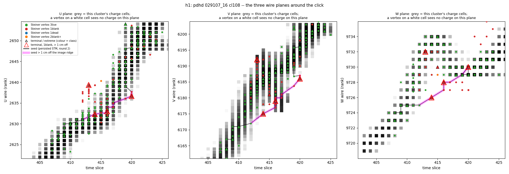
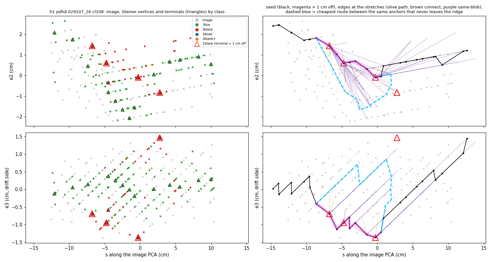
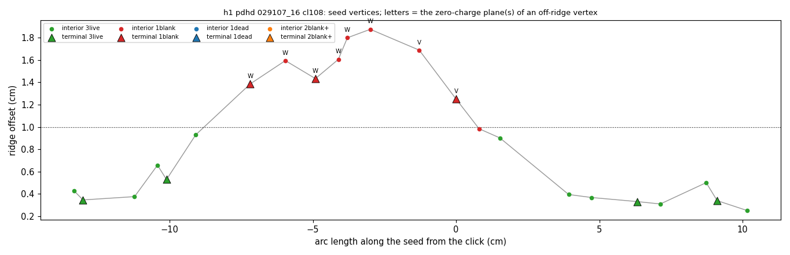
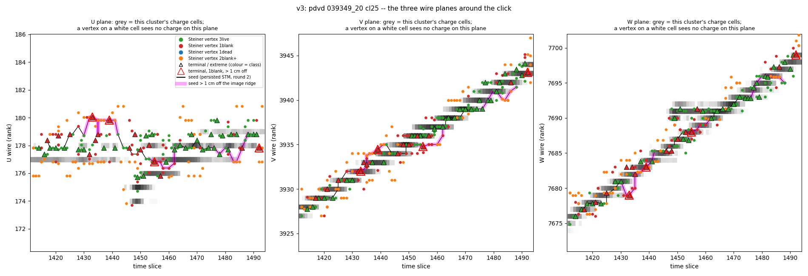
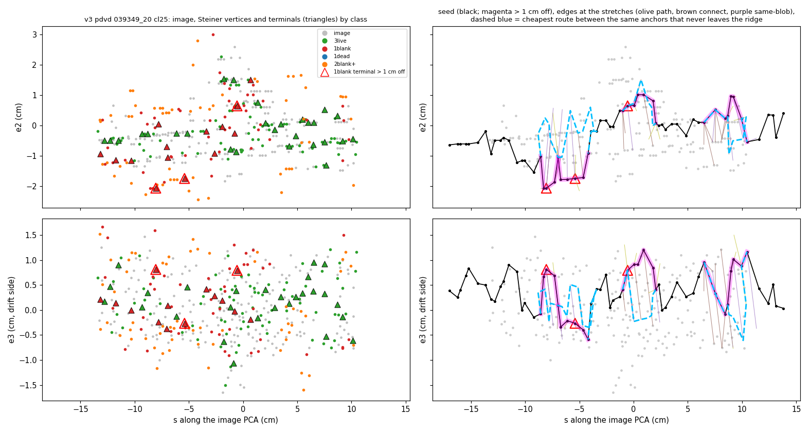
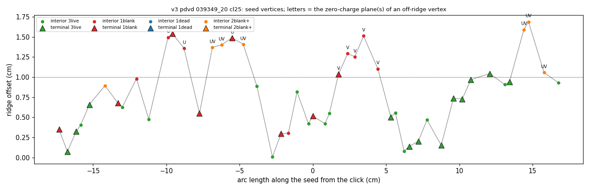

# doc pdvd/112 — why the Steiner seed leaves the image at the owner's spots: points that see charge on only two planes are admitted as terminals, and the seed takes the shorter route through them

**Owner, 2026-09-16** (after doc 111 round 2): *"The design of the Steiner Graph is exactly to allow the Graph to jump
gaps, which are the result of inefficiencies from upstream analysis (e.g. signal processing) or 3D image
reconstruction. So the goal of retiling is to help on that part. At the same time, we want to create Steiner Graph -->
which is the foundation of Steiner Tree, which is where the seed track trajectory should follow. … In these few cases,
clearly, the track trajectory seed somehow deviates. It is still not clear why this is happening? Is it that we do not
have good Steiner Terminal (on the image) near by? or something else? If we know the reason, we can think of targeted
fix directly. … please focus on understanding the cases, please pick a couple of them and explain them in details with
the plots … Once we understand why, we may proceed to design a fix."*

**Scope.** Understanding only. **No C++, no config, no new arm, no knob.** Everything is read from the doc-111 round-2
dump arms (`d111hst`, `d111vst`), whose outputs are identical to production (doc 111 sec 11.4).

## Status: the answer

**Are there good on-image terminals nearby? Yes.** In the ±12 cm window there are 14 terminals on the image at h1 and
37 at v3. The seed passes through 4 and 16 of them. From each off-image seed vertex the nearest on-image terminal is
1.0–2.3 cm away at h1 and 0.9–1.8 cm at v3, about the terminal spacing.

**What goes wrong is something else, in three steps:**

1. **The retiled cloud holds points that see charge on two wire planes and none on the third.**
   - In the wire views these points sit on charge in two planes and on an empty cell at most two wires beside the
     charge in the third, the *blank* plane (`figs/112_h1_2d.png`, `figs/112_v3_2d.png`).
   - In 3-D they are 1.0–1.9 cm off the image.
   - At these vertices the blank plane's charge band is the narrower one at that slice: median 6 wires against 18.5
     on the two graded planes at h1, and 2 against 4.5 at v3.
   - A sideways move of 1–2 cm can stay inside the wider bands of the graded planes. Only the narrow plane can see
     it, and it sees nothing there.
2. **The terminal charge test forgives the blank plane.**
   - Phase 1 of `create_steiner_tree` grades each point with `Cluster::calc_charge_wcp`. Production passes
     `disable_dead_mix_cell=false`.
   - In that mode a plane with charge exactly 0 counts as acceptable and is left out of the charge RMS
     (`Facade_Cluster.cxx:1089-1111`). The retiler writes its forced and dead cells as (0, 1e12)
     (`improvecluster_1.cxx:447, 1181`).
   - So a two-plane point is graded as a bright terminal. h1 vertex 850 has U 62701, V 1114, W 0 and gets
     √((62701² + 1114²)/2) = 44343.
   - The weaker graded plane can be barely above the 500 cut. h1 vertex 931 has U 594, V 0, W 97119 and gets 68675:
     in effect one plane.
   - Nothing later removes a ghost only 1–2 cm off:
     - Phase 2 keeps any point inside an original blob's wire ranges ±1 wire, in the same or the next slice;
     - Phase 3 removes only points more than 6 cm from the skeleton (`SteinerGrapher.cxx:655-679`).
3. **The tree must reach every terminal, and the route through these points is the shorter one.**
   - At h1 the seed crosses the bend in 9.9 cm through 3 such terminals and 5 such interior points. The cheapest route
     that stays on the image is 15.2 cm and costs 1.58× as much.
   - The charge factor in the edge weight does not penalise the ghosts. Their two-plane charge is high, so the chord
     costs 0.91 per cm against 0.93 on the image.
   - Dijkstra takes the chord.

**Is it general? Yes, on both detectors** (sec 6):

| | PDHD | PDVD |
|---|---|---|
| off-image terminals (> 1 cm) with one blank plane | 59.7 % | 38.3 % |
| on-image terminals with one blank plane | 10.1 % | 14.3 % |
| off-image terminals **on persisted seeds** with one blank plane | 62.0 % | 57.8 % |
| on-image terminals on persisted seeds with one blank plane | 5.1 % | 10.0 % |
| off-image seed vertices with one blank plane (terminals + interiors) | 48.7 % | 36.5 % |
| off-image seed vertices with two blank planes (interiors, charge 0) | 9.1 % | 29.6 % |

**Removing them is not free.** On PDVD, one-blank terminals *on* the image outnumber those off it (82,408 against
37,068), so dropping all of them would cost more good terminals than bad (sec 8).

**Not the whole story.**
- At v3 two of the five deviated stretches are carried by interior points with **two** blank planes. Those points have
  charge 0 and cannot be terminals; they enter as path interiors between terminals. This is the kind doc 111 round 2
  described, and it is the larger share on PDVD.
- 36 % (PDHD) and 45 % (PDVD) of off-image terminals see charge on all three planes. Those are not explained here.

**Where the empty cell comes from is still open.**
- Every off-image blank cell at both spots lies within the ±3-wire × ±3-slice disc of a charge cell (8 of 8, 9 of 9).
  That fits either of the retiler's two forced-activity sources: the painted disc of `hack_activity_improved`, or a
  blob's wire range with no charge in `get_activity_improved`.
- Telling them apart needs the retiler's own paths, which are not dumped (doc 111 sec 11.9).

**Neither spot is a gap jump.** The image is continuous under both stretches. The graph leaves it where the image is
whole.

## 0. Repro

```bash
cd /home/xqian/toolkit-dev/wcp-porting-img/pdvd/docs/nf_sp_img_clus

# sec 3-5 -- the two cases (about 1 min, read-only):
#   figs/112_{h1,v3}_{2d,frame,offset}.png, figs/112_{h1,v3}_walk.tsv, figs/112_cases.txt
python3 scripts/d112_case_anatomy.py --out figs/112

# sec 6 -- is it general (a few min each, read-only)
python3 scripts/d112_terminal_planes.py --det pdhd --arm d111hst --jobs 12 > figs/112_terminal_planes_pdhd.txt
python3 scripts/d112_terminal_planes.py --det pdvd --arm d111vst --jobs 12 > figs/112_terminal_planes_pdvd.txt

# sec 1 -- cl115's Steiner dump header
zcat /home/xqian/tmp/d111/arm_d111hst/evt_029107_16.log.gz | grep '^STGC 115 '
```

**Inputs** (all existing, read-only):

| det | arm | events | what |
|---|---|---|---|
| PDHD | `d111hst` | 61 | doc 111 round-2 dump arm: `WCT_STM_PATH_DEBUG=1 WCT_STEINER_GRAPH_DUMP=1`, pin `libpin_d111s`. Identical to production `d108hflip` (`figs/111s_gate_dump_pdhd.txt`) |
| PDVD | `d111vst` | 120 | the same, identical to `d103vflip` (`figs/111s_gate_dump_pdvd.txt`) |

- **Per event:**
  - the trace `/home/xqian/tmp/d111/arm_<arm>/evt_<run6>_<evt>.log.gz`: STGR retiled cloud, STGV Steiner vertices,
    STGE edges, STMRP walks, STMPATH seeds. It is in scratch and not committed; doc 111 sec 11.0 regenerates it;
  - `work/<run6>_<evt>_<arm>/tracking-stm.root`: T_rec_charge fit rows with 2-D coordinates, T_proj_data the cluster's
    2-D charge cells;
  - `mabc-pr.zip` `clustering-global`, the image.
- **Imported and unchanged:** `d111s_common.py`, `d111s_graph_census.py`, `d111s_wiggle_split.py`,
  `d111_spot_frame.py`, `d111_stage_attrib.py`, `d110_spot_figs.py`.

**Terms.**
- **Ridge offset:** distance from the image ridge, the local charge-weighted PCA of the cluster's own image points
  (doc 111 sec 4.1). *On the image* means ≤ 1 cm.
- **Vertex classes,** from the dumped per-plane charge of a Steiner vertex's retiled point and the dead bits of its
  `test_good_point` mask:

  | class | meaning |
  |---|---|
  | 3live | no plane at zero charge |
  | 1blank | exactly one plane at zero charge, and it is not a dead channel |
  | 1dead | one zero plane, and it is dead |
  | 2blank+ | two or three zero planes |

- **Roles:** terminal (Phases 1–3b), extreme (Phase 4, no charge test), interior (on a tree path between terminals).

## 1. The spots, and which two are taken apart

| spot | det, event, cluster | click (x, y, z) cm | here | why |
|---|---|---|---|---|
| **h1** | PDHD 029107_16 cl108 | (75.3, 438.3, 450.1) | **sec 3** | production seed 1.97 cm off at a bend, off in every arm of doc 111 sec 1 |
| **v3** | PDVD 039349_20 cl25 | (−270.2, −243.7, 36.0) | **sec 4** | production seed 1.64 cm off, off in both arms |
| v1, v2 | PDVD 039349_20 cl80 | (313.7, 95.9, 124.9), (94.5, 30.7, 165.0) | sec 5 | the Bee set the owner viewed (51c1e410) is pre-flip; the production seed is within about 1 cm |
| h2 | PDHD 029107_16 cl106 | (182.0, 537.4, 401.8) | sec 5 | the worst stretch is a crawl re-route of the tagger, not the Steiner graph |
| cl115 | PDHD 029107_16 cl115 | (278.5, 474.6, 299.1) | sec 5 | a through-going muon: no STM seed exists |

## 2. How a seed is made, in five steps

1. **Retile** (`ImproveCluster_2::mutate`, `improvecluster_2.cxx`). Wire activity is gathered per slice
   (`get_activity_improved`, `improvecluster_1.cxx:262-457`):
   - the original blobs' wire ranges;
   - dead channels within 20 cm;
   - all live charge within 20 cm in 2-D.

   Then two geometric Dijkstra paths, one on the original cluster and one on a first retile, get ±3-wire × ±3-slice
   discs painted around every path point that lacks 3-plane activity (`hack_activity_improved`, `:609-650`). A cell
   with no measured charge is written as 1e-3 and becomes (charge 0, uncertainty 1e12) when the blobs are made
   (`:1180-1181`). Blobs are tiled from this activity and sampled into points. Every point carries three per-plane
   charges, and a forced cell reads 0.
2. **Terminals** (`create_steiner_tree`, `SteinerGrapher.cxx:368-435`, called with `disable_dead_mix_cell=false` at
   `CreateSteinerGraph.cxx:323`):
   - **Phase 1,** per blob, the charge peaks by `calc_charge_wcp`:
     - a plane passes if its charge is above `terminal_charge_threshold` (500) **or exactly 0**;
     - the charge is the RMS of the nonzero planes;
     - fewer than two nonzero planes gives charge 0.
   - **Phase 2:** inside an original blob's wire ranges, ±1 wire, same or adjacent slice.
   - **Phase 3:** drop points more than 6 cm from the skeleton in 3-D but close in 2-D.
   - **Phase 3b:** 5 mm thinning.
   - **Phase 4:** add the extremes, with no test.
3. **Tree** (`create_enhanced_steiner_graph`): Voronoi regions of the terminals on the retiled graph. The graph keeps
   every shortest path between neighbouring terminals (their interior points become Steiner vertices) plus same-blob
   terminal edges. An edge costs length × (0.8 + 0.4 × mean Q0/(Q + Q0)), Q0 = 10000, with Q from the same
   `calc_charge_wcp` (`SteinerGrapher.cxx:1354-1356`).
4. **Seed** (`TaggerCheckSTM::do_rough_path`): Dijkstra on that graph between the two snapped ends.
5. **Crawl** (`adjust_rough_path`): when the first fit breaks, the seed is re-walked through a crawl point. Both spots
   below were crawled; their deviated stretches do not contain the crawl point, and each is the plain shortest path
   between its anchors (sec 3, 4).

## 3. h1 — PDHD 029107_16 cl108: a bend crossed through W-blank terminals



**The three wire planes around the click.**
- Grey squares are this cluster's charge cells (T_proj_data). Dots are Steiner vertices by class; triangles are
  terminals.
- The black line is the persisted seed. It is magenta where it is more than 1 cm off the image.
- Vertices are placed by a local map from the fit rows' 3-D and 2-D coordinates. V and W close exactly. The fit rows'
  `pu` does not, so U uses V's gradient mirrored in z. On the vertices it places, 99 % of live planes land on a
  charge cell at their own wire (sec 7).

**What the planes show.**
- In the magenta stretch (slices 413–420) the seed sits **on charge in U and V but on white cells in W**, one to two
  wires below the W band. Near its end W is back on charge and V goes blank instead.
- At the stretch's off-image vertices the graded planes show long runs of charged wires (median 18.5 wires) while the
  blank plane's nearest band is short (median 6 wires; W for six vertices, V for two). U and V do not notice a sideways
  shift of 1–2 cm; W does, and W is empty there.
- The red-ringed triangles are terminals with one blank plane more than 1 cm off the image. **Three of them are on the
  seed.**



**The ridge frame** (s along the image, e2 and e3 across it).
- Left: the image in grey; Steiner vertices and terminals by class.
- Right: the seed. Edges touching the deviated stretch are coloured by source (olive tree path, brown Voronoi
  connection, purple same-blob). The dashed blue line is the cheapest route between the stretch's anchors that never
  leaves the image.
- The image turns in a V (e2 ≈ −1.5 cm at its bottom). The on-image terminals follow it; the seed cuts across.



**Every seed vertex more than 1 cm off is class 1blank** (W, then V blank).

The stretch, vertex by vertex (`figs/112_h1_walk.tsv`; charge = the dumped `calc_charge_wcp` value):

| seed pt | vertex | ridge off (cm) | role | U / V / W charge | charge | into it: edge, length / weight | nearest on-image terminal (cm) |
|---|---|---|---|---|---|---|---|
| 146 | 813 | 0.93 | interior | 74328 / 250 / 721 | 42916 | path 1.02 / 0.90 | 1.02 |
| 147 | **850** | 1.39 | **terminal** | 62701 / 1114 / **0** | 44343 | connect 1.91 / 1.67 | 1.43 |
| 148 | 879 | 1.59 | interior | 22432 / 4416 / **0** | 16166 | connect 1.22 / 1.12 | 1.90 |
| 149 | **882** | 1.43 | **terminal** | 22432 / 11268 / **0** | 17751 | path 1.05 / 1.00 | 1.04 |
| 150 | 883 | 1.61 | interior | 16289 / 13777 / **0** | 15085 | path 0.80 / 0.76 | 1.14 |
| 151 | 897 | 1.80 | interior | 8875 / 15212 / **0** | 12453 | path 0.32 / 0.31 | 1.26 |
| 152 | 898 | 1.88 | interior | 10089 / 10627 / **0** | 10362 | path 0.80 / 0.79 | 1.76 |
| 153 | 930 | 1.69 | interior | 144 / **0** / 153910 | 108831 | connect 1.71 / 1.56 | 2.27 |
| 154 | **931** | 1.25 | **terminal** | 594 / **0** / 97119 | 68675 | path 1.29 / 1.08 | 1.95 |
| 155 | 932 | 0.98 | interior | 456 / **0** / 97119 | 68674 | path 0.80 / 0.68 | 1.86 |

- Vertex 930 has the same shape as 931 (U 144, V 0, W 153910). Its U is below the 500 cut, so it fails the quality
  test and is not a terminal. It gets onto the seed as a tree-path interior.
- The charge column equals the RMS of the nonzero planes for all 1316 vertices of this graph.

**The route choice** (`figs/112_cases.txt`), between the stretch's anchors 813 and 932:

| route | cost | length (cm) | cost per cm | smoothed length (cm) | max ridge offset (cm) |
|---|---|---|---|---|---|
| seed = plain shortest path | 8.964 | 9.89 | 0.906 | 9.38 | 1.97 |
| cheapest route that stays on the image | 14.134 (1.58×) | 15.19 | 0.931 | 13.07 | 0.98 |

- The smoothed length uses doc 111's ±2 cm running mean, which removes the lattice staircase.
- The on-image route really is longer: it goes down the V and back, 13.1 cm against 9.4 cm smoothed. It also carries
  more staircase.
- Per cm the chord is not dearer (0.906 against 0.931). The ghosts' two-plane charge is high, so the charge factor
  prices them like good points.

**Terminals in the window:**
- 14 on the image (13 3live, 1 1blank); the seed uses 4;
- 4 off the image, all 1blank; the seed uses 3.

**Reading.** h1 does not lack on-image terminals. The retiled cloud holds a band of W-blank points along the chord, and
three of them pass the terminal test. The tree has to connect them, and the chord through them is 5.3 cm shorter than
the V. In doc 111 round 2 the 3-plane-support pricing (G_3pl k=2) was the one re-pricing that moved this seed back
(1.97 → 0.68 cm). That is the same fact seen from the edges: it charges these edges up to 3× for their W-blank
samples, enough to beat the 1.58× length.

## 4. v3 — PDVD 039349_20 cl25: U-blank terminals, then two-plane-blank interiors



**What the planes show.**
- The track runs almost along the U wires: its U charge is a one- to two-wire band at U 177 across 80 slices.
- In the first magenta stretch the seed climbs to U 179–180, **about two wires off the U band** (nearest charge cell
  1.4–2.0 wires away), while in V and W it stays on charge. At the off-image one-blank vertices the graded planes' bands
  are 4.5 wires wide (median) and the blank plane's (U or V) is 2.
- Further along, the seed sits on white cells in both U and V (orange points, charge only on W). Later still it is on
  white cells in V only.





**Five stretches more than 1 cm off** (`figs/112_cases.txt`):

| stretch | seed pts | off-image vertices | blank plane | seed cost / length / smoothed | on-image route cost / length / smoothed |
|---|---|---|---|---|---|
| S0 | 139–141 | 1 terminal + 2 interiors, all 1blank | U | 3.398 / 3.46 / 2.63 | 3.985 (1.17×) / 4.07 / **2.69** |
| S1 | 143–146 | 1 terminal (1blank) + **3 interiors 2blank+** | U; UV | 4.424 / 3.92 / 3.29 | 8.506 (1.92×) / 8.30 / 4.70 |
| S2 | 156–160 | 1 terminal + 4 interiors, all 1blank | V | 4.053 / 4.19 / 3.60 | 5.010 (1.24×) / 5.24 / **3.56** |
| S3 | 171 | 1 terminal, 3live, 1.04 cm | – | 2.427 / 2.32 / 2.23 | the same route |
| S4 | 174–176 | **3 interiors 2blank+** | UV | 3.861 / 3.33 / 2.67 | 6.104 (1.58×) / 5.83 / 3.35 |

Each seed stretch is the plain shortest path between its anchors.

Vertex rows (`figs/112_v3_walk.tsv`):

| seed pt | vertex | ridge off (cm) | role | U / V / W charge | charge | stretch |
|---|---|---|---|---|---|---|
| 139 | 708 | 1.49 | interior | **0** / 16388 / 1401 | 11630 | S0 |
| 140 | **714** | 1.54 | **terminal** | **0** / 19014 / 1065 | 13466 | S0 |
| 141 | 720 | 1.36 | interior | **0** / 17655 / 478 | 12489 | S0 |
| 143 | 721 | 1.37 | interior | **0 / 0** / 14592 | 0 | S1 |
| 144 | 732 | 1.40 | interior | **0 / 0** / 3892 | 0 | S1 |
| 145 | **734** | 1.49 | **terminal** | **0** / 2231 / 12701 | 9118 | S1 |
| 146 | 740 | 1.41 | interior | **0 / 0** / 22106 | 0 | S1 |
| 156 | **793** | 1.04 | **terminal** | 17121 / **0** / 23261 | 20423 | S2 |
| 157–160 | 798, 802, 811, 819 | 1.10–1.51 | interior | V **0**; U 6030–13782, W 11212–17486 | 11395–13207 | S2 |
| 174–176 | 876, 879, 884 | 1.06–1.69 | interior | **0 / 0** / 7134–19597 | 0 | S4 |

**Two mechanisms at one spot.**
- **S0, S2: blank-plane terminals,** the h1 mechanism. Terminal 714 is graded on V 19014 and W 1065, the W just above
  the cut.
  - Once the staircase is smoothed away, the on-image route is as short as the chord (2.69 against 2.63 cm, and 3.56
    against 3.60).
  - The seed takes the chord because the on-image route through the lattice zig-zags more (4.07 against 3.46 cm raw).
- **S1, S4: interior points with two blank planes.** They have charge 0 and so can never be terminals.
  - They are on the graph because the tree's shortest path between neighbouring terminals runs through them.
  - The charge factor prices their edges near its maximum, 1.1–1.2 per cm, so here the chord *is* dearer per cm
    (1.129 and 1.161 against 1.025 and 1.046 on the image). Even so the on-image route costs 1.6–1.9× as much, because
    it is genuinely longer (4.70 against 3.29 cm and 3.35 against 2.67 smoothed).
  - Terminal admission cannot reach these; they are the doc-111-round-2 interior kind.
- **S3** is marginal: 1.04 cm, a 3live terminal, and it is its own on-image route.

**Terminals in the window:**
- 37 on the image (26 3live, **11 1blank**); the seed uses 16;
- 4 off the image (3 1blank), **all 4 on the seed**.

A U-blank point is common here even on the image (terminals 722, 750 and 770 are on-image and U-blank), because the U
band is so narrow. That matters for any fix (sec 8).

## 5. The other spots

- **v1, v2 (PDVD cl80).**
  - The Bee set the owner viewed, 51c1e410, is pre-flip `q29flip` (doc 110 sec 1). The pre-flip seed peaked at 2.13
    and 1.81 cm (doc 111 sec 1, arm A0).
  - In production (`d111vst`) the seed maximum is 1.03 and 0.99 cm (`figs/111s_spot.tsv`); there is no deviation left
    to take apart.
  - No pre-flip Steiner dump exists, so the pre-flip seed cannot be decomposed this way without a new one-event arm.
- **h2 (PDHD cl106).** The worst stretch is `adjust_rough_path`'s crawl re-route into a side branch: up to 3.69 cm,
  7.9 cm from the click (doc 111 sec 1). Every replay keeps the crawl point and stays at 2.44 cm (doc 111 sec 11.6).
  That is tagger logic, not a Steiner-graph choice.
- **cl115 (PDHD, 278.5, 474.6, 299.1).**
  - A through-going muon: `TaggerCheckSTM: cluster 115 already TGM; skipping`. No STM seed is made.
  - No fit row of any layer is within 143 cm of the click (doc 110 sec 1). Only `clustering-global` has points there.
  - Its Steiner graph is built: `STGC 115`, 30294 retiled points. The retiled cloud's closely graph has 186
    components, 34 after the ctpc bridges and 33 in the base graph.
  - It is the fragmented, gap-bridging kind of cluster the owner's point 1 is about, but no seed walks it, so there is
    no seed deviation to explain.

## 6. Is it general

`figs/112_terminal_planes_{pdhd,pdvd}.txt`. The population is every cluster with a persisted STM record (1131 PDHD,
1811 PDVD), one Steiner dump each.

**Checks.**
- The dumped vertex charge equals the RMS over the nonzero planes (0 with fewer than two) for 2,869,671 of 2,870,401
  PDHD and 4,080,692 of 4,082,097 PDVD vertices (100.0 % and 100.0 %). 3live and 1dead are exact; 1blank and 2blank+
  are at 99.9 %.
- Control:
  - terminals of class 2blank+: 0 and 0 (no two-blank point can pass Phase 1);
  - terminals with charge ≤ 500: 0 and 0.

**Terminals, by class** (non-extreme):

| class | PDHD terminals | PDHD share > 1 cm off | PDVD terminals | PDVD share > 1 cm off |
|---|---|---|---|---|
| 3live | 285,334 | 11.1 % | 481,925 | 9.1 % |
| **1blank** | 81,995 | **63.8 %** | 119,476 | **31.0 %** |
| 1dead | 14,797 | 25.0 % | 70,930 | 22.3 % |
| 2blank+ | 0 | – | 0 | – |

**Class mix of the terminals on and off the image:**

| | PDHD ≤ 1 cm | PDHD > 1 cm | PDVD ≤ 1 cm | PDVD > 1 cm |
|---|---|---|---|---|
| 3live | 86.2 % | 36.0 % | 76.1 % | 45.4 % |
| **1blank** | 10.1 % | **59.7 %** | 14.3 % | **38.3 %** |
| 1dead | 3.8 % | 4.2 % | 9.6 % | 16.4 % |

**The weaker graded plane.** Share of non-extreme terminals whose second-strongest plane charge is ≤ 2000, against a
per-plane cut of 500:

| | PDHD ≤ 1 cm | PDHD > 1 cm | PDVD ≤ 1 cm | PDVD > 1 cm |
|---|---|---|---|---|
| 3live | 2.0 % | 18.3 % | 2.4 % | 18.5 % |
| 1blank | 11.9 % | 22.4 % | 12.8 % | 40.9 % |

Off-image terminals more often lean on one plane, but the size of the effect differs by detector. Among one-blank
off-image terminals, about one in four has a second plane of at most 2000 on PDHD (22.4 %), and two in five on PDVD
(40.9 %).

**Persisted round-2 seeds** (1158 PDHD / 1847 PDVD records; every seed point joins a dumped vertex; distinct vertices per
record):

| seed vertices | PDHD ≤ 1 cm | PDHD > 1 cm | PDVD ≤ 1 cm | PDVD > 1 cm |
|---|---|---|---|---|
| terminals | 139,057 | 4,787 | 299,826 | 5,753 |
| terminals that are 1blank | 5.1 % | **62.0 %** | 10.0 % | **57.8 %** |
| interiors | 183,578 | 11,739 | 262,283 | 20,532 |
| interiors that are 1blank | 5.0 % | 44.8 % | 9.4 % | 31.3 % |
| interiors that are 2blank+ | 0.4 % | 13.1 % | 2.2 % | 38.5 % |
| all seed vertices that are 1blank | 5.0 % | **48.7 %** | 9.7 % | **36.5 %** |

**Reading.**
- What happens at h1 and v3 is the common case.
  - On a persisted seed, an off-image terminal is a one-blank-plane point six times out of ten, on both detectors.
  - An on-image terminal is one in 20 (PDHD) or one in 10 (PDVD).
- PDVD adds a second, larger population: two-blank interiors are 38.5 % of its off-image seed interiors, as at v3
  S1 / S4.
- Doc 111 round 2 said "terminals are tighter than the image (23 % / 15 % more than 1 cm off)". That still holds: most
  terminals are on the image. The off-image minority is where the blank-plane points concentrate.

## 7. Checks on the two cases (`figs/112_cases.txt`)

| check | h1 | v3 |
|---|---|---|
| seed points that are dumped vertices | 205 / 205 | 191 / 191 |
| seed maximum ridge offset in the window (doc 111 `figs/111s_spot.tsv`) | 1.97 cm (1.97) | 1.64 cm (1.64) |
| charge = RMS of the nonzero planes | 1316 / 1316 | 956 / 956 |
| live planes on a charge cell at their own wire | 518 / 522 (99.2 %) | 570 / 615 (92.7 %) |
| … per plane U / V / W | 172/175, 185/186, 161/161 | **123/168**, 211/211, 236/236 |
| 1blank planes with **no** charge cell at their own wire | 43 / 43 (100 %) | 60 / 77 (77.9 %) |
| … per plane U / V / W | 13/13, 3/3, 27/27 | **26/43**, 23/23, 11/11 |
| … and no cell within ±1 wire | 28 / 43 (65.1 %) | 25 / 77 (32.5 %) |
| off-image blank cells within the ±3 × ±3 disc of a charge cell (a bound) | 8 / 8 | 9 / 9 |

- **Where the projection is exact** (all planes at h1; V and W at v3), a blank plane has no charge at its own wire every
  time, and a live plane has charge there 99–100 % of the time.
- **v3's U is the exception, and it is the projection.** The mirrored-V map for PDVD U puts only 73 % of *live* U
  planes on their own wire, so the 26 / 43 for blank U planes is at the same limit.
- **The ±1-wire version (65 % / 33 %) is not a failure** of "blank = no charge". The plan set 80 % on the ±1 version as
  a stop-and-report threshold; that was the wrong test. The blank cell sits right beside the charge band, as the
  figures show; that is the finding, not a projection error.
- **The ±3 × ±3 bound says only** that a forced-activity source reaching three cells from real charge could have made
  each blank cell. It cannot say which source did (sec 9).

## 8. What the cases point at (design notes only; each needs the owner's go and a rule frozen before any run)

1. **Terminal admission: forgive a zero plane only when the channel is really dead.**
   - Today `calc_charge_wcp` treats "charge exactly 0" (this mode) or "uncertainty > 1e10" (the other mode) as dead. The
     retiler's forced cells are both.
   - A Steiner-scoped, default-OFF key in `CreateSteinerGraph` could require that a zero plane be dead in the grouping's
     channel map (the `test_good_point` dead bit the dump already reads) before the point may be a terminal. It must not
     change `calc_charge_wcp` itself: the neutrino taggers call it too.
   - **Reach and cost, in counts** (`figs/112_terminal_planes_*.txt`, table A; one dump per cluster):

     | 1blank terminals | PDHD | PDVD |
     |---|---|---|
     | off the image (> 1 cm): removed, the intended effect | 52,346 (59.7 % of off-image terminals) | 37,068 (38.3 %) |
     | on the image (≤ 1 cm): removed too, the cost | 29,649 (10.1 % of on-image terminals) | **82,408** (14.3 %) |

   - **On PDVD a blanket rule would delete more than twice as many on-image terminals as off-image ones.** v3's U-blank
     722, 750 and 770 are examples. On PDHD the ratio is the other way, 1.8 to 1.
   - So the plain rule is not the design. It needs a narrower condition (for example: forgive a zero plane only when
     the other two are both well above the cut, or only when an on-image alternative terminal exists nearby), sized on
     these populations before any build.
   - **Beyond the counts,** the rule moves the tree, so seeds must be re-measured, not replayed. After the tree is
     built, re-pricing cannot add the on-image connections a different tree would make (doc 111 sec 11.8).
2. **Two-blank interiors** (v3 S1, S4; 38.5 % of PDVD's off-image seed interiors) are untouched by item 1. They need
   the path-interior treatment of doc 111 sec 11.8 items 1–2: keep zero-charge points out of the tree interior, or
   price them in the base graph before the Voronoi step.
3. **The source of the blank cell.** A case-scoped retiler dump would say which source made each blank cell: the two
   Dijkstra paths, the painted cells and the wire-range sentinel cells, for chosen clusters only. That decides whether
   item 1 or a smaller painted disc (doc 111 sec 11.8 item 3) is the right place to act. It is log-only, but it is C++
   and needs its own gates.
4. **Pricing is the after-the-fact form of item 1.** It recovers h1, where 3-plane support prices the W-blank edges,
   but in doc 111 round 2 it fell short across the arms.

## 9. Not concluded

- **Whether the empty cell is painted or a wire-range sentinel.** Only bounded: 8 / 8 and 9 / 9 within ±3 × ±3 of
  charge.
- **The 3live off-image terminals** (36 % PDHD, 45 % PDVD of off-image terminals). They could be three-plane ghosts or
  the limit of the ridge metric where the image is wide. At h1, 41 % of the image's own points in the window are more
  than 1 cm off its ridge (doc 111 sec 11.6). The wire views are the metric-free evidence for the two cases; the tables
  in sec 6 use the metric.
- **Whether admission alone would bring h1 and v3 back.** The tree was not rebuilt offline: the dump does not carry the
  base graph.
- **v1 / v2 as viewed (pre-flip):** no pre-flip Steiner dump.
- **The U plane of PDVD in the wire views** is placed to about ±1 wire (sec 7). U conclusions at v3 rest on offsets of
  about two wires (nearest charge cell 1.4–2.0 wires away), not on single cells.

## 10. Files

- **Doc:** `pdvd/docs/nf_sp_img_clus/112_steiner-seed-off-image-cases.md`.
- **Scripts (new):**
  - `scripts/d112_case_anatomy.py`: h1 and v3; vertex classes, stretches, route comparison, wire-plane projection,
    figures;
  - `scripts/d112_terminal_planes.py`: the arm-wide class census, the charge-identity check and the persisted-seed
    table.
- **Figures and tables:**
  - `figs/112_h1_{2d,frame,offset}.png`, `figs/112_v3_{2d,frame,offset}.png`;
  - `figs/112_h1_walk.tsv`, `figs/112_v3_walk.tsv`, per seed point in the window. `cell_*` is own-wire / ±1-wire charge
    presence and `band_*` the charge band width;
  - `figs/112_cases.txt`;
  - `figs/112_terminal_planes_pdhd.txt`, `figs/112_terminal_planes_pdvd.txt`.
