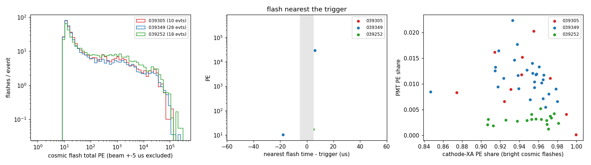
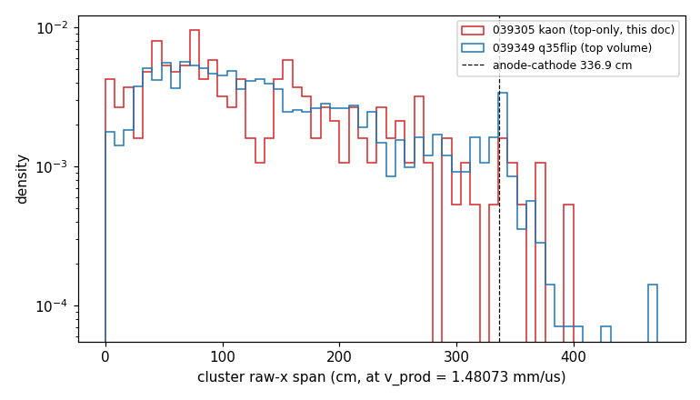

# doc pdvd/118: run 39305 kaon candidates — the chain, the run conditions, and the beam flash

**Status (2026-09-25, round 1; amended same day: the sec 4.4 beam-parallel "2x excess" was circular and is withdrawn).** This round covers the 10 beam-tagged kaon candidates from run 39305 (jjo, 2 GeV/c,
top drift volume only). All 10 now go through our chain: NF/SP (DNN-ROI), imaging, light, clustering + Q/L, and PR.
The three questions:

1. **Chain.** Everything runs up to clustering unchanged (production runners and settings, anodes 4-7).
   - Q/L matching on a **top-only** run needed a jsonnet fix, made in-tree in the toolkit. It is
     **byte-identical for every two-drift-side config**.
   - Two QLMatching **C++ defects** then remain on a single-side joint input. They are documented in
     [section 3.3](#33-two-qlmatching-c-defects-on-a-single-side-input-not-fixed) and **not fixed**.
   - Clustering + Q/L, and therefore PR (which reads that pctree), ran in a labelled **scratch arm**: post-fit cull
     OFF, `trigger_offsets` padded. It is not production-equivalent.
2. **Conditions.** Run 39305 matches 039349/039252 on everything this round measured:
   - flash rate, flash PE spectrum, saturation, and PD-family light shares;
   - light↔charge timing;
   - raw noise and pedestals, and dead channels;
   - drift speed (anode↔cathode crosser edge, v/v_prod = 0.986 ± 0.024).

   Gain was not measured. Two things differ:
   - only the top drift volume is read out;
   - the trigger fires ~420 µs into a 3.2 ms TPC window and 2500 µs into a 5.3 ms light window.

   Horizontal beam-parallel activity is 1.5 ± 0.4 per event against 1.1 in 039349. That is within noise, and the
   sample is pre-selected for isochronous activity (section 4.4).
3. **Beam flash.**
   - **Found.** It sits at trigger **−0.9 µs** in 9/10 events. That is the same −0.9 µs offset the 039349 beam
     triggers show. It is 477-84 k PE, 99 % on the cathode X-ARAPUCAs. Event 408552 has none: 19 PE at −2.3 µs.
   - **Which charge belongs to it is still open** ([section 5](#5-q3-the-beam-flash-and-which-charge-it-belongs-to)).
     Q/L never pairs jjo's certified deposit with the beam flash; each gets a different, well-matching flash. The
     certified deposits all point along one y-z direction (the beam axis) but do not share a line. Both fit beam-halo
     muons better than the triggering particle. The next step is to pin the beam line with beam-instrument tracking.

## Repro

```bash
cd /nfs/data/1/xqian/toolkit-dev/wcp-porting-img/pdvd
# 0. inputs: jjo's art files (read-only link) -> our orig frames + light rawwf  (SL7 apptainer, ~2 min)
ls -l input_data_kaon                        # -> /nfs/data/1/jjo/data/pdvd_kaon_candidates_full
kaon/convert_kaon.sh                         # -> input_kaon/run039305/evt_<evt>/, input_kaon/light/
python3 kaon/preflight.py > kaon/out/preflight.tsv
# 1. chain (production runners; PDVD_INPUT_DATA points them at input_kaon/)
kaon/run_kaon_chain.sh nfsp && kaon/run_kaon_chain.sh img && kaon/run_kaon_chain.sh light
kaon/run_kaon_clus_scratch.sh                # clustering + Q/L, scratch arm (section 3.4)
kaon/run_kaon_chain.sh pr
kaon/run_ref_light.sh                        # 2. reference light: 039349 (28) + 039252 (18) -> work/<run6>_light<evt>_d118ref
# 3. analyses
python3 kaon/light_compare.py --fig          # out/light_events.tsv, docs/pics/d118_light_compare.png
python3 kaon/tpc_ql_compare.py               # out/tpc_ql_compare.txt, docs/pics/d118_crosser_span.png
python3 kaon/tpc_noise.py                    # out/tpc_noise.txt
python3 kaon/beam_flash.py                   # out/beam_flash.tsv
python3 kaon/beam_geometry.py                # out/beam_geometry.txt
```

Outputs (all fresh, nothing overwritten):

| stage | where |
|---|---|
| NF/SP, imaging, clustering + Q/L, PR | `work/039305_<evt>/` |
| light | `work/039305_light<evt>/` |
| reference light | `work/{039349,039252}_light<evt>_d118ref/` |
| compiled-config proofs | `work/039349_0_d118cfg{A,B}/`, `work/039252_0_d118cfgC/` |
| per-stage logs | `kaon/logs/` |

## 1. Inputs and provenance

| item | value |
|---|---|
| sample | 10 beam-tagged kaon candidates (jjo), run 39305 subrun 1, 2025-09-04/05, H2-VLE 2 GeV/c; `input_data_kaon/README.md`, `MANIFEST.csv` |
| art files | `pdvd_kaon_run39305_evt<N>.root`, process `KVDFULL`, dunesw v10_20_05d01 |
| products used | `raw::RawDigit tpcrawdecoder:daq` (6144 ch = anodes/CRPs 4-7 only), `raw::RDTimeStamp tpcrawdecoder:daq`, `TriggerCandidateData triggerrawdecoder:daq`, `raw::OpDetWaveform pdvddaphne:daq` |
| not used | the official `wclsdatavd` gauss/wiener SP. That is borrowed, traditional (non-DNN) SP (M11); we redo NF/SP ourselves from the raw digits. |
| jjo's CRP numbering | `KaonSearch/scripts/vd_certify_planes.py`: "CRP n" is our anode n (CRP 4 = U 6144-6619, V 7096-7571, W 8048-8631, ...) |

Two different "trigger time" numbers are in circulation. They refer to different windows, and both are right:

- **TPC window:** the trigger sits **~400-431 µs** after the TPC frame start. That is tick 801-863 at 0.5 µs, 3.2 ms
  window (jjo's README quotes the keepup `DefaultTrigTime 411 µs`).
- **Light window:** the trigger sits **2500 µs** into the 5.3 ms full-stream light waveform (the colleague's
  `wf.TimeStamp() + 2500`). We measure 2500.08-2501.01 µs.

This doc uses per-event timestamps throughout; neither constant is used.

## 2. Converting the art files into chain inputs

### 2.1 TPC: orig frames

Our NF/SP starts from `protodune-orig-frames-anode{N}.tar.bz2`. The existing runs' frames came from xning's stage-2
job (`/nfs/data/1/xning/container/dune_data/process-vd.sh`): `wcls_frames_pdvd.fcl` with `wcls-nf-out.jsonnet`
(xning's 941a261c), whose `FrameFileSink` "orig" tap sits after the per-anode `ChannelSelector` and before any
resampler.

That exact recipe **no longer runs**. The local WCT libs it loads (`xning/wirecell-working/local-container/lib`) have
been rebuilt against a newer glibc: `GLIBC_2.29 not found` inside the SL7 container. So:

- **`kaon/cfgmin/wcls-orig-frames-pdvd.jsonnet`** is a decode-only WC/LS job that reproduces the same tap:
  `wclsRawFrameSource` (same art tag, and the same `tick: 512 ns if use_resampler`) → `FrameFanout` → per-anode
  `ChannelSelector` (the `funcs.jsonnet` `anode_channels` split) → `FrameFileSink` (same outname, tags, and
  digitize/masks flags). It uses the dunesw release WCT and runs no NF/SP inside lar.
- The runner is `kaon/wcls_origframes_pdvd.fcl` plus `kaon/_orig_inner.sh`, in the fnal-dev-sl7 apptainer
  (`kaon/container_exec.sh`), with RootInput on each single-event art file.

**Parity against a 039349 anode-4 tarball:**

- **Identical:** member names and dtype (float32), shape 1536 × 6400, channel list and order, and tickinfo tick
  (512 ns).
- **One difference:** the tickinfo *start time* is 0-126 ns here, against 0 in the 039349 files. That is under 0.25
  ticks, ≤ 0.2 mm of drift.
- Anodes 0-3 come out as empty tarballs, which the top-only chain never reads.

### 2.2 Light: rawwf + trigger offsets

The existing `input_data_light/*_rawwf.root` files came from jjo's `pdvd_pds_raw_trigoff.fcl` (analyzer
`PDVDTriggerLightAna`, mrb area `/nfs/data/1/jjo/tmp/pdvd_flash_validation/vddev`) followed by `pdvd_dump_rawwf.py`.

The kaon art files already carry all three products that analyzer reads. So `kaon/pdvd_triglight_rootinput.fcl` runs
the same analyzer with RootInput and no decoders, and `kaon/_light_inner.sh` then runs jjo's dump script unchanged.
Output: `input_kaon/light/np02vd_raw_run039305_evt<N>_rawwf.root`, passed with `run_light_evt.sh -f`.

### 2.3 Pre-flight checks (all pass; `kaon/out/preflight.tsv`)

- **Light record layout is identical to 039349.**
  - 16 cathode channels in full stream: 331264-331328 samples here, 331328 in 039349.
  - Membrane and PMT channels in 1024-sample self-trigger snippets; the largest snippet here is 1024.
  - So `OpDecon`'s 1024-sample truncation (`flash/src/OpDecon.cxx:619`) drops nothing.
- **Frames:** 6400 ticks and 1536 channels on all 10 events × 4 top anodes. `readout_window_ticks.txt` gains
  `39305 6400`.
- **Trigger-offset closure (three clocks agree):**
  - The trigger is 2500.08-2501.01 µs after the full-stream start. The colleague quotes 2499.98-2500.61 µs, from a
    different reference file.
  - It is 400.7-431.4 µs (tick 801-863) after the TPC frame start. jjo's beam-clock note has tick 849.4 for events
    2001 and 36591; we get 849.2 and 849.6.
- **Top-only side effect in the trigoff tree:** `charge_bde_us = 0`, so `offset_bot` is garbage (−6.5e9 µs). Only
  `offset_top` is meaningful.
- **Chain time origin:** `PDVDOpWaveformSource`'s tick origin is the earliest record, including snippets that start
  before the full stream. So the beam sits at **2696-2878 µs on the flash axis, not 2500**, which is 195-378 µs later
  than the full-stream offset alone would give. Any beam-window selection must use per-event timestamps.

## 3. The chain on a top-only run

Everything runs through the unchanged production runners, with `PDVD_INPUT_DATA=input_kaon` (section 3.5) and
`kaon/run_kaon_chain.sh`:

| stage | runner (production defaults) | result |
|---|---|---|
| NF+SP+DNN-ROI | `run_nf_sp_dnnroi_evt.sh -a N` for N = 4..7 | 10/10 (one rerun: see 3.5) |
| imaging | `run_img_evt.sh -a N` for N = 4..7 | 10/10; all 40 anode archives non-empty |
| light | `run_light_evt.sh -f <kaon rawwf>`: ToT saturation repair, the production flip | 10/10 |
| clustering + Q/L | `kaon/run_kaon_clus_scratch.sh` = `run_clus_evt.sh -a 4,5,6,7 -calib -save-pctree` config, minus the post-cull (3.4) | 10/10 in the scratch arm; the production config crashes (3.3) |
| PR | `run_pr_evt.sh` (default `-stm`) | 10/10, `mabc-pr.zip` in each event dir |

### 3.1 Top-only Q/L needed a config fix (toolkit, in-tree, byte-identical for two-side configs)

The joint `QLMatching` node's per-input lists were `[bottom, top]` literals, indexed by input port:

- `trigger_offsets`
- `anode_pd_channels`: the bottom-PMT relax list for the bottom volume, empty for the top
- split `drift_speeds`

With `-a 4,5,6,7` only the top group is built, so its single input 0 silently took the **bottom** offset and the
**bottom** PMT list. The bottom offset is BDE-based, and BDE is 0 in 39305. Measured on a 039349 event clustered
top-only (case B): `trigger_offsets [-2482333, -2462445]` (input 0 reads the first, the bottom value) and
`anode_pd_channels [16 ch, 0]`.

**Fix** (toolkit **e2ae041d**; `cfg/pgrapher/experiment/protodunevd/wct-clustering.jsonnet`, `qlmatching.jsonnet`):

- Each drift-side group carries a `side`.
- The three lists are built from the groups actually present.
- `qlmatching.jsonnet` gains `anode_pd_sides=null`. Null keeps the legacy literal, so the key is never emitted
  differently.

**Proofs** (the compiled config from the production runner in compile-only mode):

| case | before vs after | md5 |
|---|---|---|
| A: 039349 evt 0 (19409), two sides | byte-identical | `2d309a27e550` |
| C: 039252 evt 0 (298567), two sides; HEAD compiled through a jsonnet path overlay | byte-identical | `fb556b474923` |
| overlay validation | the HEAD overlay reproduces the pre-edit case-B compile byte-for-byte | |
| B: 039349 evt 0, top-only | exactly two QL keys change: `trigger_offsets` → `[-2462445]` (top), `anode_pd_channels` → `[[]]`; every non-QL node identical | |

A bottom-only subset changes the compiled JSON (the lists shrink to one entry), but the C++ reads the same index-0
values, so its behaviour is unchanged.

### 3.2 Why a knob was not used

§1 asks for a default-OFF knob when output can change. The only configs whose compiled JSON changes are subset-anode
runs with matching on. There, the old values were wrong by construction: the bottom offset was applied to top charge.
The owner approved the in-tree fix on 2026-09-25. Two-side production is proven byte-identical (3.1).

### 3.3 Two QLMatching C++ defects on a single-side input (not fixed)

With the fixed config, the production clustering crashes on **10/10** kaon events. Two independent defects:

1. **Null dereference in `fit_round2`: SIGSEGV, `QLMatching.cxx:2712`.**
   - The line is `make_shared<TimingTPCBundle>(*run.flash_cluster_bundles_map[{flash, cluster}])`.
   - `cull_unflagged_lowquality()` (the post-fit cull, production-ON in PDVD) erases bundles from the maps. The
     round-2 `solution` vector that picks each cluster's best flash still ranks the erased pair.
   - When a culled pair is a cluster's best, `operator[]` default-inserts a null `shared_ptr`, and the copy
     dereferences it.
   - **The config change is not the cause.** The same crash occurs with a hand-made HEAD-like config (two-entry
     `[top, top]` offsets, bottom-PMT list): `/home/xqian/tmp/d118_crash/{fix,pmt,headlike}/run.log`, all rc=139.
   - A two-side 039349 control with the same libs runs clean (26 post-culls, rc=0).
   - So a top-only event reaches this path systematically, and the two-side runs have not so far.
   - Fix direction: `find()` plus the unmatched-cluster branch. Output would be unchanged wherever it does not
     crash today, but it still needs gates on every detector that runs QLMatching.
2. **Out-of-range index in `write_opflash_pc`: `std::out_of_range` at `QLMatching.h:208` from `QLMatching.cxx:3953`.**
   - With per-side offsets configured, it always emits a display column `time1 = time + trigger_offset_for(1)`, the
     hard-coded "top = port 1" assumption.
   - A single-input run with the (correct) length-1 `trigger_offsets` aborts there.
   - Found with the post-cull off; gdb backtrace in `/home/xqian/tmp/d118_crash/np/gdb.log`.
   - Fix direction: emit `time1` only when `m_trigger_offsets.size() > 1`, or map it by side.

Both fixes touch `match/src/QLMatching.cxx`. That file currently has another session's **uncommitted** edits
(`xtpc_sc1_overpred_max`, doc sbnd_xin/123 sec 18), which are already built into the shared `local/lib`. Rebuilding
that library under running arms is not something to do unasked. **Left for the owner.**

### 3.4 The scratch clustering arm used here (NOT production-equivalent)

`kaon/run_kaon_clus_scratch.sh`:

1. The production `run_clus_evt.sh -a 4,5,6,7 -calib -save-pctree` in compile-only mode, with the fixed jsonnet and
   `PDVD_QL_POSTCULL=0`, which avoids defect 1.
2. The compiled `trigger_offsets` `[top]` padded to `[top, top]`, which avoids defect 2. Index 1 feeds only the
   display column.
3. The runner's own wire-cell invocation (GOGC=off, tcmalloc).

All other Q/L settings are production: ToT light, `lasso_weight_unrailed`, `ks_sat_tol`, the cathode flash
selection, +13.507 µs pull, 1.48073 mm/µs. Every Q/L number in this doc comes from this arm.

**Arm label: `d118scratch`**, in `work/039305_<evt>/`.

### 3.5 Runner-side notes (pre-existing issues, not fixed here)

- **`PDVD_INPUT_DATA`** (new, wcp): an env override of `$PDVD_DIR/input_data`. It is used in `_runlib.sh`,
  `run_nf_sp_evt.sh`, `run_nf_sp_dnnroi_evt.sh`, `run_img_evt.sh` and `run_clus_evt.sh`. With it unset, all four
  runners' run listings are identical before and after (`cmp`). It was needed because `input_data` points into
  xning's read-only area.
- **`run_nf_sp_dnnroi_evt.sh` exit-code race.**
  - Under `set -e`, the VmHWM poll `HWM=$(awk ... /proc/$WC_PID/status)` returns awk's rc 2 when wire-cell exits
    mid-read. That kills the runner with rc=2 after a clean wire-cell run.
  - Hit once, on event 69596 anode 4 (`kaon/logs/nfsp_69596.try1.log`); the rerun passed.
- **`run_img_evt.sh` writes empty archives silently.**
  - Per-anode imaging with a missing DNN-ROI frame writes 151-byte empty `clusters-apa-anode*` archives with rc=0,
    instead of the "error loudly" its header promises.
  - Seen on 69596 anodes 5-7 before that rerun; the archives were then overwritten by the good run.
- **`run_nf_sp_dnnroi_evt.sh -a`** takes a single anode (`-a 4,5,6,7` looks for `...-anode4,5,6,7.tar.bz2`). The
  driver loops over 4..7.

## 4. Q2: are the run conditions consistent?

### 4.1 Light (`kaon/light_compare.py`)



The references are the production light chain re-run on 039349 (file 0035, 28 events) and 039252 (file 1176, 18
events), into `_d118ref` dirs. Rates are counted inside the full-stream window with the beam ±5 µs excluded.

| run | events | flashes ≥ 100 PE per ms | all flashes per ms | cosmic PE p50 / p90 | flashes with a saturated channel | PE share, bright flashes (cathode / membrane / PMT) |
|---|---|---|---|---|---|---|
| **039305** | 10 | **24.4 ± 1.8** | 77.8 | 978 / 16 946 | 28.8 % | 0.94 / 0.05 / 0.01 |
| 039349 | 28 | 21.3 ± 1.8 | 73.8 | 1066 / 16 138 | 30.4 % | 0.95 / 0.04 / 0.01 |
| 039252 | 18 | 22.2 ± 1.8 | 54.5 | 1085 / 14 069 | 27.5 % | 0.95 / 0.04 / 0.00 |

- The **PD response is consistent**: same PE scale, same family shares, same saturation incidence, same record
  layout.
- 39305 has ~10-15 % more ≥100 PE flashes per ms (24.4 ± 1.8 against 21.3 ± 1.8, event-to-event spreads). The
  cause is not identified; the beam-parallel count in 4.4 does not show a significant excess.
- The light↔charge offset per event (`offset_top`, −2267 to −2465 µs) is the same kind of number as in 039349
  (−2476 µs for evt 19409). The spread comes from how early the first snippet starts.

### 4.2 TPC noise, pedestal, dead channels (`kaon/tpc_noise.py`; raw orig frames, top anodes, pre-NF)

| | U RMS (ADC) | V RMS (ADC) | W RMS (ADC) | pedestal | dead (RMS < 1) per anode |
|---|---|---|---|---|---|
| **039305** (10 evts) | 12.96 ± 0.76 | 12.65 ± 0.80 | 12.68 ± 0.74 | 8149 / 8150 / 8148 | 0 |
| 039349 evt 0-9 | 12.71 ± 0.73 | 12.41 ± 0.71 | 12.88 ± 1.00 | 8149 / 8150 / 8148 | 0 |

These match. They are not a gain measurement; the gain is **not measured** in this round.

### 4.3 Drift speed / E-field and Q/L quality (`kaon/tpc_ql_compare.py`)



**Drift speed.** Anode↔cathode crossers pile up at a raw-x span of L·v_prod/v_true, where L = 336.9 cm. This is the
statistical version of the single-crosser measurement behind the production 1.48073 mm/µs (doc 25).

| | crossers (span 300-400 cm) | edge | v_true / v_prod |
|---|---|---|---|
| **039305** | 13 | 341.8 ± 8.3 cm | **0.986 ± 0.024** |
| 039349 q35flip (top volume) | 161 | 336.0 ± 1.8 cm | 1.003 ± 0.005 |

The two agree to within 1σ, so there is **no sign of a different E-field**. The 39305 precision (±2.4 % in v) is
limited by 13 crossers in 10 events.

**Q/L quality**, top-volume clusters in the calib dumps:

| | clusters with a selected flash | selected KS median | selected χ²/ndf median | pred/meas median (p16-p84) |
|---|---|---|---|---|
| **039305** (d118scratch, post-cull OFF) | 442/447 (99 %) | 0.086 | 2.5 | 0.55 (0.05-1.21) |
| 039349 q35flip (production, post-cull ON) | 2745/3557 (77 %) | 0.079 | 1.6 | 0.61 (0.15-1.27) |

The light-pattern agreement of the selected pairs (KS) is the same. The 99 % vs 77 % and the χ²/ndf difference are
mostly the post-cull being off in the scratch arm, which removes nothing. **They are not a condition difference.**

### 4.4 Beam-related activity (`kaon/beam_geometry.py` part D)

Long (≥ 1 m in y-z), horizontal (drift extent < ¼ of length), top-volume clusters within 10° of the 39305 beam axis
(5.3):

| | long clusters per event | horizontal | horizontal and beam-parallel |
|---|---|---|---|
| 039305 (2 GeV/c), all clusters | 13.4 | 3.5 | 2.3 |
| **039305, each event's certified cluster excluded** | 12.5 | 2.6 | **1.5 ± 0.4** (15 tracks / 10 events) |
| 039349 (0.5 GeV/c) | 11.3 | 1.6 | **1.1** |

The first row is circular and should not be used. The beam axis is the mean of the ten certified-slab axes, and each
certified cluster is horizontal and on that axis by construction.

With them excluded, the excess is 1.5 ± 0.4 against 1.1, which is **within noise**. Two further cautions:

- The 10 events are **not a random sample**: jjo's certification picked them for three-plane isochronous activity in
  ticks 1900-2500, so any residual excess is biased upward.
- 039349 has no such cut.

**Conclusion: no measured difference in beam-parallel activity.** What 5.3 does establish is that such tracks are
common in both runs, about 1 per event, so beam-parallel geometry alone cannot identify the triggering particle.

## 5. Q3: the beam flash, and which charge it belongs to

### 5.1 The beam flash is identified

The beam time on the flash axis is `tc_us − chain t0`, per event, from the trigoff tree. The flash nearest to it:

| event | trig in TPC frame (µs / tick) | trig − light start (µs) | offset_top (µs) | beam flash dt (µs) | beam flash PE | cathode share | flashes in ±5 µs | cert CRP / tick |
|---|---|---|---|---|---|---|---|---|
| 2001 | 424.6 / 849 | 2500.08 | −2382.9 | −0.88 | 64 250 | 0.99 | 1 | 5 / 2177 |
| 36591 | 424.8 / 850 | 2500.30 | −2453.1 | −0.95 | 14 810 | 1.00 | 1 | 4 / 2305 |
| 69596 | 419.4 / 839 | 2500.51 | −2401.9 | −0.93 | 1 241 | 0.98 | 2 | 6 / 2192 |
| 157312 | 418.0 / 836 | 2500.61 | −2375.6 | −0.91 | 41 420 | 0.99 | 1 | 4 / 2170 |
| 191916 | 400.7 / 801 | 2500.78 | −2464.8 | −0.88 | 83 590 | 1.00 | 1 | 4 / 2214 |
| 245576 | 428.8 / 858 | 2500.16 | −2267.0 | −0.91 | 30 490 | 0.99 | 1 | 4 / 2479 |
| 317673 | 402.3 / 805 | 2500.59 | −2414.4 | −0.93 | 36 330 | 1.00 | 1 | 7 / 2047 |
| 326459 | 431.4 / 863 | 2501.01 | −2432.3 | −0.83 | 477 | 0.64 | 2 | 4 / 2392 |
| 351293 | 422.8 / 846 | 2500.82 | −2302.5 | −0.93 | 3 686 | 0.99 | 1 | 6 / 2082 |
| 408552 | 415.4 / 831 | 2500.40 | −2344.0 | **−2.28** | **19** | 1.00 | 1 | 6 / 2227 |

- **9/10 events have a flash at −0.83 to −0.95 µs.** That is the known −0.9 µs flash-binning residual: 039349's beam
  triggers sit at −0.95 µs median (26/28, figure panel 2), and `ql_light_calib/check_trigger_flash.py` gives
  −0.9 µs.
- **The accidental rate is small.** At 77.8 flashes/ms, a ±0.5 µs window around −0.9 µs expects 0.08 accidental
  flashes of any PE, and 0.02 at ≥ 100 PE.
- **The beam flash is the flash at trigger − 0.9 µs.**
- It is bright (median ~23 k PE, against 1.7 k for the 0.5 GeV/c 039349 beam flashes) and cathode-dominated.
- **Event 326459** (477 PE, 31 % membrane) is dim and unusually membrane-rich.
- **Event 408552 has no beam flash.**

### 5.2 Q/L never pairs the certified deposit with the beam flash

In every event a large cluster sits at jjo's certified tick. For example, 8608/8631 of cluster 4000040's points in
157312 lie within ±5 cm of the certified raw x, and 15 666/15 723 in 351293. Q/L gives each of those clusters a
**different** flash, with a good light match (`beam_geometry.py` part A):

| event | Q/L flash − beam (µs) | KS | pred/meas | cert cluster vs beam flash: KS, χ²/ndf, pred vs meas |
|---|---|---|---|---|
| 2001 | +259 | 0.05 | 1.54 | 0.36, 1.4, 34 063 vs 64 251 |
| 36591 | +457 | 0.06 | 1.15 | 0.35, 108, 2 801 vs 14 807 |
| 69596 | +321 | 0.02 | 1.04 | 0.40, 1.7, **15 317 vs 1 241** |
| 157312 | −348 | 0.04 | 0.95 | 0.30, 62, 3 782 vs 41 416 |
| 191916 | +491 | 0.08 | 1.03 | 0.35, 7.0, 17 687 vs 83 592 |
| 245576 | −148 | 0.10 | 0.94 | 0.26, 22, 8 505 vs 30 492 |
| 317673 | −234 | 0.09 | 0.46 | 0.50, 48, 1 854 vs 36 331 |
| 326459 | −121 | 0.07 | 1.20 | 0.19, 3.4, 522 vs 477 |
| 351293 | +399 | 0.03 | 0.80 | 0.24, 1.8, **12 877 vs 3 686** |
| 408552 | +542 | 0.05 | 0.27 | no beam flash |

Two readings.

**(i) The certified deposit is the triggering particle and Q/L mis-assigns it.** The top-only readout lets unread
bottom-volume light into the cathode XAs, so measured > predicted is expected. Against this reading:

- **The depth band isn't evidence.** At t0 = trigger the deposits sit 88-117 cm below the top anode, but
  `vd_certify_planes.py` only scans ticks 1900-2500 (`T_LO, T_HI`), so that band comes from the scan window.
- **Two events over-predict at the beam flash.** 69596 (15.3 k vs 1.2 k) and 351293 (12.9 k vs 3.7 k) predict more
  light than was measured. Unread light cannot explain that.
- **408552 has a certified cluster (9.5 k points) and no in-time light at all.**

**(ii) The certified deposit is beam-parallel activity out of time with the trigger** (a beam-halo muon, or another
spill particle). What supports it:

- the good Q/L matches above;
- beam-parallel horizontal tracks being common, about 1 per event in both runs (4.4);
- the geometry test in 5.3.

**Not settled.** Reading (ii) fits better; the test in 5.5 decides between them.

### 5.3 The certified deposits share a direction but not a line

The test uses only the certified cluster's points inside its tick slab (`beam_geometry.py` part B):

- **Common direction.** The y-z principal axis is **(−0.840, +0.542)**, 32.9° from −y, in all 10 events. The
  per-event deviation is 0.1-9.7°, median 4°.
- **Not an imaging artefact.** PDVD strips run at ±60° from y (U, V) and along y (W); `protodunevd-wires-larsoft-v7-uvwfit`
  anode 4. So the axis is not a strip direction.
- **No common line.** The perpendicular offsets are −162 … +371 cm across the 10 events. A beam spot is a few cm, so
  these are ten parallel tracks spread over ~5 m.

Beam-parallel tracks spread over metres are the beam-halo signature, which supports (ii). The direction is still
useful: **(−0.840, +0.542) is our best estimate of the beam axis in PDVD coordinates.**

### 5.4 What Q/L does pair with the beam flash

From `beam_geometry.py` part C:

| event | clusters Q/L pairs with the beam flash |
|---|---|
| 2001, 36591, 326459, 351293 | none |
| 69596 | a 15-point fragment |
| 157312 | cluster 4000090: 1891 points, 13° from the beam axis, offset +111 cm, depth 219-298 cm, KS 0.06, pred/meas 0.52 |
| 191916 | a 409-point cluster at 85° from the axis, KS 0.85 (not a good match) |
| 245576 | three clusters, 14-34° from the axis, offsets +102 … +135 cm, depths 108-337 cm |
| 317673 | cluster 4000101: 3527 points, 10° from the axis, offset +106 cm, depth 208-331 cm, KS 0.04, pred/meas 1.51 |

- In 157312, 245576 and 317673 the beam-flash clusters are beam-parallel at offset ≈ +100 … +140 cm and depth
  ≈ 110-337 cm, the lower part of the top volume. That is TPC tick ≈ 3700-5400, **entirely outside jjo's 1900-2500
  certification window**.
- Several reach the cathode (depth ≈ 337 cm), where a track can leave into the unread bottom volume.
- Taken alone this line is not conclusive: every event also holds beam-parallel tracks at other times on the same
  offsets. It does make a checkable prediction, below.

### 5.5 What would settle it: the next step for "PR on beam-flash-matched clusters"

1. **Pin the beam line from the beam instrumentation.** `beam::ProtoDUNEBeamEvent` carries the reconstructed beam
   tracks (BPROF / fibre monitors). Their projection to the TPC face gives the entry point and direction per event.
   - The in-time particle must sit on that line at depth = entry height, at t0 = trigger.
   - One line per event separates (i) from (ii) directly.
   - This is the question to take back to jjo, who has the beam-event reading code (`pdvd_beam_clock.html`).
2. **Associate by beam window, not by the LASSO alone.** The existing default-OFF knobs are candidates:
   - QLMatching `beam_pref` / `beamonly` / `beam_mintime/maxtime` (`match/inc/WireCellMatch/QLMatching.h`), and the
     SBND beam-window tagger gate (sbnd_xin doc 56).
   - PDVD would need a **per-event** window: trigger − 0.9 µs on the flash axis, 2696-2878 µs in this sample, **not
     a constant 2500 µs**.
   - Top-only runs will always carry unexplained bottom-volume light in the beam flash, so a pure light-pattern
     match is structurally handicapped here.
   - Proposal only; nothing is changed.
3. **Hand-scan the 10 events** in Bee: `work/039305_<evt>/mabc-all-apa.zip` and `mabc-pr.zip`. Upload is
   owner-gated.

### 5.6 Addendum (2026-09-25, doc 119): why there is no bottom drift, and a beam-flash label for Bee

- **The bottom drift was never read out in run 39305, so nothing can be reprocessed.**
  - All 10 raw HDF5 files (478 trigger records) hold 96 `TDEEth` (top), 6 PDS, 2 HSI and 1 TC fragments, and
    **0 `WIBEth`** (bottom).
  - The file's source-ID map has no `kVD_BottomTPC` entry. The TriggerRecordHeader requests no bottom source ID
    (400-547), and every error bit is 0.
  - The same check on 39252/39253/39349 finds 96 + 96. jjo's decoder (`CrateList [-1]`, both sub-detector strings,
    `keep *`) would have decoded the bottom had it been present.
  - Why the bottom was left out of the readout is not recorded on this host (needs the NP02 e-log / run DB).
  - Details: [doc 119 section 1](119_bee-beam-flash-label.md#1-q1-why-run-39305-has-no-bottom-drift).
- **"039349's beam triggers" is literal.** `tc_type` 15 is `kCTBBeamChkvHL` and 22 is `kCTBBeamChkvHxLx`
  (trgdataformats), so 039349 is a beam run with both drifts read out.
- **Correction to `kaon/out/beam_flash.tsv`.** Its `beam_flash_dt` column (−0.41..−1.33 µs) was built from
  `light_events.tsv`'s `trig_us`, which that file writes to 4 significant figures, so it carries a ±0.5 µs rounding
  error.
  - The flash **identities** are unaffected.
  - The residual at full precision is −0.83..−0.95 µs, as the section 5.1 table already shows.
- **Bee `/` key.** The chain can now label the in-beam flash itself (`op_beam`, default OFF). A patched Bee prefers
  that label over its fixed op_t window. See doc 119.

## 6. Open items

- [ ] QLMatching defects 1 and 2 (3.3). Needs the owner's go, and coordination with the uncommitted `QLMatching.cxx`
      edits of the sbnd_xin/123 session. Once fixed, rerun clustering + PR with the production config (post-cull ON)
      and replace the d118scratch Q/L numbers.
- [ ] **d118scratch lives in the canonical `work/039305_<evt>/` dirs** (no suffix). The post-fix production rerun must
      go to a **new suffix** (`run_clus_evt.sh -s`, or a copied input dir). Writing into those dirs later is a §5 rule-2
      ask.
- [ ] Beam-line pinning from `ProtoDUNEBeamEvent` tracks (5.5.1), then the beam-window association (5.5.2).
- [ ] Gain / charge scale on 39305 (dQ/dx of crossers). Not measured this round.
- [ ] `run_nf_sp_dnnroi_evt.sh` VmHWM race and `run_img_evt.sh` silent empty archives (3.5).
- [ ] xning's orig-frame recipe is broken by the rebuilt `local-container/lib` (GLIBC_2.29). Any new raw sample needs
      `kaon/cfgmin` or a fixed container build.

## Status flags

- Toolkit `cfg/pgrapher/experiment/protodunevd/{wct-clustering,qlmatching}.jsonnet`: **byte-identical** compiled config
  for two-drift-side jobs (cases A and C). Top-only compiled config intentionally changed (3.1-3.2).
- wcp runners (`PDVD_INPUT_DATA`): default path **unchanged** (runner listings `cmp`-identical).
- All Q/L numbers **and all PR outputs** (`mabc-pr.zip`, `tracking-*.root`, from the d118scratch pctree) for 39305:
  **scratch arm d118scratch, NOT production-equivalent** (post-cull OFF).
