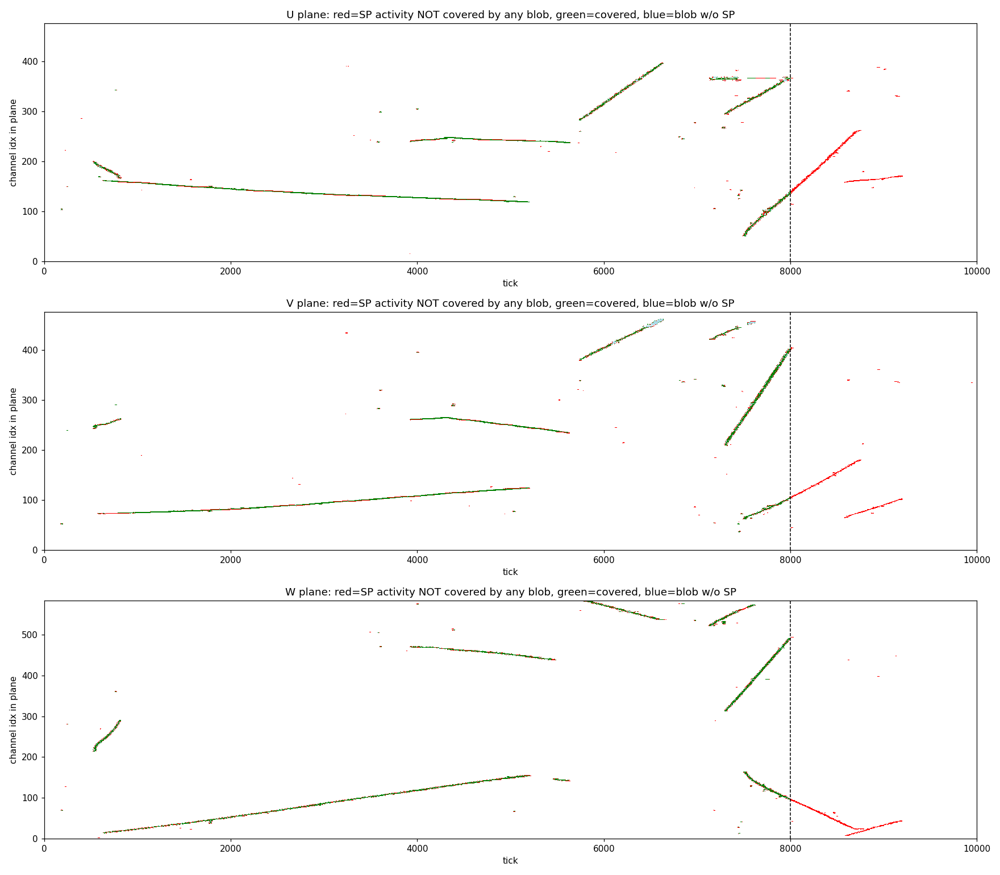
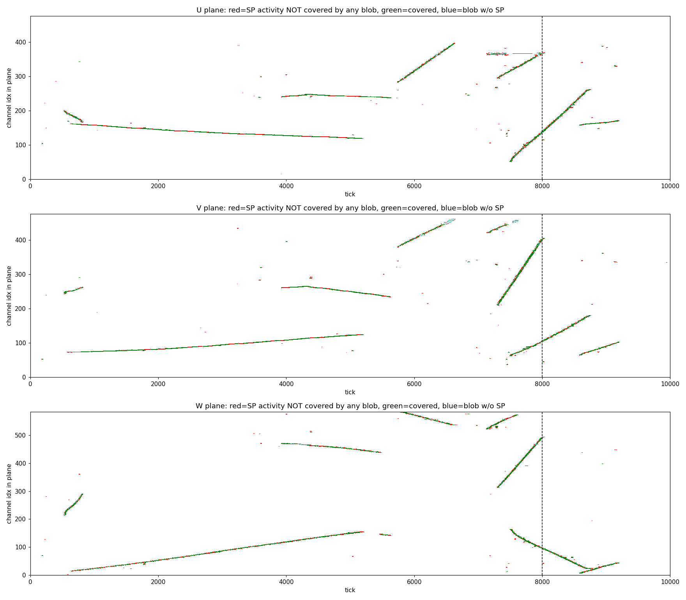

# PDVD run 39252 evt 298679: SP/imaging disagreement = imaging tick-window truncation

**Symptom.** For run 39252, event 298679 (work dir `work/039252_8`, file index 8),
anode 0, the Magnify SP display (`magnify-run039252-evt8-anode0-dnnroi.root`)
shows many clean deconvoluted tracks, but the imaging display shows far fewer
tracks.

**Root cause: `max_tbin: 8000` in the imaging slicing config, not channel
mapping and not a corrupted readout.**  Run 39252 was recorded with a
10000-tick readout; the PDVD imaging config hard-caps slicing at tick 8000, so
the last 2000 ticks (~16% of the SP charge, several whole tracks) never enter
tiling.

## Evidence

Per-plane overlay of SP activity (gauss, `protodune-sp-frames-anode0.tar.bz2`)
vs the channel/tick footprint of every blob in
`clusters-apa-anode0-ms-active.tar.gz` (blob `bounds` wire ranges mapped to
channels with the v5 wires file, slice `start/span` mapped to ticks):



green = SP activity covered by a blob, red = SP activity with **no** blob,
dashed line = tick 8000.

* **Below tick 8000 imaging is healthy**: every SP track is traced by blobs in
  all three planes, on both faces (face ids 0 and 8).  Only 5–7% of SP-active
  samples below 8000 lack blob coverage (scattered single-sample edges, normal
  tiling granularity — not missing tracks).
* **Above tick 8000 coverage is exactly zero.**  The blob slice starts span
  ticks 176 → 7996 and stop dead at the cap.  Tracks crossing tick 8000 (e.g.
  the rising U track at plane-channel 60→260, ticks 7400→8800) are cut
  mid-flight at precisely the dashed line — the signature of a time-window
  cut, not of any per-channel effect.
* Activity above tick 8000: U 5826 / V 4634 / W 5804 nonzero samples
  (15–19% of each plane's total; ~16% of the charge per plane).  These are
  the "missing" tracks in the imaging display.

## Hypotheses ruled out

* **Channel mapping**: blob wire→channel projection lands exactly on the SP
  tracks, channel-by-channel, in U, V and W simultaneously (a mapping error
  would destroy the 3-view coincidence and misalign the overlay).
* **Corrupted readout / per-channel time offsets**: SP and imaging agree
  perfectly over ticks 0–8000; tracks are continuous and straight across the
  full channel range.  Also the "good" and "missing" regions are separated by
  a global tick boundary, identical for all channels.
* **DNN-ROI vs traditional input mismatch**: the gauss frames in
  `protodune-sp-frames-anode0.tar.bz2` (what imaging reads) and
  `protodune-sp-dnnroi-frames-anode0.tar.bz2` are bit-identical for this
  event (same 101081 nonzero samples, same total charge).

## Why only this run

The PDVD readout length is not constant across the runs we process:

| run | frame length (ticks) | truncated by `max_tbin: 8000`? |
|---|---|---|
| 039324 | 6400 | no (cap above frame end) |
| 040475 | 8000 | no (cap exactly at frame end) |
| 039252 | 10000 | **yes — last 2000 ticks dropped** |

All earlier PDVD imaging validation used 039324, where the cap is invisible.
SBND hit the same class of bug and documented it in its own config
(`cfg/pgrapher/experiment/sbnd/img.jsonnet`: `max_tbin: 3427 // ... was 3400,
dropped 27 ticks of real data`).

## Where the cap lives

`cfg/pgrapher/experiment/protodunevd/img.jsonnet`, `slicing()`:

```jsonnet
min_tbin: 0,
max_tbin: 8000,
```

Both the active (3-view, `tick_span=4`) and masked (2-view, `tick_span=500`)
slicings go through this function, so dead-region blobs are truncated the same
way.  All 8 anodes are affected equally.

## Fix (applied, toolkit `cc29f9cc` — see Verification below)

`MaskSlice.cxx` auto-derives the window from the input frame when **both**
knobs are 0 (`min_tbin == 0 and max_tbin == 0` → min/max over the traces'
`tbin`/`tbin+size`).  Setting

```jsonnet
min_tbin: 0,
max_tbin: 0,
```

adapts to the per-run readout length automatically: 6400- and 8000-tick runs
produce the same slices as today (auto extent ≤ current cap), and 10000-tick
runs recover the lost 2000 ticks.  All four parallel slicing branches of one
anode see the same fanned-out frame, so the BlobSetMerge slice-sync invariant
is preserved.  Alternatively a hard `max_tbin: 10000` works but just moves the
trip-wire.

Note: with no T0 in PDVD, slices at late ticks map to apparent drift x beyond
the cathode; downstream clustering containment filters already run with the
relaxed scope filter (see 22_clustering-boundary-merge.md), so the recovered
late-window tracks survive to the display.

### Secondary tick-domain knobs (audit when readout length changes)

Same config file; not the cause here, but tuned for shorter readouts:

* `CMMModifier` `org_hlimit: [8500]` — dead-channel range organization capped
  at tick 8500.
* `FrameQualityTagging` `min_time: 3180, max_time: 7870` — frame-quality
  evaluation window (MicroBooNE-era values).
* `ChargeErrorFrameEstimator` `time_limits: [12, 800]`.

## Verification (fix applied 2026-06-10, toolkit `cc29f9cc`)

`min_tbin: 0, max_tbin: 0` applied to
`cfg/pgrapher/experiment/protodunevd/img.jsonnet` and the full
imaging + clustering chain re-run.

**No-op check, run 039324 evt 0 (6400-tick readout), anode 0:**

* `clusters-apa-anode0-ms-active.tar.gz` — inner content **byte-identical**
  old vs new.
* `-ms-masked` — old had 80 slices covering ticks 0→8000, i.e. 16 phantom
  500-tick dead slices **beyond the 6400-tick frame end** (1040 of 5200 dead
  blobs were artifacts past the readout); new has 64 slices covering 0→6400.
  A second bug fixed by the same change, not a regression.

**Recovery check, run 039252 evt 298679 (10000-tick readout):**



* Anode 0: slices now reach tick 9196 (last activity); blobs 3720 → 4402.
  SP samples without blob coverage drop U 23.7→6.2%, V 20.6→6.6%,
  W 19.4→5.2% — now equal to the below-8000 baseline, i.e. the late window
  is imaged exactly as well as the rest.  Below tick 8000 the coverage is
  unchanged (missed-sample counts within ±3 of the pre-fix run).
* Per-anode blob growth tracks the late-window SP fraction, confirming the
  recovered blobs are the previously-truncated activity:

  | anode | SP activity above tick 8000 | active blobs old → new |
  |---|---|---|
  | 0 | 16.1% | 3720 → 4402 (+18%) |
  | 1 | 26.7% | 2529 → 3288 (+30%) |
  | 2 | 16.9% | 1996 → 2390 (+20%) |
  | 3 | 1.6% | 2363 → 2390 (+1%) |
  | 4 | 17.2% | 10624 → 13017 (+23%) |
  | 5 | 37.0% | 5962 → 10813 (+81%) |
  | 6 | **74.5%** | 3184 → 28350 (+790%) |
  | 7 | 20.3% | 10666 → 14126 (+32%) |

  Anode 6 had three quarters of its event truncated away.
* Clustering re-run end-to-end with no errors: global points 90460 → 222601,
  clusters 95 → 119.

**Bee displays (run 39252 evt 298679, imaging + clustering + dead):**

* post-fix: <https://www.phy.bnl.gov/twister/bee/set/88c307b5-84e1-468d-907f-25efe69b9ef2/event/list/>
* pre-fix baseline: <https://www.phy.bnl.gov/twister/bee/set/7cbd0eca-1428-4b7e-899d-14b6b4fe53e2/event/list/>

Pre-fix outputs preserved in `work/039252_8/bak-pre-tbinfix/` and
`work/039324_0/bak-pre-tbinfix/`.  Other 039252/039253/040475 events still
carry pre-fix outputs; re-run `run_img_evt.sh`/`run_clus_evt.sh` before any
new comparison.

## Full PDHD + PDVD readout-length audit (2026-06-10)

Sweep of both detectors' chains for hard-coded tick counts, after the PDVD
`max_tbin` incident.  Observed readout lengths: PDVD **varies by run**
(6400 / 8000 / 10000 ticks); PDHD is 5999 ticks in all runs processed so far
(027305→029107 checked).

### Adaptive by design (no change needed)

| stage | knob | why it adapts |
|---|---|---|
| NF (both) | `OmnibusNoiseFilter nticks: 0` | 0 = take from input ("Nonzero forces the number of ticks") |
| SP in LArSoft (PDVD `wcls-nf-sp-out.jsonnet`) | `nticks: -1` | adaptive; empirically emitted the full 10000-tick frames for run 39252 |
| DNN-ROI (both) | `dnnroi_nticks = 6000` is only a hint | `DNNROIFinding.cxx` oversize branch; run 39252 log confirms: `input_ticks=10048 exceeds configured nticks=6000, using input-driven size` |
| Magnify TH2s (both) | — | histogram ranges are frame-driven (39252 ROOT has 10000-tick axes) |
| Clustering (both) | `tick: 0.5*us`, `nticks_live_slice: 4` | physics constants / slice span, not readout length |
| Bee conversion | `--speed/--t0/--x0` only | no tick count involved |

### Fixed in this audit

| stage | was | now |
|---|---|---|
| PDVD imaging slice window | `max_tbin: 8000` | `0` (auto) — toolkit `cc29f9cc`, verified above |
| PDHD imaging slice window (`cfg/pgrapher/experiment/pdhd/img.jsonnet`) | `max_tbin: 8500` | `0` (auto) — verified on 027409 evt 0: all 4 APAs' active clusters **byte-identical**; masked slices 17→12 (extent 8500→6000 ticks), dead blobs scaled exactly ×12/17 (phantom slices beyond the 5999-tick readout removed) |
| PDHD imaging Reframer (`pdhd/wct-img-all.jsonnet`) | `nticks: params.daq.nticks` (hard 6000; pads 5999→6000 today, would silently truncate a longer run) | `nticks` TLA, probed from the input frame by `run_img_evt.sh` (probe verified: 5999) |
| PDVD Magnify `Trun.total_time_bin` (`run_sp_to_magnify_evt.sh`) | hard default 6000 (metadata lied on 10000-tick runs; PDHD's script already probed) | probed from the input frame; 39252 ROOT regenerated: total_time_bin 6000→10000, histograms bit-identical |

All live imaging entry points (`wct-img-all.jsonnet`, `wcls-nf-sp-img.jsonnet`,
`wcls-nf-dnnsp-img.jsonnet`, `wcls-img.jsonnet`, sim fans) import the same
canonical per-experiment `img.jsonnet`, so they inherit the `max_tbin` fix.

### Examined and left alone

* `CMMModifier org_hlimit: [8500]` (both) — the organize pass only ever
  *extends* a bad range's end up to 8500; ranges ending beyond 8500 pass
  through untouched.  Verified on the 10000-tick run: dead blobs reach tick
  10000.  Mild inconsistency remains (a mid-frame bad range is extended to
  8500 rather than to the frame end) but nothing is truncated.
* `FrameQualityTagging min_time: 3180 / max_time: 7870` (both) — **dormant**:
  defined in `img.jsonnet` but not wired into the `pre_proc` pipeline
  (`[cmm_mod, frame_masking, charge_err]`); the window is evaluation-only
  anyway.
* `ChargeErrorFrameEstimator time_limits: [12, 800]` (both) — clamps the ROI
  *length* used in the charge-error lookup, not a frame position.  Independent
  of readout length.
* Dormant config variants with stale caps, no importers, untouched:
  `protodunevd/img_bkup_ori.jsonnet` (8500),
  `protodunevd/img_standalone.jsonnet` (6400),
  `pdhd/img_simple.jsonnet` (8500).  Fix if ever revived.

## Reproduction

Analysis scripts (throwaway): `/home/xqian/tmp/img_sp_invest/{cmp_frames,planes,blobmap,overlay,quant}.py`.
Inputs: `pdvd/work/039252_8/` — `protodune-sp-frames-anode0.tar.bz2`,
`clusters-apa-anode0-ms-active.tar.gz`; wires
`protodunevd-wires-larsoft-v5.json.bz2`; blob→channel mapping via
`pdvd/img_plot/geom.py` (`PlaneGeom.channel(wip)`).
