# 42 — Validating the STM trajectory + dQ/dx fit on PDVD against SBND: measured vs predicted 2-D pixel charge, and dQ/dx vs residual range

**Status.** Analysis round with one instrument fix. The STM fit dump's
`T_proj_data` (measured vs predicted 2-D charge) was found **defective on both
detectors** — it carried the prediction of the *last fitted cluster only* — and
is fixed in the toolkit (`clus` + `root`, per-pass snapshots; §1). Every
production output is byte-identical across the fix (gates in §1.5); only
`tracking-stm.root`'s `T_proj_data` changes, and only with `-stm-fit`. **No
knob, no default, no physics constant changed.** Both checks the owner asked for
were then run on fresh arms at today's production operating points: PDVD 120
events (`d42fit`) and SBND 99 events (`work-stmcamp-d42fit`, the 72
owner-adjudicated STM-baseline events of doc 62 plus the 30 doc-55 events).
**§7 (added 2026-09-05, second owner question)** decomposes the residual of
check 1 against the three mechanisms the owner named — the smearing model,
busy events, and PDVD's prolonged topology — and finds the first, with the
other two tested and excluded. It is re-analysis of the same arms; no code,
config, constant or output changed. **§8 (added the same day, third owner
question)** is a toy study of the SP wire filter itself, from the toolkit
source: it confirms the `ind_sigma` derivation is algebraically right, shows its
continuum approximation breaks down above Nyquist — in the direction of
*overstating* the filter — and therefore **withdraws §7.7's proposal to widen
that constant** (§8.6). It also shows the missing width is a genuine per-point
smearing deficit rather than a displaced trajectory, and finds two unused or
truncating approximations inside the fit's own integrator.

**Owner request (2026-09-05).** *"What I would like to validate, using the STM
tagger fitted track trajectory and dQ/dx results, are its performance: 1. the
predicted vs. measured 2D pixel charge after the track trajectory and dQ/dx
fit — compare SBND (pretty good, validated) vs PDVD, all 3 views; 2. for the
STM tagged events, dQ/dx vs residual range (best fitted) for the stopping muon
(remove the Michel electron part) vs the expectation. The above check is on
1. whether our Steiner Graph and terminal build is solid 2. whether the entire
track fitting chain is solid. Use the Magnify-tracking-PDVD machinery."*

**Short answer.**

| | PDVD (585 accepted passes, 120 events) | SBND (45 accepted passes, 99 events) |
|---|---|---|
| charge the trajectory never reaches, `f_off` (median, all planes) | **0.33** [IQR 0.20–0.53]; 21 % of blocks lose > 50 % | **0.05** [0.04–0.08]; 0 % |
| … of which > 5 wires away (`f_off_far`) | 0.25 | 0.002 |
| unexplained fraction on the footprint, `U_foot` (U / V / W) | 0.36 / 0.37 / **0.24** | 0.23 / 0.27 / **0.19** |
| bias on the footprint, `B_foot` (U / V / W) | **−0.22 / −0.22 / −0.10** | −0.07 / −0.07 / −0.09 |
| χ²/N on the footprint, fit's own σ (U / V / W) | 9.2 / 6.5 / 18.4 | 6.8 / 6.6 / 11.0 |
| pull robust rms (U / V / W) | 1.93 / 1.60 / 2.57 | 1.57 / 1.52 / 2.48 |
| dQ/dx vs rr, muon-like stopping tracks: scale k, χ²/11 bins | 45 tracks, **k = 0.93, χ² = 69.5** (shape hump +10 % at 3–20 cm) | 5 tracks, **k = 1.01, χ² = 10.0** |
| dQ/dx vs rr, all accepted passes | 582, k = 0.92, χ² = 2343 (Bragg bin at 0.65 of the table: flat ends, doc 25 §13.6) | 44, k = 1.00, χ² = 51 |

- **Steiner graph / trajectory reach (check 1a):** on PDVD one third of an
  accepted cluster's own 2-D charge lies more than one wire/slice from the
  fitted trajectory, and three quarters of that is more than 5 wires away —
  charge the path never went through. On SBND it is 5 % and essentially none is
  far. This is the doc 39 "fused clusters" residual seen in 2-D, and it is the
  dominant PDVD–SBND difference. It rises to 0.5–0.6 within 60 cm of the
  cathode and within 40 cm of the CRPs (§3.4), and it is larger for short
  tracks (0.61 below 50 cm, 0.22 above 200 cm).
- **Fitting chain where the trajectory IS (check 1b):** the fit describes the
  charge it reaches **well on W** (U 0.24 vs SBND 0.19, bias −0.10 vs −0.09)
  and **worse on U/V**: PDVD's induction planes are systematically
  under-predicted by 22 % (SBND 7 %), with the deficit largest in the Bragg bin
  (−0.28) and flat along the rest of the track (−0.21). The pull widths and
  tails are 20–30 % wider than SBND on U/V and equal on W. **§7 identifies the
  mechanism:** the fit's transverse smearing model puts the charge on too few
  wires. The centre wire is predicted to within 3–9 % on every plane, but the
  first neighbouring wire only to 47–51 % on PDVD U/V against SBND's 84 %, and
  the resulting bias is a monotone function of the model's σ in *wire-pitch*
  units across all six (detector, plane) combinations. PDVD's U/V are the worst
  case because a 7.65 mm pitch turns the same physical spread into the fewest
  wires anywhere in either detector. Overlapping activity (three negative
  tests) and the prolonged topology (bias flat in track angle) are ruled out.
  Nothing is tuned here — `ind_sigma_*_T` is a production constant (§7.7).
- **dQ/dx vs rr (check 2):** for muon-like stopping tracks selected with the
  doc-55 cuts the PDVD Bragg curve follows the 0.45 kV/cm table to a scale
  k = 0.93 (SBND 1.01) with a **+10 % hump at 3–20 cm** relative to the table
  shape, which SBND does not show (χ² 69.5 vs 10.0 for 11 bins). The
  population of *all* accepted passes reproduces doc 25's finding: the median
  PDVD "stop" is flat (contrast 1.07, Bragg bin at 0.65 of the table), so most
  PDVD STM tags are not stopping muons in the data, while SBND's are (contrast
  2.04). The Michel/leftover removal is the tagger's own kink: 154/582 PDVD and
  18/44 SBND accepted passes carry a leftover (median 5.8 / 7.3 cm); anchoring
  at the kink instead of the path end moves the PDVD profile by < 5 % (§4.4).

## 0. Repro block

```bash
# Pins (a peer rebuilds local/lib mid-campaign): /home/xqian/tmp/d42_libpin/{ref,new2}
#   ref   libWireCellClus.so 84a93f34c9d85440c99833eb86f3928f  libWireCellRoot.so 8d7402cf50bfef00eb6a8a1a8785be7b   (pre-fix)
#   new2  libWireCellClus.so 8fd9007c33c38f1495095e6f974b2e1b  libWireCellRoot.so 9ee0a1e8ff642246bb571af0213ff645   (this round)
# toolkit HEAD before the round 6a0f0346; wcp-porting-img 1c2d064c (3803e268 by a peer during it)
cd /nfs/data/1/xqian/toolkit-dev/toolkit && wcbuild && ./build/clus/wcdoctest-clus && ./build/root/wcdoctest-root
cd /nfs/data/1/xqian/toolkit-dev/wcp-porting-img/pdvd
# 0.45 kV/cm reference table (the production particle_dataset.jsonnet since 2026-09-03; self-gated against the compiled jsonnet)
python3 docs/nf_sp_img_clus/scripts/d42_make_ref_dqdx_045.py                         # -> stm/pdvd_ref_dqdx_045.json
# gate arms (2 events: 039252/2, 039349/23), fresh tags, pctrees symlinked from d39r2prov / d41prov
E=/home/xqian/tmp/d42_libpin/events2.txt; R=docs/nf_sp_img_clus/scripts/run_d42_arms.sh
ARM=d42stmchk PIN=new  NOSTMFIT=1 EVENTS=$E JOBS=2 $R      # production chain, vs d41stmon
ARM=d42fitold PIN=ref  EVENTS=$E JOBS=2 $R                 # pre-fix dump
ARM=d42fitnew2 PIN=new2 EVENTS=$E JOBS=2 $R                # fixed dump
python3 docs/nf_sp_img_clus/scripts/d40r3_hash_gate.py d41stmon d42stmchk $E          # PASS 2/2
python3 docs/nf_sp_img_clus/scripts/d42_proj2d_selfcheck.py work/039252_2_d42fitnew2/tracking-stm.root
# the graded arms
ARM=d42fit PIN=new2 JOBS=16 $R                                                       # 120 events, -stm -stm-fit
cd ../sbnd/sbnd_xin && D42_LIBPIN=/home/xqian/tmp/d42_libpin/new2 NJOBS=14 ./stm_campaign/run_d42_stmfit.sh d42fit   # 99 events
STM_EVENTS="284349 285999 286065" D42_LIBPIN=/home/xqian/tmp/d42_libpin/ref D42_NO_STMFIT=1 ./stm_campaign/run_d42_stmfit.sh d42gateold  # + d42gatenew with new2
cd ../../pdvd; F=docs/nf_sp_img_clus/figs; S=../sbnd/sbnd_xin
# check 1: measured vs predicted 2-D charge
python3 docs/nf_sp_img_clus/scripts/d42_proj2d_resid.py --det pdvd --out $F/42_proj2d_pdvd work/*_d42fit/tracking-stm.root
python3 docs/nf_sp_img_clus/scripts/d42_proj2d_resid.py --det sbnd --out $F/42_proj2d_sbnd $S/work-stmcamp-d42fit/nusel_evt*/tracking-stm.root
python3 docs/nf_sp_img_clus/scripts/d42_proj2d_plots.py --pdvd $F/42_proj2d_pdvd --sbnd $F/42_proj2d_sbnd --out $F/42
python3 docs/nf_sp_img_clus/scripts/d42_proj2d_panels.py --det pdvd --block 400 -o $F/42_panel_pdvd_best_039252_16_d42fit_b400.png work/039252_16_d42fit/tracking-stm.root
# check 2: dQ/dx vs residual range
python3 docs/nf_sp_img_clus/scripts/d42_dqdx_rr.py --det pdvd --ref stm/pdvd_ref_dqdx_045.json --ref-key MuonDeDx --out $F/42_dqdx_pdvd work/*_d42fit/tracking-stm.root
python3 docs/nf_sp_img_clus/scripts/d42_dqdx_rr.py --det sbnd --ref $S/nusel_display/stm_ref_dqdx.json --ref-key MuonDeDxBox --max-abs-x 1e9 --out $F/42_dqdx_sbnd $S/work-stmcamp-d42fit/nusel_evt*/tracking-stm.root
python3 docs/nf_sp_img_clus/scripts/d42_dqdx_plots.py --pdvd $F/42_dqdx_pdvd --pdvd-ref stm/pdvd_ref_dqdx_045.json:MuonDeDx --sbnd $F/42_dqdx_sbnd --sbnd-ref $S/nusel_display/stm_ref_dqdx.json:MuonDeDxBox --out $F/42 --tier doc55_muon
# Magnify-tracking renders (doc 43 recipe; drive.C = /home/xqian/tmp/drive.C, cluster INDEX from T_rec.rec_cluster_id)
wire-cell-sbnd-magnify-tracking-convert -bwork/039252_16_d42fit/tracking-stm.root -tT_rec_charge -o/home/xqian/tmp/d42_arms/magnify/track_com_pdvd_039252_16_d42fit.root -f2
( cd /nfs/data/1/xqian/toolkit-dev/Magnify-tracking-PDVD/scripts && xvfb-run -a -s "-screen 0 1920x1080x24" root -l -q loadClasses.C \
  '/home/xqian/tmp/drive.C("/home/xqian/tmp/d42_arms/magnify/track_com_pdvd_039252_16_d42fit.root","<out>.png",10)' )
# sec 7: the mechanism decomposition (re-analysis only; D=/home/xqian/tmp)
python3 docs/nf_sp_img_clus/scripts/d42_shape_diag.py --det pdvd --out $D/d42diag_pdvd work/*_d42fit/tracking-stm.root
python3 docs/nf_sp_img_clus/scripts/d42_shape_diag.py --det sbnd --out $D/d42diag_sbnd $S/work-stmcamp-d42fit/*/tracking-stm.root
python3 docs/nf_sp_img_clus/scripts/d42_shape_diag.py --det pdvd --max-foff 0.15 --out $D/d42clean_pdvd work/*_d42fit/tracking-stm.root
python3 docs/nf_sp_img_clus/scripts/d42_shape_diag.py --det sbnd --max-foff 0.15 --out $D/d42clean_sbnd $S/work-stmcamp-d42fit/*/tracking-stm.root
python3 docs/nf_sp_img_clus/scripts/d42_shape_plots.py --pdvd $D/d42diag_pdvd --sbnd $D/d42diag_sbnd \
    --pdvd-clean $D/d42clean_pdvd --sbnd-clean $D/d42clean_sbnd --out $F/42
python3 docs/nf_sp_img_clus/scripts/d42_ring_frame.py --det pdvd work/*_d42fit/tracking-stm.root   # sec 7.4 frame cross-check
python3 docs/nf_sp_img_clus/scripts/d42_ring_frame.py --det sbnd $S/work-stmcamp-d42fit/*/tracking-stm.root
# sec 8: the wire-filter toy and the smearing-vs-trajectory discriminator
python3 docs/nf_sp_img_clus/scripts/d42_ring_frame.py --det pdvd --tsv $D/d42_rings_pdvd.tsv work/*_d42fit/tracking-stm.root
python3 docs/nf_sp_img_clus/scripts/d42_ring_frame.py --det sbnd --tsv $D/d42_rings_sbnd.tsv $S/work-stmcamp-d42fit/*/tracking-stm.root
python3 docs/nf_sp_img_clus/scripts/d42_wire_filter_toy.py --rings $D/d42_rings_{pdvd,sbnd}.tsv --fig $F/42_wire_filter.png
python3 docs/nf_sp_img_clus/scripts/d42_transverse_moments.py --det pdvd work/*_d42fit/tracking-stm.root
python3 docs/nf_sp_img_clus/scripts/d42_transverse_moments.py --det sbnd $S/work-stmcamp-d42fit/*/tracking-stm.root
# gate record: stm/gates/d42_stm_proj2d_gate.txt
```

The per-block tables (`figs/42_proj2d_{pdvd,sbnd}_blocks.tsv`), the per-track
dQ/dx tables (`figs/42_dqdx_*_tracks.tsv`) and the tier summaries
(`figs/42_dqdx_*_summary.tsv`) are committed; the per-point and per-cell
products (`*_points.tsv`, `*_rr.tsv`, `*_pulls.npz`, 8–12 MB each) and all of
§7's `d42diag_*` / `d42clean_*` tables are regenerated by the commands above.

## 1. The instrument, and the defect found in planning

### 1.1 What exists

The dQ/dx system minimises |data − R·x|² over the measured 2-D charge, and the
per-cell answer is persisted: `TrackFitting::fill_fitted_charge_2d`
(`TrackFitting.cxx:1286-1404`) stores `charge / charge_err / pred_charge /
flag / owning clusters` per (apa, face, plane, wire, slice), and the STM writers
`root/src/{Pdvd,Sbnd}MagnifyTrackingVisitor.cxx::write_proj_data` emit it as the
tree `T_proj_data` (`cluster_id*10+pass / channel / time_slice / charge /
charge_err / charge_pred`) of `tracking-stm.root`, next to `T_rec_charge` (per
fitted point `x y z q nq(=dx) pu pv pw pt rr reduced_chi2 pass status`),
`T_stm_pass` (`kink_num exit_L left_L`) and `T_stm_eval`. Runner:
`pdvd/run_pr_evt.sh -stm -stm-fit` (39 s/event), SBND `run_nusel_evt.sh data
-stm-fit`. The viewer `Magnify-tracking-PDVD` (doc 25 §13.5) draws exactly this
tree: measured charge and `(pred−meas)/meas` per plane (`event/Data.cc:683-800`).
So the owner's check 1 needed no new instrumentation — *if the tree was right*.

### 1.2 Symptom

On PDVD 039252/2 (`d38h20`, the newest arm with the dump) only **6 923 of
177 857** `T_proj_data` cells carried `charge_pred > 0`, Σpred/Σmeas = 2.7 %.
Block by block: cluster 119 (the last one the tagger fitted) had predictions on
91–100 % of its trajectory footprint cells; **every other block had 0.000 on
its own footprint** — including accepted stopping muons with 200–500 fitted
points. The SBND showcase files (docs 42–46) looked healthy only because they
hold one or two blocks.

### 1.3 Root cause

`TaggerCheckSTM::begin_pass_record` (`TaggerCheckSTM.cxx:883-897`) copied the
private fitter's merged `m_fitted_charge_2d` into one grouping-level
accumulator, **last-writer-wins per cell**. Each pass's measured map spans the
**bounding box** of main + associated clusters per (apa, face, plane)
(`TrackFitting::prepare_data`, `get_uvwt_range` →
`get_overlap_good_ch_charge`), so it contains the cells of every earlier
cluster that falls in the box — with `pred_charge = 0`, because this fit's
trajectory is elsewhere. Those zeros overwrote the earlier clusters'
predictions; the visitor then attributed each cell to its owning cluster (from
`global_rb_map`) and found nothing predicted. This is the STM-path twin of doc
pr/109 §8, which fixed the PR stage with per-cluster snapshots; the STM holder
"carries no snapshots, so that path … takes the fallback" — a comment that
described the bug (`PdvdMagnifyTrackingVisitor.cxx:373-376`, now rewritten).

### 1.4 Why it hid

The GUI shows one cluster at a time and the showcase events had one fit; the
ROOT tree hasher used for A/B gates (`qlport/scripts/hash_root_trees.py`)
**cannot see `vector<vector<int>>` branches** — it reports two different
`T_proj_data` trees as SAME (verified here: 155 vs 16 blocks, both "SAME"), so
no gate ever looked at this tree's content. `d42_proj2d_selfcheck.py` now prints
a content sha256 of the sorted cells.

### 1.5 Fix and verification

- `TrackFitting.h/.cxx`: `ClusterFitted2D::pass{-1}` (declared last, so the
  PR-stage `{cluster, ident, cells}` initialiser is untouched) and an additive
  `add_fitted_charge_2d_snapshot(cluster, ident, pass, cells)`.
- `TaggerCheckSTM.cxx`: each `StmPassRecord` keeps **its own** map (copied right
  after its round-2 fit); `persist_stm_fit` queues (cluster, ident, pass, cells)
  and the hand-off block adds them to the `"stm"` holder. The merged accumulator
  is kept for any reader that does not use snapshots. All under `save_stm_fit`.
- Both STM visitors (owner decision 2026-09-05: fix PDVD *and* SBND): a snapshot
  with `pass >= 0` is emitted under exactly `ident*10+pass`, keeping the fitted
  cluster's own cells (owner set) plus owner-less dead-region fillers — the block
  is "this cluster's measured 2-D charge against this pass's prediction", which
  is what the GUI showed before and what a residual metric needs.
- `clus/test/doctest_trackfitting_snapshot_pass.cxx` (3 cases): default pass −1;
  two passes of one cluster stay two entries with their own predictions; adding
  snapshots leaves the merged map alone. `wcdoctest-clus` 306 cases /
  `wcdoctest-root` pass.

| gate | arms | result |
|---|---|---|
| PDVD production chain (`-stm`, no dump), new binary vs `d41stmon` | `d42stmchk`, 039252/2 + 039349/23 | `mabc-pr.zip` member-identical **2/2** |
| SBND bare production chain, old vs new binary | `work-stmcamp-d42gate{old,new}`, 3 events | tsv + Bee members + pctree-pr members identical **3/3** |
| PDVD `-stm -stm-fit`, old vs new binary | `d42fitold` vs `d42fitnew2` | `T_rec_charge T_stm_pass T_stm_eval T_bad_ch Trun` identical, Bee identical; **`T_proj_data` differs** (intended) |
| positive control: predicted fraction of a block's own footprint | same | old: 0.000 on every block but the last; new: 0.57–0.98 on every fitted block |
| the graded arm vs `d41stmon` (verdicts unperturbed by the dump) | `d42fit`, 2 common events | Bee **2/2** identical |

Full record with pins and hashes: `stm/gates/d42_stm_proj2d_gate.txt`.
**Status: NOT bit-identical for `tracking-stm.root::T_proj_data` (the fix);
every production output byte-identical.** PDVD production runs with
`save_stm_fit = true`, so the per-pass copies are now held in memory during
`TaggerCheckSTM::visit` on every PDVD event (a few MB per fitted pass, freed at
hand-off); wall/RSS of `d42fit` (median 38 s, 1.7 GB) match `d41stmon`.

## 2. Metrics — fixed before the numbers

`d42_proj2d_resid.py` (port of `sbnd_xin/scripts/pr109_2d_resid.py` from
near-vertex boxes to whole STM blocks). Per (event, block, plane), over the
block's cells with `charge > 0` and not on a dead channel (`T_bad_ch`):

| symbol | definition | reads on |
|---|---|---|
| **footprint** | cells within 1 channel × 1 slice (Chebyshev) of a fitted point of that plane | — |
| **`f_off`** | 1 − Σy(footprint)/Σy(all): the cluster's own charge the trajectory does **not** pass through; split `f_off_near` (1 < d ≤ 5) / `f_off_far` (d > 5) | Steiner path / terminal reach |
| **`U_foot`** | Σ|y−ŷ|/Σy on the footprint (pr/109's headline) | fit quality where the fit is |
| `B_foot` | (Σŷ−Σy)/Σy on the footprint | charge scale of the prediction |
| χ²/N | Σ((y−ŷ)/σ)²/N, σ = √(err² + (q·rel)² + add²), rel 0.075/0.075/0.05, add 0/0/300 — identical in `pdvd_track_fitting.json` and `sbnd_track_fitting.json` | the fit's own whitening |
| `uncov_foot` | Σy[ŷ=0]/Σy on the footprint | cells the fit reached but predicted nothing |
| pull | (y−ŷ)/σ on covered footprint cells: robust rms 1.4826·MAD, |pull| > 3 fraction | residual shape |
| per rr bin | the footprint sums per residual-range bin of the nearest fitted point | Bragg vs plateau |

The prediction's response reach is ~1 wire (ind σ 0.26–0.43 mm vs 7.65 mm
pitch; add σ_L ≈ 2 mm vs 3 mm slices), so "footprint" is the set of cells the
fit can predict at all; charge beyond it is charge the trajectory did not
visit. **Two limits of this window, measured in §7.2 and to be read with every
number below.** (a) It is physically different per plane and per detector —
±7.65 × ±2.96 mm on PDVD U/V, ±5.10 × ±2.96 on PDVD W, ±3.00 × ±3.13 on SBND —
so `U_foot` and `B_foot` are not directly comparable across planes as
constructed; §7.2 repeats them in two matched windows and the conclusions hold
in all three. (b) It holds 99.8 % of the prediction on PDVD W but only 87–91 %
on PDVD U/V, so the ±1-cell `B_foot` is a slightly truncated prediction against
a full measurement there; dilating to Chebyshev ≤ 2 (100 % of ŷ everywhere)
makes the bias marginally *worse*, not better. `f_off_far` (> 5 cells) is
unaffected by either. Headline population = **accepted passes (status 0)**; the other
statuses are reported alongside (§3.5). Plane bounds: PDVD U [0,3808) V
[3808,7616) W [7616,12288) and 2500 slices; SBND U [0,3968) V [3968,7936) W
[7936,11276) and 857 slices; `T_bad_ch` in ticks (÷4).

Decision rules: the Steiner/terminal verdict is read from `f_off` (PDVD vs
SBND); the fitting-chain verdict from `U_foot`, `B_foot`, the pulls and the
dQ/dx-vs-rr shape χ² and k spread. The PDVD U/V-vs-W split was predicted from the
pitch-blind-constant history (doc 32) before the numbers were read.

## 3. Check 1 — measured vs predicted 2-D charge, all three views

### 3.1 Populations

PDVD `d42fit`: 120 events, 1 806 fitted (cluster, pass) blocks, statuses
0/2/3/4/5/7 = 585/118/674/26/73/330. SBND `work-stmcamp-d42fit`: 99 events
(84 with at least one fit), 92 blocks, 45/12/17/3/3/12. Every fitted block in
both arms passes the footprint positive control (PDVD 108/120 files clean at
0.5, 12 files with one block at 0.38–0.50 — dead cells and unpredicted
footprint cells, see `uncov_foot`; SBND 84/84).

### 3.2 Accepted passes, per plane (median [IQR])

| det | plane | blocks | U_foot | B_foot | χ²/N | uncov_foot | f_off | pull rms | |pull|>3 |
|---|---|---|---|---|---|---|---|---|---|
| PDVD | U | 585 | 0.360 [0.284, 0.466] | −0.221 | 9.2 | 0.036 | 0.335 [0.210, 0.503] | 2.10 | 0.267 |
| PDVD | V | 583 | 0.369 [0.298, 0.471] | −0.217 | 6.5 | 0.032 | 0.390 [0.198, 0.577] | 1.71 | 0.192 |
| PDVD | W | 585 | 0.244 [0.199, 0.314] | −0.101 | 18.4 | 0.009 | 0.294 [0.159, 0.492] | 2.81 | 0.333 |
| PDVD | all | 585 | 0.327 [0.274, 0.408] | −0.185 | 12.5 | 0.031 | 0.334 [0.199, 0.530] | 2.20 | 0.267 |
| SBND | U | 45 | 0.232 [0.188, 0.289] | −0.074 | 6.8 | 0.000 | 0.059 [0.037, 0.087] | 1.86 | 0.175 |
| SBND | V | 45 | 0.270 [0.202, 0.320] | −0.073 | 6.6 | 0.000 | 0.058 [0.025, 0.099] | 1.68 | 0.151 |
| SBND | W | 45 | 0.186 [0.143, 0.221] | −0.091 | 11.0 | 0.000 | 0.046 [0.035, 0.062] | 2.42 | 0.254 |
| SBND | all | 45 | 0.240 [0.196, 0.277] | −0.080 | 9.3 | 0.000 | 0.051 [0.038, 0.082] | 1.89 | 0.205 |

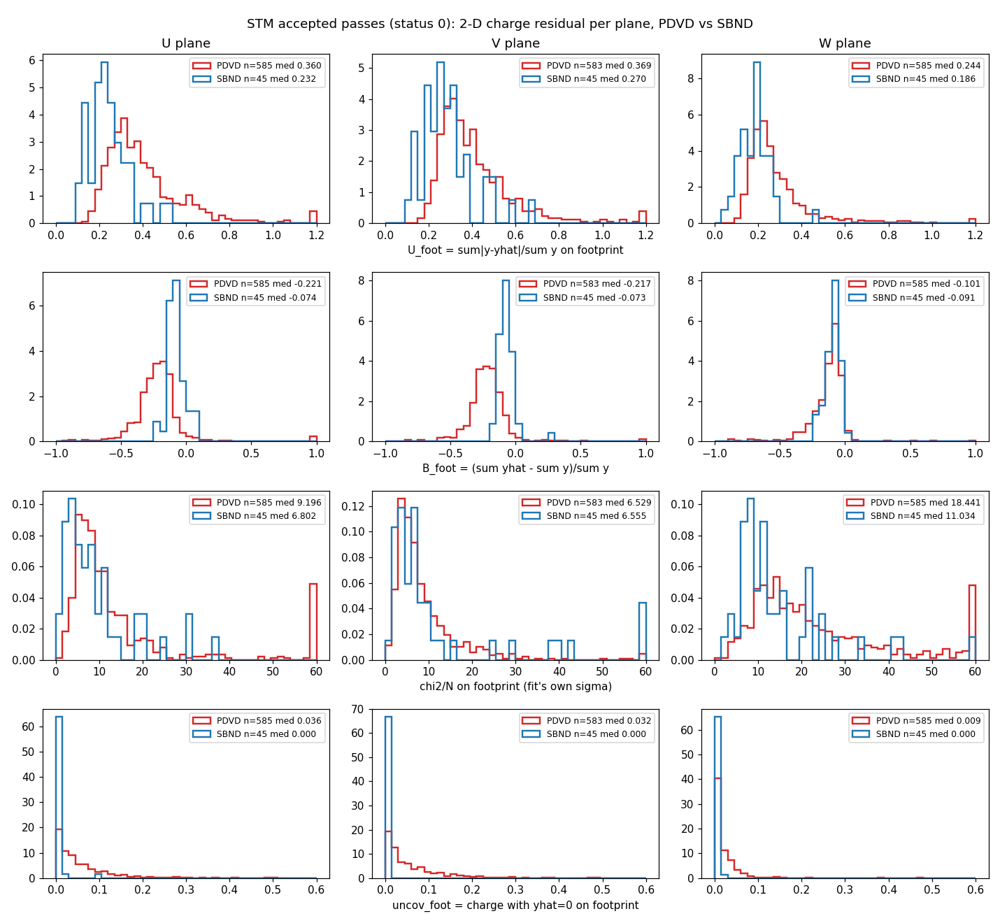

The U/V-vs-W split and the PDVD-vs-SBND gap survive every window tried
(§7.2), and §7 traces both to the fit's transverse smearing model rather than
to the trajectory, to overlapping activity, or to PDVD's prolonged topology.

*Accepted passes: `U_foot`, `B_foot`, χ²/N and `uncov_foot` per plane, PDVD
(red) vs SBND (blue), normalised.*

Reading it:

- **W is the good plane on both detectors.** PDVD W: U 0.24, bias −0.10 —
  within 0.06 / 0.01 of SBND W. The collection plane's charge is described the
  same way on both.
- **PDVD U and V are under-predicted by 22 %** where SBND's are by 7 %. The
  bias distributions are shifted whole (PDVD peaks at −0.25, SBND at −0.08),
  not tailed: a scale on the induction planes. The un-whitened prediction is
  `pred_data · σ_cell` with σ built from `rel_uncer_ind = 0.075`; the fit
  weights W by ¼ in its reduced χ² (`TrackFitting.cxx:8041`) and the three
  planes share one dQ/dx per point, so an induction charge scale that differs
  from the collection one (PDVD's SP W-plane recovery vs the induction planes,
  or the 0.3/0.5 empirical induction smearing factors kept from uBooNE,
  `pdvd_track_fitting.json` comment) shows up exactly as a two-plane bias. It
  is a calibration/uncertainty-model question, not a trajectory one, and is left
  for the owner (§5).
- **PDVD pulls are 20–30 % wider on U/V, equal on W**, and the |pull| > 3
  fraction is one-sided: PDVD U 18.9 % positive vs 5.3 % negative (SBND 9.2 /
  6.1 %) — the measured charge exceeds the prediction. χ²/N is dominated by the
  W plane on both detectors (18.4 vs 11.0), whose `add_uncer_col = 300` and
  narrower pitch make σ small.

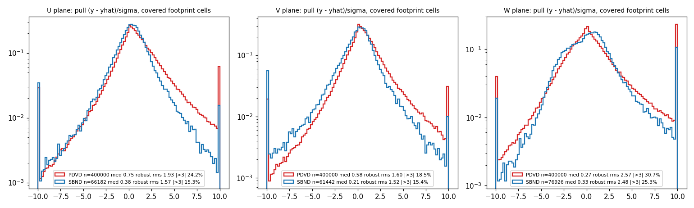

### 3.3 Coverage: charge the trajectory does not reach

| det | plane | f_off median | f_off_near (1–5 wires) | f_off_far (> 5) | blocks with f_off_far > 0.5 |
|---|---|---|---|---|---|
| PDVD | U / V / W | 0.335 / 0.390 / 0.294 | 0.049 / 0.083 / 0.028 | 0.220 / 0.249 / 0.255 | 19 / 21 / 21 % |
| SBND | U / V / W | 0.059 / 0.058 / 0.046 | 0.056 / 0.050 / 0.039 | 0.001 / 0.000 / 0.001 | 0 % |

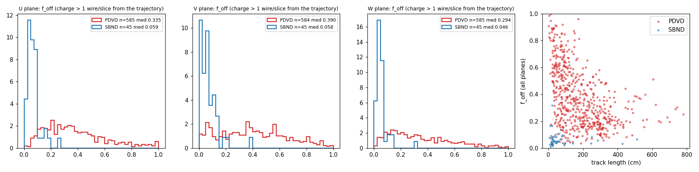

*`f_off` per plane and vs track length. SBND's off-footprint charge is all
within 5 wires (delta rays, the response tails); PDVD's is mostly far.*

The near component (1–5 wires) is the **same on both detectors** (5–8 %) — that
is the physics halo a trajectory cannot describe. The far component is the
difference: on PDVD a median quarter of an accepted cluster's charge, and more
than half in one block of five, is charge that the fitted path never visited.
By track length: `f_off` 0.61 for L < 50 cm, 0.46 for 50–100, 0.35 for 100–200,
0.22 above 200 cm — short accepted passes on PDVD are mostly *not* the cluster
they were accepted for. This is the imaging-level fusion of doc 39 (median
90.7 % 3-D coverage on the fitted set, "one defect: fused multi-track
clusters") measured in the 2-D charge for every accepted pass, and it is the
Steiner/terminal answer: **the graph reaches what it is pointed at, but on PDVD
the cluster handed to it is one third something else.**

### 3.4 Drift position (PDVD)

| median |x| of the block (cm) | blocks | U_foot | B_foot | f_off |
|---|---|---|---|---|---|
| 0–60 | 30 | 0.255 | −0.137 | 0.481 |
| 60–120 | 59 | 0.305 | −0.160 | 0.355 |
| 120–180 | 94 | 0.296 | −0.166 | 0.254 |
| 180–240 | 164 | 0.306 | −0.182 | 0.273 |
| 240–300 | 150 | 0.336 | −0.192 | 0.355 |
| 300–340 | 88 | 0.416 | −0.248 | 0.575 |

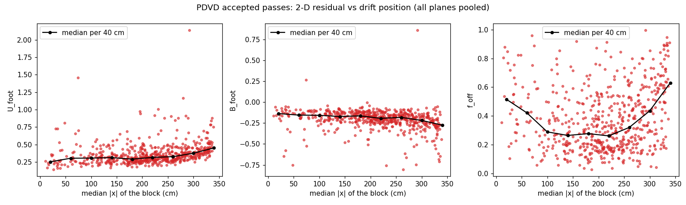

The bias grows monotonically towards the CRPs (−0.14 near the cathode to
−0.25 at |x| > 300 cm) and `U_foot` with it; `f_off` is U-shaped — worst near
the cathode (0.48) *and* near the CRPs (0.58), best mid-drift (0.25). The
near-CRP rise is the region doc 25 §13.4 excludes from every dQ/dx profile
(|x| > 305 cm); it is now seen in the 2-D residual as well.

### 3.5 By residual range, and by tagger status

| det | plane | U 0–2 | 2–5 | 5–10 | 10–20 | 20–40 | 40+ | B 0–2 | 2–5 | 5–10 | 10–20 | 20–40 | 40+ |
|---|---|---|---|---|---|---|---|---|---|---|---|---|---|
| PDVD | U | 0.473 | 0.398 | 0.365 | 0.333 | 0.352 | 0.344 | −0.283 | −0.243 | −0.226 | −0.207 | −0.211 | −0.214 |
| PDVD | V | 0.474 | 0.415 | 0.386 | 0.343 | 0.336 | 0.358 | −0.286 | −0.254 | −0.232 | −0.200 | −0.198 | −0.211 |
| PDVD | W | 0.429 | 0.318 | 0.263 | 0.238 | 0.246 | 0.243 | −0.308 | −0.197 | −0.139 | −0.103 | −0.110 | −0.103 |
| SBND | U | 0.314 | 0.235 | 0.257 | 0.222 | 0.207 | 0.247 | −0.176 | −0.096 | −0.066 | −0.052 | −0.067 | −0.094 |
| SBND | V | 0.315 | 0.275 | 0.255 | 0.278 | 0.303 | 0.309 | −0.154 | −0.113 | −0.072 | −0.074 | −0.058 | −0.070 |
| SBND | W | 0.280 | 0.187 | 0.170 | 0.153 | 0.145 | 0.197 | −0.166 | −0.091 | −0.097 | −0.078 | −0.060 | −0.073 |

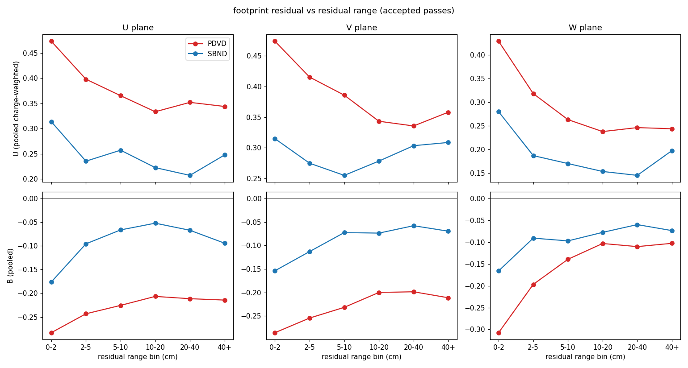

Both detectors describe the Bragg bin worst (U 0.43–0.47 PDVD, 0.28–0.31
SBND) with the prediction 17–31 % low there — the end of the track is where
the trajectory and the charge model are weakest on either detector. Along the
plateau PDVD's U/V deficit stays at −0.21 while SBND's falls to −0.06.

By status (PDVD, `U_foot` median): accepted 0.327, long-leftover (2) 0.483,
dQ/dx-rejected (3) 0.322, guard-rejected (7) 0.310 — the fit quality on the
footprint is the same for accepted and rejected passes; the tagger's verdict
is not driven by how well the fit describes the charge.

### 3.6 Pictures — the Magnify machinery

Best / median / worst `U_foot` among PDVD accepted passes with ≥ 100 fitted
points, and the median SBND one, each as (a) the Magnify-tracking GUI rendered
headlessly (doc 43 recipe; top row dQ/dx along the track, 3-D view; middle
measured charge; bottom `|pred−meas|/meas`) and (b) the same block through
`d42_proj2d_panels.py` with the predicted charge as its own row and the signed
residual.

| pick | event / block | U_foot | B_foot | f_off | npts | GUI | panels |
|---|---|---|---|---|---|---|---|
| PDVD best | 039252/16 cluster 40 | 0.158 | −0.052 | 0.551 | 111 | `figs/42_magnify_pdvd_best_039252_16_d42fit_b400.png` | `figs/42_panel_pdvd_best_039252_16_d42fit_b400.png` |
| PDVD median | 039253/17 cluster 77 | 0.318 | −0.184 | 0.543 | 129 | `figs/42_magnify_pdvd_median_039253_17_d42fit_b770.png` | `figs/42_panel_pdvd_median_039253_17_d42fit_b770.png` |
| PDVD worst | 039253/2 cluster 75 pass 1 | 1.165 | −0.201 | 0.766 | 156 | `figs/42_magnify_pdvd_worst_039253_2_d42fit_b751.png` | `figs/42_panel_pdvd_worst_039253_2_d42fit_b751.png` |
| SBND median | 278662 cluster 1 | 0.263 | −0.073 | 0.036 | 390 | `figs/42_magnify_sbnd_median_nusel_evt278662_b10.png` | `figs/42_panel_sbnd_sbnd_nusel_evt278662_b10.png` |

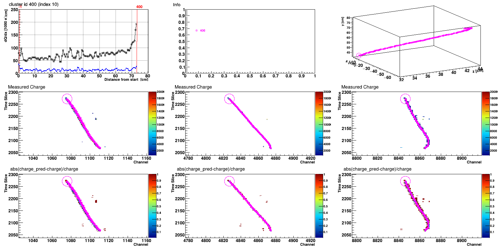

*PDVD best: a clean 73 cm stopping track; the residual pads are blue (< 0.2)
along the whole track on all three planes and the dQ/dx rises at the end.
Even here `f_off` = 0.55 — half of cluster 40's charge is elsewhere in the
cluster, outside these pads.*

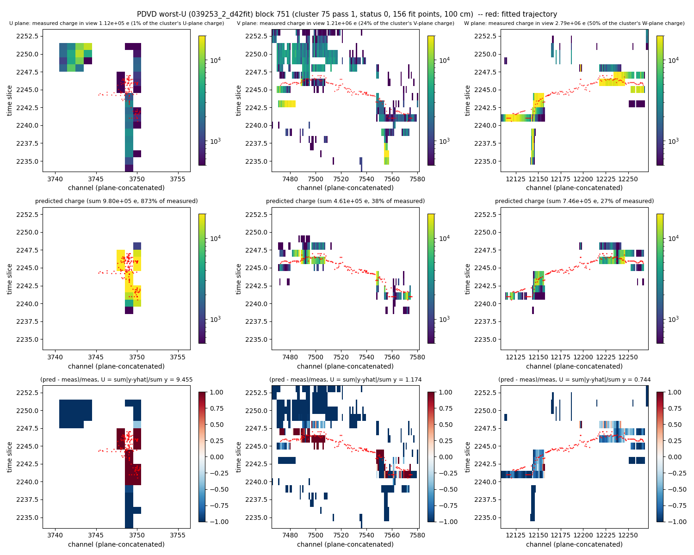

*PDVD worst, an accepted pass: a 100 cm path through a multi-track cluster;
the trajectory rides a small part of the charge, the prediction is 27–38 % of
the measured charge on V/W and 9× on the sparse U cells. This is a false STM
tag (a 156-point path through debris), and it is the class the far
off-footprint charge counts.*

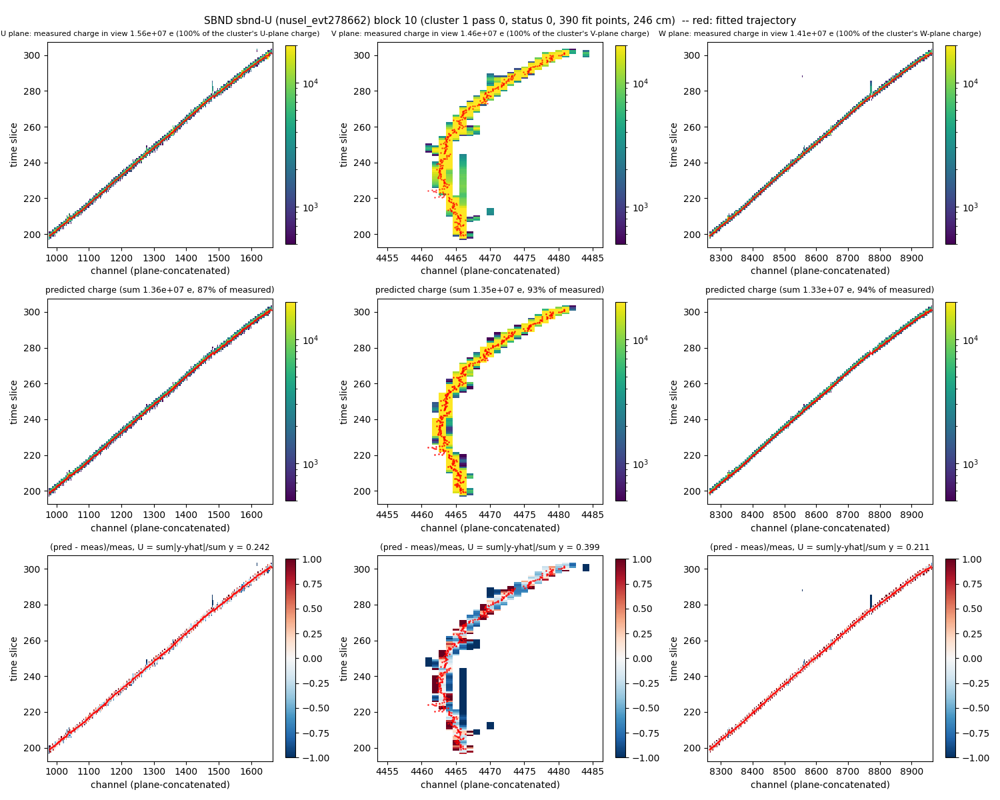

*SBND median: 390 points, `f_off` 0.04, the residual pads uniform.*

## 4. Check 2 — dQ/dx vs residual range for the tagged stopping muons

### 4.1 Sample and method

`d42_dqdx_rr.py`: accepted passes (status 0) from `T_rec_charge` + `T_stm_pass`;
dQ/dx = ((q − offset)/scale)/nq in e/cm; **Michel / leftover removal = the
tagger's own kink**: when `left_L > 0` the points past `kink_num` are dropped
and rr is re-anchored there (`rr_kink = rr − rr[kink]`); the path-end anchor
(`persist_stm_fit`'s `rr`) is kept as the cross-check. PDVD points with |x| >
305 cm are excluded (near-CRP rise, doc 25 §13.4). Expectation: PDVD the
**0.45 kV/cm** Modified-Box muon table the production config carries since
2026-09-03 (`stm/pdvd_ref_dqdx_045.json`, self-gated against the compiled
`particle_dataset.jsonnet`; doc 25 graded the 0.44 set), SBND the 0.5 kV/cm
Box table `MuonDeDxBox` that its tagger uses. Per tier one global scale
k_pop = exp(median log(dQ/dx / table)) is removed and the per-bin median of
dQ/dx/(k_pop·table) is compared to 1 with a 1.2533·MAD/√n error and a 3 %
systematic floor (doc 25 §13.6 convention).

| det | tier | tracks | points | k_pop | χ²/11 | per-track k med ± rms | contrast med | leftover frac |
|---|---|---|---|---|---|---|---|---|
| PDVD | all status 0 | 582 | 143 379 | 0.922 | **2343** | 0.86 ± 0.25 | **1.07** | 0.27 |
| PDVD | contrast ≥ 2 | 102 | 25 314 | 0.916 | 47.2 | 0.97 ± 0.25 | 2.43 | 0.32 |
| PDVD | doc-55 five cuts | 47 | 13 039 | 0.926 | 67.8 | 1.00 ± 0.09 | 2.29 | 0.36 |
| PDVD | doc-55 + muon k ∈ [0.85, 1.25] | **45** | 12 544 | **0.931** | **69.5** | 1.01 ± 0.08 | 2.29 | 0.36 |
| SBND | all status 0 | 44 | 5 186 | 0.997 | 50.7 | 1.07 ± 0.46 | **2.04** | 0.41 |
| SBND | contrast ≥ 2 | 16 | 1 750 | 1.098 | 56.7 | 1.08 ± 0.43 | 2.17 | 0.38 |
| SBND | doc-55 five cuts | 10 | 926 | 1.379 | 88.2 | 1.47 ± 0.43 | 2.17 | 0.40 |
| SBND | doc-55 + muon k | **5** | 483 | **1.009** | **10.0** | 1.04 ± 0.01 | 2.25 | 0.80 |

(The doc-55 cuts without the k window admit protons on SBND — k 1.4–1.9, the
doc 55 §11 population — which is why `collect_dqdx_rr_sample.py` assigns the
particle by k; the muon-k tier is the like-for-like one. SBND's k_pop = 1.009
reproduces doc 55 §13's k ≈ 1 on the same operating point, the sanity check
this round was gated on.)

### 4.2 The Bragg curve

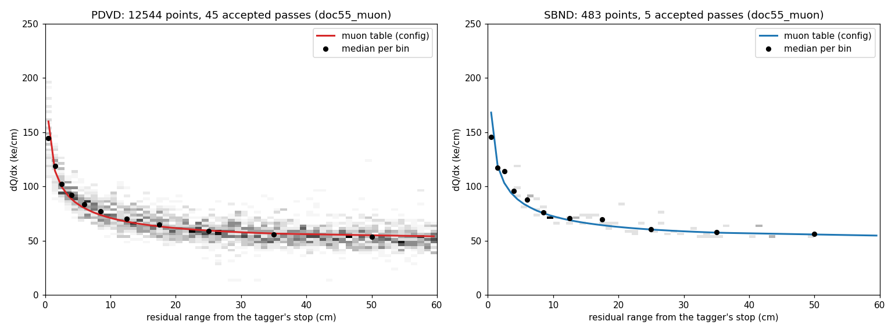

*Muon-like stopping tracks (doc-55 cuts + muon k), kink-anchored, leftover
removed; the detector's own muon table in colour, per-bin medians in black.*

Per-bin median dQ/dx / (k_pop × table), muon-like tier:

| det | 0–1 | 1–2 | 2–3 | 3–5 | 5–7 | 7–10 | 10–15 | 15–20 | 20–30 | 30–40 | 40–60 |
|---|---|---|---|---|---|---|---|---|---|---|---|
| PDVD | 1.017 | 1.066 | 1.110 | 1.110 | 1.115 | 1.123 | 1.117 | 1.098 | 1.063 | 1.056 | 1.049 |
| SBND | 0.905 | 0.954 | 1.104 | 1.052 | 1.045 | 1.002 | 1.011 | 1.062 | 0.984 | 0.994 | 0.978 |

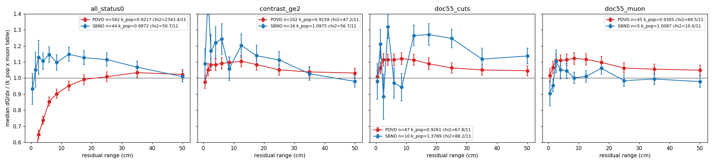

*Per tier: the ratio to the scaled table. PDVD all-status-0 (left) collapses
to 0.65 in the 1–2 cm bin — the flat ends of doc 25 — and recovers to the
table only with a contrast cut; the muon-like tier (right) sits 5–12 % above
the table shape at 2–20 cm and 2–5 % at the plateau.*

Reading it:

- **PDVD follows the table at k = 0.93** (SBND 1.01; both within the 3–6 %
  uncalibrated gain / recombination-fudge freedom doc 25 §7c lists). The PDVD
  *shape* deviates: relative to the table the data is 1.02 in the Bragg bin,
  1.11–1.12 through 2–15 cm, 1.05 at the plateau — a **hump of +10 % at 3–20
  cm**, the same sign in every bin, χ² 69.5 for 11 bins against 10.0 on SBND.
  With k fixed by the plateau instead, the Bragg bin would read 0.97 and the
  hump +6 %. Doc 25 §13.6 saw the strict 5-track sample at χ²/10 = 6.9 against
  the 0.44 table with the same rise at 3–10 cm; with 45 tracks it is now
  significant. Candidate mechanisms, none tested here: the table's 0.45 kV/cm
  and Box parameters (the hump is where dE/dx changes fastest, i.e. where the
  recombination model matters most — doc 55 §7d found the same under-prediction
  of the upper dE/dx half on SBND and fitted a free-power form), the end-trim
  at 20 cm (doc 38) moving points near the stop, and the induction-plane charge
  deficit of §3.2 feeding the joint dQ/dx.
- **The population of all accepted passes is not a stopping-muon sample on
  PDVD.** Median Bragg contrast 1.07 (SBND 2.04); the ratio falls to 0.65 in
  the 1–2 cm bin and the χ² is 2343. This is doc 25 §13.6's purity finding
  re-measured on today's chain with 582 passes: the tagger accepts flat ends,
  and only a contrast cut (102 passes) or the doc-55 cuts (47) leave a Bragg
  peak. The SBND accepted population *is* muons (χ² 51 for 44 passes, 3 false
  STM against the owner's hand adjudication, §4.5).

### 4.3 Per-track quantities

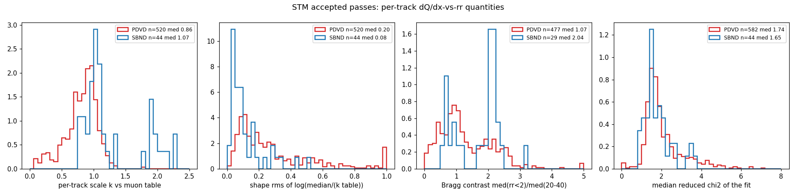

*Per accepted pass: scale k, shape rms, Bragg contrast, median reduced χ² of
the trajectory fit.* PDVD's k distribution peaks at 0.9 with a low tail (flat
ends read as k < 0.8 against a Bragg table); the shape rms is 0.15–0.4 for most
PDVD passes vs 0.1 for SBND muons; the trajectory fit's reduced χ² medians are
2.0 (PDVD) vs 1.6 (SBND).

### 4.4 The Michel / leftover removal

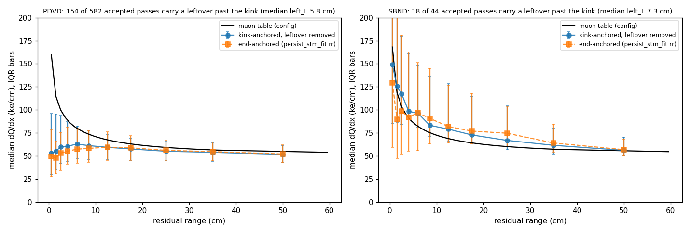

*Kink-anchored (leftover removed) vs end-anchored profiles, all accepted
passes.* 154 of 582 PDVD passes (26 %) and 18 of 44 SBND passes (41 %) carry a
leftover past the tagger's kink, median `left_L` 5.8 / 7.3 cm. Re-anchoring at
the kink changes the PDVD population profile by < 5 % in every bin (both
anchors are flat at the end); on SBND it sharpens the Bragg bin (149 vs 128
ke/cm at 0–1 cm) and lowers the 15–30 cm bins by 8–10 % — the leftover, which
on SBND is Michel-sized, was inflating the plateau when the path end was the
anchor. Doc 25 §13.6 showed that the PDVD material past the kink is collinear
muon continuation at 0.88 MIP, not a Michel; the kink anchor is still the
right one because it is the tagger's own hypothesis, and the small effect on
PDVD says the same thing that doc did.

### 4.5 SBND today vs the owner's doc-62 adjudication (sanity)

On the 72 in-beam bundles the owner hand-adjudicated (doc 62): tagged & owner
STM 33, tagged & owner not 3, untagged & owner STM 4, untagged & owner not 32
— 65/72 agreement at today's operating point against 56/72 at the doc-62
baseline (the doc 63/94 campaigns removed 12 of the 15 false tags; 3 remain:
278662 main 1, 290201 main 9, 319809 main 20; and 3 owner-STM bundles the
baseline tagged are now untagged: 283463/14, 315849/10, 401824/4). The SBND
reference arm is therefore the validated tagger at its production point, not a
degraded one.

## 5. What the two checks say, and what to do next

1. **Steiner graph and terminals — solid in reach, not in what they are
   handed.** Where the trajectory goes it sits on the charge (PDVD W plane
   `U_foot` 0.24 vs SBND 0.19; `uncov_foot` 3 %). What differs by a factor 7
   is `f_off`: a third of an accepted PDVD cluster's charge is not on the path
   and three quarters of that is > 5 wires away, worst for short passes and at
   both drift ends. That is the fused-cluster residual of doc 39 and the
   false-tag class of doc 25, in 2-D. **Next:** the `f_off_far` column of
   `42_proj2d_pdvd_blocks.tsv` is a per-pass fusion score with no tuning in
   it; a cut on it (e.g. > 0.5, 21 % of accepted passes) is a candidate
   STM-purity guard that the contrast census could not give, and the same
   number grades any cluster-splitting round (doc 39's "only lead that moves
   both axes").
2. **Fitting chain — sound on W, biased on U/V, and §7 says why.** The 22 %
   induction under-prediction is uniform along the plateau and largest at the
   Bragg end, absent on SBND (7 %). It is **the transverse smearing model**:
   the forward model spreads each point's charge over too few wires, so the
   centre wire is right (3–9 %) and the first neighbour is not (47–51 % on
   PDVD U/V vs SBND's 84 %). Ordered by the model's σ in wire-pitch units the
   bias is monotone across both detectors and all three planes, flattening near
   −0.09 once σ ≳ 0.4 pitch; PDVD U/V sit at 0.20 pitch because of the 7.65 mm
   pitch and the small `ind_sigma_*_T` derived from PDVD's sharp `Wire_ind`
   filter. Busy events and prolonged topology were tested and are not the cause
   (§7.3, §7.5). §8 then goes to the SP wire filter those constants are
   derived from and shows the filter is a near-identity on PDVD, so
   `ind_sigma_*_T` is **not** the knob — see §8.6 for the withdrawn
   recommendation and §8.7 for what replaces it. **Next:** the SP 2-D spectrum
   dump of §8.7 item 1, the unused induction branch of §8.7 item 2, and the
   per-plane dQ/dx readout (the R·x split per plane exists inside `dQ_dx_fit`) on the 45
   muon-like tracks, to see whether the +10 % Bragg-region hump of §4.2 is the
   induction deficit propagating or the recombination table.
3. **dQ/dx vs rr — the table is followed to a scale; the shape has a +10 %
   hump at 3–20 cm that SBND lacks**, on a sample nine times doc 25's. The
   recombination-model question (Box vs the doc-55 free-power form, and the
   0.45 kV/cm field) is now measurable on PDVD; the sample is the
   `doc55_muon` tier of `42_dqdx_pdvd_tracks.tsv`. **Not tuned here** (§5 rule
   7): the hump, the k = 0.93 and the induction bias are reported as readings.
4. **The instrument.** `T_proj_data` is trustworthy from this round on, for
   both detectors, and `d42_proj2d_selfcheck.py` is the positive control to
   run on any new STM-fit arm. The generic tree hasher stays blind to jagged
   branches; the content hash the self-check prints is the one to record.


## 6. Files

- toolkit: `clus/inc/WireCellClus/TrackFitting.h`, `clus/src/TrackFitting.cxx`,
  `clus/src/TaggerCheckSTM.cxx`, `root/src/PdvdMagnifyTrackingVisitor.cxx`,
  `root/src/SbndMagnifyTrackingVisitor.cxx`, `clus/test/doctest_trackfitting_snapshot_pass.cxx`.
- scripts (`docs/nf_sp_img_clus/scripts/`): `run_d42_arms.sh`,
  `d42_proj2d_resid.py`, `d42_proj2d_plots.py`, `d42_proj2d_panels.py`,
  `d42_proj2d_selfcheck.py`, `d42_dqdx_rr.py`, `d42_dqdx_plots.py`,
  `d42_make_ref_dqdx_045.py`, `d42_shape_diag.py`, `d42_shape_plots.py`,
  `d42_ring_frame.py` (§7), `d42_wire_filter_toy.py`,
  `d42_transverse_moments.py` (§8);
  SBND arm `sbnd_xin/stm_campaign/run_d42_stmfit.sh`.
- products: `figs/42_*.png` (incl. `42_shape_{window,profile,drift,angle,h2,sigma}.png`,
  §7), `figs/42_proj2d_*_blocks.tsv`,
  `figs/42_dqdx_*_{tracks,summary}.tsv`, `stm/pdvd_ref_dqdx_045.json`,
  `stm/gates/d42_stm_proj2d_gate.txt`.
- arms on disk: `work/<ev>_d42fit` (120), `sbnd_xin/work-stmcamp-d42fit` (99),
  gate arms `d42stmchk`, `d42fitold`, `d42fitnew`, `d42fitnew2`,
  `work-stmcamp-d42gate{old,new}`.

## 7. Why the fit under-explains the charge it reaches — the owner's three mechanisms, tested

**Owner question (2026-09-05).** *"I understand that the Steiner Graph is solid
now. In this case, what are the so-called unexplained fraction on the
footprint? This show up as own charge the trajectory never reaches? 1. Is it
related to the smearing function that we used in the track fitting (Signal
Processing and Diffusion coefficient)? 2. Is it due to busy events, many
activities overlapping leading to difficulty to explain the 2D charge in a
region (charge from other tracks)? 3. I assume many of the PDVD tracks are
prolonged topology for induction plane, this means that the signal ROI is long
in time. This means the charge uncertainty in the induction plane are larger.
Is this related to the issue?"*

All of §7 is re-analysis of the arms already on disk (`d42_shape_diag.py`,
`d42_shape_plots.py`); no wire-cell was run, no tag created, no constant moved.

### 7.1 First: `f_off` and `U_foot` are two different measurements

They are not the same quantity and the second does **not** show up as the
first. Median over accepted blocks, U plane (§3.2):

| | question it answers | PDVD | SBND |
|---|---|---|---|
| `f_off` | *where* is the cluster's charge — how much of it is off the trajectory altogether | 0.33 | 0.05 |
| `U_foot` | of the charge the trajectory **does** pass through, how much does the predicted image get wrong, cell by cell | 0.36 | 0.23 |

`f_off` counts charge in cells the fit never predicts into; `U_foot` counts
disagreement in the cells it does. A block can have `f_off` = 0 and `U_foot` =
0.4, or the reverse. §5's first verdict (Steiner reach) rests on `f_off`; this
section is entirely about `U_foot` and its signed partner `B_foot`, and it does
not revisit the Steiner conclusion.

### 7.2 Control first: how much of the plane pattern is the window?

A ±1-cell footprint is **±7.65 mm × ±2.96 mm** on PDVD U/V, ±5.10 × ±2.96 on
PDVD W and ±3.00 × ±3.13 on SBND — physically different windows, so `U_foot`
and `B_foot` at ±1 cell are not directly comparable across planes or
detectors. Two windows that *are* comparable: Chebyshev ≤ 2 cells, which holds
**100 % of the prediction on every plane and both detectors**, and a matched
physical radius of 12 mm with |Δt| ≤ 1 slice.

| B | PDVD U | PDVD V | PDVD W | SBND U | SBND V | SBND W |
|---|---|---|---|---|---|---|
| ±1 cell (§3.2's window) | −0.216 | −0.212 | −0.110 | −0.086 | −0.076 | −0.080 |
| Chebyshev ≤ 2 (all of ŷ) | −0.222 | −0.212 | −0.133 | −0.103 | −0.094 | −0.085 |
| matched 12 mm | −0.197 | −0.198 | −0.104 | −0.078 | −0.070 | −0.100 |
| fraction of ŷ inside ±1 cell | 0.908 | 0.873 | **0.998** | 0.974 | 0.983 | 0.972 |

(These are charge-weighted pooled values over all accepted blocks; §3.2's table
quotes per-block medians, which differ by ≤ 0.01.)

The last row is the one worth knowing: on PDVD's induction planes 9–13 % of the
prediction falls **outside** the ±1-cell footprint, against 0.2 % on PDVD W.
Dilating the window to hold all of it makes the bias slightly *worse*, not
better. The PDVD U/V-vs-W gap of ≈ 0.10 and the PDVD-vs-SBND gap survive every
window, so the §3.2 headline stands; the ±1-cell numbers are within 0.01–0.02
of the matched ones. `f_off_far` (> 5 cells) is untouched by any of this.

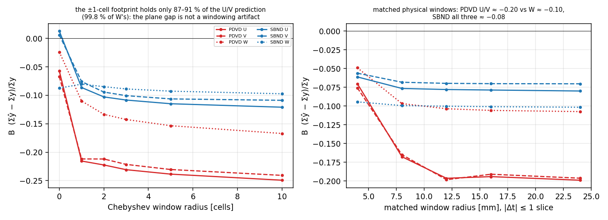

### 7.3 Mechanism 2 — busy events / overlapping activity: **not the cause**

Three independent tests, all negative:

- **Restrict to unfused blocks.** Blocks whose off-trajectory charge is below
  15 % (PDVD 168 of 585) give B at 12 mm of −0.205 / −0.186 / −0.089 against
  −0.197 / −0.198 / −0.104 for all blocks. No improvement.
- **Sort by fusion.** Median B across `f_off_far` quartiles is flat:
  PDVD U −0.22 / −0.21 / −0.22 / −0.26, V −0.22 / −0.20 / −0.23 / −0.21,
  W −0.11 / −0.10 / −0.13 / −0.17. Only the busiest quartile of W moves.
- **Is the residual localised?** Overlapping charge from another track would
  pile the residual into a few cells. The top 1 % of cells hold only **8–11 %**
  of Σ|y−ŷ| on PDVD and 7–9 % on SBND — the residual is spread over essentially
  every cell, on both detectors alike.

Note also that the doc-42 writer already emits only the fitted cluster's own
cells (§1.3), so charge from a *different* cluster is not in the block at all;
what remains is intra-cluster fusion, and it does not move `B_foot`. Busy
events are what make `f_off` 0.33 — they are not what makes `U_foot` 0.36.

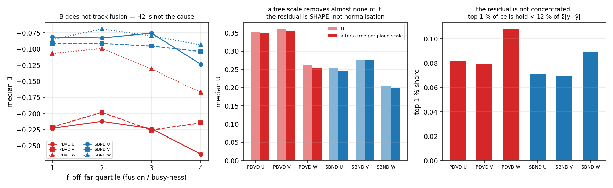

### 7.4 Mechanism 1 — the smearing function: **this is the cause**

The forward model spreads each trajectory point's charge with
σ_T = hypot(√(2·D_T·t_drift), `ind_sigma_<p>_T`) / pitch and
σ_L = hypot(√(2·D_L·t_drift), `add_sigma_L`) / tick
(`TrackFitting.cxx:7306-7312`). Measuring the charge-weighted transverse
profile about the fitted trajectory, measured against predicted:

| | PDVD U | PDVD V | PDVD W | SBND U | SBND V | SBND W |
|---|---|---|---|---|---|---|
| measured rms [mm] | 5.05 | 5.24 | 2.94 | 2.24 | 2.00 | 2.17 |
| predicted rms [mm] | 4.30 | 4.68 | 2.30 | 1.89 | 1.79 | 1.99 |
| **width the model misses**, √(Δrms²) [mm] | **2.65** | **2.34** | 1.82 | 1.19 | 0.89 | 0.87 |

The model is too narrow on **every** plane of **both** detectors, and PDVD's
induction planes miss 2–3 mm against SBND's ~1 mm. Splitting the profile by
wire ring says exactly where the charge goes missing — predicted/measured, with
the share of the measured charge that ring holds:

| ring | PDVD U | PDVD V | PDVD W | SBND U | SBND V | SBND W |
|---|---|---|---|---|---|---|
| centre wire | 0.92 (71 %) | 0.91 (68 %) | 0.97 (77 %) | 1.00 (57 %) | 1.00 (62 %) | 0.92 (55 %) |
| **first neighbour** | **0.47** (25 %) | **0.51** (26 %) | 0.69 (22 %) | **0.84** (42 %) | **0.84** (37 %) | 0.89 (44 %) |
| second neighbour | 0.76 (4 %) | 0.86 (6 %) | 0.13 (1 %) | 0.33 (1 %) | 0.29 (1 %) | 0.52 (1 %) |

The centre wire is predicted to within 3–9 % everywhere. The deficit is almost
entirely the **first neighbouring wire**, where PDVD's induction planes recover
only about half the measured charge against SBND's 84 %. Two effects compound:
SBND puts 37–44 % of its charge on the neighbours and PDVD only 22–26 % (the
larger pitch), and PDVD then predicts a smaller fraction of that smaller share.
For PDVD U this is 0.25 × (1 − 0.47) = 0.13 of the block's charge lost from the
first ring alone, on top of 0.06 from the centre — which is the −0.20 bias.

**Frame cross-check.** Those rings are measured from each cell's *nearest
fitted point*, whose wire coordinate can sit up to ~0.8 wires from where the
track actually crosses that slice — and because PDVD is 83 % prolonged against
SBND's 15 % (§7.5) the bias is not symmetric between the detectors.
`d42_ring_frame.py` repeats the table in a frame that cannot have it: the
trajectory is densified to a 0.2-cell step and each cell's distance is taken to
the trajectory **at the cell's own time slice**. First-neighbour ratios become
PDVD 0.50 / 0.57 / 0.63 and SBND 0.78 / 0.80 / 0.86 (centre 0.89 / 0.88 / 0.96
and 0.99 / 0.98 / 0.90). Every number moves by ≤ 0.06 and the PDVD-vs-SBND
contrast survives, so the reading does not depend on the frame.

A free per-plane scale confirms this is not a normalisation error — refitting
one scale factor per block leaves `U_foot` at 0.35 (from 0.35, k = 1.06). The
same is visible in the window ladder: B at the single nearest cell is only
−0.057 / −0.067 / −0.024 on PDVD, so the fit's core is nearly right and the
missing charge is all in the wings.

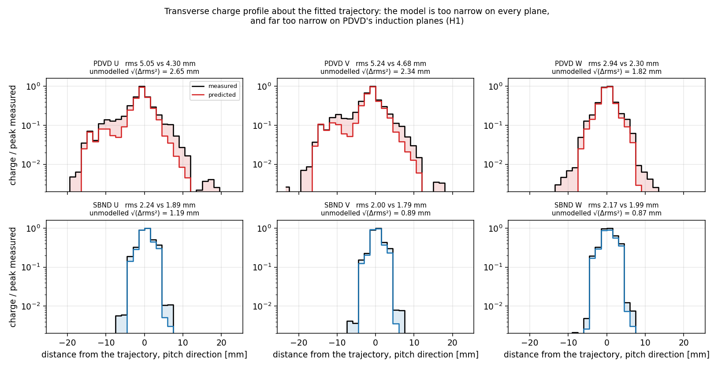

**Splitting the smearing into its two halves.** A diffusion (D_T) shortfall
grows as √t_drift; a wrong SP-filter constant does not. Across drift terciles
the missing width goes 2.24 → 2.59 → 2.93 mm (PDVD U), 2.16 → 2.50 (V),
1.62 → 1.97 (W) — it **does** grow with drift, so part is diffusion; but it
starts at 2.2 mm at the shortest drift, so a large part is drift-independent
and belongs to the `ind_sigma_*_T` / `col_sigma_w_T` constants. The unfused
subset gives the same slopes. SBND shows no clean drift trend (n = 45).

**But the drift-correlated part is probably not diffusion either.** Charging
the whole growth to D_T requires Δ(σ²) = 2·ΔD_T·Δt: PDVD U's 1.90 → 2.68 mm
across a Δt of 1 526 µs is 3.57 mm², i.e. ΔD_T ≈ **11.7 cm²/s** on top of the
configured 7.91 — a total near 20 cm²/s, well outside the physical range for
liquid argon at 0.45 kV/cm. So the drift trend is unmodelled spread that
*correlates* with drift rather than a diffusion coefficient that is simply too
small, and **nobody should propose moving D_T on the strength of it** — D_T is
a physical constant shared with the simulation (`_comment_diffusion`). This
strengthens rather than weakens the filter-constant reading.

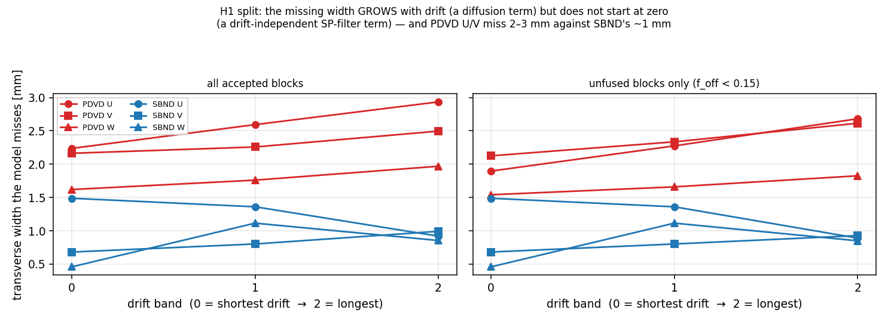

**Why PDVD's induction planes are the worst place for this.** What the fit
actually needs is the spread in *wire pitches*, and that is where PDVD's
geometry bites: the diffusion term is 1.53 mm at PDVD's median drift and
1.22 mm at SBND's — comparable — but PDVD divides it by a **7.65 mm** pitch and
SBND by 3.00 mm.

| | σ_model [pitch] | of which SP-filter term | B (Cheb ≤ 2) |
|---|---|---|---|
| PDVD U | 0.203 | 0.034 | −0.222 |
| PDVD V | 0.208 | 0.056 | −0.212 |
| PDVD W | 0.300 | 0.011 | −0.133 |
| SBND W | 0.409 | 0.031 | −0.085 |
| SBND U | 0.438 | 0.161 | −0.103 |
| SBND V | 0.488 | 0.269 | −0.094 |

Ordered by σ_model in pitch units, the bias is **monotone across both
detectors and all three planes** (Spearman 0.83) and flattens at about −0.09
once σ ≳ 0.4 pitch. One parameter reproduces the entire plane-and-detector
pattern that §3.2 reports. PDVD's U/V sit at the bad end for two compounding
reasons: the largest pitch of any plane in either detector, and the smallest
SP-filter term (`ind_sigma_u_T` = 0.259 mm = 0.034 pitch, derived in doc 25 §7b
from PDVD's `Wire_ind` filter σ = 1/√π · 5.0, against SBND's 1/√π · 1.05 →
0.161 pitch).

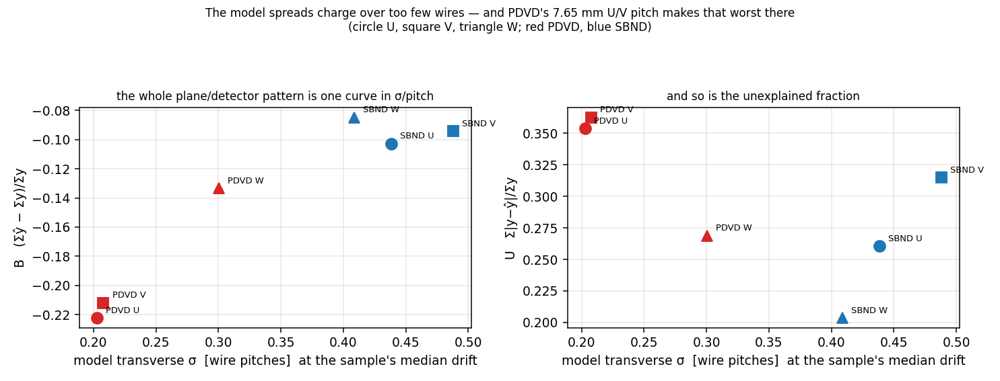

This is exactly the revisit that `pdvd_track_fitting.json`'s own comment asks
for — *"The trailing 0.2/0.3/0.5 factors are empirical uBooNE tunings kept on
purpose (revisit with PDVD fit residuals)"*. **Nothing is changed here**: these
are production constants and moving one is stop-and-ask (§5 rule 1). §7.7 names
the arm that would test it.

### 7.5 Mechanism 3 — prolonged topology: premise confirmed, consequence is on the *uncertainty*, not the bias

Define θ_P = atan2(|Δt|·slice_mm, |Δwire|·pitch_mm) from the local track
direction: 0° = isochronous (moves along wires at constant time), 90° =
prolonged (moves along the drift, one wire, many ticks). This is
dimensionally fair across planes and detectors.

**The owner's premise is right, and by a wide margin.** Share of collection-plane
charge above θ_W = 45°: **PDVD 83 %, SBND 15 %**. PDVD's drift is vertical and
its cosmic muons come down along it, so PDVD tracks are prolonged where SBND's
are isochronous. This is the single biggest topological difference between the
two samples.

**But it does not drive the bias.** B is flat in θ_P on PDVD U
(−0.22 / −0.18 / −0.18 / −0.18 / −0.22 / −0.20 across the six bins) and on V;
PDVD W is actually *worst* at the isochronous end (−0.24 at θ < 15°, −0.09
above 30°). `U_foot` does rise at the prolonged end — PDVD U 0.28 → 0.38 from
45–60° to 75–90° — but SBND rises by the same amount over the same bins
(0.25 → 0.33), so that part is geometry common to both detectors, not a PDVD
defect.

**The uncertainty half of the owner's point is true, with one correction.**
Induction cells do carry far more charge uncertainty than collection cells on
PDVD — absolute `charge_err` ≈ 1 400–2 000 e on U and 1 900–3 000 e on V
against **360–550 e** on W, a factor 4–6. And `charge_err/charge` does climb
with prolongedness (PDVD U 0.062 → 0.167, V 0.114 → 0.239, while W stays
0.046). But the *absolute* error is nearly flat over the same range (U 1 604 →
1 988 e); the ratio climbs mostly because the charge per cell falls by 2.2× as
the deposit is spread over more time slices. So: induction charge on PDVD is
much less certain than collection charge, and prolonged segments dilute it
further — but the uncertainty is not *growing* with prolongedness, and it is
not what makes the prediction 22 % low.

One related PDVD-only fact worth recording: the median accepted block has
**16.1 % of its U cells and 8.5 % of its V cells dead**, against 1.5 % on W and
0 % on every SBND plane. Dead cells are excluded from both y and ŷ so they do
not bias `B_foot`, but they are why the fit has least information exactly on the
planes it describes worst.

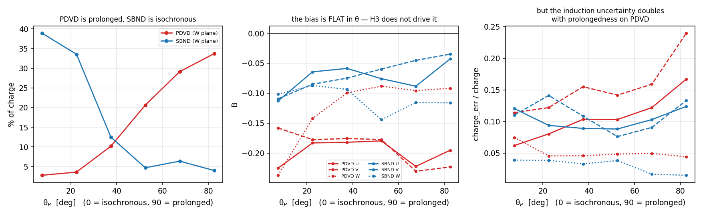

### 7.6 Answer, in one paragraph

The unexplained fraction on the footprint is **the fit's forward model putting
the charge on too few wires**. The trajectory is in the right place — measured
and predicted transverse profiles share a centroid to 0.03 wires on every plane
— and the cell nearest each trajectory point is predicted to within 2–7 %; what
is missing is the charge on the neighbouring wires, where PDVD's induction
planes recover only half of what is measured, and summed over a block that is
20–22 % of the induction-plane charge. It is not overlapping activity (§7.3, three
negative tests) and it is not the prolonged topology (§7.5, B flat in θ). It
**is** the smearing function (owner's hypothesis 1), in both of its halves — a
diffusion term that grows too slowly with drift and an SP-filter constant that
is too small — and PDVD's induction planes are the worst case because a 7.65 mm
pitch converts the same physical spread into the fewest wires of any plane in
either detector.

### 7.7 What to measure next (readings, not tunings)

1. ~~**The one arm that would settle it.**~~ **Superseded by §8.6** — the toy
   study of the wire filter shows `ind_sigma_*_T` is the wrong vehicle: it
   represents the SP software wire filter, which on PDVD is a near-identity
   operator contributing 0.21 mm, so widening it to absorb 2–3 mm would be a
   fudge wearing that constant's name. §8.7 lists what to do instead. The
   original text is kept for the record: `ind_sigma_u_T` / `ind_sigma_v_T` are
   production constants, so this is stop-and-ask, not a flip: run a gated arm
   with `-A trackfitting_config=<a copy of pdvd_track_fitting.json>` carrying
   `ind_sigma_u_T` and `ind_sigma_v_T` widened to the measured missing width
   (≈ 2.7 / 2.4 mm, i.e. 0.35 / 0.31 pitch — SBND's working point is 0.16 /
   0.27 pitch), against the `d42fit` arm on the same 120 events and the same
   pctrees. Treat that target as an **indicator, not a calibration**:
   √(rms² − rmŝ²) assumes two Gaussians and the profiles are combs with
   wire-pitch teeth and non-Gaussian tails, and restricting to unfused blocks
   already moves PDVD U from 2.65 to 2.35 mm — so scan two or three values
   rather than trusting one. Prediction if §7.4 is right: `B_foot` on U/V moves from −0.22
   toward PDVD W's −0.13, `U_foot` falls, and the dQ/dx-vs-rr scale k rises
   from 0.93 toward 1. Grade with `d42_proj2d_resid.py` + `d42_dqdx_rr.py`
   unchanged. **The knob is a runtime JSON file, so the compiled config is
   byte-identical either way — the arm must be graded on outputs, never on a
   config hash** (the file's own `_comment_canonical` says so).
2. **Whether it propagates to the physics.** §4.2's +10 % dQ/dx hump at
   3–20 cm is the open question this bears on; the per-plane dQ/dx readout
   already recommended in §5.2 is the way to see whether the hump is the
   induction deficit arriving in the charge or the recombination table.
3. **The diffusion half separately.** The missing width grows with drift faster
   than D_T = 7.91 cm²/s predicts. D_T is a *physical* constant taken from the
   BNL parameterisation at 0.45 kV/cm (`_comment_diffusion`), so a mismatch
   here is either the field/temperature assumption or unmodelled spread that
   happens to correlate with drift — worth separating before anyone touches
   D_T, which would also move the simulation.
4. **`f_off_far` is unaffected by all of this** and remains §5.1's
   recommendation: it lives at > 5 cells, far outside the ~1-wire reach of the
   smearing question, and PDVD 0.25 vs SBND 0.002 is too large a contrast to be
   a windowing effect.

## 8. Toy study of the wire filter: is `ind_sigma` mis-derived, or is the approximation breaking down?

**Owner question (2026-09-05).** *"Did I understand correctly that the current
ind_sigma used in the track trajectory fitting is derived from the wire filter,
but this approximation is not good for the PDVD situation due to wide wire
pitch? Or did we somehow miscalculate the smearing width? Can you perform a toy
study on this wire filter to see what is actually the issue here? It is possible
that some of our approximation broken down? I am not sure if a brute force scan
is the answer here, we should understand this smearing situation better."*

**Short answer.** The algebra is right; the approximation does break down; but it
breaks in the direction that makes the filter contribute *less*, not more — so
the filter is **not** where the missing width can come from, and `ind_sigma_*_T`
is the wrong knob to scan. §7.7's first recommendation is corrected in §8.6.

`d42_wire_filter_toy.py` reproduces the filter from the toolkit source rather
than from any fit.

### 8.1 What the filter is, and where the closed form comes from

Three files define it:

| | |
|---|---|
| `cfg/.../sp-filters.jsonnet` | `wf(name, {sigma: 1/√π · X, power: 2, flag: false, max_freq: 1})`; PDVD `Wire_ind` X = 5.0, `Wire_col` X = 10.0; SBND 1.05 and 3.60 |
| `sigproc/src/HfFilter.cxx:39-61` | `filter_waveform(N)`: `freq = i/N · 2 · max_freq`, wrapped to [−1, 1) — so **freq is in units of the Nyquist frequency** |
| `util/src/Response.cxx:441` | `hf_filter = exp(−0.5·(freq/σ)^power)` |

Applied in `OmnibusSigProc.cxx:1306-1310` along the **wire** axis of each plane
after the response division. With f in Nyquist units and k in cycles per wire
(f = 2k), the filter is exp(−2k²/σ²); matching that to the transform pair
exp(−2π²σ_x²k²) gives

> σ_x = 1/(π·σ) = **1/(√π·X) wires**

which is exactly the closed form `pdvd_track_fitting.json` and
`sbnd_track_fitting.json` use. **So the derivation is not a miscalculation** —
it is the correct continuum inverse transform of that filter.

### 8.2 …but the continuum step is only valid below Nyquist, and PDVD is far above it

The closed form assumes the frequency-domain Gaussian dies inside the band that
is actually sampled. It does not, except on SBND's induction plane:

| | X | σ_f [Nyquist] | filter at Nyquist | closed form [wires] | **true kernel rms** | overstated by |
|---|---|---|---|---|---|---|
| PDVD ind | 5.00 | 2.82 | **0.939** | 0.1128 | **0.0278** | 4.1× |
| PDVD col | 10.00 | 5.64 | **0.984** | 0.0564 | **0.0070** | 8.1× |
| SBND ind | 1.05 | 0.59 | 0.241 | 0.5373 | 0.4683 | 1.15× |
| SBND col | 3.60 | 2.03 | 0.886 | 0.1567 | 0.0529 | 3.0× |

("true kernel" = the inverse DFT of exactly the array `filter_waveform(3808)`
returns.) The real-space kernels say the same thing more plainly:

| kernel | h[0] | h[±1] | h[±2] |
|---|---|---|---|
| PDVD ind | 0.979 | +0.012 | −0.003 |
| PDVD col | 0.995 | +0.003 | −0.001 |
| **SBND ind** | **0.675** | **+0.174** | −0.016 |
| SBND col | 0.961 | +0.023 | −0.006 |

**SBND's induction filter is the only one that does anything**: it moves 35 % of
each wire's charge onto its two neighbours. PDVD's filters pass ≥ 94 % of every
frequency the lattice can carry — they are near-identity operators, and a
"width" of 0.11 wires is not a quantity the wire lattice can represent.

So the owner's reading is right *and* the sign is worth stating: the
approximation breaks down at PDVD's setting, and correcting it would make the
modelled smearing **narrower** (0.21 mm instead of 0.86 mm before the empirical
0.3 factor, 0.06 mm after it), not wider.

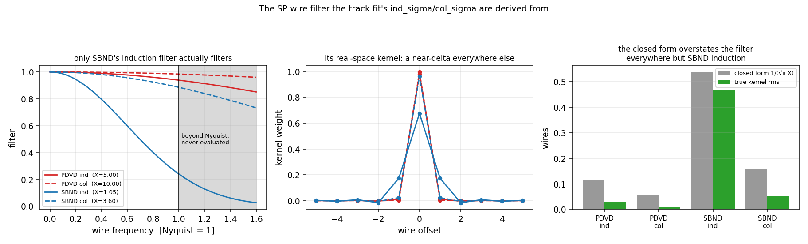

### 8.3 Which means the filter cannot be the missing width

`ind_sigma_*_T` exists to represent one thing: the SP software wire filter. On
PDVD that filter contributes **0.21 mm** on induction and **0.04 mm** on
collection. The width §7 measures as missing is 2–3 mm. The filter is two
orders of magnitude short of it, so widening `ind_sigma_*_T` to 0.35 pitch would
not be a re-derivation of anything — it would be an unphysical fudge factor
wearing the name of the SP filter. **The owner is right that a brute-force scan
is not the answer.**

It also explains why SBND's model works and PDVD's does not, and the reason is
not the pitch alone: SBND's SP genuinely smears charge across wires and SBND's
`ind_sigma` (0.161 pitch, against a true 0.468 × the 0.3 factor = 0.140) happens
to describe it well. PDVD's SP does no wire smoothing, the model therefore
carries diffusion only — and PDVD's data still shows transverse spread that
nothing in the model accounts for.

### 8.4 The missing width is real, and it is not the trajectory being in the wrong place

Before blaming any smearing term, the alternative had to be excluded: if the
trajectory were simply displaced from the true track, the *ensemble* profile
about the trajectory would be broadened while each individual profile stayed the
model's width. That is a trajectory problem, not a smearing one, and it has a
different fix.

`d42_transverse_moments.py` separates them by measuring, per (block, plane, time
slice), the width of the measured and predicted profiles **about their own
centroids** — so the bin width, the track's extent within the slice and the
drift spread all cancel — and the displacement between the two centroids:

| | rms measured [mm] | rms predicted | **width in quadrature** | median displacement |
|---|---|---|---|---|
| PDVD U | 4.28 | 2.89 | **3.16** | 0.84 |
| PDVD V | 4.11 | 2.86 | **2.96** | 0.85 |
| PDVD W | 3.19 | 2.51 | **1.96** | 0.31 |
| SBND U | 2.96 | 2.75 | 1.11 | 0.32 |
| SBND V | 2.42 | 2.33 | 0.64 | 0.39 |
| SBND W | 3.21 | 3.21 | **0.00** | 0.15 |

The measured profile is wider than the predicted one **at each point**, so this
is a genuine smearing deficit and not a displacement artifact. It is worst on
PDVD's induction planes, present on PDVD W, small on SBND U/V, and **exactly
zero on SBND W** — the one plane whose model needs nothing. A displacement
exists too (0.84 mm on PDVD U against 0.32 on SBND U) but it is the smaller
effect. The per-slice displacement autocorrelates at +0.45 for lag 1 and dies by
lag 5, which is **not** evidence of trajectory wander: the longitudinal spread
(σ_L ≈ 0.8 slices) puts one deposit into adjacent slices, so neighbouring slices
are not independent samples and a lag-1 correlation is expected with a perfect
trajectory.

### 8.5 Two approximations inside the model itself

Found while reading `cal_gaus_integral`; both are the fit's own, not the SP's.

1. **A hard `nsigma` window.** `TrackFitting.cxx:6267` contributes a wire bin
   only if `|wbin − w_center| ≤ nsigma·w_sigma`, and **all nine call sites pass
   nsigma = 4**. That is harmless while 4σ comfortably exceeds one wire, and
   PDVD is the only place it does not: 4σ = 0.81 wires on U, 0.83 on V, 1.20 on
   W, against SBND's 1.64–1.95. The toy puts the cost at about 6 % of the
   first-neighbour share on PDVD U/V and nil on SBND — real, small, and worth
   knowing because it is a pure artefact of a threshold, not physics.
2. **`flag = 0` at all nine call sites** — the pure-Gaussian branch. The
   `flag = 1` *"induction plane with bipolar response"* and `flag = 2` *"more
   complex induction plane response"* branches exist in `cal_gaus_integral`
   (`:6284-6340`) and are **never reached**, so U and V are modelled with
   exactly the same transverse shape as the collection plane. Given that the
   deficit is worst on the induction planes of both detectors, this is the more
   interesting of the two.

### 8.6 Correction to §7.7

§7.7 item 1 recommended a gated arm widening `ind_sigma_u/v_T` toward the
measured missing width. **§8.2–8.3 withdraw that as a first step.** The constant
represents the SP wire filter, the filter is measured here to be a near-identity
on PDVD, and setting it to 0.35 pitch would be assigning a physical name to a
number that has nothing to do with the thing it names. §7's *measurement* — the
model is too narrow, monotonically in σ/pitch — stands unchanged; only the
proposed vehicle was wrong.

What §7.4 called "an SP-filter term that is too small" is better stated as: the
model has **no term at all** for the transverse spread that PDVD's data shows,
and the constant that looks like it ought to carry it does not.

### 8.7 What to measure next

1. **Find where the 2–3 mm enters, before modelling it.** `OmnibusSigProc`
   already has the taps, both default-off: `dump_2d_spectra` / `dump_2d_prefix`
   (`:212-213`) writes the per-plane input, response, deconvolved spectrum and
   wire filter to npz, and `rawdecon_tag` (`:207`) taps the deconvolved frame
   *before* any software filter. Running one PDVD event with these on and
   measuring the transverse profile of an isolated stopping muon at each stage
   separates three candidates that no fit-side scan can distinguish: residual
   field-response spread the 2-D deconvolution does not remove, something added
   downstream in imaging/ctpc, and genuine physical spread (delta rays). This
   is the measurement to do first.
2. **Test the induction branch that already exists.** `flag = 1` in
   `cal_gaus_integral` is the bipolar-response induction model, written and
   unused. Reaching it for U and V is a code change behind a default-OFF knob,
   not a constant change, and it is the one candidate whose shape is physically
   motivated for the planes that need it. It should be measured against
   `d42fit` before any width constant is touched.
3. **`nsigma` is a cheap, honest sensitivity test.** Raising it from 4 changes
   no physics constant — it only stops truncating a Gaussian the model already
   has. Worth one arm to bound its size, expecting ~6 % of the first-neighbour
   share on PDVD U/V.
4. **Do not move `D_T`** (§7.4) or `ind_sigma_*_T` (§8.3) on this evidence.
