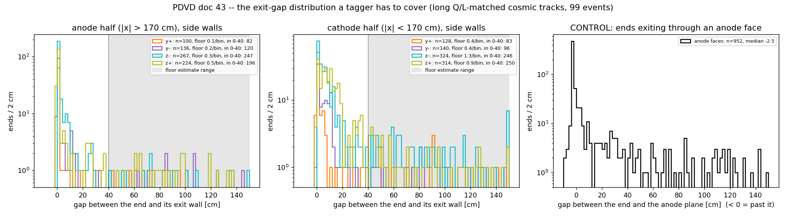
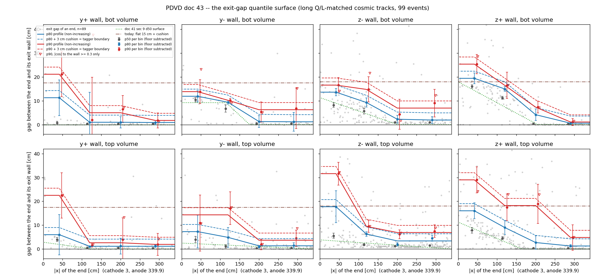
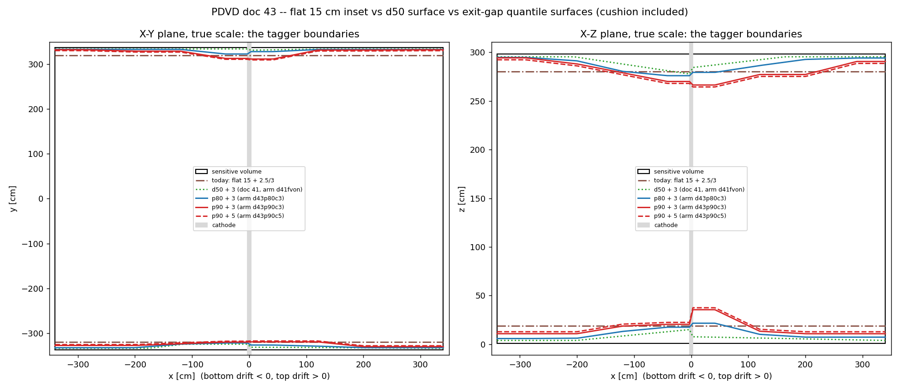
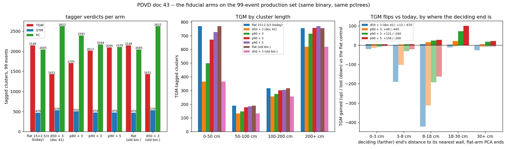

# 43 — A fiducial volume from exit-gap quantiles, and what it does to the taggers

**Status: PDVD PRODUCTION since 2026-09-05 at p90 + 5 cm (owner decision, §8).
The driver `pdvd/wct-pr-perevt.jsonnet` now passes `curved_fv=true,
curved_fv_profile='p90', curved_fv_margin_y/z=5`; the toolkit knobs keep their
default-OFF values for any other caller. §1–7 are the measurement and the A/B
that led to the decision, written before it.**

Follows doc 41 §13, which ended with the owner's scan: four of the long tracks the
median-based curved surface had un-tagged are through-going, so a tagger boundary
has to be built from the *endpoint tail*, not from a charge-density median. The
owner's charge for this round (2026-09-05): build that boundary from
closest-approach quantiles per wall / drift volume / drift bin, with the quantile
stated as the operating point and a cushion beyond what was measured, rerun the
99 events, and grade it on the existing tests — the TGM count first.

Two things happened on the way that change the picture from §13, and both are in
the figures:

1. **§13's "closest approach within a cap" is not an exit sample.** It admits a
   track that passes a wall at 30 cm on its way out through another one, and that
   contamination is exactly the tail a quantile reads: raising §13's cap from 25 to
   40 cm moved the pooled anode-half p90 from 15 to 26 cm. The instrument used here
   assigns every end of every long track to the wall its own direction exits
   through, and the tail shrinks by half: anode half p80 1.7, p90 5.6 cm.
2. **A p90 surface with a 3 cm cushion is not a *different* volume from today's
   flat inset in total** — it calls the same 7.4 % of exit ends contained — it is a
   *redistributed* one: 7 % in each drift half instead of 4 % at the anode and
   11 % at the cathode. The TGM count follows that redistribution, §6.

## 1. Repro

```bash
cd /nfs/data/1/xqian/toolkit-dev/wcp-porting-img/pdvd
S=docs/nf_sp_img_clus/scripts; F=docs/nf_sp_img_clus/figs; T=/home/xqian/tmp/doc43

# the exit census on the flat (production) arm: one row per end of a long cluster
python3 $S/fv_exit_census.py --tag d41fvoff --out $T/exits                      # -> $T/exits_rows.json  (= $F/43_exit_rows.json)
# the quantile table, the profiles, and the two figures
python3 $S/fv_quantile_surface.py $T/exits_rows.json --d50 $F/41_fv_surface.json --out $T/q
#   -> $T/q_table.json (= $F/43_quantile_table.json), $T/q_profiles.jsonnet
#      (= toolkit cfg/pgrapher/experiment/protodunevd/curved_fiducial_profiles.jsonnet),
#      $F/43_exit_quantile_surface.png, $F/43_exit_gap_tail.png
# offline: each boundary's per-end miss rate, in-sample and run-split cross-validated, + the true-scale polygons
python3 $S/fv_quantile_offline.py $T/exits_rows.json --table $T/q_table.json --d50 $F/41_fv_surface.json --out $T/off
#   -> $F/43_offline_miss.json, $F/43_boundaries.png
# the byte-identity proof of the knob (six compiles, two cmp's)
$S/fv_quantile_cfg_proof.sh $T
# the arms (99 events staged from d41prov, PRODUCTION chain), then the grading
$T/run_arms.sh; $T/run_ctrl.sh        # d43p80c3 d43p90c3 d43p90c5 ; d43fvoff d43fvd50 (see sec 6.1)
python3 $S/fv_curved_ab.py d43fvoff d43p90c3 --geom --out $T/ab_p90c3           # and p80c3, p90c5, fvd50
python3 $S/fv_quantile_grade.py d43fvoff d43fvd50 d43p80c3 d43p90c3 d43p90c5 --old d41fvoff d41fvon --out $T/grade
python3 $S/fv_curved_longloss.py $T/ab_p90c3_verdicts.json --tag d43fvoff --out $T/longloss_p90c3
```

Inputs are our own pipeline products: the 99 `work/<run>_<idx>_d41prov` pctrees
(imaging + Q/L matching with `-save-assoc`, the set doc 41 §10 used), re-run
through the PR stage only. Nothing under `work/` was modified; every arm is a
fresh tag.

## 2. The instrument: an exit census, not a closest-approach census

`fv_exit_census.py`. For every cluster ≥ 2 m long (PCA extent, ≥ 40 points) in
the production arm, both PCA ends. At each end the local direction is the leading
axis of the 40 nearest points, oriented *outward* by the cluster's global axis
(and replaced by it when the two disagree by more than 45° — a delta ray or a
kink at the end). The ray from the end along that direction is intersected with
the six boundary planes (y±, z∓, the two anode faces; the cathode is not a
boundary, both fiducials span it) and the end is assigned to the **first plane it
crosses**; the record is the signed perpendicular gap between the end and that
plane. An end already at or beyond its plane is an immediate hit — without that
clamp it is handed to the next plane along the ray, hundreds of cm away, which is
what a first version did to 40 % of the flat arm's TGM ends.

Two exclusions, both from doc 41 §11: an end at a readout-window edge in the raw
frame (`d_late` < 5 cm, or the tick-0 plane at `d_early` < 5 cm while |x| < 330,
i.e. lying in the bulk) is truncated by the readout, not by imaging — 453 of the
3038 ends; and the ends assigned to a wall are exits *plus a floor* of non-exits
(a stopping muon whose stop end happens to point at that wall, a fragment tip of
an over-clustered object) that is flat in the gap. The floor density is measured
per (wall, volume, drift bin) from 40–150 cm, subtracted from the 0–40 cm
histogram, and the quantiles are read off the excess. Raw quantiles are kept
alongside and differ by ≤ 1.5 cm at p80, ≤ 4 cm at p90.

**Validation.** On the flat arm's own TGM clusters — whose ends are at a wall by
construction — the assigned wall equals the nearest wall for 89 % of ends and the
assigned-wall gap exceeds 25 cm for 12 % (the remainder are the PCA-end proxy's
known failure on over-clustered objects, doc 41 §10.4). The anode faces are the
control: the 952 ends exiting through an anode have a **median gap of −2.5 cm** —
the imaged charge goes *past* the anode plane, as §11.3 found — so the instrument
does not manufacture a gap where there is none.



The anode half (left) is a spike at 0 with a thin tail; the cathode half (middle)
is the same spike sitting on a broad shoulder out to ~30 cm — that shoulder is
the space-charge displacement of doc 41 §5, now seen end by end — and the floor
(shaded range) is ≈ 1 end per 2 cm on the z walls, less on y. Right: the anode
control.

## 3. The exit-gap quantiles, per wall / volume / drift bin

3038 ends of 1519 long clusters in 99 events; 453 readout-clipped excluded; 1320
side-wall ends inside the 40 cm exit window. Four 80 cm drift bins per volume
(the same bins as §13). Bootstrap errors (300 resamples of the ends). Each p80
and p90 profile is then forced **non-increasing toward the anode** by weighted
pool-adjacent-violators (weights = ends in the window): the space-charge
displacement can only grow with drift and the instrumental tail of §13.2 does not
depend on x, so a per-bin p90 that is the second-largest of 15 values may not
*rise* toward the anode. Raw and regularized numbers are both in
`figs/43_quantile_table.json`; the profiles are the regularized ones.

| wall | vol | \|x\| bin | n (< 40) | floor | median | p80 | p90 | p80 → profile | p90 → profile | d50 (§9) |
|---|---|---|---|---|---|---|---|---|---|---|
| y+ | bot | 3–80 | 17 | 1.5 | 0.7 | 11.3 ± 7.5 | 21.1 ± 9.4 | 11.3 | 21.1 | 0.0 |
| y+ | bot | 80–160 | 10 | 2.9 | 0.4 | 1.0 ± 12.6 | 2.0 ± 17.8 | 1.0 | 5.0 | 0.0 |
| y+ | bot | 160–240 | 20 | 0.7 | 0.4 | 1.0 ± 2.4 | 6.5 ± 5.7 | 1.0 | 5.0 | 0.0 |
| y+ | bot | 240–340 | 15 | 0.0 | 0.4 | 0.9 ± 0.9 | 1.8 ± 3.1 | 0.9 | 1.8 | 0.0 |
| y+ | top | 3–80 | 20 | 1.1 | 4.0 | 6.0 ± 8.4 | 22.5 ± 9.5 | 6.0 | 22.5 | 1.9 |
| y+ | top | 80–160 | 27 | 2.9 | 0.5 | 1.0 ± 0.3 | 1.6 ± 0.7 | 1.1 | 2.6 | 0.2 |
| y+ | top | 160–240 | 21 | 0.4 | 0.4 | 1.2 ± 3.3 | 3.9 ± 9.1 | 1.1 | 2.6 | 0.0 |
| y+ | top | 240–340 | 31 | 1.8 | 0.4 | 1.2 ± 0.5 | 1.9 ± 4.6 | 1.1 | 1.9 | 0.0 |
| y− | bot | 3–80 | 23 | 1.5 | 10.4 | 11.9 ± 2.4 | 13.8 ± 5.0 | 11.9 | 13.8 | 9.2 |
| y− | bot | 80–160 | 16 | 1.1 | 6.7 | 9.4 ± 0.8 | 10.2 ± 0.8 | 9.4 | 10.2 | 8.4 |
| y− | bot | 160–240 | 14 | 0.4 | 0.5 | 1.3 ± 2.5 | 5.3 ± 4.2 | 1.3 | 6.3 | 0.0 |
| y− | bot | 240–340 | 23 | 0.4 | 0.5 | 1.2 ± 4.0 | 6.8 ± 8.5 | 1.2 | 6.3 | 0.0 |
| y− | top | 3–80 | 22 | 1.8 | 4.0 | 7.3 ± 6.9 | 10.9 ± 11.7 | 7.3 | 14.3 | 2.2 |
| y− | top | 80–160 | 27 | 3.3 | 1.1 | 4.9 ± 4.2 | 17.1 ± 6.9 | 4.9 | 14.3 | 1.6 |
| y− | top | 160–240 | 27 | 0.4 | 0.4 | 0.9 ± 0.5 | 1.9 ± 2.2 | 1.3 | 3.7 | 1.0 |
| y− | top | 240–340 | 59 | 2.5 | 0.4 | 1.5 ± 1.1 | 4.5 ± 3.4 | 1.3 | 3.7 | 0.4 |
| z− | bot | 3–80 | 46 | 6.9 | 8.2 | 13.6 ± 1.5 | 16.6 ± 3.2 | 13.6 | 16.6 | 9.0 |
| z− | bot | 80–160 | 63 | 3.3 | 5.6 | 9.3 ± 1.9 | 14.8 ± 5.3 | 9.3 | 14.8 | 4.6 |
| z− | bot | 160–240 | 32 | 1.8 | 0.9 | 2.3 ± 1.6 | 4.4 ± 6.3 | 2.3 | 6.9 | 0.1 |
| z− | bot | 240–340 | 39 | 0.4 | 0.9 | 1.9 ± 1.4 | 9.0 ± 5.8 | 1.9 | 6.9 | 0.0 |
| z− | top | 3–80 | 46 | 7.6 | 5.6 | 17.7 ± 6.7 | **31.6 ± 4.8** | 17.7 | 31.6 | 3.4 |
| z− | top | 80–160 | 66 | 7.6 | 1.8 | 6.3 ± 1.0 | 9.5 ± 2.5 | 6.3 | 9.5 | 2.5 |
| z− | top | 160–240 | 83 | 1.5 | 1.3 | 1.9 ± 0.7 | 6.1 ± 1.8 | 3.4 | 6.9 | 1.6 |
| z− | top | 240–340 | 108 | 2.9 | 1.4 | 4.5 ± 1.2 | 7.5 ± 2.7 | 3.4 | 6.9 | 0.6 |
| z+ | bot | 3–80 | 42 | 4.0 | **16.0** | **19.4 ± 2.3** | 25.4 ± 4.0 | 19.4 | 25.4 | 14.3 |
| z+ | bot | 80–160 | 50 | 2.9 | 11.2 | 15.0 ± 0.9 | 16.5 ± 5.5 | 15.0 | 16.5 | 7.4 |
| z+ | bot | 160–240 | 33 | 1.1 | 0.4 | 4.2 ± 2.4 | 7.3 ± 2.5 | 4.2 | 7.3 | 0.4 |
| z+ | bot | 240–340 | 36 | 0.4 | 0.3 | 0.6 ± 0.2 | 1.1 ± 1.5 | 0.6 | 1.1 | 0.0 |
| z+ | top | 3–80 | 68 | 5.5 | 7.9 | 16.0 ± 3.3 | 29.0 ± 5.5 | 16.0 | 29.0 | 8.4 |
| z+ | top | 80–160 | 68 | 4.4 | 4.6 | 9.0 ± 2.9 | 17.5 ± 5.6 | 9.0 | 18.2 | 3.0 |
| z+ | top | 160–240 | 68 | 4.7 | 0.3 | 2.7 ± 2.8 | 18.9 ± 8.2 | 2.7 | 18.2 | 0.0 |
| z+ | top | 240–340 | 78 | 3.6 | 0.3 | 1.3 ± 0.5 | 4.8 ± 5.4 | 1.3 | 4.8 | 0.0 |

(cm; "floor" = expected non-exit ends inside the 40 cm window; "n (< 40)" =
ends inside it. The last column is the doc 41 §9 d50 surface at the bin centre.)

Pooled over the side walls, floor-subtracted:

| drift half | ends in window | p50 | p80 | p90 | p95 | > 8 cm | > 18 cm |
|---|---|---|---|---|---|---|---|
| anode (\|x\| > 170) | 645 | 0.7 | **1.7** | **5.6** | 11.6 | 8.5 % | 4.0 % |
| cathode (\|x\| < 170) | 675 | 5.0 | **11.7** | **16.4** | 23.3 | 36.9 % | 10.8 % |



What the table says, wall by wall:

- **The median column reproduces the d50 surface** (z+ bot 16.0 vs 14.3, y− bot
  10.4 vs 9.2, anode half 0.3–1.4 vs 0) — the same agreement §13.1 found, now on a
  clean exit sample. The space-charge map of doc 41 stands.
- **In the anode half the tail is short**: p80 ≈ 1–3 cm on every wall, p90 ≈ 2–7 cm.
  §13's 17 % beyond 8 cm was passing-by contamination; it is 8.5 % on exits.
- **Near the cathode the tail is long, and longest on the z walls of the top
  volume**: z− top p90 = 31.6 ± 4.8 and z+ top 29.0 ± 5.5 cm at |x| 3–80, against
  p80 of 17.7 / 16.0. That is where the p80 and p90 surfaces separate by 12–14 cm,
  and where the operating point is a real choice.
- **z+ bottom near the cathode** is the one place §13 already named: p80 = 19.4,
  above today's 18 cm; p90 = 25.4.
- **y+ is poorly measured** (10–31 ends per bin; the y+ bot 80–160 bin has ten):
  its p90 errors are 9–18 cm and the regularization is doing the work. The y walls
  are the vertical-drift detector's *narrow* sides for cosmics, which come in
  through the top CRP.
- The wall-pointing systematic (open triangles: |cos| to the wall normal ≥ 0.3
  only) sits on the all-ends p90 within its error everywhere except y+ bot 80–160
  (ten ends).



## 4. The volume, the cushion, and the knob

The profiles are eight `[|x|, inset]` knot lists (anode face → cathode face, held
flat outside the bin centres), cushion 0, in
`cfg/pgrapher/experiment/protodunevd/curved_fiducial_profiles.jsonnet` —
**generated** by `fv_quantile_surface.py`, with the census line in its header.
`curved_fiducial.jsonnet` gained a `profile` argument that takes such an object
in place of its eight trapezoids; `knots()` passes a list through unchanged, so
the same `side()` / polygon / `PolyFiducial` × 2 + `CompositeFiducial{and}`
construction of doc 41 §9.3 applies (24 corners per plane here).

**The cushion is on top of the measurement, through the taggers' `fv_tolerance`**
(the `curved_fv_margin_y/z` knobs, 3 cm by default) — the arrangement MicroBooNE
uses for its cosmic taggers (doc 41 §9.1: uncushioned SCB surface + a 2–2.8 cm
band) and the one doc 41 §10 already ran. A p90 profile + 3 cm therefore means: an
exit end is called *contained* only if it stops more than 3 cm inside the 90th
percentile of where exits stop. A 5 cm cushion is one of the arms.

Selector: `curved_fv_profile` in `protodunevd/pr.jsonnet` (`'d50'` — the doc 41
§9 trapezoids, the byte-identical default of the `curved_fv=true` arm — or
`'p80'` / `'p90'`), threaded through `pdvd/wct-pr-perevt.jsonnet`. Arm:
`PDVD_PR_TLA="-S curved_fv=true -A curved_fv_profile=p90"`.

**Byte-identity gate** (`fv_quantile_cfg_proof.sh`; six compiles of the driver
with the production TLAs):

| compile | vs | result |
|---|---|---|
| working tree, knob off | `git archive HEAD cfg` + `git show HEAD:` driver, knob off | `cmp` identical (270 828 B) |
| working tree, `curved_fv=true` (profile d50) | HEAD, `curved_fv=true` | `cmp` identical (272 559 B) |
| working tree, `curved_fv=true`, profile p90 | — | the 24-corner polygons; corners equal the offline knots to 1e-15 cm; TGM/STM/FC bind `CompositeFiducial:pdvdcurved-fv` with `fv_tolerance` −25/−25/−30/−30/−30/−30 |

## 5. Offline: what each boundary does to the exit ends, before any arm

`fv_quantile_offline.py`. For every side-wall exit end inside the window (1320)
and every boundary: is the end inside it, i.e. would a tagger call the exit
contained? Two corrections the arms cannot make: the floor's expected share is
subtracted (the number in brackets), and the p80 / p90 surfaces are **rebuilt on
run 039349 alone (71 events) and scored on 039252 + 039253 (28 events), and the
reverse** — the surfaces are otherwise fitted on the very ends they are scored on.

| boundary | all (floor-corr.) | anode half | cathode half |
|---|---|---|---|
| today: flat 15 + 2.5 / 3 | 99 / 1320 = **7.5 %** (4.0) | 26 / 645 = 4.0 % (2.2) | 73 / 675 = 10.8 % (5.7) |
| d50 + 3 (doc 41 §9, arm `d41fvon`) | 300 / 1320 = **22.7 %** (17.3) | 92 / 645 = 14.3 % (11.2) | 208 / 675 = 30.8 % (23.4) |
| p80 + 3 | 150 / 1320 = 11.4 % (6.5) | 65 / 645 = 10.1 % (7.1) | 85 / 675 = 12.6 % (6.4) |
| p80 + 3, **cross-validated** | 170 / 1320 = 12.9 % (8.1) | 74 / 645 = 11.5 % (8.5) | 96 / 675 = 14.2 % (8.2) |
| p90 + 3 | 98 / 1320 = **7.4 %** (3.5) | 46 / 645 = 7.1 % (4.6) | 52 / 675 = 7.7 % (3.2) |
| p90 + 3, **cross-validated** | 101 / 1320 = **7.7 %** (3.8) | 48 / 645 = 7.4 % (5.0) | 53 / 675 = 7.9 % (3.5) |
| p90 + 5 | 89 / 1320 = 6.7 % (3.1) | 41 / 645 = 6.4 % (4.0) | 48 / 675 = 7.1 % (3.0) |
| p90 + 5, **cross-validated** | 85 / 1320 = 6.4 % (2.9) | 39 / 645 = 6.0 % (3.7) | 46 / 675 = 6.8 % (2.9) |

Three readings:

- **The d50 surface's 22.7 % is doc 41 §10 in miniature** — one exit end in four
  and a half called contained; TGM needs both ends, hence −33 % on the count.
- **p90 + 3 and the flat inset have the same total miss rate, distributed
  differently**: the flat inset over-covers the anode half (4 %) and under-covers
  the cathode half (11 %); p90 + 3 is 7 % in both. p80 + 3 is a genuinely looser
  volume (11–13 %, i.e. a containment cost of ~4–5 % of exit ends).
- **The cross-validation holds**: p90 + 3 built on one run set and scored on the
  other gives 7.7 % against 7.4 % in-sample, p80 12.9 vs 11.4, p90 + 5 6.4 vs 6.7.
  The surfaces are not over-fitted to the 99 events at this bin count.

The floor-corrected numbers say what a *true* exit's chance of being called
contained is: ~4 % today, ~3.5 % under p90 + 3, ~6.5 % under p80 + 3.

## 6. The arms: TGM on the 99-event production set

### 6.1 Arms and controls

Five PR-stage arms on the same 99 `d41prov` pctrees (production chain, 16 →
10 jobs per arm, `fv_quantile_run_arms.sh` / `fv_quantile_run_ctrl.sh`), every
event rc = 0, cluster-id sets identical across arms (asserted):

| tag | fiducial | `fv_tolerance` y / z | PDVD_PR_TLA |
|---|---|---|---|
| `d43fvoff` | today's box | 17.5 / 18 | (none) |
| `d43fvd50` | d50 trapezoids (doc 41 §9) | 3 / 3 | `-S curved_fv=true` |
| `d43p80c3` | exit-gap p80 | 3 / 3 | `-S curved_fv=true -A curved_fv_profile=p80` |
| `d43p90c3` | exit-gap p90 | 3 / 3 | `… -A curved_fv_profile=p90` |
| `d43p90c5` | exit-gap p90 | 5 / 5 | `… -A curved_fv_profile=p90 -S curved_fv_margin_y=5 -S curved_fv_margin_z=5` |

**Why the two controls were re-run.** `libWireCellClus.so` was rebuilt after the
doc 41 arms (size 422 358 744 → 422 420 544, mtime 1788581926 → 1788618692 in the
two run logs), so `d41fvoff` / `d41fvon` are not same-binary controls any more.
Re-run under the current binary they reproduce doc 41 exactly — **0 verdict
flips over 5859 clusters** on the flat arm (`d41fvoff` vs `d43fvoff`) and on the
d50 arm (`d41fvon` vs `d43fvd50`) — so doc 41's numbers stand and the fingerprint
is identical before and after every arm here.

### 6.2 The counts

| arm | TGM | Δ vs today | lost / gained | STM | lost / gained | FC | TGM by length 0–50 / 50–100 / 100–200 / > 200 cm |
|---|---|---|---|---|---|---|---|
| today (flat) | **2148** | — | — | 470 | — | 2045 | 769 / 190 / 316 / 754 |
| d50 + 3 | 1431 | **−33.4 %** | −730 / +13 | 530 | −68 / +128 | 2622 | 365 / 132 / 256 / 619 |
| p80 + 3 | 1705 | −20.6 % | −493 / +50 | 502 | −49 / +81 | 2393 | 498 / 147 / 274 / 714 |
| **p90 + 3** | **2013** | **−6.3 %** | −266 / +131 | 474 | −40 / +44 | 2169 | 671 / 178 / 301 / **756** |
| p90 + 5 | 2095 | −2.5 % | −221 / +168 | 476 | −34 / +40 | 2105 | 727 / 185 / 304 / 769 |



The order is the order of §5's offline table: the d50 surface loses a third, p80
a fifth, p90 + 3 six per cent, p90 + 5 two and a half — and **on the long
(> 2 m) clusters, the ones §13's scan was about, p90 + 3 is net +2 (25 lost, 27
gained) and p90 + 5 net +15.** The whole −6 % is on clusters under 50 cm.

### 6.3 What moved, and where

Per flipped cluster: its length and its *deciding* end — the farther of the two
PCA ends from any boundary, in the flat arm's frame (doc 41 §10.4; a proxy for
the tagger's extreme points, adequate for a population):

| arm | TGM lost | by length < 50 / 50–100 / 100–200 / > 200 | median length | deciding end in the anode half | median distance | TGM gained | by length | median length | deciding end in the cathode half | median distance |
|---|---|---|---|---|---|---|---|---|---|---|
| d50 + 3 | 670 | 409 / 60 / 61 / 140 | 24 cm | 383 (57 %) | 11.1 cm | 13 | 5 / 2 / 1 / 5 | 62 cm | 9 | 9.3 cm |
| p80 + 3 | 445 | 294 / 48 / 47 / 56 | 20 cm | 328 (74 %) | 11.7 cm | 49 | 23 / 5 / 5 / 16 | 62 cm | 43 (88 %) | 18.4 cm |
| **p90 + 3** | 244 | 163 / 24 / 32 / **25** | 22 cm | **205 (84 %)** | 13.3 cm | 121 | 65 / 12 / 17 / **27** | 39 cm | **114 (94 %)** | 20.9 cm |
| p90 + 5 | 200 | 128 / 22 / 30 / 20 | 26 cm | 168 (84 %) | 14.0 cm | 156 | 86 / 17 / 18 / 35 | 33 cm | 141 (90 %) | 21.0 cm |

(the 22–60 flipped clusters without a t0 — 3–4-point specks, doc 41 §10 — are
not in the geometry columns)

Two populations, cleanly separated by drift half:

- **The losses live in the anode half, 8–18 cm from a wall, and are short.** For
  p90 + 3, 193 of the 266 lost tags have their deciding end 8–18 cm from its wall
  (right panel of the figure), 84 % in the anode half, two thirds under 50 cm long.
  That is the *shell* of doc 41 §10.4: a uniform 18 cm inset makes every fragment
  sitting 8–18 cm inside a wall "at a boundary" at both ends. The exit census says
  exits in the anode half stop within 5.6 cm at p90 (1.7 at p80), so under a
  measured surface those fragments are not exits — whether the tag on them was
  *useful* (cosmic debris near the anode edge that TGM was quietly cleaning) is
  the one thing this round cannot say without a scan, §7.
- **The gains live in the cathode half, 18–30 cm from a z wall, and are long.**
  For p90 + 3, 114 of the 121 gained tags have their deciding end in the cathode
  half, median 21 cm from its wall; 27 are > 2 m. That is §13's population — the
  through-going tracks whose imaged charge stops 15–30 cm short of the z walls
  near the cathode, which the flat 18 cm could not reach and the p90 profile
  (25–32 cm on z± top, 25 on z+ bottom) does.

### 6.4 The labelled tests

**The owner's scan (doc 41 §12 Bee set).** Indices 1, 4, 5, 6 "all look like
TGM"; all nine were TGM in the flat arm and none in the d50 arm:

| Bee | run / idx / cluster | length | wall | d50 + 3 | p80 + 3 | p90 + 3 | p90 + 5 |
|---|---|---|---|---|---|---|---|
| **1** | 039253 / 13 / 86 | 431 | z+ | FC | FC | **TGM** | TGM |
| **4** | 039252 / 4 / 116 | 353 | z+ | FC | STM | **TGM** | TGM |
| **5** | 039253 / 15 / 106 | 341 | z+ | FC | TGM | **TGM** | TGM |
| **6** | 039252 / 12 / 37 | 311 | z+ | FC | FC | — | — |
| 0 | 039252 / 3 / 105 | 661 | anode | FC | FC | FC | FC |
| 2 | 039252 / 13 / 94 | 406 | z+ | FC | TGM | TGM | TGM |
| 3 | 039349 / 61 / 68 | 355 | anode | FC | TGM | TGM | TGM |
| 7 | 039349 / 55 / 66 | 299 | z− | — | TGM | TGM | TGM |
| 8 | 039349 / 6 / 70 | 212 | z− | FC | TGM | TGM | TGM |

p90 recovers three of the owner's four. **Index 6 is the far tail**: its deciding
end is 15.8 cm short of z+ at x = −264, in the *anode* half of the bottom volume,
where the exit-gap p90 is 1.1 cm (p80 0.6, 36 exits in that bin) — this exit is
beyond the 99th percentile of where exits stop there, and no quantile surface
short of the flat 18 cm covers it. It is the case §13.2 described: a per-CRU,
per-angle imaging shortfall at the anode edge, to be fixed upstream, not in the
volume. (Indices 0, 2, 3, 7, 8 — the ones the scan did not call TGM — are 70–110
cm from any surface at their deciding end, doc 41 §12.1, and their TGM under any
arm is the PCA proxy failing on over-clustered objects, not a boundary effect.)

**The 140 long TGM losses of doc 41 §11**, by the class of their deciding end
(re-derived here from the per-cluster flags of `41_longloss_ends.json` with the
same rules — readout edge, |cos| < 0.2, charge beyond — which gives 26 / 49 / 4 / 61
against §11.4's 30 / 45 / 6 / 59; the difference is the tick-0 ends *at* the anode
plane, which §11.4 counted as readout-clipped):

| class | n | d50 + 3 | p80 + 3 | p90 + 3 | p90 + 5 |
|---|---|---|---|---|---|
| points at the wall, stops short | 61 | 0 (26 STM) | 44 (9 STM) | **55** (1 STM) | 56 |
| runs along the wall | 49 | 0 (15 STM) | 31 | **42** | 46 |
| readout-clipped | 26 | 0 | 8 | **16** | 16 |
| charge beyond (attribution) | 4 | 0 | 3 | **4** | 4 |
| **total re-tagged TGM** | 140 | 0 | 86 | **117** | 122 |

**p90 + 3's own long losses**, opened with `fv_curved_longloss.py`: 25 clusters
(0.25 per event; doc 41's d50 arm had 140). Deciding end 13.7 cm from its wall,
13 of 25 running along the wall (|cos| < 0.2), 1 at the late readout edge, 10 with
the deciding end at the tick-0 plane = the anode, 1 with other-cluster charge
beyond. The wall-parallel share (52 %) is the same story as §11.4: a track that
runs along a wall a decimetre inside it needs a metre of track to reach it.

**STM.** 470 → 474 (−40 / +44) under p90 + 3, against +60 (−68 / +128) for the d50
surface: the quantile surface leaves the stopping-muon population essentially
where the flat inset had it, which is the containment side of the trade behaving.
FC 2045 → 2169.

## 7. Verdict, and what to do

**A fiducial surface from exit-gap quantiles works, and p90 + 3 cm is the
operating point this data supports.** Against today's flat 15 cm + cushion, on
the same 99 events and the same binary:

- the same fraction of true exits called contained (7.4 % vs 7.5 % per end,
  cross-validated 7.7 %), redistributed from 4 / 11 % (anode / cathode half) to
  7 / 7 %;
- TGM −6.3 % overall, **net +2 on tracks over 2 m**; 117 of doc 41's 140 long
  losses re-tagged; 3 of the owner's 4 scanned through-going tracks recovered;
  STM within ±1 %;
- the cost is 163 tags on clusters under 50 cm sitting 8–18 cm inside a wall in
  the anode half, plus 25 long tags of which half run along a wall.

p80 + 3 is a looser volume (11–13 % of exits contained, TGM −21 %) and buys
nothing on the long tracks over p90; p90 + 5 is p90 with a fatter cushion (−2.5 %
on the count, 122 / 140) — a defensible choice if the owner prefers the count to
stay where it is, but the extra 2 cm is not measured, it is margin.

**Not flipped, and why** (§5 rule 7 of CLAUDE.md is not the reason; the numbers
are):

1. **The surface is built on the events it is graded on.** The offline
   cross-validation holds (§5), but the arm's TGM count is in-sample, and the y+
   profiles rest on 10–31 ends per bin with 9–18 cm errors on p90. The regularization
   is doing real work there.
2. **The 163 short losses have not been scanned.** If they are anode-edge debris
   that TGM was quietly removing from the neutrino candidate pool, losing the tag
   has a downstream cost this round did not measure; if they are what the exit
   census says — not exits — nothing is lost.
3. **The operating point is a physics choice** (p80 costs containment, p90
   costs over-tagging; the cushion is margin on top). It should be the owner's.

**Next, in order:**

1. **Scan two samples of ~20 from `figs/43_ab_d43p90c3_verdicts.json`**: the
   short anode-half losses (deciding end 8–18 cm, length < 50 cm) and the
   cathode-half gains (18–30 cm, > 1 m). The first decides item 2 above; the second
   confirms the gains are §13's population and not contained tracks. Build the
   Bee set the way doc 41 §12.1 did (full `clustering-global` + a one-cluster
   `target-global` layer).
2. **More events for y+.** The y walls are the narrow sides for cosmics in a
   vertical-drift TPC; ~200 more Q/L-matched data events (doc 41 §8.3's ask)
   would halve the y+ errors and let the 80 cm bins become 40.
3. **Give TGM / FC the readout-edge guard STM has** (doc 41 §11.5) before
   flipping any surface: 16 of the 26 readout-clipped long losses come back under
   p90 + 3 for the wrong reason (the surface happens to reach them), and a guard
   would make the volume's job smaller and cleaner.
4. Then flip `curved_fv=true, curved_fv_profile='p90'` for PDVD production, on
   the full 120-event set regenerated with `-save-assoc` (21 of the 120 are still
   missing from every arm since doc 41 §10), with the doc 25 stopping-muon census
   re-run on it as the containment sentinel.

Files: `scripts/fv_exit_census.py`, `fv_quantile_surface.py`,
`fv_quantile_offline.py`, `fv_quantile_grade.py`, `fv_quantile_abfig.py`,
`fv_quantile_cfg_proof.sh`, `fv_quantile_run_{arms,ctrl}.sh`; `figs/43_*`;
toolkit `cfg/pgrapher/experiment/protodunevd/{curved_fiducial,
curved_fiducial_profiles, pr}.jsonnet`; driver `pdvd/wct-pr-perevt.jsonnet`.

## 8. Production: p90 + 5 cm (owner decision, 2026-09-05)

The owner chose **p90 + 5** as the PDVD operating point for the taggers and the
PR chain — the arm `d43p90c5` of §6. It goes into production the way doc 35's
flat inset did: in the driver, which is the only production caller of
`protodunevd/pr.jsonnet`:

```jsonnet
// pdvd/wct-pr-perevt.jsonnet
curved_fv = true,
curved_fv_margin_y = 5,
curved_fv_margin_z = 5,
curved_fv_profile = 'p90',
```

The toolkit's `pr.jsonnet` keeps `curved_fv=false, curved_fv_profile='d50',
curved_fv_margin_y/z=3` as function defaults (a caller that passes nothing still
gets the byte-identical legacy box), with its comment updated to name the
production values. Nothing else moves: `tgm_fv_x_margin` stays 2.5 cm on the
anode faces, and the flat-inset knobs `tgm_fv_y_margin` / `tgm_fv_z*_margin`
stay in the driver, inert while `curved_fv` is on.

**Gates** (`fv_quantile_cfg_proof_prod.sh`, four compiles of the driver with the
production TLAs):

| compile | vs | result |
|---|---|---|
| working tree, **no TLA** (= production) | `git archive HEAD cfg` + `git show HEAD:` driver with the `d43p90c5` TLAs | `cmp` identical (273 882 B) — production **is** the graded arm |
| working tree, `-S curved_fv=false` | HEAD, no TLA | `cmp` identical (270 828 B) — the doc 35 flat point stays one TLA away |

**Equivalence run**: the 99 events re-run under the new defaults with no TLA as
the fresh tag `d43prod` (`fv_quantile_run_prod.sh`), compared with `d43p90c5` by
`fv_curved_ab.py`: **0 verdict flips over 5859 clusters** (TGM 2095, STM 476, FC 2105 in both), binary fingerprint identical before and after.

**What production now does** (from §6, the `d43p90c5` column): TGM 2148 → 2095
(−2.5 %; −221 / +168), long (> 2 m) TGM 754 → 769, STM 470 → 476, FC 2045 → 2105;
per exit end 6.7 % called contained (cross-validated 6.4 %) against 7.5 % before,
6.4 / 7.1 % in the anode / cathode halves against 4.0 / 10.8; 122 of doc 41's 140
long losses re-tagged, the owner's Bee 1, 4, 5 recovered (6 remains the far-tail
case of §6.4).

**Arm switches from here on**:

| want | `PDVD_PR_TLA` |
|---|---|
| production (p90 + 5) | (none) |
| the doc 35 flat inset | `-S curved_fv=false` |
| the doc 41 d50 surface + 3 | `-A curved_fv_profile=d50 -S curved_fv_margin_y=3 -S curved_fv_margin_z=3` |
| p90 + 3 | `-S curved_fv_margin_y=3 -S curved_fv_margin_z=3` |
| p80 + 3 | `-A curved_fv_profile=p80 -S curved_fv_margin_y=3 -S curved_fv_margin_z=3` |

**Still open, now as follow-ups on production** (§7's list, re-ordered): the scan
of the short anode-half losses and the cathode-half gains; the TGM / FC
readout-edge guard; more events for y+ and a regeneration of the profiles when
they arrive (re-run the §1 Repro block; the profile file is generated and carries
its census line). The doc 25 stopping-muon census on production is the
containment sentinel to re-run first.
