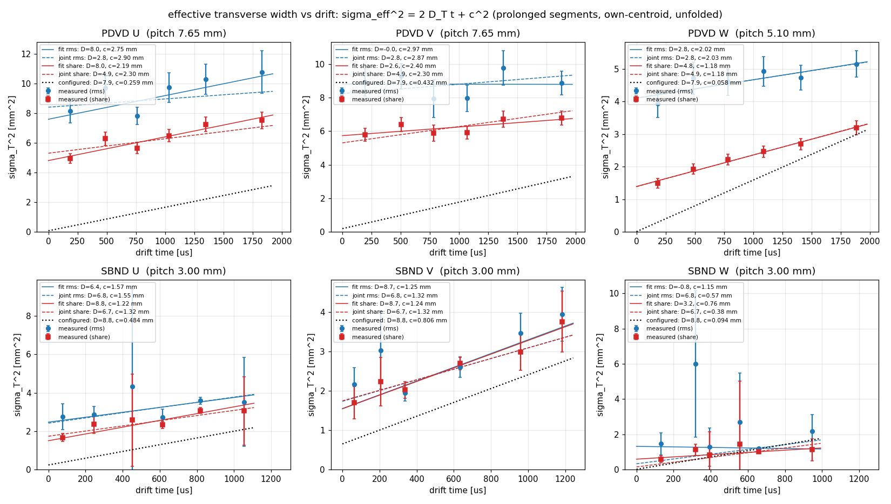
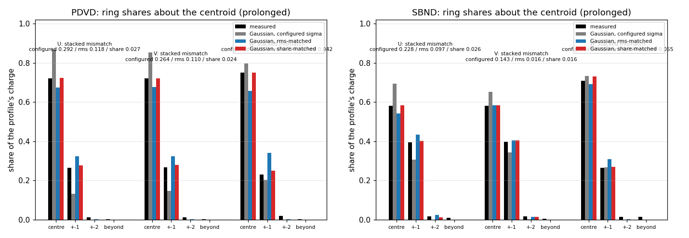
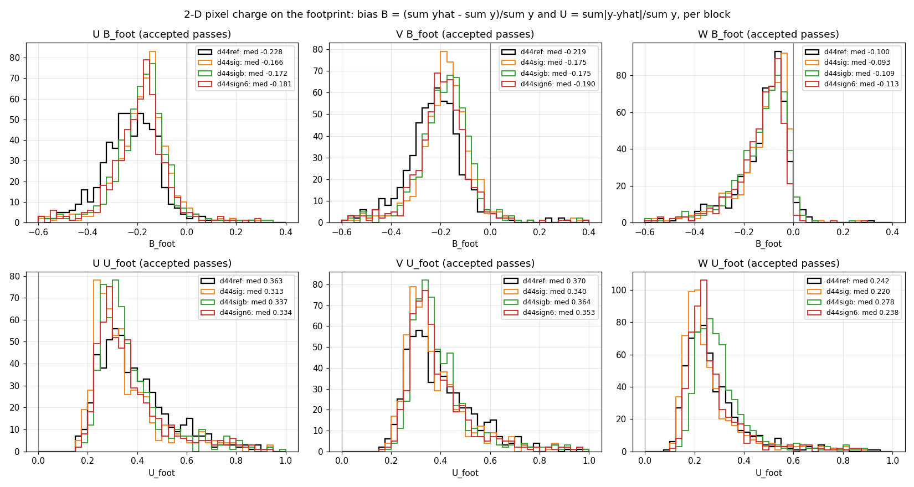
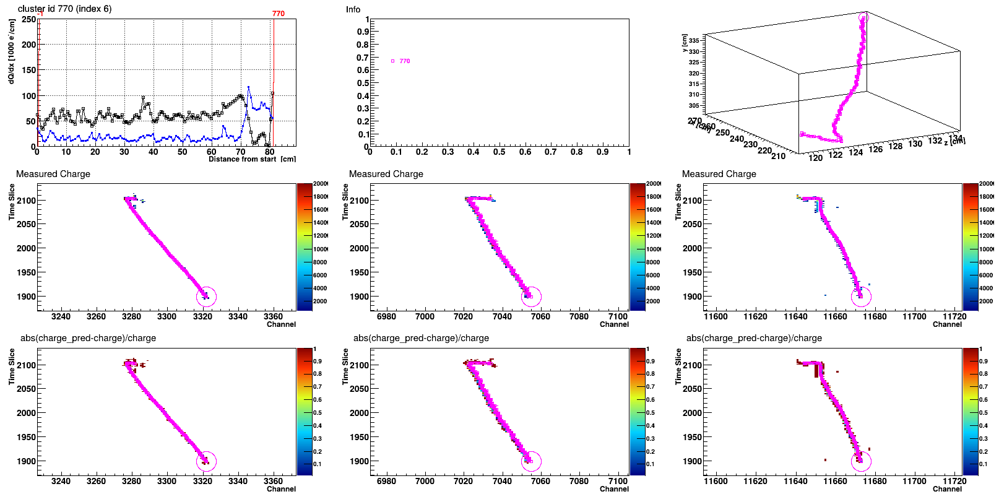
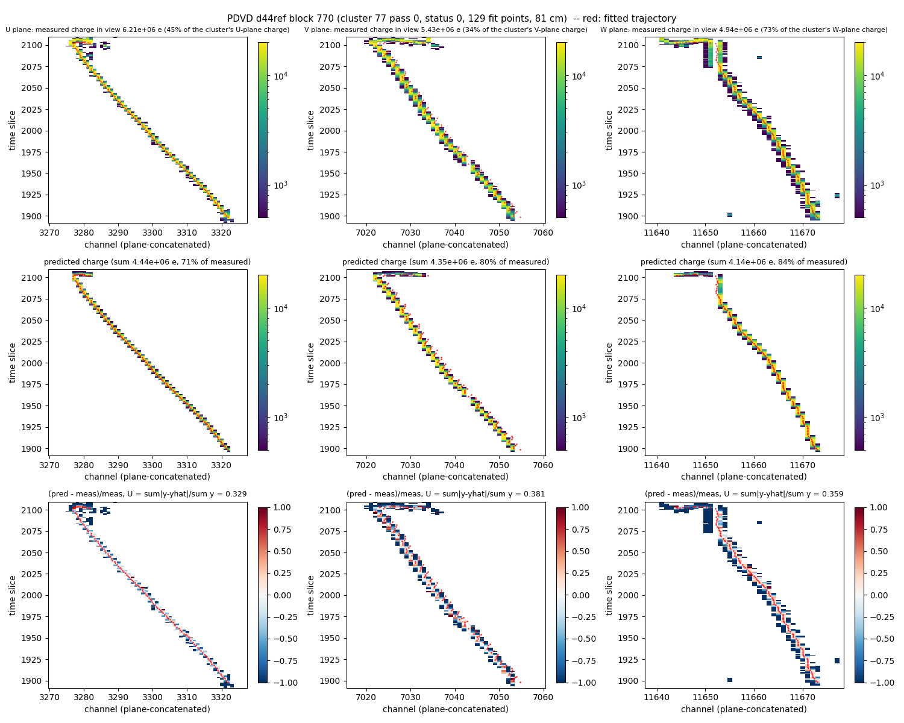
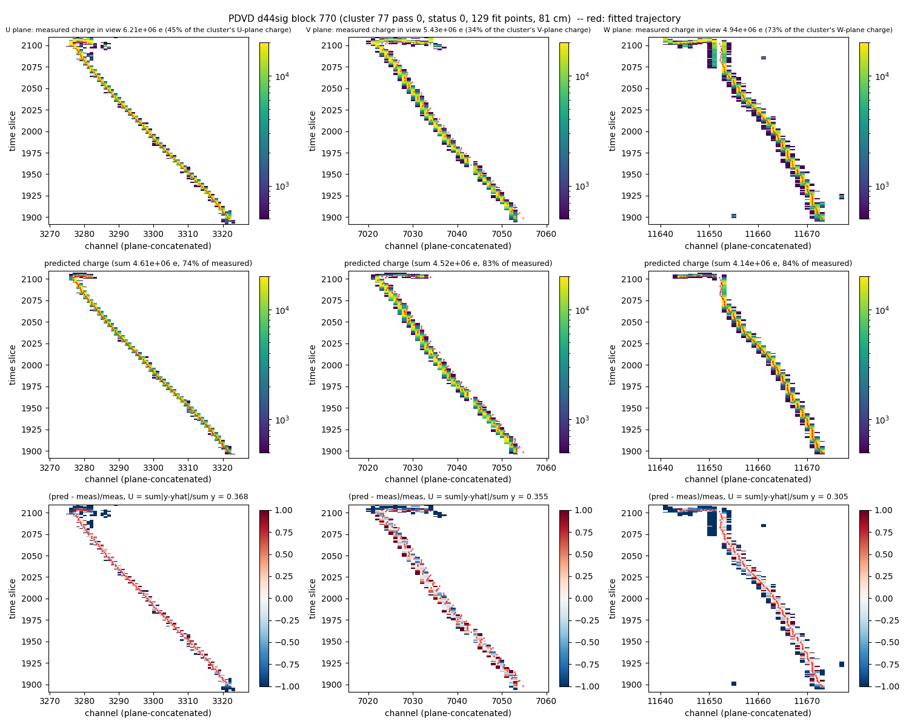
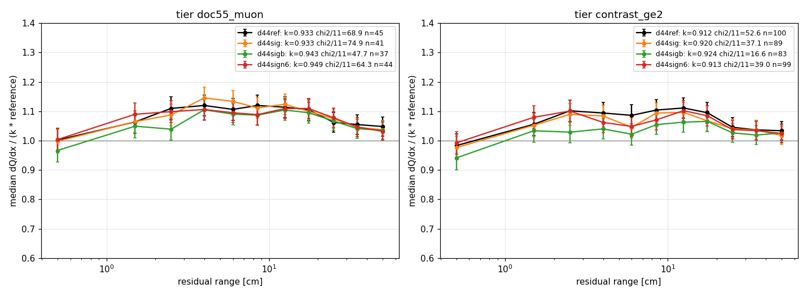

# 44 — The effective transverse smearing of the track fit, derived from the data: U, V, W on PDVD and SBND, put into the fit, and re-graded on 2-D pixel charge and dQ/dx vs residual range

**Status (2026-09-05):** derived, validated on eight occasions and two detectors,
implemented as selectable copies of the runtime parameter JSON plus one default-OFF
knob (`gaus_nsigma`), and re-graded. **Production is byte-identical** (gates 1–3 PASS
on pinned binaries; the canonical `pdvd_track_fitting.json` is untouched). On PDVD the
derived constants remove the whole *shape* deficit — the model now reproduces the
measured first-neighbour share to 0.01–0.03 on every plane and the footprint charge
the fit predicts nothing for drops from 3.6 % to 0.1 % — and improve every 2-D metric
(U_foot −14 %/−8 %/−9 %, χ²/N −17 %/−12 %/−21 %, pulls narrower), **but they move the
footprint bias only from −0.23/−0.22/−0.10 to −0.17/−0.18/−0.09 and leave dQ/dx vs
residual range unchanged.** The pre-registered B and U_foot targets are therefore
**not met**: about a quarter of the induction bias was smearing; the rest is a
normalization deficit that is present, plane-independent, on SBND too (−0.08) and
does not respond to the transverse width. **Flipped to PDVD production the same day
(owner decision 2026-09-05, §7.1):** the four share-matched constants are now in the
canonical `pdvd_track_fitting.json`; the STM-verdict re-shuffle is accepted as later
work, and the normalization question is the next round.

Companion of doc 42 (`42_stm-fit-2d-charge-and-dqdx-validation.md`, whose §8.7 is
the design executed here and whose §7.4 this doc corrects, §1).

---

## 0. Repro

```bash
# pins: /home/xqian/tmp/d44_libpin/{ref,new}  (ref == doc-42 new2: libWireCellClus.so 8fd9007c33c38f14…; new: fd273dc8f000780f…)
# toolkit HEAD before the round 0b90fda5; wcp-porting-img d8dc5858.  Production flipped to curved_fv p90+5 cm at 09:16
# (0b90fda5 / fdafd07e), AFTER the doc-42 arms (07:42) -- so the reference arm is re-run at today's epoch (d44ref).
cd /nfs/data/1/xqian/toolkit-dev/toolkit && wcbuild && ./wcb build -p && ./build/clus/wcdoctest-clus     # 308 cases, 3 new
cd /nfs/data/1/xqian/toolkit-dev/wcp-porting-img/pdvd; S=docs/nf_sp_img_clus/scripts; F=docs/nf_sp_img_clus/figs; SB=../sbnd/sbnd_xin

# --- A. the derivation (analysis only, on the doc-42 arms d42fit / work-stmcamp-d42fit)
python3 $S/d44_sigma_fit.py --det pdvd --out $F/44_sigma_pdvd --split face,run,length,rr,foff,advance work/*_d42fit/tracking-stm.root
python3 $S/d44_sigma_fit.py --det sbnd --out $F/44_sigma_sbnd --split face,length,rr,foff,advance $SB/work-stmcamp-d42fit/*/tracking-stm.root
for hw in 2 4; do python3 $S/d44_sigma_fit.py --det pdvd --halfwidth $hw --nboot 100 --out $F/44_sigma_pdvd_hw$hw work/*_d42fit/tracking-stm.root; done   # + sbnd, + --max-advance 0.5 (adv05)
python3 $S/d44_sigma_plots.py --pdvd $F/44_sigma_pdvd --sbnd $F/44_sigma_sbnd --out $F/44 --extra "pdvd:window+-2=$F/44_sigma_pdvd_hw2" ...
# SP-frame cross-check (new work/<run>_<evt> dirs; -R = the pre-filter tap of doc 42 sec 8.9)
./run_nf_sp_evt.sh -R -a 4 039252 16; ./run_nf_sp_evt.sh -R -a 6 039252 16; ./run_nf_sp_evt.sh -R -a 6 039253 17; ./run_nf_sp_evt.sh -R -a 2 039253 17; ./run_nf_sp_evt.sh -R -a 6 039349 23
python3 $S/d44_sp_profile.py --root work/039252_16_d42fit/tracking-stm.root --frames /home/xqian/tmp/d44sp/039252_16 --anode 4 --tsv /home/xqian/tmp/d44sp/pooled.tsv   # x6 -> figs/44_sp_crosscheck.tsv
# --- B. constants as selectable copies (canonical files untouched)
C=/home/xqian/toolkit-dev/toolkit/cfg/pgrapher/experiment/protodunevd/pdvd_track_fitting.json
python3 $S/d44_make_tf_json.py --fit $F/44_sigma_pdvd_fit.tsv --est share --src $C --out stm/pdvd_track_fitting_d44.json
python3 $S/d44_make_tf_json.py --fit $F/44_sigma_pdvd_fit.tsv --est rms   --src $C --out stm/pdvd_track_fitting_d44b.json
python3 $S/d44_make_tf_json.py --fit $F/44_sigma_pdvd_fit.tsv --est share --src $C --out stm/pdvd_track_fitting_d44_n6.json --set gaus_nsigma=6.0
python3 $S/d44_make_tf_json.py --fit $F/44_sigma_sbnd_fit.tsv --est share --src .../sbnd/sbnd_track_fitting.json --out $SB/stm_campaign/sbnd_track_fitting_d44.json
# --- C. gates (2 events: 039252/2, 039349/23) and arms; R=docs/nf_sp_img_clus/scripts/run_d44_arms.sh, E=/home/xqian/tmp/d42_libpin/events2.txt
ARM=d44stmref PIN=ref NOSTMFIT=1 EVENTS=$E JOBS=2 $R; ARM=d44stmchk PIN=new NOSTMFIT=1 EVENTS=$E JOBS=2 $R
python3 $S/d40r3_hash_gate.py d44stmref d44stmchk $E                                    # GATE 1: PASS 2/2
ARM=d44fitold PIN=ref EVENTS=$E JOBS=2 $R; ARM=d44fitnew PIN=new EVENTS=$E JOBS=2 $R      # GATE 2: hash_root_trees SAME, T_proj_data sha SAME
cd $SB; STM_EVENTS="284349 285999 286065" D42_LIBPIN=/home/xqian/tmp/d44_libpin/ref D42_NO_STMFIT=1 ./stm_campaign/run_d42_stmfit.sh d44gateold   # + d44gatenew: GATE 3 SAME 3/3
cd -; ARM=d44ref   PIN=new JOBS=16 $R                                                    # same-epoch reference, canonical constants
ARM=d44sig   PIN=new JOBS=16 TFJSON=stm/pdvd_track_fitting_d44.json    $R               # share-matched constants   (the graded arm)
ARM=d44sigb  PIN=new JOBS=16 TFJSON=stm/pdvd_track_fitting_d44b.json   $R               # rms-matched constants
ARM=d44sign6 PIN=new JOBS=16 TFJSON=stm/pdvd_track_fitting_d44_n6.json $R               # share-matched + gaus_nsigma 6
cd $SB; SBND_TRACKFIT_JSON=$PWD/stm_campaign/sbnd_track_fitting_d44.json D42_LIBPIN=/home/xqian/tmp/d44_libpin/new NJOBS=14 ./stm_campaign/run_d42_stmfit.sh d44sig
# --- D. re-validation: the doc-42 scripts unchanged, then the comparison (D=/home/xqian/tmp/d44/ana)
for t in d44ref d44sig d44sigb d44sign6; do
  python3 $S/d42_proj2d_resid.py --det pdvd --out $D/resid_$t work/*_$t/tracking-stm.root
  python3 $S/d42_shape_diag.py   --det pdvd --out $D/diag_$t  work/*_$t/tracking-stm.root
  python3 $S/d42_dqdx_rr.py --det pdvd --ref stm/pdvd_ref_dqdx_045.json --ref-key MuonDeDx --out $D/dqdx_$t work/*_$t/tracking-stm.root
  python3 $S/d42_ring_frame.py --det pdvd work/*_$t/tracking-stm.root; done                # + the sbnd twins on work-stmcamp-{d42fit,d44sig}
python3 $S/d44_compare.py --ref d44ref=$D/resid_d44ref,$D/diag_d44ref,$D/dqdx_d44ref --arm d44sig=... --arm d44sigb=... --arm d44sign6=... --out $F/44_pdvd
python3 $S/d44_compare.py --ref sbnd-ref=$D/resid_sbnd_d42fit,... --arm sbnd-d44=$D/resid_sbnd_d44sig,... --out $F/44_sbnd
python3 $S/d44_sigma_fit.py --det pdvd --model-json stm/pdvd_track_fitting_d44.json --out /home/xqian/tmp/d44/44_sigma_pdvd_after_d44sig work/*_d44sig/tracking-stm.root   # residual deficit
# Magnify (doc 43 recipe; index = 0-based position of the block among T_rec.rec_cluster_id) and panels, same blocks as doc 42, arms d44ref and d44sig
wire-cell-sbnd-magnify-tracking-convert -bwork/039253_17_d44sig/tracking-stm.root -tT_rec_charge -o/home/xqian/tmp/d44/magnify/track_com_pdvd_039253_17_d44sig.root -f2
( cd .../Magnify-tracking-PDVD/scripts && xvfb-run -a -s "-screen 0 1920x1080x24" root -l -q loadClasses.C '/home/xqian/tmp/drive.C("<root>","<png>",6)' )
python3 $S/d42_proj2d_panels.py --det pdvd --block 770 -o $F/44_panel_pdvd_median_039253_17_d44sig_b770.png --title d44sig work/039253_17_d44sig/tracking-stm.root
# gate record: stm/gates/d44_eff_sigma_gate.txt
```

Committed products: `figs/44_sigma_{pdvd,sbnd}_{bins,fit,shape}.tsv`, the window/advance
control fits `figs/44_sigma_*_{hw2,hw4,adv05}_fit.tsv`, `figs/44_sp_crosscheck.tsv`,
`figs/44_{pdvd,sbnd}_compare.tsv`, `figs/44_{pdvd,sbnd}_verdicts.tsv`, the figures, the
three PDVD JSON copies under `stm/`, the SBND copy under `sbnd_xin/stm_campaign/`, and
the gate record. Regenerated, not committed: the `d42_*` analysis products under
`/home/xqian/tmp/d44/ana/` (8–12 MB each) and the SP frames.

---

## 1. First, a correction to doc 42: |x| is not the drift distance

Both detectors are **cathode-centred**. The wires files put the PDVD collection
planes at x = ±341.55 cm (U ±340.23, V ±341.23) and SBND's at ±202.05 cm
(`protodunevd-wires-larsoft-v7-uvwfit`, `sbnd-wires-geometry-v0206`, read directly);
`T_rec_charge` x spans ±339.9 / ±201.4 cm. The fit's diffusion term uses
`|x − x_anode(apa,face)| / v` (`TrackFitting.cxx:7283, 7304`), i.e. the drift distance
is `x_anode − |x|`.

Doc 42 §7.4 binned the residual in terciles of **|x|** and read them as increasing
drift, and `d42_shape_plots.fig_sigma` evaluated σ_model at |x|/v. Both run the drift
axis backwards. Its "the missing width grows with drift, 2.24 → 2.59 → 2.93 mm, ΔD_T ≈
11.7 cm²/s" is therefore inverted: the deficit is largest **near the anode**, and the
inference about D_T is void. The σ_model column of doc 42's B-vs-σ table is evaluated
at the wrong drift time (the ordering and the monotone relation survive; the values do
not). Doc 42 now carries a dated correction blockquote at §7.4 and a pointer at §8.7.
The derivation below resolves the width in the *true* drift time and lets the data
decide the slope.

---

## 2. The derivation

### 2.1 Estimator (`d44_sigma_fit.py`, fork of `d42_transverse_moments.py`)

Per (block, plane, time slice) of an accepted STM pass (status 0), the window of
±3 wires around the fitted trajectory holds the measured (`T_proj_data.charge`, ctpc)
and predicted (`charge_pred`) profiles. Four things changed against doc 42 §8.4:

1. **Prolonged segments only, by the local wire advance.** At the nearest trajectory
   point the advance |Δwire/Δslice| must be < 0.25 wire per slice (θ_P > 76°). Doc
   42's `--max-span` measured the wire span of points *within one slice* and is
   nearly inert (0.25 vs 1.0 keeps 31 % vs 33 % of the charge); the advance cut keeps
   53 % of PDVD's profiles (210 696 of 395 644) and 12 % of SBND's (1044 of 8581).
2. **Dead channels.** A profile whose window touches a `T_bad_ch` channel at that slice
   is dropped (PDVD's median block has 16 % of its U cells and 8.5 % of its V cells
   dead; doc 42 did not exclude them).
3. **Drift time as the fit computes it**, t = max(50 µs, (x_anode − |x|)/v), six
   equal-population bins per plane.
4. **Two estimators of σ per bin, both inverting the binned statistic** (the model
   predicts unit-wire-bin integrals of a Gaussian line source; for σ < 0.3 pitch the
   naive Sheppard subtraction fails, doc 42 §8.4). The in-slice extent is solved from
   the *predicted* profile, whose σ and nsigma = 4 truncation are known, then:
   - **rms-matched**: the σ whose binned profile has the measured own-centroid rms;
   - **share-matched**: the σ whose binned profile puts the measured share of charge
     in the wire nearest the centroid.
   Errors: bootstrap over blocks (200 resamples) with a 5 % floor on σ².

Then per plane a weighted line **σ_eff²(t) = 2 D_T,eff · t + c²**, and a **joint** fit
with one D_T,eff shared by the three planes and three c's — diffusion is a property of
the argon, not of the plane, and the joint χ² tests that reading.

### 2.2 PDVD (585 blocks, `d42fit`; configured D_T = 7.91 cm²/s, c = 0.259/0.432/0.058 mm)

| plane | t bin [µs] | rms meas / pred [mm] | σ_model [mm] | σ_eff rms [mm] | σ_eff share [mm] | centre share |
|---|---|---|---|---|---|---|
| U | 187 → 1831 | 3.76–4.03 / 1.06–2.82 | 0.60 → 1.72 | 2.85 ± 0.14 → 3.28 ± 0.22 | 2.22 ± 0.08 → 2.74 ± 0.10 | 0.743 → 0.701 |
| V | 194 → 1876 | 3.73–3.97 / 1.24–2.88 | 0.70 → 1.78 | 2.99 ± 0.14 → 2.98 ± 0.12 | 2.41 ± 0.08 → 2.60 ± 0.08 | 0.729 → 0.713 |
| W | 182 → 1883 | 2.52–2.71 / 0.84–2.16 | 0.54 → 1.73 | 1.98 ± 0.11 → 2.27 ± 0.09 | 1.22 ± 0.06 → 1.79 ± 0.06 | 0.791 → 0.710 |

(`figs/44_sigma_pdvd_bins.tsv`; the six bins are in the figure.)

**Joint fits** (`figs/44_sigma_pdvd_fit.tsv`):

| estimator | D_T,eff [cm²/s] | c_U [mm] | c_V [mm] | c_W [mm] | χ²/ndf | per-plane D_T (U / V / W) |
|---|---|---|---|---|---|---|
| rms-matched | **2.78 ± 1.26** | 2.90 ± 0.07 | 2.87 ± 0.07 | 2.03 ± 0.08 | 12.4/14 | 7.96 ± 4.0 / −0.05 ± 2.9 / 2.83 ± 1.5 |
| share-matched | **4.87 ± 0.55** | 2.30 ± 0.04 | 2.30 ± 0.04 | 1.18 ± 0.05 | 12.9/14 | 7.98 ± 1.7 / 2.59 ± 1.5 / 4.83 ± 0.6 |
| configured | 7.91 | 0.259 | 0.432 | 0.058 | — | — |



Three readings. (i) The **constant** dominates: 2.3–2.9 mm on U/V and 1.2–2.0 mm on W
against 0.06–0.43 mm configured — the factor 8–10 of doc 42 §8.9, now per plane with
errors. (ii) The **effective diffusion is smaller than the physical 7.9 cm²/s**, not
larger: 2.8 ± 1.3 (rms) or 4.9 ± 0.6 (share) — the measured width grows more slowly
with drift than a diffusing Gaussian would; this is the corrected form of doc 42's
inverted §7.4 statement. Whether that is real (a drift-independent smearing dominating
the charge-solved ctpc profile) or a limitation of the estimator is not decided here;
the fit only needs the effective line. (iii) The two estimators disagree by 20–35 %,
which is the shape check saying the profile is **not a Gaussian**.

### 2.3 The shape check decides between the two estimators

Ring shares of the stacked, centroid-aligned, prolonged profiles (`figs/44_sigma_*_shape.tsv`):

| | centre | ±1 | ±2 | beyond | Σ\|meas − Gaussian\| (stacked U) |
|---|---|---|---|---|---|
| PDVD U measured | 0.721 | 0.265 | 0.012 | 0.002 | — |
| Gaussian, configured σ | 0.868 | 0.132 | 0.000 | 0.000 | 0.292 |
| Gaussian, rms-matched | 0.674 | 0.324 | 0.002 | 0.000 | 0.118 |
| Gaussian, share-matched | 0.723 | 0.277 | 0.000 | 0.000 | **0.027** |
| PDVD V measured | 0.720 | 0.267 | 0.011 | 0.002 | (configured 0.264 / rms 0.110 / share **0.024**) |
| PDVD W measured | 0.749 | 0.230 | 0.019 | 0.002 | (configured 0.095 / rms 0.220 / share **0.042**) |
| SBND U measured | 0.581 | 0.393 | 0.017 | 0.009 | (configured 0.228 / rms 0.097 / share **0.026**) |
| SBND V measured | 0.582 | 0.397 | 0.017 | 0.004 | (configured 0.143 / rms 0.016 / share 0.016) |
| SBND W measured | 0.709 | 0.263 | 0.015 | 0.013 | (configured 0.056 / rms 0.090 / share 0.055) |



The measured profile has a **narrower core and a longer tail** than a Gaussian of the
same rms: the tail beyond ±1 holds 1–3 % of the charge (3–9 % of the ±1 ring — under
the pre-registered 20 % that would have called for the bipolar `flag = 1` shape), but
that tail inflates the rms enough that the rms-matched Gaussian over-fills the first
ring by 20 % and under-fills the centre by 6 %; on PDVD W it describes the stacked
profile *worse than the configured model does* (0.220 vs 0.095). The share-matched
Gaussian reproduces centre and first ring to ≤ 0.012 everywhere and is also the
estimator that is stable under the analysis window (§3.1). **The share-matched set is
the primary result; the rms-matched set ships as the second arm so the difference is
graded rather than argued.**

### 2.4 SBND (45 blocks, 1044 prolonged profiles; configured D_T = 8.8, c = 0.484/0.806/0.094 mm)

| estimator | D_T,eff [cm²/s] | c_U | c_V | c_W [mm] | χ²/ndf |
|---|---|---|---|---|---|
| rms-matched | 6.80 ± 1.87 | 1.55 ± 0.10 | 1.32 ± 0.09 | 0.57 ± 0.22 | 11.4/14 |
| share-matched | **6.73 ± 1.09** | 1.32 ± 0.06 | 1.32 ± 0.06 | 0.38 ± 0.19 | 11.9/14 |

SBND's diffusion comes back within errors of the configured value (per-plane
share-matched U 8.83 ± 1.68, V 8.69 ± 2.39), which is the part of the closure test the
method could fail outright and did not. The constants come back **0.3–0.8 mm above the
configured ones** on U/V (V within the pre-registered ±0.5 mm, U at +0.84 mm outside
it, W +0.29 mm inside) — the same direction and size as doc 42 §8.4's SBND deficit
(1.11/0.64/0.00 mm), so this is the method seeing a real, small SBND under-width, not
a method failure; but the pre-registered tolerance was not met on U and the honest
statement is that SBND's configured constants were never themselves validated. The
sharper closure is §3.3: SBND run with its own derived constants.

---

## 3. Validation on different occasions

### 3.1 Splits, windows, advance (PDVD joint fits; `figs/44_sigma_occasions.png`)

| occasion | est | D_T,eff | c_U | c_V | c_W [mm] |
|---|---|---|---|---|---|
| all | share | 4.87 ± 0.55 | 2.30 | 2.30 | 1.18 |
| face x > 0 (top CRP) | share | 6.14 ± 0.64 | 2.14 | 2.38 | 1.08 |
| face x < 0 (bottom CRP) | share | 3.16 ± 0.74 | 2.55 | 2.23 | 1.29 |
| run 039252 / 039253 / 039349 | share | 4.9 / 2.2 / 5.4 | 2.25 / 2.33 / 2.31 | 2.23 / 2.30 / 2.29 | 1.09 / 1.28 / 1.15 |
| L < 100 cm / ≥ 100 cm | share | 5.7 / 5.0 | 2.02 / 2.30 | 2.27 / 2.29 | 1.23 / 1.14 |
| plateau rr > 30 cm / Bragg rr < 10 cm | share | 5.1 / 2.2 | 2.28 / **2.69** | 2.28 / **2.59** | 1.13 / **1.65** |
| unfused f_off < 0.15 / fused | share | 4.2 / 5.4 | 2.39 / 2.22 | 2.23 / 2.34 | 1.16 / 1.15 |
| advance < 0.10 / 0.10–0.25 / 0.25–0.5 | share | 3.9 / 5.2 / 4.4 | 1.94 / 2.40 / 1.96 | 2.12 / 2.28 / 1.95 | 0.74 / 1.48 / 1.42 |
| window ±2 / ±3 / ±4 | share | 5.1 / 4.9 / 4.8 | 2.21 / 2.30 / 2.36 | 2.19 / 2.30 / 2.36 | 1.07 / 1.18 / 1.24 |
| window ±2 / ±3 / ±4 | rms | 4.3 / 2.8 / 1.6 | 2.54 / 2.90 / 3.24 | 2.43 / 2.87 / 3.21 | 1.65 / 2.03 / 2.34 |
| advance cut 0.5 | share | 5.0 | 2.23 | 2.19 | 1.39 |
| same-epoch re-derivation on `d44ref` (today's production config) | share | 5.18 ± 0.56 | 2.28 | 2.29 | 1.15 |

The constants hold to ±0.1 mm across runs, track length, fusion state and the two
finer advance bins that make up the cut; the share-matched set moves ±3 % across the
window (the rms-matched set ±12 %, and its D_T with it — that is the tail entering
the rms). Two splits stand out and are physics, not instability: the **Bragg region**
is wider (2.69/2.59/1.65 mm — the stopping muon's larger dE/dx and its δ-rays), which
is the coupling to check 2 and argues against fitting a single c to a stopping track's
last centimetres; and the two **CRPs differ** in effective diffusion (6.1 ± 0.6 top vs
3.2 ± 0.7 bottom) with the same constants — a face-level difference the model cannot
express (D_T is one scalar) and worth its own look.

### 3.2 The SP-frame cross-check (`d44_sp_profile.py`, `figs/44_sp_crosscheck.tsv`)

Doc 42 §8.9 measured the width in the signal-processing output for one anode of one
event and left no tool. Six (event, anode) frames from `run_nf_sp_evt.sh -R`
(039252/2 a4, 039252/16 a4+a6, 039253/17 a6+a2, 039349/23 a6), the same prolonged
profiles read from the `gauss` frame at the fitted (channel, slice) positions (tick
origin found by correlation: offset 0, corr 0.91–0.99; the doc-42 event −1):

| plane | profiles | rms ctpc [mm] | rms SP [mm] | rms predicted [mm] | SP / ctpc |
|---|---|---|---|---|---|
| U | 1284 | 4.03 | 4.17 | 2.12 | 1.03 |
| V | 1083 | 3.92 | 4.26 | 2.49 | 1.09 |
| W | 674 | 2.97 | 3.00 | 1.59 | 1.01 |

The SP waveform is as wide as the ctpc (slightly wider on V): **the width the fit is
missing is entirely present in the SP output; imaging and charge solving add nothing
to it.** This retires the possibility that the constant is compensating an imaging
artefact and confirms the ctpc value as the one the fit must carry.

### 3.3 The SBND closure arm (`work-stmcamp-d44sig`, SBND's own derived share-matched constants: D_T 6.73, c 1.32/1.32/0.38 mm)

| metric (medians, status 0) | U ref → d44 | V ref → d44 | W ref → d44 |
|---|---|---|---|
| B_foot | −0.074 → −0.082 | −0.073 → −0.094 | −0.091 → −0.079 |
| U_foot | 0.232 → **0.211** | 0.270 → 0.270 | 0.186 → 0.185 |
| χ²/N | 6.80 → 6.43 | 6.56 → 6.55 | 11.03 → 10.95 |
| pull rms | 1.86 → 1.73 | 1.68 → 1.70 | 2.42 → 2.30 |
| f_off | 0.059 → 0.061 | 0.058 → 0.058 | 0.046 → 0.045 |
| dQ/dx doc-55 muon tier k / χ²/11 | 1.009 / 10.0 → 1.007 / 8.9 | | |
| STM status unchanged | 88 of 92 blocks | | |

Nothing moves outside its noise; U_foot on U and the pulls improve slightly, B does
not. The method does no harm on the detector whose model already works, and — more
telling — SBND's flat, plane-independent −0.08 bias does not respond to a wider σ at
all. That is the first sight of the conclusion in §5.

---

## 4. Implementation

**One default-OFF knob (toolkit, `clus`):** `TrackFitting::Parameters::gaus_nsigma =
4.0`, the acceptance window of `cal_gaus_integral` in sigmas, threaded through
`set_parameter`/`get_parameter` and the nine `cal_gaus_integral_seg` call sites that
carried the bare literal `4` (`TrackFitting.cxx:7439-8664`). Double 4.0 is the literal
promoted, so the legacy path is bit-identical. `doctest_trackfitting_gaus_nsigma.cxx`
pins the default, the round trip and the gating (a wire bin at 5σ is 0 with nsigma 4
and > 0 with 6; the centre bin does not depend on nsigma — the window does not
renormalise). `wcdoctest-clus`: 308 cases, 22 698 assertions, SUCCESS.

**The constants ship as copies of the runtime parameter JSON**, never in the canonical
files (production constant ⇒ owner decision): `stm/pdvd_track_fitting_d44.json`
(share-matched), `_d44b.json` (rms-matched), `_d44_n6.json` (share-matched + `gaus_nsigma
6.0`), `sbnd_xin/stm_campaign/sbnd_track_fitting_d44.json` (SBND closure). Each is
written by `d44_make_tf_json.py` from the fit TSV and carries a `_comment_d44_effective_
smearing` stating the provenance and the condition ("under today's SP; if `Wire_ind`
changes, re-derive; never re-derive from the SP filter closed form"). Every key was
checked against the `set_parameter` dispatch. The file is read at **runtime**
(`TaggerCheckSTM.cxx:1024-1063`), so a compiled-config hash proves nothing about these
arms; they are graded on outputs.

**Gates** (pinned binaries `ref` = doc-42 `new2`, `new` = this round; record
`stm/gates/d44_eff_sigma_gate.txt`):

| gate | what | result |
|---|---|---|
| 1 | PDVD production chain (`-stm`), ref vs new binary, **same config epoch**, 2 events, `mabc-pr.zip` member hashes + calib dump | **PASS 2/2** (`d44stmref` vs `d44stmchk`) |
| 2 | PDVD `-stm -stm-fit`, ref vs new, canonical JSON: every `tracking-stm.root` tree + `T_proj_data` content sha | **SAME** on both events (`22215f86…`, `b749cc3f…`) |
| 3 | SBND bare production, ref vs new, 3 events: `mabc-pr.zip`, pctree, `nusel-evt*.tsv` | **SAME 3/3** |
| 4 | knob on: `gaus_nsigma 6.0` read from the JSON changes `T_proj_data` (arm `d44sign6`, §5) | visible |

Gate 1 against the doc-42 partner `d41stmon` **fails** (2/2, Bee clustering/steiner
globals) — not the knob: production flipped to the curved fiducial volume at 09:16
today, after `d41stmon` and after the doc-42 arms. The partner was therefore re-run
with the ref binary under today's config (`d44stmref`), and the same-epoch rule is why
the reference arm below is `d44ref`, not `d42fit`.

**Arms** (120 events, production pctrees, new binary, `run_d44_arms.sh`, ~4 min each):
`d44ref` (canonical), `d44sig` (share), `d44sigb` (rms), `d44sign6` (share + nsigma 6);
120/120 `tracking-stm.root` each. `d42_proj2d_selfcheck.py` (every accepted block predicts
charge on ≥ 50 % of its own footprint cells): `d44ref` 108/120 files PASS with the same
12 marginal files as doc 42; **`d44sig`, `d44sigb`, `d44sign6` 120/120** — the marginal
blocks were the 4σ window at 0.2-pitch σ zeroing footprint neighbours. Gate 4: the
`T_proj_data` content sha of 039252/2 is `22215f86…` (ref), `53ce06c2…` (d44sig),
`5f783a34…` (d44sign6) — the same constants with `gaus_nsigma 6.0` give a different
prediction, so the key is read from the runtime JSON. SBND: `work-stmcamp-d44sig`, 99/99.

---

## 5. Re-validation 1 — predicted vs measured 2-D pixel charge

Accepted passes (status 0), medians over blocks, footprint = ±1 cell of the trajectory
(`d44_compare.py`, `figs/44_pdvd_compare.tsv`):

| plane | metric | d44ref | **d44sig** (share) | d44sigb (rms) | d44sign6 (share, nσ 6) | pre-registered |
|---|---|---|---|---|---|---|
| U | B_foot | −0.228 | **−0.166** | −0.172 | −0.181 | within ±0.10 — **not met** |
| U | U_foot | 0.363 | **0.313** | 0.337 | 0.334 | ≤ 0.28 — not met |
| U | χ²/N | 9.56 | **7.94** | 8.79 | 8.74 | lower — met |
| U | pull rms | 2.18 | **1.86** | 2.24 | 1.96 | within 10 % of W — met (W 2.42) |
| U | uncov_foot | 0.036 | **0.001** | 0.000 | 0.000 | not worse — met |
| U | f_off | 0.343 | 0.342 | 0.343 | 0.346 | unchanged — met |
| V | B_foot | −0.219 | **−0.175** | −0.175 | −0.190 | not met |
| V | U_foot | 0.370 | **0.340** | 0.364 | 0.353 | not met |
| V | χ²/N | 6.74 | **5.95** | 6.33 | 6.41 | met |
| V | pull rms | 1.74 | **1.65** | 1.92 | 1.69 | met |
| V | uncov_foot | 0.033 | **0.002** | 0.000 | 0.000 | met |
| W | B_foot | −0.100 | −0.093 | −0.109 | −0.113 | within ±0.10 — met (barely, as before) |
| W | U_foot | 0.242 | **0.220** | **0.278** | 0.238 | not worse — met |
| W | χ²/N | 18.7 | **14.7** | **20.7** | 16.4 | met |
| W | pull rms | 2.82 | **2.42** | **3.84** | 2.53 | — |
| W | uncov_foot | 0.011 | **0.002** | 0.000 | 0.000 | met |

Pooled over all blocks in the Chebyshev ≤ 2 window (`d42_shape_diag.py`): B/U
U −0.226/0.356 → −0.186/0.336, V −0.212/0.366 → −0.187/0.352, W −0.133/0.269 →
−0.128/0.253.



**The rms-matched arm confirms the shape check.** `d44sigb` reaches the same B as the
share-matched set (−0.17/−0.18/−0.11) but a *worse* U_foot on every plane (0.337/0.364/
0.278, W worse than the reference's 0.242), wider pulls (W 3.84 vs 2.82) and a higher W
χ²/N (20.7 vs 18.7); its predicted first-neighbour share over-fills W (0.246 vs measured
0.213) exactly as §2.3 said it would. It also re-shuffles more verdicts (1412/1797
unchanged). The rms-matched set is not a candidate.

**The shape is fixed; the normalization is not.** Two independent readings say the
transverse *shape* is now right:

- the first-neighbour share the model predicts (`d42_ring_frame.py`, r = 1st/(centre +
  1st)) moves from 0.201/0.241/0.147 to **0.279/0.317/0.180** against the measured
  0.310/0.332/0.212 — the 0.11/0.09/0.06 gap of doc 42 is now 0.03/0.02/0.03;
- re-running the derivation on `d44sig` against its own model gives σ_eff
  2.40/2.39/1.23 mm (share-matched) against the model's 2.30/2.30/1.18, a residual
  quadrature deficit of **0.69/0.65/0.35 mm** (was 3.1/2.9/1.9 mm in doc 42's units),
  and re-derives D_T 4.5 ± 0.6 cm²/s — the input line reproduced within 4 % on the
  re-fitted trajectories.

And `uncov_foot`, the footprint charge the fit predicted *nothing* for, collapses from
3.6 %/3.3 %/1.1 % to 0.1–0.2 % — that was the nsigma = 4 window at 0.2-pitch σ zeroing
first neighbours, and it is gone at the wider σ without touching nsigma (the `d44sign6`
column is the proof: widening the window to 6σ on top of the share-matched σ makes every metric slightly *worse* (B −0.18/−0.19/−0.11, U_foot 0.334/0.353/0.238, pulls wider) and re-shuffles more verdicts (1389/1799 unchanged) — the extra acceptance only adds Gaussian tail where the measured profile has less than the Gaussian; `gaus_nsigma` stays at 4.0).

Yet B_foot improves by only 0.06/0.045/0.007. With the shape right, a residual of −0.17
on U/V and −0.09 on W is a **normalization** deficit: the fit assigns 17 % less charge
to the induction footprints than is there, 9 % less on collection. SBND shows the same
thing at −0.08 on all three planes and it did not move under its widened σ (§3.3).
Whatever sets it is not the transverse kernel. The per-block panels show it directly:
the whole-view predicted sum is 74 %/83 %/84 % of the measured on the median block.

**Magnify-tracking renders, same blocks as doc 42** (`figs/44_magnify_*`, `figs/44_panel_*`):

| block | doc 42 U_foot / B_foot (U) | d44ref | d44sig |
|---|---|---|---|
| best 039252/16 cluster 40 | 0.158 / −0.052 | `44_magnify_pdvd_best_039252_16_d44ref_b400.png` | `…_d44sig_b400.png` |
| median 039253/17 cluster 77 | 0.318 / −0.184 | `44_magnify_pdvd_median_039253_17_d44ref_b770.png` | `…_d44sig_b770.png` |
| worst 039253/2 cluster 75 pass 1 | 1.165 / −0.201 | `44_magnify_pdvd_worst_039253_2_d44ref_b751.png` | `…_d44sig_b751.png` |





**STM verdict census** (`figs/44_pdvd_verdicts.tsv`): the fit feeds the STM decision, and
the constants move it. Of 1800 matched (event, block) pairs, **1489 keep their status**;
status 0 (accepted) goes 585 → 592 with 98 blocks entering and 91 leaving, most of the
churn between 0 and 3. SBND: 88 of 92 unchanged. This is reported, not tuned: any flip
of production carries a 17 % re-shuffle of PDVD's STM verdicts that a hand scan has not
graded.

---

## 6. Re-validation 2 — dQ/dx vs residual range against the 0.45 kV/cm expectation

| tier | quantity | d44ref | d44sig | d44sigb | d44sign6 |
|---|---|---|---|---|---|
| doc-55 muon cuts | n tracks | 45 | 41 | 37 | 44 |
| | k (population) | 0.933 | 0.934 | 0.943 | 0.949 |
| | χ²/11 | 68.9 | 74.9 | 47.7 | 64.3 |
| | mean ratio 3–20 cm (the doc-42 hump) | 1.113 | 1.123 | 1.096 | 1.102 |
| contrast ≥ 2 | k / χ²/11 | 0.912 / 52.6 | 0.920 / 37.1 | 0.924 / 16.6 | 0.913 / 39.1 |
| all status 0 | n / k | 583 / 0.921 | 590 / 0.931 | 600 / 0.93 | 561 / 0.929 |



**dQ/dx vs rr does not move.** k stays at 0.93, the +10 % hump at 3–20 cm stays, the
Bragg-bin ratio stays. The pre-registered fork is therefore resolved in the second
direction: the hump is **not** the induction deficit propagating into dQ/dx — the
charge that the fit fails to explain on the induction planes is not what sets the
collection-weighted dQ/dx scale (the fit's dQ/dx is dominated by W, whose bias barely
moved). It is handed back to the recombination / reference-table side (doc 25 §13,
doc 42 §4.2). SBND: k 1.009 → 1.007, unchanged.

---

## 7. Verdict, recommendation, and what this hands on

**Against the pre-registered criteria (§Plan, fixed before the arms ran):**

| criterion | result |
|---|---|
| B_foot U/V within ±0.10 | **not met**: −0.23/−0.22 → −0.17/−0.18 |
| B_foot W within ±0.10 | met (−0.10 → −0.09) |
| U_foot U/V ≤ 0.28 | **not met**: 0.36/0.37 → 0.31/0.34 |
| pull rms U/V within 10 % of W's | met |
| χ²/N lower on all planes | met (−17 %/−12 %/−21 %) |
| uncov_foot not worse | met, and collapsed (3.6 % → 0.1 %) |
| f_off unchanged | met |
| own-centroid quadrature deficit < 1 mm after | met: 0.69/0.65/0.35 mm |
| SBND unchanged within noise | met |
| dQ/dx k toward 1, hump shrinks or is handed back | k unchanged; **hump handed back to the recombination table** |

**What was established.** The effective transverse smearing of the ctpc charge on PDVD
is c = 2.30/2.30/1.18 mm (U/V/W, share-matched) with an effective D_T of 4.9 ± 0.6
cm²/s, stable across runs, lengths, fusion state, window and advance; it is already
present in the SP waveform; SBND's own derivation returns its diffusion coefficient
and a 0.3–0.8 mm under-width in the same direction as doc 42's. Putting it into the
fit removes the *shape* discrepancy completely and improves every 2-D metric, but
explains only about a quarter of the induction footprint bias, and none of the dQ/dx
scale.

### 7.1 Flipped to production (owner decision 2026-09-05)

The owner accepted the recommendation below ("proceed to update the production chain
for PDVD; we do not yet need to worry about STM, which will be a later work"). The
canonical `cfg/pgrapher/experiment/protodunevd/pdvd_track_fitting.json` now carries
`DT 4.872e-7`, `ind_sigma_u_T 2.300`, `ind_sigma_v_T 2.304`, `col_sigma_w_T 1.176`
(toolkit commit `cfg/protodunevd: effective transverse smearing …`); `_comment` and a
new `_comment_transverse_smearing` record the derivation, the condition on today's SP
and the two accepted-for-now caveats (STM verdict churn; the TaggerCheckNeutrino
consumer ungraded); the physical-diffusion comment is kept as
`_comment_diffusion_superseded` (DL is unchanged). `gaus_nsigma` is not set (4.0).

**Flip gate** (`stm/gates/d44_eff_sigma_gate.txt`, GATE 5): production chain with the
canonical file and no TLA (`d44prod`, 2 events, new binary) against the graded arm
`d44sig`: `mabc-pr.zip` member hashes **PASS 2/2**, every `tracking-stm.root` tree
SAME, `T_proj_data` sha identical (`53ce06c2…`, `d8896f6c…`) — production now *is* the
arm graded in §5–6. The compiled jsonnet is unchanged by construction (the file is read
at runtime, §4), so the change is invisible to a config hash and visible in every PDVD
output: **NOT bit-identical, by design.** The `-nu` (TaggerCheckNeutrino) consumer was
smoke-run on 039252/2 (`d44nuchk`), see the gate record. Re-derivation trigger: any
change to `sp-filters.jsonnet` `Wire_ind`/`Wire_col`.

**Recommendation as it stood before the decision.** Flip PDVD production to the share-matched set
(`stm/pdvd_track_fitting_d44.json` → the canonical file, same four keys), keep
`gaus_nsigma` at 4.0. Reasons for: every metric improves or holds, the model's shape now
matches the data, and the first-neighbour truncation artefact (uncov) is gone. Reasons
to pause: it re-shuffles 17 % of PDVD's STM verdicts, ungraded; and it is **explicitly
conditional on today's SP** — if `Wire_ind` (doc 42 §8.8) is changed, these four numbers
are invalid and must be re-derived with the same two commands. The rms-matched set is
not recommended (window-dependent, over-fills the first ring).

**What this hands on** (measurements, not tunings):

1. **The normalization deficit** — −0.17 on PDVD induction, −0.09 on PDVD collection,
   −0.08 flat on SBND — is the next question and it is not a smearing question. One
   candidate is structural: the fit's cell weights are σ_i = √(err² + (0.075 q)²),
   so a cell with more charge than the kernel expects costs less to under-predict
   than one with less costs to over-predict; a scatter-dependent negative bias is what
   that weighting produces, and PDVD's pulls are the wider ones. Test: refit with
   σ from the *predicted* charge, or with the relative term off, on the same arms.
2. The two CRPs differ in effective diffusion (6.1 vs 3.2 cm²/s); the model has one
   D_T. Worth checking against the per-CRP drift field / SP before it is called physics.
3. The Bragg region is 0.4 mm wider than the plateau; a stopping-track fit with one c
   under-smears its last 10 cm. Small, but it sits exactly where dQ/dx vs rr is read.
4. `flag = 1` remains unused; the tail beyond ±1 (1–3 % of charge) is what a
   non-Gaussian shape would buy, and it is below the threshold set in advance.

---

## 8. Files

- Doc: `pdvd/docs/nf_sp_img_clus/44_effective-transverse-smearing-derivation.md`; doc 42 corrected at §7.4 and §8.7.
- Scripts (`pdvd/docs/nf_sp_img_clus/scripts/`): `d44_sigma_fit.py` (derivation), `d44_sigma_plots.py`, `d44_sp_profile.py` (SP-frame cross-check), `d44_make_tf_json.py` (JSON variants), `d44_compare.py` (before/after), `run_d44_arms.sh` (arms, with the empty-TLA guard and JSON provenance).
- Constants: `pdvd/stm/pdvd_track_fitting_d44.json`, `_d44b.json`, `_d44_n6.json`; `sbnd/sbnd_xin/stm_campaign/sbnd_track_fitting_d44.json`.
- Toolkit: `clus/inc/WireCellClus/TrackFitting.h`, `clus/src/TrackFitting.cxx`, `clus/test/doctest_trackfitting_gaus_nsigma.cxx`.
- Figures/tables: `figs/44_*`. Gate record: `pdvd/stm/gates/d44_eff_sigma_gate.txt`.
- Arms (not committed): PDVD `work/*_{d44ref,d44sig,d44sigb,d44sign6}`, gate tags `d44stmref d44stmchk d44fitold d44fitnew`; SBND `work-stmcamp-{d44sig,d44gateold,d44gatenew}`; SP frames `work/{039252_16,039253_17,039349_23}`.
