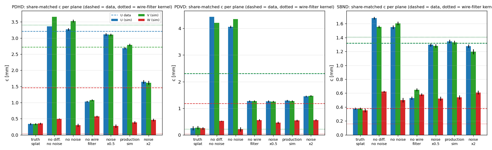
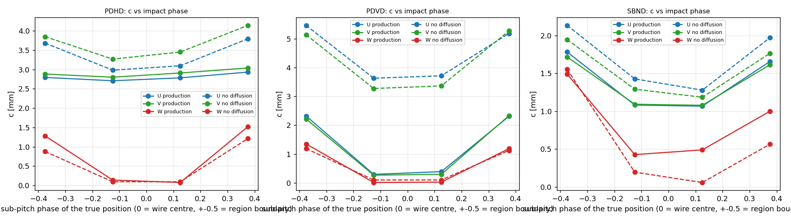
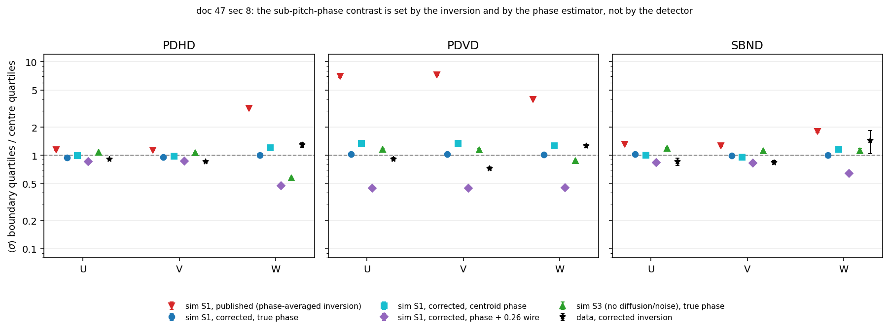

# 47 — Where the constant transverse smearing comes from: the same measurement on simulated tracks, three detectors

**Question (owner, 2026-09-05).** The track fit needs a constant transverse smearing `c` far
above what diffusion and the SP wire filter give (doc 44: PDVD 2.30/2.30/1.18 mm U/V/W; doc
pdhd/02: PDHD 3.21/2.72/1.46; doc 44 §2.4: SBND 1.32/1.32/0.38, with SBND "not seeing the
issue" because its constant sits at its wire filter). Both PDVD and PDHD now ship the data
values, but nobody could say why the SP output is that wide. If simulation reproduces the
constant, every step of the chain is known and the mechanism can be isolated; if not, the
data carry something the simulation does not model.

**Answer.** Both, and the split is by detector and plane:

- **The simulation reproduces the INDUCTION constant on SBND exactly and on PDHD within
  its noise-level sensitivity**: the SP wire filter's real-space kernel (PDHD 3.4 mm, SBND
  1.4 mm, PDVD 0.2 mm) in quadrature with a **residual of the 2-D deconvolution against the
  pitch-averaged field response**, ~0.2 pitch on induction and 0.12 on collection (§3.5).
  The ROI/noise environment modulates it (PDHD: noise ×0.5 → 3.1 mm, ×2 → 1.6 mm; PDVD and
  SBND ±0.15 mm). *(Second round, §8: the further claim that this residual is concentrated at
  the wire-region boundary — §3.4, §4.2 — is **withdrawn**; it was an artefact of inverting a
  phase-selected measurement against a phase-averaged model. The residual is real and
  phase-independent, so doc 44's "more peaked than a Gaussian of equal rms" is not a phase
  mixture; §8.5 measures what the data's peakedness actually is.)*
- **The simulation does NOT reproduce PDVD's induction constant (1.29 vs 2.30 mm) nor the
  collection constants of either ProtoDUNE (0.4–0.5 vs 1.2–1.5 mm)**, while SBND's collection
  (0.54 vs 0.38) is fine. The ProtoDUNE data carry an extra ~1.0–1.9 mm (0.2–0.25 pitch) on
  exactly the planes where the simulated constant is small. That part is a data effect the
  simulation does not model; §6 names the candidates and the data test that separates them.
- The low effective D_T the data return (PDVD 4.9, PDHD 6.1 cm²/s against physical 7.9/8.2)
  is partly an SP effect: the simulation returns 5.5/6.8/8.2 for configured 7.9/8.2/8.8.

Everything below is measured with the doc-44 estimator unchanged (imported, not copied)
on frames whose truth is known to sub-pitch precision.

## 0. Repro

```bash
cd /nfs/data/1/xqian/toolkit-dev/wcp-porting-img; S=pdvd/docs/nf_sp_img_clus/scripts; X=/home/xqian/tmp/xtrack
# pin (never local/lib): libWireCellSigProc.so 1984cc94d88e9c0b7fc67dfd32495ea7, libWireCellGen.so 3f33af41af3252b8189c2582e343d86d (toolkit 76f47614)
mkdir -p /home/xqian/tmp/xtrack_libpin && cp -a /home/xqian/toolkit-dev/local/lib/. /home/xqian/tmp/xtrack_libpin/
# --- A. drivers (forks BY DUPLICATION of <det>_sim/wct-sim-check-track.jsonnet; SBND is new): compile once per detector to get the Drifter volumes
export WIRECELL_PATH=/home/xqian/toolkit-dev/toolkit/cfg:/home/xqian/toolkit-dev/wire-cell-data
(cd pdhd_sim && wcsonnet -V elecGain=14 --tla-code 'tracks=[{"tail":[342,200,60],"head":[5,200,60],"charge":-500}]' --tla-code anode_index=1 -o $X/pdhd/cfg/S1.json wct-sim-xtrack-sp.jsonnet)
(cd pdvd_sim && wcsonnet --tla-code 'tracks=[{"tail":[-318,-80,60],"head":[-6,-80,60],"charge":-500}]' --tla-code anode_index=0 -o $X/pdvd/cfg/S1_a0.json wct-sim-xtrack-sp.jsonnet)   # + anode_index=4 -> S1_a4.json
(cd sbnd_sim && wcsonnet --tla-code 'tracks=[{"tail":[-191,0,200],"head":[-3,0,200],"charge":-500}]' --tla-code anode_index=0 -o $X/sbnd/cfg/S1.json wct-sim-xtrack-sp.jsonnet)
# --- B. tracks (truth JSONs committed as figs/47_truth_*.json)
python3 $S/d47_make_xtracks.py --det pdhd --cfg $X/pdhd/cfg/S1.json --anode 1 --face 1 --n 10 --seed 47 --y0 150 --y1 450 --z0 5 --z1 230 --outdir $X/pdhd
python3 $S/d47_make_xtracks.py --det pdhd --cfg $X/pdhd/cfg/S1_a0.json --anode 0 --face 0 --n 10 --seed 47 --y0 150 --y1 450 --z0 5 --z1 230 --outdir $X/pdhd      # APA0 variant
python3 $S/d47_make_xtracks.py --det pdvd --cfg $X/pdvd/cfg/S1_a0.json --anode 0 --face 0 --n 8 --seed 47 --y0 -165 --y1 -5 --z0 1 --z1 149 --outdir $X/pdvd     # + anode 4 (top CRP)
python3 $S/d47_make_xtracks.py --det sbnd --cfg $X/sbnd/cfg/S1.json --anode 0 --n 10 --seed 47 --tan-theta 0.24 --y0 -150 --y1 150 --z0 30 --z1 470 --outdir $X/sbnd
# --- C. arms (each arm is COMPILED to $X/<det>/cfg/<arm>.json first -- the compiled-config proof -- then run with wire-cell -c on the pin)
for k in 0.5 2; do python3 $S/d47_scale_noise.py --k $k --outdir $X/noise /home/xqian/toolkit-dev/wire-cell-data/{protodunehd-noise-spectra-14mVfC-v1,pdvd-bottom-noise-spectra-7d8mVfC-v1,pdvd-top-noise-spectra-v3,sbnd-noise-spectra-v1}.json.bz2; done
DET=pdhd ARMS="S0 S0n5 S1 S2 S3 S5 nsig5 S6a S6b S1n05 S1n2" NPAR=5 $S/run_d47_xtrack_arms.sh
DET=pdvd ARMS="S0 S0n5 S1 S2 S3 S5 nsig5 top S1n05 S1n2"    NPAR=4 $S/run_d47_xtrack_arms.sh
DET=sbnd ARMS="S0 S0n5 S1 S2 S3 S5 nsig5 S1n05 S1n2"        NPAR=4 $S/run_d47_xtrack_arms.sh      # S2/S3/nsig5 run with nf=false on SBND (sec 2.4)
# --- D. the measurement (one call per (det, arm, tag); $S/d47_run_ana.sh loops them)
python3 $S/d47_sim_transverse_profile.py --det pdhd --truth $X/pdhd/truth_pdhd_a1.json --frames $X/pdhd/S1-anode1-sp.tar.bz2 --tag gauss --nboot 100 --out $X/pdhd/ana/S1_gauss
python3 $S/d47_sim_transverse_profile.py --det pdhd --truth $X/pdhd/truth_pdhd_a1.json --frames $X/pdhd/S0-anode1-splat.tar.bz2 --tag auto --nboot 100 --kernel --out $X/pdhd/ana/S0v2_splat
python3 $S/d47_sim_transverse_profile.py --det pdhd --truth $X/pdhd/truth_pdhd_a1.json --frames $X/pdhd/S1-anode1-sp.tar.bz2 --tag gauss --nboot 60 --phase-split --out $X/pdhd/ana/S1_gauss_ph
python3 $S/d47_collect.py --root $X --out pdvd/docs/nf_sp_img_clus/figs/47_sim_summary.tsv
python3 $S/d47_plots.py --summary pdvd/docs/nf_sp_img_clus/figs/47_sim_summary.tsv --figs pdvd/docs/nf_sp_img_clus/figs --out pdvd/docs/nf_sp_img_clus/figs/47
```

Second round (§8; analysis only, no new wire-cell runs — the arms above are reused):

```bash
cd /nfs/data/1/xqian/toolkit-dev/wcp-porting-img; S=pdvd/docs/nf_sp_img_clus/scripts; F=pdvd/docs/nf_sp_img_clus/figs; X=/home/xqian/tmp/xtrack
# --- legacy regression gate for the estimator change (must be byte-identical; T=a scratch dir)
python3 $S/d44_sigma_fit.py --det pdvd --nboot 30 --out $T/reg_new $(ls pdvd/work/039252_*_d42fit/tracking-stm.root | head -6)   # vs the pre-patch copy: cmp _{bins,fit,shape}.tsv
python3 pdhd/docs/scripts/d44_sigma_fit.py --det pdhd --max-advance 0.436 --nboot 30 --out $T/regh_new $(ls pdhd/work/029107_*_stmwc/tracking-stm.root | head -5)
# --- the artefact: what the OLD (phase-averaged) inversion reports for a phase-INDEPENDENT sigma
for d in pdvd sbnd; do python3 $S/d47_phase_artefact.py --det $d --fit $F/44_sigma_${d}_fit.tsv --bins $F/44_sigma_${d}_bins.tsv --est share --out $F/47_phase_artefact_$d.tsv; done
python3 $S/d47_phase_artefact.py --det pdhd --fit pdhd/docs/figs/d02_sigma_fit.tsv --bins pdhd/docs/figs/d02_sigma_bins.tsv --est share --out $F/47_phase_artefact_pdhd.tsv
for d in pdhd pdvd sbnd; do python3 $S/d47_phase_artefact.py --det $d --fit $X/$d/ana/S1_gauss_fit.tsv --bins $X/$d/ana/S1_gauss_bins.tsv --est share --out $F/47_phase_artefact_sim_$d.tsv; done
# --- simulation, corrected inversion: truth phase (_ph2), the profile's own centroid (_phc), truth + 0.26 wire (_phj)
python3 $S/d47_sim_transverse_profile.py --det pdvd --truth $X/pdvd/truth_pdvd_a0.json --frames $X/pdvd/S1-anode0-sp.tar.bz2 --tag gauss --nboot 60 --phase-split --out $X/pdvd/ana/S1_gauss_ph2
#   ... the same for (pdhd a1, sbnd a0) x (S1, S3), and with --phase-src centroid / --phase-jitter 0.26 ; controls: --no-clip, --halfwidth 5
python3 $S/d47_sim_transverse_profile.py --det pdvd --truth $X/pdvd/truth_pdvd_a0.json --frames $X/pdvd/S0-anode0-splat.tar.bz2 --tag auto --nboot 20 --out $X/pdvd/ana/S0v3_splat     # the no-SP null for sec 8.2
# --- data, same machinery
python3 $S/d44_sigma_fit.py --det pdvd --nboot 200 --phase-split --out $F/47_phase_pdvd pdvd/work/039252_*_d42fit/tracking-stm.root
python3 $S/d44_sigma_fit.py --det sbnd --nboot 200 --phase-split --out $F/47_phase_sbnd sbnd/sbnd_xin/work-stmcamp-d42fit/*/tracking-stm.root
(cd pdhd && python3 docs/scripts/d44_sigma_fit.py --det pdhd --max-advance 0.436 --nboot 200 --phase-split --out ../$F/47_phase_pdhd work/029107_*_stmwc/tracking-stm.root)
# --- tables, bias, shape, figure
for d in pdhd pdvd sbnd; do python3 $S/d47_phase_table.py --bins $F/47_phase_${d}_bins.tsv --fit $F/47_phase_${d}_fit.tsv --est share --artefact $F/47_phase_artefact_$d.tsv --tag data_$d --out $F/47_phase_table.tsv --append; done   # + one call per sim arm/variant
python3 $S/d47_phase_bias.py --out $F/47_phase_bias.tsv pdvd:S1:$X/pdvd/ana/S1_gauss_ph2_rows.tsv pdvd:S0splat:$X/pdvd/ana/S0v3_splat_rows.tsv ...
python3 $S/d47_peakedness.py --out $F/47_peakedness.tsv data:pdvd:$F/44_sigma_pdvd_bins.tsv sim:pdvd:$X/pdvd/ana/S1_gauss_bins.tsv data:pdhd:pdhd/docs/figs/d02_sigma_bins.tsv sim:pdhd:$X/pdhd/ana/S1_gauss_bins.tsv data:sbnd:$F/44_sigma_sbnd_bins.tsv sim:sbnd:$X/sbnd/ana/S1_gauss_bins.tsv
python3 $S/d47_phase_plot.py --table $F/47_phase_table.tsv --out $F/47_phase2.png
```

Committed: the three drivers (`pdhd_sim/`, `pdvd_sim/`, `sbnd_sim/wct-sim-xtrack-sp.jsonnet`),
`scripts/d47_{make_xtracks,sim_transverse_profile,collect,plots,scale_noise}.py`,
`scripts/run_d47_xtrack_arms.sh`, `scripts/d47_run_ana.sh`, `figs/47_sim_summary.tsv`, per
(detector, arm) `figs/47_<det>_<arm>_<tag>_{fit,bins,shape,phase_fit,ksum,kernel_sr}.tsv`,
the truth/track JSONs `figs/47_{truth,tracks}_<det>_a<N>.json`, `figs/47_arms.png`,
`figs/47_phase.png`. Frames and logs stay under `/home/xqian/tmp/xtrack/` (regenerated in
~25 min of wall time; every arm is 20–60 s).

## 1. What was known before running anything

| | PDHD | PDVD | SBND |
|---|---|---|---|
| data `c` U/V/W [mm] (share-matched joint; doc pdhd/02, doc 44) | 3.21 / 2.72 / 1.46 | 2.30 / 2.30 / 1.18 | 1.32 / 1.32 / 0.38 |
| in pitch units | 0.69 / 0.58 / 0.30 | 0.30 / 0.30 / 0.23 | 0.44 / 0.44 / 0.13 |
| wire filter, true kernel rms [mm] (doc pdhd/02 §1) | 3.40 / 3.40 / 0.03 | 0.21 / 0.21 / 0.04 | 1.41 / 1.41 / 0.16 |
| data D_T,eff / physical [cm²/s] | 6.1 ± 2.1 / 8.20 | 4.9 ± 0.6 / 7.91 | 6.7 ± 1.1 / 8.8 |

The corpus had shown (doc 44 §3.2) that the width is already in the SP `gauss` frame, that it
is charge and not rectified noise (doc 42 §8.9), and that the wire filter cannot be the common
cause (the induction ordering is PDHD ≫ SBND ≫ PDVD while the effect is PDHD ≈ PDVD ≫ SBND).
The SP chain has exactly one place that moves charge across channels: `decon_2D_init`
(`sigproc/src/OmnibusSigProc.cxx:1257-1334`) — the 2-D deconvolution against the field
response **averaged over impact position per wire region** (`Response::wire_region_average`,
`util/src/Response.cxx:79-196`; identical structure on the three FR files: 21 wire regions,
10 impacts per pitch) followed by the wire filter on the channel axis. ROI formation and
refinement gate time ranges per channel. The candidate mechanism was therefore that
deconvolving a charge at sub-pitch position u with the pitch-averaged response leaves a
residual on the neighbours that depends on u.

## 2. Method

### 2.1 Tracks

Straight tracks at a fixed angle to the drift axis (`d47_make_xtracks.py`, tan θ = 0.30, SBND
0.24), from 1 cm past the response plane to 5 cm before the cathode, moving in z. Every tick
samples a different drift distance; in every plane the track advances a fixed, small number
of wires per 4-tick slice — **exactly the "prolonged" regime the data selection keeps**
(PDHD 0.164/0.164/0.197 wires per slice U/V/W, PDVD 0.061/0.061/0.184, SBND 0.125/0.125/0.250,
against the data cuts 0.436 / 0.25 / 0.25) — and the sub-pitch phase sweeps continuously, so
all phases are sampled. 10 tracks (PDVD 8) per event, ≥ 8 wires apart in every plane, 5000 e/mm.
Track geometry, per-plane wire coordinate `w(x) = w0 + slope·|x − x_start|`, channels and
segments are written to a truth JSON; the drift volume is read from the compiled Drifter.

A track exactly along the drift axis was tried first and is **not usable**: every wire then
carries a ~2 ms DC signal that the induction planes and the ROI high-pass filters cannot
preserve (the PDHD collection `gauss` frame came out empty). Real prolonged segments are
never that prolonged.

### 2.2 Chain

`TrackDepos (0.1 mm) → Drifter → DepoBagger → DepoTransform → Reframer → (AddNoise) → Digitizer
→ OmnibusNoiseFilter → OmnibusSigProc → FrameFileSink`, one anode per run, SP built from the
simulation's own `simparams` (500 ns tick) with the production `sp.jsonnet` of each detector.
Transport = what each detector's fit assumes (PDHD DL/DT 4.12/8.20 cm²/s, v 1.576 mm/µs; PDVD
4.13/7.91, 1.568; SBND 4.0/8.8, 1.563); lifetime 10 s so the charge per tick is flat.
PDHD primary arm = **APA1 with L1SPFilterPD bypassed** (APA0 carries the only per-wire-region
`fltresp` filters and the swapped slot order; §5.3). PDVD = bottom CRP anode 0 (top CRP as a
variant); SBND = east TPC.

The "perfect" channel DB of the sim still carries the data bad-channel list and a
`min_rms_cut` (PDHD 10 ADC) that flags every NOISELESS channel bad and zeroes it in NF — both
neutralised for the study (`rms_cuts` override, `bad: []`). SBND's `mbOneChannelNoise` flags
flat channels bad whatever the cuts, so its noiseless arms bypass NF (`nf=false`; OSP reads
every trace of the frame).

### 2.3 Arms

| arm | switches | isolates |
|---|---|---|
| S0 | `DepoFluxSplat` (no response, no noise, no SP), `sparse=true` | the binned diffusion Gaussian: the estimator's calibration |
| S1 | production sim + noise → NF → SP | **the number to compare with data** |
| S2 | noise off, fluctuation off | the response + SP without noise |
| S3 | S2 + DL = DT = 10⁻⁴ cm²/s | the SP kernel alone (with `--kernel`, the super-resolution kernel vs phase) |
| S5 | S1 with `Wire_ind`/`Wire_col` replaced by an all-pass `HfFilter` | the wire filter's share |
| S1n05 / S1n2 | S1 with the noise spectra amplitudes × 0.5 / × 2 | the ROI-threshold environment |
| nsig5 / S0n5 | `nsigma` 5 instead of the hard-coded 3 (`common/sim/nodes.jsonnet:82`) | the sim's Gaussian truncation |
| S6a / S6b (PDHD) | L1SP `process`; APA0 | the PDHD confounds |
| top (PDVD) | anode 4 | the other CRP |

Every switch is proven in the compiled JSON before running (`Wire_filters`, `rawdecon_tag`,
`nsigma`, `seeds`, Drifter DL/DT/lifetime/fluctuate, AddNoise present, `DepoFluxSplat`,
`L1SPFilterPD`, one `HfFilter:Wire_pass`, `spectra_file`).

### 2.4 Estimator (`d47_sim_transverse_profile.py`)

Per (track, plane, 4-tick slice): the ±3-wire window around the truth position, in wire-index
order on the sensitive face mapped to channels (never by channel rank: PDHD's wrapped planes),
summed over the slice, negatives clipped as doc 44 does; own-centroid rms and centre-wire
share, plus the truth-centred moments the data cannot have; six equal-charge drift bins with
the data convention t = |x − x_W|/v; σ per bin inverted from the binned-Gaussian model at the
track's known in-slice extent with `apparent_rms` / `ring_shares` / `_bisect` **imported from
`d44_sigma_fit.py`**; bootstrap over tracks; per-plane and joint line σ² = 2 D t + c². The
x ↔ tick map is self-calibrated per track on the collection plane (the charge centroid is
linear in tick): the fitted mm/tick equals the configured one to 10⁻⁴ on every arm, and the
window charge per tick is 1.04–1.07 × truth (the path-length factor 1/cos θ = 1.044). A
`rawdecon` tag (pre-wire-filter, pre-ROI) is also saved; with bipolar, noise-dominated
waveforms the clipped estimator is meaningless on it (unclipped charge up to 13 × truth) and it
is not used below.

### 2.5 Calibration on the truth splat (S0)

| | PDHD | PDVD | SBND |
|---|---|---|---|
| D_T,eff (share) / configured [cm²/s] | 7.89 ± 0.14 / 8.20 | 5.96 ± 0.15 / 7.91 | 8.62 ± 0.15 / 8.80 |
| with `nsigma` 5 | 8.12 ± 0.13 | 6.84 ± 0.12 | 8.78 ± 0.15 |
| c² [mm²] (share, joint) | −0.11 ± 0.02 | −0.06 … +0.08 | −0.14 ± 0.01 |
| predicted from the un-diffused FR region (2 D_T · response_plane / v) | −0.094 | −0.18 | −0.106 |
| χ²/ndf | 7.1/14 | 152.8/14 (nsigma 5: 54.7) | 3.5/14 |

PDHD and SBND calibrate: D_T within 1 % once the 3 σ truncation is lifted (−2.8 % on D at
nsigma 3, as predicted), and the small negative c² is exactly the diffusion the simulation
does **not** apply between the response plane and the wires (the Drifter stops at the response
plane, 9–18 cm short; `Drifter.cxx:134-180`). PDVD does not calibrate cleanly (D 13 % low at
nsigma 5, χ² 55): at σ_T/pitch = 0.11–0.23 the splat's one-bin-per-wire patch under-splits the
charge near a boundary (`DepoFluxSplat.cxx` `set_sampling(..., wbins, nsigma, 0, 1)` on the
wire binning; the DepoTransform used by the SP arms samples 10 impact bins per pitch and is
not affected). Two things found on the way and left in place (pre-existing, not this
change): `DepoFluxSplat`'s dense accumulator (`sparse: false`) silently **drops** a depo patch
whose tick range lies inside the trace already held (`DenseAccumulator::add`,
`DepoFluxSplat.cxx:221-243`: the `std::plus` branch runs only when the range grows) — 7 of
every 8 depos here; and `DepoSplat` injects hidden uBooNE transverse smearing
(`DepoSplat.cxx:289-298`), which is why `DepoFluxSplat` with `sparse: true` is the truth arm.

## 3. Results

`figs/47_sim_summary.tsv`, share-matched joint fits, c in mm (rms-matched beside it in the
table file). Data rows from doc pdhd/02 §2.1 (PDHD, arm stmwc) and doc 44 §2.2/§2.4.

### 3.1 PDHD (APA1, L1SP bypass; wire filter 3.40 / 3.40 / 0.03 mm)

| arm | c_U | c_V | c_W | D_T,eff |
|---|---|---|---|---|
| S0 truth splat | −0.34 | −0.34 | −0.35 | 7.89 |
| S3 no diffusion, no noise | 3.36 | 3.66 | 0.50 | 0.01 |
| S2 no noise | 3.27 | 3.53 | 0.30 | 7.16 |
| nsig5 (S2, nsigma 5) | 3.27 | 3.54 | 0.30 | 7.21 |
| S5 no wire filter (noise on) | **1.03** | **1.08** | **0.57** | 4.58 |
| S1n05 noise × 0.5 | 3.11 | 3.10 | 0.28 | 7.21 |
| **S1 production** | **2.69** | **2.79** | **0.39** | **6.77** |
| S1n2 noise × 2 | 1.64 | 1.62 | 0.46 | 7.17 |
| S6a L1SP process | 2.68 | 2.79 | 0.39 | 6.78 |
| **data (stmwc)** | **3.21 ± 0.09** | **2.72 ± 0.13** | **1.46 ± 0.17** | **6.13 ± 2.11** |

### 3.2 PDVD (bottom CRP; wire filter 0.21 / 0.21 / 0.04 mm)

| arm | c_U | c_V | c_W | D_T,eff |
|---|---|---|---|---|
| S0 truth splat | 0.25 | 0.27 | −0.25 | 5.96 (n5: 6.84) |
| S3 no diffusion, no noise | 4.44 | 4.21 | 0.52 | 0.01 |
| S2 no noise | 4.06 | 4.35 | 0.21 | 6.99 |
| S5 no wire filter | 1.27 | 1.27 | 0.56 | 5.31 |
| S1n05 noise × 0.5 | 1.26 | 1.25 | 0.46 | 5.92 |
| **S1 production** | **1.29** | **1.27** | **0.54** | **5.53** |
| S1n2 noise × 2 | 1.45 | 1.47 | 0.56 | 6.22 |
| top CRP (anode 4) | 1.42 | 1.42 | 0.61 | 5.85 |
| **data (doc 44)** | **2.30 ± 0.04** | **2.30 ± 0.04** | **1.18 ± 0.05** | **4.87 ± 0.55** |

### 3.3 SBND (east TPC; wire filter 1.41 / 1.41 / 0.16 mm)

| arm | c_U | c_V | c_W | D_T,eff |
|---|---|---|---|---|
| S0 truth splat | −0.38 | −0.38 | −0.35 | 8.62 |
| S3 no diffusion, no noise (no NF) | 1.68 | 1.56 | 0.62 | −0.3 |
| S2 no noise (no NF) | 1.55 | 1.60 | 0.50 | 8.01 |
| S5 no wire filter | **0.53** | **0.65** | **0.58** | 5.34 |
| S1n05 noise × 0.5 | 1.30 | 1.28 | 0.52 | 8.21 |
| **S1 production** | **1.35** | **1.33** | **0.54** | **8.16** |
| S1n2 noise × 2 | 1.28 | 1.20 | 0.61 | 7.48 |
| **data (doc 44)** | **1.32 ± 0.06** | **1.32 ± 0.06** | **0.38 ± 0.19** | **6.7 ± 1.1** |



### 3.4 The sub-pitch phase (`--phase-split`, production arm S1; `figs/47_<det>_S1_gauss_phase_fit.tsv`)

> **WITHDRAWN 2026-09-05 (§8.1).** Every number in this subsection is an artefact of
> inverting a phase-selected measurement against the phase-averaged model; a σ with no phase
> dependence reproduces the table value for value (§8.1 verification 3). The corrected
> measurement is §8.2 and shows ≤ 5 % contrast under production conditions. The text is kept
> as published, for the record.

c [mm] by quartile of the true position's phase within the wire region (±0.5 = boundary):

| det | plane | −0.5…−0.25 | −0.25…0 | 0…0.25 | 0.25…0.5 |
|---|---|---|---|---|---|
| PDHD | U | 2.80 | 2.71 | 2.78 | 2.93 |
| PDHD | W | 1.28 | −0.14 | 0.08 | 1.52 |
| PDVD | U | 2.32 | 0.30 | 0.39 | 2.31 |
| PDVD | W | 1.35 | −0.02 | −0.03 | 1.19 |
| SBND | U | 1.78 | 1.08 | 1.07 | 1.66 |
| SBND | W | 1.49 | −0.43 | −0.49 | 1.00 |

(V mirrors U everywhere; the no-diffusion arm S3 shows the same pattern with larger
amplitudes: PDVD U 5.5 / 3.6 / 3.7 / 5.2, SBND U 2.1 / 1.4 / 1.3 / 2.0.)



### 3.5 The kernel without the wire filter (S5, `--kernel`: super-resolution stack about the true position, `figs/47_<det>_S5_gauss_ksum.tsv`)

rms of the SP output about the true position minus the 1/√12 pitch binning and the diffusion
of the arm, in pitch units (and mm): PDHD **0.22 / 0.28 / 0.11** (1.05 / 1.29 / 0.54 mm); PDVD
**0.19 / 0.19 / 0.12** (1.48 / 1.47 / 0.63 mm); SBND **0.08 / 0.19 / 0.14** (0.23 / 0.56 / 0.41 mm).
The truth splat gives 0.00–0.08 pitch on the same measure. So the deconvolution alone leaves
about **0.2 pitch on induction and 0.12 pitch on collection** on every detector.

## 4. Reading

1. **On induction the constant is the wire filter ⊕ the deconvolution residual.** PDHD S3
   (no diffusion, no noise) = 3.36 mm against the kernel's 3.40; remove the filter (S5) and
   1.03 mm is left; SBND S1 = 1.35 vs kernel 1.41, S5 leaves 0.53–0.65; PDVD has no filter
   and its whole simulated constant, 1.27–1.29 mm, is the residual. In quadrature,
   filter ⊕ S5 = 3.55 (PDHD), 1.50 (SBND) — slightly above S1 (2.69, 1.35) because the ROI
   trims the filtered tails.
2. **The residual is the impact-position effect, and it is not a boxcar.** *(The
   phase-dependence claim of this item is **WITHDRAWN**, §8.1/§8.2: the residual is
   phase-independent under production conditions. Its size, from §3.5, stands; §8.5 revisits
   the shape.)* §3.4: for charge
   at a wire-region centre the SP output is as narrow as the model (c ≈ 0 on W of all three
   detectors, on PDVD U/V 0.3 mm); for charge near the boundary c is 1.2–2.3 mm. The
   pitch-averaged response is exact for charge spread uniformly across the region and worst
   for charge at its edge, where the true response is shared between two wires and the
   deconvolution with the average pushes part of it further out. A uniform average over phase
   gives the 0.12–0.2 pitch of §3.5 rather than 1/√12 = 0.29 because the effect is
   concentrated in the outer half of the region. This is also why the stacked profile is a
   narrow core plus a tail — a mixture of phases — and why the share-matched σ beats the
   rms-matched one (doc 44 §2.3): the same holds in the simulation (S1 rms-matched
   3.76/4.23/0.60 on PDHD against share 3.27/3.53/0.30).
3. **The noise level sets how much of it survives.** PDHD: ×0.5 → 3.11, ×1 → 2.69, ×2 → 1.64 mm
   (the ROI thresholds scale with the RMS and trim the filtered tails; PDHD's `roi_mad_rms`
   and L1SP make no difference, S6a ≡ S1). PDVD and SBND move by ≤ 0.2 mm over the same range.
   The PDHD data value (3.21 U) therefore corresponds to a quieter ROI environment than the
   14 mV/fC noise spectra file simulates. The zero-noise arms are pathological on PDVD (S2:
   4.06 mm — with no RMS the ROI keeps every deconvolution tail) and are decomposition
   controls only.
4. **Data vs simulation, plane by plane (share, mm):**

   | | sim S1 | data | excess in data (quadrature) |
   |---|---|---|---|
   | SBND U / V / W | 1.35 / 1.33 / 0.54 | 1.32 / 1.32 / 0.38 | none |
   | PDHD U / V / W | 2.69 (3.11 at noise ×0.5) / 2.79 / 0.39 | 3.21 / 2.72 / 1.46 | ≤ 1.7 / none / **1.4** |
   | PDVD U / V / W | 1.29 / 1.27 / 0.54 | 2.30 / 2.30 / 1.18 | **1.9 / 1.9 / 1.05** |

   The simulation accounts for the whole SBND constant, for PDHD induction within the noise
   sensitivity, and for **none of the ProtoDUNE collection constants and half of PDVD's
   induction one**. The data excess is 0.2–0.3 pitch (PDHD W 0.29, PDVD U/V 0.25, W 0.21) on
   exactly the planes where the simulated mechanism is weakest.
5. **D_T,eff.** The SP chain returns 83 % (PDHD), 70 % (PDVD), 93 % (SBND) of the configured
   D_T with no extra physics; the data's low values (75 / 62 / 76 %) are mostly this, not a
   diffusion measurement. Doc 44 §2.2's "whether that is real is not decided" is now decided:
   the drift-resolved width the SP hands out grows more slowly than √t because the ROI trims
   the tails more at larger σ.
6. **PDHD APA0 (S6b) is not a physics result.** With the production APA0 SP config
   (`plane2layer [0,2,1]`, the `_APA1` Wiener set, `fltresp` filters) on the nominal
   simulated geometry, V comes out at 0.38 mm and W at 4.42: the swapped slot order puts the
   collection filter on V and the induction filter on W. The data APA0 config encodes that
   APA's cabling anomaly; the simulation does not have it. APA0 is excluded from every
   conclusion here, and any PDHD data number sourced from APA0 remains confounded.

## 5. What the simulation does not contain (candidates for the ProtoDUNE excess)

Not decided here; listed with the test that separates them.

- **The real field response vs the Garfield files.** The ProtoDUNE FRs (`dune-garfield-1d565`
  = ProtoDUNE-SP, `protodunevd_FR_imbalance3p_260501`) set both the simulated signal and the
  SP's deconvolution kernel, so a forward/backward mismatch cancels in the simulation and
  survives only in data. Induced signals on neighbouring strips/wires wider than Garfield
  predicts (CRP strips; the PDHD collection plane's transparency) would give exactly a
  detector-wide, drift-independent extra width. ~~Test: the doc-44 SP cross-check split by
  sub-pitch phase; the simulation predicts c → 0 at the region centre and the maximum at the
  boundary (§3.4).~~ **The phase test is WITHDRAWN (§8.4): there is no predicted contrast to
  look for (§8.2), and the fitted trajectory's phase resolution dilutes any contrast by
  ×0.01–0.05 (PDHD) to ×0.26–0.50 (PDVD/SBND). Use §8.5 instead.**
- **Cross-talk between adjacent front-end channels** (PDHD/PDVD-bottom FEMBs, PDVD-top TDE):
  a fixed fraction of a channel's signal on its neighbours, independent of drift and phase.
  A pulser run answers it directly; §8.5(b) shows the data do carry a ≥ 2-wire component the
  simulation has none of, on all three detectors.
- **The data's noise/ROI environment** (§4.3): worth ±0.5 mm on PDHD, ≤ 0.2 mm on PDVD.
- **Track topology**: the data's prolonged segments carry δ-rays, multiple scattering and any
  3-D angle; the simulated tracks are clean lines. Doc 44 §3.1 measured the Bragg region
  0.4 mm wider than the plateau on PDVD — the size of a topology term, not of the 1.9 mm gap.

## 6. Consequences for the fit constants

- The `c` keys stay empirical and detector-specific (docs 44 and pdhd/02): the simulation
  confirms they are properties of the SP chain plus, on the ProtoDUNEs, of the detector.
  The "conditional on today's SP" clause is right in a stronger sense than written — the
  wire filter **and the noise level** move them (PDHD ±0.5 mm over ×0.5–×2).
- **SBND's canonical `sbnd_track_fitting.json` (0.48/0.81/0.09) is wrong by the same measure**:
  the simulation reproduces doc 44's derived 1.32/1.32/0.38 exactly. Flipping it is the owner's
  call and was not part of this round.
- PDVD's `Wire_ind` = 5.0 (doc 46's open item) has no bearing on its constant — the filter is
  already off in wire space; PDVD's constant is the deconvolution residual plus the data excess.
- ~~The two-component shape (§4.2) is what a better kernel would need: not a wider Gaussian
  but a phase-dependent one; a σ(phase) is implementable inside `cal_gaus_integral` behind a
  knob if the phase test of §5 confirms it.~~ **WITHDRAWN (§8.6): the width does not depend on
  the sub-pitch phase, so there is nothing for a σ(phase) to model. What the data do carry
  beyond the model is a ≥ 2-wire tail (§8.5), which a Gaussian of any width fits badly and a
  two-component kernel would fit — but only once its origin (topology vs cross-talk) is
  known.**

## 7. Open items and the next step

1. ~~**Run the phase split on data**~~ — **DONE and CLOSED, §8**: the split was run on all
   three detectors, and preparing it showed the §3.4 contrast to be an estimator artefact.
   The test decides nothing (§8.4); §8.5 gives two phase-free replacements and §8.6 the
   next step.
2. PDVD's splat calibration (wire-bin sampling at σ < 0.25 pitch) and the `DepoFluxSplat`
   dense-accumulator drop: report upstream; not touched here.
3. The FR-region diffusion gap (the Drifter stops 9–18 cm short of the wires; c² ≈ −0.1 mm²):
   negligible for this study, but it is a bias of every WCT simulation's near-anode width.
4. A noise-level scan on data would bound §4.3 for PDHD without simulation: the doc-44
   estimator per run / per APA against the measured RMS.

---

# 8. The sub-pitch-phase test, redone (2026-09-05, second round)

Section 7 item 1 said to run the phase split on data. Preparing it uncovered that **the
phase split of §3.4 measured the estimator, not the detector**. This section retracts that
measurement, redoes it correctly on simulation and on data for all three detectors, shows
that the corrected test has essentially no power in data and why, and replaces the data test
§5 proposed with two phase-free ones that do discriminate. §3.5 (the kernel about the true
position) and §4.4 (the ProtoDUNE data excess) are untouched by any of this.

## 8.1 The defect

**Symptom.** §3.4 reported, on every plane of every detector, `c ≈ 0` for charge at a wire
region's centre and 1.2–2.3 mm at its boundary, and §4.2 read that as the impact-position
residual of deconvolving against the pitch-averaged field response.

**Root cause.** `apparent_rms` and `ring_shares` (`d44_sigma_fit.py:96-118` after the fix)
marginalise the
binned-Gaussian model over the source's sub-pitch position (the `_U` grid) — correct for a
sample that uniformly covers the pitch, which every `all` row is. The phase-split rows fed
that same phase-averaged model a subset **selected on that very position**. Both statistics
depend on the position enormously: a point source at a bin centre puts all its charge in one
wire (own-centroid rms 0), the same source at a bin boundary splits it in two (rms 0.5
pitch). Inverting a boundary-selected measurement against the phase-averaged model therefore
returns a σ far above the truth, and a centre-selected one a σ far below — out of a σ that
does not depend on phase at all.

**Why it hid.** The published centre quartiles were *negative* (PDHD W −0.14, PDVD W
−0.02/−0.03, SBND W −0.43/−0.49 mm). Those are not small numbers, they are the bisection
hitting its floor (`_bisect(..., 0.02, 3.0)`), i.e. an inversion driven below its own range —
and they were read as "c ≈ 0 at the centre", the very signature the mechanism predicted. The
artefact also scales with σ (large where σ is small, vanishing where σ is large), so it
reproduced a plausible plane-to-plane gradient: strong on collection, weak on PDHD induction.

**Fix.** `_binned_profiles(sig, extent, nsigma, phase=(lo, hi))` restricts the average to
sources whose centre lies in the window (midpoint rule, 96 points per pitch); `apparent_rms`,
`ring_shares`, `truth_rms` and **both** steps of `unfold` (the extent solve is phase-blind
too) take it. `phase=None` is the legacy code path, unchanged.

**Verification.**

1. *Legacy regression, all three scripts.* `d44_sigma_fit.py` on 6 PDVD `d42fit` events and
   the PDHD fork on 5 `stmwc` events, before vs after the patch: `_bins.tsv`, `_fit.tsv`,
   `_shape.tsv` byte-identical (`cmp`). `d47_sim_transverse_profile.py`, whose `bin_and_fit`
   was edited too, re-run with the published arguments (`--nboot 100`, no `--phase-split`) on
   the S1 arms of all three detectors: `_bins/_fit/_shape/_calib.tsv` byte-identical to the
   files §§1–7 were written from. So docs 44, pdhd/02 and §§1–7 here are unaffected. (A
   caveat found on the way: the fitted D_T,eff and c depend on `--nboot` at the 0.2 % level,
   because the line is weighted by bootstrap errors — compare arms only at equal `--nboot`.)
2. *Closure (self-consistency, not evidence).* `d47_phase_artefact.py` inverts a synthetic
   phase-independent σ with the corrected model and returns the input c to the last digit in
   every window. This cannot fail — the same model generates and inverts — and is only a
   check that the window bookkeeping is right. The test that could have failed is §8.2: a
   simulation whose width is known to be phase-independent, put through the corrected
   machinery, comes back flat (0.95–1.03) instead of the 2–7× the old machinery gave it.
3. *The artefact reproduces the published table.* Feed the same script each arm's own `all`
   fit as the truth, assume σ is phase independent, invert the **old** way:

   | c [mm], share-matched | q1 | q2 | q3 | q4 |
   |---|---|---|---|---|
   | PDVD U published §3.4 | 2.32 | 0.30 | 0.39 | 2.31 |
   | PDVD U artefact prediction | 2.36 | −0.31 | −0.31 | 2.36 |
   | PDVD W published §3.4 | 1.35 | −0.01 | −0.03 | 1.19 |
   | PDVD W artefact prediction | 1.35 | −0.35 | −0.35 | 1.35 |
   | SBND U published §3.4 | 1.78 | 1.08 | 1.07 | 1.66 |
   | SBND U artefact prediction | 1.60 | 1.06 | 1.06 | 1.60 |
   | SBND W published §3.4 | 1.49 | −0.43 | −0.49 | 1.00 |
   | SBND W artefact prediction | 1.08 | −0.45 | −0.45 | 1.08 |
   | PDHD U published §3.4 | 2.79 | 2.71 | 2.78 | 2.93 |
   | PDHD U artefact prediction | 2.99 | 2.37 | 2.37 | 2.99 |
   | PDHD W published §3.4 | 1.28 | −0.14 | 0.08 | 1.52 |
   | PDHD W artefact prediction | 1.19 | −0.38 | −0.38 | 1.19 |

   A phase-independent width reproduces the published contrast plane by plane, including the
   flat PDHD U row and the negative centre values. §3.4 is withdrawn.

A footnote for the record: the legacy `_U` grid (21 points spanning the pitch with both
endpoints, so the boundary phase carries double weight) differs from the converged midpoint
average by ≤ 1 % in rms and ≤ 0.013 in centre share for σ ≥ 0.3 pitch, growing to 3 % / 0.025
at σ = 0.05. Both sides of every inversion use the same grid, so the effect on the published
constants is below 0.1 mm; the legacy grid is kept exactly as it is so those numbers stay
reproducible.

## 8.2 The simulation, measured correctly

⟨σ_eff⟩ charge-weighted over the drift bins, boundary quartiles over centre quartiles (1 =
no phase dependence; the fitted `c` per window is in `figs/47_phase_table.tsv`, and is the
worse statistic here because on angled tracks the phase advances with drift, so a phase
window samples a periodic subset of drift slices and D_T,eff trades against c):

| edge/centre | PDHD U / V / W | PDVD U / V / W | SBND U / V / W |
|---|---|---|---|
| **S1 production, share-matched** | 0.95 / 0.95 / 1.00 | 1.03 / 1.03 / 1.02 | 1.03 / 0.99 / 1.00 |
| **S1 production, truth-centred** | 1.01 / 0.99 / 1.07 | 1.02 / 0.99 / 1.04 | 1.01 / 0.97 / 1.02 |
| S3 no diffusion/noise, share | 1.08 / 1.06 / 0.59 | 1.16 / 1.15 / 0.83 | 1.19 / 1.12 / 0.91 |
| S3 no diffusion/noise, truth-centred | 1.02 / 1.01 / 0.71 | 1.03 / 1.03 / 1.19 | 1.04 / 1.01 / 1.14 |

**Under production conditions the simulated width does not depend on the sub-pitch phase**
(≤ 5 %, both estimators, all nine planes) — against the 2–7× of §3.4. In the idealised
no-diffusion, no-noise arm a small effect survives on induction (+2 to +19 %, sign as
expected: wider at the boundary); collection there is inconsistent in sign between detectors
and sits at σ ≈ 0.2 pitch where the estimator is weakest, and the PDVD S3 arm is the
pathological zero-noise one of §4.3 (truth-centred σ 1.4 pitch). So the impact-position
effect is real but marginal, and diffusion plus the ROI erase what is left of it.

A candidate that the controls closed: the reconstructed centroid **is** pulled toward the
nearest wire centre, ⟨centroid − truth⟩ = s·phase with s = −0.15 to −0.22 wire/wire on PDVD
S1 (`figs/47_phase_bias.tsv`, `d47_phase_bias.py`) — but the truth-splat arm S0, which
contains no signal processing at all, gives s = −0.11 to −0.40, and a Gaussian of the same
width binned on wires predicts −0.06 to −0.32. The pull is the estimator's own binning
shrinkage; what is left over after subtracting it is between +0.06 and −0.06 in the
production SP arms and −0.05 to −0.08 in the splat control itself. No SP position bias is
established. (Unchanged by `--no-clip` and by a ±5-wire window: −0.217 → −0.217 / −0.213 on
PDVD U.)

## 8.3 The data, measured the same way

`d44_sigma_fit.py --phase-split` (PDVD `d42fit`, SBND `work-stmcamp-d42fit`, PDHD `stmwc` via
the fork), binning on the fitted trajectory's own phase `pu/pv/pw − round(pu/pv/pw)`:

| ⟨σ_eff⟩ [mm] | full | centre | edge | edge/centre |
|---|---|---|---|---|
| PDHD U / V / W | 3.81 / 3.36 / 2.33 | 3.97 / 3.57 / 2.26 | 3.62 / 3.08 / 2.93 | 0.91 / 0.86 / 1.30 |
| PDVD U / V / W | 2.61 / 2.67 / 1.61 | 2.87 / 2.97 / 1.78 | 2.62 / 2.14 / 2.26 | 0.92 / 0.72 / 1.26 |
| SBND U / V / W | 1.58 / 1.60 / 1.01 | 1.67 / 1.71 / 1.04 | 1.44 / 1.43 / 1.44 | 0.87 / 0.84 / 1.38 |

Profiles per plane: PDHD 5744 / 5081 / 7442, PDVD 9575 / 8229 / 8000, **SBND 410 / 397 / 237**
— SBND's ratios carry ±0.06 / ±0.08 / ±0.31 and constrain nothing on their own (its W is
1.2 σ from 1); PDVD and PDHD carry ±0.03 on induction and ±0.06 / ±0.08 on W.

The 2–3× contrast the old machinery would have produced (`sig_artefact_old_mm` in
`figs/47_phase_table_*.tsv`: edge/centre 1.14 on PDHD U up to 2.35 on PDVD U/V) is not there.
What is left is a small pattern with a consistent sign — induction 0.86–0.92, collection
1.26–1.38 — significant on PDHD and PDVD, not on SBND. §8.4 shows that pattern is what a
phase *estimator* does, not what a detector does.

## 8.4 Why the data test has no power

The data must bin on the **fitted** phase, and that phase is neither precise nor independent
of the profile being measured.

- **Precision.** `rms(measured centroid − fitted position)` per plane: PDHD 0.45 / 0.52 /
  0.41 wire, PDVD 0.28 / 0.28 / 0.20, SBND 0.24 / 0.30 / 0.26. The same quantity against the
  *truth* in simulation (which is centroid noise alone) is 0.23 / 0.21 / 0.07 (PDHD S1),
  0.10 / 0.10 / 0.08 (PDVD), 0.09 / 0.14 / 0.04 (SBND). The difference in quadrature — the
  fit's own phase error — is 0.39–0.48 wire on PDHD, 0.19–0.26 on PDVD, 0.23–0.27 on SBND.
  A centre/boundary contrast is a first harmonic in phase, so a wrapped-Gaussian phase error
  σ_φ multiplies it by exp(−2π²σ_φ²): **0.01–0.05 on PDHD, 0.26–0.50 on PDVD, 0.25–0.37 on
  SBND.** On PDHD the test is dead on arrival; on PDVD and SBND a true 2× contrast would show
  up as 1.2–1.5×.
- **Selection.** The fitted phase is driven by the same charge whose width is being measured.
  Where the profile is narrow the fit sits near a wire centre; where it is wide the fit is
  free to sit anywhere. The fitted phase distribution shows it: instead of the uniform
  distribution the geometry demands, the two central bins carry 1.5–2.5× their share on the
  collection planes (PDVD W 0.240/0.257 against 0.10 flat; PDHD W 1.7×, SBND W 2.0×), and are
  flat within 10 % on PDVD V and PDHD U where the fit is least charge-driven.

Both effects are measurable on simulation, where the answer is known to be flat, by binning
the same simulated profiles on data-like phases (`--phase-src centroid`, `--phase-jitter`):

| edge/centre, sim S1 (truly flat: 0.95–1.03) | PDHD U/V/W | PDVD U/V/W | SBND U/V/W |
|---|---|---|---|
| binned on the profile's own centroid | 0.99 / 0.98 / 1.22 | 1.34 / 1.35 / 1.26 | 1.00 / 0.95 / 1.16 |
| binned on the truth + 0.26 wire | 0.86 / 0.87 / 0.47 | 0.44 / 0.44 / 0.45 | 0.83 / 0.83 / 0.64 |

A charge-driven phase manufactures edge/centre > 1 on collection (up to 1.35), a noisy phase
manufactures < 1 (down to 0.44) — the two directions the data show, on the planes where each
mechanism should dominate. Applied to the S3 arm, where a real +6 to +19 % contrast exists,
the same estimators return 0.86–1.71 (centroid) and 0.13–0.93 (jitter): the input contrast is
not recoverable — on the collection planes it is turned into a 1.65–1.71 boundary excess. **The data numbers of §8.3 lie inside the null band and constrain nothing.**



## 8.5 Two phase-free comparisons that do discriminate

Since the phase route is closed, the same data and simulation were compared on statistics
that need no phase at all.

**(a) Peakedness.** ρ = σ(rms-matched) / σ(share-matched) per drift bin: 1 for a Gaussian,
above 1 for a narrow core with tails (`d47_peakedness.py`, `figs/47_peakedness.tsv`). Over every
drift bin of every plane and detector (54 bins each), **the simulation gives ρ = 0.99–1.16
(10–90 % 1.00–1.11) and the data ρ = 0.98–2.32 (10–90 % 1.08–1.57)** — the simulated profile
is Gaussian to a few per cent at every width the chain produces, and the data profile is not,
most strongly on collection (plane means: PDHD W 1.56, SBND W 1.50, PDVD W 1.44).

ρ rises slowly with σ, so the comparison is only clean where the two σ ranges overlap. Four
of the nine planes have the data at or below the simulation's own σ and need no extrapolation
at all:

| | data σ [mm] / ρ | sim σ [mm] / ρ |
|---|---|---|
| **SBND W** | 1.00 / **1.501** | 1.15 / 1.029 |
| SBND U | 1.58 / 1.154 | 1.69 / 1.042 |
| SBND V | 1.59 / 1.060 | 1.67 / 1.013 |
| PDHD V | 2.95 / 1.183 | 3.05 / 0.994 |

SBND W is the sharpest point of the whole comparison: **on the one plane whose width §4.4
found fully reproduced, the data profile is far more peaked than the simulated one** — the
width agrees and the shape does not. (The `sim rho AT the data's sigma` column in the TSV
extrapolates the sim's ρ(σ) line up to 71 % beyond its support on PDHD W and PDVD U/V and
runs below 1 there, which is unphysical; it is kept in the TSV as a diagnostic and is not
used here.)

**(b) The far tail.** Ring shares of the stacked profile (`_shape.tsv`, share beyond ±2
wires): simulation gives **0.000 on every plane of every detector**; data give 0.015 / 0.012 /
0.017 (PDHD U/V/W), 0.002 / 0.002 / 0.002 (PDVD), 0.009 / 0.004 / 0.013 (SBND). The ±2 ring
tells the same story on collection: PDHD 0.058 data vs 0.003 sim, SBND 0.015 vs 0.005.

So the data profile is not a wider version of the simulated one: it is the simulated core
plus a component at ≥ 2 wires that the simulation does not produce **on every detector,
including SBND, whose width §4.4 found fully reproduced**. That component is small in charge
(1–6 %) and large in leverage (it enters the variance with a weight of 4–9 wire²), and it is
the natural place to look for the ProtoDUNE collection excess of §4.4 — with the caveat that
the data's prolonged segments carry δ-rays and 3-D angles that the straight simulated tracks
do not, which is itself a tail source (§5, last bullet) and is now the first thing to bound.

## 8.6 What this changes

- §3.4 is **withdrawn** (§8.1) and replaced by §8.2; §4.2's second sentence (the residual is
  concentrated at the wire-region boundary) is withdrawn with it. §4.2's first claim — that
  the deconvolution leaves a residual of ~0.2 pitch on induction and 0.12 on collection —
  rests on §3.5, which stacks the SP output about the *true* position and never uses the
  own-centroid inversion; it stands, and it is now known to be **phase-independent**, which
  the mechanism as stated did not predict. Why a pitch-averaged deconvolution leaves a
  phase-independent residual is open.
- §5's first bullet proposed the phase split as the test that separates the field response
  and cross-talk from the deconvolution. **That test is withdrawn**: it has no signal to look
  for (§8.2) and no power to see one (§8.4). §8.5 replaces it.
- §6's last bullet ("a σ(phase) is implementable inside `cal_gaus_integral` behind a knob")
  is withdrawn: there is nothing to implement. The fit's transverse model does not need a
  phase dependence.
- The shipped constants (docs 44, pdhd/02) are untouched: they come from `all` rows, whose
  code path is byte-identical (§8.1 verification 1).

**Next step.** Bound the non-instrumental contributions to the far tail of §8.5(b) before
anything else, both with flags `d44_sigma_fit.py` already has, on the same arms:

1. **Isolation** (the likelier of the two): `--max-foff 0.15` keeps only blocks whose live
   charge sits within Chebyshev 2 of the trajectory, i.e. blocks with no δ-ray or second
   track inside the window. This is the direct measure of the "other activity within ±3
   wires" hypothesis, and `foff` is already an occasion so the split comes for free.
2. **Straightness**: `--max-advance 0.10` and the `rr > 30 cm` plateau, against the same
   quantity.

If the ≥ 2-wire share falls toward the simulation's zero under either, the tail is topology
and the ProtoDUNE width excess of §4.4 needs another explanation. If it does not, the tail is
instrumental, and a pulser run on one PDHD FEMB measures channel-to-channel cross-talk
directly — the one measurement that would close §5.
