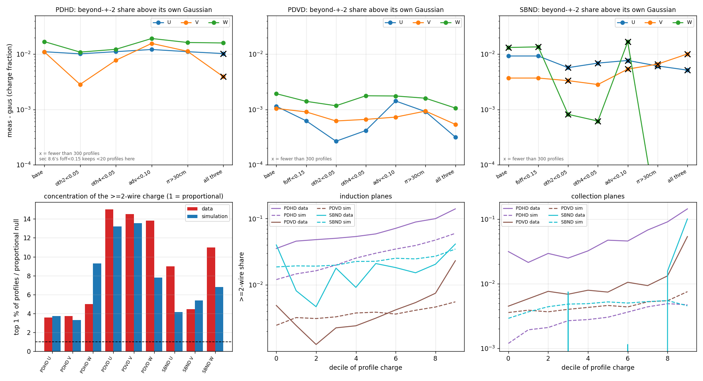

# 47 — Where the constant transverse smearing comes from: the same measurement on simulated tracks, three detectors

**Question (owner, 2026-09-05).** The track fit needs a constant transverse smearing `c` far
above what diffusion and the SP wire filter give (doc 44: PDVD 2.30/2.30/1.18 mm U/V/W; doc
pdhd/02: PDHD 3.21/2.72/1.46; doc 44 §2.4: SBND 1.32/1.32/0.38, with SBND "not seeing the
issue" because its constant sits at its wire filter). Both PDVD and PDHD now ship the data
values, but nobody could say why the SP output is that wide. If simulation reproduces the
constant, every step of the chain is known and the mechanism can be isolated; if not, the
data carry something the simulation does not model.

**Answer.** Both, and the split is by detector and plane:

- **The simulation reproduces the INDUCTION constant on SBND exactly and on PDHD within
  its noise-level sensitivity**: the SP wire filter's real-space kernel (PDHD 3.4 mm, SBND
  1.4 mm, PDVD 0.2 mm) in quadrature with a **residual of the 2-D deconvolution against the
  pitch-averaged field response**, ~0.2 pitch on induction and 0.12 on collection (§3.5).
  The ROI/noise environment modulates it (PDHD: noise ×0.5 → 3.1 mm, ×2 → 1.6 mm; PDVD and
  SBND ±0.15 mm). *(Second round, §8: the further claim that this residual is concentrated at
  the wire-region boundary — §3.4, §4.2 — is **withdrawn**; it was an artefact of inverting a
  phase-selected measurement against a phase-averaged model. The residual is real and
  phase-independent, so doc 44's "more peaked than a Gaussian of equal rms" is not a phase
  mixture; §8.5 measures what the data's peakedness actually is.)*
- **The simulation does NOT reproduce PDVD's induction constant (1.29 vs 2.30 mm) nor the
  collection constants of either ProtoDUNE (0.4–0.5 vs 1.2–1.5 mm)**, while SBND's collection
  (0.54 vs 0.38) is fine. The ProtoDUNE data carry an extra ~1.0–1.9 mm (0.2–0.25 pitch) on
  exactly the planes where the simulated constant is small. That part is a data effect the
  simulation does not model; §6 names the candidates and the data test that separates them.
  *(Third round, §9: the ≥ 2-wire tail is real and **is not topology** — it survives isolation
  and straightness cuts that discard 75–98 % of the charge (§9.4) — and it accounts for the
  whole gap between the rms-matched and share-matched widths (§9.6). It is not in the
  deconvolution's output: data and simulation feed ROI formation the same cross-channel
  amplitude — measured on |q|, where clipping cannot bias it, they agree to a few per cent —
  and the ROI stage removes 99.3 % of it in simulation against 93–95 % in the data (§9.5).
  **§9's further claim that this tail IS the ProtoDUNE excess is withdrawn by §10.4:** measured
  against the simulation rather than against a Gaussian, the tail is under-produced by 14–55×
  on **all three** detectors, SBND included, while the widening of the profile CORE that the
  shipped constants correct is ProtoDUNE-only. Two effects, not one.)*
- *(Fourth round, §10, the owner's 2-D-response question: in this simulation a field-response
  error **cancels by construction**, so the simulated `c` is a floor and `c_data ⊖ c_sim` is the
  budget for any data-only effect — non-zero on five of nine planes, all ProtoDUNE, and
  consistent with zero on all of SBND. Broken deliberately (sim and SP given different FR files
  that differ by 1.74–1.87× in the ±1-wire amplitude), a realistic response mismatch is worth
  **up to +1.7 mm on induction and nothing on collection** (§10.5). So the hypothesis covers the
  ProtoDUNE induction excess and **fails on the collection planes**, whose 1.05 mm (PDVD) and
  1.41 mm (PDHD) remain unexplained.)*
- The low effective D_T the data return (PDVD 4.9, PDHD 6.1 cm²/s against physical 7.9/8.2)
  is partly an SP effect: the simulation returns 5.5/6.8/8.2 for configured 7.9/8.2/8.8.

Everything below is measured with the doc-44 estimator unchanged (imported, not copied)
on frames whose truth is known to sub-pitch precision.

## 0. Repro

```bash
cd /nfs/data/1/xqian/toolkit-dev/wcp-porting-img; S=pdvd/docs/nf_sp_img_clus/scripts; X=/home/xqian/tmp/xtrack
# pin (never local/lib): libWireCellSigProc.so 1984cc94d88e9c0b7fc67dfd32495ea7, libWireCellGen.so 3f33af41af3252b8189c2582e343d86d (toolkit 76f47614)
mkdir -p /home/xqian/tmp/xtrack_libpin && cp -a /home/xqian/toolkit-dev/local/lib/. /home/xqian/tmp/xtrack_libpin/
# --- A. drivers (forks BY DUPLICATION of <det>_sim/wct-sim-check-track.jsonnet; SBND is new): compile once per detector to get the Drifter volumes
export WIRECELL_PATH=/home/xqian/toolkit-dev/toolkit/cfg:/home/xqian/toolkit-dev/wire-cell-data
(cd pdhd_sim && wcsonnet -V elecGain=14 --tla-code 'tracks=[{"tail":[342,200,60],"head":[5,200,60],"charge":-500}]' --tla-code anode_index=1 -o $X/pdhd/cfg/S1.json wct-sim-xtrack-sp.jsonnet)
(cd pdvd_sim && wcsonnet --tla-code 'tracks=[{"tail":[-318,-80,60],"head":[-6,-80,60],"charge":-500}]' --tla-code anode_index=0 -o $X/pdvd/cfg/S1_a0.json wct-sim-xtrack-sp.jsonnet)   # + anode_index=4 -> S1_a4.json
(cd sbnd_sim && wcsonnet --tla-code 'tracks=[{"tail":[-191,0,200],"head":[-3,0,200],"charge":-500}]' --tla-code anode_index=0 -o $X/sbnd/cfg/S1.json wct-sim-xtrack-sp.jsonnet)
# --- B. tracks (truth JSONs committed as figs/47_truth_*.json)
python3 $S/d47_make_xtracks.py --det pdhd --cfg $X/pdhd/cfg/S1.json --anode 1 --face 1 --n 10 --seed 47 --y0 150 --y1 450 --z0 5 --z1 230 --outdir $X/pdhd
python3 $S/d47_make_xtracks.py --det pdhd --cfg $X/pdhd/cfg/S1_a0.json --anode 0 --face 0 --n 10 --seed 47 --y0 150 --y1 450 --z0 5 --z1 230 --outdir $X/pdhd      # APA0 variant
python3 $S/d47_make_xtracks.py --det pdvd --cfg $X/pdvd/cfg/S1_a0.json --anode 0 --face 0 --n 8 --seed 47 --y0 -165 --y1 -5 --z0 1 --z1 149 --outdir $X/pdvd     # + anode 4 (top CRP)
python3 $S/d47_make_xtracks.py --det sbnd --cfg $X/sbnd/cfg/S1.json --anode 0 --n 10 --seed 47 --tan-theta 0.24 --y0 -150 --y1 150 --z0 30 --z1 470 --outdir $X/sbnd
# --- C. arms (each arm is COMPILED to $X/<det>/cfg/<arm>.json first -- the compiled-config proof -- then run with wire-cell -c on the pin)
for k in 0.5 2; do python3 $S/d47_scale_noise.py --k $k --outdir $X/noise /home/xqian/toolkit-dev/wire-cell-data/{protodunehd-noise-spectra-14mVfC-v1,pdvd-bottom-noise-spectra-7d8mVfC-v1,pdvd-top-noise-spectra-v3,sbnd-noise-spectra-v1}.json.bz2; done
DET=pdhd ARMS="S0 S0n5 S1 S2 S3 S5 nsig5 S6a S6b S1n05 S1n2" NPAR=5 $S/run_d47_xtrack_arms.sh
DET=pdvd ARMS="S0 S0n5 S1 S2 S3 S5 nsig5 top S1n05 S1n2"    NPAR=4 $S/run_d47_xtrack_arms.sh
DET=sbnd ARMS="S0 S0n5 S1 S2 S3 S5 nsig5 S1n05 S1n2"        NPAR=4 $S/run_d47_xtrack_arms.sh      # S2/S3/nsig5 run with nf=false on SBND (sec 2.4)
# --- D. the measurement (one call per (det, arm, tag); $S/d47_run_ana.sh loops them)
python3 $S/d47_sim_transverse_profile.py --det pdhd --truth $X/pdhd/truth_pdhd_a1.json --frames $X/pdhd/S1-anode1-sp.tar.bz2 --tag gauss --nboot 100 --out $X/pdhd/ana/S1_gauss
python3 $S/d47_sim_transverse_profile.py --det pdhd --truth $X/pdhd/truth_pdhd_a1.json --frames $X/pdhd/S0-anode1-splat.tar.bz2 --tag auto --nboot 100 --kernel --out $X/pdhd/ana/S0v2_splat
python3 $S/d47_sim_transverse_profile.py --det pdhd --truth $X/pdhd/truth_pdhd_a1.json --frames $X/pdhd/S1-anode1-sp.tar.bz2 --tag gauss --nboot 60 --phase-split --out $X/pdhd/ana/S1_gauss_ph
python3 $S/d47_collect.py --root $X --out pdvd/docs/nf_sp_img_clus/figs/47_sim_summary.tsv
python3 $S/d47_plots.py --summary pdvd/docs/nf_sp_img_clus/figs/47_sim_summary.tsv --figs pdvd/docs/nf_sp_img_clus/figs --out pdvd/docs/nf_sp_img_clus/figs/47
```

Second round (§8; analysis only, no new wire-cell runs — the arms above are reused):

```bash
cd /nfs/data/1/xqian/toolkit-dev/wcp-porting-img; S=pdvd/docs/nf_sp_img_clus/scripts; F=pdvd/docs/nf_sp_img_clus/figs; X=/home/xqian/tmp/xtrack
# --- legacy regression gate for the estimator change (must be byte-identical; T=a scratch dir)
python3 $S/d44_sigma_fit.py --det pdvd --nboot 30 --out $T/reg_new $(ls pdvd/work/039252_*_d42fit/tracking-stm.root | head -6)   # vs the pre-patch copy: cmp _{bins,fit,shape}.tsv
python3 pdhd/docs/scripts/d44_sigma_fit.py --det pdhd --max-advance 0.436 --nboot 30 --out $T/regh_new $(ls pdhd/work/029107_*_stmwc/tracking-stm.root | head -5)
# --- the artefact: what the OLD (phase-averaged) inversion reports for a phase-INDEPENDENT sigma
for d in pdvd sbnd; do python3 $S/d47_phase_artefact.py --det $d --fit $F/44_sigma_${d}_fit.tsv --bins $F/44_sigma_${d}_bins.tsv --est share --out $F/47_phase_artefact_$d.tsv; done
python3 $S/d47_phase_artefact.py --det pdhd --fit pdhd/docs/figs/d02_sigma_fit.tsv --bins pdhd/docs/figs/d02_sigma_bins.tsv --est share --out $F/47_phase_artefact_pdhd.tsv
for d in pdhd pdvd sbnd; do python3 $S/d47_phase_artefact.py --det $d --fit $X/$d/ana/S1_gauss_fit.tsv --bins $X/$d/ana/S1_gauss_bins.tsv --est share --out $F/47_phase_artefact_sim_$d.tsv; done
# --- simulation, corrected inversion: truth phase (_ph2), the profile's own centroid (_phc), truth + 0.26 wire (_phj)
python3 $S/d47_sim_transverse_profile.py --det pdvd --truth $X/pdvd/truth_pdvd_a0.json --frames $X/pdvd/S1-anode0-sp.tar.bz2 --tag gauss --nboot 60 --phase-split --out $X/pdvd/ana/S1_gauss_ph2
#   ... the same for (pdhd a1, sbnd a0) x (S1, S3), and with --phase-src centroid / --phase-jitter 0.26 ; controls: --no-clip, --halfwidth 5
python3 $S/d47_sim_transverse_profile.py --det pdvd --truth $X/pdvd/truth_pdvd_a0.json --frames $X/pdvd/S0-anode0-splat.tar.bz2 --tag auto --nboot 20 --out $X/pdvd/ana/S0v3_splat     # the no-SP null for sec 8.2
# --- data, same machinery
python3 $S/d44_sigma_fit.py --det pdvd --nboot 200 --phase-split --out $F/47_phase_pdvd pdvd/work/039252_*_d42fit/tracking-stm.root
python3 $S/d44_sigma_fit.py --det sbnd --nboot 200 --phase-split --out $F/47_phase_sbnd sbnd/sbnd_xin/work-stmcamp-d42fit/*/tracking-stm.root
(cd pdhd && python3 docs/scripts/d44_sigma_fit.py --det pdhd --max-advance 0.436 --nboot 200 --phase-split --out ../$F/47_phase_pdhd work/029107_*_stmwc/tracking-stm.root)
# --- tables, bias, shape, figure
for d in pdhd pdvd sbnd; do python3 $S/d47_phase_table.py --bins $F/47_phase_${d}_bins.tsv --fit $F/47_phase_${d}_fit.tsv --est share --artefact $F/47_phase_artefact_$d.tsv --tag data_$d --out $F/47_phase_table.tsv --append; done   # + one call per sim arm/variant
python3 $S/d47_phase_bias.py --out $F/47_phase_bias.tsv pdvd:S1:$X/pdvd/ana/S1_gauss_ph2_rows.tsv pdvd:S0splat:$X/pdvd/ana/S0v3_splat_rows.tsv ...
python3 $S/d47_peakedness.py --out $F/47_peakedness.tsv data:pdvd:$F/44_sigma_pdvd_bins.tsv sim:pdvd:$X/pdvd/ana/S1_gauss_bins.tsv data:pdhd:pdhd/docs/figs/d02_sigma_bins.tsv sim:pdhd:$X/pdhd/ana/S1_gauss_bins.tsv data:sbnd:$F/44_sigma_sbnd_bins.tsv sim:sbnd:$X/sbnd/ana/S1_gauss_bins.tsv
python3 $S/d47_phase_plot.py --table $F/47_phase_table.tsv --out $F/47_phase2.png
```

Third round (§9; analysis only, the same arms and the same data again):

```bash
cd /nfs/data/1/xqian/toolkit-dev/wcp-porting-img; S=pdvd/docs/nf_sp_img_clus/scripts; F=pdvd/docs/nf_sp_img_clus/figs; X=/home/xqian/tmp/xtrack; A=/home/xqian/tmp/d47tail
# --- legacy regression gate for the two additive columns (oth/oth4) -- must be byte-identical
python3 $S/d44_sigma_fit.py --det pdvd --nboot 30 --out $A/reg_new $(ls pdvd/work/039252_*_d42fit/tracking-stm.root | head -6)          # vs the pre-patch copy: cmp _{bins,fit,shape}.tsv
(cd pdhd && python3 docs/scripts/d44_sigma_fit.py --det pdhd --max-advance 0.436 --nboot 30 --out $A/regh_new $(ls work/029107_*_stmwc/tracking-stm.root | head -5))
python3 $S/d47_sim_transverse_profile.py --det pdvd --truth $X/pdvd/truth_pdvd_a0.json --frames $X/pdvd/S1-anode0-sp.tar.bz2 --tag gauss --nboot 100 --out $A/simreg_pdvd   # cmp vs $X/pdvd/ana/S1_gauss_{bins,fit,shape,calib}.tsv
#  and d44_sp_profile.py without --rings-tsv on all six event/anode pairs: console + --tsv pool cmp SAME
# --- the cuts and the two cut-free statistics, on the data
python3 $S/d47_tail_isolation.py --det pdvd --nboot 50 --out $F/47_tail_pdvd $(ls pdvd/work/039252_*_d42fit/tracking-stm.root)
python3 $S/d47_tail_isolation.py --det sbnd --nboot 50 --out $F/47_tail_sbnd $(ls sbnd/sbnd_xin/work-stmcamp-d42fit/*/tracking-stm.root)
(cd pdhd && python3 ../$S/d47_tail_isolation.py --det pdhd --sigma-fit docs/scripts/d44_sigma_fit.py --max-advance 0.436 --nboot 50 --out ../$F/47_tail_pdhd $(ls work/029107_*_stmwc/tracking-stm.root))
# --- the same statistics on every simulated arm (no cut applies: the tracks are clean lines)
rm -f $F/47_tail_sim_*_anatomy.tsv $F/47_tail_frame_pdvd_anatomy.tsv $A/rings_*.tsv $A/rawdp_*.tsv   # --append refuses to dedupe
for d in pdhd pdvd sbnd; do for arm in S0v3_splat S1_gauss S1n05_gauss S1n2_gauss S2_gauss S3_gauss S5_gauss S1_raw S1_rawdecon S1_wiener; do \
  python3 $S/d47_tail_isolation.py --det pdvd --rows $X/$d/ana/${arm}_rows.tsv --tag $arm --append --out $F/47_tail_sim_$d; done; done
# --- does imaging gate the tail?  the same PDVD profiles read as ctpc, as the SP frame and as rawdecon
#     (frames from doc 44 sec 3.2's run_nf_sp_evt.sh -R; the rawdecon tick origin is PINNED to the gauss scan's)
for spec in 039252_2:4:-1 039252_16:4:0 039252_16:6:0 039253_17:2:0 039253_17:6:0 039349_23:6:0; do e=${spec%%:*}; an=$(echo $spec|cut -d: -f2); off=$(echo $spec|cut -d: -f3)
  python3 $S/d44_sp_profile.py --root pdvd/work/${e}_d42fit/tracking-stm.root --frames /home/xqian/tmp/d44sp/$e --anode $an              --rings-tsv $A/rings
  python3 $S/d44_sp_profile.py --root pdvd/work/${e}_d42fit/tracking-stm.root --frames /home/xqian/tmp/d44sp/$e --anode $an --tag rawdecon --tick-offset $off --rings-tsv $A/rawdp; done
for t in ctpc:rings_ctpc sp:rings_sp rawdecon:rawdp_sp rawdecon_abs:rawdp_spabs; do python3 $S/d47_tail_isolation.py --det pdvd --rows $A/${t##*:}.tsv --tag ${t%%:*} --append --out $F/47_tail_frame_pdvd; done
# --- the |q| basis for rawdecon (sec 9.5: data and sim do not clip the same amount of a bipolar frame)
for d in pdvd pdhd sbnd; do an=$([ $d = pdhd ] && echo 1 || echo 0)
  python3 $S/d47_sim_transverse_profile.py --det $d --truth $X/$d/truth_${d}_a${an}.json --frames $X/$d/S1-anode${an}-sp.tar.bz2 --tag rawdecon --abs-charge --nboot 5 --out $A/simabs_$d
  python3 $S/d47_tail_isolation.py --det pdvd --rows $A/simabs_${d}_rows.tsv --tag S1_rawdecon_abs --append --out $F/47_tail_sim_$d; done
python3 $S/d47_tail_plot.py --figs $F --out $F/47_tail.png
# --- D. fourth round (sec 10): the field-response budget and the two mismatch arms
#     the estimator gains an `apa` column + `--split apa`; byte-identical when unused (gate in sec 10.8)
python3 $S/d44_sigma_fit.py --det pdhd --max-advance 0.436 --nboot 200 --split apa --out $A/d02_apa ../pdhd/work/029107_*_stmwc/tracking-stm.root
#     the pdvd driver gains sim_fields / sp_fields, both inert when ''.  FRc = matched control on
#     the non-production file; FRm/FRr = the two crossed pairs.
DET=pdvd ARMS="FRc FRm FRr" NPAR=3 $S/run_d47_xtrack_arms.sh
for arm in FRc FRm FRr; do for tag in gauss rawdecon; do \
  python3 $S/d47_sim_transverse_profile.py --det pdvd --truth $X/pdvd/truth_pdvd_a0.json \
    --frames $X/pdvd/$arm-anode0-sp.tar.bz2 --tag $tag --nboot 100 --out $X/pdvd/ana/${arm}_$tag; done; done
cp $A/d02_apa_bins.tsv $F/47_fr_apa_pdhd_bins.tsv; cp $A/d02_apa_fit.tsv $F/47_fr_apa_pdhd_fit.tsv
python3 $S/d47_fr_budget.py --figs $F --sim-root $X --apa-bins $F/47_fr_apa_pdhd_bins.tsv --out $F/47_fr_budget
```

Committed: the three drivers (`pdhd_sim/`, `pdvd_sim/`, `sbnd_sim/wct-sim-xtrack-sp.jsonnet`),
`scripts/d47_{make_xtracks,sim_transverse_profile,collect,plots,scale_noise}.py`,
`scripts/run_d47_xtrack_arms.sh`, `scripts/d47_run_ana.sh`, `figs/47_sim_summary.tsv`, per
(detector, arm) `figs/47_<det>_<arm>_<tag>_{fit,bins,shape,phase_fit,ksum,kernel_sr}.tsv`,
the truth/track JSONs `figs/47_{truth,tracks}_<det>_a<N>.json`, `figs/47_arms.png`,
`figs/47_phase.png`. Frames and logs stay under `/home/xqian/tmp/xtrack/` (regenerated in
~25 min of wall time; every arm is 20–60 s). Third round adds
`scripts/d47_tail_isolation.py`, `scripts/d47_tail_plot.py`, `figs/47_tail.png` and
`figs/47_tail_{pdhd,pdvd,sbnd}_{anatomy,cuts}.tsv`,
`figs/47_tail_sim_{pdhd,pdvd,sbnd}_anatomy.tsv`, `figs/47_tail_frame_pdvd_anatomy.tsv`, and
Fourth round adds `scripts/d47_fr_budget.py`, `figs/47_fr_budget.tsv`,
`figs/47_fr_pdvd_FR{c,m,r}_{fit,shape}.tsv`, `figs/47_fr_apa_pdhd_{bins,fit}.tsv`, the
`sim_fields`/`sp_fields` TLAs on `pdvd_sim/wct-sim-xtrack-sp.jsonnet` with the FRc/FRm/FRr
arms in `run_d47_xtrack_arms.sh`, and the `apa` column + `--split apa` on BOTH forks of
`d44_sigma_fit.py`.
`--rings-tsv` / `--tick-offset` on `d44_sp_profile.py` plus `--abs-charge` on
`d47_sim_transverse_profile.py`; it runs in ~4 min per detector and touches no wire-cell job.

## 1. What was known before running anything

| | PDHD | PDVD | SBND |
|---|---|---|---|
| data `c` U/V/W [mm] (share-matched joint; doc pdhd/02, doc 44) | 3.21 / 2.72 / 1.46 | 2.30 / 2.30 / 1.18 | 1.32 / 1.32 / 0.38 |
| in pitch units | 0.69 / 0.58 / 0.30 | 0.30 / 0.30 / 0.23 | 0.44 / 0.44 / 0.13 |
| wire filter, true kernel rms [mm] (doc pdhd/02 §1) | 3.40 / 3.40 / 0.03 | 0.21 / 0.21 / 0.04 | 1.41 / 1.41 / 0.16 |
| data D_T,eff / physical [cm²/s] | 6.1 ± 2.1 / 8.20 | 4.9 ± 0.6 / 7.91 | 6.7 ± 1.1 / 8.8 |

The corpus had shown (doc 44 §3.2) that the width is already in the SP `gauss` frame, that it
is charge and not rectified noise (doc 42 §8.9), and that the wire filter cannot be the common
cause (the induction ordering is PDHD ≫ SBND ≫ PDVD while the effect is PDHD ≈ PDVD ≫ SBND).
The SP chain has exactly one place that moves charge across channels: `decon_2D_init`
(`sigproc/src/OmnibusSigProc.cxx:1257-1334`) — the 2-D deconvolution against the field
response **averaged over impact position per wire region** (`Response::wire_region_average`,
`util/src/Response.cxx:79-196`; identical structure on the three FR files: 21 wire regions,
10 impacts per pitch) followed by the wire filter on the channel axis. ROI formation and
refinement gate time ranges per channel. The candidate mechanism was therefore that
deconvolving a charge at sub-pitch position u with the pitch-averaged response leaves a
residual on the neighbours that depends on u.

## 2. Method

### 2.1 Tracks

Straight tracks at a fixed angle to the drift axis (`d47_make_xtracks.py`, tan θ = 0.30, SBND
0.24), from 1 cm past the response plane to 5 cm before the cathode, moving in z. Every tick
samples a different drift distance; in every plane the track advances a fixed, small number
of wires per 4-tick slice — **exactly the "prolonged" regime the data selection keeps**
(PDHD 0.164/0.164/0.197 wires per slice U/V/W, PDVD 0.061/0.061/0.184, SBND 0.125/0.125/0.250,
against the data cuts 0.436 / 0.25 / 0.25) — and the sub-pitch phase sweeps continuously, so
all phases are sampled. 10 tracks (PDVD 8) per event, ≥ 8 wires apart in every plane, 5000 e/mm.
Track geometry, per-plane wire coordinate `w(x) = w0 + slope·|x − x_start|`, channels and
segments are written to a truth JSON; the drift volume is read from the compiled Drifter.

A track exactly along the drift axis was tried first and is **not usable**: every wire then
carries a ~2 ms DC signal that the induction planes and the ROI high-pass filters cannot
preserve (the PDHD collection `gauss` frame came out empty). Real prolonged segments are
never that prolonged.

### 2.2 Chain

`TrackDepos (0.1 mm) → Drifter → DepoBagger → DepoTransform → Reframer → (AddNoise) → Digitizer
→ OmnibusNoiseFilter → OmnibusSigProc → FrameFileSink`, one anode per run, SP built from the
simulation's own `simparams` (500 ns tick) with the production `sp.jsonnet` of each detector.
Transport = what each detector's fit assumes (PDHD DL/DT 4.12/8.20 cm²/s, v 1.576 mm/µs; PDVD
4.13/7.91, 1.568; SBND 4.0/8.8, 1.563); lifetime 10 s so the charge per tick is flat.
PDHD primary arm = **APA1 with L1SPFilterPD bypassed** (APA0 carries the only per-wire-region
`fltresp` filters and the swapped slot order; §5.3). PDVD = bottom CRP anode 0 (top CRP as a
variant); SBND = east TPC.

The "perfect" channel DB of the sim still carries the data bad-channel list and a
`min_rms_cut` (PDHD 10 ADC) that flags every NOISELESS channel bad and zeroes it in NF — both
neutralised for the study (`rms_cuts` override, `bad: []`). SBND's `mbOneChannelNoise` flags
flat channels bad whatever the cuts, so its noiseless arms bypass NF (`nf=false`; OSP reads
every trace of the frame).

### 2.3 Arms

| arm | switches | isolates |
|---|---|---|
| S0 | `DepoFluxSplat` (no response, no noise, no SP), `sparse=true` | the binned diffusion Gaussian: the estimator's calibration |
| S1 | production sim + noise → NF → SP | **the number to compare with data** |
| S2 | noise off, fluctuation off | the response + SP without noise |
| S3 | S2 + DL = DT = 10⁻⁴ cm²/s | the SP kernel alone (with `--kernel`, the super-resolution kernel vs phase) |
| S5 | S1 with `Wire_ind`/`Wire_col` replaced by an all-pass `HfFilter` | the wire filter's share |
| S1n05 / S1n2 | S1 with the noise spectra amplitudes × 0.5 / × 2 | the ROI-threshold environment |
| nsig5 / S0n5 | `nsigma` 5 instead of the hard-coded 3 (`common/sim/nodes.jsonnet:82`) | the sim's Gaussian truncation |
| S6a / S6b (PDHD) | L1SP `process`; APA0 | the PDHD confounds |
| top (PDVD) | anode 4 | the other CRP |

Every switch is proven in the compiled JSON before running (`Wire_filters`, `rawdecon_tag`,
`nsigma`, `seeds`, Drifter DL/DT/lifetime/fluctuate, AddNoise present, `DepoFluxSplat`,
`L1SPFilterPD`, one `HfFilter:Wire_pass`, `spectra_file`).

### 2.4 Estimator (`d47_sim_transverse_profile.py`)

Per (track, plane, 4-tick slice): the ±3-wire window around the truth position, in wire-index
order on the sensitive face mapped to channels (never by channel rank: PDHD's wrapped planes),
summed over the slice, negatives clipped as doc 44 does; own-centroid rms and centre-wire
share, plus the truth-centred moments the data cannot have; six equal-charge drift bins with
the data convention t = |x − x_W|/v; σ per bin inverted from the binned-Gaussian model at the
track's known in-slice extent with `apparent_rms` / `ring_shares` / `_bisect` **imported from
`d44_sigma_fit.py`**; bootstrap over tracks; per-plane and joint line σ² = 2 D t + c². The
x ↔ tick map is self-calibrated per track on the collection plane (the charge centroid is
linear in tick): the fitted mm/tick equals the configured one to 10⁻⁴ on every arm, and the
window charge per tick is 1.04–1.07 × truth (the path-length factor 1/cos θ = 1.044). A
`rawdecon` tag (pre-wire-filter, pre-ROI) is also saved; with bipolar, noise-dominated
waveforms the clipped estimator is meaningless on it (unclipped charge up to 13 × truth) and it
is not used below.

### 2.5 Calibration on the truth splat (S0)

| | PDHD | PDVD | SBND |
|---|---|---|---|
| D_T,eff (share) / configured [cm²/s] | 7.89 ± 0.14 / 8.20 | 5.96 ± 0.15 / 7.91 | 8.62 ± 0.15 / 8.80 |
| with `nsigma` 5 | 8.12 ± 0.13 | 6.84 ± 0.12 | 8.78 ± 0.15 |
| c² [mm²] (share, joint) | −0.11 ± 0.02 | −0.06 … +0.08 | −0.14 ± 0.01 |
| predicted from the un-diffused FR region (2 D_T · response_plane / v) | −0.094 | −0.18 | −0.106 |
| χ²/ndf | 7.1/14 | 152.8/14 (nsigma 5: 54.7) | 3.5/14 |

PDHD and SBND calibrate: D_T within 1 % once the 3 σ truncation is lifted (−2.8 % on D at
nsigma 3, as predicted), and the small negative c² is exactly the diffusion the simulation
does **not** apply between the response plane and the wires (the Drifter stops at the response
plane, 9–18 cm short; `Drifter.cxx:134-180`). PDVD does not calibrate cleanly (D 13 % low at
nsigma 5, χ² 55): at σ_T/pitch = 0.11–0.23 the splat's one-bin-per-wire patch under-splits the
charge near a boundary (`DepoFluxSplat.cxx` `set_sampling(..., wbins, nsigma, 0, 1)` on the
wire binning; the DepoTransform used by the SP arms samples 10 impact bins per pitch and is
not affected). Two things found on the way and left in place (pre-existing, not this
change): `DepoFluxSplat`'s dense accumulator (`sparse: false`) silently **drops** a depo patch
whose tick range lies inside the trace already held (`DenseAccumulator::add`,
`DepoFluxSplat.cxx:221-243`: the `std::plus` branch runs only when the range grows) — 7 of
every 8 depos here; and `DepoSplat` injects hidden uBooNE transverse smearing
(`DepoSplat.cxx:289-298`), which is why `DepoFluxSplat` with `sparse: true` is the truth arm.

## 3. Results

`figs/47_sim_summary.tsv`, share-matched joint fits, c in mm (rms-matched beside it in the
table file). Data rows from doc pdhd/02 §2.1 (PDHD, arm stmwc) and doc 44 §2.2/§2.4.

### 3.1 PDHD (APA1, L1SP bypass; wire filter 3.40 / 3.40 / 0.03 mm)

| arm | c_U | c_V | c_W | D_T,eff |
|---|---|---|---|---|
| S0 truth splat | −0.34 | −0.34 | −0.35 | 7.89 |
| S3 no diffusion, no noise | 3.36 | 3.66 | 0.50 | 0.01 |
| S2 no noise | 3.27 | 3.53 | 0.30 | 7.16 |
| nsig5 (S2, nsigma 5) | 3.27 | 3.54 | 0.30 | 7.21 |
| S5 no wire filter (noise on) | **1.03** | **1.08** | **0.57** | 4.58 |
| S1n05 noise × 0.5 | 3.11 | 3.10 | 0.28 | 7.21 |
| **S1 production** | **2.69** | **2.79** | **0.39** | **6.77** |
| S1n2 noise × 2 | 1.64 | 1.62 | 0.46 | 7.17 |
| S6a L1SP process | 2.68 | 2.79 | 0.39 | 6.78 |
| **data (stmwc)** | **3.21 ± 0.09** | **2.72 ± 0.13** | **1.46 ± 0.17** | **6.13 ± 2.11** |

### 3.2 PDVD (bottom CRP; wire filter 0.21 / 0.21 / 0.04 mm)

| arm | c_U | c_V | c_W | D_T,eff |
|---|---|---|---|---|
| S0 truth splat | 0.25 | 0.27 | −0.25 | 5.96 (n5: 6.84) |
| S3 no diffusion, no noise | 4.44 | 4.21 | 0.52 | 0.01 |
| S2 no noise | 4.06 | 4.35 | 0.21 | 6.99 |
| S5 no wire filter | 1.27 | 1.27 | 0.56 | 5.31 |
| S1n05 noise × 0.5 | 1.26 | 1.25 | 0.46 | 5.92 |
| **S1 production** | **1.29** | **1.27** | **0.54** | **5.53** |
| S1n2 noise × 2 | 1.45 | 1.47 | 0.56 | 6.22 |
| top CRP (anode 4) | 1.42 | 1.42 | 0.61 | 5.85 |
| **data (doc 44)** | **2.30 ± 0.04** | **2.30 ± 0.04** | **1.18 ± 0.05** | **4.87 ± 0.55** |

### 3.3 SBND (east TPC; wire filter 1.41 / 1.41 / 0.16 mm)

| arm | c_U | c_V | c_W | D_T,eff |
|---|---|---|---|---|
| S0 truth splat | −0.38 | −0.38 | −0.35 | 8.62 |
| S3 no diffusion, no noise (no NF) | 1.68 | 1.56 | 0.62 | −0.3 |
| S2 no noise (no NF) | 1.55 | 1.60 | 0.50 | 8.01 |
| S5 no wire filter | **0.53** | **0.65** | **0.58** | 5.34 |
| S1n05 noise × 0.5 | 1.30 | 1.28 | 0.52 | 8.21 |
| **S1 production** | **1.35** | **1.33** | **0.54** | **8.16** |
| S1n2 noise × 2 | 1.28 | 1.20 | 0.61 | 7.48 |
| **data (doc 44)** | **1.32 ± 0.06** | **1.32 ± 0.06** | **0.38 ± 0.19** | **6.7 ± 1.1** |


### 3.4 The sub-pitch phase (`--phase-split`, production arm S1; `figs/47_<det>_S1_gauss_phase_fit.tsv`)

> **WITHDRAWN 2026-09-05 (§8.1).** Every number in this subsection is an artefact of
> inverting a phase-selected measurement against the phase-averaged model; a σ with no phase
> dependence reproduces the table value for value (§8.1 verification 3). The corrected
> measurement is §8.2 and shows ≤ 5 % contrast under production conditions. The text is kept
> as published, for the record.

c [mm] by quartile of the true position's phase within the wire region (±0.5 = boundary):

| det | plane | −0.5…−0.25 | −0.25…0 | 0…0.25 | 0.25…0.5 |
|---|---|---|---|---|---|
| PDHD | U | 2.80 | 2.71 | 2.78 | 2.93 |
| PDHD | W | 1.28 | −0.14 | 0.08 | 1.52 |
| PDVD | U | 2.32 | 0.30 | 0.39 | 2.31 |
| PDVD | W | 1.35 | −0.02 | −0.03 | 1.19 |
| SBND | U | 1.78 | 1.08 | 1.07 | 1.66 |
| SBND | W | 1.49 | −0.43 | −0.49 | 1.00 |

(V mirrors U everywhere; the no-diffusion arm S3 shows the same pattern with larger
amplitudes: PDVD U 5.5 / 3.6 / 3.7 / 5.2, SBND U 2.1 / 1.4 / 1.3 / 2.0.)


### 3.5 The kernel without the wire filter (S5, `--kernel`: super-resolution stack about the true position, `figs/47_<det>_S5_gauss_ksum.tsv`)

rms of the SP output about the true position minus the 1/√12 pitch binning and the diffusion
of the arm, in pitch units (and mm): PDHD **0.22 / 0.28 / 0.11** (1.05 / 1.29 / 0.54 mm); PDVD
**0.19 / 0.19 / 0.12** (1.48 / 1.47 / 0.63 mm); SBND **0.08 / 0.19 / 0.14** (0.23 / 0.56 / 0.41 mm).
The truth splat gives 0.00–0.08 pitch on the same measure. So the deconvolution alone leaves
about **0.2 pitch on induction and 0.12 pitch on collection** on every detector.

## 4. Reading

1. **On induction the constant is the wire filter ⊕ the deconvolution residual.** PDHD S3
   (no diffusion, no noise) = 3.36 mm against the kernel's 3.40; remove the filter (S5) and
   1.03 mm is left; SBND S1 = 1.35 vs kernel 1.41, S5 leaves 0.53–0.65; PDVD has no filter
   and its whole simulated constant, 1.27–1.29 mm, is the residual. In quadrature,
   filter ⊕ S5 = 3.55 (PDHD), 1.50 (SBND) — slightly above S1 (2.69, 1.35) because the ROI
   trims the filtered tails.
2. **The residual is the impact-position effect, and it is not a boxcar.** *(The
   phase-dependence claim of this item is **WITHDRAWN**, §8.1/§8.2: the residual is
   phase-independent under production conditions. Its size, from §3.5, stands; §8.5 revisits
   the shape.)* §3.4: for charge
   at a wire-region centre the SP output is as narrow as the model (c ≈ 0 on W of all three
   detectors, on PDVD U/V 0.3 mm); for charge near the boundary c is 1.2–2.3 mm. The
   pitch-averaged response is exact for charge spread uniformly across the region and worst
   for charge at its edge, where the true response is shared between two wires and the
   deconvolution with the average pushes part of it further out. A uniform average over phase
   gives the 0.12–0.2 pitch of §3.5 rather than 1/√12 = 0.29 because the effect is
   concentrated in the outer half of the region. This is also why the stacked profile is a
   narrow core plus a tail — a mixture of phases — and why the share-matched σ beats the
   rms-matched one (doc 44 §2.3): the same holds in the simulation (S1 rms-matched
   3.76/4.23/0.60 on PDHD against share 3.27/3.53/0.30).
3. **The noise level sets how much of it survives.** PDHD: ×0.5 → 3.11, ×1 → 2.69, ×2 → 1.64 mm
   (the ROI thresholds scale with the RMS and trim the filtered tails; PDHD's `roi_mad_rms`
   and L1SP make no difference, S6a ≡ S1). PDVD and SBND move by ≤ 0.2 mm over the same range.
   The PDHD data value (3.21 U) therefore corresponds to a quieter ROI environment than the
   14 mV/fC noise spectra file simulates. The zero-noise arms are pathological on PDVD (S2:
   4.06 mm — with no RMS the ROI keeps every deconvolution tail) and are decomposition
   controls only.
4. **Data vs simulation, plane by plane (share, mm):**

   | | sim S1 | data | excess in data (quadrature) |
   |---|---|---|---|
   | SBND U / V / W | 1.35 / 1.33 / 0.54 | 1.32 / 1.32 / 0.38 | none |
   | PDHD U / V / W | 2.69 (3.11 at noise ×0.5) / 2.79 / 0.39 | 3.21 / 2.72 / 1.46 | ≤ 1.7 / none / **1.4** |
   | PDVD U / V / W | 1.29 / 1.27 / 0.54 | 2.30 / 2.30 / 1.18 | **1.9 / 1.9 / 1.05** |

   The simulation accounts for the whole SBND constant, for PDHD induction within the noise
   sensitivity, and for **none of the ProtoDUNE collection constants and half of PDVD's
   induction one**. The data excess is 0.2–0.3 pitch (PDHD W 0.29, PDVD U/V 0.25, W 0.21) on
   exactly the planes where the simulated mechanism is weakest.
5. **D_T,eff.** The SP chain returns 83 % (PDHD), 70 % (PDVD), 93 % (SBND) of the configured
   D_T with no extra physics; the data's low values (75 / 62 / 76 %) are mostly this, not a
   diffusion measurement. Doc 44 §2.2's "whether that is real is not decided" is now decided:
   the drift-resolved width the SP hands out grows more slowly than √t because the ROI trims
   the tails more at larger σ.
6. **PDHD APA0 (S6b) is not a physics result.** With the production APA0 SP config
   (`plane2layer [0,2,1]`, the `_APA1` Wiener set, `fltresp` filters) on the nominal
   simulated geometry, V comes out at 0.38 mm and W at 4.42: the swapped slot order puts the
   collection filter on V and the induction filter on W. The data APA0 config encodes that
   APA's cabling anomaly; the simulation does not have it. APA0 is excluded from every
   conclusion here, and any PDHD data number sourced from APA0 remains confounded.

## 5. What the simulation does not contain (candidates for the ProtoDUNE excess)

Not decided here; listed with the test that separates them.

- **The real field response vs the Garfield files.** The ProtoDUNE FRs (`dune-garfield-1d565`
  = ProtoDUNE-SP, `protodunevd_FR_imbalance3p_260501`) set both the simulated signal and the
  SP's deconvolution kernel, so a forward/backward mismatch cancels in the simulation and
  survives only in data. Induced signals on neighbouring strips/wires wider than Garfield
  predicts (CRP strips; the PDHD collection plane's transparency) would give exactly a
  detector-wide, drift-independent extra width. ~~Test: the doc-44 SP cross-check split by
  sub-pitch phase; the simulation predicts c → 0 at the region centre and the maximum at the
  boundary (§3.4).~~ **The phase test is WITHDRAWN (§8.4): there is no predicted contrast to
  look for (§8.2), and the fitted trajectory's phase resolution dilutes any contrast by
  ×0.01–0.05 (PDHD) to ×0.26–0.50 (PDVD/SBND). Use §8.5 instead.**
- **Cross-talk between adjacent front-end channels** (PDHD/PDVD-bottom FEMBs, PDVD-top TDE):
  a fixed fraction of a channel's signal on its neighbours, independent of drift and phase.
  A pulser run answers it directly; §8.5(b) shows the data do carry a ≥ 2-wire component the
  simulation has none of, on all three detectors. **Downgraded by §9.5:** a linear
  channel-to-channel leak has to be present in the 2-D deconvolution's own output, and on |q|
  the data's `rawdecon` ≥2-wire amplitude equals the simulation's (0.52/0.51/0.50 against
  0.52/0.53/0.53 on PDVD) while its `gauss` share is 6–7× larger. The difference is made after
  the deconvolution, in ROI formation. Not a bound on cross-talk — that share saturates near
  0.5 in every arm — but enough to make the pulser run the second test, after the ROI stage.
- **The data's noise/ROI environment** (§4.3): worth ±0.5 mm on PDHD, ≤ 0.2 mm on PDVD.
- **Track topology**: the data's prolonged segments carry δ-rays, multiple scattering and any
  3-D angle; the simulated tracks are clean lines. Doc 44 §3.1 measured the Bragg region
  0.4 mm wider than the plateau on PDVD — the size of a topology term, not of the 1.9 mm gap.
  **Bounded in §9.4**: real but confined to PDVD's induction far tail (half to three quarters
  of it) and probably SBND; none of PDHD's and none of PDVD collection's, i.e. none of the
  planes that carry the excess.

## 6. Consequences for the fit constants

- The `c` keys stay empirical and detector-specific (docs 44 and pdhd/02): the simulation
  confirms they are properties of the SP chain plus, on the ProtoDUNEs, of the detector.
  The "conditional on today's SP" clause is right in a stronger sense than written — the
  wire filter **and the noise level** move them (PDHD ±0.5 mm over ×0.5–×2).
- **SBND's canonical `sbnd_track_fitting.json` (0.48/0.81/0.09) is wrong by the same measure**:
  the simulation reproduces doc 44's derived 1.32/1.32/0.38 exactly. Flipping it is the owner's
  call and was not part of this round.
- PDVD's `Wire_ind` = 5.0 (doc 46's open item) has no bearing on its constant — the filter is
  already off in wire space; PDVD's constant is the deconvolution residual plus the data excess.
- ~~The two-component shape (§4.2) is what a better kernel would need: not a wider Gaussian
  but a phase-dependent one; a σ(phase) is implementable inside `cal_gaus_integral` behind a
  knob if the phase test of §5 confirms it.~~ **WITHDRAWN (§8.6): the width does not depend on
  the sub-pitch phase, so there is nothing for a σ(phase) to model. What the data do carry
  beyond the model is a ≥ 2-wire tail (§8.5), which a Gaussian of any width fits badly and a
  two-component kernel would fit — but only once its origin (topology vs cross-talk) is
  known.**

## 7. Open items and the next step

1. ~~**Run the phase split on data**~~ — **DONE and CLOSED, §8**: the split was run on all
   three detectors, and preparing it showed the §3.4 contrast to be an estimator artefact.
   The test decides nothing (§8.4); §8.5 gives two phase-free replacements and §8.6 the
   next step — **executed and closed in §9**: the ≥2-wire tail is not topology, and the
   data/simulation difference is made in ROI formation — the deconvolution feeds it the same
   cross-channel amplitude in both. §9.7 names the next step.
2. PDVD's splat calibration (wire-bin sampling at σ < 0.25 pitch) and the `DepoFluxSplat`
   dense-accumulator drop: report upstream; not touched here.
3. The FR-region diffusion gap (the Drifter stops 9–18 cm short of the wires; c² ≈ −0.1 mm²):
   negligible for this study, but it is a bias of every WCT simulation's near-anode width.
4. A noise-level scan on data would bound §4.3 for PDHD without simulation: the doc-44
   estimator per run / per APA against the measured RMS. **§9.5 makes this the live question**:
   the ROI thresholds are noise-scaled, and it is the ROI stage that separates data from
   simulation.
5. (§9.7) The ROI comparison itself — ROI widths and the occupancy the thresholds see, on the
   four PDVD events whose SP frames already exist.

---

# 8. The sub-pitch-phase test, redone (2026-09-05, second round)

Section 7 item 1 said to run the phase split on data. Preparing it uncovered that **the
phase split of §3.4 measured the estimator, not the detector**. This section retracts that
measurement, redoes it correctly on simulation and on data for all three detectors, shows
that the corrected test has essentially no power in data and why, and replaces the data test
§5 proposed with two phase-free ones that do discriminate. §3.5 (the kernel about the true
position) and §4.4 (the ProtoDUNE data excess) are untouched by any of this.

## 8.1 The defect

**Symptom.** §3.4 reported, on every plane of every detector, `c ≈ 0` for charge at a wire
region's centre and 1.2–2.3 mm at its boundary, and §4.2 read that as the impact-position
residual of deconvolving against the pitch-averaged field response.

**Root cause.** `apparent_rms` and `ring_shares` (`d44_sigma_fit.py:96-118` after the fix)
marginalise the
binned-Gaussian model over the source's sub-pitch position (the `_U` grid) — correct for a
sample that uniformly covers the pitch, which every `all` row is. The phase-split rows fed
that same phase-averaged model a subset **selected on that very position**. Both statistics
depend on the position enormously: a point source at a bin centre puts all its charge in one
wire (own-centroid rms 0), the same source at a bin boundary splits it in two (rms 0.5
pitch). Inverting a boundary-selected measurement against the phase-averaged model therefore
returns a σ far above the truth, and a centre-selected one a σ far below — out of a σ that
does not depend on phase at all.

**Why it hid.** The published centre quartiles were *negative* (PDHD W −0.14, PDVD W
−0.02/−0.03, SBND W −0.43/−0.49 mm). Those are not small numbers, they are the bisection
hitting its floor (`_bisect(..., 0.02, 3.0)`), i.e. an inversion driven below its own range —
and they were read as "c ≈ 0 at the centre", the very signature the mechanism predicted. The
artefact also scales with σ (large where σ is small, vanishing where σ is large), so it
reproduced a plausible plane-to-plane gradient: strong on collection, weak on PDHD induction.

**Fix.** `_binned_profiles(sig, extent, nsigma, phase=(lo, hi))` restricts the average to
sources whose centre lies in the window (midpoint rule, 96 points per pitch); `apparent_rms`,
`ring_shares`, `truth_rms` and **both** steps of `unfold` (the extent solve is phase-blind
too) take it. `phase=None` is the legacy code path, unchanged.

**Verification.**

1. *Legacy regression, all three scripts.* `d44_sigma_fit.py` on 6 PDVD `d42fit` events and
   the PDHD fork on 5 `stmwc` events, before vs after the patch: `_bins.tsv`, `_fit.tsv`,
   `_shape.tsv` byte-identical (`cmp`). `d47_sim_transverse_profile.py`, whose `bin_and_fit`
   was edited too, re-run with the published arguments (`--nboot 100`, no `--phase-split`) on
   the S1 arms of all three detectors: `_bins/_fit/_shape/_calib.tsv` byte-identical to the
   files §§1–7 were written from. So docs 44, pdhd/02 and §§1–7 here are unaffected. (A
   caveat found on the way: the fitted D_T,eff and c depend on `--nboot` at the 0.2 % level,
   because the line is weighted by bootstrap errors — compare arms only at equal `--nboot`.)
2. *Closure (self-consistency, not evidence).* `d47_phase_artefact.py` inverts a synthetic
   phase-independent σ with the corrected model and returns the input c to the last digit in
   every window. This cannot fail — the same model generates and inverts — and is only a
   check that the window bookkeeping is right. The test that could have failed is §8.2: a
   simulation whose width is known to be phase-independent, put through the corrected
   machinery, comes back flat (0.95–1.03) instead of the 2–7× the old machinery gave it.
3. *The artefact reproduces the published table.* Feed the same script each arm's own `all`
   fit as the truth, assume σ is phase independent, invert the **old** way:

   | c [mm], share-matched | q1 | q2 | q3 | q4 |
   |---|---|---|---|---|
   | PDVD U published §3.4 | 2.32 | 0.30 | 0.39 | 2.31 |
   | PDVD U artefact prediction | 2.36 | −0.31 | −0.31 | 2.36 |
   | PDVD W published §3.4 | 1.35 | −0.01 | −0.03 | 1.19 |
   | PDVD W artefact prediction | 1.35 | −0.35 | −0.35 | 1.35 |
   | SBND U published §3.4 | 1.78 | 1.08 | 1.07 | 1.66 |
   | SBND U artefact prediction | 1.60 | 1.06 | 1.06 | 1.60 |
   | SBND W published §3.4 | 1.49 | −0.43 | −0.49 | 1.00 |
   | SBND W artefact prediction | 1.08 | −0.45 | −0.45 | 1.08 |
   | PDHD U published §3.4 | 2.79 | 2.71 | 2.78 | 2.93 |
   | PDHD U artefact prediction | 2.99 | 2.37 | 2.37 | 2.99 |
   | PDHD W published §3.4 | 1.28 | −0.14 | 0.08 | 1.52 |
   | PDHD W artefact prediction | 1.19 | −0.38 | −0.38 | 1.19 |

   A phase-independent width reproduces the published contrast plane by plane, including the
   flat PDHD U row and the negative centre values. §3.4 is withdrawn.

A footnote for the record: the legacy `_U` grid (21 points spanning the pitch with both
endpoints, so the boundary phase carries double weight) differs from the converged midpoint
average by ≤ 1 % in rms and ≤ 0.013 in centre share for σ ≥ 0.3 pitch, growing to 3 % / 0.025
at σ = 0.05. Both sides of every inversion use the same grid, so the effect on the published
constants is below 0.1 mm; the legacy grid is kept exactly as it is so those numbers stay
reproducible.

## 8.2 The simulation, measured correctly

⟨σ_eff⟩ charge-weighted over the drift bins, boundary quartiles over centre quartiles (1 =
no phase dependence; the fitted `c` per window is in `figs/47_phase_table.tsv`, and is the
worse statistic here because on angled tracks the phase advances with drift, so a phase
window samples a periodic subset of drift slices and D_T,eff trades against c):

| edge/centre | PDHD U / V / W | PDVD U / V / W | SBND U / V / W |
|---|---|---|---|
| **S1 production, share-matched** | 0.95 / 0.95 / 1.00 | 1.03 / 1.03 / 1.02 | 1.03 / 0.99 / 1.00 |
| **S1 production, truth-centred** | 1.01 / 0.99 / 1.07 | 1.02 / 0.99 / 1.04 | 1.01 / 0.97 / 1.02 |
| S3 no diffusion/noise, share | 1.08 / 1.06 / 0.59 | 1.16 / 1.15 / 0.83 | 1.19 / 1.12 / 0.91 |
| S3 no diffusion/noise, truth-centred | 1.02 / 1.01 / 0.71 | 1.03 / 1.03 / 1.19 | 1.04 / 1.01 / 1.14 |

**Under production conditions the simulated width does not depend on the sub-pitch phase**
(≤ 5 %, both estimators, all nine planes) — against the 2–7× of §3.4. In the idealised
no-diffusion, no-noise arm a small effect survives on induction (+2 to +19 %, sign as
expected: wider at the boundary); collection there is inconsistent in sign between detectors
and sits at σ ≈ 0.2 pitch where the estimator is weakest, and the PDVD S3 arm is the
pathological zero-noise one of §4.3 (truth-centred σ 1.4 pitch). So the impact-position
effect is real but marginal, and diffusion plus the ROI erase what is left of it.

A candidate that the controls closed: the reconstructed centroid **is** pulled toward the
nearest wire centre, ⟨centroid − truth⟩ = s·phase with s = −0.15 to −0.22 wire/wire on PDVD
S1 (`figs/47_phase_bias.tsv`, `d47_phase_bias.py`) — but the truth-splat arm S0, which
contains no signal processing at all, gives s = −0.11 to −0.40, and a Gaussian of the same
width binned on wires predicts −0.06 to −0.32. The pull is the estimator's own binning
shrinkage; what is left over after subtracting it is between +0.06 and −0.06 in the
production SP arms and −0.05 to −0.08 in the splat control itself. No SP position bias is
established. (Unchanged by `--no-clip` and by a ±5-wire window: −0.217 → −0.217 / −0.213 on
PDVD U.)

## 8.3 The data, measured the same way

`d44_sigma_fit.py --phase-split` (PDVD `d42fit`, SBND `work-stmcamp-d42fit`, PDHD `stmwc` via
the fork), binning on the fitted trajectory's own phase `pu/pv/pw − round(pu/pv/pw)`:

| ⟨σ_eff⟩ [mm] | full | centre | edge | edge/centre |
|---|---|---|---|---|
| PDHD U / V / W | 3.81 / 3.36 / 2.33 | 3.97 / 3.57 / 2.26 | 3.62 / 3.08 / 2.93 | 0.91 / 0.86 / 1.30 |
| PDVD U / V / W | 2.61 / 2.67 / 1.61 | 2.87 / 2.97 / 1.78 | 2.62 / 2.14 / 2.26 | 0.92 / 0.72 / 1.26 |
| SBND U / V / W | 1.58 / 1.60 / 1.01 | 1.67 / 1.71 / 1.04 | 1.44 / 1.43 / 1.44 | 0.87 / 0.84 / 1.38 |

Profiles per plane: PDHD 5744 / 5081 / 7442, PDVD 9575 / 8229 / 8000, **SBND 410 / 397 / 237**
— SBND's ratios carry ±0.06 / ±0.08 / ±0.31 and constrain nothing on their own (its W is
1.2 σ from 1); PDVD and PDHD carry ±0.03 on induction and ±0.06 / ±0.08 on W.

The 2–3× contrast the old machinery would have produced (`sig_artefact_old_mm` in
`figs/47_phase_table_*.tsv`: edge/centre 1.14 on PDHD U up to 2.35 on PDVD U/V) is not there.
What is left is a small pattern with a consistent sign — induction 0.86–0.92, collection
1.26–1.38 — significant on PDHD and PDVD, not on SBND. §8.4 shows that pattern is what a
phase *estimator* does, not what a detector does.

## 8.4 Why the data test has no power

The data must bin on the **fitted** phase, and that phase is neither precise nor independent
of the profile being measured.

- **Precision.** `rms(measured centroid − fitted position)` per plane: PDHD 0.45 / 0.52 /
  0.41 wire, PDVD 0.28 / 0.28 / 0.20, SBND 0.24 / 0.30 / 0.26. The same quantity against the
  *truth* in simulation (which is centroid noise alone) is 0.23 / 0.21 / 0.07 (PDHD S1),
  0.10 / 0.10 / 0.08 (PDVD), 0.09 / 0.14 / 0.04 (SBND). The difference in quadrature — the
  fit's own phase error — is 0.39–0.48 wire on PDHD, 0.19–0.26 on PDVD, 0.23–0.27 on SBND.
  A centre/boundary contrast is a first harmonic in phase, so a wrapped-Gaussian phase error
  σ_φ multiplies it by exp(−2π²σ_φ²): **0.01–0.05 on PDHD, 0.26–0.50 on PDVD, 0.25–0.37 on
  SBND.** On PDHD the test is dead on arrival; on PDVD and SBND a true 2× contrast would show
  up as 1.2–1.5×.
- **Selection.** The fitted phase is driven by the same charge whose width is being measured.
  Where the profile is narrow the fit sits near a wire centre; where it is wide the fit is
  free to sit anywhere. The fitted phase distribution shows it: instead of the uniform
  distribution the geometry demands, the two central bins carry 1.5–2.5× their share on the
  collection planes (PDVD W 0.240/0.257 against 0.10 flat; PDHD W 1.7×, SBND W 2.0×), and are
  flat within 10 % on PDVD V and PDHD U where the fit is least charge-driven.

Both effects are measurable on simulation, where the answer is known to be flat, by binning
the same simulated profiles on data-like phases (`--phase-src centroid`, `--phase-jitter`):

| edge/centre, sim S1 (truly flat: 0.95–1.03) | PDHD U/V/W | PDVD U/V/W | SBND U/V/W |
|---|---|---|---|
| binned on the profile's own centroid | 0.99 / 0.98 / 1.22 | 1.34 / 1.35 / 1.26 | 1.00 / 0.95 / 1.16 |
| binned on the truth + 0.26 wire | 0.86 / 0.87 / 0.47 | 0.44 / 0.44 / 0.45 | 0.83 / 0.83 / 0.64 |

A charge-driven phase manufactures edge/centre > 1 on collection (up to 1.35), a noisy phase
manufactures < 1 (down to 0.44) — the two directions the data show, on the planes where each
mechanism should dominate. Applied to the S3 arm, where a real +6 to +19 % contrast exists,
the same estimators return 0.86–1.71 (centroid) and 0.13–0.93 (jitter): the input contrast is
not recoverable — on the collection planes it is turned into a 1.65–1.71 boundary excess. **The data numbers of §8.3 lie inside the null band and constrain nothing.**


## 8.5 Two phase-free comparisons that do discriminate

Since the phase route is closed, the same data and simulation were compared on statistics
that need no phase at all.

**(a) Peakedness.** ρ = σ(rms-matched) / σ(share-matched) per drift bin: 1 for a Gaussian,
above 1 for a narrow core with tails (`d47_peakedness.py`, `figs/47_peakedness.tsv`). Over every
drift bin of every plane and detector (54 bins each), **the simulation gives ρ = 0.99–1.16
(10–90 % 1.00–1.11) and the data ρ = 0.98–2.32 (10–90 % 1.08–1.57)** — the simulated profile
is Gaussian to a few per cent at every width the chain produces, and the data profile is not,
most strongly on collection (plane means: PDHD W 1.56, SBND W 1.50, PDVD W 1.44).

ρ rises slowly with σ, so the comparison is only clean where the two σ ranges overlap. Four
of the nine planes have the data at or below the simulation's own σ and need no extrapolation
at all:

| | data σ [mm] / ρ | sim σ [mm] / ρ |
|---|---|---|
| **SBND W** | 1.00 / **1.501** | 1.15 / 1.029 |
| SBND U | 1.58 / 1.154 | 1.69 / 1.042 |
| SBND V | 1.59 / 1.060 | 1.67 / 1.013 |
| PDHD V | 2.95 / 1.183 | 3.05 / 0.994 |

SBND W is the sharpest point of the whole comparison: **on the one plane whose width §4.4
found fully reproduced, the data profile is far more peaked than the simulated one** — the
width agrees and the shape does not. (The `sim rho AT the data's sigma` column in the TSV
extrapolates the sim's ρ(σ) line up to 71 % beyond its support on PDHD W and PDVD U/V and
runs below 1 there, which is unphysical; it is kept in the TSV as a diagnostic and is not
used here.)

**(b) The far tail.** Ring shares of the stacked profile (`_shape.tsv`, share beyond ±2
wires): simulation gives **0.000 on every plane of every detector**; data give 0.015 / 0.012 /
0.017 (PDHD U/V/W), 0.002 / 0.002 / 0.002 (PDVD), 0.009 / 0.004 / 0.013 (SBND). The ±2 ring
tells the same story on collection: PDHD 0.058 data vs 0.003 sim, SBND 0.015 vs 0.005.

So the data profile is not a wider version of the simulated one: it is the simulated core
plus a component at ≥ 2 wires that the simulation does not produce **on every detector,
including SBND, whose width §4.4 found fully reproduced**. That component is small in charge
(1–6 %) and large in leverage (it enters the variance with a weight of 4–9 wire²), and it is
the natural place to look for the ProtoDUNE collection excess of §4.4 — with the caveat that
the data's prolonged segments carry δ-rays and 3-D angles that the straight simulated tracks
do not, which is itself a tail source (§5, last bullet) and is now the first thing to bound.

## 8.6 What this changes

- §3.4 is **withdrawn** (§8.1) and replaced by §8.2; §4.2's second sentence (the residual is
  concentrated at the wire-region boundary) is withdrawn with it. §4.2's first claim — that
  the deconvolution leaves a residual of ~0.2 pitch on induction and 0.12 on collection —
  rests on §3.5, which stacks the SP output about the *true* position and never uses the
  own-centroid inversion; it stands, and it is now known to be **phase-independent**, which
  the mechanism as stated did not predict. Why a pitch-averaged deconvolution leaves a
  phase-independent residual is open.
- §5's first bullet proposed the phase split as the test that separates the field response
  and cross-talk from the deconvolution. **That test is withdrawn**: it has no signal to look
  for (§8.2) and no power to see one (§8.4). §8.5 replaces it.
- §6's last bullet ("a σ(phase) is implementable inside `cal_gaus_integral` behind a knob")
  is withdrawn: there is nothing to implement. The fit's transverse model does not need a
  phase dependence.
- The shipped constants (docs 44, pdhd/02) are untouched: they come from `all` rows, whose
  code path is byte-identical (§8.1 verification 1).

**Next step — executed in §9, and its conclusion superseded there.** The tail survives both
cuts (§9.4), so it is not topology; but §9.5 finds that the cross-channel residual entering
ROI formation is the same size in data and simulation, which excludes the cross-talk the
paragraph below proposes to measure and points at the ROI stage instead. Read §9 for what to
do next. As written at the time:

Bound the non-instrumental contributions to the far tail of §8.5(b) before
anything else, both with flags `d44_sigma_fit.py` already has, on the same arms:

1. **Isolation** (the likelier of the two): `--max-foff 0.15` keeps only blocks whose live
   charge sits within Chebyshev 2 of the trajectory, i.e. blocks with no δ-ray or second
   track inside the window. This is the direct measure of the "other activity within ±3
   wires" hypothesis, and `foff` is already an occasion so the split comes for free.
2. **Straightness**: `--max-advance 0.10` and the `rr > 30 cm` plateau, against the same
   quantity.

If the ≥ 2-wire share falls toward the simulation's zero under either, the tail is topology
and the ProtoDUNE width excess of §4.4 needs another explanation. If it does not, the tail is
instrumental, and a pulser run on one PDHD FEMB measures channel-to-channel cross-talk
directly — the one measurement that would close §5. *(The second branch is what happened, but
the pulser conclusion does not follow: §9.7.)*

---

# 9. The ≥ 2-wire tail: is it topology? (2026-09-06, third round)

> **Corrected by §10.4 (fourth round).** Everything measured in this section stands, but its
> reading does not: the ≥2-wire tail is compared here to a *Gaussian at the same share-matched
> σ*, which is the right comparison for peakedness (§9.6) and the wrong one for the ProtoDUNE
> excess. Against the **simulation**, the tail is under-produced by 14–55× on all three
> detectors — SBND included — while the core widening that the shipped constants correct is
> ProtoDUNE-only. Read §9 as "what the ≥2-wire tail is", not as "what the ProtoDUNE excess is".

Section 8.6 said to bound the non-instrumental sources of the ≥2-wire tail before calling it
instrumental. **Answer: it is not topology.** On the planes that carry the ProtoDUNE excess
the tail survives cuts that throw away 75–98 % of the charge, it is distributed across
profiles the way the simulation's own tail is rather than as a rare add-on, and it grows with
the profile's charge instead of falling like clipped noise. §9.5 then finds the stage that
makes it — the 2-D deconvolution's cross-channel amplitude is the same in data and simulation
and the ROI stage that follows removes ten times less of it in the data — and that supersedes
§8.6's own proposal for what to measure next. Everything here
is `d47_tail_isolation.py` on the same three data sets and the same simulated arms; nothing
new was run through wire-cell, and §§1–7 and §8 are untouched.

## 9.1 Two things had to be fixed before §8.6 could be run as written

**`--max-foff 0.15` cannot be run on the detector it matters for, and is circular on W
everywhere.** `foff` is the fraction of a block's live **W** charge more than 2 wires
(Chebyshev) from the fitted trajectory (`d44_sigma_fit.py collect()`). So for a W profile the
tag is computed on the very charge whose own tail is being measured; and at a radius of two
wires it measures *width* as much as isolation — the confound doc 46 records for `f_off`.
PDHD's profiles are 0.7–0.8 pitch wide and its block `foff` quantiles are 0.71 / 0.83 / 0.96
(10 / 50 / 90 %): **`foff < 0.15` keeps fewer than 20 profiles on PDHD.** On SBND it keeps
97–100 % and is inert. It is a real cut only on PDVD (25–46 % of the charge), and PDVD is
reported with it below.

Replacement, computed in the same pass and added to the estimator additively: **`oth4`** —
per (block, plane, slice), the fraction of the **other two planes'** live charge *at that same
time slice* lying more than **four** wires from the fitted trajectory. The other planes cannot
see the charge being measured, and at four wires a clean track of any width this chain
produces contributes nothing (4 wires is 5 σ even at PDHD's 0.8 pitch). `oth2` — the same at
two wires — is kept in the tables to show the confound directly: on PDHD it retains 7 % of the
charge where `oth4` retains 14–31 %.

**Every cut moves σ, so the raw ring share cannot carry the verdict.** `adv < 0.10` removes
the slices with the most in-window geometric spread and `rr > 30 cm` removes the Bragg region
(doc 44 §3.1: 0.4 mm wider); a narrower σ lowers the beyond-±2 share with the same underlying
physics. Every number below is the measured share **minus the binned Gaussian at that
selection's own re-fitted σ and mean extent**. For the same reason a sub-selection's fitted
`c` is not usable — the cuts are drift-correlated, the lever arm collapses, and PDHD W returns
c² < 0 on three of them. The script prints that warning; this section uses the
charge-weighted width `sig_mm` and the excess only.

*Gate.* Both changes to `d44_sigma_fit.py` and to its PDHD fork are additive (two columns on
the per-profile array, read by nothing else). Legacy regression on 6 PDVD `d42fit` and 5 PDHD
`stmwc` events, before vs after: `_bins.tsv`, `_fit.tsv`, `_shape.tsv` byte-identical (`cmp`)
on both scripts. `--rings-tsv` and `--tick-offset` on `d44_sp_profile.py` are additive in the
same sense: run without them on all six PDVD event/anode pairs, before vs after, the console
output and the `--tsv` pool are byte-identical (`cmp`). `--abs-charge` on
`d47_sim_transverse_profile.py` (§9.5) likewise: the published PDVD S1 `gauss` call at
`--nboot 100` reproduces `_bins/_fit/_shape/_calib.tsv` byte for byte.

## 9.2 The control that had to come first: imaging does not gate the tail

§8.5(b) compared the data's **ctpc** profile — where a cell with no blob is an exact zero —
with the simulation's **SP frame** profile, which is dense. If imaging were removing a small
ubiquitous tail, the data's could look rare when it is not. `d44_sp_profile.py --rings-tsv`
reads the same 3042 profiles of the same four PDVD events all three ways:

| PDVD data, charge share at ≥ 2 wires / beyond ±2 | U | V | W |
|---|---|---|---|
| ctpc (`T_proj_data`, what the fit sees) | 0.0166 / 0.0036 | 0.0147 / 0.0023 | 0.0338 / 0.0025 |
| SP `gauss` frame (dense) | 0.0248 / 0.0057 | 0.0283 / 0.0050 | 0.0349 / 0.0029 |
| SP `rawdecon` frame (before ROI) | 0.254 / 0.068 | 0.421 / 0.158 | 0.323 / 0.139 |

(the `rawdecon` row is bipolar and is quoted here only for completeness — §9.5 shows the
clipping is not symmetric between data and simulation and redoes it on \|q\|.)

Imaging **removes** part of the tail — a third of it on U, half on V, none on W — rather than creating it,
so §8.5(b)'s comparison was conservative. The fraction of profiles carrying no ≥2-wire charge
at all falls from 0.84 / 0.83 / 0.51 (ctpc) to 0.59 / 0.65 / 0.51 (SP frame), against
0.69 / 0.69 / 0.45 in the simulation's own frames: read dense-against-dense, the data tail is
**more** ubiquitous than the simulated one, not less. The third row is §9.5.

## 9.3 It is not δ-rays, and it is not clipped noise

Two statistics that need no cut and no threshold (`figs/47_tail_*_anatomy.tsv`, upper right
and lower panels of the figure). `t2p` is the share of a profile's charge at ≥ 2 wires from
its own centroid; *zero* is the fraction of profiles carrying none of it; *top1/null* is the
share of all the ≥2-wire charge held by the top 1 % of profiles **divided by the same
statistic computed on the profile charge itself** — the null for anything strictly
proportional to the signal, which normalises away part of the data/simulation difference in
how the two windows are filled.

| base selection | PDHD U / V / W | PDVD U / V / W | SBND U / V / W |
|---|---|---|---|
| data `t2p` | 0.098 / 0.080 / 0.075 | 0.0096 / 0.0083 / 0.0184 | 0.026 / 0.021 / 0.028 |
| sim S1 `t2p` | 0.033 / 0.037 / 0.0032 | 0.0039 / 0.0038 / 0.0047 | 0.026 / 0.022 / 0.0047 |
| data top1/null | 3.6 / 3.7 / 5.0 | 15.0 / 14.5 / 13.8 | 9.0 / 4.5 / 11.0 |
| sim S1 top1/null | 3.7 / 3.3 / 9.3 | 13.2 / 13.5 / 7.8 | 4.1 / 5.4 / 6.8 |
| **truth splat `t2p`** (no SP at all) | 0.0002 | 0.0000 | 0.0013–0.0016 |

- **Concentration does not discriminate on PDHD or PDVD.** The ratio to the proportional null
  is 3.6–15 in the data and 3.3–13.5 in the simulation, plane for plane: the data tail is 2×
  to 23× larger but is spread over profiles the way the simulation's own Gaussian tail is, so
  the statistic gives no reason to call it a rare topological add-on — and no reason on its
  own to exclude one either. (The simulation's own value is far above 1 because the tail share
  climbs steeply with σ and σ varies over the drift, not because anything is rare.) Where the
  statistic *is* informative it says topology, and that is SBND, whose W tail is carried by
  two or three profiles (§9.4). **The argument against topology is §9.4's — the excess
  surviving cuts that discard 75–98 % of the charge — not this one.**
- **The truth-splat arm (`DepoFluxSplat`, no signal processing in the chain at all) gives
  0.0000–0.0016**, so the estimator itself contributes no ≥2-wire charge; whatever makes the
  tail is made by the detector or by SP.
- **Not clipped noise.** The estimator clips negatives, so positive noise excursions on the
  outer wires make a tail of roughly constant *absolute* size, i.e. a share ∝ 1/q. The
  measured share instead **rises** with the profile charge on every plane of every
  detector — lowest to highest decile 0.040→0.158 (PDHD U), 0.0045→0.054 (PDVD W),
  0.0043→0.049 (SBND U) — and rises the same way in the simulation. The one U-shaped case
  (a raised lowest decile) is PDVD U, whose bottom decile is 2.4× its middle, and SBND V
  (n = 397); that is the clipped-noise term, and it is a few 10⁻³ of the charge.

## 9.4 The cuts: the tail survives them exactly where it matters

Share beyond ±2 wires in excess of that selection's own fitted Gaussian, and (in brackets) the
fraction of the plane's charge the selection keeps. `foff<0.15` is shown only where §9.1 says
it is a cut. **PDHD's ±2 ring is not usable** — at σ = 3.8 mm the Gaussian itself predicts
0.079 there — so PDHD is read on the beyond-±2 column alone.

| beyond ±2, excess over the fitted Gaussian | PDHD U | PDHD V | PDHD W | PDVD U | PDVD V | PDVD W |
|---|---|---|---|---|---|---|
| base (prolonged) | +0.0111 | +0.0110 | +0.0169 | +0.0011 | +0.0010 | +0.0019 |
| `foff<0.15` (§8.6 step 1) | — | — | — | +0.0006 [0.25] | +0.0009 [0.46] | +0.0014 [0.37] |
| `oth4<0.05` (isolation) | +0.0111 [0.16] | +0.0078 [0.14] | +0.0123 [0.31] | +0.0004 [0.65] | +0.0007 [0.66] | +0.0018 [0.65] |
| `adv<0.10` (straightness) | +0.0122 [0.15] | +0.0157 [0.15] | +0.0192 [0.23] | +0.0014 [0.44] | +0.0007 [0.50] | +0.0018 [0.44] |
| `rr>30 cm` | +0.0111 [0.87] | +0.0113 [0.87] | +0.0163 [0.90] | +0.0009 [0.83] | +0.0009 [0.82] | +0.0016 [0.82] |
| **all three** | **+0.0103 [0.025]** | +0.0039 [0.018] | **+0.0160 [0.074]** | +0.0003 [0.24] | +0.0005 [0.29] | **+0.0011 [0.24]** |

And the ±2 ring, where it is usable (PDVD): base +0.0082 / +0.0070 / +0.0164 → all three cuts
+0.0071 / +0.0045 / +0.0139.

- **PDHD U and W do not move**: −7 % and −5 % on a selection that keeps 2.5 % and 7.4 % of the
  charge. PDHD V halves (−65 %).
- **PDVD W does not move either**: the ±2 excess falls 15 % and the beyond-±2 excess 42 %,
  while three quarters of the charge is thrown away.
- **PDVD U/V do fall by half to three quarters** on the far tail — there the excess is small
  in absolute terms (10⁻³) and a topological component is visible.
- **SBND cannot answer this question.** 410 / 397 / 237 profiles at base, 22–54 under the
  combined cut: the numbers are in `figs/47_tail_sbnd_cuts.tsv` and are not interpreted here.
  What can be said is that SBND's tail is the concentrated one — 94.5 % of its W profiles
  carry no ≥2-wire charge and the top 1 % (two or three profiles) carry half of it — and it
  does fall under `oth4<0.05` (+0.0132 → +0.0006 on 219 of 237 profiles). On SBND, on this
  sample, topology is the likelier reading; on PDHD and PDVD W it is excluded.



## 9.5 Where the tail is made: the deconvolution makes it, the ROI removes it

The same measurement run on every simulated arm (`figs/47_tail_sim_<det>_anatomy.tsv`,
share at ≥ 2 wires / beyond ±2):

| PDVD arm | U | V | W |
|---|---|---|---|
| S0 truth splat (no SP) | 0.0000 / 0.0000 | 0.0000 / 0.0000 | 0.0000 / 0.0000 |
| S1 `rawdecon` (2-D decon, before ROI) | 0.440 / 0.176 | 0.442 / 0.170 | 0.447 / 0.185 |
| S1 `gauss` (production) | 0.0039 / 0.0001 | 0.0038 / 0.0000 | 0.0047 / 0.0000 |
| S5 `gauss` (no wire filter) | 0.0038 / 0.0001 | 0.0038 / 0.0000 | 0.0048 / 0.0000 |
| S3 `gauss` (no noise, no diffusion) | 0.286 / 0.143 | 0.277 / 0.137 | 0.0037 / 0.0012 |
| S1 `gauss`, noise ×0.5 \| ×2 (≥2 wires) | 0.0155 \| 0.0085 | 0.0071 \| 0.0083 | 0.0022 \| 0.0086 |

Three things follow.

1. **The 2-D deconvolution's own output is far wider than anything that reaches the fit** —
   44 % of the charge beyond ±2 wires on every PDVD plane, 0.33–0.53 on PDHD and SBND — **and
   ROI formation plus the time filters remove essentially all of it** (×95–116 on PDVD). What
   survives is the ~0.2-pitch residual §3.5 measures about the true position.
2. **The zero-noise arms keep it** (S3 induction 0.28 / 0.14 against S1's 0.004 / 0.000): what
   suppresses the residual is the ROI, whose thresholds are set by the noise. This is the
   §4.3 pathology seen from the other side.
3. **The wire filter is not the source of the far tail** — S5, with the filter replaced by a
   pass-through, gives the same shares as S1 on PDVD; on PDHD/SBND induction it is the wire
   filter that fills the ±2 ring (S5 0.006–0.007 against S1 0.026–0.037) but not the ring
   beyond it.

Now the data — and first the trap. `rawdecon` is bipolar and the estimator clips negatives,
so the two sides can only be compared once the clipping is shown to be symmetric. **It is
not.** The median `neg_frac` (magnitude of the clipped-away negative charge over the surviving
positive sum) in the ±3 window is 0.87 / 0.77 / 0.67 in the data against 0.30 / 0.56 / 0.40 in
the simulation: the data frame swings further negative and loses more to the clip. So the
clipped shares — data 0.254 / 0.421 / 0.323 against the simulation's 0.440 / 0.442 / 0.447 —
compare two different fractions of two different waveforms and settle nothing. Measured on
**|q|**, which the clip cannot bias (`--abs-charge`, `_spabs`):

| `rawdecon` on \|q\|, share ≥ 2 wires / beyond ±2 | U | V | W |
|---|---|---|---|
| **PDVD data** (4 events, 2984 profiles) | **0.523 / 0.228** | **0.509 / 0.212** | **0.497 / 0.216** |
| PDVD simulation S1 | 0.522 / 0.225 | 0.529 / 0.226 | 0.531 / 0.234 |
| PDHD simulation S1 | 0.502 / 0.202 | 0.508 / 0.203 | 0.522 / 0.228 |
| SBND simulation S1 | 0.506 / 0.221 | 0.522 / 0.221 | 0.519 / 0.221 |

**The 2-D deconvolution puts the same cross-channel amplitude into the window in data and in
simulation** — half of it beyond ±1 wire and 0.20–0.23 beyond ±2, the same on every plane of
all three detectors, and the PDVD data agree with their own simulation to 1–6 %. What the next
stage does with it does not agree:

| PDVD, ≥2-wire share, `rawdecon`(\|q\|) → `gauss` | U | V | W |
|---|---|---|---|
| simulation | 0.522 → 0.0039 (**×134**) | 0.529 → 0.0038 (**×139**) | 0.531 → 0.0047 (**×113**) |
| data | 0.523 → 0.0248 (**×21**) | 0.509 → 0.0283 (**×18**) | 0.497 → 0.0349 (**×14**) |

The `gauss` frame is positive on both sides (median `neg_frac` 0.000), so no clipping question
arises on the output side. **ROI formation and the time filters remove 99.3 % of the
deconvolution's cross-channel amplitude in the simulation and 93–95 % of it in the data.**

How much the input agreement is worth, stated honestly: the |q| share at ≥ 2 wires is
0.50–0.53 in *every* arm of *every* detector, data and simulation alike — it is close to what
a bipolar deconvolution kernel gives whatever is fed to it, and a statistic that takes the
same value everywhere has little power to detect a small added component. A cross-talk leak of
the few per cent that would be needed to make the `gauss` tail 6–7× larger would move a 0.52
share by less than the 1–6 % spread already seen between arms. So this is **no evidence of
extra cross-channel amplitude in the data**, not a bound on it. The conclusion that the
difference is made *after* the deconvolution does not rest on that bound: it rests on the
output being 6–7× apart while the input agrees.
Four PDVD events, so the factor is a factor and not a three-digit measurement; but the input
side now agrees to a few per cent, and that is what makes the output difference attributable
to this one stage. (Tick origin: each `rawdecon` pass is pinned to the offset its own event's
`gauss` scan finds, where the correlation is 0.67–0.99; the `rawdecon` frame's own scan only
reaches 0.10–0.36 and pinning changes the clipped shares by < 0.006.)

## 9.6 The tail *is* the peakedness of §8.5(a)

The width the ≥2-wire excess carries on its own — the second moment it adds over the fitted
Gaussian, charging the beyond-±2 ring at its smallest possible offset of 3 wires
(`sig_excess_mm`) — added in quadrature to the share-matched σ, against ρ·σ, the rms-matched
width §8.5(a) measured:

| [mm] | σ(share) | σ(excess) | quadrature | ρ·σ(share) |
|---|---|---|---|---|
| PDHD U | 3.78 | 1.59 | 4.10 | 4.18 |
| PDHD V | 3.32 | 1.92 | 3.83 | 3.92 |
| PDHD W | 1.94 | 2.94 | 3.52 | 3.02 |
| PDVD U | 2.50 | 1.59 | 2.96 | 3.05 |
| PDVD V | 2.54 | 1.48 | 2.94 | 3.02 |
| PDVD W | 1.53 | 1.47 | 2.12 | 2.20 |

Five of the six agree to 3 % (PDHD W to 16 %). **§8.5's two phase-free comparisons are one
thing**: the charge at ≥ 2 wires is exactly what makes the data profile more peaked than a
Gaussian of equal rms, and on PDVD collection it alone is worth 1.47 mm of width against the
1.53 mm the plane's whole σ amounts to at its mean drift. It is also the reason the
share-matched estimator was the right one to ship (doc 44 §3.3): the share-matched σ is fitted
to the centre and is blind to this charge, which is what makes it stable.

## 9.7 What this changes

- **§8.6's next step is superseded.** It said that a tail surviving the two cuts would be
  instrumental and that "a pulser run on one PDHD FEMB measures channel-to-channel cross-talk
  directly — the one measurement that would close §5". The tail does survive, but the pulser
  run is now the **wrong** next test: cross-talk is a linear channel-to-channel leak, so it
  has to be present in the deconvolution's own output — and on |q|, where the clipping cannot
  bias the comparison, the data's `rawdecon` carries the same amplitude at ≥ 2 wires as the
  simulation's (0.52 / 0.51 / 0.50 against 0.52 / 0.53 / 0.53, §9.5). That is no evidence of a
  leak, though it does not bound one: the share saturates near 0.5 in every arm (§9.5). It is
  enough to make the pulser run the *second* test rather than the first, and §5's second
  bullet is downgraded accordingly.
- **§5's fourth bullet (track topology) is bounded.** It is real but small: it accounts for
  half to three quarters of PDVD's induction far tail, most likely all of SBND's, and none of
  PDHD's or of PDVD collection's — i.e. none of the planes that carry the 0.2–0.3 pitch
  ProtoDUNE excess of §4.4.
- **§4.4's excess now has a named stage.** Not topology (§9.4) and not the wire filter (§9.5
  item 3), both of which are measured out; cross-talk and a field-response mismatch are
  disfavoured rather than excluded (they would act before the deconvolution, where data and
  simulation agree — on a statistic with limited power to a few-per-cent leak). What is left,
  and what the data actually point at, is **ROI formation and the time filters**: on the |q|
  basis `OmnibusSigProc`'s ROI stage removes 99.3 % of the deconvolution's cross-channel
  amplitude in simulation and 93–95 % in the data. Measured on four PDVD events, so it names
  one stage rather than quantifying it.
- Nothing shipped moves. Every constant in docs 44 and pdhd/02 comes from `all` rows on a
  byte-identical code path (§9.1 gate).

**Next step.** Compare the ROI stage itself, on the same PDVD events, since the frames the
comparison needs already exist for four of them:

1. **The width of the ROIs.** Dump the ROI boundaries the data and the simulated arm produce
   for the same trajectory (`OmnibusSigProc` ROI refinement; the `wiener` and `gauss` tags
   are two filters applied inside the same ROIs, and both are already saved for those
   events). If the data's ROIs are wider in channel, the extra tail is charge the stage
   admits, not charge it creates.
2. **The occupancy the thresholds see.** The ROI thresholds are noise-scaled; §4.3 already
   shows the arm is worth ±0.5 mm on PDHD through this path, but a factor of ten needs the
   real occupancy — the data's tracks are not alone in the window and the simulated ones are.
   The `oth4` tag of §9.1 measures exactly that and is now on every profile.
3. Only if both come back null is a hardware measurement (the pulser run) worth its cost, and
   it should then look for a *non-linear* or ROI-coupled effect, not for plain cross-talk.

---

# 10. Is the remaining width a field-response modelling error? (2026-09-06, fourth round)

**Question (owner, 2026-09-06).** *"In a real detector the geometry is 3-D, but the field
response calculation may be limited. In this case, it is possible that the data contains more
spread? But in principle SBND also has such an effect, but the geometry may be more
symmetric."*

**Answer. Right in kind, for the induction planes — and the round splits the remainder in two,
which corrects §9's headline.**

- The hypothesis has a structural consequence nobody had drawn: **in the simulation an error
  in the field response cancels by construction**, because the sim convolves with the same FR
  file SP deconvolves with. The simulated constant is therefore a *floor*, and `c_data ⊖
  c_sim` is the budget available to any data-only effect. Measured with both sides' bootstrap
  errors, that budget is non-zero on **five of nine planes, all on ProtoDUNE**, and is
  consistent with zero on all three SBND planes and on PDHD V (§10.3).
- **Broken deliberately, a realistic FR modelling error produces up to +1.7 mm on induction
  and nothing on collection.** Two accepted PDVD field response files differ by 1.74–1.87× in
  the ±1-wire response amplitude; generating with one and deconvolving with the other gives
  `c` = 1.489 ± 0.032 / 2.144 ± 0.035 / 0.468 ± 0.042 mm against a matched control of 1.331 /
  1.321 / 0.524 — **+0.67 mm on U (3.4 σ), +1.69 mm on V (16.9 σ), nothing on W** (§10.5).
  Against a data-only excess of 1.90 / 1.92 / 1.05 mm, the mechanism is quantitatively viable
  on induction and **fails on collection**.
- **The ProtoDUNE excess and the ≥2-wire tail are two different things**, and §9 conflated
  them. The tail is under-produced by the simulation by 14–55× on **all three detectors,
  SBND included**; the widening of the *core* is ProtoDUNE-only. §9.6's quadrature result is
  intact but is about peakedness (rms-vs-share), not about the shipped constant (§10.4).
- The owner's "SBND should have the effect too" is **correct about the tail and wrong about
  `c`**: SBND's ≥2-wire share is 0.0093 against its simulation's 0.00017, in the same 14–55×
  band as the other two, yet its constant sits exactly on the simulated floor and its profile
  core matches the simulation's to 1 % at matched drift.
- Two controls were needed first and both pass: the `nsigma` truncation of the simulated depos
  is inert, and SBND's agreement is a real measurement, not small statistics (§10.4).

Nothing shipped moves. No production file is touched.

## 10.1 The structural point: a field-response error cannot appear in this simulation

`DepoTransform` builds each plane's signal by convolving the drifted charge with
`PlaneImpactResponse` over the FR file named in `params.files.fields`; `OmnibusSigProc`
deconvolves with `Response::wire_region_average` of *the same file*
(`sigproc/src/OmnibusSigProc.cxx:941`). Whatever that file gets wrong about the detector is
therefore applied and removed in the same job. Every arm of §§3–9 shares this property, so:

> **The simulated `c` of §3 is a lower bound on the real one.** It contains the SP wire
> filter, the pitch-averaging residual and the ROI/time-filter behaviour, and by construction
> contains **no** contribution from the response model being wrong.

That is why the round-3 result — the deconvolution feeds ROI formation the same cross-channel
amplitude in data and simulation, and the ROI stage removes 99.3 % of it in simulation against
93–95 % in the data (§9.5) — is not in tension with this hypothesis but predicted by it. A
response mismatch leaves a residual that is *coherent with the signal*: same time slice, same
sign, scaling with the charge. Such a residual survives a noise-scaled ROI threshold. The
simulation's residual is the incoherent ringing of a deconvolution against its own kernel, and
that does not.

## 10.2 The field response files are one-dimensional

Read directly (`d47_fr_budget.py` cites them; the check is three lines of json):

- Every `PathResponse` in every file used here — `garfield-sbnd-v1`, `dune-garfield-1d565`,
  `np04hd-garfield-6paths-mcmc-bestfit`, `protodunevd_FR_imbalance3p_260501`,
  `protodunevd_FR_3view_speed1d55` — carries **`wirepos: 0.0`**. There is one longitudinal
  position. The response is a scan in the pitch coordinate only: 21 wire regions × 6 impact
  positions covering half a pitch, mirrored.
- `util/src/Response.cxx:79` says so itself: *"Warning! this function is NOT GENERAL. It is
  actually specific to Garfield 1D line of paths with half the impact positions
  represented!"*

So the model is a 2-D field problem — infinitely long parallel electrodes, charge represented
as a line parallel to them. **The caveat that keeps this from being a proof:** for infinitely
long parallel *cylindrical wires* the weighting potential really is translation-invariant
along the wire, so the 2-D calculation is essentially exact and the argument is weak for PDHD
and SBND. It is strong for PDVD, whose anode is a perforated-PCB CRP: finite-width strips,
holes that break invariance along the strip, and two induction views on one board. That PDVD's
production FR is `protodunevd_FR_imbalance3p_260501` — an ad-hoc 3 % imbalance variant — is
itself evidence the model needed tuning it could not derive.

**This does not cover PDHD collection**, which is the largest single unexplained gap (1.46 mm
measured against a 0.39 mm floor) on a plane of ordinary cylindrical wires. Keep that as an
open counterexample; do not let the CRP story absorb it.

## 10.3 The budget: what is left for a data-only effect

`c` is the joint share-matched constant on both sides — data from doc 44 / doc pdhd/02, sim
from the S1 production arm — each with its bootstrap error. `d_quad = √(c_data² − c_sim²)`.

| det | pl | c_data [mm] | c_sim [mm] | d_quad | in pitch | |
|---|---|---|---|---|---|---|
| pdhd | U | 3.210 ± 0.088 | 2.687 ± 0.034 | 1.756 | 0.376 | **excess 5.2 σ** |
| pdhd | V | 2.717 ± 0.128 | 2.789 ± 0.035 | 0 | 0 | consistent (−0.6 σ) |
| pdhd | W | 1.460 ± 0.171 | 0.386 ± 0.039 | 1.408 | 0.294 | **excess 4.0 σ** |
| pdvd | U | 2.300 ± 0.042 | 1.290 ± 0.028 | 1.904 | 0.249 | **excess 17.7 σ** |
| pdvd | V | 2.304 ± 0.044 | 1.272 ± 0.028 | 1.921 | 0.251 | **excess 17.3 σ** |
| pdvd | W | 1.176 ± 0.049 | 0.540 ± 0.032 | 1.045 | 0.205 | **excess 9.0 σ** |
| sbnd | U | 1.316 ± 0.060 | 1.345 ± 0.024 | 0 | 0 | consistent (−0.4 σ) |
| sbnd | V | 1.321 ± 0.061 | 1.330 ± 0.025 | 0 | 0 | consistent (−0.1 σ) |
| sbnd | W | 0.378 ± 0.191 | 0.540 ± 0.029 | 0 | 0 | consistent (−1.0 σ) |

**These significances are statistical only.** Both sides carry bootstrap errors and nothing
else. The larger systematic is named in §10.8 item 2: `c_data` depends on the model JSON the
estimator unfolds the in-slice extent against, and re-deriving PDHD U against the *shipped*
constants returns 3.55 mm where the derivation returned 3.21 — a 0.34 mm shift against a
±0.088 mm statistical error. It is unquantified on PDVD, and the three detectors sit in
different states (PDVD and PDHD flipped, SBND not). The excesses are 1.0–1.9 mm, so no
conclusion here moves; the σ values should not be read as anything but statistical.

SBND U and V are a real agreement — the errors are ±0.06 and ±0.02 mm on a 1.3 mm quantity,
tighter than the 0.03 pitch the acceptance of §2.4 asked for. **SBND W is not informative**:
±0.191 mm on 0.378 is a 50 % error and the plane cannot distinguish 0.38 from 0.54. Do not
quote SBND W as agreement.

## 10.4 Two effects, not one — the correction to §9

§9's headline says the ProtoDUNE excess **is** the charge sitting ≥2 wires from the track.
Measured against the simulation rather than against a Gaussian, that is wrong. The two
quantities separate cleanly:

| | centre-wire share (core) | | | ≥2 wires (tail) | | |
|---|---|---|---|---|---|---|
| | data | sim S1 | | data | sim S1 | ratio |
| pdhd U | 0.436 | 0.524 | wider | 0.01478 | 0.00031 | 48× |
| pdhd V | 0.481 | 0.511 | wider | 0.01213 | 0.00024 | 51× |
| pdhd W | 0.622 | 0.773 | wider | 0.01692 | 0.00000 | ∞ |
| pdvd U | 0.722 | 0.810 | wider | 0.00197 | 0.00008 | 25× |
| pdvd V | 0.720 | 0.811 | wider | 0.00154 | 0.00003 | 51× |
| pdvd W | 0.749 | 0.788 | wider | 0.00217 | 0.00000 | ∞ |
| sbnd U | 0.581 | 0.564 | **flat** | 0.00931 | 0.00017 | 55× |
| sbnd V | 0.582 | 0.568 | **flat** | 0.00373 | 0.00027 | 14× |
| sbnd W | 0.709 | 0.685 | **flat** | 0.01323 | 0.00000 | ∞ |

The centre shares above are pooled over each sample's own drift distribution, and the centre
share falls with drift, so they are compared again **in matched drift windows** (the sim's
`centre_share(t)` interpolated to each data bin's `t_us`, weighted by the data bin's profile
count). The conclusion is unchanged for ProtoDUNE and *sharpened* for SBND:

| | pdhd U/V/W | pdvd U/V/W | sbnd U/V/W |
|---|---|---|---|
| data − sim at matched drift | −0.087 / −0.031 / −0.162 | −0.092 / −0.094 / −0.051 | **+0.005 / +0.011 / −0.007** |

SBND's core is **flat to about 1 %**, not "more peaked": the small positive sign in the pooled
column is a drift-mixing artefact (SBND's data blocks reach 65 µs where its simulated tracks
start at 174 µs). The ProtoDUNE deficits are 3–16 % and survive matching. The ≥2-wire ratios
in the table above are *not* drift-controlled — the committed `_bins.tsv` carries
`centre_share` but not the ring shares per drift bin — so read them as a band, 14–55× on all
three detectors, and not as an ordering between detectors.

- **The core widening is ProtoDUNE-only.** On SBND the data's core matches the simulation's
  to 1 % at matched drift. This is the effect the shipped constants correct, and it is what
  §10.3's budget measures.
- **The ≥2-wire tail is universal.** Every plane of every detector carries 14–55× the
  simulated share, SBND's U ratio being the largest of the nine. A statement about ProtoDUNE
  cannot be built on it.
- The two do not follow one another: SBND has the tail and no core widening; PDHD V has
  neither a `c` excess nor a smaller tail than its neighbours. Whatever makes the tail is
  therefore not what makes the ProtoDUNE constants large.

**Why §9 read otherwise.** §9 compared the measured shares to a *Gaussian at the same
share-matched σ*, not to the simulation. That comparison is the right one for peakedness and
§9.6's √(σ_share² + σ_excess²) ≈ ρ·σ_share stands. But the share-matched σ is driven by the
centre share and is nearly blind to a 1 % far tail, so "the tail explains the rms-vs-share
gap" does not imply "the tail explains the `c` excess". §9's opening paragraph and the
third-round parenthetical in the Answer are corrected above and in place.

**Two controls, both passed before any of this was used.**

1. **`nsigma` truncation is inert.** `DepoTransform` hard-codes `nsigma: 3`
   (`cfg/pgrapher/common/sim/nodes.jsonnet:82`), so each depo's Gaussian is cut at ±3 σ and
   the simulation cannot put *diffusion* charge at ±2 wires at all. The `nsig5` arm is
   S2 + `nsigma` 5 (`run_d47_xtrack_arms.sh:53`), so the control pair is **nsig5 vs S2, both
   noiseless** — not nsig5 vs S1. On that pair the ≥2-wire and beyond-±2 shares move by less
   than 0.0013 on every plane of every detector. The budget stands.
2. **But the noise does everything.** Comparing S1 (production) with S2 (noise and
   fluctuation off) on the same tag: PDVD U's beyond-±2 share goes 0.00008 → **0.12237**,
   PDHD U 0.00031 → 0.02253, SBND U 0.00017 → 0.03832. Turn the noise off and the ROI's
   noise-scaled thresholds collapse and the deconvolution's long-range residual survives
   whole. This is §9.5's mechanism seen from the other side, and it is why a *small* increase
   in that residual — from a response mismatch — can cross the threshold and appear.

One arithmetic note that survives from the round-3 framing: no single Gaussian reproduces both
the core and the tail. Widening a Gaussian until it puts the measured share beyond ±2 wires
needs σ 1.2–3.0× the measured core width (`d47_fr_budget.py` section C). The tail is not a
broadening. The **core** is, and that is what §10.5 tests.

## 10.5 Breaking the response deliberately: the mismatch arms

The driver gained two TLAs (`sim_fields`, `sp_fields`) that split the file the simulation
convolves with from the file SP deconvolves with. `protodunevd/sp.jsonnet:179` merges the
caller's `override` into the `OmnibusSigProc` data block last, so `field_response` set there
wins; the extra `FieldResponse` component is appended to the config the same way `Wire_pass`
already was.

The pair is chosen so that only the response shape differs: **same** `origin` (181 mm — which
is `params.det.response_plane`), **same** period, **same** pitches (7.65/7.65/5.10), **same**
plane order (collection at index 2). They differ in the ±1-wire response amplitude by
**1.74× (U), 1.81× (V), 1.87× (W)** — a real disagreement between two accepted PDVD models,
not a synthetic perturbation.

| arm | sim FR | SP FR | cU [mm] | cV | cW | added vs its control |
|---|---|---|---|---|---|---|
| S1 | imbalance3p | imbalance3p | 1.290 ± 0.028 | 1.272 ± 0.028 | 0.540 ± 0.032 | matched (production) |
| FRc | speed1d55 | speed1d55 | 1.331 ± 0.033 | 1.321 ± 0.028 | 0.524 ± 0.034 | matched (control) |
| FRm | speed1d55 | imbalance3p | 1.489 ± 0.032 | **2.144 ± 0.035** | 0.468 ± 0.042 | **+0.67 (3.4 σ) / +1.69 (16.9 σ) / 0 (−1.0 σ)** |
| FRr | imbalance3p | speed1d55 | 1.335 ± 0.033 | 1.343 ± 0.059 | 0.462 ± 0.041 | +0.34 (1.0 σ) / +0.43 (1.1 σ) / 0 (−1.5 σ) |

Four things this says.

1. **Which file you use, matched, hardly matters** (S1 vs FRc: 1.290 → 1.331, 1.272 → 1.321).
   The effect below is the *mismatch*, not the file.
2. **A realistic mismatch is worth up to 1.7 mm on induction** — the same order as the
   1.90/1.92 mm the PDVD data carry over the floor. The hypothesis is quantitatively viable
   there.
3. **It is worth nothing on collection.** FRm's W is 0.468 mm against a 0.524 mm matched
   control — at or below it, on every mismatch arm. PDVD's 1.05 mm and PDHD's 1.37 mm
   collection excesses are **not** explained by a response modelling error of this size.
4. **The sign matters.** FRm (true response *wider* than the model) adds width; FRr (true
   *narrower*) adds essentially none — over-sharpening is clipped by the filters and the ROI,
   under-deconvolving is not. So the mechanism predicts the real response is **wider** than
   the model. Independent file-level support: PDHD's `np04hd-garfield-6paths-mcmc-bestfit`, an
   MCMC refit of the generic `dune-garfield-1d565` **to PDHD data**, has a ±1-wire induction
   amplitude 0.466 against 0.274 — the refit moved the response 1.7× *wider*.

**Two checks on the arms themselves.** FRm's charge per tick is 4324 against the matched arms'
4212 (truth 3920) — a mismatch shifts the normalisation by ~3 %, but the share-matched
estimator works on ring *shares* inside a ±3 window and cannot read a global normalisation.
The per-arm tick offsets (median −33.0 / −23.9 / −11.8 for FRm / FRc / FRr, from the two files'
1.3 % speed difference) are absorbed by the per-track self-calibration, which returns
`mm/tick fit/pred median 1.0000` on all three.

**What the U-vs-V asymmetry is not.** FRm adds 0.67 mm on U and 1.69 mm on V, but the two
files differ by nearly the same factor on both planes (1.74 vs 1.81). The asymmetry is
therefore made downstream of the response — in the per-plane wire filters, the L1SP `dump`
stage that runs on U and V, or the ROI — and is not explained here.

## 10.6 PDHD by APA: the response refit to PDHD data does not reduce the excess

PDHD deconvolves **APA0** against `np04hd-garfield-6paths-mcmc-bestfit` and **APA1–3** against
the generic `dune-garfield-1d565` (`pdhd/params.jsonnet:189`). If the excess were a response
modelling error, the APA whose response was refit to this very detector should carry less of
it. The estimator's channel coordinate is a compact per-plane rank, so the APA is recoverable
(800 U, 800 V, 960 W per APA); `--split apa` was added to both forks and gated byte-identical.
Per-APA joint `D_T` is unusable (3.4–11.2 cm²/s against 8.28 for the whole sample), so `c` is
re-solved with `D_T` **fixed**: `c² = Σw(σ² − 2D t)/Σw`.

| selection | U: c_fix [mm] | sim floor | data-only excess | SP field response |
|---|---|---|---|---|
| apa0 | 3.734 | 3.149 (S6b) | **2.007** | mcmc-bestfit, refit to PDHD data |

(U only; the V and W rows of `figs/47_fr_apa_pdhd_fit.tsv` are permuted on APA0 — see below.)
| apa1 | 3.307 | 2.687 (S1) | 1.928 | dune-garfield-1d565, generic |
| apa2 | 3.299 | 2.687 (S1) | 1.914 | dune-garfield-1d565, generic |
| apa3 | 3.611 | 2.687 (S1) | 2.412 | dune-garfield-1d565, generic |

**APA0's excess sits in the middle of APA1–3's. The refit did not reduce it.** The caveat that
keeps this from killing §10.5: the MCMC refit was tuned to waveform shape and timing, so it is
not necessarily a fit to the transverse part of the response — even though, as §10.5 note 4
records, it did move the ±1-wire amplitude by 1.7×.

**Only U is quotable here, and the V/W rows are permuted on APA0 in the data as well.**
`np04hd-garfield-6paths-mcmc-bestfit` orders its planes U, W, V — its plane 1 is the
collection response — which is what `pdhd/sp.jsonnet:167`'s `plane2layer: [0,2,1]`
compensates. Two consequences, and they are different things:

1. **In the simulation.** `plane2layer` is applied in `OmnibusSigProc`
   (`sigproc/src/OmnibusSigProc.cxx:286, 941`) and **not** in the `DepoTransform` the
   simulation builds: the ductor hands `PIRfield0plane<i>` to readout plane *i*. So a
   simulated APA0 event has the collection response on readout plane V and is deconvolved
   there as induction. S6b is therefore unusable as an APA0 control on V and W — its own
   numbers show the swap (c = 3.149 / **0.384** / **4.423**, i.e. its "V" is collection-like
   and its "W" induction-like). Upstream report, §10.8.
2. **In the data.** The same permutation is visible with no simulation involved. The
   charge-weighted centre share of APA0's rank-`W` profiles is **0.335** — induction-like,
   and wider than any induction plane — against 0.713 / 0.691 / 0.693 on APA1–3, while
   APA0's rank-`V` is 0.528 against 0.476 / 0.440 / 0.472. So the estimator's plane-by-channel
   -rank labels do not name the same physical layers on APA0 as on APA1–3, and the raw table's
   apa0 V = 2.365 and W = 5.058 must be read swapped: **collection 2.37 mm** (against
   0.93–1.09 on APA1–3) and **second induction 5.06 mm** (against 3.06–3.38). Both are
   markedly worse, but APA0 also carries the per-wire-region `fltresp` filters, the `_APA1`
   Wiener set and a `gauss` re-deconvolved without the filters — four differences the
   simulation cannot control for, which is why the plan kept APA0 out of the primary arm.
   Nothing here is quotable as a field-response statement.

**U is untouched by any of this**: it is plane 0 and layer 0 under both mappings, its centre
share is 0.428 / 0.432 / 0.453 / 0.423 across the four APAs — flat — and it is the row the
conclusion above rests on.

## 10.7 What this leaves

| | induction | collection |
|---|---|---|
| **SBND** | explained: wire filter, and `c` sits on the simulated floor | floor, but the measurement cannot tell 0.38 from 0.54 |
| **PDHD** | 1.76 mm over the floor on U; a response mismatch of the measured size reaches this | **1.41 mm over the floor, unexplained** |
| **PDVD** | 1.90 / 1.92 mm over the floor; same conclusion | **1.05 mm over the floor, unexplained** |
| **all three** | ≥2-wire tail 14–55× the simulation, on every plane | same |

So the owner's reading is right for the planes it was aimed at and there is a second thing on
collection that it does not cover. A collection plane's modelled response puts essentially
nothing on its neighbours (`|resp|` at ±1 is 0.20–0.38 of centre and the *integral* is ~0.003
of it), so a modelling error there has almost no lever on the transverse profile — which is
exactly what FRm's W column shows. Whatever widens the ProtoDUNE collection profile by
1.0–1.4 mm is not the field response.

## 10.8 Findings to report elsewhere, and the next step

Three things this round turned up that are **not** part of it and were not touched:

1. **The PDHD APA0 simulation is internally inconsistent with its own SP.** `plane2layer
   [0,2,1]` is applied in `OmnibusSigProc` (`sigproc/src/OmnibusSigProc.cxx:286, 941`) but not
   in the `DepoTransform` the simulation builds, so a simulated APA0 event has the collection
   response on the V readout plane and is deconvolved as induction. This affects any PDHD
   APA0 simulation, not just this study. Upstream report.
2. **The derived constants are not a fixed point of their own estimator.** `d44_sigma_fit.py`
   solves the in-slice extent against the model σ it reads from the track-fitting JSON, so
   re-deriving after the flip returns different numbers: PDHD U 3.55 against the shipped 3.21,
   PDVD's committed `44_sigma_pdvd_*` TSVs no longer reproduce (only `sig_model_pitch` and
   `extent` move; every `meas_*` column is identical). The shipped values are the ones derived
   against the *pre-flip* model and that is what doc 44 and doc pdhd/02 record. Whether to
   iterate to a fixed point is an owner decision, not a defect found here.
3. **`--split apa` and the `apa` column** are now in both forks of the estimator and cost
   nothing when unused (gate below).

**Next step, in order:**

1. **The ROI comparison of §9.7 is still first.** §10.4 sharpens why: the ≥2-wire residual is
   enormous before the ROI (12 % of the charge on PDVD induction with the noise off) and the
   ROI removes all but 0.008 % of it in simulation and 0.9 % in the data. A factor of ~100 in
   what one stage rejects is the largest single unexplained number in this document, it is
   universal across the three detectors, and the frames it needs already exist for four PDVD
   events.
2. **Then the collection question**, which is now separated from the induction one and is the
   only part of the *shipped constants* left unexplained. The response cannot do it; the
   candidates are the ROI (again), charge sharing between adjacent collection
   wires/strips that the 2-D model does not carry, and electronics cross-talk.
3. **Only then the signed ≥2-wire sum** (unclipped net charge at |Δ| ≥ 2 in `gauss`: positive
   and equal to the clipped sum ⇒ real charge or a unipolar long-range response error; ≈ 0
   with the clipped part about half ⇒ capacitive cross-talk, which appears post-deconvolution
   as a time derivative). It discriminates for the *tail*, which is the universal effect, so
   it comes after the stage that actually gates the tail has been compared.

**Gates for this round.**

- Estimator patch (`apa` column + `--split apa`) **byte-identical on both forks**: pre-patch
  vs post-patch `_bins/_fit/_shape.tsv` SAME on PDVD (585 blocks, 395 644 profiles), PDHD
  (178 blocks) and SBND; SBND additionally SAME against the committed `44_sigma_sbnd_*`.
- Driver patch **inert with default TLAs**: recompiled `S1.json` byte-identical (`cmp`) to the
  arm's committed compiled config.
- **Compiled-config proof per arm**: the `FieldResponse` filename reached by every
  `PlaneImpactResponse` (sim) and by `OmnibusSigProc.field_response` (SP), printed for S1,
  FRc, FRm and FRr — matched, matched, crossed, crossed.
- Binary pin unchanged end to end (`libWireCellSigProc.so`
  `1984cc94d88e9c0b7fc67dfd32495ea7`, `libWireCellGen.so` `3f33af41af3252b8189c2582e343d86d`).
- Every number above comes from `figs/47_fr_budget.tsv`, written by the committed
  `d47_fr_budget.py`.
