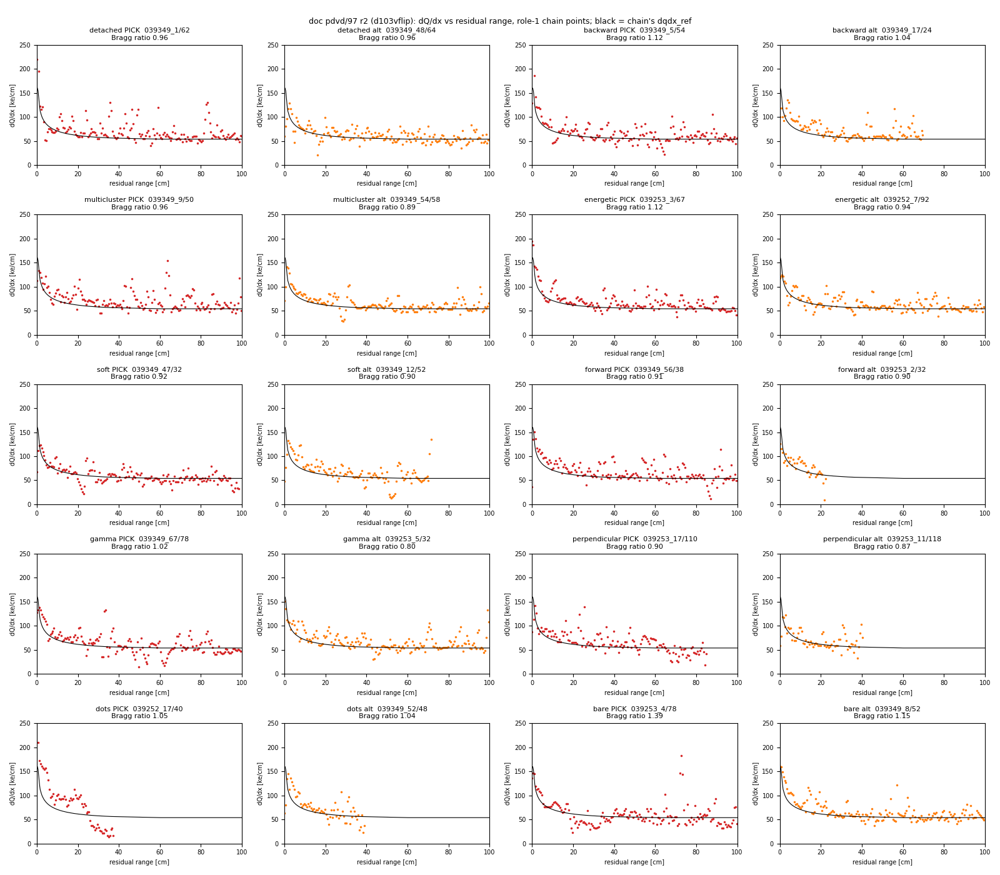
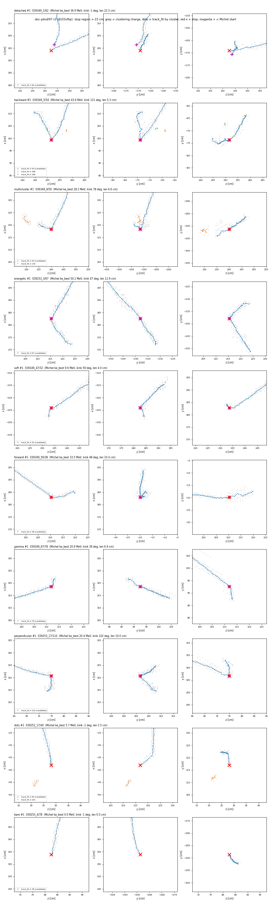
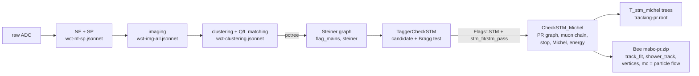
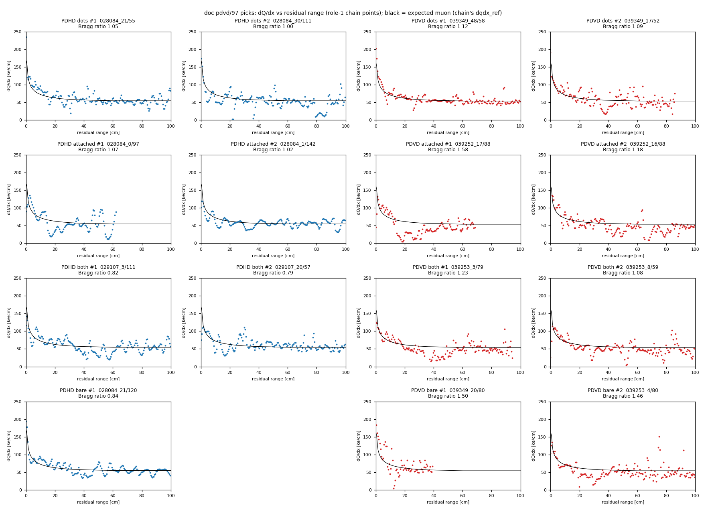
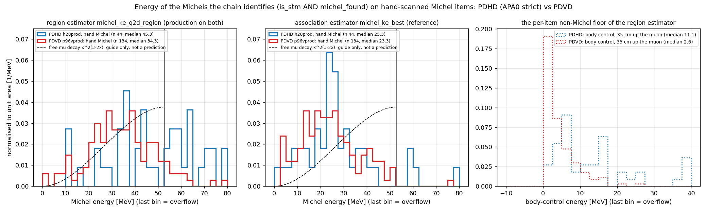

# doc pdvd/97 — STM and STM+Michel selection in PDHD and PDVD: the procedure, Bee showcase events and the numbers for the video

## Round 2 (2026-09-16): the PDVD set rebuilt on the post-flip production, 10 events

**The owner's request (2026-09-16):** trajectory and dQ/dx fitting have improved since round 1, so refresh this doc:
- pick good STM + Michel candidates, not necessarily round 1's;
- show good track trajectories and different Michel-electron situations, from PDVD;
- make new Bee links, and write instructions for them.

**Owner choices** (asked before any pick was made):
- PDVD only;
- all four Michel situations offered: turn angle, detached, Michel + gamma / pieces, energy extremes;
- one no-Michel contrast each: dots and bare.

**Status.** Information and display only. No code or config was changed, and no arm was re-run.
- **Source.** Every Bee event is a verbatim copy of the production `mabc-pr.zip` of `d103vflip`; all 250 members were
  checked sha256-identical to their source.
- **Why this arm.** `d103vflip` is the proof arm of the PDVD trajectory flip (doc pdvd/103 §14, toolkit `8fc6070e`):
  the retile samples with `charge_stepped`, and the fit adds `fit_weight_pow` 1.5 and `assoc_cont_center` 1 (docs
  101–102).
- **Still production.** Its 120 zips are member-for-member sha256-identical to those of `d113vbase`, which ran toolkit
  HEAD `d2777286` with doc 113's knob off. Checked for this round: 120 / 120.
- **Round 1** (§0–§5 below) is kept for the record. Its PDVD set is superseded. Its PDHD set is pre-flip and was not
  rebuilt.

**Answers in one screen:**
- **Bee set:** https://www.phy.bnl.gov/twister/bee/set/d6066b4f-b81a-42c4-bb5f-2bb4765b3429/event/list/
  - 10 events: 8 Michel situations and 2 no-Michel contrasts (§R2).
  - Verified: `event/list/` links events 0–9, and every event's `mc` and `track_fit-global` download at exactly the zip
    member's size, 20 / 20 (`scan/d97r2/bee_sets.txt`).
- **"Good trajectory" is a gate, not a hope** (§R1). It is measured on the candidate's own rows:
  - 0 Bee holes in `stm_fit`;
  - ≤ 5 % of rows more than 1 cm off the charge ridge, on both fits;
  - ≤ 5 % zig-zag rows on `track_fit`.

  Worst values across the 10 picks: 0 holes, 2.9 % off-ridge, 0.4 % zig-zag.
- **How to show them:** §R3 covers the Bee controls, checked against the deployed viewer. §R4 goes event by event.
- **Numbers:** the grades the flips were applied on are in §R5. Round 1's §3 tables are pre-flip and are labelled so.

### R0. Repro

```bash
IMG=/nfs/data/1/xqian/toolkit-dev/wcp-porting-img; X=$IMG/pdvd/docs/nf_sp_img_clus/scripts
# 1. picks, read-only on d103vflip and the committed records
#    -> scan/d97r2/picks.{txt,tsv}, figs/97r2_picks_{dqdx_rr,traj_a,traj_b}.png
python3 $X/d97r2_video_picks.py \
   --skip 039252_13/70,039252_9/103,039253_6/40,039349_10/66,039349_23/56,039349_51/23,039349_53/48,039349_58/55,039349_59/60 \
   > $IMG/pdvd/docs/scan/d97r2/picks.txt; echo rc=$?         # rc=0: every class has a pick and a runner-up
python3 $X/d97r2_stop_closeup.py; echo rc=$?                   # -> figs/97r2_picks_stop_closeup.png
python3 $X/d97r2_view_hints.py > $IMG/pdvd/docs/scan/d97r2/view_hints.txt; echo rc=$?   # (+ view_hints.tsv)
# 2. the Bee zip, with a per-member sha256 check against production
bash $X/d97r2_build_bee.sh; echo rc=$?     # -> /home/xqian/tmp/d97r2/bee-d97r2-pdvd.zip, scan/d97r2/bee-d97r2-pdvd.index.txt
# 3. upload (owner request), then the presence / size check
(mkdir -p /home/xqian/tmp/d97r2/up && cd /home/xqian/tmp/d97r2/up && \
   bash $IMG/pdvd/upload-to-bee.sh /home/xqian/tmp/d97r2/bee-d97r2-pdvd.zip)
python3 $X/d97r2_bee_verify.py https://www.phy.bnl.gov/twister/bee/set/d6066b4f-b81a-42c4-bb5f-2bb4765b3429/event/list/ \
   --uploaded "2026-09-16 (owner request)"; echo rc=$?         # -> scan/d97r2/bee_sets.txt
# 4. d103vflip is still production: every zip member identical to d113vbase (toolkit HEAD d2777286, knob off)
python3 -c 'import glob,hashlib,zipfile as Z
h=lambda p:{n:hashlib.sha256(Z.ZipFile(p).read(n)).digest() for n in Z.ZipFile(p).namelist()}
g=glob.glob("'$IMG'/pdvd/work/*_d103vflip/mabc-pr.zip"); print(sum(h(a)==h(a.replace("d103vflip","d113vbase")) for a in g),"/",len(g))'
```

### R1. How the events were chosen (`scripts/d97r2_video_picks.py`)

The script header is the rule. Its sha256 was recorded before the first run and again at amendment A1
(`scan/d97r2/rule.sha256`).

**Truth.** The folded PDVD precedence the flip was graded on (doc 103 §13) is own103v2 > own103v >
p99rwon_carried_corrected > smx11, read through `d113_grade.truth`.
- **8 of the 10 picks** carry labels scanned on the pre-flip arm `p98vonq` and carried by geometry onto the production
  pctrees (doc 100 round 2's carry, `geometry ok`).
- **The detached and dots picks** come from the verdict-blind `smx11` scan, displayed on `d103v1`, which is identical
  to `d103vflip`.
- **So a quoted scanner sentence describes the display that scanner saw.** Its lengths and MeV can differ from the
  production numbers in the tables.

**Gates on every pick.** The per-class counts are in `scan/d97r2/picks.txt`.

| gate | rule |
|---|---|
| hand | verdict and `michel_kind` as the class needs |
| Q4 | the chain's Bragg-path accept: `is_stm` 1 and `topology_cleared_bits` 0 |
| Q5 | `michel_found` 1 for a Michel class, 0 for a contrast |
| situation | the class definition below, read from the **chain** (`T_stm_michel`) |
| Q6, Q7, Q9 | the zip holds `mc`, `track_fit`, `stm_fit` and `clustering`; the PF subtree holds only mu- / e- / gamma; `michel_ke_best` and every EM node ≤ 52.8 MeV |
| Q8 | the PF shows the class at the stop: Michel radius 15 cm, gamma radius 50 cm, as in round 1 |
| **TRAJ** | on the candidate's own rows in the production zip, split into runs at jumps > 3 cm: (a) `stm_fit` has 0 Bee holes (≥ 3 consecutive q < 0 rows; Bee skips q < 0, doc 110 §2); (b) `stm_fit` and `track_fit` each have ≤ 5 % of rows with ridge offset > 1 cm (doc 111's P1 definition); (c) `track_fit` has ≤ 5 % of rows with chord wiggle > 1 cm (doc 110 §5). **Never relaxed.** |
| Q2 | owner source or `high` confidence → tier 0. Tier 1 (any scanner source) is the only relaxation, as in round 1. |

**Classes, in the pre-registered fill order (rarest first).** A key used by an earlier class, as pick or runner-up, is
not reused. The last column counts the items that pass every gate before that exclusion; tier 0 in brackets.

| class | hand | chain situation | Q8 near the stop | pass (tier 0) |
|---|---|---|---|---|
| detached | STM_MICHEL | `michel_conn_type` 2: nothing graph-connected at the stop; the chain bridges to the nearest piece | a Michel-near EM object | 8 (8) |
| backward | STM_MICHEL, attached | attached, `michel_kink_deg` ≥ 120 | exactly one EM object, Michel-near, not a gamma | 5 (4) |
| multicluster | STM_MICHEL | `michel_n_clusters` ≥ 2 | a Michel-near EM object | 16 (14) |
| energetic | STM_MICHEL | 35 ≤ `michel_ke_best` ≤ 52.8 MeV | a Michel-near EM object | 16 (14) |
| soft | STM_MICHEL | `michel_ke_best` < 15 MeV | a Michel-near EM object | 17 (15) |
| forward | STM_MICHEL, attached | attached, kink < 60° | as backward | 8 (8) |
| gamma | STM_MICHEL, both | `n_michel_gammas` ≥ 1 | round 1's "both" rule | 7 (7) |
| perpendicular | STM_MICHEL, attached | attached, 60° ≤ kink < 120° | as backward | 17 (17) |
| dots | STM_ONLY, detached dots | `michel_found` 0 | a gamma node near | 13 (12) |
| bare | STM_ONLY, none | `michel_found` 0 | no EM object near | 11 (8) |

**Ranking:** tier, then the chain's Bragg ratio (contrast / expected contrast), then owner source, then fewer mu- nodes.
Rank 1 goes to Bee; rank 2 is a recorded runner-up.

**The visual check is the arbiter, and it moved the picks twice.** Every panel was judged by the agent. The owner has
not reviewed these picks. The panels are dQ/dx vs residual range, the trajectory over the charge, and a ±15 cm
close-up of the stop.
- **Round 1 → 2, Bragg rise not clear at the stop:**
  - peak then drop, or no rise: `039349_53/48`, `039349_10/66`, `039252_9/103`, `039252_13/70`;
  - deep dips on the approach: `039349_59/60`, `039349_58/55`;
  - weak rise with dips: `039253_6/40`.
- **Amendment A1** (dated, written before round 2): a pick must show its class's situation at the stop.
  - Detached #1 `039349_23/56` drew its Michel as a near-collinear continuation inside the muon's own cluster, with no
    visible gap (`figs/97r2_closeup_round1.png`).
- **Round 2 → 3:** soft #1 `039349_51/23` was skipped under A1. Its 2.2 cm Michel is not visible at the stop
  (`figs/97r2_picks_stop_closeup_round2.png`).
- **Kept for the record:** `scan/d97r2/picks_round{1,2}.*` and `figs/97r2_picks_*_round{1,2}.png`.


*dQ/dx vs residual range on the chain's muon points (role 1), per class: pick (red) and runner-up (orange). Black is the
chain's own `dqdx_ref`.*


*The ten picks at their stops, ±15 cm, in the three projections. Grey is clustering charge; dots are `track_fit` rows,
coloured by cluster. The red x is the chain's stop and the magenta + its Michel start.*

The whole-muon trajectory panels for picks and runner-ups are `figs/97r2_picks_traj_a.png` and `figs/97r2_picks_traj_b.png`.

### R2. The PDVD set — production `d103vflip`

**Set:** https://www.phy.bnl.gov/twister/bee/set/d6066b4f-b81a-42c4-bb5f-2bb4765b3429/event/list/

**Column notes:**
- **Michel, chain's reading:**
  - kink, length, pieces, clusters and gammas come from `T_stm_michel`;
  - reach, and event/0's turn angle (its chain kink is unmeasured), come from `scan/d97r2/view_hints.tsv`;
  - energy is `michel_ke_best` (the dQ/dx sum) / the region estimator (round 1 §1.3, item 6).
- **Trajectory:** `stm_fit` holes / off-ridge rows > 1 cm; `track_fit` off-ridge rows / zig-zag rows.
- **Volume:** PDVD's top volume is x > 0, the bottom x < 0; the cathode is at x = 0.

| Bee | situation | run_evt / cluster | vol. | hand label (source) | muon | Bragg ratio | Michel, chain's reading | trajectory | PF near the stop |
|---|---|---|---|---|---|---|---|---|---|
| [event/0](https://www.phy.bnl.gov/twister/bee/set/d6066b4f-b81a-42c4-bb5f-2bb4765b3429/event/0/) | **detached** | 039349_1 / 62 | top | STM_MICHEL attached (smx11 agent, high) | 182 cm | 0.96 | bridged across 3.0 cm, reach 23 cm, turns back 128°; 36.9 / 24.9 MeV | 0 / 0.0 %; 2.0 % / 0.0 % | `gamma 36 MeV → e-` pseudo-carrier at the stop |
| [event/1](https://www.phy.bnl.gov/twister/bee/set/d6066b4f-b81a-42c4-bb5f-2bb4765b3429/event/1/) | **backward** | 039349_5 / 54 | top | STM_MICHEL attached (record, high) | 137 cm | 1.12 | attached, kink 121°, 3 pieces, reach 9 cm; 43.6 / 32.2 MeV | 0 / 0.0 %; 0.8 % / 0.0 % | `e- 43 MeV` |
| [event/2](https://www.phy.bnl.gov/twister/bee/set/d6066b4f-b81a-42c4-bb5f-2bb4765b3429/event/2/) | **multicluster** | 039349_9 / 50 | top | STM_MICHEL both (record, high) | 224 cm | 0.96 | attached, kink 78°, 3 pieces from 2 clusters, 1 gamma collected; 28.2 / 25.1 MeV | 0 / 0.6 %; 0.0 % / 0.0 % | `e- 28 MeV` (one node for both clusters) |
| [event/3](https://www.phy.bnl.gov/twister/bee/set/d6066b4f-b81a-42c4-bb5f-2bb4765b3429/event/3/) | **energetic** | 039253_3 / 67 | top | STM_MICHEL attached (owner, smx4) | 158 cm | 1.12 | attached, kink 47°, reach 14 cm; **50.2** / 32.7 MeV | 0 / 0.0 %; 0.7 % / 0.0 % | `e- 50 MeV` |
| [event/4](https://www.phy.bnl.gov/twister/bee/set/d6066b4f-b81a-42c4-bb5f-2bb4765b3429/event/4/) | **soft** | 039349_47 / 32 | bottom | STM_MICHEL attached (record, high) | 98 cm | 0.92 | attached, kink 59°, 4 cm; **9.6** / 19.0 MeV | 0 / 0.0 %; 0.0 % / 0.0 % | `e- 9.64 MeV` |
| [event/5](https://www.phy.bnl.gov/twister/bee/set/d6066b4f-b81a-42c4-bb5f-2bb4765b3429/event/5/) | **forward** | 039349_56 / 38 | top | STM_MICHEL attached (owner, smx4) | 208 cm | 0.91 | attached, kink **48°**, 10 cm; 33.5 / 39.7 MeV | 0 / 0.0 %; 0.0 % / 0.0 % | `e- 33 MeV` |
| [event/6](https://www.phy.bnl.gov/twister/bee/set/d6066b4f-b81a-42c4-bb5f-2bb4765b3429/event/6/) | **gamma** | 039349_67 / 78 | top | STM_MICHEL both (record, high) | 148 cm | 1.02 | attached, kink 39°, 7 cm, **2 gammas collected**; 20.9 / 25.2 MeV | 0 / 2.9 %; 1.8 % / 0.4 % | `e- 20 MeV` at the stop; `e- 4.17 MeV` 41 cm out |
| [event/7](https://www.phy.bnl.gov/twister/bee/set/d6066b4f-b81a-42c4-bb5f-2bb4765b3429/event/7/) | **perpendicular** | 039253_17 / 110 | top | STM_MICHEL attached (record, high) | 85 cm | 0.90 | attached, kink **102°**, 10 cm; 20.4 / 26.3 MeV | 0 / 0.0 %; 0.0 % / 0.0 % | `e- 20 MeV` |
| [event/8](https://www.phy.bnl.gov/twister/bee/set/d6066b4f-b81a-42c4-bb5f-2bb4765b3429/event/8/) | **dots** (contrast) | 039252_17 / 40 | bottom | STM_ONLY detached dots (smx11 agent, high) | 37 cm | 1.05 | no Michel; a 2.5 cm, 5.7 MeV piece 9.8 cm out, which the chain declines as a Michel | 0 / 0.0 %; 0.0 % / 0.0 % | `gamma 5.74 MeV → e-` pseudo-carrier |
| [event/9](https://www.phy.bnl.gov/twister/bee/set/d6066b4f-b81a-42c4-bb5f-2bb4765b3429/event/9/) | **bare** (contrast) | 039253_4 / 78 | top | STM_ONLY none (record, high) | 207 cm | **1.39** | nothing at the stop; region energy 1.1 MeV | 0 / 0.3 %; 0.0 % / 0.0 % | none |

**Runner-ups (not uploaded):** detached `039349_48/64`, backward `039349_17/24`, multicluster `039349_54/58`, energetic
`039252_7/92`, soft `039349_12/52`, forward `039253_2/32`, gamma `039253_5/32`, perpendicular `039253_11/118`, dots
`039349_52/48`, bare `039349_8/52`.
- They pass every gate, and their dQ/dx and ±40 cm trajectory panels were looked at.
- They were not close-up checked.

**Repeats from round 1:** only event/9. It is the same muon as round 1's PDVD event/7: `039253_4/80` on `p96vprod`,
stop (153.9, −288.7, 82.6) against today's (153.9, −288.6, 82.6). The cluster id differs between the two pctree
lineages.

### R3. Viewing in Bee — the controls

These were checked against the deployed viewer, not against the local Bee source docs: its bundle
`/twister/static/js/bee/dist/bee.js` and the event page's "List of Hotkeys", both fetched on 2026-09-16.

**Before you start:** open an event link. `?` shows the hotkey list.

**3-D Imaging folder, the layers.** `1`–`9` select a reco layer, `Esc` unselects, `=` / `-` change opacity, and `+` / `_`
change point size.
- `clustering`: all charge, t0-corrected. The context.
- `track_fit`: the chain's PR fit of the muon and the Michel, coloured by charge.
  - Rows with q < 0 are clamped to 0, so this layer never has holes.
  - **The Bragg rise is the colour change over the last few cm.**
- `stm_fit`: the tagger's own fit.
  - It is unclamped, so Bee drops every row whose charge is below 10 ke (q < 0; doc 110 §2).
  - Every pick here has 0 holes by construction (TRAJ).
- `shower_track`: per point, shower (q 15000) or track (q 0).
- `vertices`: the PR vertices. The main vertex (q 15000) is the muon's entry (round 1 §1.3, item 2).
- Also in the set, and best left off for the video:
  - `stm`: the STM-tagged clusters' charge;
  - `steiner_graph` / `steiner_terminals`: the cloud the trajectory seed walks (docs 111–112);
  - the channel dead areas (Dead Area folder).

**Monte Carlo folder (`m` toggles it): the particle-flow tree**, i.e. the PR graph (round 1 §1.5).
- Ticking a node's checkbox draws that node in 3-D, a line from its start to its end with a sphere at its start.
- Tick the `e-` or `gamma` node to put a marker on the Michel or the dot.
- The inherited cosmetics of round 1 §1.5 still apply: the root reads `reco nu 0.0 MeV`, and the candidate sits in a
  `nu` slot.

**Camera:**
- `x` is Front (YZ), `y` Top (XZ), `z` Side (XY); `r` resets.
- `Shift+Up` / `Shift+Down` zoom.
- The Camera folder's `Origin X/Y/Z (cm)` set the rotation pivot: type the stop from §R4. Double-clicking a point also
  moves the pivot there.
- A single click on a point shows its (x, y, z) and cluster id in the status bar. Use it to confirm you are on the
  candidate's cluster.

**Box of Interest folder (`b` toggles Box Mode):** `x/y/z min/max` crop the display. §R4 gives a ±30 cm box around each
stop.

### R4. Per event: where to look and what to say

Coordinates, boxes and the suggested view key come from `scan/d97r2/view_hints.tsv` (`d97r2_view_hints.py`).
- **The suggested key** is the one whose projection shows the turn at the stop largest.
- **Turn angles** are measured between the muon's last 3–15 cm and the Michel's points. For the attached picks they
  agree with the chain's kink within 5°.
- **Quotes** are from the committed hand record.

- **event/0 — detached** (039349_1/62). Stop (199.0, −169.1, 142.7), top volume. Box x 169..229, y −199..−139,
  z 113..173. Key `y`.
  - **What to show:** the muon arrives mostly along z, descending, and stops. 3 cm away a 23 cm electron leaves upward
    in x, turning back 128°. Nothing graph-connects it to the stop, so the chain bridges the gap, and the PF draws it as
    `gamma 36 MeV → e-`.
  - **Scanner (blind):** "a 23 cm arm … starts 3 cm from the stop vertex and leaves at a large angle … going up in x
    while the muon was coming down".
  - **Caveats:**
    - The scanner notes the stop is 0.7 cm from a CRU seam (y = −168.5) and 7 cm from another, so the gap may be the
      seam.
    - The rubric kind is `attached`; "bridged" is the chain's reading.
    - The rise is in the last ~3 cm only ("ragged … but the end does climb").
    - The energy estimators disagree: 36.9 vs 24.9 MeV.
- **event/1 — backward** (039349_5/54). Stop (99.4, −73.7, 251.6). Box 69..129, −104..−44, 222..282. Key `y`.
  - **What to show:** a hook. The electron turns back 121° from the muon's direction and reaches 9 cm. Bragg ratio 1.12.
  - **Scanner:** "A kinked arm leaves within 2-4 cm of the stop … a second particle, the Michel". The scanner's "departs at a
    clear angle (roughly 60-90 deg) from the muon line" was read from the line in 2-D views, not from the direction, so
    it does not contradict the 121° turn.
  - **Caveat:** the chain builds this Michel from 3 pieces, and the energy estimators read 43.6 vs 32.2 MeV.
- **event/2 — Michel in two clusters** (039349_9/50). Stop (118.3, −291.3, 240.1). Box 88..148, −321..−261, 210..270.
  Key `y`.
  - **What to show:** the Michel leaves at 78° and continues into a second 3-D cluster, reaching 12 cm in 3 pieces. The
    chain assembles both clusters, and the PF draws them as one `e- 28 MeV`.
  - **Scanner:** "The profile hugs the muon reference curve all the way to 1.5e5 -- as clean a Bragg as this sample has".
  - **Hand kind `both`:** gamma dots 42 and 52 cm out.
- **event/3 — energetic** (039253_3/67). Stop (182.6, −237.9, 215.5). Box 153..213, −268..−208, 186..246. Key `y`.
  - **What to show:** a 13 cm electron at 47°, and a clean rise to ~190 ke/cm (Bragg ratio 1.12). Owner-labelled
    (smx4, no text).
  - **Say:** "the dQ/dx sum reads 50 MeV, near the 52.8 MeV endpoint". Do not say "a 50 MeV electron": the region
    estimator reads 32.7 MeV, and neither is calibrated against truth.
- **event/4 — soft** (039349_47/32). Stop (−324.1, 182.8, 233.7), bottom volume, 16 cm from the anode. Box
  −354..−294, 153..213, 204..264. Key `z`.
  - **What to show:** a 4 cm, 9.6 MeV electron at 59°. Zoom in: it is short.
  - **Scanner:** "a textbook Bragg … a short blue arm leaving the amber band at the star vertex at a wide angle …
    attached, no gap". That display read the arm as 5.4 cm and 12.7 MeV.
  - **Caveat:** the dQ/dx panel has a short dip about 22 cm before the stop.
- **event/5 — forward** (039349_56/38). Stop (183.0, −19.8, 210.4). Box 153..213, −50..10, 180..240. Key `y`.
  - **What to show:** the muon comes down and a 10 cm, 33.5 MeV electron carries on at only 48°. This is the case the
    chain's continuation test must separate from a muon still going (round 1 §1.3, item 5). Owner-labelled (smx4).
- **event/6 — Michel + gammas** (039349_67/78). Stop (318.6, 92.6, 112.0), 21 cm below the top anode. Box 289..349,
  63..123, 82..142. Key `x`.
  - **What to show:** a 7 cm, 20.9 MeV Michel at 39°, plus the gamma pieces the chain collected in its 50 cm ring. The
    PF shows `e- 20 MeV` at the stop and `e- 4.17 MeV` 41 cm out.
  - **Scanner:** "two detached 2-point specks … at 29.1 cm … and … at 48.5 cm … clustered on the decay side … Michel plus
    gammas gives kind both".
  - **Caveats:**
    - The specks are tiny: raise the point size (`+`).
    - This event has the set's worst trajectory numbers (2.9 % of `stm_fit` rows > 1 cm off the ridge), still inside
      the gate.
- **event/7 — perpendicular** (039253_17/110). Stop (320.7, 301.7, 75.0). Box 291..351, 272..332, 45..105. Key `y`.
  - **What to show:** the textbook picture. An 85 cm muon with a clean rise, and a 10 cm electron at 102°.
  - **Scanner:** "the amber muon body ends at the star and a separate teal-green arm runs off it sideways".
- **event/8 — dots, no Michel** (039252_17/40). Stop (−38.1, 117.0, 28.2), bottom volume, just below the cathode (x = 0).
  Box −68..−8, 87..147, −2..58. Key `y`.
  - **What to show:** a 37 cm muon (it crossed the cathode; its upper part is another cluster) with a rise to ~210
    ke/cm. A 2.5 cm, 5.7 MeV piece sits 9.8 cm away across a gap. The chain declines it as a Michel
    (`michel_found` 0), and the PF draws it as `gamma 5.74 MeV → e-`.
  - **Scanner:** "separated from the end by a visible charge-free gap … A detached compact piece at about 10 cm with a
    clean gap reads as a dot: gamma."
  - **Caveat, in the scanner's own note:** the piece "is on the michel/gamma attachment boundary … As michel it would
    make this STM_MICHEL/attached".
- **event/9 — bare, no Michel** (039253_4/78). Stop (153.9, −288.6, 82.6). Box 124..184, −319..−259, 53..113. Key `z`.
  - **What to show:** nothing at the stop (region energy 1.1 MeV), and the best Bragg ratio of the set (1.39).
    Consistent with μ⁻ capture.
  - **Scanner:** "the highest two points in the entire profile are the two nearest the origin … no arm, no dot, no
    speck".

### R5. Numbers after the flips

**Round 1's §3 tables were measured before the trajectory flips**: PDVD on `p93vprod` / `p96vprod`, PDHD on `h28prod`.
The table below gives the grades the flips were applied on.

| detector | metric | before (A0) | after (A1 = production) | source |
|---|---|---|---|---|
| PDVD | `is_stm` purity | 0.980 (239 TP / 5 FP) | **0.982** (266 / 5) | `figs/103_own103v2_pdvd.txt`:41 |
| PDVD | `is_stm` efficiency | 0.611 (239 / 391) | **0.680** (266 / 391) | :41 |
| PDVD | Michel purity | 0.924 (157 / 13) | **0.940** (171 / 11) | :45 |
| PDVD | Michel efficiency | 0.657 (157 / 239) | **0.715** (171 / 239) | :45 |
| PDHD | `is_stm` purity | 0.975 | **0.959** | doc 108 §1.1 (:51) |
| PDHD | `is_stm` efficiency | 0.626 | **0.616** | :52 |
| PDHD | Michel purity | 0.914 | **0.880** | :53 |
| PDHD | Michel efficiency | 0.604 | **0.689** | :54 |

**Caveats:**
- **Population.** It is the judged items that are candidates of either arm (doc 103's union population, on the folded
  records). That is a different population and record than §3's (doc pdhd/26 on smx27 / smx1a…smx9). The efficiency
  denominators include hand stoppers only one arm hands on, so they are lower than §3's. **Do not compare numbers
  across the two tables.**
- **PDVD.** The production arm `d103vflip` equals the graded `d103v1` on all 198 branches of `T_stm_michel` (doc 103
  §14.2). The reading is D1 (doc 103 §13.2).
- **PDHD.** `d108hflip` reproduces `d102hcs` on all four STM trees (doc 108 §3). The Michel purity change of −0.035 is a
  D2 that the owner overrode (doc 108 §1.1).
- **Not restated after the flips:**
  - the Michel energy distributions (§3.3);
  - dQ/dx vs residual range (§3.4). On PDHD the flip moved the absolute stopping-muon dQ/dx scale (`plateau_med` +3.8 %
    at p50, doc 108 §1.2).

### R6. What round 2 does not claim

- **The ten events are illustrations, not a sample.** They were chosen for trajectory quality, a situation visible at
  the stop, and a clean PF.
- **The situation labels are the chain's reading.** Connection type, kink, clusters, gammas and energy come from the
  chain, not from hand truth; the hand record gives only verdict + `michel_kind`. The detached pick's hand kind is
  `attached`.
- **The visual skips were the agent's judgement,** recorded above with reasons. The owner has not reviewed the ten picks.
- **No energy is calibrated.** On these picks the two estimators differ by up to 17.5 MeV (event/3).
- **Scanner quotes describe the display that scanner saw:** the pre-flip `p98vonq` for 8 of the 10.
- **Bee numbers events by upload order.** `scan/d97r2/bee-d97r2-pdvd.index.txt` is the map.

### R7. Files (round 2)

| path | what |
|---|---|
| `scripts/d97r2_video_picks.py` | the rule, including amendment A1, and the pick / figure code; imports round 1's PF helpers without changing them |
| `scripts/d97r2_stop_closeup.py` | the ±15 cm stop close-ups |
| `scripts/d97r2_view_hints.py` | stop, box, suggested view key, turn angle, PF near the stop |
| `scripts/d97r2_build_bee.sh` | builds the zip from `picks.tsv` rank 1 and checks every member against production |
| `scripts/d97r2_bee_verify.py` | the uploaded set's event list and layer sizes against the zip |
| `../scan/d97r2/picks.{txt,tsv}` | final picks (round 3); `picks_round{1,2}.*` are the earlier rounds |
| `../scan/d97r2/rule.sha256` | the rule's sha256 before the first run and at A1 |
| `../scan/d97r2/view_hints.{txt,tsv}` | the per-event hints of §R4 |
| `../scan/d97r2/bee-d97r2-pdvd.index.txt`, `bee_sets.txt` | Bee event index; the uploaded set URL and its size check |
| `figs/97r2_picks_{dqdx_rr,traj_a,traj_b,stop_closeup}.png` | the visual checks (+ `_round{1,2}`), and `97r2_closeup_round1.png` behind A1 |

---

**Round 1 (2026-09-13) follows. It is unchanged except for the round-2 flags in its status, §0, §2.2, §2.3 and §3.**

**The owner's request (2026-09-13):** a video illustrating stopping-muon (STM) and STM+Michel identification in PDHD
and PDVD. The request asked for:
1. the general reconstruction and selection steps, with code citations;
2. Bee links for both detectors, all with a clear Bragg peak, covering:
   - STM + dots;
   - STM + a Michel seen as a single track;
   - STM + a Michel track plus additional isolated energy;
3. particle flow (PF) in those Bee sets, updated if missing;
4. the Michel efficiency, purity and energy-spectrum numbers, cited from the existing docs.

Owner choices: one Bee set per detector, 2 events per class, and a fourth class, bare STM (nothing at the stop).

**Status.** Information and display only.
- No code or config was changed, and no arm was re-run.
- Every Bee event is a verbatim copy of the production `mabc-pr.zip`: PDHD `h28prod` (doc pdhd/28), PDVD `p96vprod`
  (doc pdvd/96). Each member was checked sha256-identical to its source.
- The doc lives in `nf_sp_img_clus/` because the STM/Michel series (docs pdvd/25–96) lives there.
- **Round-2 flag (2026-09-16):** both sets are pre-flip.
  - PDVD: superseded by §R2.
  - PDHD: not rebuilt, by owner choice. Its source arm `h28prod` is no longer on disk.

**Answers in one screen:**
- **PF (item 3):** already inside production. Both production chains run `CheckSTM_Michel`, which publishes the PR graph
  as Bee's `mc` particle-flow tree, rooted at the muon's **entry** point (§1.5). Nothing needed updating. What was
  missing was a Bee set of STM+Michel events: none existed on either detector.
- **Bee sets (item 2):** §2. PDVD fills all 4 classes × 2. PDHD fills 7 of 8: the bare-STM class has one showcase-grade
  event. That is reported, not filled by relaxing a rule (§2.1).
- **Numbers (item 4):** §3. Every number sits in the same row as its caveat.

## 0. Repro

```bash
IMG=/nfs/data/1/xqian/toolkit-dev/wcp-porting-img; X=$IMG/pdvd/docs/nf_sp_img_clus/scripts
# 1. picks (read-only on the arms and the committed hand records) -> scan/d97/picks.{txt,tsv}, figs/97_picks_dqdx_rr.png
# round-2 flag (2026-09-16): pdhd/work/*_h28prod is no longer on disk, so steps 1-2 cannot be re-run for PDHD as written
python3 $X/d97_video_picks.py \
   --skip pdhd:028084_26/109,pdhd:029107_3/107,pdhd:029107_26/88,pdhd:028084_26/115,pdhd:028084_17/97,pdhd:028084_18/104 \
   > $IMG/pdvd/docs/scan/d97/picks.txt; echo rc=$?      # rc=3 by design: PDHD bare has 1 of 2 (sec 2.1)
# 2. one Bee zip per detector + per-member sha256 check against the production zips
bash $X/d97_build_bee.sh; echo rc=$?                    # -> /home/xqian/tmp/d97/bee-d97-{pdhd,pdvd}.zip, scan/d97/bee-d97-*.index.txt
# 3. upload (owner-authorised), then check each set's event/list/ and that every event's mc / track_fit layer
#    downloads at exactly the zip member's size (an HTTP 200 alone proves nothing on Bee)
(cd /home/xqian/tmp/d97/up-pdhd && bash $IMG/pdvd/upload-to-bee.sh /home/xqian/tmp/d97/bee-d97-pdhd.zip)
(cd /home/xqian/tmp/d97/up-pdvd && bash $IMG/pdvd/upload-to-bee.sh /home/xqian/tmp/d97/bee-d97-pdvd.zip)
```

Numbers in §3 are quoted from committed docs and not recomputed here. Each carries its doc, section and line.

---

## 1. The procedure, in pipeline order



Line numbers are at toolkit `apply-pointcloud` HEAD `f516b013`. `TK` = `toolkit/`, `WPI` = `wcp-porting-img/`.

### 1.1 What "production" runs
The PR job is `WPI/<det>/run_pr_evt.sh -nu -stm-fit`.
- `-nu` selects `PIPE_NU` (`pdhd/run_pr_evt.sh:129`, `pdvd/run_pr_evt.sh:130`), whose tail is
  `…,tagger_check_stm,…,steiner_refresh,check_stm_michel,tracking_visitor,pr_display`.
- The default `-stm` pipeline (`pdhd:123`, `pdvd:135`) stops after the cosmic taggers. It writes **no** particle flow
  and never runs the Michel stage.
- `CheckSTM_Michel` anchors on the tagger's persisted fit (`save_stm_fit`, which the runner turns on by default).
  `-stm-fit` only adds the `tracking-stm.root` dump of that fit (`T_stm_pass` / `T_stm_eval`; runner usage comment
  `pdhd/run_pr_evt.sh:46`, `pdvd/run_pr_evt.sh:62`).
- Upstream: `wct-nf-sp.jsonnet` → `wct-img-all.jsonnet` → `wct-clustering.jsonnet` (clustering + Q/L matching). The
  pctree is handed to the PR job.

### 1.2 Candidate: `TaggerCheckSTM` (`TK/clus/src/TaggerCheckSTM.cxx`)
A port of the prototype's `check_stm` (`pid/src/ToyFiducial.cxx:405`); the prototype citations are in the file header.
- **Who is evaluated.** Main clusters in scope. Mains already tagged through-going (TGM) are skipped (`:602`).
  `check_stm_conditions` runs at `:627` and sets `Flags::STM` at `:631`.
- **`check_stm_conditions` (`:3574`).** Its steps, in order:
  1. **Not fully contained.** `cluster_fc_check` (`:3591`) runs on the Steiner boundary points; a fully contained cluster is not a stopping muon.
  2. **Exactly one boundary exit.** The one-exit logic follows. A double-ended cluster also tries the backward direction.
  3. **Trajectory and dQ/dx fit.** A rough path over the Steiner graph, then a two-round `TrackFitting` fit.
  4. **Where it stops.** `find_first_kink` (`:1602`) splits the fitted track into the muon and whatever is left beyond the kink.
  5. **The Bragg test.** `eval_stm_core` (`:3026`) runs over several windows (`:3904-3913`: 5 cm or 40 cm − leftover
     peak window, 0 or 3 cm offset, 35 or 15 cm compare range; these match the prototype's `eval_stm`). It compares the
     dQ/dx profile against residual range with a KS-like test, against the muon dE/dx table (`:2936`) and against a flat MIP.
  6. **Other tracks and protons.** `search_other_tracks` (`:3079`), `check_other_tracks` (`:3423`), `detect_proton`
     (`:1959`). A stopping proton is not a muon.
- **Persisted.** With `save_stm_fit` the fit is written as the `stm_fit` / `stm_pass` point clouds (`persist_stm_fit`,
  called at `:650`). These are the Bee layers `stm_fit` / `stm`, and the input the next stage anchors on.

### 1.3 Reconstruction around the candidate: `CheckSTM_Michel` (`TK/clus/src/CheckSTM_Michel.cxx`)
The design header is at `:1-42`; configured through `cm.check_stm_michel` (`TK/cfg/pgrapher/common/clus.jsonnet:404`, design
note `:389-403`), bound in `pdhd/pr.jsonnet:1692` / `protodunevd/pr.jsonnet:1706`. **The full walkthrough is doc pdvd/52**;
this is the video-length version.

1. **Anchor** (`read_stm_anchor`, `:1518`). Entry = the tagger fit's first row; stop = the kink row.
2. **Pattern recognition on the candidate and its companions** (`visit`, `:2593`):
   - `find_proto_vertex` (`:2740`) → `separate_track_shower` (`:2744`) → direction;
   - the PR main vertex is set to the **entry** (`set_main_vertex`, `:2800`), then `examine_direction` (`:2806`).
3. **The muon = a shortest path** from entry to stop, weighted by segment length (`stm_michel_shortest_chain`, call
   `:2811`, `StmMichelFunctions.cxx:117`).
   - A delta ray is a spur off that path, so it is excluded by construction (doc pdvd/52 §4.1).
4. **The Bragg peak at the stop** (`stm_michel_bragg_contrast`, call `:2863`, `StmMichelFunctions.cxx:312`). This is the
   stop-local contrast the showcase ranks on (§2.1). The stop can move: retreat, split and wide-anchor knobs (doc pdvd/52 §1.6,
   docs pdvd/57-58, 92-93).
5. **The Michel = an arm at the stop vertex** (`stm_michel_classify_stop_arm`, call `:2875`,
   `StmMichelFunctions.cxx:608`).
   - Continuation (a muon still going) is tested first.
   - A Michel needs a **turn** (kink ≥ 30°, or shower-like with ≥ 15°), MIP-like charge and a reach ≤ 25 cm (doc pdvd/52 §2).
   - Pieces not attached to the stop are admitted as dots within the Michel radius (15 cm, `michel_dot_radius_cm`).
   - Pieces in a ring beyond that are candidate capture gammas (doc pdvd/52 §5). Gamma collection is on in both
     production bags, with `michel_gamma_radius_cm` 50.0 (`pdhd/wct-pr-perevt.jsonnet:293`,
     `pdvd/wct-pr-perevt.jsonnet:406`; C++ default 35, doc pdvd/71 §11).
   - `michel_found` = a Michel connection exists (`:4474`).
6. **Michel energy.** Two estimators are written.
   - `michel_ke_best`: the dQ/dx → dE/dx sum over the assembled Michel, plus MIP-equivalent charge for unfitted pieces.
     It is computed once by `calculate_shower_kinematics` (`:4351`) and stamped back with `set_kine_best` (`:4359`), which is also what Bee's PF label prints.
   - The **region** energy (`michel_q2d_estimate`, `:1789`): all 2-D charge within 10 cm of the stop, minus the charge
     the muon fit predicts there (docs pdvd/95-96). On PDHD the wrapped-wire lookup is on (`michel_q2d_region_wire_lookup`,
     `pdhd/wct-pr-perevt.jsonnet:446`, doc pdhd/28).
7. **Verdict.** `is_stm = (reject_bits == 0)` (`:2357`). The reject-bit names are at `:1504-1507`: `no_chain`,
   `stop_unmatched`, `no_bragg`, `shape_flat`, `not_muon_pid`, `continuation`, `stop_near_boundary`, `vertex_hadron`, … .
   **Michel presence is not a criterion**, because a μ⁻ can be captured.
   - Every verdict input is written to `T_stm_michel` / `T_stm_michel_pts` / `T_stm_michel_2d` in `tracking-pr.root`.

### 1.4 The production knob bags
Both detectors run their own `stm_michel_knobs` bag in `WPI/<det>/wct-pr-perevt.jsonnet`; everything else runs at the C++
defaults. The PDHD/PDVD differences are the ones graded on each detector's own hand scan:
- **PDHD:** `ks_margin` −0.10, plateau MIP window to 1.6, `topology_michel_ke_min` 5 / `_len_min_cm` 1.5, and the
  region wire-lookup fix. Docs pdhd/21–28.
- **PDVD:** `ks_margin` −0.02, plateau window to 2.0, `compare_range_cm` 45, `absorb_bragg_stub`, and the
  moved-stop Michel guard. Docs pdvd/57–96.

The per-knob history is in those docs. Doc pdhd/26 §1.1 tabulates the shared region-energy keys.

### 1.5 Particle flow: how the Bee `mc` tree is formed
There is no separate PF structure: **the PF is the PR graph** (doc pdvd/52 §7).
- `CheckSTM_Michel` publishes each candidate's fitter and graph in the slots the neutrino chain uses (`"nu"` slot,
  `:4705`).
- The PR `MultiAlgBlobClustering` node's `bee_pf` entry named `mc` (`pdhd/pr.jsonnet:2323-2325`,
  `protodunevd/pr.jsonnet:2340-2342`) walks it with `fill_bee_pf_tree` (`MultiAlgBlobClustering.cxx:1354`), starting at
  the entry vertex and going through the muon segments.
- Node ids are `cluster_id*1000 + segment_id`.
- A bridged Michel or a capture gamma is drawn through a synthesised **`gamma → e-` pseudo-carrier** (doc pdvd/52 §7.4).
  This is how dots appear in the PF.
- Leaves below `em_ke_min` = 0.2 MeV are pruned (`:399`, `keep_node` `:2185`).

**Cosmetics a viewer will see, inherited and unchanged:**
- the PF root reads `reco nu 0.0 MeV (no BDT scores)`;
- each cosmic candidate sits in a slot labelled `nu`;
- an STM chain can carry delta-ray `e-` leaves along the muon;
- a long muon is drawn as a chain of `mu-` nodes, one per PR segment, and each node's MeV is that segment's own share.

---

## 2. Bee showcase sets

**Layers to switch on:**
- `clustering` (all charge, t0-corrected);
- `track_fit` (the fitted trajectory, coloured by dQ/dx — the Bragg rise is visible here);
- `shower_track` (track vs shower, per particle);
- `vertices`;
- `mc` (the particle-flow tree panel);
- `stm_fit` (the tagger's own fit).

PDHD also has `stm_tagged`.

**Not included:**
- **`img-global`.** It is in the raw drift frame and draws 50–60 cm from the fitted muon on a cosmic (measured on
  028084_0/97 and 039252_17/88), because clustering applies a per-bundle t0 and imaging does not. `clustering` already
  shows the same charge in the right place.
- **`op`.** Its cluster ids live in the clustering job's id space.

Bee numbers events by upload order. The tables give `event/<i>/` for each.

### 2.1 How the events were chosen (`scripts/d97_video_picks.py`)
**Truth and pool:**
- Hand verdicts come from the committed records: PDHD `pdhd/docs/scan/pdhd_stm_michel_smx27_verdicts.json` (owner
  precedence) and PDVD's merged smx1a…smx9 record.
- The truth join is the committed one in `d25_bragg_michel.py`.
- PDHD is APA0-strict, as in every PDHD headline.

**Class definitions** (rubric `michel_kind`):

| class | hand verdict | the PF must show, near the chain's stop |
|---|---|---|
| **STM + dots** | STM_ONLY, `detached dots` | a `gamma → e-` pseudo-carrier within 50 cm |
| **STM + Michel, single track** | STM_MICHEL, `attached` | exactly one EM object within 50 cm, within 15 cm, not a gamma |
| **STM + Michel + isolated energy** | STM_MICHEL, `both` | a Michel within 15 cm, plus a second EM object within 50 cm or a Michel built from ≥ 2 clusters |
| **bare STM** | STM_ONLY, `none` | no EM object within 50 cm |

**Every pick also satisfies:**
- owner source or `high` confidence (tier 0; one relaxation, any scanner source, was allowed);
- the chain accepts it **on its own Bragg reading** (`is_stm = 1`, `topology_cleared_bits = 0`);
- the chain's `michel_found` agrees with the hand class;
- no `e-`/`gamma` in its PF reads above the 52.8 MeV decay endpoint, and `michel_ke_best` ≤ 52.8 MeV.

**Ranking:** by the chain's Bragg contrast / expected contrast, then owner source, then a shorter PF.

**The dQ/dx vs residual-range panel of every pick was looked at,** and a pick without a clear rise at the stop was
skipped and recorded:


*dQ/dx vs residual range on the chain's muon points for every pick; black = the expected muon curve (each chain's own
`dqdx_ref`). The rows are the four classes; PDHD's bare #2 is empty (below).*

**How the picks moved, kept for the record** (`scan/d97/picks_round{1,2,3}.*`, `figs/97_picks_dqdx_rr_round{1,2,3}.png`):
- **Round 1: the Bragg contrast ratio did not match the eye on PDHD.** Four PDHD picks had no visible rise:
  - `028084_26/109`, `029107_3/107` (both);
  - `029107_26/88`, `028084_26/115` (bare).

  On PDVD every top-ranked panel was clean. The contrast tracks visual clarity well on PDVD (bare #1 ratio 1.50,
  textbook) and poorly on PDHD (bare #1 ratio 1.17 was the worst panel of its class). This is the same Bragg-read gap
  doc pdhd/25 §2 measured (golden 0.524 vs 0.671).
  - A profile shape metric was tried to replace the eye and did **not** separate the four from the accepted twelve, so it was not used.
- **Round 1 → 2, class-rule correction.** "A gamma node in the PF" was satisfied for `both` by the bridged Michel alone,
  so Q8 was restated per class.
- **Round 2 → 3, class-rule correction.** Counting EM objects anywhere let delta rays hundreds of cm upstream satisfy `both`
  (`028084_23/51`, `028084_17/97`). Q8 was tied to the stop, with the chain's own 15 / 50 cm radii. Two more PDHD
  panels were skipped: `028084_17/97` (deep dips), `028084_18/104` (no rise).
- **Round 3 → 4.**
  - The pre-registered fallback's tier 2 (drop the class rule) was withheld for every class: it had filled PDHD bare #2
    with 4 EM objects at the stop.
  - A PDHD `both` pick whose PF carried an `e-` chain to 163 MeV (`029107_16/106`) was excluded by the endpoint rule.
- **Result: PDHD bare STM has one showcase-grade event.** Of its 10 hand items, 5 pass the chain's Bragg path, 4 show a
  bare stop in the PF, and 3 of those failed the visual check.

**Evidence text.** The "hand scan" quotes below are excerpts of the committed records' `evidence` field, and the source
column says who wrote them.
- On every PDHD pick the quoted text is the blind **agent** scan's, even where the verdict source is `owner`: the owner's
  ruling there confirmed the verdict without new prose.
- PDVD's record text was written by that record's scanners.

### 2.2 PDHD — production `h28prod`

**Round-2 flag (2026-09-16):** this set is **pre-flip**. `h28prod` predates doc 108's PDHD trajectory flip. It was not
rebuilt, by owner choice, and its source arm is no longer on disk.

**Set:** https://www.phy.bnl.gov/twister/bee/set/c75d14ee-07ae-4ebb-bcaf-1cb2b8451a55/event/list/

The set is verified: its `event/list/` lists events 0–6, and every event's `mc` and `track_fit-global` download at exactly the zip member's
size, 14/14 (`scan/d97/bee_sets.txt`).

| Bee | class | run_evt / cluster | verdict source | muon | Bragg ratio | Michel `michel_ke_best` | particle flow (`mc`) |
|---|---|---|---|---|---|---|---|
| [event/0](https://www.phy.bnl.gov/twister/bee/set/c75d14ee-07ae-4ebb-bcaf-1cb2b8451a55/event/0/) | STM + dots #1 | 028084_21 / 55 | agent, high | 180 cm | 1.05 | — | 6 `mu-` segments → `gamma 0.42 MeV → e-` at the stop (+ a 19 MeV `e-` 107 cm upstream = delta ray) |
| [event/1](https://www.phy.bnl.gov/twister/bee/set/c75d14ee-07ae-4ebb-bcaf-1cb2b8451a55/event/1/) | STM + dots #2 | 028084_30 / 111 | owner | 144 cm | 1.00 | — | 8 `mu-` segments → `gamma 1.01 MeV → e-` at the stop, `e- 7.27 MeV` 9 cm from it |
| [event/2](https://www.phy.bnl.gov/twister/bee/set/c75d14ee-07ae-4ebb-bcaf-1cb2b8451a55/event/2/) | Michel, single track #1 | 028084_0 / 97 | owner | 62 cm | 1.07 | 30.5 MeV | `mu- 164 → mu- 19 → e- 30 MeV` |
| [event/3](https://www.phy.bnl.gov/twister/bee/set/c75d14ee-07ae-4ebb-bcaf-1cb2b8451a55/event/3/) | Michel, single track #2 | 028084_1 / 142 | owner | 201 cm | 1.02 | 31.2 MeV | `mu- 469 → e- 31 MeV` |
| [event/4](https://www.phy.bnl.gov/twister/bee/set/c75d14ee-07ae-4ebb-bcaf-1cb2b8451a55/event/4/) | Michel + isolated #1 | 029107_3 / 111 | agent, high | 330 cm | 0.82 | 39.8 MeV (Michel from 2 clusters) | `mu- 127 → mu- 336 → mu- 352 → e- 39 MeV` |
| [event/5](https://www.phy.bnl.gov/twister/bee/set/c75d14ee-07ae-4ebb-bcaf-1cb2b8451a55/event/5/) | Michel + isolated #2 | 029107_20 / 57 | agent, high | 111 cm | 0.79 | 21.7 MeV | `mu- 273 → e- 21 MeV` + `e- 8.26 MeV`, both at the stop |
| [event/6](https://www.phy.bnl.gov/twister/bee/set/c75d14ee-07ae-4ebb-bcaf-1cb2b8451a55/event/6/) | bare STM #1 | 028084_21 / 120 | agent, high | 348 cm | 0.84 | — | `mu- 54 → mu- 356 → mu- 437`; two delta `e-` 170–310 cm upstream, nothing at the stop |

**Events 0 and 6 are the same readout (028084_21), with different muons** (clusters 55 and 120). Find each by its
cluster id, or by the stop:
- event 0 stops at (−31.6, 542.7, 334.4) cm;
- event 6 stops at (270.9, 286.9, 209.4) cm.

Stops of the others, for navigation, from `scan/d97/picks.tsv`:
- 028084_30/111 (336.2, 498.2, 356.8);
- 028084_0/97 (24.0, 548.4, 53.6);
- 028084_1/142 (51.6, 408.8, 302.5);
- 029107_3/111 (93.2, 177.7, 313.9);
- 029107_20/57 (−44.9, 530.1, 269.8).

What to show, from the hand-scan evidence:
- **event/1:** the recorded description is "a textbook Bragg rise over the last ~2 cm (1.06e5 → 1.23e5 → 1.52e5 → 1.63e5 →
  1.75e5 at the last point)". A 1 MeV capture-gamma dot follows the stop.
- **event/2:** a short 62 cm muon that "climbs over the last ~8 cm to 1.35e5 … along the muon reference curve", with a 30 MeV
  Michel attached at the stop. The shortest of the PDHD picks, the easiest to frame.
- **event/3:** "a real rise … about 2x plateau over the last 2–3 cm" then one attached 31 MeV electron. The cleanest PDHD PF
  (two nodes).
- **event/5:** a Michel plus a second 8 MeV electron piece at the stop, the "track + isolated energy" picture on a short
  111 cm muon.

**PDHD caveat for the camera:** PDHD's Bragg read is noisier than PDVD's. Its picks rank 0.79–1.07 against PDVD's
1.08–1.58, and doc pdhd/25/26 measure the same gap in the chain's golden fraction.

### 2.3 PDVD — production `p96vprod`

**Round-2 flag (2026-09-16): superseded by §R2.** This set shows the pre-flip PDVD trajectory: `p96vprod` predates doc
103's flip.

**Set:** https://www.phy.bnl.gov/twister/bee/set/b2c9c178-7515-4f47-8796-b2698a652dea/event/list/

The set is verified: its `event/list/` lists events 0–7, and every event's `mc` and `track_fit-global` download at exactly the zip member's
size, 16/16 (`scan/d97/bee_sets.txt`).

| Bee | class | run_evt / cluster | verdict source | muon | Bragg ratio | Michel `michel_ke_best` | particle flow (`mc`) |
|---|---|---|---|---|---|---|---|
| [event/0](https://www.phy.bnl.gov/twister/bee/set/b2c9c178-7515-4f47-8796-b2698a652dea/event/0/) | STM + dots #1 | 039349_48 / 58 | record, high | 265 cm | 1.12 | — | 3 `mu-` → `gamma 0.51 MeV → e-` at the stop (+ `e- 13 MeV` 7 cm from the stop) |
| [event/1](https://www.phy.bnl.gov/twister/bee/set/b2c9c178-7515-4f47-8796-b2698a652dea/event/1/) | STM + dots #2 | 039349_17 / 52 | record, high | 86 cm | 1.09 | — | `mu- 222 → gamma 2.06 MeV → e-` |
| [event/2](https://www.phy.bnl.gov/twister/bee/set/b2c9c178-7515-4f47-8796-b2698a652dea/event/2/) | Michel, single track #1 | 039252_17 / 88 | record, high | 68 cm | **1.58** | 24.5 MeV | `mu- 185 → e- 24 MeV` |
| [event/3](https://www.phy.bnl.gov/twister/bee/set/b2c9c178-7515-4f47-8796-b2698a652dea/event/3/) | Michel, single track #2 | 039252_16 / 88 | record, high | 305 cm | 1.18 | 21.4 MeV | `mu- 702 → e- 21 MeV` |
| [event/4](https://www.phy.bnl.gov/twister/bee/set/b2c9c178-7515-4f47-8796-b2698a652dea/event/4/) | Michel + isolated #1 | 039253_3 / 79 | record, high | 94 cm | 1.23 | 14.9 MeV | `mu- 239 → gamma 14 MeV → e-` + `e- 9.63 MeV`, both at the stop |
| [event/5](https://www.phy.bnl.gov/twister/bee/set/b2c9c178-7515-4f47-8796-b2698a652dea/event/5/) | Michel + isolated #2 | 039253_8 / 59 | record, high | 281 cm | 1.08 | 51.0 MeV (Michel from 2 clusters) | `mu- 529 → mu- 149 → e- 51 MeV` + `e- 5.25 MeV` 50 cm out |
| [event/6](https://www.phy.bnl.gov/twister/bee/set/b2c9c178-7515-4f47-8796-b2698a652dea/event/6/) | bare STM #1 | 039349_20 / 80 | record, high | 39 cm | **1.50** | — | `mu- 102 → mu- 41` |
| [event/7](https://www.phy.bnl.gov/twister/bee/set/b2c9c178-7515-4f47-8796-b2698a652dea/event/7/) | bare STM #2 | 039253_4 / 80 | record, high | 215 cm | 1.46 | — | `mu- 205 → mu- 328` |

Stops:
- 039349_48/58 (38.4, 135.7, 166.0);
- 039349_17/52 (272.2, −127.8, 37.8);
- 039252_17/88 (201.7, 291.3, 137.9);
- 039252_16/88 (232.8, −39.6, 94.9);
- 039253_3/79 (129.9, 178.1, 252.5);
- 039253_8/59 (94.9, −231.3, 122.9);
- 039349_20/80 (322.7, 267.3, 225.0);
- 039253_4/80 (153.9, −288.7, 82.6).

What to show:
- **event/2:** the best single-Michel picture. "The last 15 cm are a textbook rise that follows the solid muon curve and peaks at
  the fit's own last point", then a 24 MeV electron; the PF is two nodes.
- **event/6:** the best bare stopper. "from about s=10 the chain climbs straight up the muon reference curve without a single
  reversal", and nothing follows. Consistent with μ⁻ capture.
- **event/1:** "the Bragg is the cleanest in my chunk: … tracks the muon reference curve point for point over the last 15 cm",
  then a single 2 MeV dot drawn as `gamma → e-`.
- **event/4:** "the Bragg is textbook and needs no argument", with a Michel electron and a second EM piece both at the stop.
- **event/5:** the Michel reads 51.0 MeV, near the 52.8 MeV endpoint. The record describes "a 9.8 cm arm … and a further 0.5 cm
  piece the chain also calls Michel … 16 cm out … Two dots at 40 and 51 cm … gamma". Prefer event/4 if a round number
  on screen would draw a question.

---

## 3. Numbers for the video

**Round-2 flag (2026-09-16): every number in this section is pre-flip.** The grades the flips were applied on are in
§R5, on a different population, so they must not be compared number for number.

Everything below is quoted from committed docs. The populations are the chain's own candidate pools with hand truth;
neither efficiency is absolute (row "scope" of each table). PDHD = APA0-strict on record `smx27`, production arms. PDVD =
production `p93vprod`/`p96vprod`, which have identical verdicts (doc pdhd/26:218), on the merged smx1a…smx9 record.

### 3.1 STM identification (`is_stm`)

| | PDHD | PDVD | scope / caveat in the row | source |
|---|---|---|---|---|
| purity | **0.989 ± 0.011** (89 TP / 1 FP) | **0.968 ± 0.011** (242 / 8) | hand-judged candidates the chain was handed; PDVD base scan **not blind** (inflates PDVD) | doc pdhd/26 §2.1 (:150-151); doc pdvd/93:158 |
| efficiency | **0.856 ± 0.034** (89 / 104) | **0.877 ± 0.020** (242 / 276) | on the chain's candidate pool, not absolute; PDVD all-judged 0.846 (doc pdvd/93:157) counts 10 stoppers the tagger never handed on | doc pdhd/26 §2.1 (:150, :152); doc pdvd/93:158 |
| PDHD by APA | APA1–3: 0.828 / 0.882 / 0.844; **APA0 0.564** | x<0 0.843, x>0 0.888 | APA0 is excluded from every PDHD headline | doc pdhd/26 §2.4 |

### 3.2 Michel identification

| | PDHD | PDVD | scope / caveat in the row | source |
|---|---|---|---|---|
| **Michel purity / efficiency** (`michel_found` on hand stoppers vs hand `michel_kind` attached/both) | **0.940 / 0.825** (47/3/10) | **0.947 / 0.882** (142/8/19) | **this is the definition to quote.** The other row in doc 26 (0.615 PDHD) scores `michel_found` on through-going muons the chain already rejected (24 of PDHD's 30 "false" Michels) — not a selection number | doc pdhd/26 §2.2 (:159-164) |
| **STM+Michel purity** (`is_stm ∧ michel_found` vs hand Michel items) | **0.917 ± 0.040** (44/48) | **0.964 ± 0.016** (134/139) | PDHD's 4 extras: 3 hand stoppers whose nearby activity is detached dots, 1 accepted THRU | doc pdhd/26 §2.3 (:171-173) |
| **STM+Michel efficiency** | **0.772 ± 0.056** (44/57) | **0.832 ± 0.029** (134/161) | candidate pool | doc pdhd/26 §2.3 (:172) |
| Bragg-path accept on hand Michel items | 0.737 ± 0.058 | 0.727 ± 0.035 | "the chain reads the Bragg peak on its own" — PDHD caught up here | doc pdhd/26 §2.3 (:174) |
| Michel found given that accept | 0.857 ± 0.054 | 0.923 ± 0.025 | what is left of the gap is Michel finding | doc pdhd/26 §2.3 (:175) |
| GOLDEN (Bragg-path accept ∧ Michel, on hand Michel items) | 0.632 ± 0.064 (36/57) | 0.671 ± 0.037 (108/161) | selection purity 0.923 / 0.982 | doc pdhd/26 §2.3 (:176-177) |


*doc pdhd/26 figure: efficiency and purity on the chain's candidate pool.*

### 3.3 Michel energy

No energy truth exists on either detector; **52.8 MeV (the free-decay endpoint) is the only absolute anchor**.

| estimator | PDHD | PDVD | caveat, in the row | source |
|---|---|---|---|---|
| **region energy separates Michel from no-Michel** (PDVD) | — | **34.6 MeV on found Michels vs 4.9 MeV where the owner says the muon stopped with no Michel (7.1 : 1)** | PDVD, R = 10 cm, measured before the scope flip of doc pdvd/96; the strongest physics statement and on the detector where the estimator was validated | doc pdvd/95:18-19 |
| **`michel_ke_best`** (dQ/dx over the assembled Michel), hand Michel items — **the cross-detector number to quote** | **25.3 [23.8, 26.2] MeV** (n 44) | **23.3 [21.4, 24.3] MeV** (n 134) | the two detectors agree in shape (KS D 0.175, p 0.23); above 52.8 MeV: 4 (0.091) vs 1 (0.007) | doc pdhd/26 §3.1 (:260-264); unchanged on `h28prod`, §3.4 (:342) |
| region energy, PDVD production | — | **34.3 [32.0, 35.7] MeV**; 12 of 134 (0.090) above 52.8; body control 2.6 MeV | the region sum reads ×1.39 `michel_ke_best` by design (charge the segment association missed) | doc pdhd/26 §3.1 (:255-258) |
| region energy, PDHD production | **45.3 [42.7, 54.1] MeV** — **not validated as a Michel energy on PDHD**: 20 of 44 (0.455) above the 52.8 MeV endpoint, 14 of those 20 with a body control > 10 MeV, control median 11.1 MeV vs PDVD 2.6 | 34.3 | do **not** quote as "PDHD Michels are more energetic". Doc pdhd/28 prints the interval as [42.7, 54.4] (a different bootstrap draw); doc 26 §3.4 prints [42.7, 54.1] | doc pdhd/26 §3.4 (:337-349, :362-378); doc pdhd/28 (:26-28, :170) |


*doc pdhd/26 §3.4 figure on production arms: region estimator (left), `michel_ke_best` (middle), body control (right).
The dashed free-decay curve is a guide only.*

### 3.4 The Bragg peak itself — dQ/dx vs residual range

| | PDHD | PDVD | caveat | source |
|---|---|---|---|---|
| per-track plateau (rr 40–60 cm) / expectation, median | **0.988 [0.983, 1.012]** | **0.951 [0.939, 0.956]** | no free scale; PDVD's lower plateau is a split between its drift volumes (1.039 / 0.927) | doc pdhd/26 (:36-40), §4 |
| below 5 cm, pooled / expectation | 0.82 | 0.81 | the expectation rises steeply inside a bin sampled every 0.6 cm from a stop the chain placed — not read as a charge deficit | doc pdhd/26 (:38-40) |


*doc pdhd/26 §4 figure: mean dQ/dx vs residual range against the expected muon curve, PDHD and PDVD.*

---

## 4. What this doc does not claim

- **The Bee events are illustrations, not a sample.** They were chosen for a clear Bragg peak and a clean PF, which
  makes them unrepresentative by construction.
- **The hand verdicts are records, not truth.** PDVD's base scan saw the chain's verdict first (doc pdvd/55 §16.3).
  PDHD's was verdict-blind, with owner rulings folded in.
- **The "Bragg ratio" is the chain's own contrast / expected contrast.** It ranks the candidates, and the panel in §2.1
  was the arbiter. On PDHD the two agree poorly.
- **No energy number here is calibrated against truth.**
- **Bee numbers events by upload order.** An `event/<i>/` link is only as good as the index file
  `scan/d97/bee-d97-<det>.index.txt`.

## 5. Files

| path | what |
|---|---|
| `scripts/d97_video_picks.py` | the pick rules (header = the full rule set, corrections and fallback amendments) |
| `scripts/d97_build_bee.sh` | builds one zip per detector from `picks.tsv`, verifies every member against production |
| `../scan/d97/picks.{txt,tsv}` | final picks (round 4); `picks_round{1,2,3}.*` the earlier rounds |
| `../scan/d97/bee-d97-{pdhd,pdvd}.index.txt` | Bee event index → class / key / source zip / layer census |
| `../scan/d97/bee_sets.txt` | uploaded set URLs and the size check |
| `figs/97_picks_dqdx_rr.png` (+ `_round{1,2,3}`) | the visual Bragg check |
