# doc pdvd/98 -- the simulation-trained diffusion drift regressor on real STM+Michel electrons (PDHD + PDVD)

**Question.** The DUNE-VD single-particle study trained a CNN to read the drift distance of an isolated 5-50 MeV
electron or gamma from the diffusion broadening of its collection-plane image alone. It was validated only on
simulation. Our hand-scanned stopping-muon (STM) + Michel samples on ProtoDUNE-HD and ProtoDUNE-VD give real Michel
electrons whose drift distance is known independently, from the flash (Q-L) matching t0. **Does the model's prediction
on the real Michel image correlate with that drift distance?** Exact agreement was not expected (the diffusion
constants, drift speed, wire filter, noise and, on PDHD, the wire pitch all differ between the training simulation and
the data); a correlation is the deliverable. No model was retrained.

**Answer, round 1 (pre-registered readout, 2026-09-13).** Yes, on both detectors, and on the pitch-matched PDVD
the pre-registered success criterion is met with room to spare:

| detector | Michels scored (in the model's range) | Pearson r [68 %] | Spearman rho | permutation p | OLS slope [68 %] |
|---|---|---|---|---|---|
| **PDVD** (`p96vprod`) | 91 (58) | **+0.58 [+0.50, +0.66]** | **+0.61** | **1e-4** | 0.43 [0.35, 0.52] |
| **PDHD** (`h28prod`) | 33 (28) | **+0.52 [+0.43, +0.63]** | **+0.56** | **6e-4** | 0.45 [0.32, 0.60] |

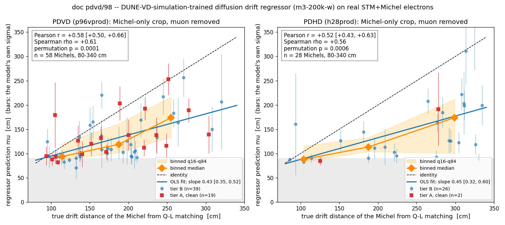

*Predicted drift (mu, bars = the model's own sigma) against the true Q-L drift, Michel-only crops, the model's range.
Orange: binned medians with the 16-84 % band. Red squares: the tier-A clean subset. Grey: below the model's trained
floor. Section 6b splits these points by topology.*

Binned, the prediction climbs monotonically with the true drift on both detectors (PDVD medians 94 -> 119 -> 173 cm
for true drift ~114 / 188 / 255 cm; PDHD 88 -> 113 -> 174 cm for ~104 / 187 / 299 cm). Three controls say the model is
not reading amplitude or pixel count (r with drift +0.17 / -0.06 to +0.09; r of mu with the crop charge -0.10 / +0.11),
and a naive per-channel width estimator sees **no** trend at all (r = -0.01 / +0.07), the same "topology floor" the
simulation study documented: the correlation is in something the learned model reads and a moment estimator does not.

**What the model does not do on data:** the slope is 0.43-0.45 with an intercept of ~50 cm, against an identity
expectation and a naive D_L / v_drift expectation of ~1.3 (PDVD) / ~1.6 (PDHD) (section 7). The model saturates at its
trained floor (~85 cm) for every Michel closer than ~120 cm to the anode, and reads a 300 cm Michel at ~175 cm. So the
model as trained is a **ranking** of drift on real data, not yet a calibrated measurement. That is the refinement the
owner anticipated ("if we can see some correlations it would already be a big success; we can then refine further").

## 0. Repro

```bash
cd /nfs/data/1/xqian/toolkit-dev/wcp-porting-img/pdvd/docs/nf_sp_img_clus/scripts
python3 d98_michel_crops.py --census                      # selection census -> ../../scan/d98/candidates.tsv
python3 d98_michel_crops.py -j 8                          # crops -> /home/xqian/tmp/d98/crops_{pdhd,pdvd}.npz,
                                                          #          scan/d98/crops.tsv, scan/d98/label_check.txt
CUDA_VISIBLE_DEVICES=1 python3 d98_predict.py --closure   # model import reproduces its published test predictions
CUDA_VISIBLE_DEVICES=1 python3 d98_predict.py             # scan/d98/scores.tsv
python3 d98_plots.py --tag round1                         # scan/d98/stats_round1.txt, figs/98_*.png
```

Read-only on every arm. Toolkit `f516b013`; wcp-porting-img production arms PDHD `h28prod` (61 events) and PDVD
`p96vprod` (120 events); the model repository `DNN_ROI_SP` at `2ae4466` is imported by path and not modified. The
crops (~124 x 4 variants x 1 MB) stay in `/home/xqian/tmp/d98/`.

## 1. The model and its contract

Study: `/home/xqian/toolkit-dev/DNN_ROI_SP/simulation/dunevd_singlep/` (docs in `docs/`). The model of record is
`diffusion_t0/ml/runs/m3-200k-w/best.pth` (`docs/diffusion_t0_ml_validation.md`, header), a 0.95 M-parameter
encoder-only CNN, `DriftRegressor` (`diffusion_t0/ml/model.py:36`), with heteroscedastic (mu, log sigma^2) heads.

| item | contract | where |
|---|---|---|
| input | **W (collection) plane only**, one crop of **256 channels x 1024 ticks** at 0.5 us/tick, `|gauss|` SP charge in electrons, zero-padded, **no threshold** | `ml/make_crops.py:51-52,133`; `validation/score_val.py:4,43` |
| normalisation | `log1p(x)/5.0`, a fixed monotone map; per-sample scaling is deliberately absent because absolute amplitude and width are the signal | `ml/drift_dataset.py:4,75`; `score_val.py:52` |
| anchor | the crop is centred on the charge centroid of the observed image, never on absolute frame time (the anti-leak rule); the model is flat to +-256 ticks of deliberate mis-centring | `make_crops.py:21-26`; `docs/diffusion_t0_ml_validation.md` sec 6 |
| output | mu, sigma in cm of drift from the response plane (the DUNE-VD sim's 18.1 cm in front of the CRP), x100 from the net's units | `score_val.py:37,69-70` |
| precision | **bf16 autocast on CUDA is the published function**; fp32 differs by 26.1 cm mean, larger than the model's own MAE | `score_val.py:63`; `validation.md:145-146` |
| range | trained on 80-560 cm (`ml/run_production.sh:59`); **saturates to roughly [85, 545] cm, does not extrapolate**; sigma is not a saturation flag | `validation.md:44,283`; `docs/diffusion_t0_technote_requests.md` P5 |
| performance (sim) | test MAE 30.5 cm at 200k; truth-free validation MAE 28.0 cm at E >= 20 MeV, 56-59 cm at 5 MeV | `docs/diffusion_t0_ml_pilot_results.md` sec 8.2; `validation.md:221-222` |
| training sim | DUNE-VD 1x8x6 3-view 30-deg, W pitch 5.100 mm; D_L 4.0 / D_T 8.8 cm2/s, drift 1.60563 mm/us, **infinite lifetime, no fluctuation**, noise on (`pdvd-top-noise-spectra-v3`), FR `protodunevd_FR_imbalance3p_260501` | `wct-depo-sim-dunevd.jsonnet:60-62,71,78-79`; `run_production.sh:164-165` |
| isolation | training crops carry a verified zero-foreign-pixel guarantee; the study's own crop finder "assumes one deposit per frame... not yet data-ready" | `make_crops.py:5-19`; `validation.md:559` |
| real data | the study's open item **P9, "Real-data ladder on ProtoDUNE"**, names CRT/PDS-tagged muons and their Michels as the first data step and marks it not addressable from that repository | `technote_requests.md:305-313, :25` |

This doc is P9's first rung, with the Q-L matching t0 in the role of the tag.

## 2. The data-side chain, and what already existed

Nothing was re-run. Every input is a product of the production PR arms (`run_pr_evt.sh -nu -stm-fit`, doc pdvd/97
sec 1 for the chain up to CheckSTM_Michel).

1. **The Michel's 2-D cells, muon-subtracted, are already persisted.** `CheckSTM_Michel::michel_q2d_estimate`
   (`clus/src/CheckSTM_Michel.cxx:1789`, called at `:4700`) walks the 2-D charge maps of the three planes and
   labels every cell it visits (`struct Cell`, `:2030`) with a role (3 = Michel-associated within 0.6 cm of the fitted
   Michel cloud, 1 = the STM muon footprint within `michel_q2d_stm_window_cm` = 30 cm of the stop, 4 = capture gamma,
   0 = in the 10 cm region with no owner) and with `pred_mu`, the muon fit's predicted charge on that cell; a shared
   cell's Michel contribution is `charge - pred_mu` or, for a cross-shared cell, `max(pred_all - pred_mu, 0)`
   (`:2202-2207`). With `michel_q2d_cells` on the table is written as `T_stm_michel_2d` (`:2588`;
   pdhd `wct-pr-perevt.jsonnet:426-427`, pdvd `:547-548`, both production bags). **Verified here:** its `channel` is
   the raw LArSoft ident, its `time` the absolute start tick of the 4-tick slice, and
   `charge == frame_gauss[row(channel), time:time+4].sum()` exactly (10/10 PDHD, 6/6 PDVD cells). Two limits for this
   use: the table holds only the cells the estimator visited (roles 1/3/4 plus a 10 cm region), and it is at slice
   (2 us) granularity, so the tick-level image has to come from the SP frame.
2. **The SP frames exist for every production event.** From the production dir, `pctree-evt*.tar.gz` links into the
   clustering arm, whose `clusters-apa-*-ms-active.tar.gz` link into the SP arm (`_d09` on PDHD, `_d27fresh` -> `_keep`
   on PDVD) holding `proto*-sp-dnnroi-frames-anode<N>.tar.bz2` with `frame_gauss<N>_<id>.npy` (channels x ticks,
   float32, electrons) and `channels_gauss<N>_<id>.npy` (LArSoft ids). Checked 61/61 and 120/120.
3. **The fit points project onto the frame.** Every `T_stm_michel_pts` row (role 1 muon, 3 Michel) is a
   `T_rec_charge` row of the same file with a `(pw, pt)` wire/slice coordinate (`prep_stm_michel_scan.py:305-330`,
   the 0.05 cm join); `pw` is a ChanScheme rank, turned into a LArSoft ident through the sorted W channel list of
   `chan_rank()` (`prep_stm_michel_scan.py:419`). Checked on 039252_17/88 and 028084_0/97: 18/18 and 19/19 Michel
   points land on Gaussian-filter charge, with the pulse peak a median 6 ticks after 4 x `pt`.
4. **The true drift needs no anode constant.** A pixel's tick maps to a t0-corrected x through
   `Aux::time2drift` (`aux/src/SamplingHelpers.cxx:247`) and the T0 correction that applies `cluster_t0` **and**
   the per-event `trigger_offset` together (`clus/src/PCTransforms.cxx:51-58,84-87`), so
   `drift_cm = (tick x 0.5 us - cluster_t0_us - trigger_offset_us) x v / 10`, with `cluster_t0_us` from `T_cluster`
   (`root/src/PdvdPrMagnifyTrackingVisitor.cxx:428,457`; equal to the flash time) and `trigger_offset_us`,
   `drift_speed_mmus` from the event's own `pctree-evt*.tlas` (PDHD ~250 us / 1.576 mm/us; PDVD per drift volume,
   `*_bot_*` for anodes 0-3 and `*_top_*` for 4-7, ~-2490 us / **1.48073 mm/us**, the production value, not
   `params.jsonnet`'s 1.568).

## 3. Selection and census

Truth is the hand record joined exactly as `d25_bragg_michel.py` does (PDHD `smx27` verdicts with the owner
precedence, APA0-strict population; PDVD the merged `smx1a..smx9` flat verdicts), with the chain row of
`T_stm_michel`. Pre-registered rules, each counted (`scan/d98/candidates.tsv` keeps every row with the first failed
rule in `why`):

| rule | PDHD | PDVD |
|---|---|---|
| hand `STM_MICHEL`, `michel_kind` attached/both | 57 | 161 |
| + Bragg-path accept (`is_stm==1 & topology_cleared_bits==0`) and `michel_found==1` | 36 | 108 |
| + `michel_conn_type` 1 (attached) or 2 (bridged) | 36 | 108 |
| + `n_retreat==0 & n_split==0 & michel_near_arm==0` (the stop is where it looks) | 35 | 96 |
| + `0 < michel_ke_best <= 52.8` MeV | 33 | 95 |
| + the Michel's W cells in one (apa, face) | 33 | 91 |
| + frames present | **33** | **91** |
| in the model's range, 80 <= drift <= 340 cm | 28 | 58 |
| tier A (clean) | 2 | 26 |

Tier A = Bragg ratio `contrast/contrast_expected >= 0.8`, `michel_q2d_mu_w / michel_q2d_raw_w < 0.2`,
`n_stop_gammas == 0`, and `frac_lost < 0.2` (section 4). Tier B = everything selected. The readouts are quoted on
tier B; tier A is the pre-registered clean subset. Bridged Michels (10 PDHD, 14 PDVD) are kept: they are the best
separated from the muon. The doc pdvd/97 showcase picks are flagged in the tables (`d97` column).

PDVD's Michels sit close to the anode (33 of 91 below 80 cm, where the model saturates by construction); those are
plotted but excluded from every correlation number. PDHD's are mostly far (5 of 33 below 80 cm).

## 4. Crop construction

`d98_michel_crops.py`, per candidate, on the tick-level Gaussian W frame of the Michel's anode:

- **keep** = the role-3 W cells of `T_stm_michel_2d` (channel ident, ticks `[time, time+4)`) U the projected role-3 fit
  points, dilated +-2 channels, +-10 ticks (the response width is 2.3-3.4 ticks; a +-3 / +-16 variant `Zw` is stored);
- **muon** = the role-1 W cells U the projected role-1 fit points along the whole chain, dilated +-1 channel, +-4 ticks;
- **Z** (primary) = `|gauss| x keep x not-muon`: the Michel alone, everything else exactly zero;
  **S** = like Z but an overlap pixel on a role-3 table cell keeps the fraction `max(charge - pred_mu, 0)/charge`;
  **M** (control) = `|gauss| x keep`, the muon left in;
- every variant is cut with the training's own `make_crops.cut()` at the charge centroid of Z (the anchor rule);
- diagnostics: `q_keep`, `frac_overlap` = charge the muon mask removes from the keep band / keep-band charge (what
  separates M from Z), and **`frac_lost`** = charge of the Michel's own undilated cells that the muon mask removes /
  their charge (the cleaner loss measure).

**One construction change, made before any prediction was run.** With the muon dilated like the keep band (+-2/+-10),
a 30-candidate check removed a median 48 % of the keep charge; the undilated muon cells alone removed 20 %, while the
Michel's own cells lose only a median 8 % to the undilated muon. Most of the "overlap" was muon charge the keep dilation
had swept in, which is exactly what should go. The muon dilation was therefore set to +-1 / +-4 (fills the slice gaps
between consecutive fit points), and tier A keys on `frac_lost` rather than `frac_overlap`. Final distributions:
`frac_lost` median 0.36 (PDHD) / 0.29 (PDVD); `q_keep` / `michel_q2d_raw_w` 10th percentile 1.09 (the keep band holds
at least the table's Michel charge for every candidate).

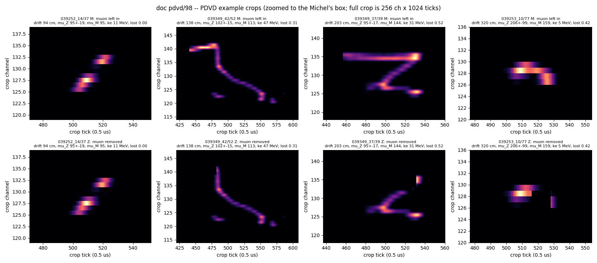
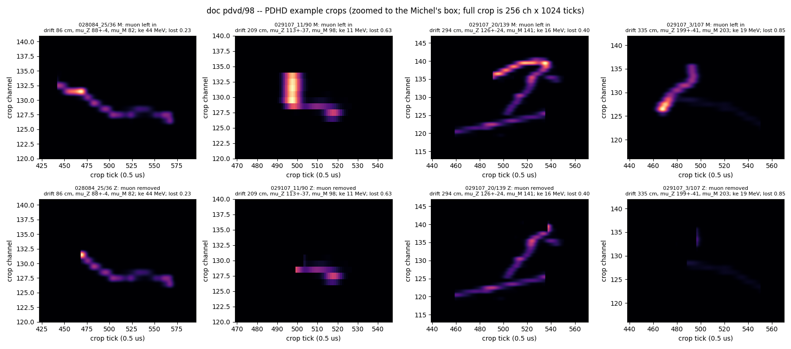

*Four Michels per detector spanning the drift range, zoomed to the Michel's box; top row the muon left in (M), bottom
the primary crop (Z). The right-most PDHD example (`frac_lost` 0.85) shows what a tier-B crop with a Michel running back
along the muon looks like after removal; the doc 97 showcase events (`028084_0/97`, `039252_17/88`, ...) read
`frac_lost` 0.21-0.41.*

## 5. Label validation

Two independent routes to the true drift agree at the sub-cm level over the whole sample, so the t0 arithmetic of
section 2.4 is right and the Q-L label is what the fit itself used:

| detector | n | median (tick route - fit route) | sd | max abs |
|---|---|---|---|---|
| PDHD | 33 | +0.08 cm | 0.80 | 2.09 |
| PDVD | 91 | +0.27 cm | 0.68 | 3.88 |

(`scan/d98/label_check.txt`; the fit route is `x_anode(W) - |x|` over the Michel's fit points with the collection-plane
x of `d44_sigma_fit.py`, 353.10 / 341.55 cm.) The within-crop spread of the tick-route drift is 1.1-1.5 cm median (the
Michel's own extent along x). 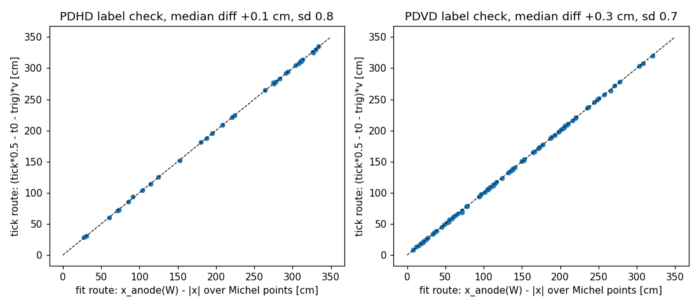

**Closure of the model import** (`scan/d98/closure.txt`): 64 rows of the stored test split re-scored through this path
reproduce `runs/m3-200k-w/predictions_test.csv` to a max |d mu| of 0.005 cm (gate 1 cm). What ran on the data is the
published function.

## 6. Results (round 1, pre-registered readouts; `scan/d98/stats_round1.txt`)

x = Q-L drift (tick route), y = mu; 68 % intervals by 2000 bootstraps; p by 10 000 label permutations (one-sided,
rho > 0); "in-range" = 80 <= drift <= 340 cm.

**PDVD, tier B, in-range (n = 58)**

| variant | r [68 %] | rho | p_perm | slope [68 %] | intercept | resid rms | pull sd | caveat in the same row |
|---|---|---|---|---|---|---|---|---|
| **Z** Michel only | **+0.58 [+0.50, +0.66]** | **+0.61** | **1e-4** | 0.43 [0.35, 0.52] | +51 | 36 cm | 1.5 | the primary readout; the success criterion |
| S overlap scaled | +0.63 [+0.53, +0.72] | +0.59 | 1e-4 | 0.45 [0.35, 0.55] | +43 | 33 cm | 1.5 | same picture, so the zeroing choice does not drive it |
| M muon left in | +0.66 [+0.58, +0.74] | +0.63 | 1e-4 | 0.56 [0.47, 0.65] | +47 | 37 cm | 1.8 | **not a null**: the muon's last 30 cm sits at the same drift as the Michel and is itself a diffusion sample; higher r is expected, not a contamination signal |
| Zw wider mask | +0.58 [+0.50, +0.67] | +0.58 | 1e-4 | 0.44 [0.36, 0.53] | +51 | 36 cm | 1.6 | the mask width is not what limits it |
| tier A, Z (n = 19) | +0.53 [+0.37, +0.69] | +0.64 | 2e-3 | 0.37 [0.23, 0.54] | +69 | 38 cm | 1.8 | the clean subset shows the same correlation; it is not carried by the messy events |
| all 91 incl. < 80 cm, Z | +0.63 [+0.58, +0.68] | +0.65 | 1e-4 | 0.31 [0.27, 0.36] | +76 | 32 cm | 1.8 | the 33 saturated near-anode events inflate r and flatten the slope; quoted for completeness only |

**PDHD, tier B, in-range (n = 28)**

| variant | r [68 %] | rho | p_perm | slope [68 %] | intercept | resid rms | pull sd | caveat |
|---|---|---|---|---|---|---|---|---|
| **Z** | **+0.52 [+0.43, +0.63]** | **+0.56** | **6e-4** | 0.45 [0.32, 0.60] | +43 | 58 cm | 2.4 | 4.792 mm pitch vs 5.100 trained; D_L 6.2 vs 4.0; reported as-is |
| S | +0.40 [+0.28, +0.52] | +0.36 | 0.028 | 0.34 [0.20, 0.51] | +54 | 63 cm | 4.5 | PDHD leans harder on the cross-shared branch (52 % of candidates carry such cells) |
| M | +0.49 [+0.38, +0.61] | +0.48 | 5e-3 | 0.44 [0.30, 0.58] | +52 | 61 cm | 3.0 | see the PDVD M row |
| Zw | +0.57 [+0.47, +0.68] | +0.63 | 3e-4 | 0.48 [0.35, 0.62] | +34 | 56 cm | 2.5 | |
| tier A | n = 2 | | | | | | | too few: the PDHD sample has 2 clean-by-every-rule Michels |

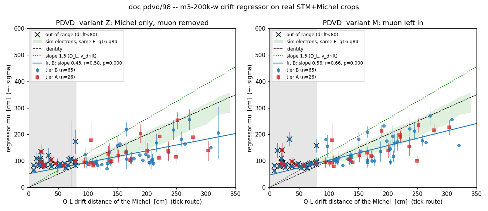
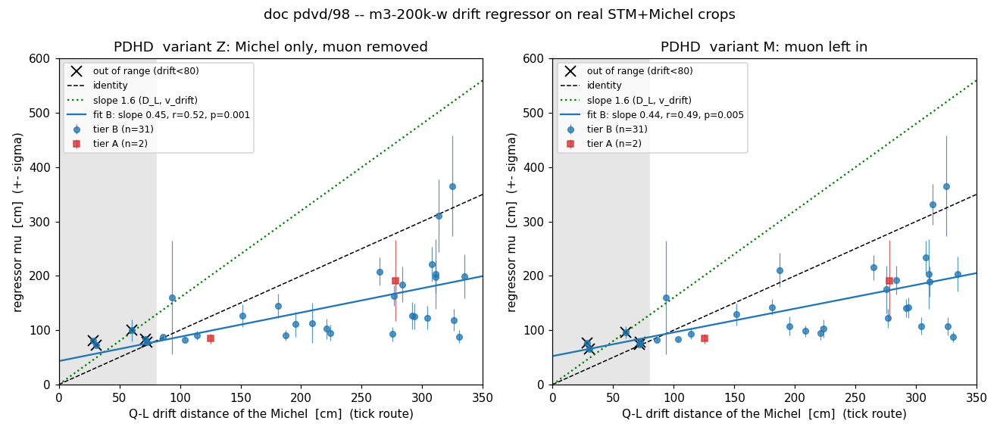

*Left panels: the primary Michel-only crop (Z); right panels: the same Michels with the muon left in (M). Crosses are
the near-anode events below the model's range.* The rank-rank view, which is what Spearman's rho measures:
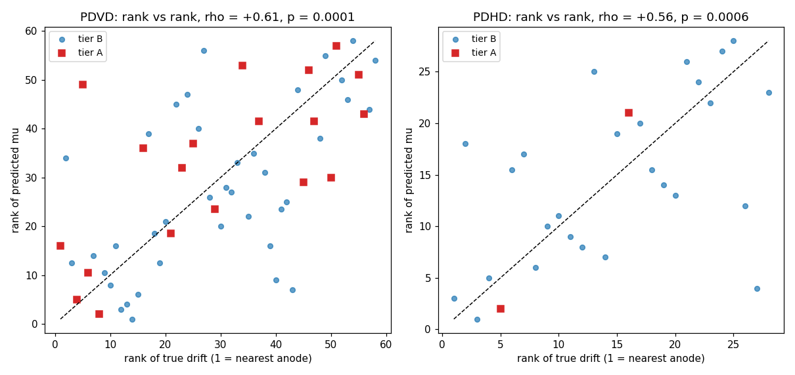

### 6b. Reco vs true drift by topology

The same axes, the in-range Michels split six ways (`figs/98_topology_{pdvd,pdhd}.png`; per-group numbers in
`scan/d98/stats_round1.txt`, "topology splits"). Each group carries its own rho, permutation p and OLS slope.

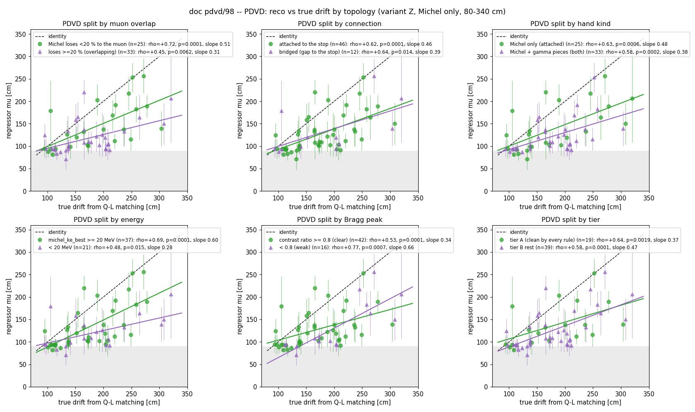
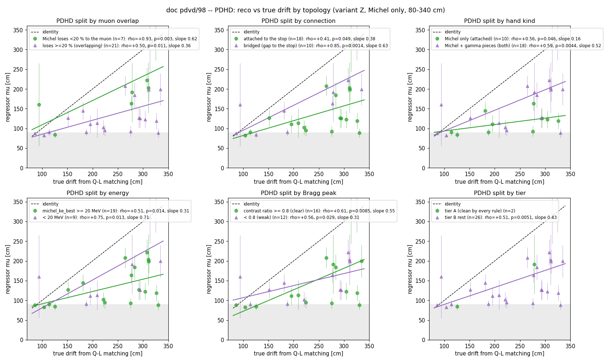

| split | group | PDVD n / rho / p / slope | PDHD n / rho / p / slope | reading |
|---|---|---|---|---|
| **muon overlap** | Michel loses < 20 % of its cells to the muon | 25 / **+0.72** / 1e-4 / 0.51 | 7 / **+0.93** / 3e-3 / 0.62 | the cleanest separation gives the strongest correlation and the steepest slope on both detectors |
| | loses >= 20 % (overlapping the muon) | 33 / +0.45 / 6e-3 / 0.31 | 21 / +0.50 / 0.011 / 0.36 | still correlated, but weaker and flatter: truncating the Michel's start costs slope |
| **connection** | attached to the stop | 46 / +0.62 / 1e-4 / 0.46 | 18 / +0.41 / 0.049 / 0.38 | |
| | bridged (a gap to the stop) | 12 / +0.64 / 0.014 / 0.39 | 10 / **+0.85** / 1.4e-3 / 0.63 | bridged Michels are the best-separated on PDHD and read best there |
| **hand kind** | Michel only (`attached`) | 25 / +0.63 / 6e-4 / 0.48 | 10 / +0.56 / 0.046 / 0.16 | |
| | Michel + isolated gamma pieces (`both`) | 33 / +0.58 / 2e-4 / 0.38 | 18 / +0.59 / 4.4e-3 / 0.52 | the gamma pieces are not in the crop (role 4 cells are excluded); no penalty visible |
| **energy** | `michel_ke_best` >= 20 MeV | 37 / **+0.69** / 1e-4 / **0.60** | 19 / +0.51 / 0.014 / 0.31 | on PDVD the higher-energy Michels read with the steepest slope (0.60), as the simulation study found (MAE 28 cm at >= 20 MeV vs 56 at 5 MeV) |
| | < 20 MeV | 21 / +0.48 / 0.015 / 0.28 | 9 / +0.75 / 0.013 / 0.71 | PDHD's 9 low-energy events go the other way; too few to read |
| **Bragg peak** | contrast ratio >= 0.8 (clear) | 42 / +0.53 / 1e-4 / 0.34 | 16 / +0.61 / 8.5e-3 / 0.55 | the muon's Bragg clarity does not help the Michel reading; it is a purity cut on the STM, not on the Michel image |
| | < 0.8 (weak) | 16 / +0.77 / 7e-4 / 0.66 | 12 / +0.56 / 0.029 / 0.31 | |
| **tier** | A (clean by every rule) | 19 / +0.64 / 1.9e-3 / 0.37 | 2 / too few | |
| | B (rest) | 39 / +0.58 / 1e-4 / 0.47 | 26 / +0.51 / 5.1e-3 / 0.43 | |

What the splits say: the two things that matter for the Michel image are **how much of the Michel survives the muon
removal** and **its energy**. Michels that keep >= 80 % of their cells read with rho 0.72 (PDVD) and 0.93 (PDHD, 7
events), against 0.45-0.50 for the overlapping ones; Michels above 20 MeV read with slope 0.60 on PDVD against 0.28
below. The STM-side quality (Bragg clarity, attached vs bridged, gamma pieces) does not move the correlation in a
consistent direction. So a round-2 selection for the video or for a recalibration should key on `frac_lost < 0.2` and
`michel_ke_best >= 20 MeV`; on PDVD that is the group with rho 0.72. The tier-A definition, which keys on the STM's
Bragg ratio and the gamma count, is the wrong lever for this measurement.

**Binned medians of mu_Z, tier B in-range** (the trend without a fit):

| true drift band | PDVD n / median drift / median mu_Z (q16-q84) | PDHD n / median drift / median mu_Z (q16-q84) |
|---|---|---|
| 80-150 cm | 21 / 114 / **94** (87-120) | 5 / 104 / **88** (84-115) |
| 150-220 cm | 23 / 188 / **119** (102-162) | 5 / 187 / **113** (104-133) |
| 220-340 cm | 14 / 255 / **173** (133-216) | 18 / 299 / **174** (100-212) |

**Controls** (tier B in-range): r(q_keep, drift) = +0.17 / +0.17 (PDHD / PDVD), r(n_pix, drift) = -0.06 / +0.09,
r(mu_Z, q_keep) = -0.10 / +0.11, r(mu_Z, ke_best) = -0.33 / +0.27. The crop's charge and size barely track drift
(lifetime attenuation over 3 m is ~4 % on PDHD at 50 ms and ~10 % on PDVD at 20 ms, against a 5-50 MeV energy
spread), and mu does not track the charge; the energy correlation has opposite
signs on the two detectors. Saturation census: 8 / 24 events read below 90 cm (PDHD / PDVD), none above 540.

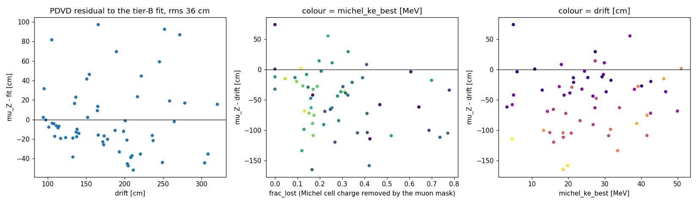

*PDVD residuals to the tier-B fit against drift, against the Michel charge lost to the muon mask, and against energy.*

**Model-free width** (`figs/98_width_vs_drift.png`, below): the 25th-percentile per-channel tick RMS^2 of the Z crop,
windowed +-12 ticks around each column's peak, against drift: PDHD r = -0.01 (p = 0.58), PDVD r = +0.07 (p = 0.28),
fitted slopes -0.0003 / +0.0038 ticks^2/cm against the expected 2 D_L / v^3 of 0.0127 / 0.0102. The intercept (~9-11
ticks^2, i.e. ~3 ticks rms) is the response-plus-topology floor the simulation study measured at 2.3-3.4 ticks; the
0.4-1.7-tick diffusion signal is invisible to a moment of a Michel track that is itself tilted in the drift direction.
That is the whole reason the study trained a model, and it is why the model's rho of 0.6 is a result and not a
restatement of a width plot.

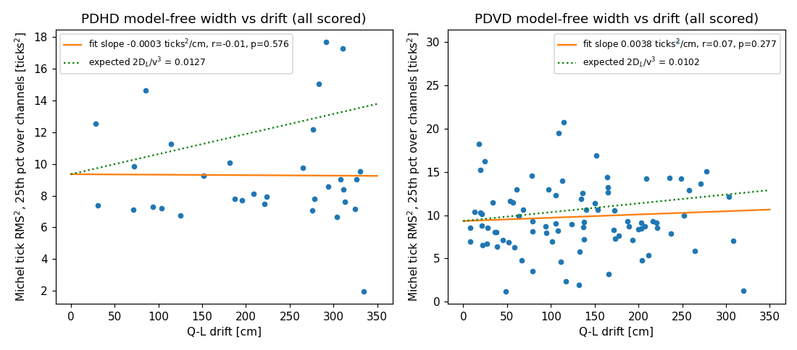

**The doc pdvd/97 showcase events**, for the video: PDVD `039253_8/59` (both, 51 MeV) drift 252 -> mu 253 +- 32;
`039252_17/88` (attached) 136 -> 134 +- 34; `039252_16/88` 113 -> 92 +- 16; `039253_3/79` (15 MeV) 209 -> 106 +- 20.
PDHD `029107_3/111` 265 -> 208 +- 26; `029107_20/57` 311 -> 198 +- 30; `028084_0/97` 326 -> 119 +- 20;
`028084_1/142` 304 -> 123 +- 22.

## 7. Where the data and the training simulation differ, and what the slope says

| quantity | training sim | PDVD data / production | PDHD data / production | consequence |
|---|---|---|---|---|
| collection pitch | 5.100 mm | **5.100 mm** (292 ch per CRU face, same as trained) | **4.792 mm** (-6.4 %) | pitch is baked into the learned features; PDHD transfer is a retraining matter |
| D_L | 4.0 cm2/s | 4.1307 (`protodunevd/params.jsonnet:151`) | 6.2 (`omni/pdhd/params.jsonnet:11`) | the model inverts sigma_t^2 = 2 D_L x / v^3 with the training constants |
| drift speed | 1.60563 mm/us | **1.48073** (production `.tlas`) | 1.576 (`.tlas`) | ditto; naive expected slope x_pred / x_true = (D_L / 4.0) (1.606 / v)^3 = **1.32** (PDVD) / **1.64** (PDHD) |
| lifetime | infinite (by design) | 20 ms | 50 ms | up to ~10 % (PDVD) / ~4 % (PDHD) attenuation over a full drift; the model was trained blind to amplitude-vs-drift |
| field response | `protodunevd_FR_imbalance3p_260501` | **the same file** (`protodunevd/params.jsonnet:253`) | PDHD's own FR | no FR gap on PDVD |
| SP time filters | `Gaus_wide` 0.12 MHz, `Wiener_*_W` identical | identical (`protodunevd/sp-filters.jsonnet:94-109`) | identical (`pdhd/sp-filters.jsonnet:46-78`) | none |
| SP wire filter `Wire_col` | sigma = **3.0**/sqrt(pi) (`dune-vd/sp-filters.jsonnet:114`) | **10.0**/sqrt(pi) (`:113-114`) | **10.0**/sqrt(pi) (`:84`) | the training images are smoothed more across wires; the validation doc (sec 5.5) identified charge division across wires as what the model reads |
| noise | simulated `pdvd-top-noise-spectra-v3`, no charge fluctuation | real | real | ROI thresholding removes a drift-dependent 2-6 % of charge (study sec 4.6) in both, tuned on different noise |
| surroundings | isolated particle, noise-only residue elsewhere | **exact zeros** outside the Michel mask; 8-36 % of the Michel's own cells removed with the muon | same | a domain shift of the crop background and a truncation of the Michel's start |

The measured slope of 0.43-0.45 is **below** identity, while every listed transport difference would push the reading
**up** (real D_L / v^3 is larger than trained on both detectors), and the PDHD-PDVD pitch difference does not show up
as a slope difference. So the compression is not the transport constants. The candidates this doc can name but not
separate are the wire-domain filter (the one SP setting that differs, in the direction of sharper data images, which the
model would read as less diffused), the zero background and the truncated Michel start (the S and Zw variants and the
tier-A cut move the slope by < 0.1, so the mask width and the zeroing are not it, but the training-domain shift of
"zeros where noise residue was" remains untested), and the floor: the model cannot read below ~85 cm, and 21 of PDVD's
58 in-range Michels are within 150 cm, where the floor pulls the OLS intercept up and the slope down (the binned medians
in section 6 show the 220-340 cm bin reading 0.68 (PDVD) / 0.58 (PDHD) of its median drift, so the fit's 0.43 is
partly the floor).

## 8. What this doc does not claim

- Not a calibrated drift measurement on data: the residual rms is 36 cm (PDVD) / 58 cm (PDHD) about a fitted line with
  slope 0.43, and the pulls are 1.5-2.4 wide, so the model's sigma under-covers on data.
- Not a statement about D_L: the slope is the wrong sign for a transport-constant reading, and the naive width check
  has no power.
- Not PDHD-transferable as is: pitch and D_L differ from the training; the PDHD correlation is reported, not
  interpreted.
- The hand truth is the scanners' verdict (PDVD's base scan was not blind; PDHD is the owner-precedence smx27 record);
  the drift label is the chain's own Q-L t0, which is what a reconstruction would have.
- No round-2 selection was run: the pre-registered fallbacks (tier A only, wider mask, dropping PDHD) were not needed
  because the round-1 criterion was met; tier A and Zw are reported alongside as the sensitivity.

## 9. Next steps (owner's call)

1. **The wire filter is the one SP setting that differs.** Re-running SP on the 91 + 33 events with `Wire_col`
   sigma = 3.0/sqrt(pi) (a new arm, no production change) and re-scoring would test the leading named cause of the
   compressed slope with no retraining.
2. **Fine-tune or recalibrate on data.** With rho ~0.6 established, a one-parameter recalibration (mu -> drift by the
   fitted line) turns the ranking into a 36 cm-rms measurement on PDVD; a small fine-tune on the 58 in-range PDVD
   Michels with a held-out third would say whether the compression is a domain shift the network can absorb.
3. **A near-anode re-diffusion closure on data** (the study's P9 augmentation ladder): re-broaden the < 80 cm Michels
   (33 on PDVD) by the analytic kernel to emulate 200-300 cm and check that the model then reads them there.
4. **PDHD retrain at 4.792 mm pitch** if PDHD is wanted quantitatively.
5. For the video, key on the section 6b levers (`frac_lost < 0.2`, `michel_ke_best >= 20 MeV`) rather than tier A;
   `039253_8/59` (PDVD, 51 MeV, `frac_lost` 0.12, drift 252 -> mu 253) is the cleanest single event.

## 10. Files

- this doc; `scripts/d98_michel_crops.py` (census, crops, labels), `scripts/d98_predict.py` (closure, scoring),
  `scripts/d98_plots.py` (readouts, figures);
- `pdvd/docs/scan/d98/`: `candidates.tsv` (every hand Michel with the first failed rule), `crops.tsv` (per-candidate
  diagnostics and both labels), `scores.tsv` (labels, mu/sigma per variant, tier), `label_check.txt`, `closure.txt`,
  `stats_round1.txt`;
- `figs/98_correlation_summary.png` (the headline), `98_topology_{pdhd,pdvd}.png` (section 6b), `98_rank_rank.png`,
  `98_mu_vs_drift_{pdhd,pdvd}.png`, `98_resid_{pdhd,pdvd}.png`, `98_crops_{pdhd,pdvd}.png`, `98_label_check.png`,
  `98_width_vs_drift.png`;
- the crops themselves in `/home/xqian/tmp/d98/crops_{pdhd,pdvd}.npz` (not committed; rebuilt in ~40 s).
