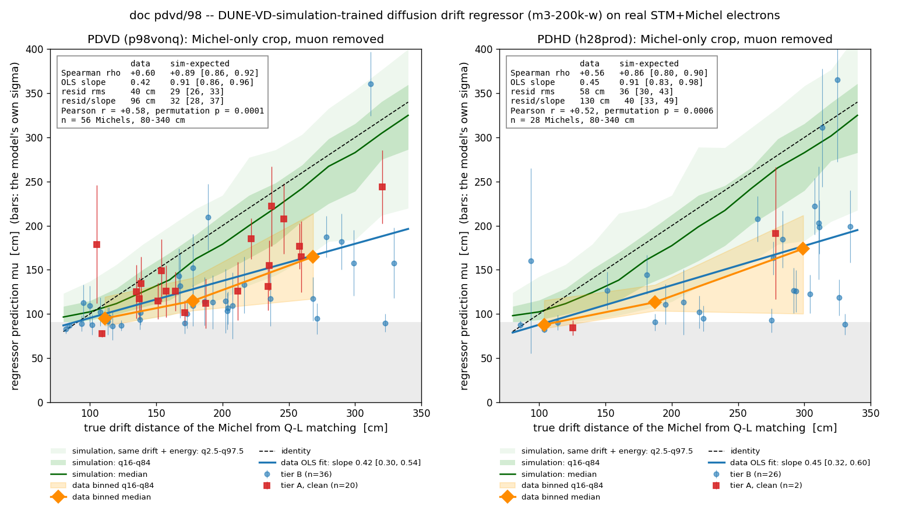
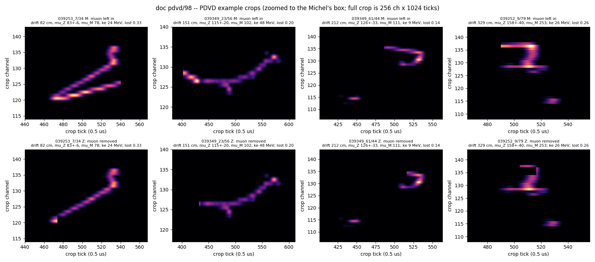
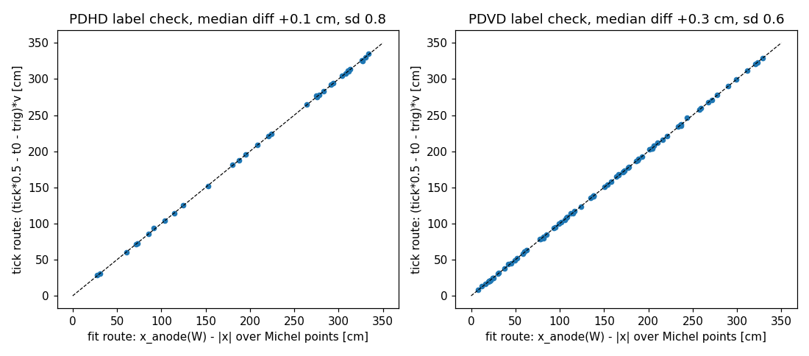
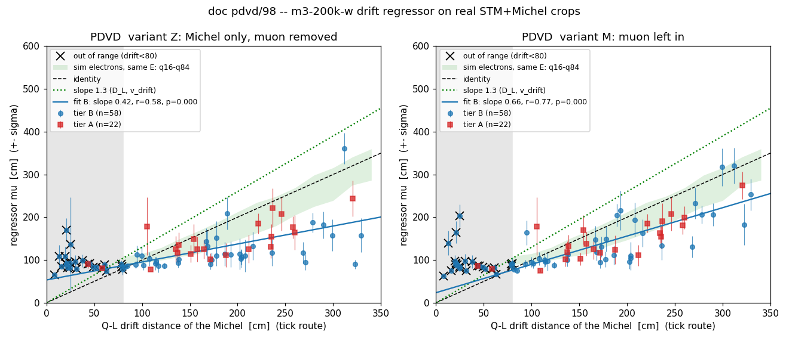
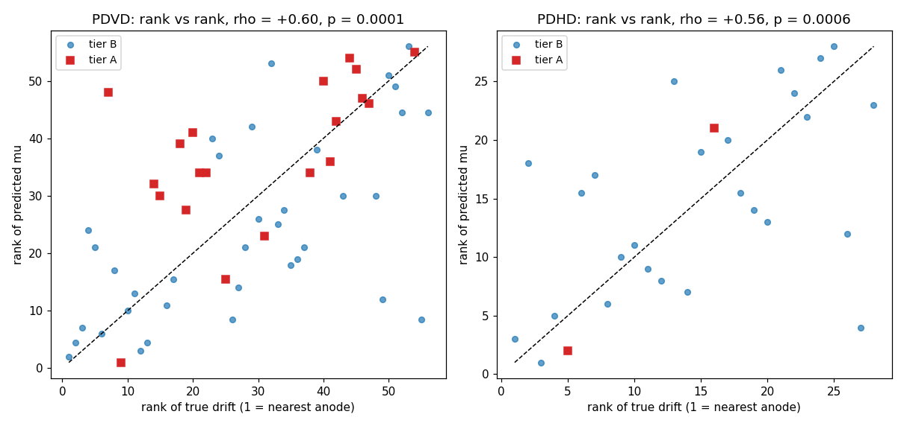
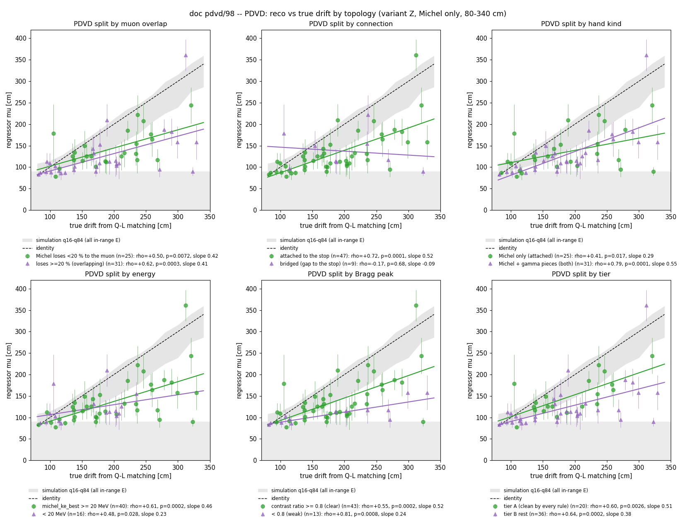
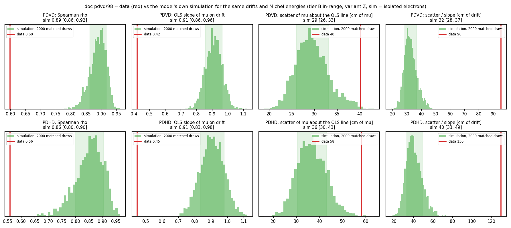
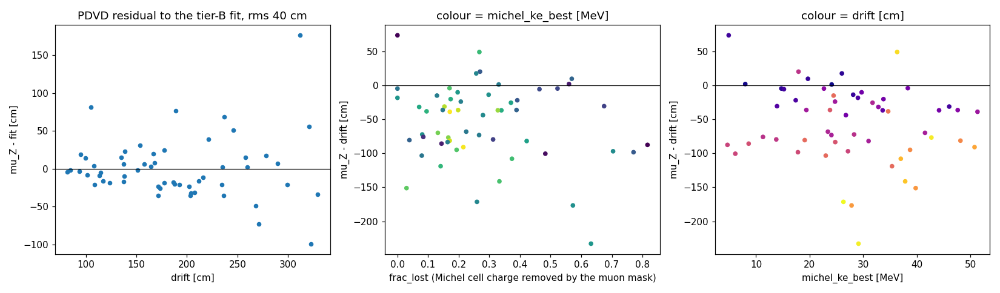
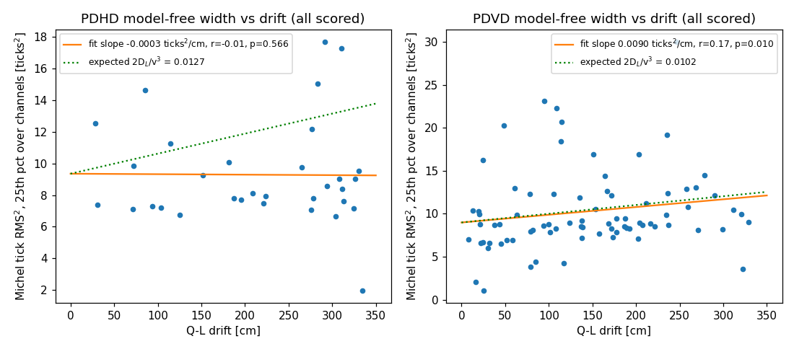

# doc pdvd/98 -- the simulation-trained diffusion drift regressor on real STM+Michel electrons (PDHD + PDVD)

**Question.** The DUNE-VD single-particle study trained a CNN to read the drift distance of an isolated 5-50 MeV
electron or gamma from the diffusion broadening of its collection-plane image alone. It was validated only on
simulation. Our hand-scanned stopping-muon (STM) + Michel samples on ProtoDUNE-HD and ProtoDUNE-VD give real Michel
electrons whose drift distance is known independently, from the flash (Q-L) matching t0. **Does the model's prediction
on the real Michel image correlate with that drift distance?** Exact agreement was not expected (the diffusion
constants, drift speed, wire filter, noise and, on PDHD, the wire pitch all differ between the training simulation and
the data); a correlation is the deliverable. No model was retrained.

**Answer on the latest configuration (round 2, 2026-09-13; section 11).** Yes, on both detectors. On the pitch-matched
PDVD the pre-registered success criterion is met on the latest configuration as it was on production.
- **The PDVD row reads the latest configuration** of doc pdvd/99, arm `p98vonq`: the v7 wire order in SP and in everything
  after it, and the top-electronics gain in SP.
- **Its hand record** is the smx record carried onto that arm, plus the blind scan of the clusters it newly tags (doc
  pdvd/99 §6.4).
- Production's round-1 row is kept for comparison.

| detector (arm, record) | Michels scored (in the model's range) | Pearson r [68 %] | Spearman rho | permutation p | OLS slope [68 %] |
|---|---|---|---|---|---|
| **PDVD, latest** (`p98vonq`, carried + sw99) | 80 (56) | **+0.58 [+0.49, +0.67]** | **+0.60** | **1e-4** | 0.42 [0.30, 0.54] |
| **PDHD** (`h28prod`) | 33 (28) | **+0.52 [+0.43, +0.63]** | **+0.56** | **6e-4** | 0.45 [0.32, 0.60] |
| PDVD, production, round 1 (`p96vprod`, smx) | 91 (58) | +0.58 [+0.50, +0.66] | +0.61 | 1e-4 | 0.43 [0.35, 0.52] |

**The full-sample numbers hardly move, but that hides two opposing changes** (section 11): the sample changed, and so did
the reconstruction.
- **On the 37 Michels in range on both arms**, the slope goes 0.51 → 0.39. The drop sits in the top volume (29 Michels,
  0.60 → 0.45). The 8 bottom ones give the same readout on both arms.
- **The top gain's ×1.125 accounts for about 0.05 of it.** This was measured by putting the scale into production's
  crops and taking it out of the latest ones (`scan/d98/latest_sw99/rescale_check.txt`). The model reads absolute
  amplitude by design (section 1).
- **The rest is not a robust trend.** It comes from individual crops that the rerun re-cut, and leaving out a single
  object swings the top drop from -0.04 to +0.22. `039349_5/66` lost half its Michel pixels and reads 95 cm at drift
  271 cm, against 256 cm on production; without it the top slope goes 0.50 → 0.55.



*Predicted drift (mu, bars = the model's own sigma) against the true Q-L drift, Michel-only crops, the model's range.
Orange: binned medians with the 16-84 % band. Red squares: the tier-A clean subset. Grey: below the model's trained
floor. Green: what the model's own simulation gives for isolated electrons at the same drift and energy (median,
16-84 % and 2.5-97.5 % bands; section 6c). The corner table sets each readout beside its simulation expectation for a
sample of the same size. Section 6b splits these points by topology.*

**Against the model's own simulation (section 6c).** Replace every data Michel with a simulated electron from the
model's test split at the same drift (+-15 cm) and energy (+-5 MeV). The model then gives rho 0.89 [0.86, 0.92] and
slope 0.91 [0.86, 0.96] on PDVD (0.86 / 0.91 on PDHD); the data's 0.60 / 0.42 lie far outside that range. The spread
question has two answers depending on the unit:

- **In mu (the plotted axis), PDVD's spread is mostly what simulation expects.** Within each drift band, the half-width
  of the data's 16-84 % range is 16 / 18 / 48 cm, against 16 / 32 / 47 expected: at expectation in the near and far
  bands, narrower in the middle one. About the fitted line the scatter is 40 cm against 29 [26, 33].
- **As a drift measurement it is 3x worse**, 96 cm against 32 [28, 37]. The scatter rides on half the response to
  drift.

So on PDVD the real images mainly compress the model's response rather than make it noisier. Production read the same
way: 36 vs 29 cm about the line, 83 vs 34 cm in drift. PDHD is wider in both units (58 vs 36 [30, 43] cm in mu, 130 vs
40 cm in drift), and its pulls are 2.4 wide against 1.0.

Binned, the prediction climbs monotonically with the true drift on both detectors (PDVD medians 95 -> 115 -> 165 cm
for true drift ~111 / 178 / 268 cm; PDHD 88 -> 113 -> 174 cm for ~104 / 187 / 299 cm).
- **Controls.** Across Michels, the model does not track the crop's charge or pixel count: r with drift -0.06 to +0.17,
  and r of mu with the crop charge -0.10 / -0.13 (PDHD / PDVD).
- **Width moment, PDHD.** A naive per-channel width estimator sees **no** trend (r = -0.01). That is the same "topology
  floor" the simulation study documented.
- **Width moment, PDVD: the control moved.** On production it saw nothing (r +0.07, p 0.28). On the latest configuration
  it reads r +0.17, rho +0.26, p 0.0099, with a slope close to the naive diffusion expectation (section 6c). This round
  does not explain it (section 11).

**What the model does not do on data:** the slope is 0.42-0.45 with an intercept of ~50 cm, against an identity
expectation and a naive D_L / v_drift expectation of ~1.3 (PDVD) / ~1.6 (PDHD) (section 7). The model saturates at its
trained floor (~85 cm) for every Michel closer than ~120 cm to the anode, and reads a 300 cm Michel at ~175 cm. So the
model as trained is a **ranking** of drift on real data, not yet a calibrated measurement. That is the refinement the
owner anticipated ("if we can see some correlations it would already be a big success; we can then refine further").

## 0. Repro

```bash
cd /nfs/data/1/xqian/toolkit-dev/wcp-porting-img/pdvd/docs/nf_sp_img_clus/scripts
python3 d98_michel_crops.py --census                      # selection census -> ../../scan/d98/candidates.tsv
python3 d98_michel_crops.py -j 8                          # crops -> /home/xqian/tmp/d98/crops_{pdhd,pdvd}.npz,
                                                          #          scan/d98/crops.tsv, scan/d98/label_check.txt
CUDA_VISIBLE_DEVICES=1 python3 d98_predict.py --closure   # model import reproduces its published test predictions
CUDA_VISIBLE_DEVICES=1 python3 d98_predict.py             # scan/d98/scores.tsv
python3 d98_plots.py --tag round1                         # scan/d98/stats_round1.txt, figs/98_*.png
# round 2 (section 11): the latest configuration, doc pdvd/99 p98vonq on the p98von frames; round 1's files untouched
S=../../scan
python3 d98_michel_crops.py --run latest_sw99 --pdvd-arm p98vonq \
    --pdvd-record $S/pdvd_stm_michel_p98vonq_carried_sw99_verdicts.json -j 16   # scan/d98/latest_sw99/, crops in tmp/d98/latest_sw99/
CUDA_VISIBLE_DEVICES=1 python3 d98_predict.py --run latest_sw99
python3 d98_plots.py --run latest_sw99 --tag latest_sw99 --pdvd-arm p98vonq   # scan/d98/latest_sw99/stats_latest_sw99.txt, figs/98_latest_sw99_*.png
python3 d98_compare_runs.py --run latest_sw99 > $S/d98/latest_sw99/compare_round1.txt
CUDA_VISIBLE_DEVICES=1 python3 d98_rescale_check.py --run latest_sw99 > $S/d98/latest_sw99/rescale_check.txt  # gain in/out
#   (reads round 1's PDVD crops from /home/xqian/tmp/d98/crops_pdvd.npz, md5 75d30270eebc4f49175e84f7f4bf5f8d; those crops
#    cannot be rebuilt, so once scratch is cleaned this line no longer runs and rescale_check.txt is the record)
# sensitivity, the carried record alone: --run latest --pdvd-record $S/pdvd_stm_michel_smx9_carried_p98vonq.json (tables only)
```

Read-only on every arm. Toolkit `f516b013`; wcp-porting-img production arms PDHD `h28prod` (61 events) and PDVD
`p96vprod` (120 events); the model repository `DNN_ROI_SP` at `2ae4466` is imported by path and not modified. The
crops (~124 x 4 variants x 1 MB) stay in `/home/xqian/tmp/d98/`. The simulation expectation of section 6c reads that
repository's `diffusion_t0/ml/runs/m3-200k-w/predictions_test.csv`. It was added after round 1 and draws from its own
random generator (seed 20260914): the first 91 lines of `stats_round1.txt` are byte-identical to the round-1 commit
`cbf9bf24`, and the new lines are appended after them.

**Round 2 reads the latest PDVD configuration** (section 11): `p98vonq` on the `p98von` frames, all 960 archives kept.
- **PDHD is re-run in the same pass and reproduces round 1 exactly.** Its candidates, crops and scores are identical row for
  row, which is the unchanged-path check of the new `--run` options.
- **Round 1's PDVD crops cannot be rebuilt as they are.** The July SP frames they were cut from were retired after this
  comparison (doc pdvd/99 §9). `scan/d98/{candidates,crops,scores}.tsv`, `stats_round1.txt` and `figs/98_*.png` are the
  record. `run_nf_sp_dnnroi_evt.sh --wires protodunevd-wires-larsoft-v5.json.bz2` regenerates the frames sample for sample.

## 1. The model and its contract

Study: `/home/xqian/toolkit-dev/DNN_ROI_SP/simulation/dunevd_singlep/` (docs in `docs/`). The model of record is
`diffusion_t0/ml/runs/m3-200k-w/best.pth` (`docs/diffusion_t0_ml_validation.md`, header), a 0.95 M-parameter
encoder-only CNN, `DriftRegressor` (`diffusion_t0/ml/model.py:36`), with heteroscedastic (mu, log sigma^2) heads.

| item | contract | where |
|---|---|---|
| input | **W (collection) plane only**, one crop of **256 channels x 1024 ticks** at 0.5 us/tick, `|gauss|` SP charge in electrons, zero-padded, **no threshold** | `ml/make_crops.py:51-52,133`; `validation/score_val.py:4,43` |
| normalisation | `log1p(x)/5.0`, a fixed monotone map; per-sample scaling is deliberately absent because absolute amplitude and width are the signal | `ml/drift_dataset.py:4,75`; `score_val.py:52` |
| anchor | the crop is centred on the charge centroid of the observed image, never on absolute frame time (the anti-leak rule); the model is flat to +-256 ticks of deliberate mis-centring | `make_crops.py:21-26`; `docs/diffusion_t0_ml_validation.md` sec 6 |
| output | mu, sigma in cm of drift from the response plane (the DUNE-VD sim's 18.1 cm in front of the CRP), x100 from the net's units | `score_val.py:37,69-70` |
| precision | **bf16 autocast on CUDA is the published function**; fp32 differs by 26.1 cm mean, larger than the model's own MAE | `score_val.py:63`; `validation.md:145-146` |
| range | trained on 80-560 cm (`ml/run_production.sh:59`); **saturates to roughly [85, 545] cm, does not extrapolate**; sigma is not a saturation flag | `validation.md:44,283`; `docs/diffusion_t0_technote_requests.md` P5 |
| performance (sim) | test MAE 30.5 cm at 200k; truth-free validation MAE 28.0 cm at E >= 20 MeV, 56-59 cm at 5 MeV | `docs/diffusion_t0_ml_pilot_results.md` sec 8.2; `validation.md:221-222` |
| training sim | DUNE-VD 1x8x6 3-view 30-deg, W pitch 5.100 mm; D_L 4.0 / D_T 8.8 cm2/s, drift 1.60563 mm/us, **infinite lifetime, no fluctuation**, noise on (`pdvd-top-noise-spectra-v3`), FR `protodunevd_FR_imbalance3p_260501` | `wct-depo-sim-dunevd.jsonnet:60-62,71,78-79`; `run_production.sh:164-165` |
| isolation | training crops carry a verified zero-foreign-pixel guarantee; the study's own crop finder "assumes one deposit per frame... not yet data-ready" | `make_crops.py:5-19`; `validation.md:559` |
| real data | the study's open item **P9, "Real-data ladder on ProtoDUNE"**, names CRT/PDS-tagged muons and their Michels as the first data step and marks it not addressable from that repository | `technote_requests.md:305-313, :25` |

This doc is P9's first rung, with the Q-L matching t0 in the role of the tag.

## 2. The data-side chain, and what already existed

Nothing was re-run. Every input is a product of the production PR arms (`run_pr_evt.sh -nu -stm-fit`, doc pdvd/97
sec 1 for the chain up to CheckSTM_Michel).

1. **The Michel's 2-D cells, muon-subtracted, are already persisted.** `CheckSTM_Michel::michel_q2d_estimate`
   (`clus/src/CheckSTM_Michel.cxx:1789`, called at `:4700`) walks the 2-D charge maps of the three planes and
   labels every cell it visits (`struct Cell`, `:2030`) with a role (3 = Michel-associated within 0.6 cm of the fitted
   Michel cloud, 1 = the STM muon footprint within `michel_q2d_stm_window_cm` = 30 cm of the stop, 4 = capture gamma,
   0 = in the 10 cm region with no owner) and with `pred_mu`, the muon fit's predicted charge on that cell; a shared
   cell's Michel contribution is `charge - pred_mu` or, for a cross-shared cell, `max(pred_all - pred_mu, 0)`
   (`:2202-2207`). With `michel_q2d_cells` on the table is written as `T_stm_michel_2d` (`:2588`;
   pdhd `wct-pr-perevt.jsonnet:426-427`, pdvd `:547-548`, both production bags). **Verified here:** its `channel` is
   the raw LArSoft ident, its `time` the absolute start tick of the 4-tick slice, and
   `charge == frame_gauss[row(channel), time:time+4].sum()` exactly (10/10 PDHD, 6/6 PDVD cells). Two limits for this
   use: the table holds only the cells the estimator visited (roles 1/3/4 plus a 10 cm region), and it is at slice
   (2 us) granularity, so the tick-level image has to come from the SP frame.
2. **The SP frames exist for every production event.** From the production dir, `pctree-evt*.tar.gz` links into the
   clustering arm, whose `clusters-apa-*-ms-active.tar.gz` link into the SP arm (`_d09` on PDHD, `_d27fresh` -> `_keep`
   on PDVD) holding `proto*-sp-dnnroi-frames-anode<N>.tar.bz2` with `frame_gauss<N>_<id>.npy` (channels x ticks,
   float32, electrons) and `channels_gauss<N>_<id>.npy` (LArSoft ids). Checked 61/61 and 120/120. On the latest
   configuration the chain is `p98vonq` → `p98von` (checked on 039252_0). Production's PDVD frames were retired after
   round 1 (doc pdvd/99 §9).
3. **The fit points project onto the frame.** Every `T_stm_michel_pts` row (role 1 muon, 3 Michel) is a
   `T_rec_charge` row of the same file with a `(pw, pt)` wire/slice coordinate (`prep_stm_michel_scan.py:305-330`,
   the 0.05 cm join); `pw` is a ChanScheme rank, turned into a LArSoft ident through the sorted W channel list of
   `chan_rank()` (`prep_stm_michel_scan.py:419`). Checked on 039252_17/88 and 028084_0/97: 18/18 and 19/19 Michel
   points land on Gaussian-filter charge, with the pulse peak a median 6 ticks after 4 x `pt`.
4. **The true drift needs no anode constant.** A pixel's tick maps to a t0-corrected x through
   `Aux::time2drift` (`aux/src/SamplingHelpers.cxx:247`) and the T0 correction that applies `cluster_t0` **and**
   the per-event `trigger_offset` together (`clus/src/PCTransforms.cxx:51-58,84-87`), so
   `drift_cm = (tick x 0.5 us - cluster_t0_us - trigger_offset_us) x v / 10`, with `cluster_t0_us` from `T_cluster`
   (`root/src/PdvdPrMagnifyTrackingVisitor.cxx:428,457`; equal to the flash time) and `trigger_offset_us`,
   `drift_speed_mmus` from the event's own `pctree-evt*.tlas` (PDHD ~250 us / 1.576 mm/us; PDVD per drift volume,
   `*_bot_*` for anodes 0-3 and `*_top_*` for 4-7, ~-2490 us / **1.48073 mm/us**, the production value, not
   `params.jsonnet`'s 1.568).

## 3. Selection and census

Truth is the hand record joined exactly as `d25_bragg_michel.py` does (PDHD `smx27` verdicts with the owner
precedence, APA0-strict population; PDVD the merged `smx1a..smx9` flat verdicts on production; on the latest configuration that record carried onto
`p98vonq` plus the blind swap scan, `pdvd_stm_michel_p98vonq_carried_sw99_verdicts.json`), with the chain row of
`T_stm_michel`. Pre-registered rules, each counted (`scan/d98/candidates.tsv` keeps every row with the first failed
rule in `why`):

| rule | PDHD | **PDVD latest** (`p98vonq`) | PDVD production, round 1 |
|---|---|---|---|
| hand `STM_MICHEL`, `michel_kind` attached/both | 57 | 160 | 161 |
| + Bragg-path accept (`is_stm==1 & topology_cleared_bits==0`) and `michel_found==1` | 36 | 92 | 108 |
| + `michel_conn_type` 1 (attached) or 2 (bridged) | 36 | 92 | 108 |
| + `n_retreat==0 & n_split==0 & michel_near_arm==0` (the stop is where it looks) | 35 | 87 | 96 |
| + `0 < michel_ke_best <= 52.8` MeV | 33 | 82 | 95 |
| + the Michel's W cells in one (apa, face) | 33 | 80 | 91 |
| + frames present | **33** | **80** | 91 |
| in the model's range, 80 <= drift <= 340 cm | 28 | 56 | 58 |
| tier A (clean) | 2 | 22 | 26 |

Tier A = Bragg ratio `contrast/contrast_expected >= 0.8`, `michel_q2d_mu_w / michel_q2d_raw_w < 0.2`,
`n_stop_gammas == 0`, and `frac_lost < 0.2` (section 4). Tier B = everything selected. The readouts are quoted on
tier B; tier A is the pre-registered clean subset. Bridged Michels (10 PDHD, 14 PDVD) are kept: they are the best
separated from the muon. The doc pdvd/97 showcase picks are flagged in the tables (`d97` column).

PDVD's Michels sit close to the anode (24 of 80 below 80 cm on the latest configuration, 33 of 91 on production, where
the model saturates by construction); those are plotted but excluded from every correlation number. PDHD's are mostly far (5 of 33 below 80 cm).

## 4. Crop construction

`d98_michel_crops.py`, per candidate, on the tick-level Gaussian W frame of the Michel's anode:

- **keep** = the role-3 W cells of `T_stm_michel_2d` (channel ident, ticks `[time, time+4)`) U the projected role-3 fit
  points, dilated +-2 channels, +-10 ticks (the response width is 2.3-3.4 ticks; a +-3 / +-16 variant `Zw` is stored);
- **muon** = the role-1 W cells U the projected role-1 fit points along the whole chain, dilated +-1 channel, +-4 ticks;
- **Z** (primary) = `|gauss| x keep x not-muon`: the Michel alone, everything else exactly zero;
  **S** = like Z but an overlap pixel on a role-3 table cell keeps the fraction `max(charge - pred_mu, 0)/charge`;
  **M** (control) = `|gauss| x keep`, the muon left in;
- every variant is cut with the training's own `make_crops.cut()` at the charge centroid of Z (the anchor rule);
- diagnostics: `q_keep`, `frac_overlap` = charge the muon mask removes from the keep band / keep-band charge (what
  separates M from Z), and **`frac_lost`** = charge of the Michel's own undilated cells that the muon mask removes /
  their charge (the cleaner loss measure).

**One construction change, made before any prediction was run.** With the muon dilated like the keep band (+-2/+-10),
a 30-candidate check removed a median 48 % of the keep charge; the undilated muon cells alone removed 20 %, while the
Michel's own cells lose only a median 8 % to the undilated muon. Most of the "overlap" was muon charge the keep dilation
had swept in, which is exactly what should go. The muon dilation was therefore set to +-1 / +-4 (fills the slice gaps
between consecutive fit points), and tier A keys on `frac_lost` rather than `frac_overlap`. Final distributions:
`frac_lost` median 0.36 (PDHD) / 0.26 (PDVD latest; 0.29 on production); `q_keep` / `michel_q2d_raw_w` 10th percentile 1.09 (the keep band holds
at least the table's Michel charge for every candidate).




*Four Michels per detector spanning the drift range, zoomed to the Michel's box; top row the muon left in (M), bottom
the primary crop (Z). The right-most PDHD example (`frac_lost` 0.85) shows what a tier-B crop with a Michel running back
along the muon looks like after removal; the doc 97 showcase events (`028084_0/97`, `039252_17/88`, ...) read
`frac_lost` 0.21-0.41.*

## 5. Label validation

Two independent routes to the true drift agree at the sub-cm level over the whole sample, so the t0 arithmetic of
section 2.4 is right and the Q-L label is what the fit itself used:

| detector | n | median (tick route - fit route) | sd | max abs |
|---|---|---|---|---|
| PDHD | 33 | +0.08 cm | 0.80 | 2.09 |
| **PDVD latest** | 80 | +0.29 cm | 0.63 | 2.39 |
| PDVD production, round 1 | 91 | +0.27 cm | 0.68 | 3.88 |

(`scan/d98/label_check.txt`; the fit route is `x_anode(W) - |x|` over the Michel's fit points with the collection-plane
x of `d44_sigma_fit.py`, 353.10 / 341.55 cm; latest: `scan/d98/latest_sw99/label_check.txt`.) The within-crop spread of
the tick-route drift is 1.1-1.5 cm median (the Michel's own extent along x). 

**Closure of the model import** (`scan/d98/closure.txt`): 64 rows of the stored test split re-scored through this path
reproduce `runs/m3-200k-w/predictions_test.csv` to a max |d mu| of 0.005 cm (gate 1 cm). What ran on the data is the
published function.

## 6. Results (pre-registered readouts; PDVD on the latest configuration, `scan/d98/latest_sw99/stats_latest_sw99.txt`; PDHD and production's PDVD, `scan/d98/stats_round1.txt`)

x = Q-L drift (tick route), y = mu; 68 % intervals by 2000 bootstraps; p by 10 000 label permutations (one-sided,
rho > 0); "in-range" = 80 <= drift <= 340 cm.

**PDVD latest (`p98vonq`), tier B, in-range (n = 56)**

| variant | r [68 %] | rho | p_perm | slope [68 %] | intercept | resid rms | pull sd | caveat in the same row |
|---|---|---|---|---|---|---|---|---|
| **Z** Michel only | **+0.58 [+0.49, +0.67]** | **+0.60** | **1e-4** | 0.42 [0.30, 0.54] | +53 | 40 cm | 2.0 | the primary readout; the success criterion |
| S overlap scaled | +0.63 [+0.55, +0.72] | +0.65 | 1e-4 | 0.39 [0.30, 0.48] | +50 | 32 cm | 1.5 | same picture, so the zeroing choice does not drive it |
| M muon left in | +0.77 [+0.72, +0.83] | +0.76 | 1e-4 | 0.66 [0.58, 0.75] | +24 | 37 cm | 1.5 | **not a null**: the muon's last 30 cm sits at the same drift as the Michel and is itself a diffusion sample; higher r is expected, not a contamination signal |
| Zw wider mask | +0.56 [+0.47, +0.66] | +0.57 | 1e-4 | 0.42 [0.29, 0.53] | +53 | 41 cm | 2.0 | the mask width is not what limits it |
| tier A, Z (n = 20) | +0.70 [+0.54, +0.83] | +0.60 | 3e-3 | 0.51 [0.37, 0.65] | +51 | 30 cm | 1.9 | the clean subset shows the same correlation; it is not carried by the messy events |
| all 80 incl. < 80 cm, Z | +0.61 [+0.55, +0.68] | +0.66 | 1e-4 | 0.32 [0.25, 0.39] | +75 | 37 cm | 2.1 | the 24 saturated near-anode events inflate r and flatten the slope; quoted for completeness only |
| Z, carried record only (n = 46) | +0.51 [+0.36, +0.65] | +0.53 | 3e-4 | 0.33 [0.21, 0.45] | +66 | 34 cm | 1.9 | sensitivity: without the 10 in-range Michels of the blind swap scan (`scan/d98/latest/stats_latest.txt`) |
| Z, production round 1 (n = 58) | +0.58 [+0.50, +0.66] | +0.61 | 1e-4 | 0.43 [0.35, 0.52] | +51 | 36 cm | 1.5 | `p96vprod` with the smx record (`stats_round1.txt`); section 11 compares the same objects |

**PDHD, tier B, in-range (n = 28)**

| variant | r [68 %] | rho | p_perm | slope [68 %] | intercept | resid rms | pull sd | caveat |
|---|---|---|---|---|---|---|---|---|
| **Z** | **+0.52 [+0.43, +0.63]** | **+0.56** | **6e-4** | 0.45 [0.32, 0.60] | +43 | 58 cm | 2.4 | 4.792 mm pitch vs 5.100 trained; D_L 6.2 vs 4.0; reported as-is |
| S | +0.40 [+0.28, +0.52] | +0.36 | 0.028 | 0.34 [0.20, 0.51] | +54 | 63 cm | 4.5 | PDHD leans harder on the cross-shared branch (52 % of candidates carry such cells) |
| M | +0.49 [+0.38, +0.61] | +0.48 | 5e-3 | 0.44 [0.30, 0.58] | +52 | 61 cm | 3.0 | see the PDVD M row |
| Zw | +0.57 [+0.47, +0.68] | +0.63 | 3e-4 | 0.48 [0.35, 0.62] | +34 | 56 cm | 2.5 | |
| tier A | n = 2 | | | | | | | too few: the PDHD sample has 2 clean-by-every-rule Michels |




*Left panels: the primary Michel-only crop (Z); right panels: the same Michels with the muon left in (M). Crosses are
the near-anode events below the model's range. The green band is the simulation's 16-84 % range for isolated
electrons with the detector's in-range Michel energy spectrum (section 6c).* The rank-rank view, which is what Spearman's rho measures:


### 6b. Reco vs true drift by topology

The same axes, the in-range Michels split six ways (`figs/98_latest_sw99_topology_pdvd.png`, `figs/98_topology_pdhd.png`;
per-group numbers in `scan/d98/latest_sw99/stats_latest_sw99.txt` and `scan/d98/stats_round1.txt`, "topology splits"). Each group carries its own rho, permutation p and OLS slope. The
grey band is the simulation's 16-84 % expectation for the whole in-range sample. Section 6c gives each group's
expectation for its own drifts and energies.




| split | group | **PDVD latest** n / rho / p / slope | PDVD production (round 1) n / rho / slope | PDHD n / rho / p / slope | reading |
|---|---|---|---|---|---|
| **muon overlap** | Michel loses < 20 % of its cells to the muon | 25 / +0.50 / 7e-3 / 0.42 | 25 / +0.72 / 0.51 | 7 / **+0.93** / 3e-3 / 0.62 | round 1's strongest PDVD group; it does not stay ahead on the latest sample |
| | loses >= 20 % (overlapping the muon) | 31 / +0.62 / 3e-4 / 0.41 | 33 / +0.45 / 0.31 | 21 / +0.50 / 0.011 / 0.36 | |
| **connection** | attached to the stop | 47 / **+0.72** / 1e-4 / 0.52 | 46 / +0.62 / 0.46 | 18 / +0.41 / 0.049 / 0.38 | |
| | bridged (a gap to the stop) | 9 / -0.17 / 0.68 / -0.09 | 12 / +0.64 / 0.39 | 10 / **+0.85** / 1.4e-3 / 0.63 | flipped on PDVD at small n; still best on PDHD |
| **hand kind** | Michel only (`attached`) | 25 / +0.41 / 0.017 / 0.29 | 25 / +0.63 / 0.48 | 10 / +0.56 / 0.046 / 0.16 | |
| | Michel + isolated gamma pieces (`both`) | 31 / **+0.79** / 1e-4 / 0.55 | 33 / +0.58 / 0.38 | 18 / +0.59 / 4.4e-3 / 0.52 | the gamma pieces are not in the crop (role 4 cells are excluded); no penalty visible |
| **energy** | `michel_ke_best` >= 20 MeV | 40 / +0.61 / 2e-4 / **0.46** | 37 / +0.69 / 0.60 | 19 / +0.51 / 0.014 / 0.31 | on PDVD the higher-energy Michels respond with twice the slope on both samples, as the simulation study found (MAE 28 cm at >= 20 MeV vs 56 at 5 MeV) |
| | < 20 MeV | 16 / +0.48 / 0.028 / 0.23 | 21 / +0.48 / 0.28 | 9 / +0.75 / 0.013 / 0.71 | PDHD's 9 low-energy events go the other way; too few to read |
| **Bragg peak** | contrast ratio >= 0.8 (clear) | 43 / +0.55 / 2e-4 / 0.52 | 42 / +0.53 / 0.34 | 16 / +0.61 / 8.5e-3 / 0.55 | the muon's Bragg clarity is a purity cut on the STM, not on the Michel image |
| | < 0.8 (weak) | 13 / +0.81 / 8e-4 / 0.24 | 16 / +0.77 / 0.66 | 12 / +0.56 / 0.029 / 0.31 | |
| **tier** | A (clean by every rule) | 20 / +0.60 / 2.6e-3 / 0.51 | 19 / +0.64 / 0.37 | 2 / too few | |
| | B (rest) | 36 / +0.64 / 2e-4 / 0.38 | 39 / +0.58 / 0.47 | 26 / +0.51 / 5.1e-3 / 0.43 | |

What the splits say, now that PDVD has two samples:
- **Energy is the lever that survives.** Michels above 20 MeV respond with slope 0.46 against 0.23 below on the latest
  configuration, and 0.60 against 0.28 on production.
- **Muon overlap does not survive.**
  - On production, Michels that keep >= 80 % of their cells read rho 0.72 against 0.45 for the overlapping ones.
  - On the latest configuration they read 0.50 against 0.62, with equal slopes.
  - PDHD's clean group (rho 0.93) has 7 events.
- **Attached against bridged flipped on PDVD** (9 bridged Michels, rho -0.17; production 12, +0.64). It is not a robust
  lever at these counts.
- **The other STM-side splits** (Bragg clarity, gamma pieces, tier A) move in different directions on the two samples.

So a selection for the video or for a recalibration should key on `michel_ke_best >= 20 MeV`. Round 1's
`frac_lost < 0.2` recommendation was a feature of the production sample.

### 6c. Data against the model's own simulation expectation

**Construction** (`d98_plots.py`: `sim_band`, `sim_expect`). The input is the model's own test split,
`runs/m3-200k-w/predictions_test.csv`: 9 889 electrons of 5-50 MeV, labelled by `y_true_crop_cm`. That label is the
in-crop charge-weighted drift, the same definition as our tick-route label, which is charge-weighted over the Michel's
pixels. Two things are built from it:

- **The band in the figures.** In each 20 cm bin of true drift, the weighted quantiles of the simulated mu, with the
  electrons reweighted to the detector's in-range `michel_ke_best` spectrum.
- **The "sim-expected" readouts.** Each in-range data Michel is replaced by a random simulated electron within
  +-15 cm of its drift and +-5 MeV of its energy. The energy is clipped to 5-50 MeV. PDVD has at least 62 neighbours
  per Michel (median 119; production 72 / 123); PDHD at least 87 (median 119). Every pre-registered readout is then recomputed; 2000
  draws give the 16 / 50 / 84 % quantiles.

The draws keep the data's sample size, drift distribution and near-anode events, so the n = 56 / 28 sampling noise
and the model's ~85 cm floor are both inside the expectation.

**What the expectation is not.** The simulated electrons are isolated, training-like particles: no muon removal, no
truncated start, noise residue instead of exact zeros, and the training D_L, drift speed and wire filter. The band
tests "a real Michel reads like a simulated electron at the same drift and energy". It is not an error budget for
data. Three smaller caveats:

- The energy match pairs the reconstructed `michel_ke_best` with the simulation's true energy.
- The 9 % of simulated crops with an fp16-clipped pixel are included. Excluding them changes the in-range slope from
  0.899 to 0.892.
- No data pixel comes near that ceiling: the maximum is 34.5 k electrons, against 65 504.

**Tier B, in-range, variant Z** (PDVD latest `scan/d98/latest_sw99/stats_latest_sw99.txt`, PDHD and PDVD production
`scan/d98/stats_round1.txt`, "simulation expectation"; data intervals on the binned half-widths are 68 % bootstraps):

| readout | **PDVD latest data** | PDVD latest sim-expected [16, 84] | PDVD production data / sim | PDHD data | PDHD sim-expected [16, 84] |
|---|---|---|---|---|---|
| Spearman rho | +0.60 | +0.89 [0.86, 0.92] | +0.61 / 0.86 | +0.56 | +0.86 [0.80, 0.90] |
| Pearson r | +0.58 | +0.90 [0.88, 0.92] | +0.58 / 0.87 | +0.52 | +0.89 [0.86, 0.92] |
| OLS slope | **0.42** | **0.91 [0.86, 0.96]** | 0.43 / 0.88 | **0.45** | **0.91 [0.83, 0.98]** |
| scatter of mu about the OLS line [cm of mu] | 40 | 29 [26, 33] | 36 / 29 | **58** | **36 [30, 43]** |
| scatter / slope [cm of drift] | **96** | **32 [28, 37]** | 83 / 34 | **130** | **40 [33, 48]** |
| pull sd about the line (model's own sigma) | 1.97 | 1.02 [0.91, 1.12] | 1.51 / 1.01 | 2.42 | 1.03 [0.88, 1.19] |
| half-width of mu q16-q84, drift 80-150 cm | 16 [13, 22] (n = 18) | 16 [12, 21] | 16 / 17 | 16 [3, 37] (n = 5) | 11 [6, 17] |
| same, drift 150-220 cm | 18 [12, 22] (n = 21) | 32 [25, 39] | 30 / 34 | 15 [7, 20] (n = 5) | 26 [17, 38] |
| same, drift 220-340 cm | 48 [34, 59] (n = 17) | 47 [39, 56] | 42 / 39 | 56 [47, 76] (n = 18) | 47 [38, 58] |



*Each readout's distribution over the 2000 matched simulation draws (green, 16-84 % shaded), with the data value in
red.*

What it says:

1. **Is the data's spread larger than expected? In mu, mostly not on PDVD; in drift, yes, by 3x.**
   - **Per drift band.** The spread of mu equals the simulated one in the near and far bands (16 vs 16, 48 vs 47 cm) and
     is narrower in the middle band (18 vs 32). Production read 16 / 30 / 42 against 17 / 34 / 39.
   - **About the fitted line** the scatter is 40 cm against 29 [26, 33], above expectation; a straight line fits the
     floor-bent data less well than it fits the simulation.
   - **As a drift measurement** the resolution is 96 cm against 32 [28, 37], because the scatter rides on a response of
     0.42 instead of 0.91.
   - **PDHD** is wider in both units (58 vs 36 [30, 43] cm; 130 vs 40 cm), with pulls 2.4 wide, as expected with both
     its pitch and its D_L off the training values.
2. **The lower rank correlation follows from the compression.** rho is 0.60 against 0.89 [0.86, 0.92]. With the scatter
   in mu near expectation and the response halved, the ratio of signal to scatter halves, so rho drops without much
   added noise.
3. **The floor is inside the expectation.** The matched draws contain the same near-anode Michels and the model's
   saturation, and still give a slope of 0.91. The floor costs at most ~0.1 of slope (simulation 0.91 against
   identity, which also holds the model's own compression), not the ~0.5 between the simulation expectation and
   the data. This supersedes the earlier "the fit's 0.43 is partly the floor" in section 7.
4. **No topology group recovers the simulated response.** The grey band is in the section 6b figures; the per-group
   numbers are in `stats_latest_sw99.txt` under "topology groups". On the latest PDVD configuration every group's slope
   (-0.09 to 0.55) sits below its own expectation (0.70-0.95); production read 0.28-0.66 against 0.85-0.92.

   Energy acts on the response more than on the scatter:
   - **Below 20 MeV:** the Michels scatter at expectation (31 vs 28 [22, 36] cm) but respond with slope 0.23.
   - **At or above 20 MeV:** they respond at 0.46 and scatter more than expected (43 vs 27 [24, 31] cm).
   - **In drift units:** >= 20 MeV reads at 93 cm against 135 below. The overlap split no longer separates: 76 cm clean
     (`frac_lost < 0.2`) against 110 cm overlapping.
   - **The simulation** reaches ~30-40 cm for every group (ratio of the expected medians).

**Binned medians of mu_Z, tier B in-range** (the trend without a fit):

| true drift band | **PDVD latest** n / median drift / median mu_Z (q16-q84) | PDVD production (round 1) | PDHD n / median drift / median mu_Z (q16-q84) |
|---|---|---|---|
| 80-150 cm | 18 / 111 / **95** (87-119) | 21 / 114 / 94 (87-120) | 5 / 104 / **88** (84-115) |
| 150-220 cm | 21 / 178 / **115** (104-141) | 23 / 188 / 119 (102-162) | 5 / 187 / **113** (104-133) |
| 220-340 cm | 17 / 268 / **165** (117-214) | 14 / 255 / 173 (133-216) | 18 / 299 / **174** (100-212) |

**Controls** (tier B in-range; PDHD / PDVD latest, production in brackets):
- r(q_keep, drift) = +0.17 / +0.15 (+0.17);
- r(n_pix, drift) = -0.06 / +0.17 (+0.09);
- r(mu_Z, q_keep) = -0.10 / -0.13 (+0.11);
- r(mu_Z, ke_best) = -0.33 / +0.22 (+0.27).

The crop's charge and size barely track drift. Lifetime attenuation over 3 m is ~4 % on PDHD at 50 ms and ~10 % on PDVD
at 20 ms, against a 5-50 MeV energy spread. Across Michels, mu does not track the charge. The energy correlation has
opposite signs on the two detectors. Saturation census: 8 / 23 events read below 90 cm (PDHD / PDVD latest; 24 on
production), none above 540.



*PDVD residuals to the tier-B fit against drift, against the Michel charge lost to the muon mask, and against energy.*

**Model-free width** (`figs/98_latest_sw99_width_vs_drift.png`, below). The estimator is the 25th-percentile per-channel
tick RMS^2 of the Z crop, windowed +-12 ticks around each column's peak, plotted against drift.

| detector / arm | n | r | rho | p | fitted slope [ticks^2/cm] | expected 2 D_L / v^3 |
|---|---|---|---|---|---|---|
| PDHD | 32 | -0.01 | | 0.58 | -0.0003 | 0.0127 |
| PDVD production | 87 | +0.07 | | 0.28 | +0.0038 | 0.0102 |
| **PDVD latest** | 79 | +0.17 | +0.26 | **0.0099** | +0.0090 | 0.0102 |

The intercept (~9-11 ticks^2, i.e. ~3 ticks rms) is the response-plus-topology floor the simulation study measured at
2.3-3.4 ticks. The 0.4-1.7-tick diffusion signal was expected to be invisible to a moment of a Michel track that is itself
tilted in the drift direction. That is the whole reason the study trained a model.
- **PDHD and production PDVD** bear that out.
- **Latest PDVD** shows a marginal trend with a slope near the naive expectation, which this round does not explain
  (section 11). So the model's rho of 0.6 is still a result, but the claim that no moment estimator sees drift holds only
  on PDHD and on production.



**The doc pdvd/97 showcase events**, for the video, on production: PDVD `039253_8/59` (both, 51 MeV) drift 252 -> mu 253 +- 32;
`039252_17/88` (attached) 136 -> 134 +- 34; `039252_16/88` 113 -> 92 +- 16; `039253_3/79` (15 MeV) 209 -> 106 +- 20.
On the latest configuration only `039252_16/88` (now `039252_16/99`) is still selected: 114 -> 92 +- 16.
- `039253_8/65` reads 58.9 MeV and fails the 52.8 MeV endpoint cut.
- `039252_17/94` and `039253_3/78` lose the Bragg-path accept or `michel_found` (section 11).
PDHD `029107_3/111` 265 -> 208 +- 26; `029107_20/57` 311 -> 198 +- 30; `028084_0/97` 326 -> 119 +- 20;
`028084_1/142` 304 -> 123 +- 22.

## 7. Where the data and the training simulation differ, and what the slope says

| quantity | training sim | PDVD data / production | PDHD data / production | consequence |
|---|---|---|---|---|
| collection pitch | 5.100 mm | **5.100 mm** (292 ch per CRU face, same as trained) | **4.792 mm** (-6.4 %) | pitch is baked into the learned features; PDHD transfer is a retraining matter |
| D_L | 4.0 cm2/s | 4.1307 (`protodunevd/params.jsonnet:151`) | 6.2 (`omni/pdhd/params.jsonnet:11`) | the model inverts sigma_t^2 = 2 D_L x / v^3 with the training constants |
| drift speed | 1.60563 mm/us | **1.48073** (production `.tlas`) | 1.576 (`.tlas`) | ditto; naive expected slope x_pred / x_true = (D_L / 4.0) (1.606 / v)^3 = **1.32** (PDVD) / **1.64** (PDHD) |
| lifetime | infinite (by design) | 20 ms | 50 ms | up to ~10 % (PDVD) / ~4 % (PDHD) attenuation over a full drift; the model was trained blind to amplitude-vs-drift |
| field response | `protodunevd_FR_imbalance3p_260501` | **the same file** (`protodunevd/params.jsonnet:253`) | PDHD's own FR | no FR gap on PDVD |
| SP time filters | `Gaus_wide` 0.12 MHz, `Wiener_*_W` identical | identical (`protodunevd/sp-filters.jsonnet:94-109`) | identical (`pdhd/sp-filters.jsonnet:46-78`) | none |
| SP wire filter `Wire_col` | sigma = **3.0**/sqrt(pi) (`dune-vd/sp-filters.jsonnet:114`) | **10.0**/sqrt(pi) (`:113-114`) | **10.0**/sqrt(pi) (`:84`) | the training images are smoothed more across wires; the validation doc (sec 5.5) identified charge division across wires as what the model reads |
| noise | simulated `pdvd-top-noise-spectra-v3`, no charge fluctuation | real | real | ROI thresholding removes a drift-dependent 2-6 % of charge (study sec 4.6) in both, tuned on different noise |
| surroundings | isolated particle, noise-only residue elsewhere | **exact zeros** outside the Michel mask; 8-36 % of the Michel's own cells removed with the muon | same | a domain shift of the crop background and a truncation of the Michel's start |

The measured slope of 0.42-0.45 is **below** identity, while every listed transport difference would push the reading
**up** (real D_L / v^3 is larger than trained on both detectors), and the PDHD-PDVD pitch difference does not show up
as a slope difference. So the compression is not the transport constants. The candidates this doc can name but not
separate are the wire-domain filter (the one SP setting that differs, in the direction of sharper data images, which the
model would read as less diffused), the zero background and the truncated Michel start (the S and Zw variants and the
tier-A cut move the slope by < 0.1, so the mask width and the zeroing are not it, but the training-domain shift of
"zeros where noise residue was" remains untested). The floor, which an earlier version of this doc named as a partial
cause, is not it. The model cannot read below ~85 cm, and 18 of PDVD's 56 in-range Michels lie within 150 cm. But the
matched simulation of section 6c contains the same Michels, drifts and floor, and still expects a slope of 0.91
[0.86, 0.96] (PDHD 0.91 [0.83, 0.98]). The floor accounts for at most ~0.1 of slope, not for the data's ~0.5
shortfall below that expectation. The binned medians say the same: the 220-340 cm band reads 0.62 (PDVD latest; 0.68 on
production) / 0.58 (PDHD) of its median drift, where the simulation band's median reads ~0.93.

**The charge scale is a small lever, measured on the latest configuration** (section 11). The model reads absolute
amplitude, so the top gain's ×1.125 on the image changes its output. Put into production's crops or taken out of the
latest ones, the scale moves the slope by about 0.05 (0.60 → 0.55 and 0.45 → 0.49 on the same 29 top Michels). That
is a tenth of the ~0.5 shortfall below the simulation expectation. Which scale matches the training simulation is not
settled here.

## 8. What this doc does not claim

- Not a calibrated drift measurement on data. The residual rms is 40 cm (PDVD latest) / 58 cm (PDHD) of mu about a fitted
  line with slope 0.42 / 0.45, i.e. 96 / 130 cm of drift, against 32 / 40 cm for the matched simulation. The pulls
  are 2.0 / 2.4 wide against 1.0 in simulation, so on data the model's sigma under-covers by those factors
  (section 6c). Production PDVD read 36 cm, slope 0.43, 83 cm, pulls 1.5.
- Not an error budget from simulation. The section 6c band is the isolated-electron expectation under the training
  conditions. It does not include the muon removal, or the transport and wire-filter differences of section 7.
- Not a statement about D_L. The slope is the wrong sign for a transport-constant reading. The naive width check has no
  power on PDHD or on production PDVD; on latest PDVD it moved to a marginal trend that is not interpreted (section 11).
- Not PDHD-transferable as is: pitch and D_L differ from the training; the PDHD correlation is reported, not
  interpreted.
- The hand truth is the scanners' verdict:
  - PDVD's base scan was not blind;
  - the latest PDVD record carries it by geometry, and adds 68 blind agent calls on newly tagged clusters (14 of the 80
    scored Michels);
  - PDHD is the owner-precedence smx27 record.

  The drift label is the chain's own Q-L t0, which is what a reconstruction would have.
- No round-2 selection was run: the pre-registered fallbacks (tier A only, wider mask, dropping PDHD) were not needed
  because the round-1 criterion was met; tier A and Zw are reported alongside as the sensitivity.

## 9. Next steps (owner's call)

1. **The wire filter is the one SP setting that differs.** Re-running SP on the latest configuration's events with
   `Wire_col` sigma = 3.0/sqrt(pi) (a new arm, no production change) and re-scoring would test the leading named cause of
   the compressed slope with no retraining.
2. **The charge scale: measured, small** (section 11, `rescale_check.txt`). Dividing the latest top crops by 1.1249,
   or multiplying production's by it, moves the slope by about 0.05. What remains open is which data scale sits closer
   to the training simulation, which needs the simulation's charge per MeV set against data's. It is worth at most that
   ~0.05.
3. **Fine-tune or recalibrate on data.**
   - **What a recalibration buys.** With rho ~0.6 established, a recalibration of mu to drift along the fitted line turns
     the ranking into a drift measurement of ~96 cm rms on latest PDVD (83 cm on production). That is the 40 cm scatter of
     mu divided by the 0.42 slope.
   - **Why it is not enough.** The matched simulation reaches 32 cm (section 6c). PDVD's scatter in mu is close to the
     simulation expectation, so a relabelling cannot close that gap; only restoring the response can. That points to the
     wire filter (item 1) or a fine-tune; the charge scale (item 2) is measured at ~0.05 of slope.
   - **The fine-tune test.** A small fine-tune on the 56 in-range PDVD Michels, with a held-out third, would say whether
     the compression is a domain shift the network can absorb.
4. **A near-anode re-diffusion closure on data** (the study's P9 augmentation ladder): re-broaden the < 80 cm Michels
   (24 on latest PDVD) by the analytic kernel to emulate 200-300 cm and check that the model then reads them there.
5. **PDHD retrain at 4.792 mm pitch** if PDHD is wanted quantitatively.
6. For the video, key on energy (`michel_ke_best >= 20 MeV`) rather than tier A; `frac_lost < 0.2` did not reproduce on
   the latest sample (section 6b). Production's cleanest single event, `039253_8/59` (51 MeV, `frac_lost` 0.12, drift
   252 -> mu 253), reads 58.9 MeV on the latest configuration and fails the endpoint cut, which is itself on the old
   energy scale (section 11).
7. **The model-free width trend on latest PDVD** (section 6c): repeat the width estimator on the same top Michels with
   the image divided by 1.125, to see whether the trend is a scale effect of the estimator's thresholds or a real change
   in the images.

## 10. Files

- this doc; `scripts/d98_michel_crops.py` (census, crops, labels), `scripts/d98_predict.py` (closure, scoring),
  `scripts/d98_plots.py` (readouts, figures);
- `pdvd/docs/scan/d98/`: `candidates.tsv` (every hand Michel with the first failed rule), `crops.tsv` (per-candidate
  diagnostics and both labels), `scores.tsv` (labels, mu/sigma per variant, tier), `label_check.txt`, `closure.txt`,
  `stats_round1.txt`;
- `figs/98_correlation_summary.png` (the headline), `98_topology_{pdhd,pdvd}.png` (section 6b),
  `98_data_vs_sim_expectation.png` (section 6c), `98_rank_rank.png`,
  `98_mu_vs_drift_{pdhd,pdvd}.png`, `98_resid_{pdhd,pdvd}.png`, `98_crops_{pdhd,pdvd}.png`, `98_label_check.png`,
  `98_width_vs_drift.png`;
- the crops themselves in `/home/xqian/tmp/d98/crops_{pdhd,pdvd}.npz` (not committed; round 1's PDVD crops can no
  longer be rebuilt as they are, section 0);
- round 2 (section 11):
  - `scripts/d98_compare_runs.py` (the same objects on both arms, by volume);
  - `scripts/d98_rescale_check.py` (the top gain put into production's crops and taken out of the latest ones:
    pixels, readouts, leave-one-out, every common object) -> `scan/d98/latest_sw99/rescale_check.txt`;
  - the `--run` / `--pdvd-arm` / `--pdvd-record` options of the three scripts (no `--run` = round 1's paths, unchanged);
  - `pdvd/docs/scan/d98/latest_sw99/` (candidates, crops, scores, label check, `stats_latest_sw99.txt`,
    `compare_round1.txt`), the headline run on the carried + sw99 record;
  - `pdvd/docs/scan/d98/latest/` (the same tables on the carried record alone, `stats_latest.txt`, `compare_round1.txt`;
    no figures kept);
  - `figs/98_latest_sw99_*.png`;
  - crops in `/home/xqian/tmp/d98/latest_sw99/`.

## 11. Round 2: the latest configuration against production

Owner, 2026-09-13: *"can you also update the results in ... 98_michel-diffusion-drift-regressor-data-validation.md with
the latest results instead of production results?"* The latest configuration is doc pdvd/99's arm `p98vonq`:
- SP re-run on the v7-uvwfit wire order that imaging already used;
- the top-electronics gain 0.889 in SP, which scales top charge ×1.1249 per channel;
- bottom SP frames byte-identical to the knob-off rerun;
- frames `p98von`.

**What changed in the inputs.**
- **The reconstruction.** Production's SP frames carried the v5 wire order under v7 imaging (doc pdvd/99 §4.3). The
  latest arm is v7 throughout, so this doc's `chan_rank()` ident lookups no longer cross two wire orders.
- **The hand record.**
  - Cluster ids renumber, so the smx record is carried by geometry (doc pdvd/99 §5): 569 items.
  - The clusters the latest configuration tags but production did not were scanned blind (doc pdvd/99 §6.4), and 68 join
    the record: `pdvd_stm_michel_p98vonq_carried_sw99_verdicts.json`, 637 items.
  - Hand STM_MICHEL attached/both: 160 (production 161).
- **The selection rules are unchanged, but two of them cut differently.**
  - **The endpoint cut** (52.8 MeV on `michel_ke_best`) now removes 5 Michels against 1 on production. The top gain
    raises the top energies without a recombination refit (doc pdvd/99 §8). For example `039253_8/59` read 51 MeV on
    production and its latest counterpart `039253_8/65` reads 58.9 MeV.
  - **Bragg-path accept and `michel_found`** keep 92 of 160 against 108 of 161 (the tagger's swap, doc pdvd/99 §6.3).
- **The label** is unaffected: tick route against fit route +0.29 cm median on 80 (section 5).

**Samples.** 80 scored (56 in range) against production's 91 (58).
- 55 objects are scored on both arms, matched through the carried record's `carried_from`.
- 25 are scored only on the latest arm; 14 of them come from the blind scan.
- 36 are scored only on production.

**The same objects** (`scan/d98/latest_sw99/compare_round1.txt`). The drift label does not move (median 0.00 cm,
p16/p84 -0.17/+0.24), with one exception: `039349_53/48` (production `039349_53/45`, anode 5, in range on both arms). It
is cut at the same crop origin with 367 → 361 pixels, but its label goes 200.3 → 138.5 cm (the next largest change
among the 55 is 1.1 cm). Its `cluster_t0_us` moved 2394.9 → 2812.2 µs, i.e. the two arms matched it to different flashes.
The model reads ~135 cm on both, but that does not say which flash is right. It enters both sides of each gain in/out
pair with the same label, so the ~0.05 below is unaffected. Leaving it out moves the same-object slope drop by less
than 0.03 (`rescale_check.txt` sections D, E). mu_Z moves by a median -0.4 cm, and r(mu_Z latest, mu_Z production) = 0.75. On the objects in
range on both arms:

| objects | n | latest rho / slope [68 %] | production rho / slope [68 %] | crop charge `q_keep` latest / production |
|---|---|---|---|---|
| all | 37 | +0.54 / 0.39 [0.26, 0.51] | +0.58 / 0.51 [0.38, 0.62] | 1.089 (55 objects) |
| top (anodes 4-7) | 29 | +0.62 / 0.45 [0.34, 0.58] | +0.67 / 0.60 [0.48, 0.71] | **1.125** (39) |
| bottom (anodes 0-3) | 8 | +0.14 / -0.13 | +0.26 / -0.14 | **1.000** (16) |

The gain and the rest of the rerun change the top crops together. `scripts/d98_rescale_check.py` separates them on the
crops themselves (`scan/d98/latest_sw99/rescale_check.txt`; the knob-off arm's frames are trimmed to 6 events, so it
cannot serve).
- **Where a crop was not re-cut, the gain is almost the whole change** (section A of the file).
  - On the 13 top objects cut at the same origin, the pixel L1 difference to production is a median 13.5 % of the
    charge as they are. After dividing by 1.1249 it is a median 1.2 % (p84 4.9 %, max 8.1 %).
  - The 9 bottom objects cut at the same origin are identical.
- **The scale's share of the slope drop is about 0.05** (sections B, D). The model normalises with a fixed `log1p(x)/5`
  and no per-sample scaling (section 1), so the scale is an input change for it.

  | the same objects, in range on both arms | production | production × 1.1249 (top) | latest / 1.1249 (top) | latest |
  |---|---|---|---|---|
  | top, 29 | 0.60 | 0.55 | 0.49 | 0.45 |
  | all, 37 | 0.51 | 0.46 | 0.43 | 0.39 |
  | top, 28 without `039349_5/66` | 0.50 | (scale alone -0.05) | - | 0.55 |

  - Scaling a crop lowers mu by a median 2 cm (section C). Among the common objects the largest shift is 19.5 cm, on
    `039349_59/60`, whose production crop reads 217 cm (section E).
- **The remaining ~0.10 is not a robust trend** (section D). It comes from crops whose content changed in the rerun,
  and single objects swing the top drop from -0.04 to +0.22:
  - `039349_5/66` lost half its Michel pixels (466 → 235) and reads 95 cm at drift 271 cm, against 256 cm on
    production. Without it the top slope goes 0.50 → 0.55.
  - `039253_2/92` moves the other way (133 → 222 cm at drift 237 cm). Without it the drop is 0.62 → 0.40.
- **Crop content moves in both volumes** (section C).
  - 26 of 39 top crops and 7 of 16 bottom crops are cut at a different origin, by at most 3 channels and 15 ticks.
  - The W frame itself hardly changes with the wire order: it is sample-identical on anodes 0, 1, 4, 5 and within
    6.2e-3 on 2, 3, 6, 7 (doc pdvd/99 §4.3). The moves therefore come downstream, through imaging and clustering.
  - On bottom, 6 of the 7 re-cut crops sit on anodes 2-3, where the U and V channel sets were exchanged. On top, 15 of
    the 26 sit on anode 4, which only the gain touches.
  - 5 of the 8 bottom in-range Michels move by 5-19 cm. The bottom readout stays the same because those moves cancel,
    not because the crops are the same.
- **Which scale matches the training simulation is not settled here.** The gain moves data top onto data bottom (doc
  pdvd/99 §7), not onto the simulation the model was trained on. The ~0.05 above bounds what that choice is worth on the
  slope.
- **The full sample hides it.** The latest sample swaps Michels in and out; higher top energies lose some to the endpoint
  cut, and the blind scan adds others. Together these bring the full-sample slope back to 0.42.

**Record sensitivity.** On the carried record alone (`scan/d98/latest/`) there are 46 Michels in range: rho +0.53, slope
0.33 [0.21, 0.45]. The 10 in-range Michels from the blind scan raise both.
- A first pass of that run wrote its figures over round 1's names, because the figure path was not yet redirected.
- They were restored byte for byte from the round-1 copy (checked against the pushed round-1 commit) before anything was
  committed, and the figure prefix is now part of `--run`.
- Only that run's tables are kept.

**Two readings moved, not explained in this round.**
- **The model-free width control** (section 6c) went from nothing on production (n 87, r +0.07, p 0.28, slope 0.0038
  ticks^2/cm) to r +0.17, rho +0.26, p 0.0099, slope 0.0090 against the naive 0.0102 (n 79). Section 9 item 7 is the
  check.
- **Bridged Michels** went from rho +0.64 (12) to -0.17 (9) (section 6b).

**Round 1 is kept but cannot be re-derived as it is.** Production's July SP frames were retired after this comparison was
made (doc pdvd/99 §9). The record is `scan/d98/{candidates,crops,scores}.tsv`, `stats_round1.txt` and `figs/98_*.png`.
The frames regenerate sample for sample with `run_nf_sp_dnnroi_evt.sh --wires protodunevd-wires-larsoft-v5.json.bz2`.
