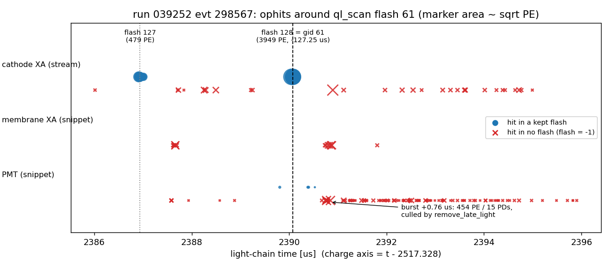
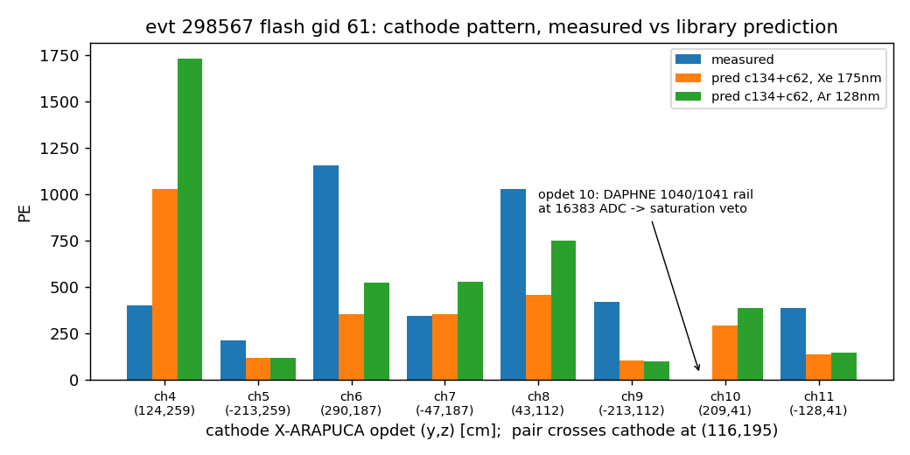

# PDVD Q/L-matching debug: run 039252 evt 298567, ql_scan flash 61 (−127.2 µs)

Investigation of three suspicions raised while hand-scanning event 298567: the
flash at −127.2 µs (ql_scan display "flash 61") that should match the
cathode-crossing pair c62 (top volume) + c134 (bottom volume) shows (1) no
signal on any wall X-ARAPUCA or PMT despite high predicted PE, (2) doubts
whether the Xe 175 nm photon library really beats the Ar 128 nm one, and
(3) a predicted-vs-observed cathode pattern different enough to suspect a
channel-mapping bug.

**Status: analysis only — no toolkit code or config was changed.** All inputs
are our own pipeline products.

## Repro

```bash
cd pdvd
# numbers + figures of this doc (reads the two calib dumps + opflash archive):
python3 ql_light_calib/debug_qlmatch_evt298567.py
# inputs (already produced by the standard chain):
#   work/039252_0/calib-evt298567.json           Xe/175nm production dump
#   work/039252_0/128nm-calib-evt298567.json     Ar/128nm twin
#   work/039252_light298567/opflash_pdvd-wct.tar.gz
#   input_data_light/np02vd_raw_run039252_1176_*_rawwf.root  (rawwf_trigoff)
```

Identification bridge (the viewer shows `flash_gid` and the calib-dump time):

| ql_scan display | calib dump | light chain |
|---|---|---|
| flash **61**, −127.25 µs | `gid=61`, `id=128`, `time=−127.25`, 3949.2 PE | opflash row 128, t = 2390.079 µs |

Charge axis = light-chain time + `offset_bot_us` (−2517.328 µs, archive
metadata). Bundles for gid 61: c134 (apa 0, auto-selected, χ²/ndf 397.3/34,
KS 0.355, pred 2138 PE) and c62 = uid 4000062 (apa 4, χ² 432.1/33, KS 0.330,
pred 1743 PE). Note c134 is *also* auto-selected by the neighboring group
gid 62 (calib id 129, −113.55 µs, an 11.9 PE flash, χ² 38.0) — the known
one-cluster-many-flashes failure mode.

---

## 1. "Wall X-ARAPUCAs / PMTs show nothing" — confirmed real, and why

**Symptom.** Measured PE is nonzero only on cathode opdets 4–9,11. The c134
prediction alone puts ~184 PE on the +y bottom membrane XA (opdet 18), ~60 PE
each on z-wall PMTs 20/22, ~250 PE summed over PMTs. Measured: 0.

**Evidence (raw waveforms, not inference).**

- Wall XAs and PMTs are 1024-tick self-trigger snippets (cathode XAs are
  continuous 7.5 ms streams). Snippet *coverage is not the problem*: PMT
  snippets exist whose windows span the flash time (e.g. opch 3200 window
  starts 2389.696 µs), and membrane snippets from 2386.6 µs cover it too.
- In those windows the samples at 2390.08 µs are at pedestal (opch 3200:
  2–3 ADC above ped at sample 24, vs 7568 ADC at its own pulse). **The wall
  PDs genuinely saw no light at the pair's flash time.** The light-SP chain
  lost nothing.
- Event-wide, snippet-vs-cathode hit alignment is healthy (median Δt
  −0.08 µs membrane / −0.11 µs PMT, from the chain's own 25 713 ophits), so
  this is not a timestamp/extraction problem either.

**The nearby burst.** There *is* a real wall/PMT burst 0.76 µs later
(2390.75–2390.93 µs): opch 3200 60.7 PE, 3230 64.7, 3210 15.3, 3080 13.1,
2080/2081 39.3/43.5, 2070/2071 16.1/16.0, plus 136.6 PE on cathode 1031 —
454 PE over 15 PDs. A python re-implementation of the OpFlashFinder pipeline
(reproduces the chain's 398 flashes exactly) shows this burst **did form its
own flash candidate at 2390.838 µs and was then deleted by
`remove_late_light`**: the 3949-PE flash 0.76 µs earlier predicts
hyp_pe = 3949 × (112/360) × exp(−759/1600) = 764 PE of Ar-triplet late light,
and (454 − 764)/√764 = −11 < 3σ ⇒ culled (`OpFlashFinder.cxx:180-223`, PE-only
test, no spatial check). Its hits are the `flash = −1` cluster in the figure.



Spatially the burst is **not** the missing predicted light of c62/c134: it
concentrates on the bottom-volume −y/low-z corner (PMTs at (y,z) ≈ (0,−54),
(0,−156), (−170,−54), (−221,−110) cm and the −y bottom membrane XAs), while
the pair lives at y 116–274, z 187–235 cm. It is separate physical activity
(the same double structure repeats after flash 127: a wall burst at +0.7 µs,
also culled).

**Root cause of the symptom.** Not light-SP. The wall PDs were dark because
the *prediction* is wrong there, not because signal was lost — see §3. The
`remove_late_light` cull is a genuine secondary finding: it silently deletes
real, spatially-distinct flashes that follow a bright flash within a few µs
(454 PE / 15 PDs here). If such a culled flash is ever the true match of a
cluster, the cluster cannot be matched at all. *Candidate improvement (not
implemented): a default-OFF pattern-aware late-light test (late light shares
the parent's PD pattern; this burst does not).*

## 2. Xe 175 nm vs Ar 128 nm library — Xe verdict stands

Mask-matched comparison (identical channel set per bundle: active and not
auto-masked in *both* dumps, so the Ar dump's extra masks of Xe-only channels
13/29/39 cannot skew ndf), over all 18 events of run 039252, 1267 paired
auto-selected bundles, measured PE identical on both sides:

| metric (per bundle) | median Xe | median Ar | Xe better |
|---|---|---|---|
| KS distance | **0.365** | 0.449 | **75 %** |
| χ²/ndf, free scale | 0.694 | 0.716 | 60 % |
| corr(√meas, √pred) | 0.569 | 0.564 | 43 % |

Xe is clearly better in shape (KS) — same conclusion as the adoption study
(toolkit 0adb15fa). Flash 61 itself is a statistical tie (Xe KS 0.345 vs Ar
0.284, χ²/ndf 0.6 both) and does not contradict the sample-wide verdict; the
cathode figure below also shows Ar is *more* peaked than Xe while the data is
*flatter* than both — moving to Ar would make §3's residual worse.

## 3. Cathode pattern mismatch — mapping ruled out; it is saturation + model

**Mapping audit — clean at every layer:**

1. *Library build*: `photlib/sample_ann.py` position-gates each ANN channel
   against as-built opdet positions; the stored `wct_opdet` map in
   `work/ann_vis_v5_{128,175}nm.npz` is the **identity** on all live channels
   (dead 24/27/28/34), and `export_wct_photlib.py` copies the channel axis
   verbatim.
2. *Data-driven, assumption-free*: over 802 bright cathode flashes (all 18
   events), scoring measured-vs-predicted cathode shape under **all 40 320
   permutations** of the 8 cathode opdets: the identity ranks **1st**
   (mean corr 0.130); the "library-in-DAPHNE-order" hypothesis ranks 4331st,
   pair swaps and z-flips far worse. No permutation beats identity.
3. *Library content*: probing the 175 nm library 30 cm off each cathode
   module returns that module's own channel as argmax with ~50× margin.

**What actually distorts flash 61's cathode pattern:**

- **Saturation veto on the hottest module.** Both DAPHNE channels of opdet 10
  (1040/1041) rail at 16383 ADC for 12/11 samples exactly at the flash —
  opdet 10 was in fact the brightest cathode module in raw ADC, and the
  saturation veto (detect/veto_saturation, from the run-29107 campaign)
  removes its hits entirely: measured 0 vs ~294 predicted. All other 15
  cathode streams stay below rail.
- **Model shape residual.** The pair crosses the cathode at (y,z) ≈
  (116,195) cm; the library correctly makes the nearest module ch4 dominant
  (vis 0.026 vs 0.007 next). The data is much flatter (measured ch4:ch5 =
  1.9 vs predicted 8.5) with ch6/ch8 hottest. This is the known
  optical-model/efficiency residual, not an index scramble.



**Global calibration context** (Σ over 1141 bright auto-matched flashes,
run 039252): measured light shares are cathode/wall-XA/PMT = 92 / 7 / 1 %,
predicted 76 / 17 / 7 %. Per-channel pred/meas is ~1 for the good wall XAs
(ch0/3/18/19 = 0.96/0.69/1.06/0.99) but 4–8× for ch2/ch13, and for PMTs
ranges from ~1.2–1.6 (ch15/21/35/37/38) up to 13× (ch14, low-response), 48×
(ch17), 106× (ch33) and 135× (ch16) — the known dim/faulty channels — while
uncoated ch32 (eff 0 in the model) does respond. This is why the c134 bundle
"expects" hundreds of wall/PMT PE that healthy data never shows at this
level: the per-PD efficiency model, not the geometry, is the dominant error —
consistent with the earlier per-channel `measured_pe_scale` study (gain
signal < topology error, not yet deployable).

## Findings summary

1. **Light-SP is exonerated** (Q1): wall XA/PMT raw waveforms are flat at the
   flash time; nothing was lost in decon/ophit/flash for *this* flash.
2. **`remove_late_light` deletes real distinct flashes** shortly after bright
   ones (454 PE / 15 PDs here, PE-only test) — worth a default-OFF
   pattern-aware knob if a scan case ever needs such a flash as a match.
3. **Xe 175 nm stays the right default** (Q2): mask-matched KS better in 75 %
   of 1267 bundles.
4. **No cathode mapping bug** (Q3): identity wins an exhaustive 40 320-
   permutation test; library build and content verified independently.
5. **Saturation veto distorts bright-flash patterns**: the brightest cathode
   module (opdet 10) reads 0 PE. QLMatching currently treats that 0 as data.
   *Candidate improvement (not implemented): propagate a per-flash saturated-
   channel mask into the χ²/KS so vetoed PDs are excluded, default-OFF.*
6. **Prediction-side wall/PMT overestimate** is the real source of the "PMTs
   should have high PE" expectation: measured shares 92/7/1 % vs predicted
   76/17/7 %, with known-dim PMTs (14/16/17/33) overpredicted 13–135×.
   Per-channel efficiency calibration remains the dominant residual.
7. Scan bookkeeping: c134 is auto-selected by *both* gid 61 and gid 62 —
   one-cluster-many-flashes remains the top auto-error pattern.
