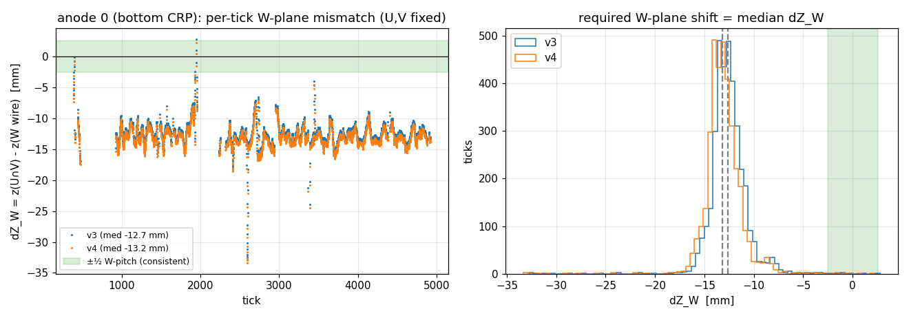
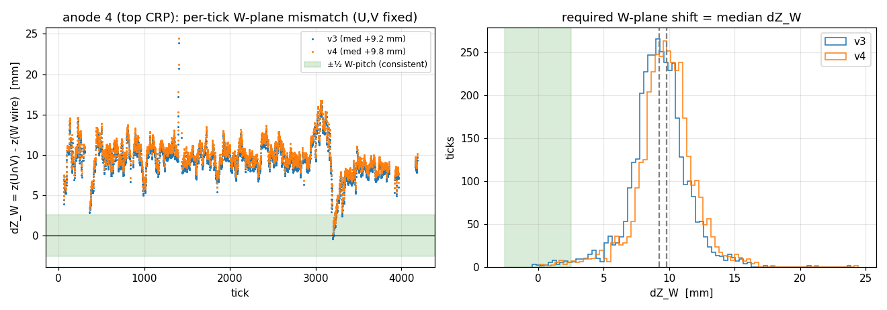

# PDVD U/V–vs–W wire-offset calibration from real tracks (run 39324)

Measured from real signal (read-only on all inputs, 2026-06-07).
Reproduce with `pdvd/pdvd_uvw_offset.py`.

## Why

PDVD imaging leaves **gaps**. A blob only forms where a U-wire, a V-wire and a
W-wire all cross at one transverse (Y,Z) point — three-plane consistency in
`RayGrid`/`GridTiling`. The prior file audit
(`img/docs/protodune-wire-geometry-channel-mapping-audit.md`,
`docs/pdvd-wire-geometry-v3-v4.md`) showed the wire **positions** are fine and
that **v4 = v3 channel map + v5 GDML positions**; it left **one thing unprovable
from the files alone**: the induction **U/V vs collection W registration** (no
upstream test pins the U/V channel↔wire pairing). This note measures that
registration directly from charge.

The check is exactly the one suggested: **at each time tick, use the wire
geometry to test whether the U and V hits are consistent with the W hit (to
within ±½ pitch), and find the offset that makes them match.**

## Tracks used

Run 39324, event 0 (DNN-ROI SP magnify files in `pdvd/work/039324_0/`), one clean
isolated track per CRP type:

| CRP | anode | face | U chan | V chan | W chan | ticks |
|---|---|---|---|---|---|---|
| bottom | 0 | 1 | 75–125 | 1010–1090 | 2020–2070 | 0–5000 |
| top    | 4 | 8 | 6530–6610 | 7460–7550 | 8480–8630 | 0–4500 |

W is collection (un-wrapped) so the W window fixes the face unambiguously; the
quoted U/V windows are the face-matching induction segments. Each track is a
single clean diagonal in all three planes (`wire-offset-figs/track-anode{0,4}.png`).

## Method

Per tick (charge from the `gauss` SP histograms `h{u,v,w}_gauss{anode}`), keeping
the **wire geometry fixed**:

1. Charge-weighted centroid channel for U, V, W (ticks with all three planes lit
   and a narrow, single-track profile; ~3500/event survive).
2. Map the U and V centroid channels to their **wire lines in (Y,Z)** and
   intersect them → crossing point `P = (y, z_cross)`.
3. Read the measured **W wire z**, `z_W`, for the W centroid channel (W wires are
   vertical → constant z).
4. **Mismatch** `ΔZ_W(t) = z_cross − z_W` — the distance, along the W pitch, by
   which the W plane would have to move to sit under the charge that U and V see.
   Consistent ⇔ `|ΔZ_W| < ½·W-pitch = 2.55 mm`.

The required **W-plane shift** (U,V untouched) is `median ΔZ_W`. Because the
induction planes are mirror-symmetric (`pdir_U`,`pdir_V` share their wire-direction
component and oppose along W-pitch), the predicted W depends only on `pU+pV`, so the
same correction can equivalently be made on the induction side as **one symmetric
U/V strip offset** `dp = ½·ΔZ_W` (a pitch shift applied equally to U and V; in
*channel* index it is opposite-signed on U vs V, since their numbering runs in
opposite pitch senses). Pitch: U=V=7.65 mm, W=5.10 mm.

## Result

Both CRPs are **grossly inconsistent today**: with the shipped geometry, **0–1 %
of ticks fall within ±½ W-pitch** — i.e. essentially every point of the track
fails three-plane closure → gaps. A single rigid shift recovers **83–90 %**.

| CRP / anode | geom | required W-plane shift ΔZ_W | in W-pitch | consistent ±½pitch (before→after) | equiv. symmetric U/V offset |
|---|---|---|---|---|---|
| bottom / 0 | **v4** | **−13.2 mm** | −2.59 | 0 % → 90 % | −6.6 mm (−0.86 strip) |
| bottom / 0 | v3 | −12.7 mm | −2.48 | 0 % → 90 % | −6.3 mm (−0.83 strip) |
| top / 4 | **v4** | **+9.8 mm** | +1.92 | 1 % → 83 % | +4.9 mm (+0.64 strip) |
| top / 4 | v3 | +9.3 mm | +1.81 | 1 % → 83 % | +4.6 mm (+0.60 strip) |

per-tick scatter (RMS) of ΔZ_W is 1.9 mm (bottom) / 2.2 mm (top) — **below** the
2.55 mm half-pitch, which is why centering on the median lands most ticks inside
tolerance. ΔZ_W is **flat in tick** (`wire-offset-figs/dzW-anode{0,4}.png`) even
though the track's local W-slope changes ~2× along its length — so this is a
**geometric** offset, **not** an induction-vs-collection timing skew (a timing
skew would scale with the local slope and would not be flat).


*Bottom CRP (anode 0): per-tick ΔZ_W sits at −12 to −14 mm, far outside the green
±½ W-pitch consistency band; v3 and v4 nearly coincide.*


*Top CRP (anode 4): ΔZ_W ≈ +9–10 mm, opposite sign.*

Equivalent **channel-index** statement of the symmetric U/V offset (v4):
bottom CRP **U −0.86 / V +0.86 channels**, top CRP **U −0.64 / V +0.64 channels**
— in both CRPs U decreases and V increases, opposite signs because the two
induction planes' channel numbering runs in opposite pitch directions. (Beware: the
channel-numbering *direction* also flips between top and bottom, so the same channel
sign does **not** mean the same physical shift — see *Top vs bottom consistency*.)

### Recommended offset

Apply on top of **v4** (the better-positioned base; v3 differs only ~0.5 mm here):

- **Bottom CRP (anodes 0–3):** move the W collection wires by **ΔZ_W ≈ −13 mm**
  (≈ −2.6 W-pitch) along z — or, keeping W fixed, shift the U & V strips
  symmetrically by **dp ≈ −6.6 mm** (≈ −0.86 induction pitch; U −0.86 ch / V +0.86 ch).
- **Top CRP (anodes 4–7):** move the W wires by **ΔZ_W ≈ +10 mm** (≈ +1.9 W-pitch)
  — or shift U & V by **dp ≈ +4.9 mm** (≈ +0.64 induction pitch; U −0.64 ch / V +0.64 ch).

The offset is **different in sign and magnitude between top and bottom CRP**, so it
is *not* one global numbering convention; it tracks the CRP. The values are also
**fractional**, not an integer number of wires — so this is a *continuous*
U/V-vs-W transverse registration error (consistent with a relative plane
mis-placement / sub-pitch channel-map offset), not a clean off-by-N-wires bug.

## Top vs bottom consistency — and the symmetry question

The two CRPs need shifts that are **opposite in sign and unequal in magnitude**:

| CRP / anode | W shift ΔZ_W | +Z move of U[0],V[0] | in W-pitch |
|---|---|---|---|
| bottom / 0 | −13.2 mm | **+3.3 mm** | −2.6 |
| top / 4 | +9.8 mm | **−2.45 mm** | +1.9 |

**Applying these as-measured BREAKS the bottom-{0,2} ↔ top-{5,7} first-wire symmetry.**
The nominal geometry — and the `U[0]−W[0]`/`V[0]−W[0]` table in
`pdvd-wire-geometry-v3-v4.md` §1 — is **mirror-symmetric about the cathode**: bottom
{0,2} and top {5,7} carry the *same* value set with U↔V swapped, **same (positive)
sign**. The cathode mirror is `x→−x` only, so **z is preserved**; preserving that
symmetry therefore requires the **same +Z correction on both CRPs** (same sign *and*
magnitude). The measured corrections are **opposite sign** (+3.3 vs −2.45 mm) and ~30 %
apart, so bottom-{0,2} and top-{5,7} would no longer be mirror images.

**What the opposite sign means.** A genuinely mirror-symmetric cause — a wire-position
error, or a channel-map offset wired identically in both CRPs — would give the **same**
sign z-shift on top and bottom. An **opposite-sign** shift instead tracks something that
**flips between the two CRPs**, most naturally the **drift direction** (bottom drifts
+x, top −x). So the residual looks more like a CRP/drift-oriented z-offset than a
mirror-symmetric geometry/channel error. (It is still flat in tick — not a track-slope
timing skew.)

**Caveats that could inflate the asymmetry:** one track per CRP, measured on
*different* faces (anode 0 back face vs anode 4 front face), at different track angles.
The clean test is several tracks per CRP on both faces: if the true correction is
symmetric, more statistics should pull |bottom| and |top| together; if the opposite-sign
asymmetry persists, it is a real CRP/drift effect to model — **not** a simple symmetric
wire re-registration. **So: not yet consistent; the asymmetry is the main open question.**

## Recipe — build a U/V-vs-W-corrected file from v4

Keep U and V; rigidly shift each CRP's W (collection, plane ident 2) plane in z by
ΔZ_W (`pdvd/make_v4_uvwcal.py`):

```python
from wirecell.util.wires import persist
store = persist.load("protodunevd-wires-larsoft-v4.json.bz2")
DZ = {0:-13.2, 1:-13.2, 2:-13.2, 3:-13.2,    # bottom CRP, mm
      4:+9.8,  5:+9.8,  6:+9.8,  7:+9.8}       # top CRP
pt_dz = {}
for anode in store.anodes:
    for fi in anode.faces:
        for pi in store.faces[fi].planes:
            if store.planes[pi].ident != 2:          # W plane only
                continue
            for wi in store.planes[pi].wires:
                w = store.wires[wi]
                pt_dz[w.tail] = pt_dz[w.head] = DZ[anode.ident]
pts = list(store.points)
for idx, dz in pt_dz.items():
    pts[idx] = pts[idx]._replace(z=pts[idx].z + dz)
persist.dump("protodunevd-wires-larsoft-v4-uvwcal.json.bz2",
             persist.todict(store._replace(points=pts)))     # NOTE: dump todict(store)
```

**Validation (mechanism).** Regenerating and re-measuring on the same tracks gives
**median ΔZ_W ≈ 0** and **consistency 90 % (bottom) / 83 % (top)**, up from 0–1 %.
This confirms the file-writing path; the *physics* validation is to point the
production config at the new file, **re-image run 39324, and confirm the gaps
close** (not done here — analysis only).

Equivalent alternative (induction side): instead of moving W, shift the U **and** V
strips by `dp` (−6.6 mm bottom / +4.9 mm top) along pitch — same effect on the
image, since only `pU+pV` relative to W matters.

## v3 vs v4

For *this* registration metric v3 and v4 are within ~0.5 mm (the v4 reposition
moves W by ~−5.5 mm on the bottom CRP but moves U+V by almost the same amount, so
the U/V-vs-W *combination* barely changes). v4 is the better geometry overall —
its wire **positions** come from the v5 GDML — but that improvement is in the
absolute placement this internal U∩V-vs-W test is largely blind to; **the ~2–2.6
W-pitch U/V-vs-W offset survives into v4 unchanged** and is exactly the residual
calibrated here. In other words: v4 fixes the positions, this fixes the U/V↔W
registration; they are independent and v4 still needs this.

## Shifting U and V instead of W — sync with the first-wire-offset doc

`pdvd-wire-geometry-v3-v4.md` describes the U/V-vs-W registration as the **first-wire
offset along +Z** (`U[0]−W[0]`, `V[0]−W[0]`). This note used a **W shift**. They are
the same correction seen from the two sides — applying *either* is verified to give
the same 90 % / 83 % consistency. The dictionary (v4 base):

| apply on | parameter | bottom / anode 0 | top / anode 4 |
|---|---|---|---|
| **W** plane (keep U,V) | ΔZ_W along z | −13.2 mm | +9.8 mm |
| **U & V** planes (keep W) | dp along induction pitch | −6.6 mm (−0.86 strip) | +4.9 mm (+0.64 strip) |
| ⤷ same, as **+Z move of U[0],V[0]** | ΔZ_U = ΔZ_V | **+3.3 mm** | **−2.45 mm** |
| ⤷ same, as **channel** index | U / V | −0.86 / +0.86 ch | −0.64 / +0.64 ch |

Geometry-fixed relations: **ΔZ_W = 2·dp** and the **+Z move of the first U/V wires is
ΔZ_U = ΔZ_V = −dp/2 = −ΔZ_W/4** (the induction pitch makes 60° with the W pitch, so
only the cos 60° = ½ z-projection of an induction-pitch shift counts toward W; hence
the factor between `dp` and `ΔZ_{U,V}`).

**So, to shift the first U and V wires:** move the **whole U and V planes toward +Z by
3.3 mm on the bottom CRP, and toward −Z by 2.45 mm on the top CRP** (U and V move
together, by the *same* amount). Equivalently slide them −0.86 / +0.64 induction strip
along pitch. (The absolute `U[0]−W[0]` value in the other doc depends on its wire-0 /
front-back-face / +Z-sign labeling; the **change** quoted here is convention-free.)

### Does this keep the bottom-{0,2} ↔ top-{5,7} symmetry? (Q1)

**No — as measured it does not.** Bottom {0,2} and top {5,7} have identical first-wire
offsets with U↔V swapped (the other doc's table). Adding a common +Z shift keeps that
symmetry **only if the shift is the same on both CRPs**. The measured shifts are +3.3 mm
(bottom) and −2.45 mm (top) — opposite sign and unequal — so the symmetry is broken.
The full discussion (why opposite sign points to a drift-oriented cause, and what to
measure next) is in **Top vs bottom consistency** above.

One thing that *is* clean: my correction is a **common-mode** U=V shift (U and V move
the same way), which is a *different component* from the U≠V *differential* first-wire
offsets the other doc tabulates — those are a fixed geometric feature of the wrapping;
this rides on top of them.

## Caveats / next steps

- **One track, one event, one face per CRP.** The offset is robust *within* each
  track (flat ΔZ_W, v3≈v4) but should be confirmed on more tracks, the other face
  of each anode, and anodes 1–3 / 5–7 before baking it into a wire file.
- Only the `pU+pV` combination is constrained by W, so a *single* track cannot
  separate an asymmetric U-only vs V-only component from the symmetric one; the
  symmetric form is assumed (and is what "the same offset for U and V" means).
- To apply: regenerate the wire file with the W plane (or U+V) shifted by the
  amounts above, or carry the shift as a channel-map offset, then re-image
  run 39324 and confirm the gaps close. (Not done here — analysis only.)

## Files

- `pdvd/pdvd_uvw_offset.py` — the analysis (parameterized over anode/geometry).
- `pdvd/make_v4_uvwcal.py` — the recipe: build the corrected wire file from v4.
- `pdvd/docs/wire-offset-figs/` — `track-*`, `dzW-*` (per-tick mismatch +
  distribution), `yz-*` (U∩V crossings) for anode 0 and anode 4.
