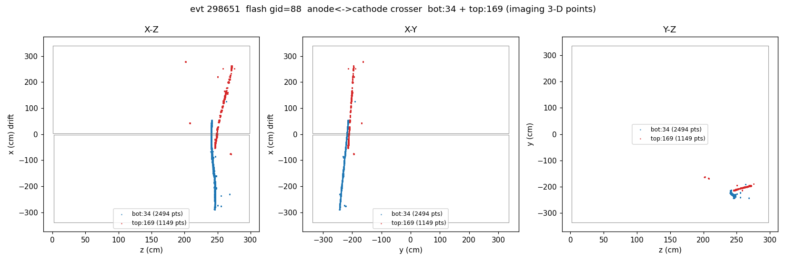
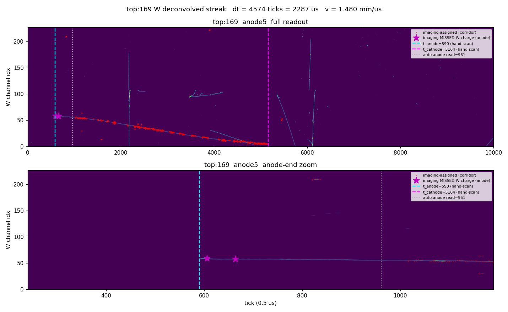
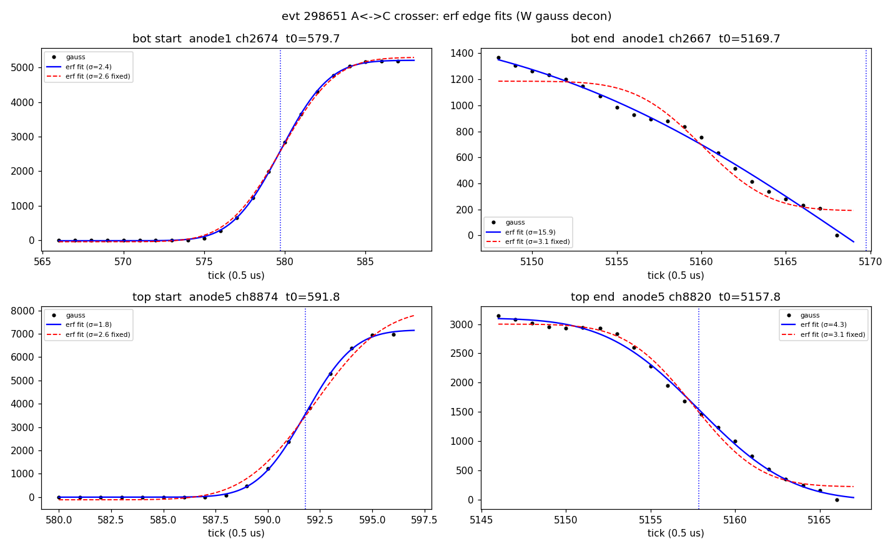
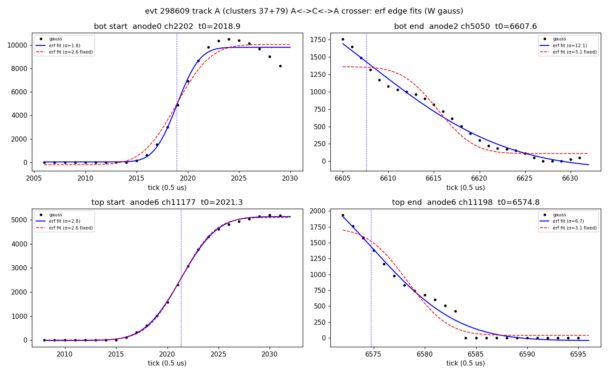
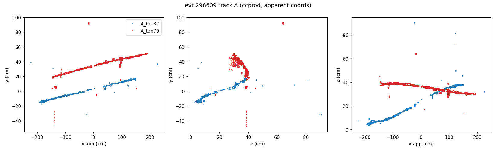
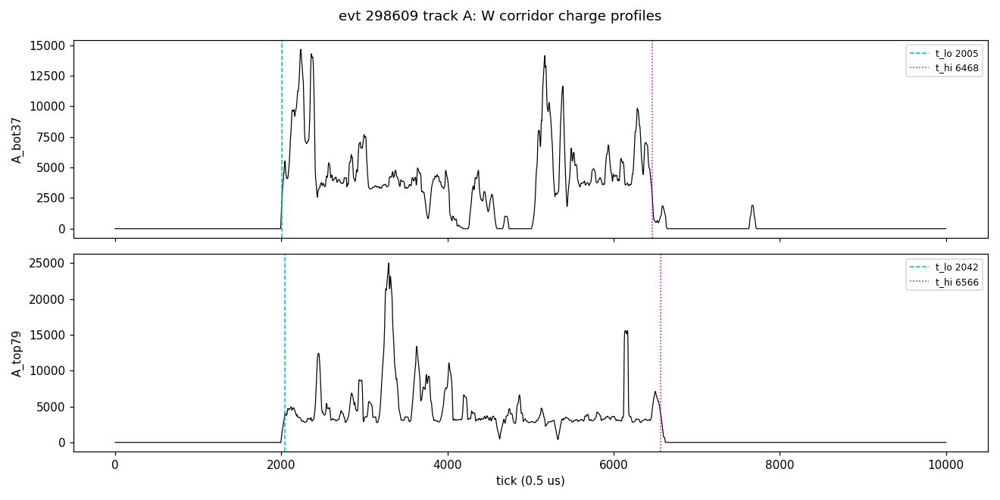

# PDVD drift velocity — imaging-independent cross-check from an anode↔cathode crosser (run 039252 evt 298651)

**Repro**
```
cd pdvd/docs/qlmatch
OMP_NUM_THREADS=4 python3 scripts/crosser_drifttime_298651.py   # projections + W streaks + profiles
python3 scripts/fit_endpoints_298651.py                         # erf endpoint fits (sanity check)
# writes track_298651_xyz.png, wdecon_298651_{bot34,top169}.png,
#        driftprofile_298651.png, endpoint_fits_298651.png
```
Inputs: `pdvd/work/039252_6_v153/calib-evt298651.json` (Q/L calib dump, `drift_speed=0.153`),
the deconvolved SP frames `pdvd/work/039252_6/protodune-sp-dnnroi-frames-anode{0..7}.tar.bz2`
(member `frame_gauss<N>_298651.npy`, 1536×10000, tick = 0.5 µs), and — for the erf
fits — the Magnify ROOT files `pdvd/work/039252_6/magnify-run039252-evt6-anode{1,4,5}-dnnroi.root`
(`hw_gauss<N>`, from `run_sp_to_magnify_evt.sh -d 039252 6`). Wire geometry
`protodunevd-wires-larsoft-v5.json.bz2`.

## Summary

A single golden anode-to-cathode crossing cosmic in evt 298651 gives an
**imaging-independent** drift-velocity measurement of

> **v = 0.14807 cm/µs = 1.481 mm/µs**
> (bot half 0.14783, top half 0.14831 cm/µs)

read directly off the deconvolved **W (collection)** waveform. The adopted endpoint
ticks are the **error-function edge fits** of the Magnify decon (`hw_gauss<N>`; see
the fit section below): bot:34 (anode1) **579.8 → 5160.0**, top:169 (anode5)
**592.2 → 5157.5**. These refine the initial by-eye reads (576→5166, 590→5164,
which gave 0.14777) by locating each edge's smearing-corrected midpoint; the two
agree to ~0.3 %. The drift distance is **DFULL = 338.55 cm** (= 3369.1 + 16.4 mm)
— the charge is timed at the **W collection plane**, so the relevant distance is
cathode→W = `u_cathode` (336.91, cathode→shield-plane anode edge) **+ 1.64 cm**
(shield→W: W |x|=341.55 vs shield 339.91). Using 336.91 instead would give
0.14736 cm/µs.

This sits **below** the current data-chain default (0.153), the toolkit default
(0.1568) and the old cathode-pinned convention (0.1586) — all in cm/µs. It is a
**single-track cross-check, not a recalibration**: the two halves agree to
0.0005 cm/µs, but the endpoint read carries an ≈±0.003 cm/µs systematic and this
is one event, so it flags that the data v may sit a few percent low but does not
by itself move the default.

## The track

Q/L match `flash gid=88 (t=364.7 µs, group=89) ← clusters [bot:34, top:169]`,
both bundles flagged `at_cathode`.
**[2026-07-22 correction: gid88 was the *wrong flash* — the raw-light closure
of `23_pdvd-light-timing-check.md` §7 (track C) shows the true flash is the
raw 2800.6/2802.0 µs pair, ≈78 µs earlier; the ccprod chain (v=0.148073 +
13.507 µs pull, clusters renumbered 35/95) now picks it (#84, folded
300.11 µs).  The velocity below is unaffected — it never used the flash.]** `bot:34` = calib `apa=0` (bottom crate,
anode 1), 2494 pts; `top:169` = `apa=4` (top crate, anode 5), 1149 pts. The two
clusters are the bottom and top halves of one cosmic that enters the bottom
anode, crosses the full bottom drift, passes the shared cathode, and exits the
top anode — so **each half spans one full drift, cathode→W collection plane =
DFULL = 338.55 cm** (`u_cathode` 336.91 cathode→shield-anode, + 1.64 shield→W;
v6 shield-FV geometry).



The X-Z / X-Y panels show the two halves forming one continuous line crossing
x≈0 (the cathode) in the middle. Note `top:169` (red) is visibly **sparser /
broken** in 3-D — its induction-plane SP has gaps — while `bot:34` (blue) is
dense. This is why the drift-time endpoints must be read from the W **collection**
waveform, not from the 3-D imaging points.

## Method and why it is clean

For a collection wire the deconvolved (gauss) trace places a narrow pulse at the
**charge-arrival tick**. Reading the earliest (anode-end) and latest
(cathode-end) charge tick of a half and differencing them gives the full drift
time; with DFULL known, `v = DFULL / (Δt·0.5 µs)`. Two properties make this
robust:

- **v-independent.** The processing drift speed enters only the later tick→x
  conversion, never the waveform. So reading endpoint *ticks* off gauss is **not**
  circular with the v153 (v=0.153) processing — it is an independent measurement.
- **Offset-cancelling.** Δt = t_cathode − t_anode is a *difference*, so the SP
  `ctoffset` and the per-crate trigger offsets cancel. Absolute ticks are
  offset-contaminated and are never used.

Endpoints are read from the charge, guided (not defined) by imaging: the cluster
(y,z) points define a W-channel corridor that rejects the many other cosmics
crossing the same wires at other drift times; within that corridor the endpoint
ticks come from where the gauss charge actually starts and stops. Crucially, at
the anode end we **recover W charge on wires the 3-D imaging never assigned**
(top's induction gaps), by extending the streak into adjacent wires that carry
broad, track-like collection charge.

## Endpoint reads

Adopted endpoints = **erf edge fits** of the deconvolved W (`hw_gauss<N>`; fit
section below), DFULL = 338.55 cm (cathode→W collection plane), tick = 0.5 µs:

```
half     anode |  t_start  t_end  |  dt(ticks)  dt(us)   v(cm/us)  v(mm/us) | by-eye read
--------------------------------------------------------------------------------------------
bot:34       1 |   579.8   5160.0 |   4580.2   2290.10   0.14783    1.478   | 576 -> 5166
top:169      5 |   592.2   5157.5 |   4565.3   2282.65   0.14831    1.483   | 590 -> 5164
--------------------------------------------------------------------------------------------
                                                 mean v = 0.14807 cm/us = 1.481 mm/us
```

The initial by-eye Magnify reads (last column, → 0.14777) and the independent
automated corridor reads (bot 614→5148; top 606→5149, anode recovered from
imaging-missed wires 8873/8874) both agree with the fitted endpoints to within a
few ticks / ~0.3 % in v.

### bot:34 — imaging captures both ends


The band runs edge-to-edge from the by-eye t_anode=576 (cyan) to t_cathode=5166
(magenta); the anode-end zoom shows the charge onset right at the cyan line, with
the automated corridor read (614, grey dotted) sitting a few ticks inside. Thin
diagonals crossing the band are other cosmics (rejected by the corridor). The
adopted erf-fit endpoints (579.8 → 5160.0, within a few ticks of the marked lines)
give Δt = 4580 ticks → **v = 0.14783 cm/µs (1.478 mm/µs)** (DFULL = 338.55 cm).

### top:169 — the anode end is truncated by imaging, recovered from the W charge


The imaging corridor (red dots) stops at tick 961 (grey dotted), but the W
collection charge continues to the by-eye t_anode=590 — the magenta stars mark
the extra charge on wires **8873, 8874** that the induction-gapped imaging never
assigned to the cluster. Using the imaging corridor alone would give a spuriously
short Δt (v ≈ 0.162 cm/µs); the true charge terminus (adopted erf-fit endpoints
592.2 → 5157.5) gives Δt = 4565 ticks → **v = 0.14831 cm/µs (1.483 mm/µs)**. This
is a direct demonstration of exactly the failure the W-waveform read is meant to
avoid.

### Both halves together


The two W-corridor charge profiles: dashed = t_anode, dotted = t_cathode.

## Endpoint fits (error-function edge model — sanity check)

Repro: `python3 scripts/fit_endpoints_298651.py` → `endpoint_fits_298651.png`.

To back the by-eye endpoint reads with a quantitative estimate, each start/end
edge of the W gauss trace is fit with an **error function** — a charge step
convolved with the smearing kernels, `S(t) = base + A/2 (1 ± erf((t−t0)/(√2 σ)))`
— whose midpoint `t0` is the arrival tick of the end charge. The smearing is:

- **software filter** (all edges): the gauss output uses HfFilter `Gaus_wide` =
  exp(−½(f/σ_f)²), σ_f = 0.12 MHz (`sp-filters.jsonnet`), whose time kernel has
  **σ_sw = 1/(2π σ_f) ≈ 2.64 ticks**;
- **+ longitudinal diffusion** (cathode/end edges only — the anode-end charge has
  ~zero drift): σ_x = √(D·t_drift), D = 6.5782 cm²/s → time via v →
  **σ_diff ≈ 1.66 ticks**, so **σ_end = √(σ_sw²+σ_diff²) ≈ 3.12 ticks**.

Channels (Magnify `hw_gauss`): bottom anode1 ch2674 (start) / ch2667 (end); top
anode5 ch8874 (start) / ch8820 (end). Note the top anode-end charge sits on
ch8874, wires the 3-D imaging did not assign — the same imaging-truncation the
corridor method had to recover.



| edge | fitted t0 | fitted σ (free) | expected σ |
|---|---|---|---|
| bot start (ch2674) | 579.8 | 2.4 | 2.64 (sw) |
| bot end (ch2667)   | 5160 (σ fixed) / 5170 (free) | 16 | 3.12 (sw⊕diff) |
| top start (ch8874) | 592.2 | 1.8 | 2.64 (sw) |
| top end (ch8820)   | 5157.5 | 4.3 | 3.12 (sw⊕diff) |

The three sharp edges (both starts, top end) fit clean error functions with widths
matching the expected **software** (starts, ~2.6 ticks) and **software⊕diffusion**
(top end, ~3 ticks) smearing — validating both the model and the endpoint reads.
The **bottom cathode edge** is instead a broad, roughly linear ramp (σ≈16) — an
intrinsic drift-parallel track segment near the cathode, not a pure smeared step —
so its end tick carries a ~10-tick ambiguity (5160–5170).

Velocity from the fits (DFULL = 338.55 cm):

- software/diffusion **fixed-σ** (as specified): bot 0.14783, top 0.14831 →
  **mean 0.14807 cm/µs**;
- **free-σ** (data-driven): bot 0.14752, top 0.14829 → mean 0.14791 cm/µs.

The **fixed-σ fit is the adopted result (0.14807 cm/µs)**; the free-σ fit and the
by-eye read (0.14777) agree to within ~0.3 %. The fits nudge each start slightly
later and each end slightly earlier — the smearing-corrected midpoints sit just
inside the eyeball's baseline-crossing points — with a near-cancelling effect on Δt.

## Validity checks

- **Cathode-end coincidence: 2.5 ticks (1.25 µs).** bot t_end=5160.0, top=5157.5.
  Both halves reach the same physical cathode at the same drift time → one cosmic,
  both full-drift, meeting at the cathode.
- **Anode-end coincidence: 12.4 ticks (6.2 µs).** bot t_start=579.8, top=592.2. For
  a coincident cosmic read by two crates the two anode ticks should differ by the
  crate **trigger-offset** difference, `trigger_offsets_us = [-2515.34, -2507.74]`
  → 7.6 µs = 15.2 ticks; the observed 12.4 ticks matches. Both halves reach their
  anodes.
- **Per-half agreement: v_bot=0.14783, v_top=0.14831 cm/µs** — 0.32 %. The two
  halves are independent drift volumes (different crates, different wires) and give
  the same velocity, which is the strongest internal check that the endpoints are
  the true track ends and DFULL is the right distance for both.

## Uncertainty and interpretation

The dominant uncertainty is the endpoint tick read — chiefly the bottom cathode
edge, whose broad drift-parallel tail gives a ~10-tick ambiguity (±5 ticks moves v
by ≈ ±0.0003 cm/µs). Taking this with the 0.32 % bot/top spread,
**v = 0.1481 ± ~0.002 cm/µs (1.481 ± 0.02 mm/µs)** from this event. The
measurement has real discriminating power — full drift is ~4573 ticks at 0.1481 vs
~4269 at 0.1586 cm/µs (~300 ticks), far larger than the read precision — but it is
one track. Reported as measured; no parameter was tuned toward any candidate value
(CLAUDE.md §5.7).

**The systematic that could fake a low v** is an **endpoint over-extension**:
v below all three candidates means Δt is *large*, which is what reading the
cathode terminus too late or the anode terminus too early would produce. The audit
is therefore "does the track actually *end* at the marked tick," not merely "is
there charge there." This was checked directly in the Magnify decon
(`work/039252_6/magnify-run039252-evt6-anode{1,5}-dnnroi.root`, `hw_gauss1` /
`hw_gauss5`): the owner hand-scanned both W streaks and the adopted endpoints are
then the erf edge fits (bot 579.8→5160.0, top 592.2→5157.5), each band running
cleanly to its terminus and top's anode-end charge being one connected track (not
a detached stub or crosser). By-eye, erf-fit and automated-corridor reads agree to
within a few ticks, so the low v is a property of the track, not an
over-extension artefact.

**Follow-up (not done here):** repeat on the other validated full-drift crossers
(the candle/crosser tags carry several per run) to turn this single cross-check
into a population with a real mean and spread before considering any change to the
1.53 data default. The drift-velocity decision and the SP-side response velocity
remain as recorded in `02_pdvd-anode-time-consistency.md` §8.12 and the
`project_pdvd_drift_velocity_calib` notes.

---

## Second A–C–A crosser: run 039252 evt 298609, ccprod clusters 37+79 → v = 0.14794 cm/µs

**Added 2026-07-22.** The follow-up above is started: the same measurement on a
second, independent full-drift crosser — the evt 298609 track matched (correctly,
`two_boundary` set, strength 0.976) to flash #117 (folded 1019.45 µs, 22117 PE);
Bee ccprod cluster 37 = calib (apa0, ident5) bottom half, 79 = (apa4, ident3) top
half.  This track crosses anode-to-anode, so **both** halves span the full
cathode→W drift.  It is steeper (nearly drift-parallel: ~30 W channels per half
vs ~150 for the doc-06 track), so each tip channel carries a long streak whose
onset/end is the track terminus.

**Repro**
```
cd pdvd/docs/qlmatch
OMP_NUM_THREADS=4 python3 scripts/aca_crossers_298609.py   # corridors + streak/profile figures
python3 scripts/fit_endpoints_298609.py                    # erf edge fits + velocity
```
Inputs: `work/039252_3_ccprod/calib-evt298609.json` (drift_speed=0.148073,
trigger_offsets_us = [−2500.301, −2499.101]), magnify
`work/039252_3_magnify/magnify-run039252-evt3-anode{0,2,6}-dnnroi_magnify.root`
(`hw_gauss<N>`), wires v5.

Adopted endpoints = erf edge fits (same model and σ's as the first crosser:
σ_sw = 2.64 ticks for the anode edges, σ_sw⊕diff = 3.12 for the cathode edges;
fixed-σ midpoints adopted), DFULL = 338.55 cm, tick = 0.5 µs:

```
half     tip chans (anode) |  t_start   t_end  |  dt(ticks)  dt(us)   v(cm/us)
------------------------------------------------------------------------------
bot:37   a0 ch2202 / a2 ch5050 |  2018.9   6615.5 |  4596.6   2298.3   0.14731
top:79   a6 ch11177 / ch11198  |  2021.3   6578.3 |  4557.0   2278.5   0.14858
------------------------------------------------------------------------------
                                        mean v = 0.14794 cm/us  (free-σ: 0.14813)
```





Validity checks:

- **Anode-edge coincidence: 2.4 ticks — exactly the crate skew.**  The two
  anode touches are simultaneous (one muon); the crates' trigger offsets differ
  by 1.2 µs = 2.4 ticks with the bottom window opening later ⇒ bottom edge at
  the *lower* tick.  Observed: bot 2018.9 vs top 2021.3.  This is also the
  empirical proof (with the raw-light closure, doc 23 §7) that the low-tick end
  of the streak is the anode.
- **Light closure:** both anode edges map to raw light 3523.26 µs, sitting
  +3.6 µs after the 20%-rise of the (bright, 22117 PE) raw cathode pulse at
  flash #117 — the matched flash is the physical one.
- **Cathode edges are the soft side**, as in the first crosser: fitted σ 12.1
  (bot) / 6.7 (top) vs 3.12 expected — the near-cathode segment of this
  drift-parallel track trails charge, so the end reads carry a ~5–10-tick
  ambiguity that dominates the bot/top v spread (0.86 %).
- **Truncation-free:** unlike the third crosser of these events (evt 298609
  clusters 83+50, whose cathode arrivals fall ≈360 ticks past the 10000-tick
  readout and which therefore yields no velocity), both cathode arrivals here
  (ticks 6578/6616) are well inside the window.

Combined with the first crosser (0.14807, halves 0.14783/0.14831) the two-track
result is

> **v = 0.1480 ± 0.002 cm/µs**  (4 half-measurements: 0.14731, 0.14783,
> 0.14831, 0.14858)

still below the 0.153 data-chain value in use when doc 06 was first written and
below the 0.1568 toolkit default; the ccprod chain has since moved to 0.148073,
which these two tracks support.  Population follow-up beyond n=2 remains open.
