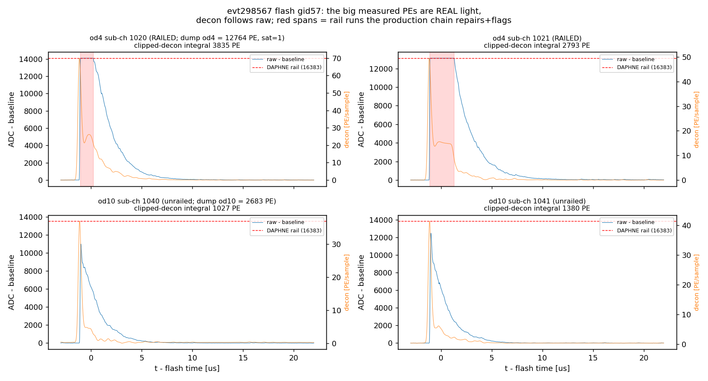
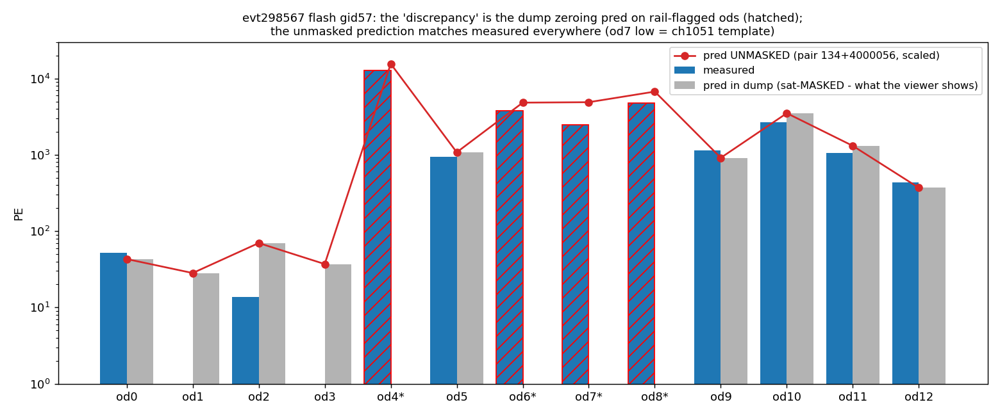
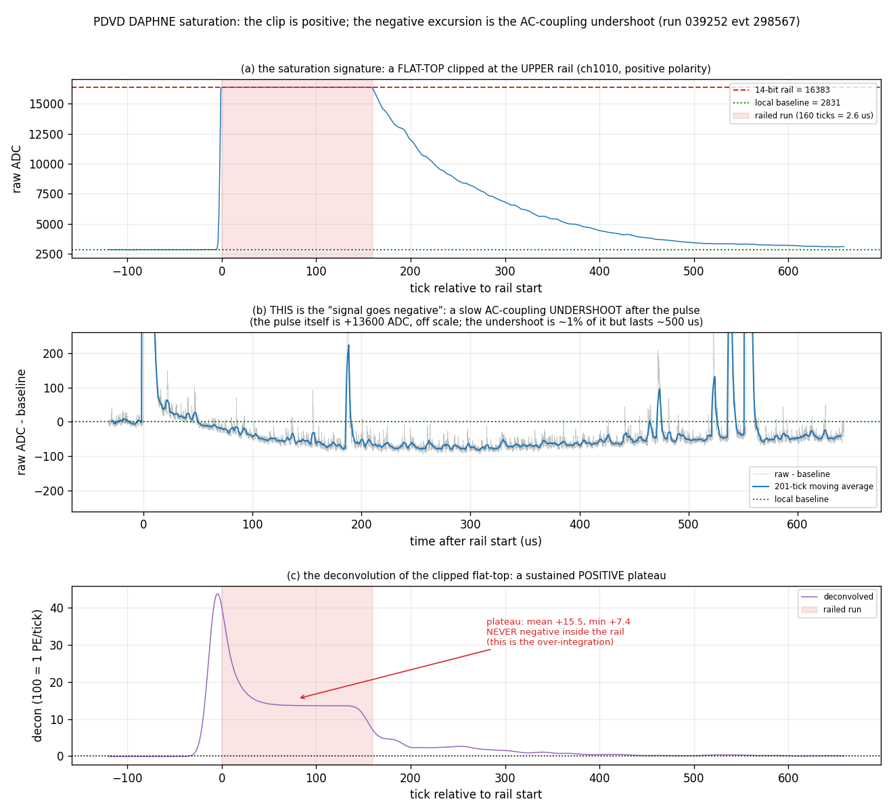
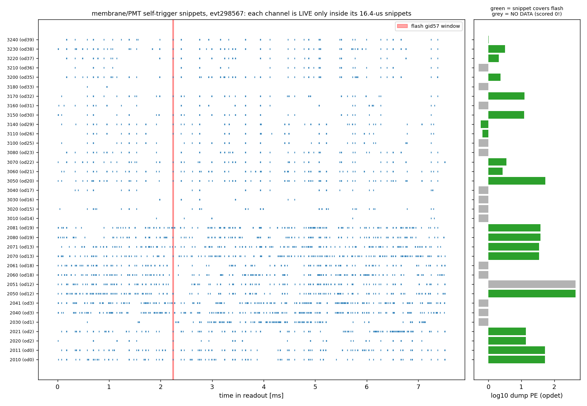
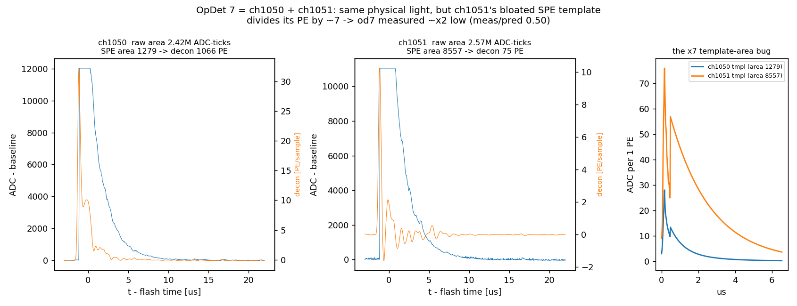
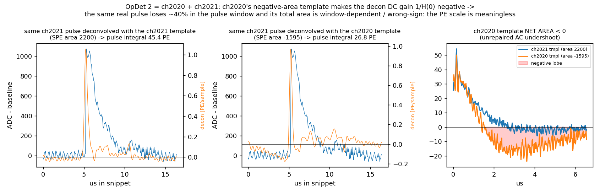

# Why some flashes show measured light ≫ predicted (evt 298567 flash gid 57)

**Repro:**
```
cd pdvd/docs/qlmatch && python3 scripts/lightpattern_sp_investigation.py   # tables + figs 1-5
cd pdvd && python3 docs/qlmatch/scripts/saturation_signature.py            # §"Saturation" + fig 6
# inputs: work/039252_0_arcal/calib-evt298567.json (+ the 17 sibling arcal dumps),
# input_data_light_rawwf/np02vd_raw_run039252_*_rawwf.root,
# toolkit cfg pdvd-spe-templates.json / pdvd-opch-map.json,
# photlib/pdvd-photlib-vis-v5-128nm.json
```

## Symptom

On the `arcal` candle round (port 5019), flash gid 57 (t = −270.6 µs, grp 58,
matched to the cathode-crosser pair top:56 / bot:134) shows several cathode
X-Arapucas with measured PE far above the displayed prediction (od4: 12764
measured vs 0 predicted) while other X-Arapucas agree well.  Similar
mismatches appear on other cathode crossers.  Since Q-L matching *is* the
comparison of these patterns, this had to be understood.

## What the waveforms say: the light is real and the deconvolution is faithful

Raw-waveform examination (fig 1) shows one genuine, simultaneous, very bright
flash on **all** cathode channels: a single prompt peak at the flash time with
a ~8 µs tail, 30k PE total, four opdets railed at the DAPHNE 14-bit ceiling.



Decon PE tracks the raw area on every cathode channel:

| od | sat | dump PE | raw-area PE | dump/raw |
|---|---|---|---|---|
| 4 | 1 | 12764 | 9061 | 1.41 (repair recovers clipped area) |
| 5 | 0 | 940 | 1160 | 0.81 |
| 6 | 1 | 3773 | 3955 | 0.95 |
| 7 | 1 | 2462 | 2189 | 1.12 |
| 8 | 1 | 4738 | 5571 | 0.85 |
| 9 | 0 | 1139 | 1183 | 0.96 |
| 10 | 0 | 2683 | 2880 | 0.93 |
| 11 | 0 | 1052 | 1124 | 0.94 |

And the **unmasked** prediction of the selected pair (vis-loop replica ×
adopted per-type eff scale factors) matches measured on every cathode
channel, *including the railed ones* (fig 5):

| od | meas | pred shown in viewer | pred unmasked | meas/unmasked |
|---|---|---|---|---|
| 4* | 12764 | **0** | 15570 | 0.82 |
| 6* | 3773 | **0** | 4825 | 0.78 |
| 7* | 2462 | **0** | 4887 | 0.50 (ch1051 template, below) |
| 8* | 4738 | **0** | 6728 | 0.70 |
| 5/9/10/11/12 | — | = unmasked | — | 0.77–1.25 |



So there is **no per-flash signal-processing failure here** — the mismatch
decomposes into three real, independent defects:

## Saturation: what it looks like, and how the deconvolution handles it

Because the four railed OpDets above are exactly the ones the display got
wrong, this section spells out the saturation signature and the current
processing. Numbers/figure: `scripts/saturation_signature.py` (fig 6),
run-039252 evt298567, all 16 cathode channels. Depth statistics and the
estimator comparison are **not** repeated here — they are
`11_pdvd-saturation-recovery.md` §2.



The three answers in one line each: **(a)** saturation is a positive flat-top
at the upper 14-bit rail; **(b)** the negative excursion your colleague
remembers is real but it is the AC-coupling undershoot *after* the pulse, not
the clip; **(c)** the deconvolution never goes negative inside the rail — it
produces a positive plateau, and that plateau is the actual pathology.

### The signature is a positive flat-top — there is no negative clip

PDVD DAPHNE runs **positive raw polarity** (`input_polarity: 1`,
`flash.jsonnet:93`), so a saturating pulse pins at the **upper** 14-bit
ceiling **16383**. The signature is a run of consecutive samples at exactly
16383 with a flat top (fig 6a: ch1010, 160 ticks = 2.6 µs at the rail).
This is precisely what `OpDecon` tests for — `q[i] >= m_saturation_adc`
(`OpDecon.cxx:494`, `saturation_adc` default 16383).

The lower rail is never reached. Across all 16 cathode channels of evt298567
the minimum ADC is 1592–5326 against pedestals of ~1800–5300, and the count of
samples at ADC ≤ 0 is **0**. So saturation itself never drives the signal
negative.

Note that the rail test is applied to the **raw** trace (`trace->charge()`,
`OpDecon.cxx:489`) *before* `input_polarity` is used — polarity only enters
later, inside `deconvolve()` (`OpDecon.cxx:371`). So detection is
polarity-independent: it always asks "did the ADC hit the ceiling", which is
the physically right question for a DAPHNE 14-bit rail regardless of how the
pulse is oriented afterwards.

### Where the signal DOES go negative: the AC-coupling undershoot

The colleague's recollection is real, but it is **not** the rail — it is the
slow undershoot that follows any bright pulse on an AC-coupled front end
(fig 6b). Measured against a **local** pre-pulse baseline (median of the quiet
band 250–50 ticks before the rail; the stream-head pedestal must not be used
here, it confounds true undershoot with baseline-reference bias), the deepest
rail of each channel is followed by:

| window after rail exit | median (ADC vs local baseline) | range | channels below 0 |
|---|---|---|---|
| +2 000 ticks (32 µs) | +3.0 | [−26, +134] | 4/9 |
| +8 000 ticks (128 µs) | **−51.0** | [−105, −33] | **9/9** |
| +30 000 ticks (480 µs) | **−96.0** | [−175, −78] | **9/9** |

(9 = the channels whose pre-band is genuinely quiet, std < 15 ADC; on the other
7 another pulse sits in the band so the local baseline is meaningless — the
script prints and excludes them.)

So: the baseline sags ~50–100 ADC below its pre-pulse level and stays there for
**hundreds of µs** — a fraction of a percent of the ~13 600-ADC pulse height,
but ~100× longer than the pulse.

**It is not saturation-specific.** Repeating the measurement on 33 bright but
**unrailed** pulses (amplitude 4295–12476 ADC, isolated, rail neighbourhoods
excluded — §D of the script): **33/33 undershoot**, median −25 ADC at +8k
ticks. Crucially the undershoot/amplitude ratio matches the railed pulses:

| pulse class | n | median undershoot/amplitude @ +8k |
|---|---|---|
| bright, unrailed | 33 | **0.31%** |
| railed (clipped, amp ≥ 13600) | 9 | **0.37%** |

Same ratio ⇒ this is **linear AC coupling** — the front end differentiates
every pulse and pays back its area slowly — not a saturation-recovery
artifact of the amplifier. Clipping neither causes nor worsens it. Two
consequences matter downstream:
- Later flashes in the same stream sit on a depressed baseline.
- Averaging pulses without undershoot repair biases an SPE template's **area**
  low — and if the undershoot dominates, negative. That is exactly root cause
  3's ch2020 (area −1595): a *harvest* artifact, not a per-event decon
  behavior.

### Does the deconvolution go negative inside the rail? No

A clipped flat-top deconvolves to a sustained **positive plateau** — checked on
four channels (fig 6c), never a single negative sample inside the railed run:

| ch | rail len | decon inside rail: min | max | mean | n(<0) |
|---|---|---|---|---|---|
| 1010 | 160 | +7.4 | +40.2 | +15.5 | 0/160 |
| 1050 | 178 | +6.1 | +30.5 | +10.7 | 0/178 |
| 1021 | 205 | +10.9 | +46.7 | +16.2 | 0/205 |
| 1040 | 117 | +11.3 | +46.9 | +17.7 | 0/117 |

(units: 100 = 1 PE/tick.) The plateau *is* the pathology: the WI filter
G = conj(H)·F/(|H|²+eps) is an inverse filter, so a flat top — which no SPE
shape can produce — deconvolves into a wide, flat, positive excess. That is
what makes `OpHitFinder` over-integrate it into one ~16 µs hit and fragment it
into spurious wide hits, and why the mask exists at all (`OpDecon.h:90-99`).
The decon *does* dip slightly negative **between** pulses (min ≈ −0.1 to −0.3,
i.e. −0.003 PE/tick) — that is baseline wander/undershoot leak, not the rail.

### How the current chain deals with it

Two distinct mechanisms, easily confused:

**1. The negative baseline (undershoot) is `OpRoi`'s job, not the decon's.**
`OpDecon`'s own baseline handling is crude by design: one pedestal from the
first `pre_trigger − pedestal_buffer` = **20 samples** (`OpDecon.cxx:362-365`)
— for the cathode that is 20 samples at the head of a **468 864-sample**
record, so any later sag is *not* tracked. The removal happens downstream in
`OpRoi` (cathode only, `wct-light-reco.jsonnet:98`):
- a high-pass `H(f) = 1 − exp(−(f/τ)²)`, τ = 0.05 MHz ≈ 1/20 µs — scintillation
  (<20 µs) passes, the ~500 µs undershoot does not (`OpRoi.h` step 1);
- median subtraction + MAD rms, ringing channels zeroed (steps 2–3);
- ROI hysteresis (step 4);
- **step 5**: per-ROI, subtract the line through the ROI endpoints, so every
  ROI starts and ends at exactly zero — a local detrend that removes whatever
  undershoot pedestal the ROI is sitting on.

Membrane XA / PMT have **no** `OpRoi` — they are 1024-tick (16.4 µs) snippets
deconvolved and hit-found directly. Over 16.4 µs the slow undershoot is
essentially constant, so the per-snippet 20-sample pedestal absorbs it. Their
failure mode is the template harvest (2020), not the per-event decon.

**2. The rail itself: detect → (repair) → flag, never silently.** All knobs
default OFF (byte-identical); the PDVD runners turn them on:

| stage | knob | what it does |
|---|---|---|
| `OpDecon` | `detect_saturation` | flags each run of ≥`saturation_min_samples` samples ≥16383 as a `"saturation"` ChannelMaskMap range `[tbin+lo, tbin+hi)`, padded by `saturation_pad` (`OpDecon.cxx:482-509`). Per **run**, not per trace — a full stream is not vetoed wholesale on one stray sample. |
| `OpDecon` | `saturation_repair` | before deconvolving, fills each railed run with the two-sided exponential bridge `min(rising extrapolation, falling back-extrapolation)`, clamped ≥ the measured samples, τ fit from the channel's SPE template (`repair_runs`, `OpDecon.cxx:320-354`). Deconvolves a **copy**; the mask is still emitted (repair AND flag). |
| `OpHitFinder` | `veto_saturation` | drops hits overlapping a flagged range — the old behavior, now **off**. |
| `OpHitFinder` | `flag_saturation` | keeps the hit, appends a 10th column = rail-overlap flag. |
| `OpFlashFinder` | (data-driven) | 10-col input ⇒ emits the per-flash per-OpDet `flash_sat` tensor. |
| `QLMatching` | `use_saturation_flag` | flagged channels leave that flash's opdet mask ⇒ excluded from chi2/KS/LASSO, while the **measured PE stays** in the flash and the dump. |

The ruling operating point (`_spcov`, PDVD production default since
2026-07-15) is **keep-and-mark + repair**: `detect_saturation=true`,
`veto_saturation=false`, `flag_saturation=true`, `saturation_repair=true`,
`use_saturation_flag=true`. Rationale in `11_pdvd-saturation-recovery.md` §3:
repair is a bounded second-order improvement (+2% at clip depth 1.4, +9% at 2,
+23% at 4), the median railed bright flash has a depth ≈5.6 rail where no
waveform estimator is reliable — so the *physics* fix is flag propagation, not
a better estimator. Root cause 1 below is the display half of that: the
prediction must be shown unmasked even though the fit excludes the channel.

## Root cause 1 — saturation mask zeroes the *displayed prediction*

With `use_saturation_flag` on, QLMatching removes rail-flagged channels from
the per-flash opdet mask (QLMatching.cxx:1316-17); the bundle prediction is
accumulated under that mask (:1445), and the calib dump writes this *masked*
`pred_pe` (:2878, :2892-94) while the measured `pe` is written unmasked
(:2803-05).  The ql_scan viewer never reads `flash["sat"]`, so it displays
meas 12764 vs pred 0.  **37% of auto-selected bundles** in the candle round
sit on sat-flagged flashes — this artifact is everywhere.

Per owner direction: the full predicted light must always be shown; the
saturation flag should only exclude channels from chi2/KS/LASSO.

## Root cause 2 — self-trigger coverage blindness (membrane XA + PMTs)

Cathode 10xx channels are full 468800-sample (7.5 ms) streams.  Membrane
20xx / PMT 30xx channels are **self-triggered 1024-sample (16.4 µs)
snippets** — each channel is live only ~5–30% of the readout (fig 4).  When
no snippet overlaps a flash window, the chain silently scores measured = 0.



Flash-57 correspondence is exact (T3): every membrane/PMT opdet with a
covering snippet has nonzero dump PE; every one without reads 0.0 — e.g. od1
(ch2030) reads 0 against a 28-PE prediction, od3 (ch2040/41) 0 against 37,
while covered od12 (ch2050) reads 438 vs 370 predicted.

Brightness scan over the 18-event round (T4): P(meas>0) for membrane opdets
is 0.27/0.32/0.32 for flashes of 1–3k/3–10k/>10k PE — **flat in brightness**
⇒ the zeros are readout duty cycle, not dim light.  ~70% of membrane/PMT
entries entering chi2/KS — and the 2026-07-14 per-type efficiency fits — are
fake zeros.  The adopted membrane ×1.655 and PMT ×0.352 scale factors are
therefore contaminated and must be refit once coverage is handled.

Across the 42 strict-crosser anchors (T5), membrane opdets 0/1/2/12/19 have
median meas/pred = 0.00 — entirely explained by coverage.

## Root cause 3 — broken SPE templates distort per-channel PE scales

In OpDecon's wiener-inspired branch the net PE normalization is
1/template-area (DC gain 1/H(0), OpDecon.cxx:391-93); OpHitFinder's
scale/spe_area (100/100) cancel.  A wrong template *area* is a wrong
measured-PE scale.  Outlier scan of `pdvd-spe-templates.json` (T6):

| channel | area (ADC·ticks) | peers | opdet | effect |
|---|---|---|---|---|
| 1051 | 8557 | cathode ~500–1300 | 7 | od7 PE ÷~2 (fig 2: same pulse, 1066 PE via ch1050's template vs 75 via ch1051's) |
| 2020 | **−1595** | membrane ~1200–2400 | 2 | decon DC gain < 0: pulse-window PE −40%, total area window-dependent/wrong-sign — PE meaningless (fig 3); its own 24 self-triggers are noise (sick channel) |
| 2011 | 3132 | sibling 2010 = 1221 | 0 | od0 half low ×2.6 |
| 3010 | 15935 | PMT ~900–2500 | 14 | PE ÷~10 |
| 3020 | 8479 | PMT ~900–2500 | 15 | PE ÷~5 |

These match the anchor table: od7 low with a *tight* band (0.77 [0.63,
1.03]), od14 pinned at ~0, od15 at 0.64.





The ch2020 negative area is the harvest-side face of the undershoot measured
in §"Saturation" above: averaging pulses whose AC-coupling undershoot was not
repaired drags the template area down, and here past zero.

## Why it hid

- The saturation **veto** used to zero the measured PE on exactly these
  bright channels — meas 0 vs pred 0 looked "consistent".  The keep-and-mark
  chain (2026-07-14) surfaced the real measured values, and the masked
  prediction became visible as a huge mismatch.
- The per-type factor fits aggregate Σmeas/Σpred at flash level, where
  covered channels dominate the numerator — the fake zeros depressed the
  ratio smoothly instead of breaking it.
- Template outliers hit single sub-channels of ganged pairs; the healthy
  sibling kept the opdet nonzero, hiding the scale error inside the pair sum.

## Fix (phased; each phase gated and committed separately)

1. **Dump/viewer**: QLMatching dumps the *unmasked* prediction (`pred_pe`)
   while chi2/KS/LASSO keep the masked one; ql_scan viewer marks sat-flagged
   channels and excludes them from the ratio panel (toolkit + wcp commits).
   **DONE — toolkit af0a0284** (knob-off dumps proven identical field-by-field
   old-vs-new code, 198 flashes / 5171 bundles, setarch -R, reference tags
   `work/039252_0_p1{on,off}{old,new}`; knob-on: fit metrics identical,
   pred_pe gains the full prediction on exactly the 2303 sat-flagged
   entries — flash 57 ods 4/6/7/8 now dump 15570/4825/4887/6728) **+ wcp
   viewer commit** (orange rings/triangles for sat channels, ratio panel
   excludes them; session-tested on port 5021 scratch).  NOTE for A/B
   bookkeeping: owner commit 3c30cf58 (static ch_mask += {2,16,17,33})
   landed between the `arcal` round and these gates — dumps produced before
   it carry small nonzero pred on ch 2/17/33; not a code effect.
2. **Coverage chain**: OpHitFinder `emit_coverage` → coverage tensor →
   OpHitMerge passthrough → OpFlashFinder `flash_cov` companion tensor →
   optical PCs → `Opflash::get_cov` → QLMatching `use_coverage_flag` /
   `coverage_min` masking + dump `cov` array; viewer "no data" marker.  All
   default-OFF, byte-identical off; PDVD runners turn them on.
   **DONE — toolkit commit (flash/aux/clus/match) + wcp runner/viewer
   commit.**  Gates: compiled-config knob-off byte-identical for
   `wct-light-reco` and `wct-clustering` (keys present on);  PDVD light
   knob-off hash PASS vs the pre-change `_satrep` archive
   (`work/039252_light298567_p2off`); PDVD QL knob-off dump byte-identical
   vs the Phase-1 binary (`039252_0_p2qloff` == `039252_0_p1onnew`); PDHD
   all-PD light hash PASS (`029107_allpd1015_p2covgate` vs reference);
   wcdoctest flash/match/aux/clus.  Knob-on smoke (`_p2cov` /
   `039252_0_p2qlcov`): `flash_cov` for gid57 reproduces the raw snippet
   coverage channel-by-channel (od1/od3/od12 = 0, min-over-subchannel
   rule); the true crosser bundle (57, top:56) chi2 drops **459.6 → 91.8**
   (ndf 18→13, KS 0.120→0.088) once the fake zeros leave the fit; every
   flash carries some uncovered channel; 54/108 auto-selections move
   (intended knob-on physics change → Phase-4 refit).  Coverage semantic:
   an OpDet counts covered only when ALL its ganged DAPHNE sub-channels
   cover the window (od12's half-covered pair is masked); dead-RO OpDets
   24/27/28/34 have no mapped raw channel ⇒ cov 0 (already static-masked).
3. **SPE templates v2**: validated re-harvest (`pd_plot/spe_v2.py`);
   `pdvd-spe-templates-v2.json` behind the `flash.jsonnet` `spe_file`
   selector defaulting to v1; runner env `PDVD_SPE_V2` (default ON) selects
   v2.  **DONE — toolkit commit (v2 json + OpDecon DC≤0 warn) + wcp commit
   (builder, `spe_v2` TLA, runner env).**  Two-tier validation:
   - *shape* (area>0, area/amp within 2.5× the population median) flags
     ch2020 (−21.7), ch3010 (310), ch3020 (84);
   - *ganged-pair amplitude* (harvest 1-PE mode ratio vs the coincident
     bright-pulse gain ratio, n=44–2205 pulses/pair, only the HIGH-side
     member is the latch) flags ch1051 (mode 82 vs sibling-implied 28.9)
     and **ch2011** (mode 64 vs implied 39.5 — the ×2.6 area split of od0
     is a mode latch, not a real gain difference: the pair's bright pulses
     match at ratio 0.912).
   Repairs = population-average shape (valid channels only) × validated
   1-PE amplitude (sibling transfer for 1051/2011; own mode for
   2020/3010/3020).  Areas: 1051 8557→1042, 2011 3132→1510, 2020
   −1595→1836, 3010 15935→612, 3020 8479→1092; the other 46 channels are
   bit-for-bit == v1.  Gates: compiled-config knob-off byte-identical
   (HEAD-compiled vs new, knob-on flips exactly the three OpDecon
   `spe_file` keys); light knob-off hash PASS
   (`work/039252_light298567_p3off` == `_p2off`, member hash e3729ae8);
   wcdoctest-flash 31/31; the new OpDecon warn fires on v1 (template 18 =
   ch2020, all three branches) and is silent on v2.  Knob-on smoke
   (`_p3v2`): bright crosser flash od7 2462→6546 (×2.66; meas/unmasked-pred
   0.50→1.34, type factors to be refit in Phase 4), od0 51.9→73.2 (×1.41),
   every other opdet identical; flash census 405→415 — all movers are
   ~10–16 PE threshold-hoppers rescaled across the flash minPE cut, plus
   one fake 260-PE flash dominated by od2=225 (ch2020 negative-template
   artifact) that correctly disappears.
4. **Reprocess + refit**: 120-event reprocess at the new operating point,
   coverage-aware refit of the per-type efficiency factors (owner gate before
   adoption), fresh candle round on port 5019.  **DONE (factors deliberately
   NOT changed — owner gate open)** — light `_spcov` 120/120 + QL `spcov`
   120/120; fit_qtol_crossers.py now drops `cov<1` channels from both sums.
   Cathode closes at unity (per-group 1.006, global 1.078, od7 healed to
   1.14); membrane/PMT show a bimodal residual no scalar factor can absorb
   (5/6 membrane opdets: median meas/pred = 0.00 with 54–66% zeros in
   covered flashes vs ×4–10 overshoots at dim predictions — the 128 nm
   wall-channel shape problem, plus self-trigger selection bias at dim
   pred).  Recommendation to owner: keep the f7c66ab8 factors; details +
   per-opdet census in `12_pdvd-qtol-recalibration.md` §5.  Candle round
   `candles-spcov` (222 keep / 203 add) now serves port 5019.
   **Owner ruling 2026-07-15 (gate CLOSED):** factors kept as-is; the
   `candles-spcov` round accepted; the spcov operating point (keep-and-mark
   + repair + coverage chain + QL sat/cov masking + SPE templates v2)
   promoted to PDVD production default — the runner env defaults are
   ratified, `_spcov` supersedes `_satrep` as the canonical dump record.
   Toolkit defaults stay OFF (byte-identical).

## Verification

- This doc's script regenerates every table/figure from the existing dumps
  (read-only).  Figures:
  - `lightpattern_fig1_raw_decon_cathode.png` — raw vs decon, railed +
    unrailed cathode channels.
  - `lightpattern_fig2_od7_template_bug.png` — ch1050/ch1051 same light,
    ×7 template-area bug.
  - `lightpattern_fig3_ch2020_inversion.png` — negative-area template
    corrupting the decon PE normalization.
  - `lightpattern_fig4_coverage_timeline.png` — snippet livetime vs the
    flash window; covered ⇔ measured>0.
  - `lightpattern_fig5_pattern.png` — measured vs masked vs unmasked
    prediction for flash 57.
  - `lightpattern_fig6_saturation_signature.png`
    (`scripts/saturation_signature.py`) — the saturation signature: (a) the
    positive flat-top clip at 16383, (b) the AC-coupling undershoot that
    follows it (the real "signal goes negative"), (c) the decon plateau,
    positive throughout the rail.
- Smoke case for all fixes: evt 298567 flash gid 57 (od4/6/7/8 sat-marked
  with full pred shown; od1/od3 coverage-masked; od7 ×2.66 after template
  v2).
- Status: knobs-off paths must stay **byte-identical** (hash_archive gates
  per detector); the knob-on operating point is **NOT bit-identical** by
  design and triggers the Phase-4 revalidation + factor refit.
