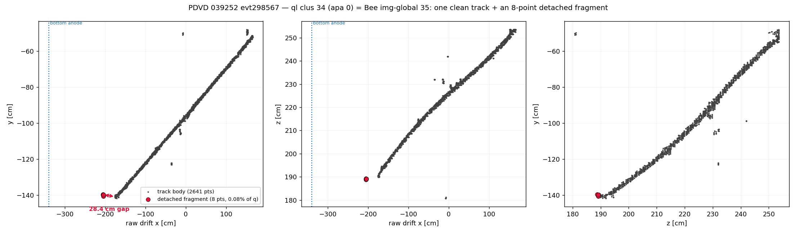
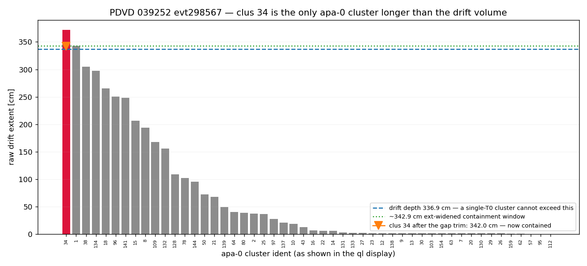
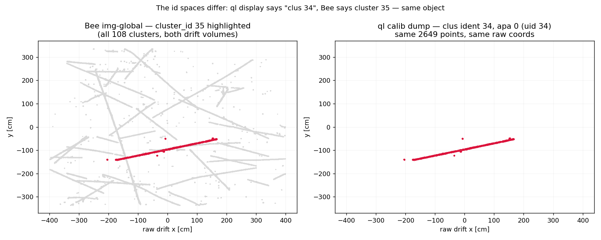

# PDVD 039252 evt298567 — why "clus 34" matches no flash

Status: **root cause found and demonstrated. The fix is PROPOSED, NOT ADOPTED** —
turning it on is not byte-identical and moves 10 of 103 clusters in this event alone
(§6). PDVD production is unchanged; the knob ships default-OFF.

## Repro

```bash
cd pdvd
# the diagnosis, the id bridge, and all three figures
python3 docs/qlmatch/scripts/check_clus34_unmatched.py

# the demo run that fixes it (fresh tag; never writes into _keep)
mkdir -p work/039252_0_gaptrim && cd work/039252_0_gaptrim
for f in ../039252_0_keep/clusters-apa-anode*-ms-{active,masked}.tar.gz; do ln -sf "$f" .; done
cd ..
PDVD_QL_ROBUST_TRIM=1 PDVD_LIGHT_SUFFIX=_keep OMP_NUM_THREADS=4 \
    ./run_clus_evt.sh -s gaptrim -calib 39252 0
```

Inputs: `work/039252_0_keep/calib-evt298567.json` (the canonical `keep`-round dump,
trim off), `work/039252_0_gaptrim/calib-evt298567.json` (trim on),
`work/039252_0_keep/mabc-all-apa.zip`, `work/039252_0_keep/wct_clus_039252_0.log`.

## 1. Symptom

In the ql hand-scan display (port 5019, tag `candles-keep`), cluster **34** — a
2649-point cosmic — shows **no matched flash and no candidate bundles at all**. Every
other cluster of comparable size has a pool of tens to hundreds of candidates.

## 2. Which cluster this actually is

`clus 34` = **apa 0** (bottom / BDE volume), `ident` 34, `uid` 34, 2649 points.

Unambiguous, but only by luck: the display shows `ident`, which restarts at 1 per drift
volume and **collides across apa 0 / apa 4** (18 idents are shared in this event). Here
`uid 4000034` does not exist, so there is exactly one candidate. See §7 for the id
spaces in full.



It is **one clean, continuous track** — PCA singular values 103.8 / 3.7 / 1.2, mean
residual from the principal axis 0.8–2.8 cm across the whole body, no kink and no
density seam. It is *not* an over-merge of two cosmics. But it carries an **8-point
fragment detached by a 28.43 cm gap** off its anode end (red, left panel).

## 3. Root cause

The fragment carries **0.077 % of the cluster's charge** but sets its **raw drift
extent to 371.66 cm**. The bottom drift volume is only **336.91 cm** deep (anode
−339.91 → cathode −3.00, `calib-evt298567.json` `geometry["0"]`).

A flash T0 enters as `flash_x_offset`, which shifts *every point of the cluster
together* (`QLMatching.cxx:1343`, `:1485-1491`). The **extent is therefore
T0-invariant**: if it does not fit the box, no flash can make it fit.



Clus 34 is the only apa-0 cluster in the event longer than the drift volume. It exceeds
the ext-widened containment window (≈343 cm = `u_cathode` 336.91 + `cathode_ext1` 2.0 +
anode floor 4.0) by ~29 cm. Drop the 8 points and the extent is **342.05 cm** — inside.

The chain that turns this into "no candidates":

1. `compute_endpoint_flags` (`match/src/QLMatching.cxx:3555`) takes the post-trim drift
   endpoints and applies the containment gate at `:3775-3779`
   (`first_u > anode_in - margin && last_u < cathode_in && …`). For clus 34 it returns
   `contained = false` **for all 198 flashes**.
2. `require_containment` is **true** for PDVD (`pdvd/wct-clustering.jsonnet:68`), so
   every bundle is dropped before the fit (`QLMatching.cxx:1436`).
3. `dump_calib` **additionally skips uncontained bundles** (`QLMatching.cxx:2951`).

The bundles *were* built — the log proves it:

```
QLtiming build_bundles: ident 298567 nflash 198 ngroups 50 nbundles 9900
```

198 × 50 = 9900, so clus 34 got its 198 candidates like everyone else. All 198 died at
the containment gate, and step 3 then erased the evidence.

**`require_containment=false` would not rescue it either**: a cluster sitting outside
the box predicts ≈0 light and cannot win the fit.

## 4. Why it hid

`dump_calib` skipping uncontained bundles (step 3) is the reason this looks like a
mystery rather than a rejection. The display renders **zero candidates** instead of 198
rejected ones, and there is no "uncontained" indication anywhere in the viewer — so a
structurally-unmatchable cluster is visually indistinguishable from one the matcher
never considered. The comment at `QLMatching.cxx:2945-2949` justifies the skip (an
uncontained bundle carries zeroed metrics and a zero `pred_flash`, so it "only clutters
the hand-scan"), which is true for the *table* but costs the scanner the diagnosis.

## 5. Fix (proposed)

The trim that removes exactly this material already exists and **PDHD already runs it**
— the robust-endpoint trim family, `cfg/pgrapher/experiment/pdhd/qlmatching.jsonnet:306-332`:

```
robust_endpoint_trim: true,          // master switch — the rest are inert without it
robust_endpoint_frac: 0.01,          // point-count judge
robust_endpoint_count: 15,
robust_endpoint_charge_frac: 0.005,  // charge-fraction judge
robust_endpoint_charge_abs: 1500,    // per-point charge-DENSITY ceiling
robust_endpoint_gap: 3.0 * wc.cm,    // detachment (gap) judge, anode end only
robust_endpoint_gap_charge_frac: 0.01,
```

**PDVD never enabled any of it.** Before this work the family appeared nowhere in
`cfg/pgrapher/experiment/protodunevd/` or in `pdvd/wct-clustering.jsonnet`.

Only the **gap judge** can save clus 34, and that is the whole point of it existing: the
fragment is *detached*, not *diffuse*. Its ~2000 q/pt density sits inside the band the
`charge_abs` density ceiling protects, so the density judge would refuse to trim it,
exactly as it refuses to shave a genuine track tip. The gap judge keys on the 28.43 cm
detachment instead (`QLMatching.cxx:3744-3762`); a real anode-piercing track end is
continuous, with slices ~0.08 cm apart. Both PDHD thresholds clear comfortably:
28.43 cm > 3 cm, and 0.00077 < 0.01.

### Gotcha for anyone re-testing this

`robust_endpoint_gap` alone does nothing. The entire block is gated on the master
switch `m_robust_endpoint_trim` (`QLMatching.cxx:3699`), which defaults false. Setting
only the gap keys produces a byte-identical no-op run — this cost a full demo cycle
here.

## 6. Verification — the demo run

`work/039252_0_gaptrim/`, `PDVD_QL_ROBUST_TRIM=1`, everything else at the `keep`
operating point. Config proof from that run's own `.wct-clus.json`:

```
{'robust_endpoint_trim': True, 'robust_endpoint_frac': 0.01, 'robust_endpoint_count': 15,
 'robust_endpoint_charge_frac': 0.005, 'robust_endpoint_charge_abs': 1500,
 'robust_endpoint_gap': 30, 'robust_endpoint_gap_charge_frac': 0.01}
```

| | trim off (`_keep`) | trim on (`_gaptrim`) |
|---|---|---|
| dumped (contained) bundles | 5179 | 5277 |
| clus 34 candidate pool | **0** | **1** |
| clus 34 match | **none** | **flash gid 91, t = 1134.84 µs, 18821.3 PE** |
| | | chi2/ndf **0.47**, KS **0.060** |

Clus 34 is matched, and matched *well* — chi2/ndf 0.47 and KS 0.060 are high-consistent
numbers. The pool is 1 because the cluster is so long that only a narrow T0 range
contains it at all; that single survivor is an excellent fit, which is itself evidence
the trim recovered a real object rather than manufacturing a match.

### This is NOT a free fix

**10 of 103 clusters change their auto-selection** in this event alone:

| uid | trim off | trim on | reading |
|---|---|---|---|
| 34 | UNMATCHED | [91] | the intended rescue |
| 64 | [151, 180] | [180] | **better** — sheds a duplicate flash |
| 80 | [47, 82] | [47] | **better** — sheds a duplicate flash |
| 18 | [125] | [125, 145] | **worse** — gains a second flash |
| 38 | [145] | [145, 146] | **worse** — gains a second flash |
| 4000079 | [110, 133] | [110, 113, 133] | **worse** — gains a third flash |
| 1 | [103] | [104] | flash swap |
| 16 | [66] | [63] | flash swap |
| 128 | [61] | [45] | flash swap |
| 4000014 | [68] | [69] | flash swap |

Total auto-selected bundles 113 → 115. Two clusters shed a spurious duplicate (the
one-cluster-many-flashes error that doc 13 finding 7 calls the top auto-error pattern),
but three others gain one, and four swap flashes outright. **Adoption therefore needs a
full A/B plus a census over the 120-event `keep` farm and a hand-scan of the movers** —
not this one event. The knob ships default-OFF for that reason.

## 7. Cluster ids: ql display vs Bee — they are DIFFERENT integers

This was the second question, and the answer is a trap worth internalising.

| | source | space |
|---|---|---|
| ql display `clus NN` | `cluster["ident"]` in the calib dump (`QLMatching.cxx:2920`); the viewer keys internally on `uid = apa*1000000 + ident` (`:2749`, `ql_scan_viewer.py:198,732`) | **per-drift-volume stage-3 ident**. Restarts at 1 per volume → collides across apa 0/4. Sparse: apa 0 has 50 clusters with idents 1…159. |
| Bee `img-global`, `clustering-global`, `op` | `Cluster::get_cluster_id()` = `ident()`, **re-stamped** by `load_grouping`'s `enumerate_idents()` (`MultiAlgBlobClustering.cxx:2127`) | **fresh global 1…N** over the merged both-volume tree. evt298567: `img-global` = 1–108, contiguous. |

- `img-global`, `clustering-global` and `op` **are the same space as each other**.
- The ql `ident` is a **different space**. Numbers coincide only by accident.
- QLMatching never re-enumerates; it inherits the stage-3 per-APA idents and only mints
  new ones for split sub-clusters (`QLMatching.cxx:996`, `:1019`).

### The bridge for this cluster



```
ql clus ident 34 (apa 0)  ==  Bee img-global cluster_id 35     (400/400 probes, exact)
    both: 2649 pts, x -205.3..166.3, y -141.8..-48.0, z 180.7..253.6
```

**Off by one** — the perfect demonstration of the trap. Bee cluster 34 is a different
object entirely. Map by geometry, never by number.

Two further notes:

- Cluster 35 **is** in `clustering-global` but **absent from `op`** — precisely because
  `op` lists only clusters matched to a flash (`fill_bee_flashes`,
  `MultiAlgBlobClustering.cxx:1966`), and this one is unmatched. Its absence from `op`
  is the same fact as the symptom in §1.
- Compare in `img-global`, not `clustering-global`: `img-global` carries **raw** x
  (−398.5…398.5 here), the same frame as the calib dump, whereas `clustering-global`
  carries the T0-corrected `x_t0cor`. (`clustering-global` also holds 107 ids vs
  `img-global`'s 108 — id 57 is dropped, an unrelated object, not investigated here.)

## 8. Caveat — the containment margin is thin (noted, not chased)

The trimmed extent 342.05 cm clears the ≈343 cm window by only **~0.9 cm**, and ident 1
(342.94 cm) already sits *at* the edge while still being contained — so the true edge is
≥ 342.94 and the "≈343" above is arithmetic, not a measurement. A cluster this close to
the boundary is one `cathode_ext1` / anode-pull tweak away from flipping either way.

That tuning is an **existing open item** (`cathode_ext1` 2.0 cm + 2 cm anode pull are
the runner defaults; the census + A/B are open), cross-referenced here deliberately and
**not** investigated — this doc is scoped to clus 34.

## 9. Knob wiring added by this work (all default-OFF)

- `cfg/pgrapher/experiment/protodunevd/qlmatching.jsonnet` — the 7 `robust_endpoint_*`
  args, null/false-defaulted with the key-suppression idiom.
- `pdvd/wct-clustering.jsonnet` — `ql_robust_trim` (master) + 6 pass-through TLAs.
- `pdvd/run_clus_evt.sh` — `PDVD_QL_ROBUST_TRIM=1` enables the family at PDHD's
  operating point; each value overridable (`PDVD_QL_ROBUST_GAP_CM`, …).

Proofs:

- **Byte-identical when off**: compiled `wct-clustering.jsonnet` with the knob unset is
  byte-identical to the pre-change compile — md5 `fd91614b50cdc42851addb8bc6a72350` both
  sides, `cmp` clean.
- **Compiled-config proof when on**: the diff against the pre-change compile is exactly
  the 7 added keys, nothing else.
- No C++ was touched, so no rebuild and no imaging/clustering gate is involved.
