# PDVD evt298567 — top cluster 97 + bottom cluster 139 is a cathode crosser that Q/L cannot bundle

**Status:** diagnosis + two default-OFF knob families, both byte-identical when off and
NOT adopted: §6.1 `robust_endpoint_gap_cathode` (cathode gap trim) and §10.6
`xtpc_cathode_tol`/`xtpc_cathode_qfrac` (crosser-scoped cathode rescue — repairs this
event's pair end-to-end in the demo). **No production behavior is changed.** Adoption
needs the §10.5 crosser census. §10 (follow-up) corrects the §3/§5.1 point attribution
and answers "can the bundle be saved?" — yes, demonstrated.
**Update 2026-07-18 (§11):** the 120-event census exists. The in-cathode tail is **not
an accident**: 20 waveform-era-supported crosser halves (in 20 different events) carry
contiguous charge >3 cm past their cathode face, 4 of them through-slab (>6 cm), plus a
distinct detached-late-charge class; occurrence is 4-5× enhanced near the field-cage
edges. The §7 question is answered: **per-event spread, no global systematic** (sum-test
residual median +0.2 cm, rms 3.9 cm over 746 pairs). One instrumental artifact class was
found en route: the bottom (BDE) readout is shorter than the top and SP pads it, so
imaging can place blobs in a no-ADC zone (§11.5) — 4 fake "tails" excluded.

## Repro

```bash
cd /nfs/data/1/xqian/toolkit-dev/wcp-porting-img/pdvd
python3 docs/qlmatch/scripts/check_clus97_crosser.py
python3 docs/qlmatch/scripts/check_clus97_pastgate_anatomy.py            # §10.1
OMP_NUM_THREADS=4 python3 docs/qlmatch/scripts/check_clus97_crossing_pile_waveform.py  # §10.2
# §10.4 rescue demo (fresh tag, inputs symlinked from _keep):
PDVD_LIGHT_SUFFIX=_keep PDVD_QL_ROBUST_TRIM=1 PDVD_QL_ROBUST_WALK_FLOOR=1 \
  PDVD_QL_ROBUST_GAP_CATHODE=1 PDVD_QL_ROBUST_GAP_FRAC=0.04 \
  ./run_clus_evt.sh -s gapcath4 -calib 039252 0
# §10.6 crosser-scoped rescue demo (production-like: trim OFF):
PDVD_LIGHT_SUFFIX=_keep PDVD_QL_XTPC_CATHODE_TOL_CM=10 \
  ./run_clus_evt.sh -s xtpcresc -calib 039252 0
# §11 census (120 events, reads the _keep calib dumps read-only; ~1 min with 6 workers;
# writes cathode_tail_pairs.tsv + cathode_tail_anatomy.tsv next to the scripts and the
# 16_census_*.png figures):
OMP_NUM_THREADS=1 python3 docs/qlmatch/scripts/cathode_tail_census.py
OMP_NUM_THREADS=1 python3 docs/qlmatch/scripts/cathode_tail_anatomy.py
python3 docs/qlmatch/scripts/cathode_tail_census_figs.py
# §11.4 waveform checks (RUN IDX UID GID OUT.png):
OMP_NUM_THREADS=4 python3 docs/qlmatch/scripts/cathode_tail_waveform_check.py 039252 1 4000032 83 /home/xqian/tmp/wf_298581.png
OMP_NUM_THREADS=4 python3 docs/qlmatch/scripts/cathode_tail_waveform_check.py 039349 15 4000092 4 /home/xqian/tmp/wf_19709.png
# §10.6 composed demo (trim + walk_to_floor + rescue; the ql_scan A/B pair vs the
# walkfloor dump -- rescue-only diffs, since 5019 serves the TRIM-ON dump for this
# event.  Gotcha: comparing xtpcresc (trim OFF) against walkfloor (trim ON) mixes
# the two effects -- e.g. bottom uid 1 has 3 candidate flashes with trim ON but
# only 1 with trim OFF, an on-the-containment-edge cluster (doc 15), NOT a rescue
# effect):
PDVD_LIGHT_SUFFIX=_keep PDVD_QL_ROBUST_TRIM=1 PDVD_QL_ROBUST_WALK_FLOOR=1 \
  PDVD_QL_XTPC_CATHODE_TOL_CM=10 ./run_clus_evt.sh -s wfresc -calib 039252 0
```

Reads `work/039252_0_walkfloor/calib-evt298567.json` (the dump the ql_scan viewer on
:5019 currently serves for this event; the `_keep` dump gives an identical pool — see
§5). Writes the three figures below. Cross-references
[15_pdvd-clus34-unmatched-evt298567.md](15_pdvd-clus34-unmatched-evt298567.md) for the
dump conventions and the id spaces.

## 1. Symptom

In the ql display, top **cluster 97** (uid 4000097, 971 pts) shows no bundle with the
flash at **1423.47 µs / 30494 PE** (gid **96**) — the flash that bottom **cluster 139**
(uid 139, 1212 pts) *does* have a bundle with. Visually the two clusters look like a
single cathode-crossing track.

## 2. They are one cathode-crossing track — confirmed

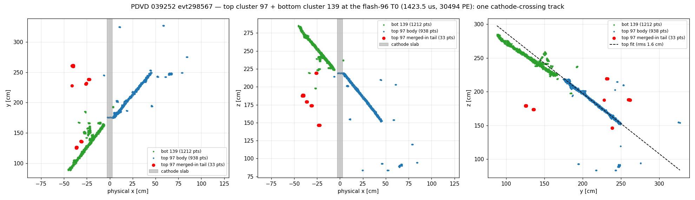

At flash 96's T0 the two pieces form **one continuous straight line through the cathode**
in all three projections, meeting at (x≈0, y≈175, z≈220).

The decisive evidence is the **(y, z) projection (right panel)**, because y and z carry
**no drift dependence at all** — no T0, no drift velocity, no trigger offset can move
them. A 3σ-clipped straight-line fit to each piece gives:

| piece | fit | rms | pts kept |
|---|---|---|---|
| top 97 body | z = −0.8953 y + 376.55 | **1.56 cm** | 792/887 |
| bot 139 | z = −0.7480 y + 347.78 | **2.06 cm** | 1077/1212 |

The two lines agree to **5.0°** and cross within **2.99 cm** of each other at the
junction y≈175, and the pieces **abut rather than overlap** in y (top spans 175→327,
bottom 88→193). Two independent clean tracks landing on the same line, meeting end-to-end
at the cathode, is not a coincidence a drift-model error can manufacture.

The light agrees: bot 139 predicts **42656 PE** on flash 96 (measured 30494), and flash 96
has **3 railed channels carrying 83.8 % of its light** — exactly what a track crossing
right past the cathode-mounted ARAPUCAs should produce. No other flash near this T0 is
remotely bright enough (gid 97, the next-closest in time, is 943 PE).

> **Clipping matters.** Cluster 97 carries scattered imaging outliers (visible at y≈325,
> z≈80–95). An unclipped PCA axis on this cluster is meaningless — it returns rms 20 cm
> and a 65 cm cathode-extrapolation error. Any endpoint/axis statistic on cluster 97 must
> be robust or it will lie.

## 3. Root cause of the missing bundle: containment, from **two** independent causes

Cluster 97's bundle pool is flashes **98–146**, contiguous; gid 96 is outside it. The
pool is a T0 window set by the containment gate
(`compute_endpoint_flags`, `QLMatching.cxx:3555`; gate at `:3786`), and
`require_containment` drops failures before the fit, while `dump_calib` (`:2951`) skips
uncontained bundles — hence *zero* candidates in the display rather than a losing one.

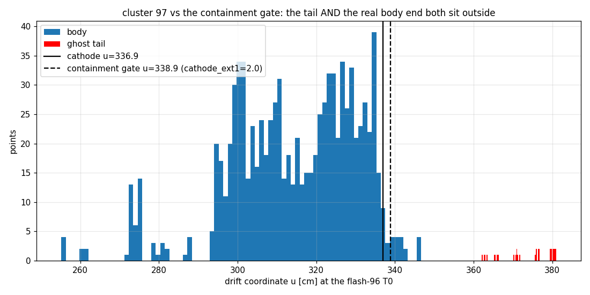

At flash 96's T0, **50 of 971 points (3.31 % of charge)** sit past the cathode gate
(u = 338.91 = u_cathode 336.91 + `cathode_ext1` 2.0). They split into two distinct
problems:

1. **The merged-in tail — 33 pts** (§4). Real charge from *other* objects, which
   clustering should never have put in this cluster.
2. **The remaining 17 pts.** *Corrected by §10.1:* these are themselves **two** structures —
   a **4-pt satellite 51 cm perpendicular to the track axis** (more merged-in junk, u
   345.80–346.69: this, not the real track, is what reaches 346.69) and the real track's
   own **13-pt crossing-point pile** at fixed (y=175.6, z=219.0), reaching
   **u = 342.24 vs the gate 338.91 — over by 3.33 cm** (5.33 cm past u_cathode; physical
   x = −6.4, i.e. ~3.4 cm below the *bottom* cathode face at −3.0).

**The genuine overshoot is fatal on its own.** Removing every piece of merged-in junk —
by any means, trim or clustering — would **not** bundle this pair, because the real
track's own crossing-point end still fails the containment gate by 3.33 cm and the trim's
judges refuse it (§5.1). The merged-in clumps are a genuine bug, but they are not what
keeps cluster 97 out of flash 96. (The original version of this section attributed the
full 7.78 cm overshoot to the real track; §10.1 corrects that — 4.45 cm of it is the
off-axis satellite.)

## 4. Origin of the tail: REAL charge from other objects, merged in by the 80 cm isolated rule

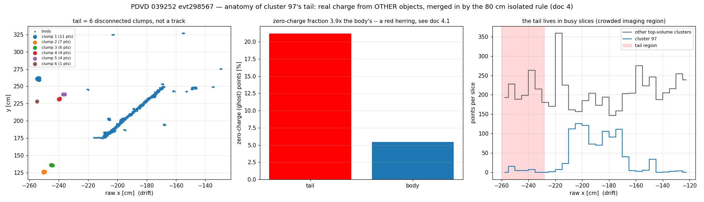

The "tail" is 33 points beyond a **15.4 cm drift gap** at raw x ≈ −220.5, in **6
disconnected clumps** (11, 7, 6, 4, 4, 1 pts) spread **136 cm in y and 73 cm in z** at
nearly fixed drift.

### 4.1 The waveforms say it is real charge

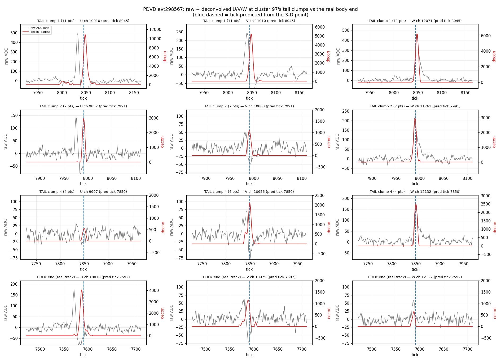

Read directly off the U/V/W waveforms at each clump's predicted (channel, tick) — raw ADC
from `input_data/run039252/evt_0/protodune-orig-frames-anode7.tar.bz2`, deconvolved from
the DNN-ROI SP frames:

| | U (induction) | V (induction) | W (collection) |
|---|---|---|---|
| clump 1 raw ADC peak | **491** (26 σ) | 245 | 467 |
| clump 1 decon | 10917 | 5246 | 6229 |
| body's real end, raw ADC | 180 | 63 | 61 |

Every clump shows **clean bipolar induction pulses on U and V and a clean unipolar
collection pulse on W, all coincident at the tick predicted from the 3-D point**. That is
textbook real ionisation charge. Clump 1 is in fact **~3× brighter than cluster 97's own
track end**.

> **This overturns an earlier reading in this investigation.** I first called the tail
> "dense real charge, correctly refused" (right), then "corrected" myself to "imaging
> ghosts — charge that does not exist" (**wrong**), on the strength of a 21 % zero-charge
> point fraction and the busy-slice occupancy. The waveforms settle it: the charge is
> real. The zero-charge points are a handful of ghost blobs *within* each clump's local
> imaging solution; they are not what the clumps are. Circumstantial imaging statistics
> lost to the ADC.

### 4.2 So whose charge is it?

Not cluster 97's. Each clump is a **tiny isolated deposit, 1.2–2.5 cm across** —
radiological / delta-ray scale, not a track — and none is a fragment of a neighbouring
track:

| clump | pts | max span | distance to cluster 97's body |
|---|---|---|---|
| 1 | 11 | 2.50 cm | 44.2 cm |
| 2 | 7 | 1.20 cm | 71.6 cm |
| 3 | 6 | 1.48 cm | 66.2 cm |
| 4 | 4 | 1.49 cm | 23.3 cm |
| 5 | 4 | 1.19 cm | 61.0 cm |
| 6 | 1 | — | 46.8 cm |

### 4.3 The mechanism: `clustering_isolated`'s hardcoded 80 cm merge

`clus/src/clustering_isolated.cxx:249`:

```cpp
double small_big_dis_cut = 80 * units::cm;      // hardcoded, NOT configurable
```

Every cluster that is "small" (`max range < range_cut` **and** `length < length_cut`) is
merged into its **nearest big cluster within 80 cm — with no angle, no direction and no
gap requirement**. PDVD calls `cm.isolated()` with **no arguments**
(`cfg/pgrapher/experiment/protodunevd/clus.jsonnet:515`), so `length_cut` falls back to
the C++ default **20 cm**.

The clumps are 1.2–2.5 cm across ⇒ trivially "small". Their distances to cluster 97 are
**23.3 … 71.6 cm ⇒ every one inside the 80 cm cut**. Cluster 97 was simply the nearest big
cluster, so it absorbed all six. That is the entire origin of the tail.

This is the known **isolated `length_cut`** issue ([project_isolated_length_cut]: "80 cm
no-angle merge over-clusters short EM"); SBND already runs `length_cut=15 cm`. Note the
80 cm *distance* is a hardcoded local, not a knob — only `length_cut`/`range_cut` are
configurable, and they gate *what counts as small*, not *how far it may reach*.

## 5. Why the robust-endpoint trim does not remove it

The trim *is* attempted (`last_u >= cathode_in`) and refuses, in **both** the `keep`
(trim off) and `walkfloor` configs — the pool is 98–146 either way, so this is
**config-independent** and is *not* the `robust_endpoint_walk_to_floor` family
([doc 15](15_pdvd-clus34-unmatched-evt298567.md) §10). Two reasons:

1. **The isolated pieces DO enter the judges' arithmetic, and the cathode end has no
   gap/detachment judge.** The cathode walk is

   ```cpp
   for (auto it = sv.rbegin(); it != sv.rend(); ++it) {
       if (it->u < cathode_in) { in_u = it->u; reached = true; break; }
       pts_out += it->npts; q_out += it->q;      // <-- everything past cathode_in
   }
   if (reached && sparse(pts_out, q_out)) last_u = in_u;
   ```

   It starts at the **deepest** slice — the merged-in clumps — accumulates them, marches
   **straight through the 15.4 cm gap** (nothing stops it there), and keeps accumulating
   the real body's outer slices until the first slice inside. So the judges are handed
   **merged-in clumps + real track fused into one lump**:

   | | pts_out | q_out | q/pt |
   |---|---|---|---|
   | merged-in tail (isolated pieces) | 33 | 2.19 % | 5863 |
   | main track's own tail | 17 | 1.12 % | 5817 |
   | **what sparse() actually sees** | **50** | **3.31 %** | **5847** |

   The *anode* end, by contrast, has `gap_detached` / `gap_trim` (`robust_endpoint_gap`),
   a density-blind detachment path. **There is no counterpart on the cathode side** — the
   gap knob is anode-only in the C++.
2. **The charge-density judge refuses — correctly, on its own terms.**
   `robust_endpoint_charge_abs = 1500` exists to protect *charge-dense* material from
   being trimmed, and the tail is genuinely dense real charge (**5847 q/pt**, §4.1), so
   the judge protects it. The point-count and charge-fraction judges also refuse (50 pts
   vs allowance 15; 3.31 % vs 0.5 %).

   The judge is **not fooled and not mis-tuned**. Its premise — *dense ⇒ do not delete* —
   is sound. It simply has no way to know that this dense charge belongs to a **different
   physical object** that clustering wrongly merged in (§4.3). No density, count or
   charge-fraction threshold can express "real charge, wrong object"; only the upstream
   merge can.

**Why bottom 139 got in and top 97 did not** is purely straggle *size*: bot 139 has its
own detached junk at its cathode end (7 pts past a 7.5 cm gap, 37.6 cm off its own track
axis), but **7 ≤ allowance 15**, so the point-count path trimmed it and the bundle formed.
Same defect, opposite outcome, decided by a count.

### 5.1 The isolated pieces are not what decides this case

Because the merged-in clumps and the real tail are fused into one `pts_out`, the obvious question is
whether excluding the merged-in clumps would rescue the bundle. **It would not.** Running the same
judges on the main track's tail *alone*:

| scenario | pts_out | vs allow 15 | q_out | vs 0.5 % | density | vs 1500 | sparse() |
|---|---|---|---|---|---|---|---|
| as-is (clumps included) | 50 | FAIL | 3.31 % | FAIL | 5847 | FAIL | **refuse** |
| hypothetical (clumps excluded) | 17 | **FAIL** | 1.12 % | **FAIL** | 5817 | **FAIL** | **refuse** |

The main track's own 17-point tail exceeds **all three** judges by itself. The §6.1
cathode gap judge *does* detect the detachment (15.4 cm gap ≫ 3 cm) but refuses on its
charge budget — the outer material carries 3.31 % of the cluster's charge against the
1 % allowance; that budget is precisely the guard against rescuing wrong-T0 hypotheses.
Raising it to 4 % **does** admit the bundle — demonstrated in §10.4 — but weakens that
guard for every cluster and every flash, which is why it is a demo, not a fix.

So the two defects are genuinely independent, and **the trim (at production thresholds)
is not the lever on this case**: the merge is a real clustering bug worth fixing on its
own merits, but fixing it changes nothing here. Only the §3 overshoot decides this
bundle.

### 5.2 PDHD does exactly the same thing

PDHD runs the **same** `QLMatching` C++ with `robust_endpoint_trim: true` and the same
values (`frac 0.01, count 15, charge_frac 0.005, charge_abs 1500, gap 3.0 cm,
gap_charge_frac 0.01` — `cfg/pgrapher/experiment/pdhd/qlmatching.jsonnet:306-332`). Since
the gap judge is anode-only in the C++, **PDHD's cathode end behaves identically**:
isolated pieces are swallowed into `pts_out`/`q_out`, with no detachment path.

PDHD has not been bitten by it because every case that drove the trim's development was
**anode**-side — the in-code comments name them: evt 983 ident-55, evt 991 ident-31
("91 pts past the anode"), evt 1007 uid-126 ("sub-anode material... marching from
u=−111 cm up to the body"). The cathode end simply never came up. This is a latent blind
spot in both detectors, not a PDVD-only gap.

## 6. Fix candidates — proposed, none adopted

**Nothing in the trim family fixes this case** (§5.1). Ranked by what actually decides it:

1. **The ~8 cm cathode overshoot of the real body (§3, item 2) — the only lever.** This is
   *not* a trim question. It must **not** be papered over by widening `cathode_ext1` from
   2 cm to ~10 cm until §7 is understood; that would be tuning a gate to swallow a
   discrepancy nobody has explained.
2. **Upstream: tighten `clustering_isolated` (§4.3).** The right fix for the tail — it
   removes the defect instead of teaching Q/L to tolerate it. Either lower PDVD's
   `length_cut` (SBND runs 15 cm; PDVD runs the 20 cm C++ default) or make the hardcoded
   80 cm `small_big_dis_cut` configurable / direction-aware. Both the tail here and bot
   139's 7-pt straggle are `isolated`-merge defects, not Q/L defects.
3. **A cathode-side gap/detachment judge**, mirroring the anode side — **IMPLEMENTED,
   default OFF** (§6.1). Justified by symmetry, not by this event: it does **not** fix
   cluster 97 (it would snap `last_u` to 346.69, still outside), and it is confirmed not
   to.

### 6.1 `robust_endpoint_gap_cathode` (implemented, default OFF, NOT adopted)

Mirrors the anode-end `gap_detached` / `gap_trim` path at the cathode end, reusing the
same `robust_endpoint_gap` / `robust_endpoint_gap_charge_frac` thresholds. Rationale: the
always-on legacy trims already treat the two ends as mirror images (same
`<=36 / 0.05N`, `<=60 / 0.06N / >10cm`, `<=25 / 0.12N / >20cm`, same snap); only the
knob-gated robust layer broke that symmetry, as an accident of where the first cases
turned up. Nothing in the gap judge's justification is direction-specific, and the
upstream cause (§4.3) has no directional preference at all.

A **separate boolean** rather than reusing the existing keys unconditionally: PDHD already
sets `robust_endpoint_gap`, so an unconditional mirror would have silently switched the
cathode judge on for PDHD — not byte-identical.

Wiring: `robust_endpoint_gap_cathode` (C++, default false) → PDVD
`qlmatching.jsonnet` (key-suppressed when off) → `ql_robust_gap_cathode` TLA →
`PDVD_QL_ROBUST_GAP_CATHODE=1`. PDHD is untouched.

**Gates**
- Freshness proof: `libWireCellMatch.so` 13:34:38 vs last source edit 13:32:57 (101 s newer).
- `./build/match/wcdoctest-match`: 4 cases / 23 assertions pass.
- Compiled-config proof: key **absent** in `work/039252_0_abcath/.wct-clus.json`,
  **`true`** in `work/039252_0_gapcath/.wct-clus.json`.
- **A/B PASS, knob off, on the path that actually exercises the cathode block**
  (trim ON + walk_to_floor ON, so a trim-off run would not have entered it at all):
  `work/039252_0_abcath` (new binary) vs `work/039252_0_walkfloor` (old binary) —
  calib md5 `557ee5754e48718e3dfb2402b7f5a3e5` both sides; `mabc-all-apa.zip` (5 members),
  `mabc-group0123.zip` (9), `mabc-group4567.zip` (9) all identical by member-content hash.

**Effect with the knob ON (`work/039252_0_gapcath`) — marginal on this event**

| | OFF | ON |
|---|---|---|
| bundles | 5295 | 5296 (**+1**) |
| clusters with a selected flash | 104 | 104 |
| clusters whose selection moves | — | **0** |
| cluster 97 pool | 49 (98–146), no gid 96 | **unchanged** |

The single gained bundle is uid 4000001 (apa-4 ident 1, the `walk_to_floor` case) gaining
flash gid 94 (t=1314.7 µs, 63 PE, chi2/ndf 1.72, ks 0.355) as a *candidate* — it does not
win, and ident 1 keeps gid 120.

**Honest reading: this event does not demonstrate the knob's value.** It is a near-no-op
here, exactly as §5.1 predicted. The knob rests on the symmetry argument and on PDHD's
anode-side evidence (evt 1007 uid-126), not on a rescue shown here. Whether it matters at
all needs a census over events with cathode-end detached junk whose body *is* contained —
which evt298567 has none of. Until that census exists, it stays OFF.

The real target is upstream (§4.3): **clustering should not absorb unrelated deposits into
a track merely because they lie within 80 cm of it.** Both the tail here and the 7-pt
straggle on bot 139 are `isolated`-merge defects that Q/L is being asked to clean up after,
and cannot.

## 7. Open, NOT settled — the cathode-meeting residual

The two pieces meet, but *where* they meet depends on how each piece's endpoint straggle
is treated, and the answer is not stable at the few-cm level:

| treatment of bot 139's 7-pt straggle | crosser sum test | meeting point | vs flash 96 |
|---|---|---|---|
| kept | −2.95 cm | x = −1.47 (at the cathode) | 5.31 cm off |
| dropped | −12.72 cm | x = −6.36 | **0.42 cm** |

The "sum test" is `x_top_end + x_bot_end = et + eb + dclk·v`, which is **independent of T0
and of any common trigger offset** (both cancel), and should be ≈0 for a true crosser. A
population check on this event's 9 clean co-selected top+bottom pairs gives mean −0.9 cm,
spread ≈3.7 cm, range −9.2…+4.2 — so the test works. **Neither** treatment of this pair
lands comfortably inside that population: −2.95 is inside but relies on keeping junk that
is 37.6 cm off-axis; −12.72 is a clear outlier.

I could not resolve this, and I am **not** proposing a tune. Per CLAUDE.md §5.7 it is
reported, not fixed. It plausibly touches the already-open `cathode_ext1` / anode-pull
retune and the §8.14 endpoint-asymmetry item in
[project_pdvd_tpc_geometry_ql_fv]. The drift velocity is **not** a suspect: 1.48073 mm/µs
is the user-directed default from the W-decon A↔C crosser measurement on evt 298651, good
to ~0.3 %.

*Follow-up:* §10.3 sharpens this — with each side's junk dropped, the two real ends agree
to 0.4 cm and meet at x ≈ −6.5, ~3.5 cm below the bottom cathode face. That one number is
what fails top 97's containment *and* bot 139's `at_cathode` xtpc admission. §10.5 argues
this residual should be measured across the 120-event set before any gate is widened.

## 8. Verification

- Pool of uid 4000097 = gids 98–146 (49 bundles), gid 96 absent — identical in
  `work/039252_0_keep` and `work/039252_0_walkfloor`.
- Body-only u_max = 346.69 vs gate 338.91 → over by 7.78 cm.
- Tail: 33 pts, 2.19 % of cluster charge, 6 clumps of max span 1.2-2.5 cm, 23.3-71.6 cm
  from the body (all < the 80 cm `small_big_dis_cut`).
- Tail waveforms: clump 1 raw ADC peaks U 491 / V 245 / W 467 at tick ~8045 (bipolar,
  bipolar, unipolar) vs body end U 180 / V 63 / W 61 at tick ~7592.
- y–z robust fits: 5.04° apart, Δz = 2.99 cm at the junction.
- All numbers regenerate from the Repro block; no `work/`, `ql_labels/`, `decisions-*` or
  snapshot directory is written.

## 9. Gotchas found while doing this

- **Dump `time`/`time1` are already trigger-folded** (`QLMatching.cxx:2885`). Adding
  `trigger_offsets_us` again silently puts u ~500 cm out of range. Cost one wrong pass.
- **`main_cluster` in the bundle list is already a uid**, not an ident — do not add
  `apa*1e6` to it. Cost one wrong pass (invented "apa 8" clusters).
- **Endpoint statistics on cluster 97 must be outlier-clipped** (§2).
- A naive "walk from the deep end to the first >5 cm gap" endpoint finder returns the
  *straggle's* own edge when the straggle is itself a multi-point clump. Cost one wrong
  pass.

## 10. Follow-up (2026-07-16): can the bundle be saved?

Question asked: given the two tracks are a consistent cathode crosser, is there a safe
way in the current QLMatch code to admit the (97, flash 96) bundle? Short answer:
**a code path exists and is demonstrated (§10.4), but nothing available today is safe to
adopt** — every lever that admits it either weakens a global guard or is blocked by the
§7 residual, which this follow-up sharpens into a single number (§10.3).

### 10.1 Corrected anatomy of the 50 points past the gate

`check_clus97_pastgate_anatomy.py` splits the "17 real body points" of §3 by perpendicular
distance to the local track line (last 30 cm of body, 612 pts):

| structure | pts | u range | (y, z) | ⊥ to track | verdict |
|---|---|---|---|---|---|
| merged clumps (§4) | 33 | 354–386 | spread 136×73 cm | 23–72 cm off | junk (other objects) |
| **satellite** | 4 | 345.80–346.69 | (245.4, 214.5) fixed | **51 cm off** | junk (another merge) |
| **crossing-point pile** | 13 | 338.99–342.24 | **(175.6, 219.0) fixed** | 6–9 cm | **real, the track's own** |

The satellite is detached from the pile by a 3.56 cm slice gap. So the deepest "body"
material (346.69) is junk after all, and the real track's genuine overshoot is
**342.24 − 338.91 = 3.33 cm**, not 7.78. §3 and §5.1 are corrected in place.

### 10.2 The crossing-point pile is the crosser's own late charge, not a coincidence

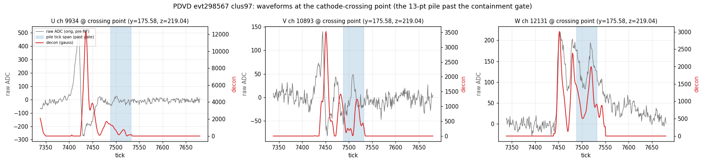

The pile sits at **exactly the junction (y,z) where the two pieces meet** (§2: y≈175),
fixed in (y,z), extended 3.25 cm along drift only (13 consecutive slices ≈ 22 µs). On all
three planes the raw waveform at the crossing-point channels is **continuous from the
track's own arrival pulse (tick ~7450) through the past-gate window (7488–7532)** — the W
collection trace never returns to baseline in between. A random coincident deposit would
be a separate isolated pulse; ~25 µs of unbroken signal on precisely the crossing-point
wires is the crosser's own charge arriving late (plausibly near-cathode field distortion;
not settled here — it feeds §7).

### 10.3 One displacement, two failures: the halves meet at x ≈ −6.5, not at the cathode

At flash 96's T0, with each side's junk straggle dropped:

| half | cathode-end physical x | vs its cathode face |
|---|---|---|
| top 97 (real end) | **−6.78** | 9.78 cm past +3.0 |
| bot 139 (real end) | **−6.36** | 3.36 cm short of −3.0 |

The two ends agree to **0.4 cm** — the crosser is as clean as they come — but the meeting
point sits **~3.5 cm below the bottom cathode face**. That single displacement produces
*both* code-level failures at once:

- top 97: end past its containment gate → bundle culled at build
  (`QLMatching.cxx:1440`);
- bot 139: end short of the `at_cathode` window (`u_cathode + cathode_ext2 ≤ last_u <
  cathode_in`, `:3871`) → no `flag_at_x_boundary` → **not an xtpc candidate**
  (`:3363`).

PDVD already runs the cross-TPC crosser machinery (`xtpc_flag: true`,
`xtpc_joint_pin: true`, `xtpc_dmax: 25 cm` — `protodunevd/qlmatching.jsonnet:377-390`),
which is *designed* to bind exactly this pair to one flash — and it cannot fire, because
**both** halves fail admission for the same geometric reason. Fixing only the top's
containment (as §10.4 does) still leaves the pair unpinned.

Meanwhile the baseline assignments around this flash are pathological:

| object | baseline claim | comment |
|---|---|---|
| flash 96 (30494 PE) | **uid 4000159 — a 4-point speck** sitting in the cathode slab (x 2.7–3.6, y 269, z 274) | classic tiny-cluster LASSO soak-up |
| bot 139 | flash 141 (chi2/ndf 1.1) | plausible numbers, likely wrong physics |
| top 97 | flash gid 139 at t = 3112 µs | **1689 µs from the true crossing time** |

### 10.4 Rescue demo: gap budget 4 % admits the bundle and flash 96 selects it

`work/039252_0_gapcath4` = the §6.1 knob chain with `PDVD_QL_ROBUST_GAP_FRAC=0.04`
(covers the 3.31 % of outer junk; production anode value is 0.01). Result:

- Cluster 97's pool grows 49 → 51, now **including gid 96**; the trim snaps `last_u`
  inside, and the bundle acquires `at_x_boundary` (its trimmed end lands in the cathode
  window).
- **Flash 96 selects cluster 97**, and among all flash-96 candidates the (97, 96) bundle
  has **the best KS by far: ks_dis 0.047** (next best 0.375). Its chi2/ndf 35.9 is
  inflated by the flash's 3 railed channels carrying 83.8 % of the light — exactly the
  case the `pe_railed_widen` knob (toolkit 7d509274, default OFF, this event in its
  commit message) exists for.
- But it is a **half-rescue with debris**: flash 96 keeps the 4-pt speck 159 as a second
  selection, top 97 is *also* still claimed by the 3112 µs flash (the pre-existing
  one-cluster-many-flashes error mode), and bot 139 stays on flash 141. The crosser is
  still not represented as (97+139) ↔ 96, and (139, 96) — pred 42656 vs meas 30494,
  ks 0.651 — stays unselected. No xtpc pairing fires (§10.3: bot 139 is not a candidate).

### 10.5 Assessment: what a *safe* rescue would need, and why it should wait for §7

The global levers are all unsafe as adoption candidates: gap budget 1 % → 4 % weakens the
wrong-T0 guard everywhere; `cathode_ext1` 2 → 10 cm widens every cluster's T0 pool by
~54 µs on the cathode side. Both are tuning gates to swallow a displacement nobody has
explained (§7).

The principled mechanism — sketched, not implemented — is **crosser-scoped tolerance**:

1. a bundle failing containment *only* by the cathode test, within a bounded overshoot
   (~10 cm), is kept **provisionally** (flagged, not accepted);
2. the `at_cathode` window for **xtpc candidacy** is widened by the same tolerance on
   both sides of the cathode;
3. provisional bundles that do not acquire an xtpc scenario-1 / joint-pin confirmation
   (opposite-volume partner on the *same* flash, endpoints meeting ≤ 25 cm, collinear
   ≤ 20° — all existing, enabled code) are purged before the fit.

Then the tolerance is only ever exercised when an independent, T0-independent geometric
confirmation exists — the §2 evidence, enforced in code — and the joint pin would
simultaneously give 97 → 96 *only* (dropping the 3112 µs claim) and 139 → 96. Default
OFF, byte-identical. Two caveats: cluster 97's global PCA is outlier-corrupted (§2 note),
so the 20° pin-angle test may need the robust/clipped direction; and the right tolerance
value should come from data, not from this one event.

**Recommended order: measure §7 first.** The 9 clean co-selected pairs in this one event
already show the crosser meeting point wandering over ±4 cm (mean −0.9, range −9.2…+4.2);
this pair sits at −6.5. A census of crosser-pair meeting points across the 120-event
`_keep` set would settle whether the displacement is systematic (→ a calibration fix:
shift/widen the cathode windows by a measured number, and the xtpc pin then fires
naturally) or a per-event spread (→ the crosser-scoped tolerance above, sized to the
measured spread). Either way the fix would then rest on a population, not on evt298567.

### 10.6 The crosser-scoped mechanism — IMPLEMENTED (default OFF, NOT adopted)

The §10.5 sketch is now code: **`xtpc_cathode_tol`** (length, C++ default 0 = OFF) +
**`xtpc_cathode_qfrac`** (charge fraction, default 0). All of it is gated on
`tol > 0` and on the flat-cathode window (never when a CPA fiducial — SBND — is
configured):

1. **Provisional containment admission** (`compute_endpoint_flags`): a bundle failing
   containment ONLY by cathode overshoot is kept provisionally when its
   **junk-tolerant cathode endpoint** — the deepest slice that cannot be discarded
   within a charge budget of `qfrac` of the cluster total, walking from the deep end —
   lies within `tol` past the gate. The quantile endpoint is what makes the admission
   work in a production (trim-OFF) config: cluster 97's merged junk (2.6 % of charge)
   drags the *raw* extreme 47 cm past the gate, while the real end is 3.3 cm past.
   Nothing is trimmed; the endpoint exists only for this test.
2. **Widened xtpc candidacy** for contained bundles ending within `tol` *below* the
   `at_cathode` window — via a dedicated `flag_xtpc_cathode_cand`, **not**
   `at_x_boundary`. (The −12 cm `cathode_ext2` experiment of 2026-07-11 failed
   precisely because it widened `at_x_boundary`, which also feeds the ladder /
   cross-side / LASSO-weight paths; the dedicated flag feeds `cull_cross_tpc`
   admission only.)
3. **Purge before the fit** (`purge_unconfirmed_cathode_rescue`, between
   `cull_cross_tpc` and `cull_inconsistent`): every provisional bundle that did not
   acquire `flag_xtpc_scenario1` is removed — downstream sees exactly the legacy set.
   `cull_cross_tpc` additionally refuses to confirm two provisional halves with each
   other (at least one half of a pair must be fully contained). Survivors are stamped
   contained and dumped with `xtpc_cathode_rescued: true` (key emitted only when the
   knob is on).

Wiring: `xtpc_cathode_tol`/`xtpc_cathode_qfrac` (C++) → PDVD `qlmatching.jsonnet`
(key-suppressed when null) → `ql_xtpc_cathode_tol_cm`/`ql_xtpc_cathode_qfrac` TLAs →
`PDVD_QL_XTPC_CATHODE_TOL_CM` (+ optional `_QFRAC`, default 0.05 when TOL set) in
`run_clus_evt.sh`. Independent of `PDVD_QL_ROBUST_TRIM`. PDHD untouched.

**Gates (all PASS)**

- Build + install rc=0; freshness proof `libWireCellMatch.so` 14:34:27 vs last source
  edit 14:33:43; `wcdoctest-match` 4 cases / 23 assertions.
- **A/B knob-off byte-identical**: `work/039252_0_abxtpc` (new binary, walkfloor env =
  trim ON + walk_to_floor ON, rescue unset) vs `work/039252_0_walkfloor` (old binary):
  calib md5 `557ee5754e48718e3dfb2402b7f5a3e5` both sides; `mabc-all-apa.zip`,
  `mabc-group0123.zip`, `mabc-group4567.zip` identical by member-content hash. No
  `xtpc_cathode_rescued` key in the knob-off dump.

**Knob-ON demo (`work/039252_0_xtpcresc`: trim OFF = production-like, tol 10 cm,
qfrac 0.05)**

The event's crosser is fully repaired:

| | baseline (`keep`) | rescue ON |
|---|---|---|
| top 97 | flash @3112 µs (wrong by 1689 µs) | **flash 96 only** (pinned) |
| bot 139 | flash 141 | **flash 96 only** (pinned) |

`QLXTPC pair 0/139 1/97 d=12.86 cm sc1=true a01pin=13.2° pin=true` — confirmed via the
**global-PCA** angle (13.2° < 20°); the local vhough read 50°, skewed by the §10.2
crossing-point pile, and the existing min(vhough, PCA) OR-test absorbed exactly that.
The (97, 96) bundle carries the best KS of all flash-96 candidates (0.047) and is dumped
with `xtpc_cathode_rescued: true`. The purge log shows unconfirmed provisionals of
clusters 97 (other flashes), 91, 78, 73 all dropped.

**Blast radius beyond this pair (why the census is still required before adoption):**
the widened candidacy let the existing pin machinery act on more near-cathode clusters —
vs the `keep` baseline, 8 selection-pairs lost / 6 gained (net −2 of 113): bottom 78 +
top 4000112 now BOTH bind to flash 57 (plausibly another crosser unified), cluster 131's
double-claim collapses to one flash (72), 4000014 moves 68→69, and 4000012 loses its
claim on flash 23. Each of these must be hand-scanned; the knob stays **OFF** until the
crosser census (§10.5) sizes the tolerance and validates the moves.

**Status: implemented default-OFF; nothing adopted.** `work/039252_0_gapcath4`,
`work/039252_0_abxtpc`, `work/039252_0_xtpcresc` are scratch demo tags; production
configs and defaults are untouched.

## 11. 120-event census (2026-07-18): the in-cathode tail is a real, repeating phenomenon

Question asked (owner): physically there should be no activity inside the 6-cm-thick
cathode, yet this event clearly shows a tail of signal there (§10.2/§10.3). Is that a
coincidence, or a systematic effect — possibly hardware — visible in other
cathode-crossing tracks? This section is the §10.5 census, run over **all 120 `_keep`
events** (039252×18 + 039253×18 + 039349×84).

### 11.1 Method (scripts committed next to this doc)

`scripts/cathode_tail_census.py` finds cathode-crossing pairs in every `_keep` calib
dump **geometrically**, so pairs that Q/L missed (like this event's 97+139) are
included:

- **Junk-robust per-cluster geometry.** Clipped 2-D PCA line in the drift-free (y,z)
  projection (§2's lesson), a clipped u-vs-along-track fit, and a tube cut: ⊥ < 12 cm
  to the (y,z) line **and** < 10 cm 3-D residual to the track line. The 12 cm tube
  keeps the crossing pile (⊥ 6–9 cm here) while the 3-D residual rejects merged-in
  clumps sitting on the line's *extension* (a failure mode found and fixed on
  039349 evt19769: a 4-pt clump 13 cm from the junction faked a 22 cm penetration).
- **T0-free pairing.** For a top end and a bottom end, the sum-test residual
  `R = X_top_end + X_bot_end` is independent of T0 *and* of any common trigger offset
  (`time1 − time = Δclk` cancels; ideal crosser ⇒ (+3) + (−3) = 0). Pair acceptance:
  end-to-end (y,z) ≤ 35 cm, perpendicular line-offset ≤ 8 cm, 3-D collinearity ≤ 25°,
  |R| ≤ 25 cm. Note `R = pen_bot − pen_top`: it measures the *asymmetry* of the two
  face penetrations, exactly, with no flash needed.
- **T0 sources** for absolute (per-side) penetration: `pin` (both halves xtpc-pinned to
  one flash), `cosel` (co-selected), else `geo` — the two face conditions bracket the
  true T0, and the brightest flash inside the bracket ±15 µs is taken
  (light-anchored but Q/L-independent; it recovers flash 96 exactly for 97+139).
- **`scripts/cathode_tail_anatomy.py`** splits each half's past-face material into
  **contiguous** penetration (drift-connected to the face-most body point, steps
  ≤ 2.5 cm — the §10.2 signature) vs **detached** clumps (gap > 2.5 cm), and computes
  each end's SP tick against the *actual raw readout length* (§11.5).

Result: **746 pairs** (539 pin / 35 cosel / 154 geo / 18 unplaceable), consistent with
the cc-campaign's 748 QL-pinned count on the same events. All 8 crossers of evt298567
are found, including 97+139 (recovered with flash 96, pen 5.33 cm, 23-pt pile at
yz-rms 0.32 cm) and the second QL-missed pair 4000189+34.

### 11.2 No global systematic — §7 is answered

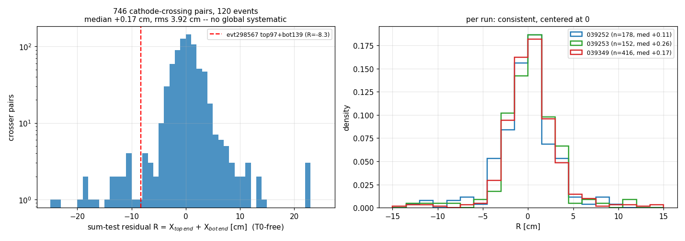

Over 746 pairs: **R median +0.17 cm, rms 3.9 cm**, per-run medians +0.11 / +0.26 /
+0.17 (039252/039253/039349). The drift-velocity/trigger/geometry chain has **no
global cathode-side bias**; evt298567's R = −8.3 sits at ~2σ of a zero-centered
distribution. The §7/§10.5 fork is resolved: the displacement is a **per-event spread**,
so the right mechanism is the crosser-scoped tolerance (§10.6), not a calibration shift
of the cathode windows.

### 11.3 The tail population

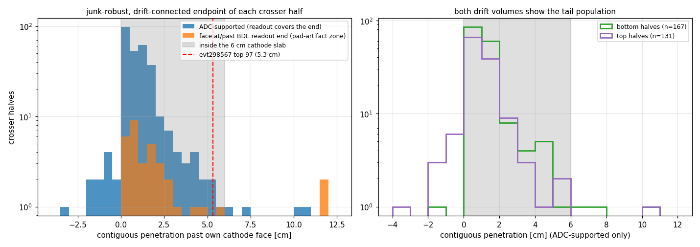

Junk-robust, drift-connected, **ADC-supported** (§11.5 discipline) penetrations past a
half's own cathode face:

| contiguous penetration | halves | events |
|---|---|---|
| > 3 cm (past slab center) | **20** | 20 |
| > 5 cm | 7 | 7 |
| > 6 cm (through the whole slab) | 4 | 4 |

evt298567's 5.33 cm is **mid-pack** — 6 supported cases are deeper. The four
through-slab cases: 039252 evt298581 top 10.8 cm, 039349 evt56226 bottom 10.3 cm,
evt55766 bottom 7.0 cm, evt19849 bottom 6.1 cm. Both drift volumes participate
(7 top / 13 bottom); all track inclinations (drift-cos 0.39–1.0); flashes are bright
(median 15k PE); per-run: 11 (039252) / 2 (039253) / 7 (039349). In every deep case the
T0-free R backs the flash-based penetration with the right sign and magnitude
(e.g. 298581: pen 10.8 vs R −11.4; 56226: pen 10.3 vs R +10.4) — the tails are not a
wrong-flash artifact. Expressed as delay rather than distance, 3–11 cm ≡ **20–73 µs of
late arrival** at v = 1.48 mm/µs.

#### Side occupancy and depth distribution (owner follow-up, 2026-07-18)

**Q1 — bottom TPC only, or split between the two?** Split — both drift volumes show
the effect, at every depth threshold, with a mild and threshold-stable bottom lean
(~60/40) in the contiguous class:

| contiguous pen > | top | bottom | bottom frac |
|---|---|---|---|
| 1 cm | 54 | 81 | 60 % |
| 2 cm | 16 | 21 | 57 % |
| 3 cm | 7 | 13 | 65 % |
| 5 cm | 3 | 4 | 57 % |
| 6 cm | 1 | 3 | 75 % |

(ADC-supported halves only — the §11.5 pad-artifact exclusion matters here, since all
4 fakes were bottom-side; the 13 supported bottom tails have their cathode ends at
ticks 427–7279, far from any readout edge.) The detached class leans the *opposite*
way (12 top / 2 bottom, not understood). And the tail is **always one-sided per
crosser**: no pair has both halves past 3 cm; exactly one pair in the whole census has
both marginally past 2 cm (039253 idx 11: 2.7 / 2.1 cm). Whatever delays the charge
acts on one side of a given crossing, not symmetrically on both.

**Q2 — is the in-cathode part always ~6 cm, or does the length vary?** It varies
continuously — there is **no preferred ~6 cm (slab-thickness) scale**. The supported
>3 cm depths are 3.2, 3.3, 3.4, 3.5, 3.5, 3.7, 3.9, 4.1, 4.2, 4.3, 4.3, 4.5, 4.6,
5.3, 5.5, 5.7, 6.1, 7.0, 10.3, 10.8 cm: binned 3–4 cm: 7, 4–5 cm: 6, 5–6 cm: 3,
> 6 cm: 4. The population falls smoothly (roughly exponentially, ~1.8 cm scale above
the ~2 cm normal endpoint spread; whole-population p50 is −0.9 cm short of the face,
p99 ≈ +6 cm); the tails are the extreme of a continuum, not a discrete "crossed the
slab" class. Two readings follow: (i) the 4 cases past 6 cm end **beyond the opposite
cathode face**, which no geometric position inside the slab can produce — so at least
the deep end of the distribution is an *apparent* (time-delay) displacement, 41–73 µs
of late arrival, not literal charge location; (ii) the detached clumps continue the
same trend deeper (4.6–22.3 cm ≡ 31–151 µs), consistent with one mechanism whose delay
spans a wide range rather than a fixed slab-geometry offset.

A separate **detached** class: 14 halves have a compact past-face clump beyond a
> 2.5 cm drift gap from the body, penetrations 4.6–22.3 cm (31–151 µs). **12 of 14 sit
within 9 cm of the crossing point in (y,z)** — random merged-in deposits (§4's 80 cm
isolated rule) would scatter over tens of cm, so most of these look like the same
late-charge phenomenon in a stronger, gap-forming regime. Oddly this class is
top-dominated (12 T / 2 B) while the contiguous class leans bottom (7 T / 13 B) — not
understood. The two off-junction cases (evt19769 at 13 cm, evt19409 at 10 cm) stay in
the ambiguous/junk bin.

### 11.4 Waveform verification — the charge is real

Four cases were taken to the raw ADC + decon waveforms
(`scripts/cathode_tail_waveform_check.py`, loaders and gotchas from the §4.1 script):

- **039252 evt298581 top 4000032, contiguous 10.8 cm**
  (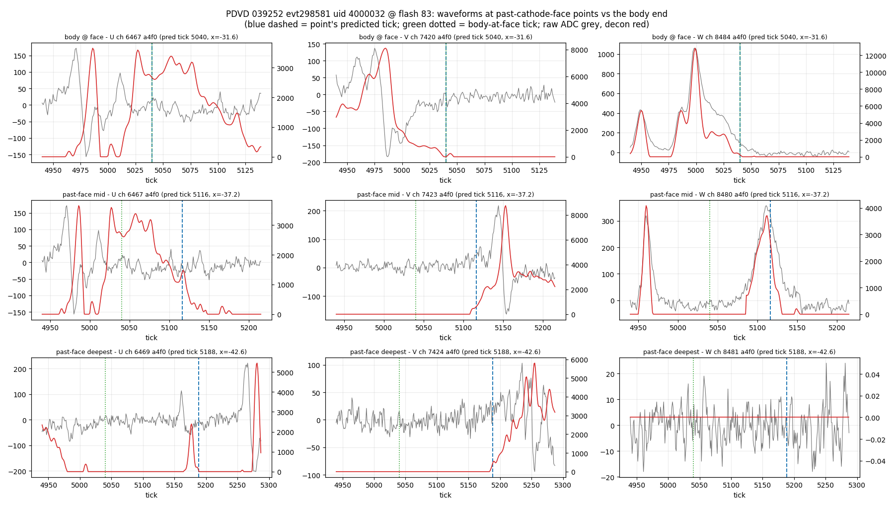): at the mid past-face point a
  textbook unipolar W collection pulse (raw 357 ADC) and bipolar U/V at the predicted
  tick. Real charge ≥ 6 cm past the face; the extreme tip (x = −42.6) is weaker (W
  silent, U/V slightly late) so the last ~2 cm are less certain.
- **039349 evt56226 bottom 106, contiguous 10.3 cm**
  (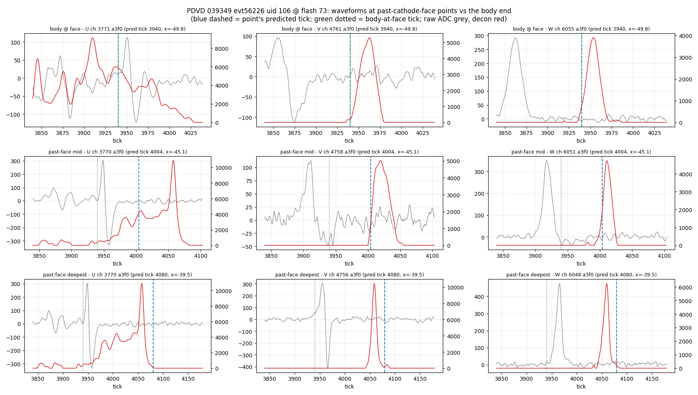): strong pulses (raw up to
  475 ADC) tracking the predicted ticks through the slab.
- **039349 evt19709 top 4000092, detached 12.0 cm at d_junc 1.2 cm**
  (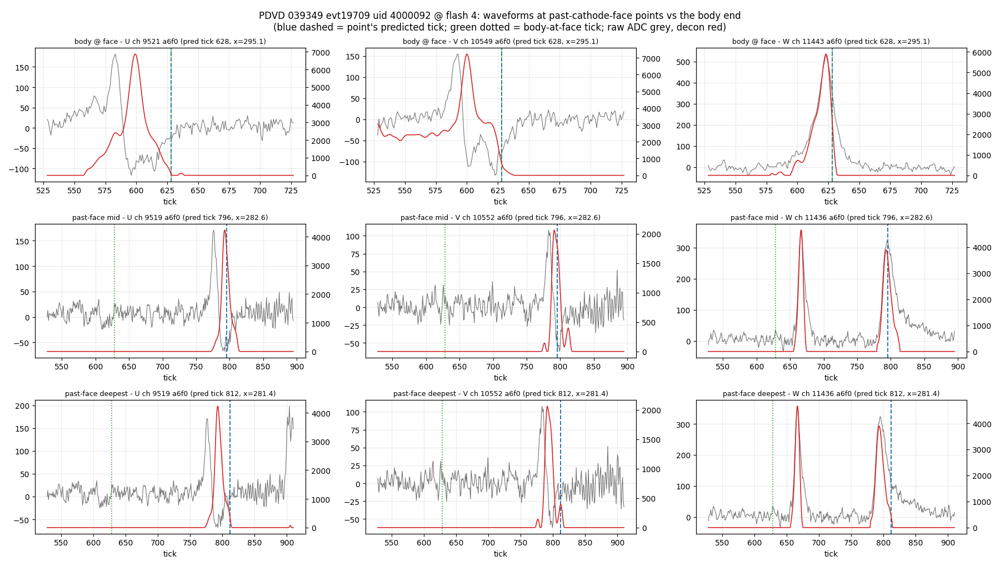): the cleanest demonstration —
  the same W channel fires twice: the track's own passage, then a second, isolated
  pulse **~85 µs later** at exactly the crossing-point wires, on all three planes.
  Late charge from the crossing region, unambiguous.
- **039349 evt19769 top 4000047 (the 13-cm-off-junction control)**: the clump is real
  charge too (W raw 149) but, as in §4, "real" does not mean "belongs to the track" —
  off-junction detached clumps stay unattributed.

### 11.5 Instrumental artifact found en route: the BDE readout-padding zone

The bottom-volume (BDE, anodes 0–3) raw readout is **shorter** than the top (TDE):
9766 vs 10000 ticks in 039252/039253, 6250 vs 6400 in 039349 (same duration — the
bottom tick is 512 ns, the top 500 ns — but in the SP chain's common tick-index space
the bottom ends earlier). SP pads the bottom frames to the top length, so ticks
9766–10000 / 6250–6400 contain **deconvolution output with no ADC behind it**, and
imaging happily builds charged blobs there (039349 evt23097: a 101-pt, 11.7 cm
"tail" entirely at ticks 6290–6380, beyond the 6250-tick readout —
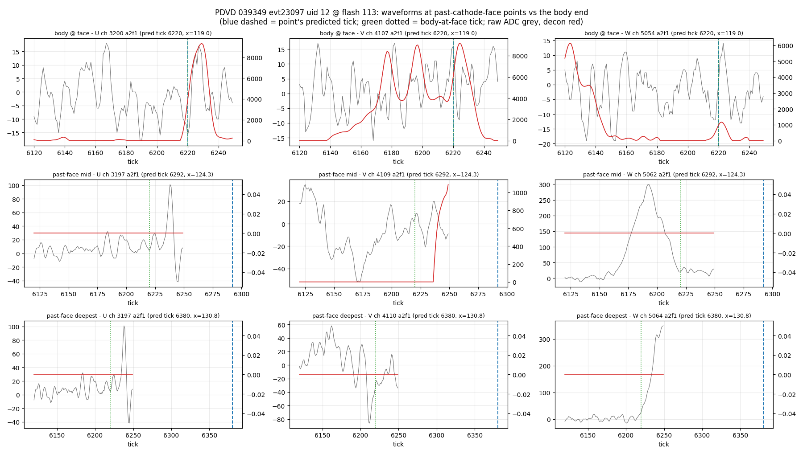). For a flash at t ≳ 800 µs in
039349 the *bottom cathode region itself* maps into this zone.

4 of the naive 24 bottom "tails" were this artifact and are excluded above (2 more are
partially in the zone and kept out of the headline numbers). **Actionable, separate
issue:** SP/imaging should not produce charge beyond the raw readout end of the bottom
planes — mask the padded ticks or bound imaging's slice range; this affects any
bottom-volume track end under a late flash, not just crossers. Reported here, not fixed.

### 11.6 Position correlation — edges, and a hardware reading

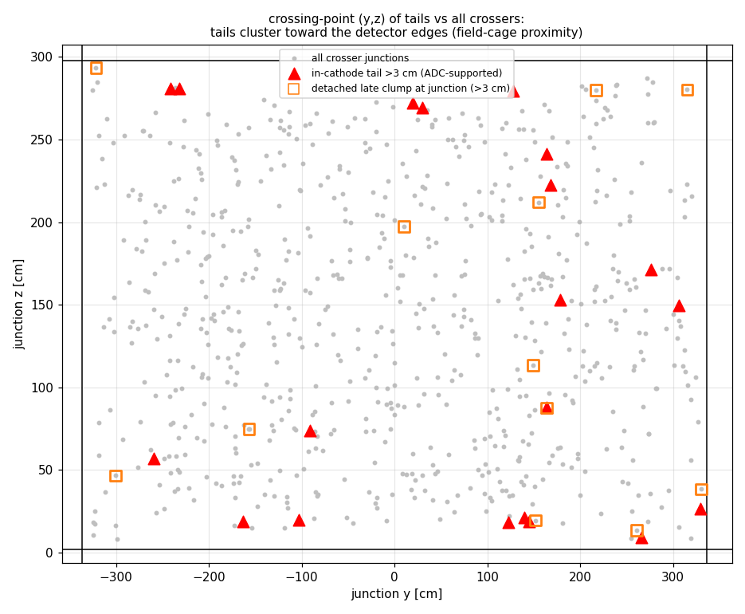

The crossing points of the supported >3 cm tails cluster toward the detector boundary:
**60% lie within 30 cm of a field-cage edge (|y| > 306 or z < 32 or z > 268) vs 13% of
all 728 crosser junctions**; median distance-to-edge 22 cm vs 72 cm. The tail is
therefore **not a random coincidence** — it correlates with position in exactly the
region where the drift field is least uniform (field-cage / cathode-frame proximity).

Consistent physical reading (hypotheses, not conclusions): ionization deposited by the
crossing track in or near the cathode plane's low/distorted-field region is extracted
slowly, arriving tens of µs late and reconstructing "inside" or "beyond" the cathode;
near the field-cage edges the distorted region is larger, and detached
clumps (§11.3) are the long-delay tail of the same mechanism. What the census rules
out: a velocity/offset calibration bias (§11.2), reconstruction junk (waveform-backed,
§11.4), and readout artifacts (§11.5 discipline applied). A follow-up worth doing:
overlay the tail (y,z) positions on the cathode mechanical drawing (frame members, HV
bus, XA window cutouts — docs 07/18 have the module map) to test the
cathode-structure hypothesis directly.

#### The mesh-cathode reading (owner hypothesis, 2026-07-18)

The PDVD cathode is a **mesh / open-frame structure, not a solid plane**. That single
hardware fact is the most economical explanation of the full census pattern:

- **It makes "activity inside the cathode" possible at all.** With a solid plane there
  is no LAr in the 6 cm slab and a crossing muon deposits nothing between the faces.
  With a mesh, the interior is live argon: the track *does* ionize those ~6 cm, and
  the anomaly reframes from "impossible charge" to "when does that charge get out".
- **Delayed extraction fits quantitatively.** The interior of a double-surface mesh
  electrode is largely field-shielded; what remains is the leakage field through the
  openings — some fraction of the nominal drift field. At low field v ≈ µE, so an
  effective 10–50 % of nominal over the last few cm gives ~0.15–0.7 mm/µs, i.e.
  3–10 cm of apparent displacement in tens of µs. That brackets exactly the measured
  delays: 20–73 µs (contiguous tails), 31–151 µs (detached clumps). The clumps are
  then charge born deeper in the structure — weaker leakage field, longer extraction —
  which is why they detach from the body instead of forming a continuous pile.
- **One-sidedness follows.** Charge born inside a shielded interior drains toward
  whichever face the local leakage field favors — all of it goes one way. A bulk
  field-calibration effect would act symmetrically; the census sees strictly
  one-sided tails (§11.3 Q&A).
- **No 6 cm scale follows.** The delay depends on where inside the structure the
  charge was born and on the local mesh geometry, not on the slab thickness — hence
  the smooth ~1.8 cm-scale falling depth distribution, and the >6 cm cases being
  time-delay displacements rather than geometric positions.
- **Edge enhancement follows.** The cathode's solid members (frame, HV bus, mechanical
  supports) concentrate at module peripheries and the detector edge, where shielding
  is stronger and the leakage field weaker → longer delays, more tails (60 % of tails
  within 30 cm of an edge vs 13 % baseline).
- **Charge density agrees.** §4.1/§10.2 already measured the pile's q/pt (~5850) equal
  to the track body's — the tail is MIP-scale ionization of the crossing itself, not a
  coincident deposit.

Not explained yet: the mild bottom lean of the contiguous class (7 T / 13 B) vs the
strong top lean of the detached class (12 T / 2 B). If the two cathode surfaces differ
(mesh on one side only, XA window layout, panel construction), that asymmetry should
follow from the drawings — same overlay follow-up as above, which is also the decisive
test of this reading: tails should track the structure (suppressed on solid XA
windows, enhanced near frame members/edges).

### 11.7 Implications

- **§10.6 rescue is validated in scope and scale.** The real tail population reaches
  10.8 cm; `xtpc_cathode_tol = 10 cm` covers 19/20 supported cases (and the sum-test
  guard means the pinning logic sees the right partners). Adoption still needs the
  §10.6 blast-radius hand-scan, but the tolerance is no longer sized on one event.
- **cc3a cathode merging is consistent**: the tails inflate tip-to-tip drift
  separation; the census-tuned `drift_cut = 14 cm` (cc1a table: confirmed-crosser dX
  p90 = 10.6) already absorbs the common cases.
- The **BDE padding zone** (§11.5) needs an upstream mask — filed as its own issue.
- Hand-scan note: a two-color crosser whose halves *appear* to overlap or interpenetrate
  a few cm at the cathode is expected physics-of-the-apparatus, not a reconstruction
  bug: the deep side is late charge, not wrong geometry.

### 11.8 Verification

- Census reproduces the §10 anatomy of this event blindly: pair (4000097, 139) found
  with junction (175.6, 219.0), flash 96 recovered by the geo bracket, pen 5.33 cm =
  §10.1's 3.33 cm past the gate + the 2 cm `cathode_ext1`, 23-pt pile at yz-rms
  0.32 cm.
- 746 pairs vs the cc-campaign's independent 748 QL-pin count on the same 120 events.
- R sidebands: 683/746 pairs at |R| < 5, only 10 at 15–25 — random-collinear
  contamination of the tail sample is at the few-pair level.
- All numbers regenerate from the Repro block; inputs are read-only (`_keep` dumps,
  `input_data` raw frames); the two TSVs next to the scripts are the committed record.
  No `work/`, `ql_labels/`, `decisions-*`, or snapshot directory is touched.
