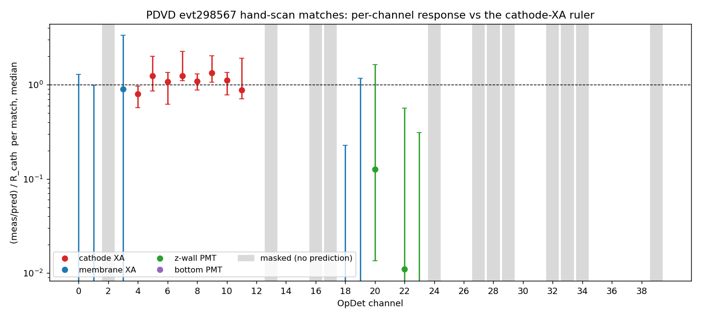
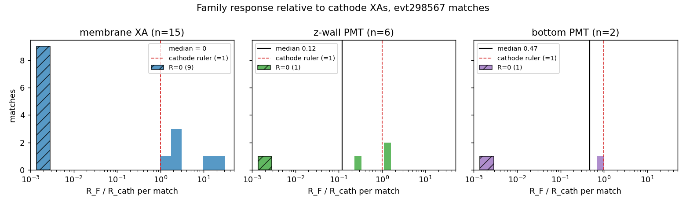
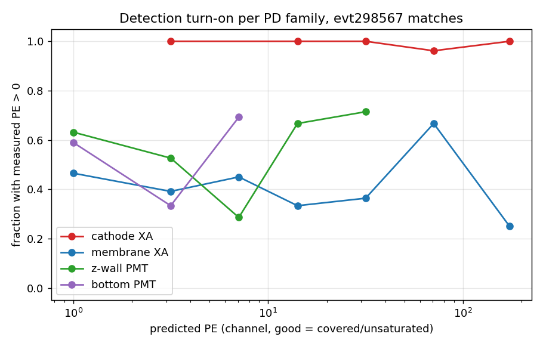
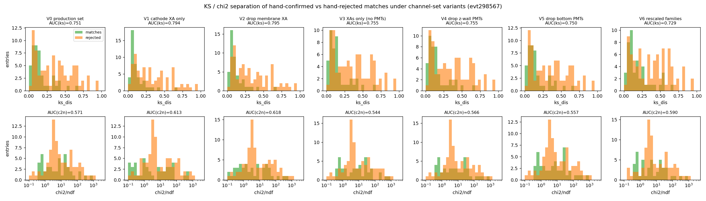

# PD-family reliability from the evt298567 hand scan: wall XAs and PMTs against the cathode-XA ruler

**Status: analysis only — no code or config change. The membrane-XA exclusion in
§6 is PROPOSED, NOT ADOPTED; adoption is a behavior change needing its own A/B
gate and the 18-event census (§7).**

Run 039252, event 298567 (PDVD data). Inputs are the hand-scan labels the owner
saved on the port-5020 `wfresc` display — **44 human-confirmed matches and 84
human-rejected auto-matches** — used to answer two questions with the **cathode
X-Arapucas as the trusted ruler**:

1. Are there better calibration constants for the membrane/wall XAs and the
   PMTs (z-wall and bottom) than the adopted per-family factors
   (`eff_scale_cathode=10.116 / membrane=1.655 / pmt=0.352`, toolkit
   `f7c66ab8`, derived in [doc 12](12_pdvd-qtol-recalibration.md))?
2. Should those families stay in, or leave, the Q/L chi2 and KS shape test?

Short answers: **(1) no constant fixes the membrane XAs (their failure is
bimodal, not a scale); the PMT constants are already about right when the PMTs
detect anything. (2) On this event's labels, dropping the membrane XAs from the
fit improves every discrimination metric; the PMTs help slightly and should
stay.**

## Repro

```bash
# The analysis (read-only inputs; writes PNGs to docs/qlmatch/pics/):
cd /nfs/data/1/xqian/toolkit-dev/wcp-porting-img/pdvd/docs/qlmatch/scripts
python3 eval_pd_family_reliability_evt298567.py
# args (optional): <labels.json> <calib-dump.json> <pics-dir>

# Inputs:
#   work/ql_labels/wfresc/labels-evt298567.json   (44 matches, 84 rejected_auto)
#   work/039252_0_wfresc/calib-evt298567.json     (per-flash pe/pe_err/cov/sat,
#                                                  per-bundle pred_pe, opdets)
# The wfresc dump = the `keep` production operating point + robust-endpoint
# trim/walk-to-floor + the xtpc cathode rescue (doc 16 §10.6 demo):
#   PDVD_LIGHT_SUFFIX=_keep PDVD_QL_ROBUST_TRIM=1 PDVD_QL_ROBUST_WALK_FLOOR=1 \
#   PDVD_QL_XTPC_CATHODE_TOL_CM=10 ./run_clus_evt.sh 039252 0 -s wfresc
```

## 1. Method

### Channel families

OpDet index = position in every 40-channel array (`pe`, `pe_err`, `cov`,
`sat`, `pred_pe`). Families and roles from
`cfg/pgrapher/experiment/protodunevd/qlmatching.jsonnet:120-140`:

| family | channels | masked (`ch_mask_base`) | evaluable here |
|---|---|---|---|
| cathode XA | 4–11 | — | 8 (the ruler) |
| membrane/wall XA | 0–3, 12, 13, 18, 19 | 2 (dim), 13 (no WLS) | 6: {0,1,3,12,18,19} |
| z-wall PMT | 14–17, 20–23 | 16, 17 (dim) | 6: {14,15,20,21,22,23} |
| bottom PMT | 24–39 | 24,27,28,34 (dead), 29,32,39 (Ar-blind), 33 (dim) | 8: {25,26,30,31,35,36,37,38} |

Masked channels get **no prediction** in the dump (the prediction loop skips
`run.opdet_mask==0` channels, `QLMatching.cxx:1380,1545`), so the four *dim*
channels {2,16,17,33} cannot be re-judged from this dump — see §7.

### Closure gate (trust check)

Before any physics, the script reproduces the production metrics from the raw
arrays: `chi2`, `ndf`, `ks_dis` recomputed with the `TimingTPCBundle`
semantics (`examine_bundle`, `TimingTPCBundle.cxx:208-296`; error model
`per_opdet_perr` with PDVD's `pe_err_on_pred=true, floor=2.0, frac=0.6,
lowpe_frac=2.0, lowpe_knee=10`; `mask_ks=true`; `chi2_sat_inflate=0.5`;
`chi2_relax` one-worst-channel forgiveness; close-to-PMT denominator widening
restricted to the bundle's `relax_channels`). Result over all 128 entries:

```
max |dks| = 7.2e-16   max |dchi2|/chi2 = 0.0   max |dndf| = 0   -> PASS
```

Two reimplementation gotchas the closure caught, recorded for future scripts:

- `dump_calib` does **not** round-trip `pe_err_lowpe_frac/knee`; defaulting
  them picks the SBND error branch and the chi2 is wrong by up to 4x.
- The per-bundle `relax_channels` (which PD-surface widening sets fired under
  `vd_surface_flags`) is not in the dump. The script infers it per entry by
  exact chi2 match over the possible unions; on this event: 30 entries =
  anode(bottom PMTs), 12 = y-lo wall, 1 = y-hi wall.

### Ruler analysis selection

Per (match, channel), "good" = unmasked & unsaturated & fully covered
(`cov==1`) & predicted > 0. Per match, the ruler is
`R_cath = Σmeas/Σpred` over good cathode channels; a match enters the
calibration only with ≥4 good cathode channels, `Σpred_cath ≥ 20` PE, and not
`window_truncated` (partial measured light biases every ratio). **30 of 44
matches enter** (12 excluded as truncated, 2 for a weak ruler). Family ratios
`R_F/R_cath` need `Σpred_F ≥ 20` PE; per-channel ratios need `pred ≥ 5` PE.
Medians with 16–84% bands over matches, so bright flashes do not dominate.

## 2. Channel availability (the first reliability axis)

Over the 44 matches, per unmasked channel-flash pairs:

| family | covered (readout present) | railed |
|---|---|---|
| cathode XA | **100.0%** (352/352) | 26.7% |
| membrane XA | **53.8%** (142/264) | 0 |
| z-wall PMT | **56.4%** (149/264) | 0 |
| bottom PMT | **54.3%** (191/352) | 0 |

Only the cathode XAs always have readout. The wall XAs and both PMT groups are
self-trigger silent for **~46% of match-flash pairs** — those channels enter
the production fit at measured 0 (an upper limit; `coverage_mask_fit=false`
per doc 12 §5) and are excluded from the ratio analysis below. Conversely only
the cathode XAs rail (26.7%, the bright-flash DAPHNE clipping of
[doc 11](11_pdvd-saturation-recovery.md)) — handled by keep-and-mark and
excluded per channel here.

## 3. Response against the cathode ruler







Per-family `R_F/R_cath` per match (with-zeros vs detected-only):

| family | n | median (all) | 16–84% | n | median (detected-only) | 16–84% |
|---|---|---|---|---|---|---|
| cathode XA | 30 | 1 (ruler) | — | 30 | 1 | — |
| membrane XA | 15 | **0.000** | [0.00, 2.59] | 6 | **2.47** | [1.74, 15.6] |
| z-wall PMT | 6 | 0.119 | [0.006, 1.55] | 4 | 0.88 | [0.12, 1.56] |
| bottom PMT | 2 | 0.470 | [0.15, 0.79] | 1 | 0.94 | — |

And the detection turn-on (fraction of good channels with measured PE > 0 vs
predicted PE):

| family | pred 0.5–2 | 2–5 | 5–10 | 10–20 | 20–50 | 50–100 | ≥100 |
|---|---|---|---|---|---|---|---|
| cathode XA | — | 1.00 | — | 1.00 | 1.00 | 0.96 | 1.00 |
| membrane XA | 0.47 | 0.39 | 0.45 | 0.33 | 0.36 | 0.67 | **0.25** |
| z-wall PMT | 0.63 | 0.53 | 0.29 | 0.67 | 0.71 | 1.00 | — |
| bottom PMT | 0.59 | 0.33 | 0.69 | 1.00 | — | — | — |

**Cathode XA (the ruler is sound).** Detects 100% of the time down to ~2 PE
predicted. Per-channel medians span 0.79–1.33 — a ±30% channel-to-channel
structure worth a per-channel (not per-family) constant someday, but centered
on 1 as doc 12's closure found.

**Membrane/wall XA — bimodal, not miscalibrated.** In 9 of 15 matches with
≥20 PE predicted the family measured **exactly zero**; when it does detect, it
measures ~**2.5x** the calibrated prediction with a 16–84% band reaching 15x.
Critically the zero-fraction does **not** improve with predicted brightness
(0.25 at ≥100 PE predicted) — this is not a self-trigger threshold effect but
channels (or the model's geometry for them) failing outright on a
per-flash/per-position basis. Among matches it also carries the **worst fit
tension: chi2/ndf = 61.6**, above even the railed-cathode terms (42.4).

**z-wall and bottom PMTs — roughly calibrated, information-poor.** Given
detection, their gains sit at 0.88 and 0.94 of the cathode ruler — consistent
with the current x0.352 within these tiny samples (n=4, n=1). Their turn-on
rises with predicted PE like a real threshold, and their chi2/ndf among
matches is benign (4.5 and 2.0). Their problem is not correctness but weight:
with the current constants they rarely predict >20 PE for these tracks, so
they contribute little either way.

## 4. Does including them help or hurt the KS/chi2? (44 vs 84 discrimination)

The 84 `rejected_auto` entries are the auto-matches the human deleted — the
exact confusions the metrics failed to kill. Recomputing `ks_dis` and
`chi2/ndf` under channel-set variants (production semantics throughout,
inferred relax sets reused; AUC = probability a confirmed match scores better
than a rejected one; "clean"/"good" = fraction passing the production
high-consistency rungs ks<0.06/c2n<35 and ks<0.10/c2n<35):

| variant | AUC(ks) | AUC(c2n) | med ks m/r | clean m/r | good m/r |
|---|---|---|---|---|---|
| V0 production set | 0.751 | 0.571 | 0.116/0.332 | 0.25/0.06 | 0.43/0.23 |
| V1 cathode XA only | 0.794 | 0.613 | 0.080/0.293 | 0.27/0.07 | 0.52/0.17 |
| **V2 drop membrane XA** | **0.795** | **0.618** | 0.082/0.279 | **0.32/0.08** | **0.59/0.17** |
| V3 XAs only (no PMTs) | 0.755 | 0.544 | 0.117/0.326 | 0.27/0.07 | 0.45/0.21 |
| V4 drop z-wall PMTs | 0.755 | 0.566 | 0.117/0.326 | 0.27/0.07 | 0.45/0.21 |
| V5 drop bottom PMTs | 0.750 | 0.557 | 0.116/0.329 | 0.25/0.07 | 0.43/0.21 |
| V6 rescaled families | 0.729 | 0.590 | 0.128/0.373 | 0.18/0.07 | 0.41/0.15 |



Readings:

- **Dropping the membrane XAs (V2) improves everything**: both AUCs, the
  median-KS gap, and — most operationally relevant — the fraction of
  *confirmed* matches passing the "good" high-consistency rung rises from 43%
  to **59%** while the rejected-side leakage *falls* 23% → 17%. More true
  matches would enter the high-confidence ladder and fewer junk ones.
- **The PMTs mildly help.** V2 (cathode+PMTs) edges out V1 (cathode only) on
  every column, and each PMT-drop variant (V4, V5) is no better than keeping
  them. Removing both PMT groups while keeping the membrane XAs (V3) is the
  worst XA-side option.
- **Recalibration does not substitute for exclusion.** V6 applies the
  detected-only medians (membrane x2.47, PMTs x0.88/0.94) to the predictions
  and *degrades* the separation (AUC(ks) 0.729): scaling a bimodal response
  moves the detected half onto the data at the price of doubling the tension
  on the (more numerous) zero half. This is the direct experimental
  confirmation that the membrane-XA failure is not a constant.

## 5. Answers

**Q1 — better calibration constants?** Not from this data, and likely not at
all for the membrane XAs:

- *Membrane XA*: the with-zeros median is 0.000 and the detected-only median
  is 2.47 with a 9x spread — **no single scale factor describes it**, and V6
  shows a rescale hurts matching. If the detected-only 2.5x persists in the
  18-event census it may hint the x1.655 is ~2.5x too low *for the sensitive
  fraction*, but fixing that without addressing the zeros makes matching
  worse.
- *z-wall / bottom PMT*: detected-only gains 0.88 / 0.94 relative to the
  cathode ruler — the adopted x0.352 is **consistent within these very small
  samples** (n=4 / n=1). No change recommended.
- *Cathode XA*: the ±30% per-channel structure (0.79–1.33) is the one place a
  finer constant (per-channel, from the 18-event set) could genuinely help
  the chi2; the family scale itself is doc 12's and is confirmed here.

**Q2 — include or exclude from KS/chi2?** On this event's evidence: **exclude
the membrane/wall XAs, keep the cathode XAs and both PMT groups.** The
membrane XAs are unreliable in a way error inflation only partially mitigates
(their zeros carry false shape information into the KS, which has no error
model at all); the PMTs are individually weak but collectively a small net
positive and cost nothing.

## 6. Config-only recipe (proposed, NOT adopted)

No C++ is needed. Excluding the six live membrane XAs from chi2, KS **and**
LASSO is one line in `cfg/pgrapher/experiment/protodunevd/qlmatching.jsonnet`:
extend the static mask (`ch_mask_base`, `:91`) with `[0, 1, 3, 12, 18, 19]`
(2 and 13 are already masked). Because PDVD already runs `mask_ks: true`, a
`ch_mask` channel leaves the KS CDFs too (`TimingTPCBundle.cxx:223-224`), and
masked channels never enter the LASSO system (`QLMatching.cxx:1230-1236`).

Two knock-on effects to check at adoption time:

- The `vd_surface_flags` y-wall relaxation sets (`wall_ylo/yhi_channels` =
  membrane XAs) become inert — the widening only applies to in-mask channels.
  Harmless but the 12+1 wall-relaxed entries of §1 would lose their widening
  target; their chi2 changes.
- This is a **behavior change with no byte-identical-off path once the mask
  line is edited in place** — thread it as a default-OFF knob (e.g. a
  `mask_membrane_xa=false` function arg appending to `ch_mask_base` with the
  key-suppression idiom) so the legacy config stays byte-identical.

## 7. Caveats and follow-ups

- **One event, one run.** 44+84 labels from evt298567 only (the owner's
  choice for this pass). The natural extension is the 18-event `candles-keep`
  label set (`work/ql_labels/candles-keep/labels-evt*.json` against
  `work/*_keep` dumps) — same script, loop over events. All adoption
  decisions (the §6 mask, any cathode per-channel constants) should gate on
  that census, plus doc 12's crosser-triplet estimator as the complementary
  measurement.
- The hand scan is **match-level** truth: a confirmed match does not certify
  every channel, and a rejected auto-match's `pred_pes` belongs to a wrong
  pairing by construction (that is what makes it a negative example).
- The four **dim channels {2,16,17,33} are not evaluable** from this dump
  (masked channels get no prediction). Re-judging them needs a scratch re-run
  with a reduced `ch_mask`.
- `window_truncated` matches (12/44) are excluded from the ratio analysis but
  kept in the discrimination test (both label classes contain them).
- The bottom-PMT calibration numbers rest on n≤2 family sums and no
  predicted-PE reach above 20 PE — treat as weak consistency checks only.
- The ladder columns apply the B1/B2 rungs to recomputed metrics; the
  production ladder has further branches (miss/two-boundary) not simulated
  here. AUCs are threshold-free and unaffected.

Cross-references: [doc 12](12_pdvd-qtol-recalibration.md) (family-factor
calibration of record), [doc 13](13_pdvd-pd-functionality-run39252.md)
(PD functionality audit: the dim-channel maskings),
[doc 11](11_pdvd-saturation-recovery.md) (cathode railing),
[doc 16](16_pdvd-clus97-crosser-evt298567.md) (the wfresc dump's knobs).
