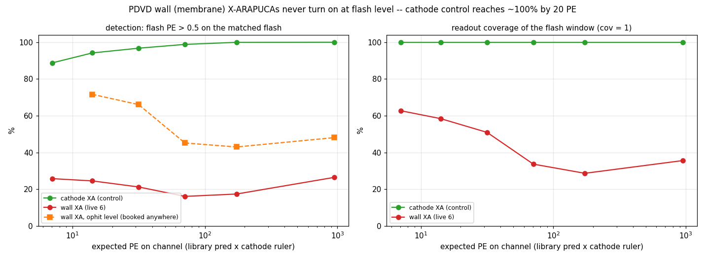
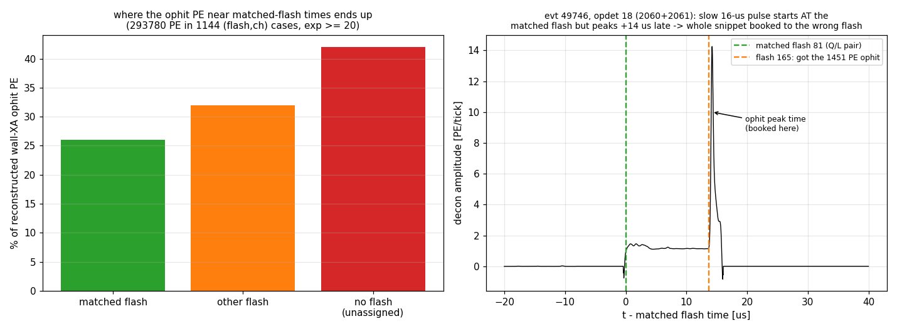
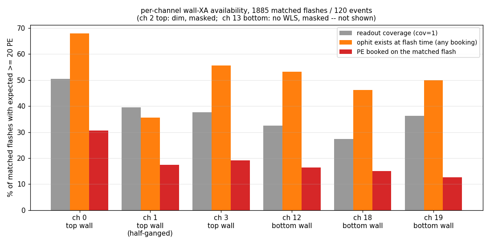
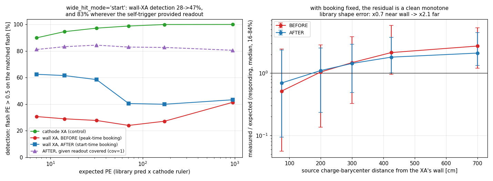

# 25 — Are the PDVD wall (membrane) X-ARAPUCAs usable? A matched-pair autopsy

2026-07-18.  Status: **analysis + one default-OFF light-reco knob (§7).**  The
wall XAs stay excluded from the Q/L fit (`mask_wall_xa`, doc 18); this study
asks *why* they fail and whether they are recoverable, using the matched Q/L
pairs as the probe.  Follow-up to doc 17 (single-event hand-scan verdict
"bimodal, no scale factor fixes it") at 120-event statistics, now with a
mechanism — and, in §7, with the reconstruction fixed and the efficiency and
photon-library questions re-measured on the fixed sample.

**Headline: the wall XAs are much better hardware than the flash arrays make
them look.  The single biggest loss is a light-reconstruction artifact — the
membrane self-trigger snippets produce one broad OpHit stamped at its *peak*
time, and the flash finder books the whole snippet's PE to the wrong flash
(32%) or to no flash at all (42%); only 26% lands on the matched flash.  The
second loss is self-trigger readout coverage (~40% at ≥20 PE expected, and
*anti*-correlated with brightness).  The photon library contributes a real
but secondary ~×2–4 distance-dependent shape error.  After a reconstruction
fix + re-calibration the live wall XAs are plausibly usable as coverage-aware
cross-check channels; ch 2 (dim) is hardware-dead, ch 1 runs on half its
SiPM ganging, and ch 13 has no WLS but demonstrably reads out.**

## Repro

```bash
# inputs: the 120 canonical `_keep` dumps (039252 x18 + 039253 x18 + 039349 x84)
# -- the last round where the wall XAs still receive photon-library predictions
# (the cathxa round masks them; doc 18) -- and the `_light<evt>_keep` opflash
# archives (ophits tensor).
cd pdvd/docs/qlmatch/scripts
python3 wall_xa_study.py        # -> wall_xa_flash_channel.tsv  (1885 gated flashes x 40 ch)
python3 wall_xa_ophit_join.py   # -> wall_xa_ophit_join.tsv     (2873 wall cases, exp>=10)
python3 wall_xa_figs.py         # -> pics/25_wallxa_*.png + headline numbers

# membrane-frame waveform probe (7 events; 298567 kept frames, the other 6
# regenerated with the standalone validation job -- output to scratch, never
# into work/):
#   wcsonnet -A input_file=input_data_light/<rawwf.root> \
#            -A output_file=$WALLXA_DIR/membrane-frames-<run>-<evt>.tar.bz2 \
#            -A run=<run> -A event=<evt> -A branch=membrane -o cfg.json \
#            wct-light-frames.jsonnet   &&   wire-cell -c cfg.json
python3 wall_xa_wf_probe.py     # FLAT / LIGHT-AT-FLASH-TIME / NO-SNIPPET classes

# §7 -- reprocess all 120 events' light with the wide-hit booking fixed
# (toolkit OpHitFinder wide_hit_mode knob, default OFF; runner env turns it
# on for this STUDY round only; fresh _whfix tags, _keep untouched):
cd pdvd && export PDVD_MEM_WIDE_HIT_MODE=start PDVD_PMT_WIDE_HIT_MODE=start PDVD_MAX_JOBS=6
./run_light_all.sh -s _whfix 39252 ; ./run_light_all.sh -s _whfix 39253
for f in input_data_light/np02vd_raw_run039349_*_rawwf.root; do
  ./run_light_all.sh -f "$f" -s _whfix 39349; done
cd docs/qlmatch/scripts
python3 wall_xa_whfix_join.py   # -> wall_xa_whfix_join.tsv (matched flashes x 40 ch)
python3 wall_xa_whfix_figs.py   # -> pics/25_wallxa_whfix.png + §7 numbers

# §8 -- wall-XA-in-QLMatching evaluation (matching-only, 039252 x18):
python3 wall_xa_ql_calib.py     # per-channel gains + PDVD_QL_MEASURED_PE_SCALE line
./wall_xa_ql_variants.sh        # wx0/wx1/wx2/wx3 tags (fresh only, M13)
cd ../../.. && for t in wx0 wx1 wx2 wx3; do python ql_display/ql_agree_score.py --tag $t; done
python3 docs/qlmatch/scripts/wall_xa_ql_forensics.py   # churn + gate forensics + non-match counts
```

## 1. Method

- **Sample**: every flash with ≥1 `auto_selected` bundle in the 120 `_keep`
  dumps, quality-gated by the cathode-XA ruler (doc 17 conventions): ≥4 good
  cathode channels (`cov==1`, unsaturated, predicted), Σpred_cath ≥ 50 PE,
  ruler `R_cath = Σmeas/Σpred ∈ [0.5, 2]`, no `window_truncated` bundle.
  **1885 matched flashes** survive (131 of them gold `xtpc_pin` crossers).
- **Expected PE** per channel: `exp = pred × R_cath` — the v5-library
  prediction summed over the flash's selected bundles, normalized by that
  flash's own cathode response, so per-flash QtoL/attenuation scale drops out
  and channel response is isolated.
- Channels: live wall XAs {0, 1, 3} (top wall, x +229…+306 cm) and
  {12, 18, 19} (bottom wall, x −201…−278 cm), all on the ±y = 417.6 cm
  membrane walls at mid-z; masked wall XAs 2 (dim) and 13 (no WLS) observed
  measured-only; cathode XAs 4–11 as control.
- Three probing depths: **flash arrays** (`pe/cov/sat`, what the Q/L fit
  sees) → **ophits tensor** in the production `opflash_pdvd-wct.tar.gz`
  (col 0 opch, 1 hit time ns, 2 width ns, 4 peak amplitude, 5 PE,
  6 start time ns, 7 assigned flash row, −1 = none) → **deconvolved membrane
  waveforms** (7 events; time base verified `light-frame µs = dump.time −
  trigger_offsets_us[0]`, and decon integral closes to flash PE ~1:1 on
  moderate-PE fired cases).

## 2. The flash-level picture: a family that never turns on



At exp ≥ 20 PE (2200 wall cases): readout coverage **38%**, PE booked on the
matched flash **19–28%**, and neither improves with brightness — the cathode
control reaches ~100% detection by 20 PE, the wall XAs are *flat at ~20–28%
out to ≥300 PE expected*.  There is no threshold turn-on; this alone says the
failure is not "small signals below threshold".

Response when they do fire is the doc-17 bimodality at scale
(pics/25_wallxa_ratio.png, left): a zero spike (49–72% of covered channels at
exp ≥ 20 read < 0.25×exp) next to a broad **over-unity** lobe (median
meas/exp 1.2–3.2 per channel, 16–84% spanning ×0.5–×6; cathode control:
0.84–1.22 with ×1.7 spread).  The failure fraction is **flat vs source
distance to the wall (63–64% over 0–350 cm), flat vs drift offset, and
identical in all three runs** (62/61/60%) — not a geometry error, not a
run condition.

Coverage *anti*-correlates with brightness: 63% at exp ~5–10 falling to ~29%
at ≥100, and 51%→38% vs flash total PE at fixed exp — the self-trigger is
*more* likely silent in bright, busy windows (open question for DAPHNE
config; §6).

## 3. The mechanism: snippet-wide OpHits booked at peak time

The production ophits tensor resolves the bimodality.  Membrane channels are
1024-tick (16.4 µs) self-trigger snippets; slow/diffuse light fills the whole
snippet, the hit finder merges it into **one wide OpHit** (widths up to the
full 16.4 µs) whose *time* is the **peak** of the pulse, while its *start*
(col 6) sits exactly at the matched flash.  The flash finder then books the
entire snippet integral to whichever 1 µs flash bin contains the peak:

```
evt49746 flash 91 (opdet 12): ophits 2050/2051 = 450 + 360 PE, start AT the
  flash, peak +0.9 us  -> assigned flash -1 (NONE); flash pe[12] = 0.0
evt49746 flash 81 (opdet 18): ophit 2060/2061 = 1451 + 1186 PE, start AT the
  flash, peak +14.2 us -> booked to flash 165 (14 us later); flash pe[18] = 0
evt49746 flash 104 (opdet 3): 1064 PE ophit, start -15 us, peak +0.8 us ->
  booked to flash 215, 0.8 us from the matched flash 214
```



Population-scale (ophit start within [−1, +6] µs of the matched flash,
exp ≥ 20, 294k PE in 1144 cases): **26% of the reconstructed wall-XA PE is
booked to the matched flash, 32% to another flash, 42% to no flash at all.**
Detection doubles when scored at ophit level instead of flash level: 28% →
**52%**.  This also explains the over-unity lobe: when a snippet *is* booked
to the right flash it carries the full 16.4 µs integral, including late and
neighboring-flash light.

The 7-event waveform probe closes the loop at exp ≥ 50: of 45 covered "dead"
cases, **21 have the light sitting in the deconvolved waveform at the flash
time** (flat slow pulses, integrals up to ~800 PE) and 24 are genuinely flat;
of 91 uncovered cases, 18 have light in the (partially-covering) snippets,
38 have snippets elsewhere only, 35 have no snippet within ±30 µs.  All 5
responding controls show in-window light, as they should.

## 4. The owner's four questions

**(1) Is "top wall worse than bottom wall" supported?  No — if anything the
reverse, and per-channel personality dominates.**



| ch | wall | cov% (exp≥20) | ophit-det% | flash-det% | dead-if-cov% | med ratio (resp.) |
|---:|------|----:|----:|----:|----:|----:|
| 0  | top    | 50.5 | **67.9** | 30.6 | 49.3 | 1.26 |
| 1  | top ⚠ half-ganged | 39.5 | 35.5 | 17.4 | 65.8 | 1.21 |
| 3  | top    | 37.6 | 55.6 | 19.2 | 60.2 | 3.17 |
| 12 | bottom | 32.6 | 53.2 | 16.4 | 65.3 | 2.28 |
| 18 | bottom | 27.4 | 46.3 | 15.1 | 66.2 | 2.16 |
| 19 | bottom | 36.3 | 50.0 | 12.6 | 71.7 | 2.34 |

Top-wall coverage and detection are slightly *better* than bottom on average;
the gold (`xtpc_pin`) subsample agrees (dead-mode 47–59% top vs 64–73%
bottom).  The credible source of the "top is worse" impression is two
specific top channels, not the family: **ch 2 is hardware-dim** (14% coverage
at peer-exp ≥ 20, fires 7% of the time — the doc-13 ~8–50× deficit; masked)
and **ch 1 runs on half its SiPM ganging** — the DAPHNE map has only opch
2030; its pair 2031 is absent from the readout, and ch 1 is correspondingly
the worst *live* channel (ophit-det 35.5% vs ch 0's 67.9%).  Meanwhile
bottom's ch 13 (no WLS, masked, Ar-blind by design) demonstrably *reads out*
(76% coverage, fires 39% with median 14 PE on bright flashes) — whatever
residual sensitivity that is, the electronics chain works.

**(2) Worse efficiency — not firing when it should?  Yes, but in three
separable layers**, none of which is a sharp threshold: (i) self-trigger
coverage ~38–40% (readout, §4.3); (ii) among covered channels, the booking
artifact of §3 (recoverable in software); (iii) a genuinely-flat remainder
(~half of the covered dead cases at waveform level) — diffuse light below
the DAPHNE trigger in a covered-by-another-snippet window, plus any real
optical deficit.

**(3) Is the mismatch from the photon library?  Partly — a real ×2–4 shape
error, but it is the *smallest* of the three effects.**  At flash level the
pattern correlation is destroyed by the booking artifact (log-log Pearson
0.0–0.28 vs 0.89–0.92 for cathode channels).  At ophit level (booking-
independent) the response is centered near unity — `avail/exp` median 1.35,
16–84% 0.24–3.25 — but with a clean monotone distance trend: median ~0.5
when the source charge barycenter is < 150 cm from the XA's wall, rising to
~2 beyond 350 cm (pics/25_wallxa_ratio.png, right).  The v5 library falls
off too fast for the y-normal wall XAs: over-predicts near field, under-
predicts far field.  Correctable with a distance- (or ANN-input-) dependent
recalibration once the reconstruction is fixed — but even then the per-flash
scatter (×3 at 16–84%) is far wider than the cathode's ×1.7.

**(4) Readout as the photon-efficiency culprit?  Yes, two distinct readout
losses** on top of the reco artifact: (a) the DAPHNE self-trigger is simply
silent — no snippet within ±30 µs — for ~⅓ of the probed uncovered cases,
and coverage *drops* with brightness (§2), suggesting rate/hold-off behavior
in busy windows rather than a plain threshold; (b) partial-coverage snippets
(cov fractional < 1) that the fit scores as "no data".  Plus the ch 1
half-ganging and ch 2 dimness above.  **Any other reason?** — §3 *is* the
other reason, and it is the biggest one.

## 5. Verdict on usability

- The hardware is substantially healthier than the Q/L arrays suggest: in
  52% of ≥20 PE-expected cases the light is reconstructed *somewhere*, at
  amplitudes commensurate (×0.5–3) with the library expectation, and the
  waveform probe finds real multi-hundred-PE pulses at exactly the matched
  flash times.  "Bimodal wall XAs" (doc 17) was the right description of the
  arrays and the wrong description of the detectors.
- Keeping them **out of the Q/L fit today is still correct** — flash-level
  PE on these channels is untrustworthy in both directions (zeros from
  misbooking, over-unity from snippet-integral pile-up).
- Recovery path, in order: (1) **light-reco fix** — split/re-time membrane
  snippet hits (book PE by pulse start, or spread the snippet integral
  across flash bins; alternatively integrate the decon directly over each
  flash window as done for full streams).  This alone roughly doubles usable
  detection and removes both failure lobes.  (2) **DAPHNE config review** of
  the membrane self-trigger (the brightness anti-correlation of §2 is the
  test case).  (3) **Re-derive the per-channel calibration and the
  distance-dependent library correction** on the then-clean sample.
  (4) Channel dispositions: ch 2 stays masked (hardware-dim); ch 1 usable
  with its own half-ganging calibration; ch 13 stays out for Ar running
  (no WLS) though its electronics are fine.
- Even fully recovered they will remain ~40–60%-duty, coverage-masked
  channels — cross-check/veto material and Q/L tie-breakers, not core fit
  channels like the cathode XAs.

## 6. Open questions

1. Why does self-trigger coverage fall with brightness (63% → 29%)?  DAPHNE
   rate limiting / hold-off / event-builder truncation are candidates —
   needs the DAPHNE configuration, outside this dataset.
2. The genuinely-flat covered dead cases (~half of the probed DEAD class):
   diffuse light below trigger inside another snippet's coverage, or a real
   optical loss?  Needs a reco-fixed sample to re-measure.
3. The ophit-level `avail` window ([−1, +6] µs on hit start) can scoop
   neighboring-snippet light in busy events; the ×3 scatter in §4.3 is an
   upper bound on the true response spread.
4. Auto-matched pairs at the keep operating point carry ~15–30% wrong
   matches; the cathode-ruler gate and the gold-crosser cross-checks bound
   the contamination (gold reproduces every conclusion), but a post-cathxa
   re-run with hand-confirmed pairs would tighten the ratios.

## 7. The reconstruction fixed: wide_hit_mode='start' (2026-07-18 follow-up)

Owner follow-up: fix the light-reconstruction booking, keep the wall XAs out
of Q/L, and re-measure efficiency and photon-library matching on the fixed
sample.  Also: the PMTs ride the same 16.4-µs snippets — audit them too.

### 7.1 The knob

`OpHitFinder` gains **`wide_hit_mode`** (toolkit, C++ default `""` = legacy,
byte-identical): for hits wider than `wide_hit_min_width` (2 µs),

- **`"start"`** re-times the hit to its pulse **onset**, so `OpFlashFinder`
  books the full integral to the flash that produced it.  This is the
  cathode full-stream convention and the only booking comparable to a
  *total-light* photon-library prediction — the mode used below.
- **`"slice"`** cuts the pulse into 1 µs sub-hits (`slice_width`), each with
  its own area and peak time.  Time-faithful, but a flash then carries only
  its prompt window's share: on the evt298567 test the crosser flash's wall
  PE *dropped* (306 → 40 on ch 3) and the unassigned fraction *rose*
  (61% → 80%, tail slices below flash threshold) — implemented, kept for
  timing studies, **not** the mode for Q/L-style comparisons.

Wiring: `protodunevd/flash.jsonnet` `ophit(wide_hit_mode=,
wide_hit_min_width_us=, slice_width_us=)` (key-suppressed);
`pdvd/wct-light-reco.jsonnet` TLAs `mem_wide_hit_mode` / `pmt_wide_hit_mode`;
runner envs `PDVD_MEM_WIDE_HIT_MODE` / `PDVD_PMT_WIDE_HIT_MODE` (default
empty = off — **study knob, not a production operating point**).

Proofs: compiled config knob-off diff vs pre-change EMPTY; knob-on adds
exactly `wide_hit_mode/wide_hit_min_width/slice_width` on the mem+pmt
`OpHitFinder` nodes (cathode untouched); runtime knob-off `opflash` archive
member-content hash `027c16c6…` **identical** to the production
`_light298567_keep` archive; `wcdoctest-flash` 31/31; sentinel
`wide_hit_mode 'start' on: min_width=2000 ns` on both branches.  PE is
conserved exactly in `start` mode (hits only re-timed: 1575 membrane hits,
56 462 PE before and after on evt298567).

### 7.2 Efficiency with the booking fixed (120 events, `_whfix`)



Same 1885-flash matched sample, new flash arrays matched by time (|Δt| <
0.6 µs; 9/1885 flashes lost to re-segmentation).  At exp ≥ 20 PE:

| | BEFORE (peak booking) | AFTER (start booking) |
|---|---:|---:|
| detection, all | 27.9% | **46.7%** |
| detection, gold crossers | 20% | 39% |
| detection given cov = 1 | ~50% | **83%** |
| covered-but-dark share of misses | ~half | **6 of 53 pts** |
| responding ratio med (16–84%) | 1.21 (0.16–3.75) | 1.36 (0.31–3.16) |
| log-log corr (meas vs exp) | 0.17 | 0.27 |

Per channel (detection at exp ≥ 20): ch 0 40→61%, ch 1 18→31%, ch 3 30→51%,
ch 12 28→48%, ch 18 29→42%, ch 19 20→44%.  The cathode control is untouched
(99.6/99.3% and identical ratios — the knob re-times only mem/pmt hits).

**The efficiency question is now closed**: detection-given-readout is **flat
at 81–84% from 5 to 1000 expected PE** — no brightness dependence, no
threshold wall.  The remaining inefficiency is almost entirely the
**self-trigger coverage** (38% at exp ≥ 20; 47 of the 53 missed points have
cov < 1, only 6 are covered-but-dark).  The §2 "genuinely flat covered"
class was mostly mis-booking too.  What remains is a DAPHNE
trigger/coverage question, not an optics one.

### 7.3 Photon-library matching with the booking fixed

The responding-mode ratio is now a clean, monotone **distance shape error**:
median meas/exp = 0.69 at source–wall distance < 150 cm, 1.10 (150–250),
1.43 (250–350), 1.80 (350–500), 2.10 (> 500 cm) — the v5 library falls off
too fast with distance for the y-normal wall XAs (over-predicts near field
×1.4, under-predicts far field ×2).  A distance-dependent (or ANN-input)
recalibration is now well-defined; doc 01's membrane treatment is the place
to revisit.  The in-bin 16–84% spread remains ×3–5 near / ×2 far, so even
recalibrated the wall XAs would carry per-flash errors several times the
cathode's ×1.7 — consistent with their §5 role as cross-check channels, not
core fit channels.

### 7.4 The PMT side (owner follow-up: same disease?)

Yes, in milder form: only ~1% of PMT hits exceed 2 µs, but they carry **22%
of the PMT PE**, 46% of it unassigned to any flash.  The same knob now
covers the PMT branch (`pmt_wide_hit_mode`).  Effect on the matched sample
(exp ≥ 20): z-wall PMT detection 43→40%, bottom PMT 54→50% — essentially
unchanged, because narrow hits dominate PMT detections; the small *decreases*
are removed false positives (wide late-light blobs that peak-booking had
credited to the matched flash).  Bottom-PMT responding median moves 0.13 →
0.31.  The PMT fix matters mainly for *PE-scale honesty* (no more 16-µs
integrals teleported into bright flashes), not for detection.

### 7.5 Updated verdict

- Hardware efficiency is **not** the wall XAs' problem: given readout, they
  fire at 83% independent of brightness and geometry.
- The recovery ladder of §5 is now: (1) ~~light-reco fix~~ **done** (this
  knob; owner decision pending on making `start` a production default — it
  changes flash PE/segmentation for *all* self-trigger channels, so it needs
  its own validation round); (2) DAPHNE self-trigger coverage (the 38%
  ceiling and its brightness anti-correlation) — hardware/config domain;
  (3) the ×3 distance recalibration of the v5 library for wall geometry.
- Wall XAs stay masked in Q/L matching for now (unchanged), but the path to
  "usable as coverage-masked cross-check channels" is concrete.

## 8. Can the wall XAs improve QLMatching? (2026-07-18 owner follow-up)

Owner question: with the reconstruction fixed, do the wall XAs *help* the
matching if we put them back into the fit (after recalibrating the overall
gain)?  Metrics fixed by the owner: (1) agreement with the frozen human+AI
scan truth (`ql_agree_score.py`, doc 19 reference: gold 298567 hand scan +
17-event cathxa AI scan), (2) the number of non-matched long clusters.

### 8.1 Design

Matching-only reruns of the 18 scanned 039252 events from the canonical
`_keep` clustering (`stage_ql_tag.sh`), with the §7 `_whfix` light (booking
fixed — without it 74% of wall PE is on the wrong flash or none, §3, and
inclusion would be meaningless).  All current production runner defaults on
top; only the wall handling varies:

| tag | wall XAs | calibration | wall pe_err family |
|---|---|---|---|
| `wx0` | masked (production) | — | — |
| `wx1` | **in the fit** | measured_pe_scale | frac 1.5 / lowpe 3.0 @ 10 |
| `wx2` | in the fit | none | none (global model) |
| `wx3` | in the fit | measured_pe_scale | frac 3.0 / lowpe 5.0 @ 10 |

Two new default-OFF knobs carry the study (no C++ change; compiled config
byte-identical when unset, proof: stash-diff empty vs pre-edit HEAD; ON
adds exactly the new keys):

- `measured_pe_scale` (toolkit `protodunevd/qlmatching.jsonnet`, runner env
  `PDVD_QL_MEASURED_PE_SCALE`): length-40 multiplier on the *measured* PE at
  the Opflash read (C++ knob existed, previously unthreaded).  Gains from
  the §7 sample, scale = 1/median(meas/exp), responding cases exp ≥ 10
  (`wall_xa_ql_calib.py`): ch0 0.787, ch1 0.751, ch3 0.393, ch12 0.585,
  ch18 0.518, ch19 0.457 — the fixed booking runs *hot* against the
  pre-fix-fitted `eff_scale_membrane = 1.655`.  Residual per-channel scatter
  p16–p84 = 0.28–2.16.
- third `pe_err_family` for the live wall XAs (0,1,3,12,18,19) (envs
  `PDVD_QL_PEERR_WALL_{FLOOR,FRAC,LOWPE_FRAC,LOWPE_KNEE}`): family arrays
  keep exactly two members unless a wall member is set.
  Sentinel: `pe_err_family override active: 3 families, 38 channels`.

### 8.2 Result: inclusion loses on both metrics

Overall rows (18 events, objective tiers, long tracks; `work/ql_scores/<tag>/`
+ `wall_xa_ql_forensics.py`):

| tag | agree | phantom | agree% | missed | missed% | non-matched long |
|---|---|---|---|---|---|---|
| `ac3` (adopted, default light) | 764 | 118 | 86.6% | 78 | 9.3% | 94 |
| `wx0` (whfix light, walls masked) | 748 | 103 | 87.9% | 94 | 11.2% | **88** |
| `wx1` (walls in, calibrated) | 636 | 69 | 90.2% | **206** | 24.5% | 119 |
| `wx2` (walls in, uncalibrated) | 624 | 68 | 90.2% | 218 | 25.9% | 127 |
| `wx3` (walls in, wide errors) | 637 | 70 | 90.1% | 205 | 24.3% | 119 |

- **Scan agreement**: putting the walls in the fit nearly *triples* the
  missed scan positives (94 → 206) and drops absolute agreement 748 → 636.
  The headline agree% *rises* to 90.2% only because the judged set shrinks —
  the pairs that survive are cleaner, but far fewer scanner-confirmed pairs
  survive.  The one genuine gain: phantoms drop 103 → 69 (the walls do have
  veto power against predicted-bright-but-dark pairings).
- **Non-matched long clusters**: 88 → 119 (+35%).  Worse, not better.
- Calibration matters but is not the story: uncalibrated `wx2` is worse than
  `wx1` on every count, yet `wx1` is still far behind `wx0`.
- The `wx0` control shows the light fix alone is roughly neutral-to-positive
  for matching with walls masked: phantoms 118 → 103 and raw non-match
  94 → 88 vs `ac3`, at +16 missed against a scan truth whose flash times
  come from the *old* light (re-scoring at tol 1.0 µs moves only 2, so this
  is mostly genuine re-segmentation, not a join artifact).

### 8.3 Why: the damage is structural, not a tuning problem

Churn wx0 → wx1 over the 1583 selected pairs: 1075 unchanged, 324 moved to
a different flash, 184 lost selection entirely (all 184 still have candidate
bundles — gate-fail, not containment).  For the 179 traceable losses, the
wx1 bundle at the same flash time vs the wx0 selected bundle:

- KS median 0.093 → 0.199; **118/179 cross the 0.10 ladder ceiling**.
- chi2/ndf median 4.5 → 5.6; only 2/179 cross the ceiling 35.
- LASSO strength median 0.81 → 0.00 (145 collapse below the 0.05 cutoff) —
  largely the *downstream signature* of the KS cull, which removes bundles
  before the fit.

The KS shape test has no error weighting, so the wall channels enter it at
full weight, and their flash-pattern correlation is far too weak (log-log
corr 0.27 vs cathode 0.9, §7.3: ×3 monotone distance shape error + ×3–5
in-bin scatter + 53% readout-coverage holes read as zeros).  `wx3` proves
the saturation: tripling the wall error widths — which *does* soften chi2
and the LASSO weights — changes nothing (637/205/119 vs 636/206/119),
because the error-weighted paths were never the binding constraint.

### 8.4 Verdict and the remaining levers

**As-is, the wall XAs must stay out of the Q/L fit** — an overall gain
recalibration (the owner's proposed lever) is not sufficient: it helps at
the margin (wx1 vs wx2) but the inclusion still loses on both owner metrics.
`mask_wall_xa` remains the right production setting.  What *could* change
the answer, in order of leverage:

1. **A walls-out-of-KS/ladder mode** (new C++ knob: wall channels in the
   error-weighted chi2/LASSO only, with the wide wall family errors, out of
   the un-weighted KS and the highconsist ladder).  The phantom-veto power
   (103 → 69) suggests a real payoff if the KS poisoning is removed; the
   184 losses were ladder/KS kills, not chi2 kills.
2. **Coverage-aware per-flash wall masking** (drop a wall channel only for
   flashes where its self-trigger coverage is partial), removing the
   47-points-of-53 coverage holes from the comparison.
3. **Distance-dependent library recalibration** (§7.3's ×0.69 → ×2.10 shape
   error) — an overall gain cannot fix a shape error; this would also
   shrink the KS damage if (1) is not taken.

These are all new-knob rounds needing their own censuses — owner-gated.

## Appendix: sample and files

- 1885 gated matched flashes (of the 120-event `_keep` dumps), 131 gold.
- `scripts/wall_xa_flash_channel.tsv` — 75 400 rows: per (gated flash,
  channel) pred/meas/cov/sat + ruler + charge barycenter.
- `scripts/wall_xa_ophit_join.tsv` — 2873 rows: per (flash, wall channel,
  exp ≥ 10) booked vs available PE and booking destination.
- `pics/25_wallxa_{turnon,per_channel,booking,ratio,whfix}.png`.
- Membrane-frame probe events: 298567/298777 (039252), 49746/49806/49966
  (039253), 19709/55826 (039349).
- §7: `scripts/wall_xa_whfix_join.{py,tsv}`, `scripts/wall_xa_whfix_figs.py`;
  120 `work/*_light*_whfix/` archives (mem+pmt `wide_hit_mode='start'`);
  toolkit knob commit noted in the wcp commit message.
- §8: `scripts/wall_xa_ql_{calib.py,variants.sh,forensics.py}`; score records
  `work/ql_scores/{wx0,wx1,wx2,wx3}/`; matching-only tags
  `work/039252_<idx>_{wx0,wx1,wx2,wx3}/`; knobs in toolkit
  `protodunevd/qlmatching.jsonnet` (`measured_pe_scale`, `pe_err_wall_*`) +
  `wct-clustering.jsonnet`/`run_clus_evt.sh` threading, all default-OFF.
