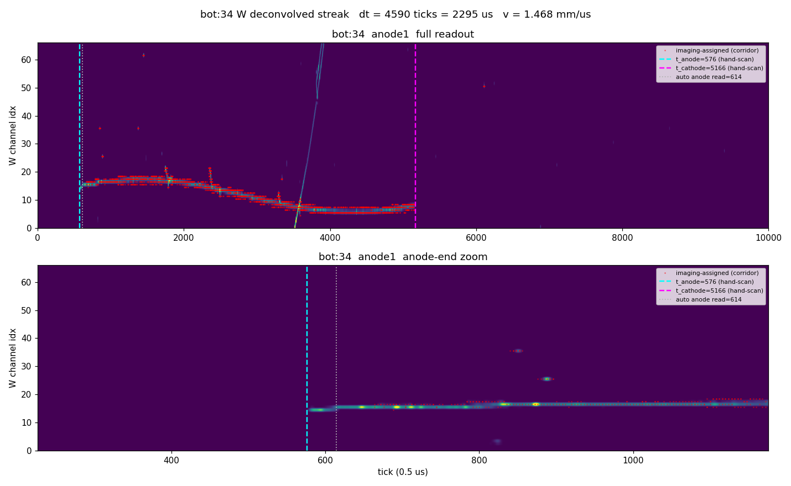
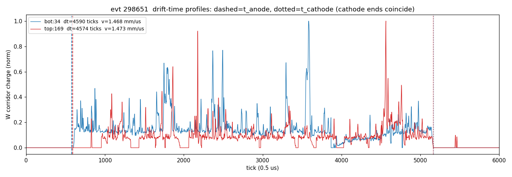

# PDVD drift velocity — imaging-independent cross-check from an anode↔cathode crosser (run 039252 evt 298651)

**Repro**
```
cd pdvd/docs/qlmatch
OMP_NUM_THREADS=4 python3 crosser_drifttime_298651.py
# writes track_298651_xyz.png, wdecon_298651_bot34.png,
#        wdecon_298651_top169.png, driftprofile_298651.png and prints the table below
```
Inputs: `pdvd/work/039252_6_v153/calib-evt298651.json` (Q/L calib dump, `drift_speed=0.153`)
and the deconvolved SP frames `pdvd/work/039252_6/protodune-sp-dnnroi-frames-anode{0..7}.tar.bz2`
(member `frame_gauss<N>_298651.npy`, 1536×10000, tick = 0.5 µs). Wire geometry
`protodunevd-wires-larsoft-v5.json.bz2`.

## Summary

A single golden anode-to-cathode crossing cosmic in evt 298651 gives an
**imaging-independent** drift-velocity measurement of

> **v = 0.14706 cm/µs = 1.471 mm/µs**
> (bot half 0.14680, top half 0.14732 cm/µs)

read directly off the deconvolved **W (collection)** waveform. The endpoint ticks
are the **owner's by-eye hand-scan of the Magnify decon** (`hw_gauss1`,
`hw_gauss5`; the per-anode Magnify ROOT files
`work/039252_6/magnify-run039252-evt6-anode{1,5}-dnnroi.root`), which is the
authoritative read here; the analysis script's automated corridor reads
(614→5148, 606→5149) are kept only as provenance and agree to within a few ticks.

This sits **below** the current data-chain default (0.153), the toolkit default
(0.1568) and the old cathode-pinned convention (0.1586) — all in cm/µs. It is a
**single-track cross-check, not a recalibration**: the two halves agree to
0.0005 cm/µs, but the endpoint read carries an ≈±0.003 cm/µs systematic and this
is one event, so it flags that the data v may sit a few percent low but does not
by itself move the default.

## The track

Q/L match `flash gid=88 (t=364.7 µs, group=89) ← clusters [bot:34, top:169]`,
both bundles flagged `at_cathode`. `bot:34` = calib `apa=0` (bottom crate,
anode 1), 2494 pts; `top:169` = `apa=4` (top crate, anode 5), 1149 pts. The two
clusters are the bottom and top halves of one cosmic that enters the bottom
anode, crosses the full bottom drift, passes the shared cathode, and exits the
top anode — so **each half spans one full drift distance, DFULL = 336.91 cm**
(`u_cathode`, v6 shield-FV geometry).


The X-Z / X-Y panels show the two halves forming one continuous line crossing
x≈0 (the cathode) in the middle. Note `top:169` (red) is visibly **sparser /
broken** in 3-D — its induction-plane SP has gaps — while `bot:34` (blue) is
dense. This is why the drift-time endpoints must be read from the W **collection**
waveform, not from the 3-D imaging points.

## Method and why it is clean

For a collection wire the deconvolved (gauss) trace places a narrow pulse at the
**charge-arrival tick**. Reading the earliest (anode-end) and latest
(cathode-end) charge tick of a half and differencing them gives the full drift
time; with DFULL known, `v = DFULL / (Δt·0.5 µs)`. Two properties make this
robust:

- **v-independent.** The processing drift speed enters only the later tick→x
  conversion, never the waveform. So reading endpoint *ticks* off gauss is **not**
  circular with the v153 (v=0.153) processing — it is an independent measurement.
- **Offset-cancelling.** Δt = t_cathode − t_anode is a *difference*, so the SP
  `ctoffset` and the per-crate trigger offsets cancel. Absolute ticks are
  offset-contaminated and are never used.

Endpoints are read from the charge, guided (not defined) by imaging: the cluster
(y,z) points define a W-channel corridor that rejects the many other cosmics
crossing the same wires at other drift times; within that corridor the endpoint
ticks come from where the gauss charge actually starts and stops. Crucially, at
the anode end we **recover W charge on wires the 3-D imaging never assigned**
(top's induction gaps), by extending the streak into adjacent wires that carry
broad, track-like collection charge.

## Endpoint reads

Owner Magnify hand-scan of the deconvolved W (`hw_gauss<N>`), DFULL = 336.91 cm,
tick = 0.5 µs:

```
half     anode |  t_anode  t_cathode |  dt(ticks)  dt(us)   v(cm/us)  v(mm/us) | auto-read (provenance)
------------------------------------------------------------------------------------------------------
bot:34       1 |     576      5166    |    4590     2295.0   0.14680    1.468   | 614 -> 5148
top:169      5 |     590      5164    |    4574     2287.0   0.14732    1.473   | 606 -> 5164 (anode recovered)
------------------------------------------------------------------------------------------------------
                                                    mean v = 0.14706 cm/us = 1.471 mm/us
```

The automated script read the same ends from the W charge to within a few ticks
(`bot` needing no recovery; `top`'s anode recovered from imaging-missed wires
8873/8874, see below), which is why the two independent routes to the endpoints —
by-eye Magnify and the corridor algorithm — agree.

### bot:34 — imaging captures both ends


The band runs edge-to-edge from the hand-scan t_anode=576 (cyan) to t_cathode=5166
(magenta); the anode-end zoom shows the charge onset right at the cyan line, with
the automated corridor read (614, grey dotted) sitting a few ticks inside. Thin
diagonals crossing the band are other cosmics (rejected by the corridor).
Δt = 4590 ticks → **v = 0.14680 cm/µs (1.468 mm/µs)**.

### top:169 — the anode end is truncated by imaging, recovered from the W charge


The imaging corridor (red dots) stops at tick 961 (grey dotted), but the W
collection charge continues to the hand-scan t_anode=590 — the magenta stars mark
the extra charge on wires **8873, 8874** that the induction-gapped imaging never
assigned to the cluster. Using the imaging corridor alone would give a spuriously
short Δt (v ≈ 0.161 cm/µs); the true charge terminus gives Δt = 4574 ticks →
**v = 0.14732 cm/µs (1.473 mm/µs)**. This is a direct demonstration of exactly the
failure the W-waveform read is meant to avoid.

### Both halves together


The two W-corridor charge profiles: dashed = t_anode, dotted = t_cathode.

## Validity checks

- **Cathode-end coincidence: 2 ticks (1 µs).** bot t_cathode=5166, top=5164. Both
  halves reach the same physical cathode at the same drift time → one cosmic, both
  full-drift, meeting at the cathode.
- **Anode-end coincidence: 14 ticks (7 µs).** bot t_anode=576, top=590. For a
  coincident cosmic read by two crates the two anode ticks should differ by the
  crate **trigger-offset** difference, `trigger_offsets_us = [-2515.34, -2507.74]`
  → 7.6 µs = 15.2 ticks; the observed 14 ticks matches. Both halves reach their
  anodes.
- **Per-half agreement: v_bot=0.14680, v_top=0.14732 cm/µs** — 0.35 %. The two
  halves are independent drift volumes (different crates, different wires) and give
  the same velocity, which is the strongest internal check that the endpoints are
  the true track ends and DFULL is the right distance for both.

## Uncertainty and interpretation

The dominant uncertainty is the endpoint tick read (the steep, diffuse track
ends): a ±30-tick read moves v by ≈ ±0.002 cm/µs. Taking this with the 0.35 %
bot/top spread, **v = 0.1471 ± ~0.003 cm/µs (1.471 ± 0.03 mm/µs)** from this
event. The measurement has real discriminating power — full drift is ~4590 ticks
at 0.1468 vs ~4250 at 0.1586 cm/µs (340 ticks), far larger than the read
precision — but it is one track. Reported as measured; no parameter was tuned
toward any candidate value (CLAUDE.md §5.7).

**The systematic that could fake a low v** is an **endpoint over-extension**:
v below all three candidates means Δt is *large*, which is what reading the
cathode terminus too late or the anode terminus too early would produce. The audit
is therefore "does the track actually *end* at the marked tick," not merely "is
there charge there." This was checked directly in the Magnify decon
(`work/039252_6/magnify-run039252-evt6-anode{1,5}-dnnroi.root`, `hw_gauss1` /
`hw_gauss5`): the owner hand-scanned both W streaks and set the endpoints above
(bot 576→5166, top 590→5164), confirming each band runs cleanly to those termini
and that top's anode-end charge is one connected track (not a detached stub or
crosser). The by-eye reads agree with the automated corridor reads to within a few
ticks, so the low v is a property of the track, not an over-extension artefact.

**Follow-up (not done here):** repeat on the other validated full-drift crossers
(the candle/crosser tags carry several per run) to turn this single cross-check
into a population with a real mean and spread before considering any change to the
1.53 data default. The drift-velocity decision and the SP-side response velocity
remain as recorded in `pdvd-anode-time-consistency.md` §8.12 and the
`project_pdvd_drift_velocity_calib` notes.
