# Raw vs deconvolved W-plane alignment — plot gallery (ctoffset +4 µs vs −5.5 µs)

Generated by `check_raw_decon_alignment.py`. See
`pdvd-anode-time-consistency.md` §8.13 for the write-up.

**How to read each plot.** Gray = raw (post-NF ADC) collection-plane waveform,
left axis. Red = deconvolved (gauss) waveform at **ctoffset = −5.5 µs** (current
production). Blue = deconvolved waveform at **ctoffset = +4 µs** (the reverted
value, obtained by the exact +19-tick roll). Cyan dots (checkpoint event 298567
only) = the deconvolved waveform from a *real* +4 µs reprocess (`_ct4`) — they lie
exactly on the blue curve, proving the roll is exact. Green dashed = raw 50 %
rising edge (charge-arrival reference); gray dotted = raw peak.

The title of each plot reports `d = (gauss_peak − raw_rising_edge)` for both
offsets. **At +4 µs the blue peak sits on the raw pulse (d ≈ +2 µs); at −5.5 µs
the red peak is ~9.5 µs earlier, in flat baseline where there is no raw signal.**

| run | evt | anode | side | d(+4 µs) | d(−5.5 µs) |
|---|---|---|---|---|---|
| 039252 | 298567 | 0 | BDE | +1.57 | −7.93 |
| 039252 | 298567 | 0 | BDE | +1.45 | −8.05 |
| 039252 | 298567 | 4 | TDE | +2.93 | −6.57 |
| 039252 | 298567 | 4 | TDE | +4.06 | −5.44 |
| 039253 | 49686 | 1 | BDE | +1.70 | −7.80 |
| 039253 | 49686 | 1 | BDE | +1.48 | −8.02 |
| 039253 | 49686 | 5 | TDE | +2.21 | −7.29 |
| 039253 | 49686 | 5 | TDE | +2.44 | −7.06 |
| 039349 | 19409 | 2 | BDE | +1.86 | −7.64 |
| 039349 | 19409 | 2 | BDE | +2.06 | −7.44 |
| 039349 | 19409 | 6 | TDE | +2.09 | −7.41 |
| 039349 | 19409 | 6 | TDE | +2.77 | −6.73 |
| **median** | | | | **+2.07 µs** | **−7.43 µs** |

---

## Run 039252, event 298567 (checkpoint — includes the real `_ct4` overlay)

### anode 0 (BDE, bottom crate)
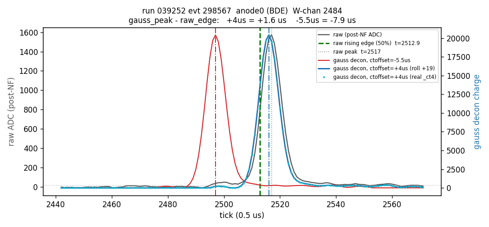
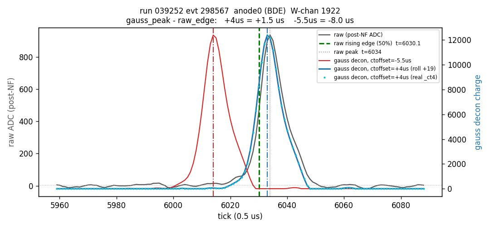

### anode 4 (TDE, top crate)
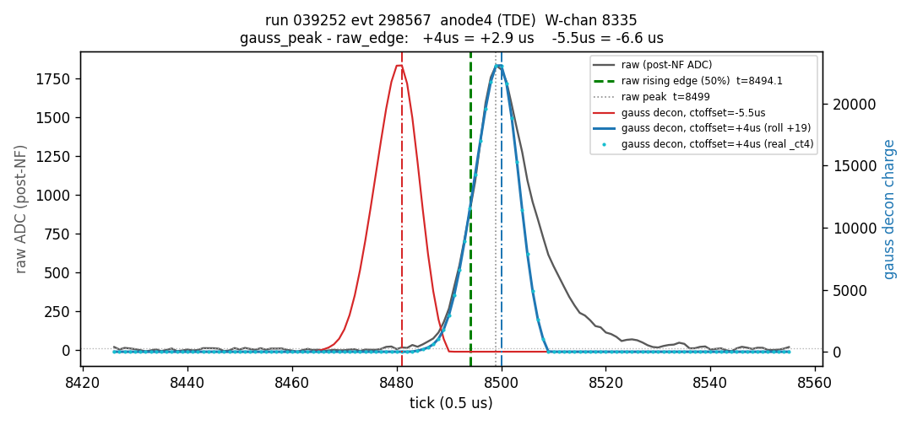
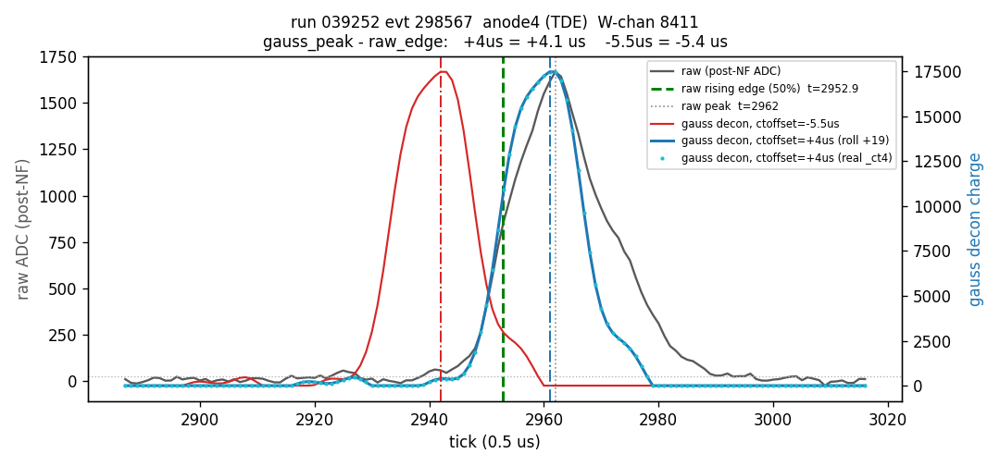

---

## Run 039253, event 49686

### anode 1 (BDE, bottom crate)
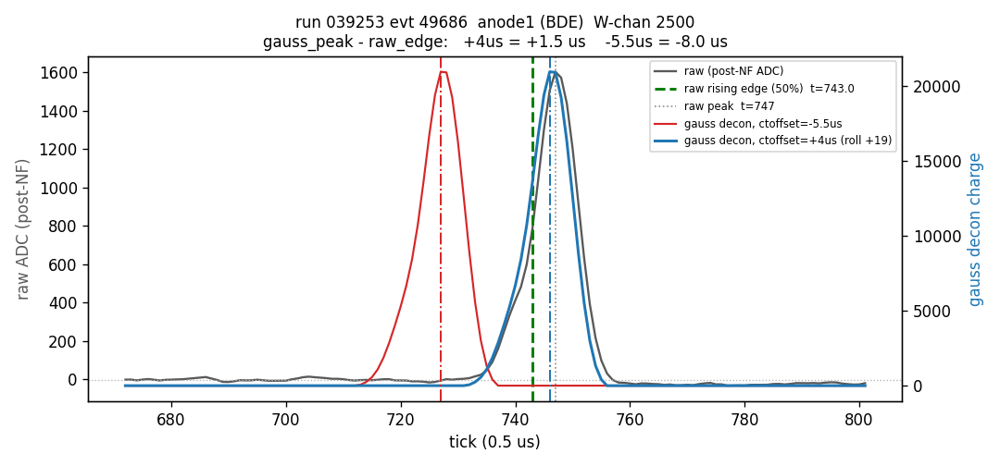
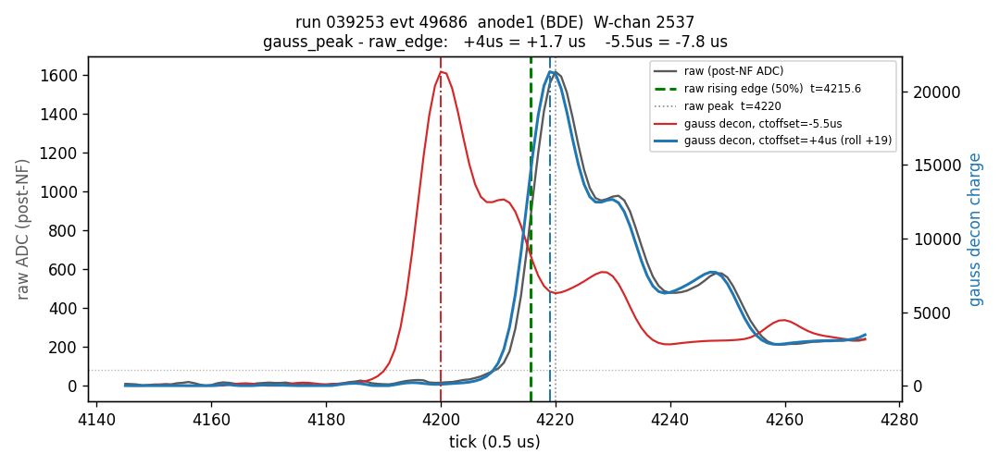

### anode 5 (TDE, top crate)
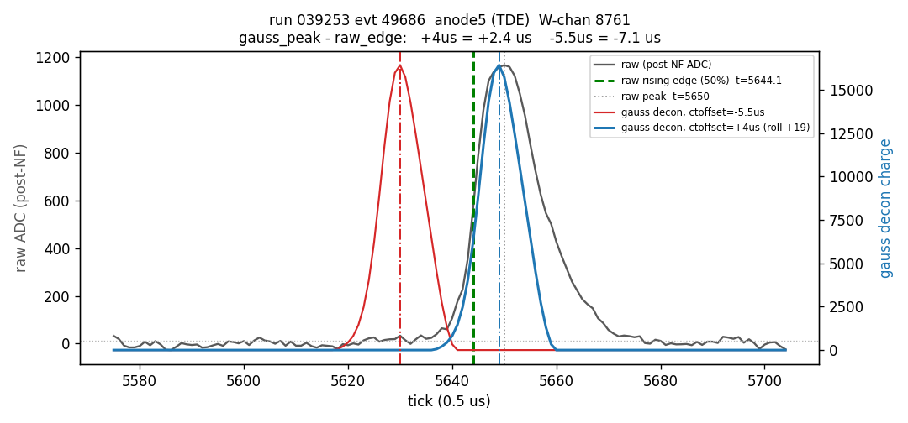
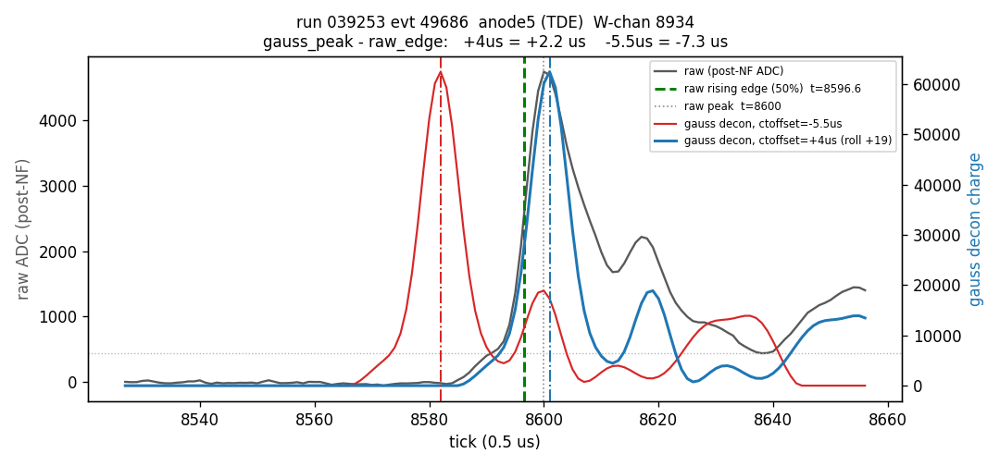

---

## Run 039349, event 19409

### anode 2 (BDE, bottom crate)
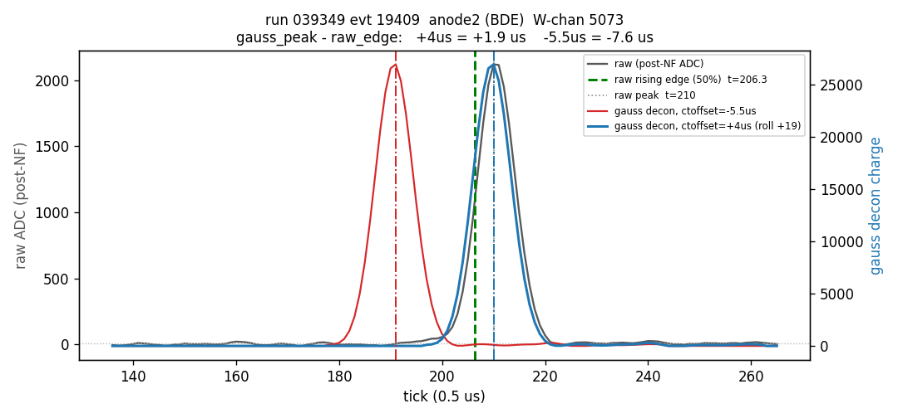
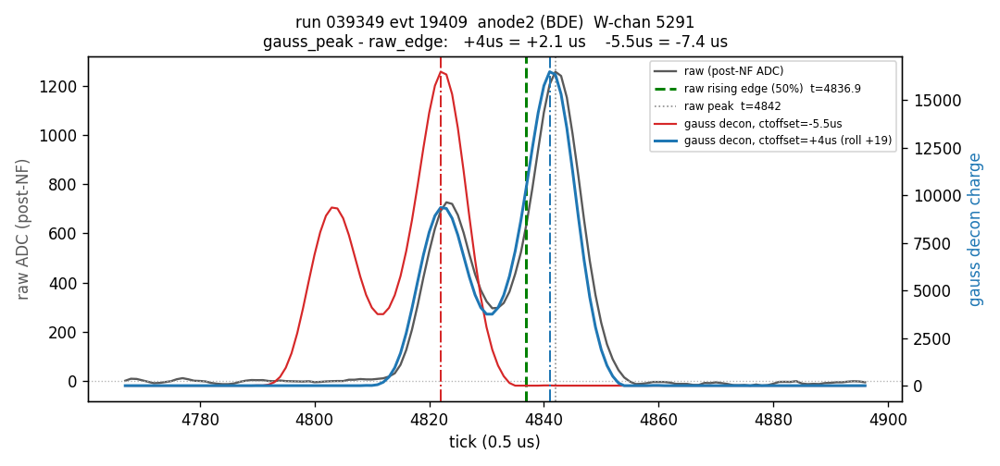

### anode 6 (TDE, top crate)
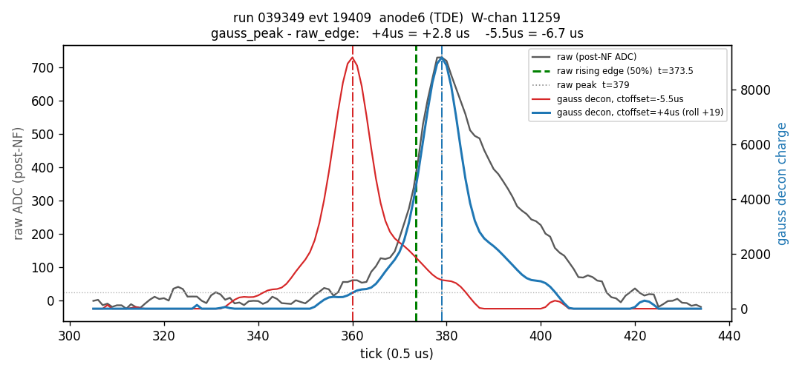
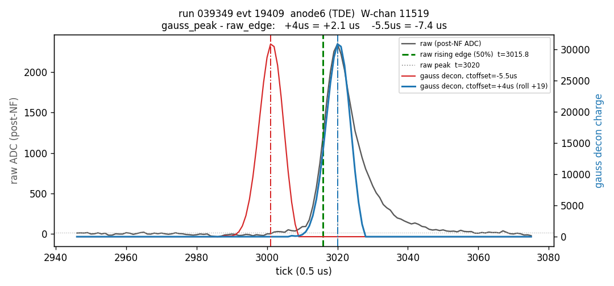
